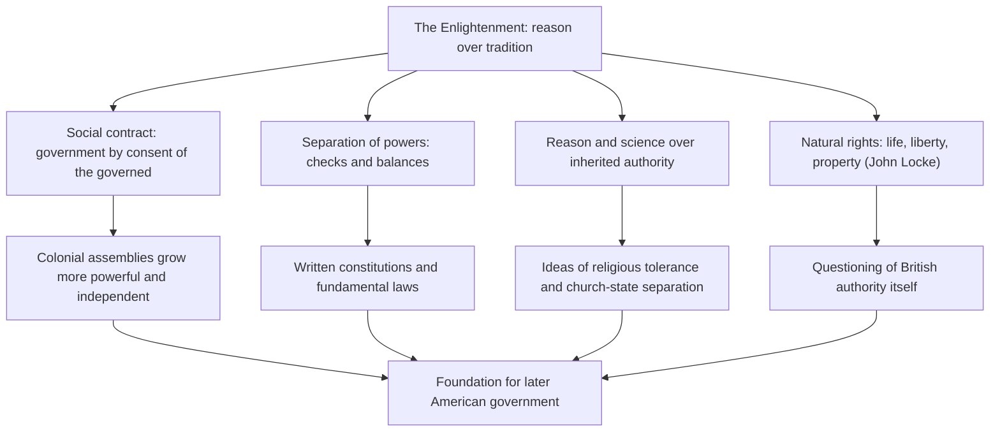

import Callout from '../../components/Callout.astro';
import KeyTerm from '../../components/KeyTerm.astro';
import Collapsible from '../../components/Collapsible.astro';
import Quiz from '../../components/Quiz.astro';
import Flashcards from '../../components/Flashcards.astro';
import Timeline from '../../components/Timeline.astro';
import VisTimeline from '../../components/VisTimeline.astro';
import StepThrough from '../../components/StepThrough.astro';
import TremorCard from '../../components/TremorCard.astro';
import RechartsLine from '../../components/RechartsLine.astro';
import HistoryAnimation from '../../components/HistoryAnimation.astro';
import SpeechBubble from '../../components/SpeechBubble.astro';
import Flag from '../../components/Flag.astro';
import GuideLoader from '../../components/GuideLoader.astro';
import Typewriter from '../../components/Typewriter.astro';
import Particles from '../../components/Particles.astro';
import AuroraBackground from '../../components/AuroraBackground.astro';
import BadFact from '../../components/BadFact.astro';
import MindMap from '../../components/MindMap.astro';
import ReadingProgress from '../../components/ReadingProgress.astro';
import Crossword from '../../components/Crossword.astro';
import Memorize from '../../components/Memorize.astro';
import DragSort from '../../components/DragSort.astro';
import MatchPairs from '../../components/MatchPairs.astro';
import MapDrop from '../../components/MapDrop.astro';
import Poll from '../../components/Poll.astro';
import TestTimer from '../../components/TestTimer.astro';
import Pomodoro from '../../components/Pomodoro.astro';
import Sankey from '../../components/Sankey.astro';
import NivoSunburst from '../../components/NivoSunburst.astro';
import NivoStream from '../../components/NivoStream.astro';
import ShortAnswer from '../../components/ShortAnswer.astro';
import FillInBlanks from '../../components/FillInBlanks.astro';
import DichotomousKey from '../../components/DichotomousKey.astro';
import DocAnnotate from '../../components/DocAnnotate.astro';
import Flipbook from '../../components/Flipbook.astro';
import NumberLine from '../../components/NumberLine.astro';
import BranchingScenario from '../../components/BranchingScenario.astro';
import EChartsGlobe from '../../components/EChartsGlobe.astro';
import G6Graph from '../../components/G6Graph.astro';

<GuideLoader maxSeconds={10} stepPx={700} stepMs={130} />

<ReadingProgress />

  <Particles preset="stars" backgroundColor="#0a0a0a" particleColor="#f87171" height={360} />
  

    
APUSH Unit 2 · Period 2

    <h1 class="font-serif text-4xl md:text-6xl font-bold text-white mb-4">The American Colonies</h1>
    

      <Typewriter text="Thirteen colonies. Three regions. One empire watching from across the sea." speed={45} />
    

    
1607 to 1754

  

<Callout type="insight" title="How to use this guide">
  Built for visual learners. Every concept has a map, chart, animation, or interactive. Scroll slowly, click everything, and let the pictures carry the dates. The text stays short on purpose: the visuals do the heavy lifting. Your test covers Unit 2, and everything here maps to your class statements (Unit 2.2 to 2.7) and AMSCO Chapters 2 and 3.
</Callout>

## The shape of the period

Period 1 ended with Jamestown barely alive in a swamp. Period 2 (1607 to 1754) is the story of what grew from it: **thirteen distinct English colonies**, each shaped by who founded it, why, and where. By 1754 they hold over a million people, run their own assemblies, trade across the whole Atlantic, and have built an economy partly on enslaved labor. The period ends when the French and Indian War begins, because that war will change everything about the colonies' relationship with Britain.

Your test is built on six class statements. Keep them visible the whole way through:

  

2.2

Why the <strong>Spanish, French, Dutch, and British</strong> colonized, and how they compare

  

2.3

<strong>Chesapeake vs New England</strong>, then all three regions: society, politics, religion, economy, settlement, geography

  

2.4

<strong>Transatlantic trade</strong>: the triangular trade and British regulation (Navigation Acts, mercantilism)

  

2.5

<strong>Native Americans and the British</strong>: British actions and native reactions

  

2.6

<strong>Labor</strong>: indentured servants to enslaved Africans, why it changed, and the human cost

  

2.7

<strong>Immigration, the Great Awakening, and the Enlightenment</strong>: the people and ideas that made the colonies American

## Where it all happened

Drag to spin. The glowing arcs are the Atlantic in motion: settlement streams flowing west, and the three-cornered trade that tied four continents into one economy. Every arc on this globe is a test question somewhere below.

<EChartsGlobe
  title="The colonial Atlantic, 1607 to 1754"
  height={520}
  points={[
    { name: "London", lng: -0.1, lat: 51.5, color: "#fca5a5" },
    { name: "Boston", lng: -71.06, lat: 42.36, color: "#c4b5fd" },
    { name: "New York (New Amsterdam until 1664)", lng: -74.0, lat: 40.7, color: "#fdba74" },
    { name: "Philadelphia", lng: -75.16, lat: 39.95, color: "#fdba74" },
    { name: "Jamestown", lng: -76.78, lat: 37.21, color: "#5eead4" },
    { name: "Charleston", lng: -79.93, lat: 32.78, color: "#5eead4" },
    { name: "West African coast (Gold Coast)", lng: -1.35, lat: 5.08, color: "#f87171" },
    { name: "Barbados (sugar islands)", lng: -59.5, lat: 13.1, color: "#f87171" },
    { name: "Quebec (New France)", lng: -71.2, lat: 46.8, color: "#93c5fd" },
    { name: "St. Augustine (New Spain)", lng: -81.31, lat: 29.9, color: "#fda4af" }
  ]}
  arcs={[
    { from: [-0.1, 51.5], to: [-76.78, 37.21], color: "#e5e7eb", value: 5 },
    { from: [-0.1, 51.5], to: [-71.06, 42.36], color: "#e5e7eb", value: 5 },
    { from: [-76.78, 37.21], to: [-0.1, 51.5], color: "#5eead4", value: 7 },
    { from: [-0.1, 51.5], to: [-1.35, 5.08], color: "#fca5a5", value: 6 },
    { from: [-1.35, 5.08], to: [-59.5, 13.1], color: "#dc2626", value: 8 },
    { from: [-59.5, 13.1], to: [-71.06, 42.36], color: "#fbbf24", value: 5 },
    { from: [-71.06, 42.36], to: [-1.35, 5.08], color: "#fbbf24", value: 4 }
  ]}
/>

White arcs: settlers heading west. Teal: colonial raw materials (tobacco, rice, lumber) to Britain. Light red: British manufactured goods to Africa. Deep red: the Middle Passage. Gold: the sugar-molasses-rum loop through New England.

## Master timeline, 1607 to 1754

Scrub through the whole unit once now, then come back after each section and watch the story assemble itself.

<Timeline
  title={{ headline: "Period 2", text: "1607 to 1754: colonies, trade, labor, and awakening" }}
  events={[
    { date: "1607-05-14", headline: "Jamestown founded", text: "The Virginia Company's joint-stock gamble. Swampy site, disease, and the starving time nearly kill it before tobacco saves it." },
    { date: "1619-07-30", headline: "The big year: 1619", text: "The House of Burgesses meets (first representative assembly in America) and the first enslaved Africans arrive in Virginia, in the same summer." },
    { date: "1620-11-11", headline: "Plymouth and the Mayflower Compact", text: "Separatist Pilgrims land off course, outside any government's reach, and sign a compact to govern themselves by majority rule." },
    { date: "1630-06-12", headline: "Massachusetts Bay founded", text: "John Winthrop leads Puritans to build 'a city upon a hill.' The Great Migration brings 15,000 more within a decade." },
    { date: "1634-03-25", headline: "Maryland founded", text: "The Calverts' refuge for Catholics. The Act of Toleration (1649) protects all Christians, a first." },
    { date: "1636-06-01", headline: "Rhode Island and Connecticut", text: "Roger Williams, banished from Massachusetts, founds Providence on full religious liberty. Hooker's Connecticut writes the Fundamental Orders, the first written constitution in America." },
    { date: "1637-05-26", headline: "Pequot War", text: "New England settlers and native allies nearly destroy the Pequot nation. A brutal preview of the pattern." },
    { date: "1651-10-09", headline: "First Navigation Act", text: "Parliament starts regulating colonial trade: British ships, enumerated goods, everything through Britain. Mercantilism gets teeth." },
    { date: "1664-08-27", headline: "New Amsterdam becomes New York", text: "England seizes the Dutch colony without a fight. The Atlantic seaboard is now solidly English." },
    { date: "1675-06-20", headline: "King Philip's War", text: "Metacom's alliance devastates New England towns. Proportionally the deadliest war in American history; native power in New England is broken." },
    { date: "1676-09-19", headline: "Bacon's Rebellion", text: "Frontier ex-servants under Nathaniel Bacon burn Jamestown. Terrified planters begin replacing indentured servants with enslaved Africans." },
    { date: "1681-03-04", headline: "Pennsylvania founded", text: "William Penn's Quaker 'Holy Experiment': religious tolerance, fair dealings with natives, and the best-advertised colony in America." },
    { date: "1688-12-11", headline: "Glorious Revolution ripples over", text: "England deposes James II; colonists topple the Dominion of New England and its governor Andros. Lesson learned: unpopular rule can be resisted." },
    { date: "1733-01-13", headline: "Georgia, the last colony", text: "Oglethorpe's buffer colony against Spanish Florida. The same year, the Molasses Act invites a golden age of smuggling." },
    { date: "1735-08-04", headline: "Zenger verdict", text: "A New York jury acquits printer John Peter Zenger of libel because what he printed was true. Freedom of the press takes root." },
    { date: "1739-09-09", headline: "Stono Rebellion and Whitefield's tour", text: "Enslaved South Carolinians rise near the Stono River; the colony answers with a harsher slave code. Meanwhile George Whitefield's preaching tour electrifies the colonies." },
    { date: "1741-07-08", headline: "Sinners in the Hands of an Angry God", text: "Jonathan Edwards's sermon marks the peak of the Great Awakening: emotional religion, new denominations, and a first shared American experience." },
    { date: "1754-05-28", headline: "The French and Indian War begins", text: "A Virginia colonel named George Washington skirmishes with the French in the Ohio country. Period 2 ends; the road to revolution opens." }
  ]}
/>

## Learning objectives

By the end of this guide you will be able to:

- Compare the motivations, methods, regions, and character of **Spanish, French, Dutch, and British** colonization, and name what all four shared.
- Contrast the **Chesapeake and New England** colonies across social structure, political development, religion, economics, settlement, and geography.
- Describe the development of all **three colonial regions** (New England, Middle, Southern) and place all thirteen colonies on a map.
- Diagram the **triangular trade** and explain how Britain regulated colonial commerce (Navigation Acts, mercantilism, enumerated goods) and how colonists responded.
- Track **British actions toward Native Americans** and the four main **native reactions**, with King Philip's War and Bacon's Rebellion as your evidence.
- Explain the **shift from indentured servitude to race-based slavery**: the types of labor, the reasons for change (especially Bacon's Rebellion), and the impact on the laborers themselves.
- Describe how **immigration** (English, Scots-Irish, German, African) shaped colonial society.
- Explain the causes and impact of the **Great Awakening** and the influence of the **Enlightenment** on colonial politics.

## TL;DR

Four European powers ran four different colonial models: **Spain** conquered and converted (missions, encomienda, the Southwest and Florida), **France** traded and allied (furs, missionaries, the Great Lakes and Mississippi), the **Dutch** built a commercial port (New Amsterdam, patroons, tolerance for profit), and the **British** planted permanent settler colonies of families and farms along the Atlantic. Within British America, the **Chesapeake** (tobacco, plantations, House of Burgesses, unhealthy and male-heavy) and **New England** (Puritan towns, family farms, town meetings, healthy and stable) grew into opposites, with the diverse, grain-growing **Middle colonies** in between. The whole coast plugged into a **transatlantic economy**: raw materials east, manufactured goods and enslaved people west, all regulated by **Navigation Acts** under the theory of **mercantilism**, loosely enforced (**salutary neglect**) and widely smuggled around. Relations with Native Americans ran from trade to catastrophe: **King Philip's War** (1675-76) broke native power in New England, and **Bacon's Rebellion** (1676) pushed planters to swap **indentured servants** for **enslaved Africans**, locked in by race-based **slave codes**. Meanwhile immigration (Scots-Irish, Germans, forced African migration) diversified the colonies, the **Great Awakening** (Edwards, Whitefield) gave them their first shared emotional experience and a habit of questioning authority, and the **Enlightenment** (Locke's natural rights, the social contract) gave their assemblies a political vocabulary they would use in Unit 3.

## Glossary

Every one of these can appear on your test. Hover each card, then hit the flashcards at the end until they are automatic.

<KeyTerm term="Joint-stock company">A business that pools money from many investors who share profit and risk. The Virginia Company funded Jamestown this way: colonization as a startup, not a royal project.</KeyTerm>

<KeyTerm term="House of Burgesses (1619)">Virginia's elected lawmaking body, the first representative assembly in English America. Proof that self-government arrived with the first generation.</KeyTerm>

<KeyTerm term="Headright system">Fifty acres of land granted for each person whose passage to Virginia you paid. It rewarded importing laborers and built up large landholders.</KeyTerm>

<KeyTerm term="Indentured servant">A worker, usually a young English man or woman, who signed away four to seven years of labor to repay the cost of passage to America. The Chesapeake's main labor source before slavery.</KeyTerm>

<KeyTerm term="Mayflower Compact (1620)">The Pilgrims' shipboard agreement to form a government and obey laws made by majority rule. A foundational document of self-government by consent.</KeyTerm>

<KeyTerm term="Puritans vs Separatists">Puritans wanted to purify the Church of England from within; Separatists (the Plymouth Pilgrims) gave up and left it entirely. Both were Calvinists; the difference is whether they stayed in the church.</KeyTerm>

<KeyTerm term="City upon a hill">John Winthrop's 1630 image for Massachusetts Bay: a model Christian community the whole world would watch. The mission statement of the Puritan colonies.</KeyTerm>

<KeyTerm term="Fundamental Orders of Connecticut (1639)">The first written constitution in America, drafted by Thomas Hooker's Connecticut settlers. Government by written fundamental law starts here.</KeyTerm>

<KeyTerm term="Act of Toleration (1649)">Maryland's law protecting all Christians' worship (while prescribing death for non-Christians who denied Jesus). Passed to protect the Catholic minority the colony was founded for.</KeyTerm>

<KeyTerm term="Patroon system">Dutch land-grant system in the Hudson Valley: huge estates for anyone who brought fifty settlers. New Netherland's aristocratic streak.</KeyTerm>

<KeyTerm term="Holy Experiment">William Penn's plan for Pennsylvania: religious freedom, no established church, fair treatment of natives, and cheap land. It made Pennsylvania the fastest-growing and most diverse colony.</KeyTerm>

<KeyTerm term="Mercantilism">The theory that colonies exist to enrich the mother country: supply raw materials, buy finished goods, and keep gold inside the empire. The logic behind every trade law Britain passed.</KeyTerm>

<KeyTerm term="Navigation Acts (1651-1673)">Parliament's trade rules: colonial trade must use British ships, certain enumerated goods may be sold only to Britain, and imports must pass through British ports. Loosely enforced, widely resented, routinely smuggled around.</KeyTerm>

<KeyTerm term="Enumerated goods">The listed products (tobacco first among them) that colonists could legally ship only to Britain, whatever better prices other buyers offered.</KeyTerm>

<KeyTerm term="Triangular trade">The three-cornered Atlantic circuit: colonial raw materials to Europe, European manufactured goods to Africa, enslaved Africans to the Americas. In New England's version: molasses in, rum out, people in chains across the middle.</KeyTerm>

<KeyTerm term="Middle Passage">The horrific ocean crossing of enslaved Africans packed into slave ships. Mortality commonly ran 10 to 20 percent. The human center of the triangular trade.</KeyTerm>

<KeyTerm term="Salutary neglect">Britain's long habit of not enforcing its own trade laws. Colonists grew used to running their own affairs, which made later enforcement (Unit 3) feel like tyranny.</KeyTerm>

<KeyTerm term="King Philip's War (1675-76)">Metacom's alliance of New England tribes against the settlers. Per capita the deadliest war in American history; it ended organized native resistance in New England.</KeyTerm>

<KeyTerm term="Bacon's Rebellion (1676)">Frontier farmers and freed servants under Nathaniel Bacon, furious over native raids and Governor Berkeley's inaction, burned Jamestown. It scared planters away from indentured labor and toward enslaved Africans.</KeyTerm>

<KeyTerm term="Slave codes">Colonial laws that made slavery permanent, hereditary through the mother, and racial. They converted a labor system into a caste system.</KeyTerm>

<KeyTerm term="Stono Rebellion (1739)">The largest slave uprising of the colonial period, near the Stono River in South Carolina. It was crushed, and South Carolina answered with a far harsher slave code.</KeyTerm>

<KeyTerm term="Scots-Irish">Presbyterian migrants from northern Ireland who settled the frontier backcountry, from Pennsylvania down the Appalachian valleys. Tough, land-hungry, and suspicious of governments.</KeyTerm>

<KeyTerm term="Great Awakening (1730s-40s)">The wave of emotional religious revivals led by Jonathan Edwards and George Whitefield. New denominations, new colleges, a habit of challenging established authority, and the first experience shared by all thirteen colonies.</KeyTerm>

<KeyTerm term="New Lights vs Old Lights">Revival supporters (New Lights) against defenders of the traditional established churches (Old Lights). The split birthed new Baptist and Presbyterian congregations and new colleges to train each side's ministers.</KeyTerm>

<KeyTerm term="Enlightenment">The 17th-18th century movement applying reason to government and society. Locke's natural rights and social contract gave colonists the argument that government exists by consent, to protect life, liberty, and property.</KeyTerm>

<KeyTerm term="Zenger case (1735)">New York printer John Peter Zenger, tried for libeling the governor, acquitted because what he printed was true. The colonial landmark for freedom of the press.</KeyTerm>

---

# Section 1 · Four Empires, Four Blueprints

  
Class statement 2.2

  <h2 class="font-serif text-3xl md:text-5xl font-bold text-white mb-2">Why Each Power Came</h2>
  
Spain, France, the Netherlands, and Britain all wanted wealth, empire, faith, and discovery. How they pursued those goals could not have been more different.

## 1.1 The similarities first

Your class statement asks for similarities AND differences. Lock in the four shared motives, then learn each power's twist.

  <TremorCard label="Shared motive 1" value="Economic gain" helper="Every power wanted wealth: gold, furs, crops, or trade profits." />
  <TremorCard label="Shared motive 2" value="Empire" helper="Colonies meant power and prestige in Europe's endless rivalries." />
  <TremorCard label="Shared motive 3" value="Religion" helper="Catholic missions for Spain and France; Protestant refuges and missions for the Dutch and British." />
  <TremorCard label="Shared motive 4" value="Exploration" helper="New territories, new routes, and the lingering dream of a Northwest Passage." />

## 1.2 The four blueprints

  

    

      <Flag code="ES" size={36} />
      <h3 class="font-serif text-xl font-bold text-accent-900 dark:text-accent-100">Spain: conquer and convert</h3>
    

    <ul class="space-y-2 text-sm text-ink-800 dark:text-ink-200">
      <li><strong>Motivations:</strong> the 3 G's (gold, glory, God); spread Christianity; build an empire</li>
      <li><strong>Methods:</strong> conquistadors, missions, the encomienda system</li>
      <li><strong>Regions:</strong> the Southwest (California, Texas, New Mexico) and Florida</li>
      <li><strong>Character:</strong> military conquest, forced conversion, extraction of wealth</li>
    </ul>
    
Natives absorbed by force, at the bottom of a caste system

  

  

    

      <Flag code="FR" size={36} />
      <h3 class="font-serif text-xl font-bold text-blue-900 dark:text-blue-100">France: trade and ally</h3>
    

    <ul class="space-y-2 text-sm text-ink-800 dark:text-ink-200">
      <li><strong>Motivations:</strong> the fur trade, spreading Catholicism, finding a Northwest Passage</li>
      <li><strong>Methods:</strong> trading posts, Jesuit missions, alliances with Native Americans</li>
      <li><strong>Regions:</strong> the Great Lakes, the Mississippi River Valley, Canada</li>
      <li><strong>Character:</strong> cooperative native relationships, small settlements, few colonists</li>
    </ul>
    
Best native relations of the four, by economic self-interest

  

  

    

      <Flag code="NL" size={36} />
      <h3 class="font-serif text-xl font-bold text-amber-900 dark:text-amber-100">Dutch: the company town</h3>
    

    <ul class="space-y-2 text-sm text-ink-800 dark:text-ink-200">
      <li><strong>Motivations:</strong> trade and profit, plus practical religious tolerance</li>
      <li><strong>Methods:</strong> trading companies, above all the <strong>Dutch West India Company</strong></li>
      <li><strong>Regions:</strong> New Amsterdam (later New York) and the Hudson River Valley</li>
      <li><strong>Character:</strong> a diverse port population, commerce first, the patroon land system</li>
    </ul>
    
A business venture wearing a colony's clothes; England takes it in 1664

  

  

    

      <Flag code="GB" size={36} />
      <h3 class="font-serif text-xl font-bold text-ink-900 dark:text-ink-100">Britain: settle and stay</h3>
    

    <ul class="space-y-2 text-sm text-ink-800 dark:text-ink-200">
      <li><strong>Motivations:</strong> economic opportunity, religious freedom, population pressure at home</li>
      <li><strong>Methods:</strong> joint-stock companies, royal charters, individual proprietors</li>
      <li><strong>Regions:</strong> the Atlantic coast, Georgia up to Maine</li>
      <li><strong>Character:</strong> permanent settlements, family migration, farms and towns</li>
    </ul>
    
The only model built on mass settlement: that is why English won the continent

  

<Callout type="insight" title="The comparison in one sentence">
  Spain sent soldiers and priests, France sent traders, the Dutch sent a corporation, and Britain sent <strong>families</strong>. Population is destiny: by 1754 New France held roughly 70,000 colonists while British America held well over a million. When the empires finally collided (Unit 3), that ratio decided it.
</Callout>

<Poll
  question="It is 1650 and you must join one empire's American venture. Which blueprint would you actually pick?"
  options={["Spain: mission and mine", "France: canoe and fur post", "Dutch: Manhattan trading floor", "Britain: farm and family"]}
  storageKey="apush-u2-empire-poll"
/>

## 1.3 Which empire am I?

Read the clue, answer yes or no, and let the key classify the colonizer. The exam frames this exact skill as stimulus questions: traits first, names second.

<DichotomousKey
  title="Identify the colonial power from its traits"
  yesLabel="Yes"
  noLabel="No"
  tree={{
    question: "Did this power rely mainly on conquistadors, missions, and forced native labor?",
    yes: { result: "Spain", note: "Military conquest, forced conversion, and wealth extraction in the Southwest and Florida. The encomienda and mission systems are the tell." },
    no: {
      question: "Did it depend on the fur trade and military alliances with native nations?",
      yes: { result: "France", note: "Trading posts and missions through the Great Lakes, Canada, and the Mississippi Valley. Few colonists, cooperative relations." },
      no: {
        question: "Was it run by a trading company from a single diverse port on the Hudson?",
        yes: { result: "The Netherlands", note: "The Dutch West India Company's New Amsterdam: commerce, diversity, patroon estates. Seized by England in 1664." },
        no: { result: "Britain", note: "Joint-stock companies, royal charters, and proprietors planting permanent family-based farming settlements along the Atlantic coast." }
      }
    }
  }}
/>

## Section 1 self-quiz

<Quiz
  title="Four empires"
  questions={[
    {
      q: "Which motivation was shared by ALL FOUR colonizing powers?",
      choices: [
        "Establishing havens for persecuted religious dissenters",
        "The desire for economic gain and expansion of empire",
        "Converting Native Americans through mission systems",
        "Finding and controlling a Northwest Passage to Asia"
      ],
      answer: 1,
      explain: "Your class statement lists the shared motives: economic gain, expansion of empire, religious motivations, and exploration. Havens for dissenters were mostly a British twist; missions were mostly Spanish and French."
    },
    {
      q: "The encomienda system, conquistadors, and forced conversion are the signature methods of",
      choices: ["Spanish colonization", "French colonization", "Dutch colonization", "British colonization"],
      answer: 0,
      explain: "Spain's model: military conquest, missions, and extraction of native labor and wealth, centered in the Southwest and Florida."
    },
    {
      q: "French colonization produced comparatively good relations with Native Americans mainly because the French",
      choices: [
        "signed a permanent treaty of alliance with every nation they met",
        "refused on religious principle to carry firearms into the interior",
        "needed native partners for the fur trade and settled in small numbers",
        "purchased all the land they occupied at prices natives proposed"
      ],
      answer: 2,
      explain: "Fur-trade partnerships plus tiny settlements meant the French threatened native land far less than British farms did. Self-interest, not saintliness."
    },
    {
      q: "The Dutch West India Company, the patroon system, and a famously diverse port describe",
      choices: ["New France", "New Spain", "New England", "New Netherland"],
      answer: 3,
      explain: "New Amsterdam and the Hudson Valley: a commercial venture run for profit, with huge patroon estates and every language of Europe on its docks. England took it bloodlessly in 1664."
    },
    {
      q: "British colonization differed from the other three powers most fundamentally in its",
      choices: [
        "complete lack of interest in converting Native Americans",
        "mass migration of families building permanent farm settlements",
        "exclusive reliance on royal funding for every new colony",
        "decision to colonize only islands rather than the mainland"
      ],
      answer: 1,
      explain: "Joint-stock companies, charters, and proprietors moved whole families across the Atlantic to farm and stay. Settlement at scale is the British difference, and the reason English America outgrew everyone."
    },
    {
      q: "Which pairing of power and region is correct?",
      choices: [
        "France: the Southwest and Florida",
        "Spain: the Hudson River Valley",
        "Britain: the Great Lakes and Mississippi Valley",
        "The Dutch: New Amsterdam and the Hudson Valley"
      ],
      answer: 3,
      explain: "Spain took the Southwest and Florida, France the Great Lakes, Canada, and the Mississippi, the Dutch the Hudson, and Britain the Atlantic coast from Georgia to Maine."
    }
  ]}
/>

---

# Section 2 · Two Englands, Then Three Regions

  
Class statement 2.3

  <h2 class="font-serif text-3xl md:text-5xl font-bold text-white mb-2">Chesapeake vs New England</h2>
  
Same crown, same language, same century. Two completely different societies, because different people came for different reasons to different land.

## 2.1 Jamestown: the near-death startup

The Chesapeake begins with a business plan. Click through how it almost failed and what actually saved it.

<StepThrough
  title="Jamestown, 1607 to 1619"
  steps={[
    {
      html: `

📜
<h3 style="font-family:serif;font-size:22px;margin-bottom:8px;color:#b91c1c;">1. A joint-stock gamble</h3>
The <strong>Virginia Company</strong>, a joint-stock company chartered by King James I, funds the venture. Investors expect gold and a quick profit. The 104 colonists include far too many gentlemen and far too few farmers.

`,
      caption: "Colonization as a startup: investor-funded, profit-driven."
    },
    {
      html: `

💀
<h3 style="font-family:serif;font-size:22px;margin-bottom:8px;color:#b91c1c;">2. The starving time</h3>
A swampy site breeds disease; gold-hunting replaces planting. In the winter of <strong>1609-10</strong> the colony falls from about 500 people to about 60. Only resupply ships keep Jamestown on the map.

`,
      caption: "Malaria, brackish water, and no crops nearly end the story."
    },
    {
      html: `

🪖
<h3 style="font-family:serif;font-size:22px;margin-bottom:8px;color:#b91c1c;">3. Discipline: John Smith</h3>
Captain <strong>John Smith</strong> imposes order with one rule: <em>"He that will not work shall not eat."</em> Military discipline plus uneasy trade with the Powhatan Confederacy buys the colony time.

`,
      caption: "Survival first. Profit will need a different answer."
    },
    {
      html: `

🌿
<h3 style="font-family:serif;font-size:22px;margin-bottom:8px;color:#b91c1c;">4. Salvation: tobacco</h3>
<strong>John Rolfe</strong> perfects a sweet strain of tobacco around 1612. Europe is instantly addicted. Virginia finally has its gold, and it grows in fields, which means the colony now needs <strong>land and labor</strong> above all things.

`,
      caption: "One cash crop sets the Chesapeake's entire social structure."
    },
    {
      html: `

🏛️
<h3 style="font-family:serif;font-size:22px;margin-bottom:8px;color:#b91c1c;">5. 1619: the fateful year</h3>
In one summer Virginia gets the <strong>House of Burgesses</strong> (the first representative assembly in English America) and the <strong>first enslaved Africans</strong> arrive on a Dutch ship. Self-government and slavery enter American history together.

`,
      caption: "Remember 1619 twice: representative government AND the first Africans."
    }
  ]}
  height={330}
/>

<Callout type="warning" title="How 1619 gets tested">
  A favorite trap pairs the House of Burgesses with New England. It is <strong>Virginia</strong>, 1619, elected, and it met before the Pilgrims even sailed. If the question says "first representative assembly," the answer lives in the Chesapeake.
</Callout>

## 2.2 New England: colonies of conscience

The Chesapeake was founded for profit. New England was founded by religious dissenters building godly communities, and every difference between the regions flows from that.

  

    
1620 · Plymouth

    <h3 class="font-serif text-xl font-bold text-violet-900 dark:text-violet-100 mb-2">Pilgrims (Separatists)</h3>
    <ul class="space-y-2 text-sm text-ink-800 dark:text-ink-200 list-disc list-inside">
      <li>Gave up on reforming the Church of England and <strong>separated</strong> from it entirely</li>
      <li>Blown off course, they landed <strong>outside any charter's authority</strong></li>
      <li>So they signed the <strong>Mayflower Compact</strong>: government by consent, laws by majority rule</li>
      <li>Half died the first winter; Wampanoag help (Squanto) saved the rest</li>
    </ul>
  

  

    
1630 · Massachusetts Bay

    <h3 class="font-serif text-xl font-bold text-violet-900 dark:text-violet-100 mb-2">Puritans</h3>
    <ul class="space-y-2 text-sm text-ink-800 dark:text-ink-200 list-disc list-inside">
      <li>Wanted to <strong>purify</strong> the Church of England from within, not leave it</li>
      <li>Led by <strong>John Winthrop</strong>: Massachusetts would be <strong>"a city upon a hill"</strong>, a model for the world</li>
      <li>The <strong>Great Migration</strong> (1630s) brought about 15,000 settlers, in family units</li>
      <li>Church membership and town meetings intertwined: a near-theocracy with wide (male church member) participation</li>
    </ul>
  

<Callout type="note" title="Dissenters make more colonies">
  Massachusetts exiled its own troublemakers, and the exiles built the rest of New England. <strong>Roger Williams</strong> (banished 1635) founded <strong>Rhode Island</strong> on full religious liberty and separation of church and state. <strong>Anne Hutchinson</strong>, banished for claiming direct revelation and challenging ministers, followed him. <strong>Thomas Hooker</strong> led his congregation to <strong>Connecticut</strong>, whose <strong>Fundamental Orders (1639)</strong> became America's first written constitution. Tolerance in New England was born from intolerance.
</Callout>

## 2.3 The head-to-head table

Your class statement names six lenses. Here they are, side by side. If you master one comparison in this unit, make it this one.

  

    <h3 class="font-serif text-2xl font-bold text-teal-900 dark:text-teal-100 mb-3">🌿 Chesapeake</h3>
    <ul class="space-y-2.5 text-sm text-ink-800 dark:text-ink-200">
      <li><strong>Social structure:</strong> plantation elite on top, indentured servants below, later enslaved Africans; men far outnumbered women; short life expectancy</li>
      <li><strong>Political development:</strong> House of Burgesses (1619); royal colonies dominated by the planter class</li>
      <li><strong>Culture and religion:</strong> Anglican Church established; religious tolerance in Maryland (Act of Toleration, 1649)</li>
      <li><strong>Economics:</strong> tobacco cultivation, a cash-crop economy hungry for land and labor</li>
      <li><strong>Settlement:</strong> scattered plantations strung along rivers; few towns or schools</li>
      <li><strong>Geography:</strong> warm climate, fertile soil, navigable rivers (and disease-friendly lowlands)</li>
    </ul>
  

  

    <h3 class="font-serif text-2xl font-bold text-violet-900 dark:text-violet-100 mb-3">⛪ New England</h3>
    <ul class="space-y-2.5 text-sm text-ink-800 dark:text-ink-200">
      <li><strong>Social structure:</strong> more egalitarian Puritan communities of families; long, healthy lives; population grew by births, not just arrivals</li>
      <li><strong>Political development:</strong> town meetings, the Mayflower Compact, and church-linked government verging on theocracy</li>
      <li><strong>Culture and religion:</strong> Puritan Protestantism; education prized (Harvard, 1636, to train ministers; town schools by law)</li>
      <li><strong>Economics:</strong> subsistence farming plus fishing, shipbuilding, lumber, and trade</li>
      <li><strong>Settlement:</strong> compact towns and villages built around church and common</li>
      <li><strong>Geography:</strong> rocky soil, harsh winters, excellent harbors</li>
    </ul>
  

  <TremorCard label="Who migrated" value="6:1 vs families" helper="Chesapeake arrivals ran roughly six men per woman; New England came as complete families." />
  <TremorCard label="Life expectancy" value="~45 vs ~70" helper="Chesapeake disease environment vs New England's cold, clean-water towns. Half of Chesapeake children lost a parent; New Englanders met their grandchildren." />
  <TremorCard label="Organizing idea" value="Profit vs purity" helper="A tobacco economy built around staple exports vs covenanted communities built around the church." />

## 2.4 Zoom out: the three regions

By 1733 there are thirteen colonies, and the exam sorts them into three regions. The wheel below uses your class map colors: purple New England, orange Middle, teal Southern. Click a region to zoom.

<NivoSunburst
  title="Thirteen colonies, three regions"
  data={{
    name: "British America",
    children: [
      {
        name: "New England",
        color: "#7c3aed",
        children: [
          { name: "New Hampshire", value: 1 },
          { name: "Massachusetts", value: 1 },
          { name: "Rhode Island", value: 1 },
          { name: "Connecticut", value: 1 }
        ]
      },
      {
        name: "Middle",
        color: "#ea580c",
        children: [
          { name: "New York", value: 1 },
          { name: "New Jersey", value: 1 },
          { name: "Pennsylvania", value: 1 },
          { name: "Delaware", value: 1 }
        ]
      },
      {
        name: "Southern",
        color: "#0d9488",
        children: [
          { name: "Maryland", value: 1 },
          { name: "Virginia", value: 1 },
          { name: "North Carolina", value: 1 },
          { name: "South Carolina", value: 1 },
          { name: "Georgia", value: 1 }
        ]
      }
    ]
  }}
  height={460}
/>

### The three-region cards

Each card follows your class statement's six lenses. The Southern card includes the Chesapeake.

  

    <h3 class="font-serif text-xl font-bold text-violet-900 dark:text-violet-100 mb-3">New England</h3>
    <ul class="space-y-2 text-sm text-ink-800 dark:text-ink-200">
      <li><strong>Social:</strong> Puritan communities; family and education central</li>
      <li><strong>Political:</strong> town meetings, representative assemblies</li>
      <li><strong>Religion:</strong> Puritan work ethic; Harvard College (1636)</li>
      <li><strong>Economy:</strong> mixed: farming, fishing, lumber, shipbuilding</li>
      <li><strong>Settlement:</strong> towns built around churches and commons</li>
      <li><strong>Geography:</strong> rocky soil, forests, harbors</li>
    </ul>
  

  

    <h3 class="font-serif text-xl font-bold text-orange-900 dark:text-orange-100 mb-3">Middle</h3>
    <ul class="space-y-2 text-sm text-ink-800 dark:text-ink-200">
      <li><strong>Social:</strong> the most diverse region; religious tolerance</li>
      <li><strong>Political:</strong> proprietary colonies with elected assemblies</li>
      <li><strong>Religion:</strong> pluralism: Quakers, Catholics, Jews, Lutherans, and more</li>
      <li><strong>Economy:</strong> the "breadbasket": wheat, grain, and trade</li>
      <li><strong>Settlement:</strong> real cities: Philadelphia and New York</li>
      <li><strong>Geography:</strong> fertile soil, moderate climate, big rivers</li>
    </ul>
  

  

    <h3 class="font-serif text-xl font-bold text-teal-900 dark:text-teal-100 mb-3">Southern (incl. Chesapeake)</h3>
    <ul class="space-y-2 text-sm text-ink-800 dark:text-ink-200">
      <li><strong>Social:</strong> plantation aristocracy over a large enslaved population</li>
      <li><strong>Political:</strong> government controlled by the planter elite</li>
      <li><strong>Religion:</strong> Anglican Church; a culture of honor and hierarchy</li>
      <li><strong>Economy:</strong> cash crops (tobacco, rice, indigo) worked by enslaved labor</li>
      <li><strong>Settlement:</strong> scattered plantations, few cities</li>
      <li><strong>Geography:</strong> warm climate, fertile coastal plains</li>
    </ul>
  

<Callout type="tip" title="Middle colonies = middle in every sense">
  Geography between the other two regions, economy between subsistence and plantation, society between homogeneous and hierarchical. If a question describes diversity, tolerance, wheat, or Philadelphia, the answer is the Middle colonies. William Penn's Quaker <strong>Holy Experiment</strong> is the region's signature story.
</Callout>

### Pin the colonies on the map

The same map as your class worksheet. Drop each colony where it belongs; chips are tinted by region. For the full lab (settlements, rivers, and rival empires), open the [13 Colonies Map Lab](/guides/colonial-map) after this guide.

<MapDrop
  title="Place the 13 colonies"
  note="Test yourself: no hints until you check. Purple New England, orange Middle, teal Southern."
  image="/colonial-map-blank.png"
  alt="Blank 13 British Colonies map with drop zones over each colony"
  zones={[
    { x: 81.9, y: 19.1, label: "New Hampshire", short: "NH", group: "ne" },
    { x: 83.5, y: 29.3, label: "Massachusetts", short: "MA", group: "ne" },
    { x: 89.1, y: 31.2, label: "Rhode Island", short: "RI", group: "ne" },
    { x: 83.5, y: 32.8, label: "Connecticut", short: "CT", group: "ne" },
    { x: 66.3, y: 33.7, label: "New York", short: "NY", group: "mid" },
    { x: 76.2, y: 40.4, label: "New Jersey", short: "NJ", group: "mid" },
    { x: 66.4, y: 38.2, label: "Pennsylvania", short: "PA", group: "mid" },
    { x: 73.6, y: 45.4, label: "Delaware", short: "DE", group: "mid" },
    { x: 67.0, y: 46.0, label: "Maryland", short: "MD", group: "south" },
    { x: 64.6, y: 53.0, label: "Virginia", short: "VA", group: "south" },
    { x: 60.9, y: 61.8, label: "North Carolina", short: "NC", group: "south" },
    { x: 54.2, y: 70.5, label: "South Carolina", short: "SC", group: "south" },
    { x: 47.2, y: 77.8, label: "Georgia", short: "GA", group: "south" }
  ]}
  groups={{
    ne: { color: "#7c3aed", name: "New England" },
    mid: { color: "#ea580c", name: "Middle" },
    south: { color: "#0e7490", name: "Southern" }
  }}
  mode="test"
  storageKey="apush-u2-colonies"
/>

## Section 2 self-quiz

<Quiz
  title="Chesapeake, New England, and the three regions"
  questions={[
    {
      q: "Jamestown was financed by the Virginia Company, which means the colony began as",
      choices: [
        "a royal project funded directly by the king's own treasury",
        "a religious refuge for persecuted English congregations",
        "a profit-seeking venture owned by joint-stock investors",
        "a military outpost meant to guard against Spanish Florida"
      ],
      answer: 2,
      explain: "A joint-stock company pooled investor money and expected returns. Profit-hunger explains the early gold obsession, the starving time, and the pivot to tobacco."
    },
    {
      q: "What happened in Virginia in 1619 that makes the year a double landmark?",
      choices: [
        "The starving time ended and John Smith took command of the fort",
        "The House of Burgesses met and the first enslaved Africans arrived",
        "Tobacco was first planted and the Powhatan wars finally concluded",
        "The Mayflower Compact was signed and Plymouth colony was founded"
      ],
      answer: 1,
      explain: "The first representative assembly in English America and the beginning of African slavery in the English colonies, in the same summer. The exam loves the irony; so do essay graders."
    },
    {
      q: "The Pilgrims of Plymouth differed from the Puritans of Massachusetts Bay because the Pilgrims",
      choices: [
        "separated entirely from the Church of England rather than purifying it",
        "came to America primarily to grow tobacco for the English market",
        "practiced full religious toleration for every faith in their colony",
        "were sponsored and financed directly by the English monarchy"
      ],
      answer: 0,
      explain: "Separatists left the church; Puritans stayed to purify it from within. Both were Calvinists; neither practiced broad toleration."
    },
    {
      q: "The Mayflower Compact (1620) is historically significant as an early example of",
      choices: [
        "a formal declaration of independence from English rule",
        "a written constitution creating three branches of government",
        "a colonial alliance for defense against native attacks",
        "self-government created by the consent of the governed"
      ],
      answer: 3,
      explain: "Landing outside any charter's jurisdiction, the Pilgrims agreed among themselves to form a government and obey majority-made laws. Consent is the tested concept."
    },
    {
      q: "Roger Williams's Rhode Island stood out among the colonies for its",
      choices: [
        "complete religious liberty and separation of church and state",
        "strict enforcement of Puritan orthodoxy in every single town",
        "economy built entirely on rice and indigo plantation exports",
        "royal charter forbidding any form of representative assembly"
      ],
      answer: 0,
      explain: "Banished from Massachusetts for his views, Williams built the colony Massachusetts refused to be: liberty of conscience for all, church and state kept separate."
    },
    {
      q: "Which feature belongs to the MIDDLE colonies?",
      choices: [
        "Compact towns organized around Puritan congregations",
        "A wheat-exporting 'breadbasket' economy and religious pluralism",
        "Scattered tobacco plantations ruled by a small planter elite",
        "An economy dominated by cod fishing and whaling fleets"
      ],
      answer: 1,
      explain: "Fertile soil, grain exports, Philadelphia and New York, and the most diverse, tolerant population in the colonies: Quakers, Germans, Dutch, Scots-Irish, and more."
    },
    {
      q: "Life in the seventeenth-century Chesapeake differed from New England in that Chesapeake settlers",
      choices: [
        "lived longer thanks to the region's warm and mild climate",
        "organized their society around townships and village greens",
        "died young in a male-heavy society of scattered plantations",
        "migrated almost entirely in complete multi-generation families"
      ],
      answer: 2,
      explain: "Disease-ridden lowlands, a 6:1 male-to-female ratio, and river-strung plantations vs New England's healthy, family-based, compact towns. Demography is a favorite stimulus topic."
    },
    {
      q: "Harvard College (1636) and New England's town school laws reflect the Puritan belief that",
      choices: [
        "every believer must be able to read scripture and ministers must be trained",
        "colonial colleges should train lawyers for the imperial civil service",
        "education should be reserved for the sons of the landed gentry",
        "schooling was a private family matter beyond government concern"
      ],
      answer: 0,
      explain: "Literacy served salvation: reading the Bible required schools, and congregations required educated ministers. Education is a New England signature the exam checks often."
    }
  ]}
/>

---

# Section 3 · The Atlantic Money Machine

  
Class statement 2.4

  <h2 class="font-serif text-3xl md:text-5xl font-bold text-white mb-2">Triangular Trade and Mercantilism</h2>
  
Follow the goods, then follow the rules Britain wrote about the goods, then follow the smuggling around the rules.

## 3.1 The three routes

Your class statement names three routes. Trace each ribbon below from source to destination; the width shows roughly how much the empire cared about it.

<Sankey
  title="The transatlantic circuit"
  nodes={[
    { id: "British colonies" },
    { id: "Britain / Europe" },
    { id: "West Africa" },
    { id: "Caribbean sugar islands" }
  ]}
  links={[
    { source: "British colonies", target: "Britain / Europe", value: 8 },
    { source: "Britain / Europe", target: "West Africa", value: 6 },
    { source: "West Africa", target: "Caribbean sugar islands", value: 7 },
    { source: "Caribbean sugar islands", target: "British colonies", value: 5 },
    { source: "British colonies", target: "West Africa", value: 4 },
    { source: "Britain / Europe", target: "British colonies", value: 6 }
  ]}
  height={380}
/>

  <TremorCard label="Route 1 · Colonies to Europe" value="Raw materials" helper="Tobacco, rice, indigo, lumber, fish, furs. The colonies' job under mercantilism." />
  <TremorCard label="Route 2 · Europe to Africa" value="Manufactured goods" helper="Cloth, guns, iron tools, rum: traded on the West African coast for human beings." />
  <TremorCard label="Route 3 · Africa to Americas" value="Enslaved people" helper="The Middle Passage. Packed ships, 10 to 20 percent mortality, millions of lives. Never let the geometry hide the humanity." />

<Callout type="warning" title="The New England twist">
  A common stimulus version runs the triangle through New England: Caribbean <strong>molasses</strong> to New England distilleries, New England <strong>rum</strong> to West Africa, enslaved <strong>people</strong> to the Caribbean. When Parliament taxed foreign molasses (the <strong>Molasses Act, 1733</strong>), New England merchants did not stop distilling. They started smuggling.
</Callout>

## 3.2 Mercantilism: the rules of the game

**Mercantilism** is the theory that colonies exist to benefit the mother country. Wealth is measured in gold and silver, so the empire should export more than it imports, and colonies should feed the machine: sell Britain cheap raw materials, buy Britain's expensive finished goods, and trade with nobody else. Parliament wrote that theory into law as the **Navigation Acts (1651-1673)**, and the whole system ran downhill from London.

<G6Graph
  title="Mercantilism in action: from theory to smuggling"
  layout="dagre"
  rankdir="TB"
  height={520}
  nodes={[
    { id: "theory", label: "Mercantilism: colonies exist\nto enrich the mother country", group: "theory" },
    { id: "acts", label: "Navigation Acts (1651-1673)", group: "law" },
    { id: "ships", label: "Rule 1: trade only\non British ships", group: "rule" },
    { id: "enum", label: "Rule 2: enumerated goods\n(tobacco!) sold only to Britain", group: "rule" },
    { id: "ports", label: "Rule 3: imports must pass\nthrough British ports", group: "rule" },
    { id: "good", label: "Colonial upside: shipbuilding\nboom, guaranteed market,\nnaval protection", group: "effect" },
    { id: "bad", label: "Colonial downside: low crop\nprices, expensive imports,\nmiddlemen take a cut", group: "effect" },
    { id: "smuggle", label: "Response: resentment\nand mass smuggling", group: "response" },
    { id: "neglect", label: "Britain's response: salutary\nneglect (barely enforce it)", group: "response" }
  ]}
  edges={[
    { source: "theory", target: "acts" },
    { source: "acts", target: "ships" },
    { source: "acts", target: "enum" },
    { source: "acts", target: "ports" },
    { source: "ships", target: "good" },
    { source: "enum", target: "bad" },
    { source: "ports", target: "bad" },
    { source: "bad", target: "smuggle" },
    { source: "smuggle", target: "neglect" }
  ]}
/>

<Callout type="insight" title="Why salutary neglect is the sleeper concept of the unit">
  For decades Britain barely enforced its own trade laws: enforcement cost more than it collected, and colonial trade was booming anyway. Colonists got used to governing and taxing themselves. When Britain suddenly started enforcing the rules after 1763 (Unit 3), colonists experienced it not as law enforcement but as a violation of rights they had held for a century. Your class statement's word "resentment" is the fuse; Unit 3 lights it.
</Callout>

## Section 3 self-quiz

<Quiz
  title="Trade and regulation"
  questions={[
    {
      q: "Under mercantilist theory, the American colonies existed primarily to",
      choices: [
        "supply raw materials to Britain and buy British manufactured goods",
        "develop their own industries to compete in European markets",
        "serve as naval bases guarding the routes to the Asian trade",
        "provide land grants rewarding veterans of Britain's many wars"
      ],
      answer: 0,
      explain: "Colonies feed the mother country cheap raw materials and consume its finished goods, keeping gold inside the empire. Every trade law in this unit applies that theory."
    },
    {
      q: "The Navigation Acts required that",
      choices: [
        "all colonial assemblies be dissolved and replaced by royal governors",
        "colonial trade travel in British ships and enumerated goods go only to Britain",
        "every colony contribute soldiers and taxes for imperial defense",
        "colonists purchase stamps for all legal documents and newspapers"
      ],
      answer: 1,
      explain: "Three rules: British (or colonial) ships, enumerated goods like tobacco sold only to Britain, and European imports routed through British ports. Stamps and dissolved assemblies belong to Unit 3."
    },
    {
      q: "Which was a genuine colonial BENEFIT of the Navigation Acts?",
      choices: [
        "Free access to sell tobacco in any European market at will",
        "Exemption from all taxation by the Parliament in London",
        "A protected market plus a boom in colonial shipbuilding",
        "Direct representation in the British House of Commons"
      ],
      answer: 2,
      explain: "Colonial ships counted as British ships, so New England shipyards thrived, and enumerated crops had a guaranteed buyer with naval protection. The system had winners as well as resenters."
    },
    {
      q: "The main colonial response to trade regulations they disliked was",
      choices: [
        "petitioning Parliament for seats in the House of Commons",
        "boycotting all British manufactured goods for a full decade",
        "declaring the Navigation Acts void in their colonial courts",
        "smuggling, especially molasses from the French West Indies"
      ],
      answer: 3,
      explain: "The Molasses Act (1733) set a tax colonists simply evaded. Smuggling plus Britain's weak enforcement (salutary neglect) let both sides avoid a showdown, for a while."
    },
    {
      q: "Salutary neglect mattered for later American history mainly because it",
      choices: [
        "let colonists grow accustomed to managing their own affairs",
        "convinced Parliament to repeal every colonial trade regulation",
        "transferred control of colonial trade to the Dutch companies",
        "prevented the colonies from ever developing coastal commerce"
      ],
      answer: 0,
      explain: "Decades of loose enforcement built habits of self-government and self-taxation. When enforcement tightened after 1763, colonists read it as an attack on established rights."
    },
    {
      q: "In the New England version of the triangular trade, the three legs carried",
      choices: [
        "furs to France, wine to Africa, and servants to the Caribbean",
        "molasses to New England, rum to Africa, enslaved people to the Caribbean",
        "tobacco to Britain, tea to Africa, and silver back to the colonies",
        "wheat to the Caribbean, sugar to Britain, cloth back to Boston"
      ],
      answer: 1,
      explain: "Caribbean molasses became New England rum, rum bought enslaved Africans, and the Middle Passage carried them to the sugar islands. Route 3 is always the human cargo."
    }
  ]}
/>

---

# Section 4 · Natives and Newcomers

  
Class statement 2.5

  <h2 class="font-serif text-3xl md:text-5xl font-bold text-white mb-2">British Actions, Native Reactions</h2>
  
Trade and coexistence kept collapsing into war, because the British model, unlike the French one, ran on taking land.

## 4.1 The pattern, on both sides

Your class statement is a two-column answer. Learn it as two sets of four.

  

    <h3 class="font-serif text-xl font-bold text-ink-900 dark:text-ink-100 mb-3">British actions</h3>
    <ul class="space-y-2.5 text-sm text-ink-800 dark:text-ink-200">
      <li>🗺️ <strong>Land acquisition:</strong> purchase, treaties, and outright seizure of native lands as the settler population swelled</li>
      <li>🦫 <strong>Trade relationships:</strong> the fur trade and exchange of goods (iron tools, cloth, guns for pelts)</li>
      <li>✝️ <strong>Missionary efforts:</strong> attempts to convert natives, like John Eliot's "praying towns" in Massachusetts</li>
      <li>⚔️ <strong>Military conflict:</strong> the Pequot War, King Philip's War, and the frontier violence behind Bacon's Rebellion</li>
    </ul>
  

  

    <h3 class="font-serif text-xl font-bold text-accent-900 dark:text-accent-100 mb-3">Native reactions</h3>
    <ul class="space-y-2.5 text-sm text-ink-800 dark:text-ink-200">
      <li>🔧 <strong>Adaptation:</strong> adopting European tools, weapons, and trade goods on their own terms</li>
      <li>🏹 <strong>Resistance:</strong> armed conflict and forming confederations to fight back (Powhatan, Metacom)</li>
      <li>🤝 <strong>Diplomacy:</strong> treaties, and playing rival European powers against each other</li>
      <li>🪶 <strong>Cultural preservation:</strong> maintaining language, religion, and traditions despite relentless pressure</li>
    </ul>
  

## 4.2 Two theaters, one pattern

Run the lanes side by side: early cooperation, rising land pressure, then a devastating war in each region within a single year of each other.

<VisTimeline
  height="340px"
  start="1605-01-01"
  end="1690-12-31"
  items={[
    { id: 1, group: "Chesapeake", content: "Powhatan feeds and trades with Jamestown", start: "1608-01-01" },
    { id: 2, group: "Chesapeake", content: "Pocahontas marries John Rolfe: uneasy peace", start: "1614-04-05" },
    { id: 3, group: "Chesapeake", content: "Powhatan uprising kills ~350 colonists", start: "1622-03-22" },
    { id: 4, group: "Chesapeake", content: "Second uprising fails; Powhatan power broken", start: "1644-04-18" },
    { id: 5, group: "Chesapeake", content: "Frontier war triggers Bacon's Rebellion", start: "1676-05-10" },
    { id: 6, group: "New England", content: "Wampanoag alliance and the first Thanksgiving", start: "1621-10-01" },
    { id: 7, group: "New England", content: "Pequot War: Pequot nation nearly destroyed", start: "1637-05-26" },
    { id: 8, group: "New England", content: "Eliot's praying towns convert some Algonquians", start: "1651-01-01" },
    { id: 9, group: "New England", content: "King Philip's War: Metacom's last stand", start: "1675-06-20" }
  ]}
  groups={[
    { id: "Chesapeake", content: "Chesapeake" },
    { id: "New England", content: "New England" }
  ]}
/>

## 4.3 Spotlight: King Philip's War, 1675-76

<SpeechBubble variant="say" speaker="Metacom (called King Philip), Wampanoag leader">
  My father Massasoit fed these people when they starved. Two generations later they take our land, put our people on trial in their courts, and tell us how to worship. If we do not act as one people now, there will be nothing left to defend.
</SpeechBubble>

Metacom built an alliance of Wampanoags, Narragansetts, and others and struck across New England. Over a thousand colonists died and a dozen towns burned. But colonial forces and their Mohawk allies wore the alliance down; Metacom was killed in 1676.

  <TremorCard label="Towns attacked" value="52 of ~90" helper="A dozen New England towns were destroyed outright. The frontier collapsed inward for a generation." />
  <TremorCard label="Deadliest war per capita" value="In U.S. history" helper="Measured against population, no later American war killed a larger share of the people." />
  <TremorCard label="The outcome" value="Native power broken" helper="Organized native resistance in New England ended. Survivors were killed, enslaved, or pushed out." />

<Callout type="warning" title="How this pairs on the test">
  King Philip's War (New England, 1675-76) and Bacon's Rebellion (Virginia, 1676) arrive together in stimulus sets: both are frontier wars over land, both ended with native power broken, and both pushed colonial societies toward harder lines: expansion in New England, racial slavery in Virginia. Same years, same engine: the endless settler hunger for land.
</Callout>

---

# Section 5 · From Servants to Slavery

  
Class statement 2.6

  <h2 class="font-serif text-3xl md:text-5xl font-bold text-white mb-2">The Labor Revolution</h2>
  
Tobacco needed hands. For most of a century those hands were English and temporary. Then, in one generation, they became African and permanent. Understanding why is the heart of this unit.

## 5.1 The four kinds of labor

  

    <h3 class="font-serif text-lg font-bold text-teal-900 dark:text-teal-100 mb-2">📜 Indentured servants</h3>
    
Europeans who signed away <strong>4 to 7 years of labor</strong> to repay their passage. Roughly <strong>three quarters of Chesapeake immigrants</strong> in the 1600s came this way. Survivors received "freedom dues" and a shot at land; many died first, and masters controlled everything until the contract ended.

  

  

    <h3 class="font-serif text-lg font-bold text-accent-900 dark:text-accent-100 mb-2">⛓️ Enslaved Africans</h3>
    
Forced labor for life, concentrated in the Southern colonies but present in all thirteen. Defined by <strong>slave codes</strong> as property, with bondage <strong>inherited through the mother</strong>. Brutal conditions, family separation, and cultural suppression, answered by constant resistance.

  

  

    <h3 class="font-serif text-lg font-bold text-ink-900 dark:text-ink-100 mb-2">🔨 Free wage labor</h3>
    
Skilled craftsmen, sailors, and hired hands, concentrated in towns and cities. Scarce labor meant colonial wages ran <strong>higher than in Europe</strong>: the honest half of every recruiting pamphlet.

  

  

    <h3 class="font-serif text-lg font-bold text-violet-900 dark:text-violet-100 mb-2">👨‍👩‍👧‍👦 Family labor</h3>
    
The default in New England and on frontier farms everywhere: parents and children working their own land for subsistence. No wages, no contracts, and no export fortune, but also no master.

  

## 5.2 The switch, charted

Watch the Chesapeake workforce transform. Enslaved Africans were a tiny share of Virginia's population in 1650; by 1750 they were more than two of every five people in the colony.

Enslaved share of Virginia's population, 1650 to 1750 (percent, historian estimates)

<RechartsLine
  data={[
    { year: "1650", enslaved: 3 },
    { year: "1670", enslaved: 7 },
    { year: "1690", enslaved: 15 },
    { year: "1710", enslaved: 26 },
    { year: "1730", enslaved: 36 },
    { year: "1750", enslaved: 44 }
  ]}
  xKey="year"
  lines={[{ dataKey: "enslaved", color: "#b91c1c", name: "Percent enslaved" }]}
/>

The inflection point sits in the 1680s, right after one event. Your class statement names it directly: **Bacon's Rebellion**.

## 5.3 Bacon's Rebellion, the mini-cartoon

The single most important cause-and-effect chain in Unit 2. Watch it play out.

<HistoryAnimation
  title="Bacon's Rebellion, 1676"
  scenes={[
    {
      duration: 5,
      caption: "The setup: freed indentured servants pour onto Virginia's frontier, the only place land is cheap. It is also where native nations still live.",
      svg: `<svg viewBox="0 0 400 240" xmlns="http://www.w3.org/2000/svg">
        <rect width="400" height="240" fill="#fff"/>
        <rect x="0" y="0" width="140" height="240" fill="#f5f5f4"/>
        <text x="70" y="26" text-anchor="middle" font-family="serif" font-size="13" fill="#27272a">TIDEWATER</text>
        <text x="70" y="44" text-anchor="middle" font-size="11" fill="#57534e">Berkeley + planter elite</text>
        <text x="70" y="120" text-anchor="middle" font-size="26">🏛️🌿</text>
        <rect x="260" y="0" width="140" height="240" fill="#ecfdf5"/>
        <text x="330" y="26" text-anchor="middle" font-family="serif" font-size="13" fill="#065f46">FRONTIER</text>
        <text x="330" y="44" text-anchor="middle" font-size="11" fill="#57534e">Native homelands</text>
        <text x="330" y="120" text-anchor="middle" font-size="26">🌲🪶</text>
        <text x="200" y="120" text-anchor="middle" font-size="22">🚶🚶🚶</text>
        <line x1="160" y1="140" x2="255" y2="140" stroke="#b91c1c" stroke-width="3" marker-end="url(#a1)"/>
        <defs><marker id="a1" markerWidth="8" markerHeight="8" refX="6" refY="3" orient="auto"><path d="M0,0 L6,3 L0,6 z" fill="#b91c1c"/></marker></defs>
        <text x="200" y="200" text-anchor="middle" font-family="serif" font-size="12" fill="#27272a">Ex-servants push west into contested land</text>
      </svg>`
    },
    {
      duration: 5,
      caption: "Violence flares on the frontier. Farmers demand Governor Berkeley strike the natives. Berkeley, protecting the fur trade and the peace, refuses.",
      svg: `<svg viewBox="0 0 400 240" xmlns="http://www.w3.org/2000/svg">
        <rect width="400" height="240" fill="#fff"/>
        <text x="320" y="90" text-anchor="middle" font-size="30">💥</text>
        <text x="320" y="130" text-anchor="middle" font-size="11" fill="#57534e">raids + reprisals</text>
        <text x="80" y="90" text-anchor="middle" font-size="30">🧑‍⚖️</text>
        <text x="80" y="130" text-anchor="middle" font-size="12" font-family="serif" fill="#27272a">Gov. Berkeley: "No war."</text>
        <text x="200" y="90" text-anchor="middle" font-size="30">😡</text>
        <text x="200" y="130" text-anchor="middle" font-size="12" font-family="serif" fill="#b91c1c">Frontier: "Then we act alone."</text>
        <text x="200" y="200" text-anchor="middle" font-family="serif" font-size="12" fill="#27272a">Class anger: poor ex-servants vs the tidewater elite</text>
      </svg>`
    },
    {
      duration: 5,
      caption: "1676: Nathaniel Bacon leads frontier farmers, servants, and even some enslaved men in attacks on natives, then turns on the government itself.",
      svg: `<svg viewBox="0 0 400 240" xmlns="http://www.w3.org/2000/svg">
        <rect width="400" height="240" fill="#fff"/>
        <text x="110" y="100" text-anchor="middle" font-size="34">🔥</text>
        <text x="110" y="140" text-anchor="middle" font-family="serif" font-size="14" font-weight="bold" fill="#b91c1c">Jamestown burns</text>
        <text x="280" y="100" text-anchor="middle" font-size="30">🪧</text>
        <text x="280" y="140" text-anchor="middle" font-size="11" fill="#57534e">"Declaration of the People"</text>
        <text x="200" y="200" text-anchor="middle" font-family="serif" font-size="12" fill="#27272a">An armed coalition of the poor seizes the capital of England's richest colony</text>
      </svg>`
    },
    {
      duration: 5,
      caption: "Bacon dies of dysentery that October. The rebellion collapses, Berkeley hangs 23 rebels, and order returns. But the planters never forget the fright.",
      svg: `<svg viewBox="0 0 400 240" xmlns="http://www.w3.org/2000/svg">
        <rect width="400" height="240" fill="#fff"/>
        <text x="200" y="90" text-anchor="middle" font-size="34">🪦</text>
        <text x="200" y="130" text-anchor="middle" font-family="serif" font-size="13" fill="#27272a">Bacon dies; the rising dissolves</text>
        <text x="200" y="200" text-anchor="middle" font-family="serif" font-size="12" fill="#7f1d1d">The question that lingers: what do we do about thousands of armed, landless, angry free men?</text>
      </svg>`
    },
    {
      duration: 6,
      caption: "The planters' answer: fewer indentured servants who become angry freemen, more enslaved Africans held for life. Slave codes lock the system in by race.",
      svg: `<svg viewBox="0 0 400 240" xmlns="http://www.w3.org/2000/svg">
        <rect width="400" height="240" fill="#fff"/>
        <text x="100" y="70" text-anchor="middle" font-family="serif" font-size="13" fill="#57534e">Before 1676</text>
        <text x="100" y="110" text-anchor="middle" font-size="26">📜📜📜</text>
        <text x="100" y="140" text-anchor="middle" font-size="11" fill="#57534e">indentured servants</text>
        <line x1="160" y1="105" x2="245" y2="105" stroke="#b91c1c" stroke-width="3" marker-end="url(#a2)"/>
        <defs><marker id="a2" markerWidth="8" markerHeight="8" refX="6" refY="3" orient="auto"><path d="M0,0 L6,3 L0,6 z" fill="#b91c1c"/></marker></defs>
        <text x="300" y="70" text-anchor="middle" font-family="serif" font-size="13" fill="#7f1d1d">After 1676</text>
        <text x="300" y="110" text-anchor="middle" font-size="26">⛓️⛓️⛓️</text>
        <text x="300" y="140" text-anchor="middle" font-size="11" fill="#7f1d1d">racial slavery for life</text>
        <text x="200" y="205" text-anchor="middle" font-family="serif" font-size="12" fill="#27272a">The pivotal consequence your test will ask about</text>
      </svg>`
    }
  ]}
  loop={true}
/>

<Callout type="definition" title="The exam's causal chain, in one line">
  Frontier land hunger + Berkeley's inaction → Bacon's Rebellion (1676) → planter elite fears armed ex-servants → shift from <strong>indentured servitude</strong> to <strong>enslaved African labor</strong>, hardened by <strong>slave codes</strong>. Every APUSH test on this period asks some version of this chain.
</Callout>

## 5.4 Why the switch? All the reasons

Bacon's Rebellion is the headline cause, but your class statement asks for the full set. Click through.

<StepThrough
  title="Four reasons the Chesapeake switched to slavery"
  steps={[
    {
      html: `

⚠️
<h3 style="font-family:serif;font-size:22px;margin-bottom:8px;color:#b91c1c;">1. Bacon's Rebellion (1676)</h3>
The rebellion showed the danger of a colony full of <strong>armed, landless, resentful former servants</strong>. Enslaved laborers never finished a term, never demanded land, and could be legally stripped of arms and rights.

`,
      caption: "The political scare that tipped the balance."
    },
    {
      html: `

🌾
<h3 style="font-family:serif;font-size:22px;margin-bottom:8px;color:#b91c1c;">2. Economic demand</h3>
Tobacco in the Chesapeake and <strong>rice and indigo</strong> in South Carolina demanded huge, year-round gang labor. Meanwhile England's improving economy meant <strong>fewer poor English people signed indentures</strong>, just as the Royal African Company's monopoly ended (1698) and slave prices fell.

`,
      caption: "Demand for labor up, supply of servants down, price of the enslaved down."
    },
    {
      html: `

📕
<h3 style="font-family:serif;font-size:22px;margin-bottom:8px;color:#b91c1c;">3. Racial ideology and law</h3>
Colonists constructed racial justifications for permanent bondage, and wrote them into <strong>slave codes</strong>: slavery for life, inherited through the mother, conversion to Christianity changing nothing. Race turned a labor arrangement into a hereditary caste.

`,
      caption: "Law and ideology made the system permanent."
    },
    {
      html: `

⚖️
<h3 style="font-family:serif;font-size:22px;margin-bottom:8px;color:#b91c1c;">4. The impact on the laborers</h3>
Your statement's third bullet: indentured servants who survived <strong>eventually gained freedom</strong> and sometimes land; free workers found <strong>better wages than Europe offered</strong>; enslaved people faced <strong>brutal conditions, family separation, and cultural suppression</strong>, for life, with no exit.

`,
      caption: "Three labor systems, three utterly different fates."
    }
  ]}
  height={330}
/>

## 5.5 Read the rebellion like a grader

Bacon justified the rising in his **Declaration of the People (1676)**. Hover each highlight for what a top scorer notices.

<DocAnnotate
  title="Nathaniel Bacon, Declaration of the People, 1676 (excerpt)"
  text="For having, upon specious pretences of public works, raised great unjust taxes upon the commonalty for the advancement of private favorites and other sinister ends... For having protected, favored, and emboldened the Indians against His Majesties loyal subjects, never contriving, requiring, or appointing any due or proper means of satisfaction for their many invasions, robberies, and murders committed upon us."
  annotations={[
    { start: 17, end: 78, label: "Class grievance", note: "Bacon opens with taxes and corruption, not natives. This is poor farmers vs the tidewater elite: the class-conflict half of the rebellion that questions love to test." },
    { start: 122, end: 139, label: "The target: Berkeley's circle", note: "The 'private favorites' are Governor Berkeley's inner ring of wealthy planters who monopolized office and the fur trade." },
    { start: 178, end: 224, label: "The core accusation", note: "Berkeley 'protected' natives, meaning he refused to authorize a frontier war. Bacon's coalition wanted native land opened, by force." },
    { start: 361, end: 412, label: "Frontier point of view", note: "Note the one-sided framing: settlers pushing into native land describe themselves as the invaded. Point of view is exactly what stimulus questions probe." }
  ]}
/>

## 5.6 You are Governor Berkeley

It is the spring of 1676. Play the crisis, then read what actually happened.

<BranchingScenario
  title="Jamestown, spring 1676"
  context="You are Sir William Berkeley, royal governor of Virginia. Frontier settlers, many of them freed servants who cannot afford tidewater land, are skirmishing with native nations. A young, wealthy, charismatic newcomer named Nathaniel Bacon demands a commission to lead volunteers against the natives, ALL natives, allied or not. The fur trade, the peace treaties, and the colony's order are in your hands."
  historicalAnswer="Berkeley refused the commission, declared Bacon a rebel, and lost control anyway: Bacon's men attacked friendly and hostile natives alike, won election to the House of Burgesses, extracted his commission at gunpoint, and burned Jamestown in September 1676. Bacon died of dysentery in October; Berkeley hanged 23 rebels and was recalled to England in disgrace. The planter elite drew the lasting lesson: replace restless indentured servants with enslaved Africans, and bind the frontier's poor whites to the elite by race rather than class."
  tree={{
    start: "opening",
    nodes: {
      opening: {
        scenario: "Bacon stands before you demanding a military commission. Behind him: hundreds of armed frontier men. Behind you: the peace with allied tribes, the fur trade, and royal instructions to keep order. What is your move?",
        choices: [
          { text: "Grant the commission: let Bacon fight the natives", next: "grant" },
          { text: "Refuse, and declare Bacon a rebel if he marches", next: "refuse" },
          { text: "Stall: call new elections for the House of Burgesses", next: "stall" }
        ]
      },
      grant: {
        ending: "Bacon's volunteers attack every native community in reach, allied or neutral. The frontier explodes into a general war, the fur trade collapses, and London demands to know why the governor licensed a massacre. Order returns only when the crown sends troops, and your career ends with the peace.",
        historicalNote: "Berkeley never willingly granted it, precisely because Bacon refused to distinguish allies from enemies. When Bacon finally extracted a commission at gunpoint, the result was close to this ending."
      },
      refuse: {
        scenario: "You declare Bacon a rebel. He marches on Jamestown anyway with five hundred men, and the town militia will not fire on their neighbors. Bacon now controls the capital and demands you legalize his war.",
        choices: [
          { text: "Flee across the bay and raise loyal forces", next: "flee" },
          { text: "Sign whatever he demands, then wait him out", next: "sign" }
        ]
      },
      flee: {
        ending: "You escape to the Eastern Shore and gather ships and loyalists. Bacon burns Jamestown to deny you a base, then suddenly dies of dysentery. The rebellion dissolves; you hang 23 rebels. King Charles II, disgusted by the bloodshed, recalls you to England, reportedly muttering that you hanged more men in that naked country than he had for his own father's murder.",
        historicalNote: "This is what happened. Berkeley won on the ground and lost everything anyway: his post, his reputation, and the labor system his class had relied on."
      },
      sign: {
        ending: "You sign the commission under duress and watch Bacon's war rage. When he dies that autumn, you reclaim power, void everything signed at gunpoint, and execute the ringleaders. Virginia's elite quietly resolves never again to depend on a workforce that becomes free, armed, and landless.",
        historicalNote: "Berkeley did briefly yield the commission under duress in June 1676 before repudiating it. The planters' long-term answer, a pivot to enslaved African labor, followed regardless."
      },
      stall: {
        ending: "Your new elections backfire: the frontier sends Bacon himself to the Burgesses, which passes reforms expanding the vote and taxing the favorites. The rebellion proceeds with a legislative mandate attached. Reform plus rebellion is a fire you cannot contain, and events sweep to the same burned capital.",
        historicalNote: "Berkeley really did call the June 1676 elections, and Bacon really was elected. Concessions arriving mid-crisis fed the rising instead of calming it."
      }
    }
  }}
/>

## Sections 4 + 5 self-quiz

<Quiz
  title="Natives, labor, and the great switch"
  questions={[
    {
      q: "Which sequence correctly matches British actions with native reactions?",
      choices: [
        "Land seizure met by armed resistance; missionary pressure met by cultural preservation",
        "Trade offers met by total isolation; treaty offers met by immediate surrender everywhere",
        "Missionary efforts met by mass conversion; land purchases met by permanent alliances",
        "Military conquest met by disbanding tribes; fur trading met by abandoning all hunting"
      ],
      answer: 0,
      explain: "Your class statement pairs the four actions (land, trade, missions, war) against the four reactions (adaptation, resistance, diplomacy, cultural preservation). Natives were never passive and never uniform."
    },
    {
      q: "King Philip's War (1675-76) is significant because it",
      choices: [
        "established the French as the dominant power across New England",
        "ended organized Native American resistance in the New England colonies",
        "convinced Parliament to prohibit any settlement west of the Appalachians",
        "created a permanent confederation between colonists and the Wampanoag"
      ],
      answer: 1,
      explain: "Metacom's alliance devastated the region (per capita the deadliest war in American history) but its defeat broke native power in New England for good."
    },
    {
      q: "Roughly three quarters of seventeenth-century Chesapeake immigrants arrived as",
      choices: ["enslaved Africans", "indentured servants", "convicted criminals", "paying passengers"],
      answer: 1,
      explain: "The indenture: four to seven years of labor for the price of passage. Slavery did not dominate Chesapeake labor until after Bacon's Rebellion."
    },
    {
      q: "Bacon's Rebellion revealed which tension in Virginia society?",
      choices: [
        "Between Anglican clergy and the House of Burgesses over tithes",
        "Between New England merchants and Chesapeake tobacco planters",
        "Between backcountry former servants and the tidewater planter elite",
        "Between royal governors and Parliament over the Navigation Acts"
      ],
      answer: 2,
      explain: "Landless freed servants on the frontier vs Berkeley's wealthy circle in the tidewater. Class conflict plus frontier native policy is the double engine of 1676."
    },
    {
      q: "The most important long-term consequence of Bacon's Rebellion was",
      choices: [
        "Virginia's planters shifting from indentured servants to enslaved Africans",
        "the permanent abolition of the House of Burgesses by royal decree",
        "an immediate ban on any further settlement of Virginia's frontier",
        "the transfer of Virginia from company ownership to Dutch control"
      ],
      answer: 0,
      explain: "Armed, landless ex-servants had nearly toppled the colony. Enslaved laborers never became free, armed claimants to land, which is exactly why the elite made the switch."
    },
    {
      q: "Colonial slave codes established that enslavement was",
      choices: [
        "limited to a fixed term of no more than fourteen years of service",
        "lifelong, racially defined, and inherited through the mother",
        "forbidden in every colony north of the Mason-Dixon line",
        "convertible to freedom automatically upon Christian baptism"
      ],
      answer: 1,
      explain: "The codes converted slavery into a hereditary racial caste and explicitly closed the baptism loophole. Slavery was legal in all thirteen colonies in this period."
    },
    {
      q: "For the enslaved, the impact of the labor system included",
      choices: [
        "guaranteed freedom dues of land and tools after seven years' work",
        "wages that generally exceeded what free workers earned in Europe",
        "brutal conditions, family separation, and suppression of culture",
        "legal protection of marriages and families from sale or division"
      ],
      answer: 2,
      explain: "Your class statement's exact phrasing. Contrast with servants (eventual freedom, some prosperity) and free workers (better opportunities than Europe). Enslaved people answered with resistance, from work slowdowns to the Stono Rebellion (1739)."
    },
    {
      q: "The Stono Rebellion of 1739 led South Carolina to",
      choices: [
        "abolish the plantation system throughout the entire low country",
        "grant gradual emancipation to all enslaved people born after 1740",
        "transfer its rice economy to a workforce of indentured servants",
        "enact an even harsher and more restrictive slave code"
      ],
      answer: 3,
      explain: "The largest slave uprising of the colonial era was crushed, and the colony responded with the Negro Act of 1740: tighter control, not reform. Resistance and repression escalated together."
    }
  ]}
/>

---

# Section 6 · A New People, New Ideas

  
Class statement 2.7

  <h2 class="font-serif text-3xl md:text-5xl font-bold text-white mb-2">Immigration, Awakening, Enlightenment</h2>
  
By 1754 the colonies are not transplanted England anymore. New peoples, a religious earthquake, and a political philosophy are quietly building something American.

## 6.1 Who the colonists became

The stream below shows the changing makeup of the colonial population from 1660 (left edge) to 1750 (right edge). Watch the English share shrink as Scots-Irish, German, and forced African migration reshape the colonies.

Colonial population share by origin group, 1660 → 1750 (each band is a group; rows run in 15-year steps)

<NivoStream
  keys={["English and Welsh", "Scots-Irish", "German", "African"]}
  data={[
    { "English and Welsh": 88, "Scots-Irish": 2, "German": 1, "African": 4 },
    { "English and Welsh": 85, "Scots-Irish": 3, "German": 2, "African": 7 },
    { "English and Welsh": 80, "Scots-Irish": 4, "German": 3, "African": 11 },
    { "English and Welsh": 73, "Scots-Irish": 6, "German": 5, "African": 14 },
    { "English and Welsh": 66, "Scots-Irish": 8, "German": 7, "African": 17 },
    { "English and Welsh": 60, "Scots-Irish": 9, "German": 9, "African": 20 },
    { "English and Welsh": 57, "Scots-Irish": 10, "German": 10, "African": 20 }
  ]}
  height={340}
/>

  

    
<Flag code="GB" size={30} /><h3 class="font-serif text-lg font-bold text-ink-900 dark:text-ink-100">English</h3>

    
The largest group, and the founders of the <strong>dominant culture</strong>: language, law, and institutions. Everyone else adapted to, resisted, or reshaped an English frame.

  

  

    
🏔️<h3 class="font-serif text-lg font-bold text-emerald-900 dark:text-emerald-100">Scots-Irish</h3>

    
Presbyterians from northern Ireland who settled the <strong>frontier backcountry</strong>, from Pennsylvania down the Appalachian valleys. Land-hungry, independent, and quick to clash with natives and eastern elites alike.

  

  

    
<Flag code="DE" size={30} /><h3 class="font-serif text-lg font-bold text-amber-900 dark:text-amber-100">Germans</h3>

    
Settled <strong>Pennsylvania</strong> above all (the "Pennsylvania Dutch," from Deutsch), keeping <strong>distinct communities</strong>: their own language, churches (Lutheran, Mennonite, Amish), and famously productive farms.

  

  

    
⛓️<h3 class="font-serif text-lg font-bold text-accent-900 dark:text-accent-100">Africans</h3>

    
The one group that did not choose to come: <strong>forced migration through the slave trade</strong>, concentrated in the South but present everywhere. African music, religion, food, and language survived bondage and became foundational to American culture.

  

<Callout type="insight" title="The four impacts your statement lists">
  1) <strong>Cultural diversity</strong>, especially in the Middle colonies. 2) <strong>Economic growth</strong> from new labor and skills. 3) <strong>Religious pluralism</strong>: so many denominations that no single church could dominate the whole. 4) <strong>Westward expansion</strong> as immigrants (especially the Scots-Irish) pushed into frontier areas. Memorize them as D-E-R-W: Diversity, Economy, Religion, West.
</Callout>

## 6.2 The Great Awakening, 1730s-40s

By 1730 the founders' fire had cooled: church services were formal, membership was slipping, and prosperity was crowding out piety. Then two preachers lit a match.

<SpeechBubble variant="shout" speaker="Jonathan Edwards, 'Sinners in the Hands of an Angry God,' 1741">
  The God that holds you over the pit of hell, much as one holds a spider or some loathsome insect over the fire, abhors you... yet it is nothing but his hand that holds you from falling every moment.
</SpeechBubble>

<SpeechBubble variant="say" speaker="George Whitefield, touring all thirteen colonies">
  I preach in fields because the churches cannot hold the crowds. Farmhands and governors weep side by side. It matters nothing what parish you were born in: you must be born again.
</SpeechBubble>

  

    <h3 class="font-serif text-lg font-bold text-ink-900 dark:text-ink-100 mb-3">Why it happened</h3>
    <ul class="space-y-2 text-sm text-ink-800 dark:text-ink-200 list-disc list-inside">
      <li><strong>Religious decline:</strong> worship in the established churches had grown formal and unemotional</li>
      <li><strong>Social change:</strong> growing wealth and materialism crowded out old piety</li>
      <li><strong>Enlightenment influence:</strong> rational religion left many hungry for felt, personal faith</li>
    </ul>
  

  

    <h3 class="font-serif text-lg font-bold text-accent-900 dark:text-accent-100 mb-3">What it changed</h3>
    <ul class="space-y-2 text-sm text-ink-800 dark:text-ink-200 list-disc list-inside">
      <li><strong>Religious revival:</strong> emotional, personal conversion experiences for ordinary people</li>
      <li><strong>New denominations:</strong> Baptists and Methodists surged; congregations split into New Lights vs Old Lights</li>
      <li><strong>New colleges:</strong> Princeton, Brown, Rutgers, Dartmouth, founded to train rival ministries</li>
      <li><strong>Democratic ideals:</strong> if you can judge your minister, you can judge your governor: authority became challengeable</li>
      <li><strong>Unity:</strong> the first experience shared across all thirteen colonies</li>
    </ul>
  

<Callout type="warning" title="The essay-ready sentence">
  The Great Awakening was the first genuinely <strong>intercolonial</strong> experience: the same Whitefield sermons, the same revivals, the same arguments from Georgia to New Hampshire. Combined with its habit of <strong>challenging established authority</strong>, it quietly rehearsed the colonies for the Revolution. Graders reward that connection.
</Callout>

## 6.3 The Enlightenment goes to America

The Great Awakening moved hearts; the Enlightenment armed minds. European thinkers applied **reason** to government, and colonial elites (none more than Benjamin Franklin) read every word.

  <TremorCard label="Power of the purse" value="Colonial assemblies" helper="Elected lower houses controlled taxes and even governors' salaries. Self-government was practiced daily for a century before it was declared." />
  <TremorCard label="Zenger case, 1735" value="Truth is a defense" helper="A New York jury acquitted printer John Peter Zenger of libeling the governor because what he printed was true. Freedom of the press enters the American toolkit." />

<Callout type="tip" title="Keep the two movements straight">
  Both the Great Awakening and the Enlightenment <strong>undermined deference to established authority</strong>, but from opposite directions: the Awakening through <strong>emotion and personal faith</strong>, the Enlightenment through <strong>reason and rights</strong>. If the stimulus quotes a sermon about hellfire, it is the Awakening; if it reasons about consent, contracts, or natural rights, it is the Enlightenment.
</Callout>

## Section 6 self-quiz

<Quiz
  title="Immigration, Awakening, Enlightenment"
  questions={[
    {
      q: "The Scots-Irish immigrants of the early 1700s primarily settled",
      choices: [
        "the frontier backcountry along the Appalachian valleys",
        "the port cities of Boston, Newport, and coastal Salem",
        "the tidewater tobacco plantations of eastern Virginia",
        "the sugar-producing islands of the British Caribbean"
      ],
      answer: 0,
      explain: "Presbyterian, land-hungry, and suspicious of authority, they pushed to the frontier from Pennsylvania southward, driving the westward expansion your class statement lists."
    },
    {
      q: "German immigrants in Pennsylvania were notable for",
      choices: [
        "rapidly abandoning their language to blend into English culture",
        "maintaining distinct communities with their own churches and farms",
        "dominating the Atlantic shipping trade out of Philadelphia",
        "founding the colonies' first newspapers in the English language"
      ],
      answer: 1,
      explain: "The 'Pennsylvania Dutch' (Deutsch) kept their language, Lutheran and sectarian churches, and distinct farming communities: your statement's exact phrase."
    },
    {
      q: "Which list gives the impacts of immigration named in your class statement?",
      choices: [
        "Falling wages, religious uniformity, and coastal crowding",
        "Rising imports, royal centralization, and fewer denominations",
        "Cultural diversity, economic growth, religious pluralism, westward expansion",
        "Urban decline, established churches, and eastern consolidation"
      ],
      answer: 2,
      explain: "D-E-R-W: Diversity (especially in the Middle colonies), Economic growth, Religious pluralism, and Westward push into the frontier."
    },
    {
      q: "A major cause of the Great Awakening was",
      choices: [
        "Parliament's decision to tax the established colonial churches",
        "the arrival of Catholic missionaries across the Ohio Valley",
        "a royal decree mandating emotional revivals in every parish",
        "the formal, unemotional worship of the established churches"
      ],
      answer: 3,
      explain: "Religious decline, growing wealth and materialism, and rationalist Enlightenment religion left people hungry for emotional, personal faith. Edwards and Whitefield supplied it."
    },
    {
      q: "Which was an effect of the Great Awakening?",
      choices: [
        "New denominations grew and new colleges were founded",
        "Colonial churches unified into one American denomination",
        "Religious enthusiasm disappeared from public life for decades",
        "The Anglican Church was established in all thirteen colonies"
      ],
      answer: 0,
      explain: "Baptists and Methodists surged, congregations split into New Lights and Old Lights, and Princeton, Brown, Rutgers, and Dartmouth were founded to train ministers. Plus the two big intangibles: challenged authority and shared colonial experience."
    },
    {
      q: "John Locke's ideas influenced colonial politics by teaching that",
      choices: [
        "monarchs rule by divine right and may never be resisted",
        "government rests on consent and exists to protect natural rights",
        "colonies should be governed directly by the British military",
        "voting should be limited to members of established churches"
      ],
      answer: 1,
      explain: "Natural rights (life, liberty, property) and the social contract: government by consent of the governed. Colonial assemblies, constitutions, and eventually the Declaration all draw on this."
    }
  ]}
/>

---

# The primary source reader

Flip through the six documents your test is most likely to quote. Each page ends with the reason it gets tested.

<Flipbook
  title="Period 2 in six documents"
  attribution="Excerpts and paraphrases of standard Period 2 sources"
  cover={{ title: "Period 2 Sources", subtitle: "Six documents your test loves", color: "#fee2e2" }}
  pages={[
    { content: "<h3>1 · The Mayflower Compact, 1620</h3>
<em>'We... covenant and combine ourselves together into a civil body politic... and by virtue hereof to enact, constitute and frame such just and equal laws... as shall be thought most meet and convenient for the general good of the Colony.'</em>

<strong>Why it gets tested:</strong> self-government created by mutual consent, before any government existed to grant it. Pairs with the House of Burgesses (1619) as the twin roots of American self-rule.
" },
    { content: "<h3>2 · John Winthrop, A Model of Christian Charity, 1630</h3>
<em>'We must consider that we shall be as a city upon a hill. The eyes of all people are upon us.'</em>

<strong>Why it gets tested:</strong> the Puritan mission statement: Massachusetts as a model community under covenant with God. Also the root of a phrase American politicians have quoted ever since.
" },
    { content: "<h3>3 · Maryland Act of Toleration, 1649</h3>
<em>'No person... professing to believe in Jesus Christ, shall from henceforth be any ways troubled, molested or discountenanced for... his or her religion nor in the free exercise thereof.'</em>

<strong>Why it gets tested:</strong> an early legal protection of (Christian-only) religious freedom, passed to shield Maryland's Catholic minority. Know both the milestone and the limit.
" },
    { content: "<h3>4 · Nathaniel Bacon, Declaration of the People, 1676</h3>
<em>'For having, upon specious pretences of public works, raised great unjust taxes upon the commonalty for the advancement of private favorites...'</em>

<strong>Why it gets tested:</strong> class conflict inside colonial society: frontier ex-servants vs the tidewater elite. The rebellion's aftermath, the shift toward enslaved labor, is the exam's favorite cause-and-effect chain in this unit.
" },
    { content: "<h3>5 · Olaudah Equiano on the Middle Passage, 1789</h3>
<em>'The closeness of the place, and the heat of the climate... almost suffocated us... The shrieks of the women, and the groans of the dying, rendered the whole a scene of horror almost inconceivable.'</em>

<strong>Why it gets tested:</strong> the human reality inside the triangular trade's third leg. Written later, but describing this period's system: check the date when classifying the source.
" },
    { content: "<h3>6 · Jonathan Edwards, Sinners in the Hands of an Angry God, 1741</h3>
<em>'The God that holds you over the pit of hell, much as one holds a spider... abhors you, and is dreadfully provoked.'</em>

<strong>Why it gets tested:</strong> the Great Awakening's emotional style in one sentence. Distinguish it from Enlightenment reasoning, and connect it to new denominations, new colleges, and challenged authority.
" }
  ]}
/>

<Callout type="insight" title="Primary vs secondary, again">
  Documents 1 to 4 were written during the period by participants. Equiano wrote in 1789 about events of this period (still a primary source: he lived it, but note the gap). A historian analyzing any of them in a modern book would be a secondary source. The exam rewards you for checking the sourcing line before the text, every time.
</Callout>

---

# Test-taking machine

## Worked example: beating a stimulus question

The routine from Unit 1, run on a Unit 2 source. Four steps, every time.

<StepThrough
  title="Anatomy of a stimulus MCQ"
  steps={[
    {
      html: `
<h3 style="font-family:serif;font-size:20px;margin-bottom:10px;color:#b91c1c;">Step 1: Read the sourcing line FIRST</h3>
<em>'-John Winthrop, A Model of Christian Charity, sermon aboard the Arbella, 1630'</em>

Before reading a word you know: a <strong>Puritan leader</strong>, <strong>1630</strong>, <strong>en route to Massachusetts Bay</strong>, preaching to his own colonists. Anything about Jamestown, tobacco, or toleration just died as an answer.

`,
      caption: "Author + role + date + audience = half the answer."
    },
    {
      html: `
<h3 style="font-family:serif;font-size:20px;margin-bottom:10px;color:#b91c1c;">Step 2: Ask what the quote is DOING</h3>
'City upon a hill' is not a travel brochure. It is a <strong>covenant</strong>: God is watching, so the colony must be a model society. Question: 'Winthrop's sermon best reflects which purpose of the Massachusetts Bay founders?' Answer: building a <strong>model religious community</strong>, not chasing profit.

`,
      caption: "Purpose first: what is the author trying to make happen?"
    },
    {
      html: `
<h3 style="font-family:serif;font-size:20px;margin-bottom:10px;color:#b91c1c;">Step 3: Connect to the period's big processes</h3>
The follow-up question will ask for a <strong>contrast</strong>: which colony was founded for different reasons? Reach for the unit's spine: Chesapeake = profit (joint-stock, tobacco), New England = piety (covenant, family migration). One sentence, two regions, done.

`,
      caption: "Every stimulus plugs into a big theme. Find the socket."
    },
    {
      html: `
<h3 style="font-family:serif;font-size:20px;margin-bottom:10px;color:#b91c1c;">Step 4: Kill choices by scope and era</h3>
Wrong answers are usually <strong>right fact, wrong era</strong> (the Great Awakening is the 1730s-40s, not 1630), <strong>too extreme</strong> ('all colonists...'), or <strong>wrong region</strong> (town meetings in Virginia). When stuck, eliminate by date first.

`,
      caption: "Right fact, wrong century: still the classic trap."
    }
  ]}
  height={320}
/>

## Practice: SAQ drills from your class statements

These mirror the study guide statements exactly. Write your answer in complete sentences, then open the model.

<Collapsible question="2.2: Explain ONE similarity and ONE difference between British colonization and that of ONE other European power.">
  Similarity: every power (British, Spanish, French, Dutch) colonized for economic gain, empire, religion, and exploration. Difference (pick your pair): Britain planted permanent, family-based farming settlements along the Atlantic coast, while Spain relied on conquest, missions, and forced native labor in the Southwest and Florida; or while France built a thinly-populated fur-trade network of posts and native alliances along the Great Lakes and Mississippi; or while the Dutch ran a single diverse commercial port (New Amsterdam) through the Dutch West India Company.
</Collapsible>

<Collapsible question="2.3: Explain ONE social, ONE political, and ONE economic difference between the Chesapeake and New England colonies.">
  Social: the Chesapeake was a male-heavy, short-lived society of scattered plantations built on servant (later enslaved) labor, while New England was settled by healthy, long-lived family units in compact towns. Political: Virginia developed the House of Burgesses under royal control dominated by planters, while New England ran on town meetings and compact-based self-government (Mayflower Compact, Fundamental Orders). Economic: the Chesapeake bet everything on the tobacco cash crop, while New England mixed subsistence farming with fishing, lumber, shipbuilding, and trade. (Geography drove all three: warm fertile river country vs rocky soil and good harbors.)
</Collapsible>

<Collapsible question="2.4: Describe the triangular trade and explain how Britain tried to regulate colonial commerce.">
  The triangular trade moved raw materials (tobacco, rice, lumber, fish) from the colonies to Europe, manufactured goods (cloth, guns, tools) from Europe to Africa, and enslaved Africans across the Middle Passage to the Americas, with a New England variant running molasses to rum to enslaved people. Britain regulated it under mercantilism (colonies exist to benefit the mother country) through the Navigation Acts (1651-1673): trade in British ships, enumerated goods like tobacco sold only to Britain, imports routed through British ports. The impact your statement names: resentment and smuggling, tolerated for decades under salutary neglect.
</Collapsible>

<Collapsible question="2.5: Identify TWO British actions toward Native Americans and TWO native reactions, with an example of each.">
  British actions: land acquisition by purchase, treaty, and seizure (the constant pressure behind every conflict); trade (furs for iron goods); missionary efforts (John Eliot's praying towns); military conflict (Pequot War 1637, King Philip's War 1675-76). Native reactions: adaptation (adopting European tools and guns); resistance and confederation (Metacom's alliance, the Powhatan uprisings); diplomacy (allying with one European power against another); cultural preservation (maintaining language, religion, and traditions under pressure).
</Collapsible>

<Collapsible question="2.6: Explain why the Chesapeake shifted from indentured servitude to African slavery, and the impact on the laborers.">
  Reasons: Bacon's Rebellion (1676) showed the danger of a large class of armed, landless ex-servants; tobacco and rice demanded ever more labor while fewer English signed indentures; and racial ideology, written into slave codes, made African bondage permanent and hereditary. Impact: surviving indentured servants eventually gained freedom and sometimes modest prosperity; free workers found better opportunities than in Europe; enslaved people faced brutal conditions, family separation, and cultural suppression for life, and resisted through means from slowdowns to the Stono Rebellion (1739).
</Collapsible>

<Collapsible question="2.7: Explain ONE cause and TWO effects of the Great Awakening, and ONE way the Enlightenment shaped colonial politics.">
  Cause (any one): formal, unemotional worship in established churches; rising wealth and materialism; rationalist Enlightenment religion leaving people hungry for emotional faith. Effects (any two): emotional revival and personal conversion; growth of Baptists and Methodists and the New Light/Old Light split; new colleges (Princeton, Brown, Rutgers, Dartmouth); challenges to established authority; the first shared intercolonial experience. Enlightenment: Locke's natural rights and social contract taught that government rests on consent, strengthening colonial assemblies, inspiring written constitutions and religious tolerance, and providing the vocabulary for resistance to British authority in Unit 3.
</Collapsible>

## The whole unit in one map

<MindMap
  title="Unit 2 in one picture"
  data={{
    name: "Period 2: 1607-1754",
    children: [
      {
        name: "Four empires (2.2)",
        children: [
          { name: "Spain: conquer + convert, SW + Florida" },
          { name: "France: furs + allies, Great Lakes + Mississippi" },
          { name: "Dutch: company port, New Amsterdam" },
          { name: "Britain: families + farms, Atlantic coast" }
        ]
      },
      {
        name: "Two Englands (2.3)",
        children: [
          { name: "Chesapeake: tobacco, Burgesses 1619, unhealthy" },
          { name: "New England: Puritans, towns, compacts, healthy" },
          { name: "Middle: breadbasket, diverse, tolerant" },
          { name: "Southern: cash crops, planter elite, slavery" }
        ]
      },
      {
        name: "Atlantic economy (2.4)",
        children: [
          { name: "Triangular trade + Middle Passage" },
          { name: "Mercantilism + Navigation Acts" },
          { name: "Enumerated goods, smuggling" },
          { name: "Salutary neglect" }
        ]
      },
      {
        name: "Natives + British (2.5)",
        children: [
          { name: "Actions: land, trade, missions, war" },
          { name: "Reactions: adapt, resist, diplomacy, preserve" },
          { name: "Pequot War 1637, King Philip's War 1675-76" }
        ]
      },
      {
        name: "Labor (2.6)",
        children: [
          { name: "Indentured servants (4-7 years)" },
          { name: "Bacon's Rebellion 1676" },
          { name: "Shift to slavery + slave codes" },
          { name: "Stono Rebellion 1739" }
        ]
      },
      {
        name: "People + ideas (2.7)",
        children: [
          { name: "Scots-Irish frontier, German PA, forced African migration" },
          { name: "Great Awakening: Edwards + Whitefield" },
          { name: "New denominations, colleges, challenged authority" },
          { name: "Enlightenment: Locke, rights, consent, Zenger" }
        ]
      }
    ]
  }}
  height={560}
/>

## Match the colony to its founder and purpose

<MatchPairs
  title="Colony to founding story"
  pairs={[
    { term: "Virginia", def: "Virginia Company joint-stock venture for profit, 1607" },
    { term: "Plymouth", def: "Separatist Pilgrims under the Mayflower Compact, 1620" },
    { term: "Massachusetts Bay", def: "Winthrop's Puritan 'city upon a hill,' 1630" },
    { term: "Maryland", def: "The Calverts' refuge for Catholics, 1634" },
    { term: "Rhode Island", def: "Roger Williams: full religious liberty, 1636" },
    { term: "Connecticut", def: "Hooker's settlers and the Fundamental Orders, 1636-39" },
    { term: "New York", def: "Dutch New Netherland, seized by England in 1664" },
    { term: "Pennsylvania", def: "Penn's Quaker Holy Experiment, 1681" },
    { term: "Carolinas", def: "Proprietors' plantation colonies; rice and indigo" },
    { term: "Georgia", def: "Oglethorpe's debtor haven and buffer vs Florida, 1733" }
  ]}
/>

## Put the unit in order

<DragSort
  title="Order the events from earliest to latest"
  items={[
    "Jamestown founded by the Virginia Company (1607)",
    "House of Burgesses meets; first Africans arrive (1619)",
    "Pilgrims sign the Mayflower Compact (1620)",
    "Winthrop leads the Puritans to Massachusetts Bay (1630)",
    "Pequot War in New England (1637)",
    "Maryland's Act of Toleration (1649)",
    "First Navigation Act passed (1651)",
    "England seizes New Amsterdam (1664)",
    "King Philip's War and Bacon's Rebellion (1675-76)",
    "Penn founds Pennsylvania (1681)",
    "Zenger acquitted; press freedom advances (1735)",
    "Stono Rebellion; Great Awakening peaks (1739-41)"
  ]}
/>

---

# Mock unit test

Twenty-five questions, AP-paced. Set the timer, no notes, and run the four-step routine on every stimulus-flavored question.

<TestTimer minutes={25} />

<Quiz
  title="Unit 2 mock test, 25 questions"
  questions={[
    { q: "All four colonizing powers (Spain, France, the Netherlands, Britain) shared which motivation?", choices: ["Desire for economic gain and expanded empire", "Commitment to religious toleration for settlers", "Reliance on family-based agricultural migration", "Plans to grant natives full imperial citizenship"], answer: 0, explain: "Economic gain, empire, religion, and exploration were common to all four. The methods are where they diverge." },
    { q: "Spanish colonization is best characterized by", choices: ["trading posts and native alliances along inland rivers", "conquest, missions, and extraction of native labor", "a single diverse commercial port run by a company", "compact towns of self-governing religious families"], answer: 1, explain: "Conquistadors, missions, and the encomienda in the Southwest and Florida. The other three choices describe France, the Dutch, and New England." },
    { q: "France's colonial presence in North America was concentrated in", choices: ["the Atlantic coast from Georgia to Maine", "Florida and the desert Southwest", "the Great Lakes, Canada, and the Mississippi Valley", "the Hudson River Valley and Manhattan"], answer: 2, explain: "Fur-trade country: the St. Lawrence, Great Lakes, and Mississippi, with tiny settlements and heavy reliance on native partners." },
    { q: "The Dutch colony of New Netherland was distinctive for its", choices: ["strict Puritan religious orthodoxy in every town", "plantation economy built on rice and indigo", "refusal to engage in the Atlantic fur trade", "commercial focus and unusually diverse population"], answer: 3, explain: "A Dutch West India Company venture: profit first, tolerance as good business, patroon estates on the Hudson. England took it in 1664 and renamed it New York." },
    { q: "Jamestown's survival was ultimately secured by", choices: ["the discovery of gold deposits along the James River", "tobacco cultivation pioneered by John Rolfe", "a defensive alliance with the Spanish in Florida", "the immediate arrival of large Puritan families"], answer: 1, explain: "Tobacco gave Virginia its cash crop and its endless appetite for land and labor. No gold was ever found; families and Puritans belong to New England's story." },
    { q: "Both the House of Burgesses (1619) and the Mayflower Compact (1620) illustrate", choices: ["early colonial experiments in self-government", "the complete independence of the colonies from England", "Parliament's direct control over colonial lawmaking", "the religious uniformity of the English colonies"], answer: 0, explain: "An elected assembly in Virginia and government-by-consent in Plymouth: twin roots of American self-rule, both within the empire, neither independent." },
    { q: "The Puritans of Massachusetts Bay came to America primarily to", choices: ["escape imprisonment for debts owed in England", "grow staple crops for export to European markets", "build a model religious community, a 'city upon a hill'", "establish complete freedom of religion for all faiths"], answer: 2, explain: "Winthrop's covenant community would purify the church by example. Toleration was not the goal: dissenters like Williams and Hutchinson were banished." },
    { q: "Roger Williams and Anne Hutchinson are similar in that both", choices: ["were banished from Massachusetts for challenging Puritan authority", "founded proprietary colonies under royal land grants", "led armed uprisings against the government of the colony", "served as elected governors of the Massachusetts Bay colony"], answer: 0, explain: "Williams (separation of church and state, fair native land dealings) and Hutchinson (antinomianism) both challenged the orthodoxy and were expelled; both landed in Rhode Island." },
    { q: "The Fundamental Orders of Connecticut (1639) is significant as", choices: ["the first alliance between colonies for common defense", "the first written constitution in the American colonies", "the first law establishing religious freedom for Christians", "the first royal charter granted to a New England colony"], answer: 1, explain: "Hooker's settlers wrote out their frame of government: fundamental written law, a habit America never dropped." },
    { q: "A test question describes a colony of religious pluralism, wheat exports, and a great port city founded by Quakers. It is describing", choices: ["Massachusetts", "South Carolina", "Pennsylvania", "New Hampshire"], answer: 2, explain: "Penn's Holy Experiment: tolerance, fair native dealings, cheap land, and Philadelphia. The Middle colonies' signature story." },
    { q: "The three legs of the classic triangular trade carried", choices: ["silver to Asia, spices to Europe, and tea to the colonies", "raw materials to Europe, goods to Africa, enslaved people to the Americas", "furs to France, fish to Spain, and cloth to New England", "rum to Britain, tobacco to Africa, and servants to Virginia"], answer: 1, explain: "Route 1: colonial raw materials east. Route 2: manufactured goods to Africa. Route 3: the Middle Passage west. Your class statement's exact structure." },
    { q: "Under the Navigation Acts, enumerated goods such as tobacco", choices: ["could be sold only to Britain regardless of better prices elsewhere", "were exempt from all imperial taxes and shipping regulations", "had to be manufactured into finished products in the colonies", "could be traded freely with the French and Dutch West Indies"], answer: 0, explain: "Enumerated goods went to Britain, period. Guaranteed market, but captive prices: one of the resentments your statement lists." },
    { q: "The overall purpose of Britain's mercantilist regulations was to", choices: ["encourage colonial manufacturing to rival London's", "ensure colonial trade enriched the mother country", "reduce the flow of gold and silver into England", "grant the colonies economic independence gradually"], answer: 1, explain: "Colonies supply raw materials and buy finished goods; wealth stays in the empire. Colonial industry was discouraged, not encouraged." },
    { q: "Colonists most commonly responded to the Molasses Act of 1733 by", choices: ["switching their distilleries from rum to whiskey", "abandoning the Caribbean trade routes entirely", "smuggling molasses from the French West Indies", "paying the tax and petitioning for lower rates"], answer: 2, explain: "Smuggling was the colonial answer, and Britain's shrug (salutary neglect) let it work, until enforcement returned in Unit 3." },
    { q: "John Eliot's 'praying towns' are an example of which British action toward natives?", choices: ["military conquest of native territory", "acquisition of land through purchase", "missionary efforts to convert natives", "trade in furs and manufactured goods"], answer: 2, explain: "Praying towns gathered Christianized Algonquians into settlements. Your statement's four actions: land, trade, missions, and war." },
    { q: "King Philip's War and Bacon's Rebellion, both peaking in 1675-76, shared which underlying cause?", choices: ["Parliament's new taxes on colonial land sales", "the collapse of the transatlantic tobacco market", "religious conflict between Anglicans and Puritans", "settler hunger for land held by Native Americans"], answer: 3, explain: "New England expansion triggered Metacom's war; Virginia frontier expansion triggered the crisis Berkeley refused to escalate and Bacon exploited. Land is the engine of both." },
    { q: "One native reaction to European pressure that your class statement highlights was", choices: ["forming confederations to mount armed resistance", "voluntarily relocating to the Caribbean colonies", "adopting European religions without any resistance", "abandoning all trade with European settlers"], answer: 0, explain: "Alongside adaptation, diplomacy, and cultural preservation. Metacom's alliance and the Powhatan Confederacy are the go-to examples." },
    { q: "An indentured servant in the seventeenth-century Chesapeake typically", choices: ["was legally enslaved for life along with any children", "owned a small farm purchased before leaving England", "served four to seven years in exchange for passage", "earned wages equal to those of free skilled workers"], answer: 2, explain: "Labor now for passage already spent, with freedom dues at the end for the survivors. About three quarters of Chesapeake immigrants came this way." },
    { q: "Planters shifted from indentured servants to enslaved Africans partly because Bacon's Rebellion showed that", choices: ["a large class of armed, landless ex-servants was dangerous", "indentured servants could not learn tobacco cultivation", "enslaved workers would never resist their enslavement", "Parliament had outlawed the further import of servants"], answer: 0, explain: "The rebellion's nightmare was thousands of freed servants with guns and grievances. Enslaved labor never became free claimants to land. (Enslaved people resisted constantly: Stono, 1739.)" },
    { q: "Colonial slave codes made slavery", choices: ["a temporary status ending after fourteen years", "hereditary, lifelong, and defined by race", "illegal in the New England and Middle colonies", "convertible to indenture through baptism"], answer: 1, explain: "Status passed through the mother, lasted for life, and baptism changed nothing. Slavery was legal in all thirteen colonies during this period." },
    { q: "The Scots-Irish contribution to colonial development most associated with your class statement is", choices: ["dominating the coastal shipping industry", "establishing the colonies' first universities", "pushing settlement into frontier regions", "founding utopian religious communities"], answer: 2, explain: "Frontier settlement down the Appalachian backcountry, bringing Presbyterianism and chronic friction with natives and eastern governments." },
    { q: "The Great Awakening contributed to the coming Revolution most directly by", choices: ["training colonial militias in New England towns", "uniting the colonies under one established church", "ending British enforcement of the Navigation Acts", "teaching ordinary colonists to challenge established authority"], answer: 3, explain: "If congregations could judge and reject ministers, subjects could judge and reject governors. Plus the first shared intercolonial experience: unity practice." },
    { q: "Jonathan Edwards and George Whitefield are both associated with", choices: ["emotional revival preaching of the Great Awakening", "the rationalist deism of the colonial Enlightenment", "the founding of the first Anglican churches in America", "colonial resistance to the Navigation Act trade rules"], answer: 0, explain: "Edwards's hellfire imagery and Whitefield's field-preaching tours made religion personal, emotional, and intercolonial." },
    { q: "Locke's social contract theory holds that government derives its authority from", choices: ["the divine right of hereditary monarchs", "the consent of the governed", "the accumulated wisdom of tradition", "the military power of the state"], answer: 1, explain: "Government exists by agreement to protect natural rights (life, liberty, property), and forfeits legitimacy when it fails. Colonial assemblies were listening; Unit 3 applies it." },
    { q: "The Zenger case of 1735 advanced the colonial principle that", choices: ["juries could be waived in trials for seditious libel", "governors were immune from criticism in the press", "true statements about officials could not be punished as libel", "newspapers required a royal license before publishing"], answer: 2, explain: "Zenger's jury acquitted him because what he printed about Governor Cosby was true. A landmark for freedom of the press, and for juries thinking independently." }
  ]}
/>

## Flashcards: the full deck

Signed in, these schedule themselves with spaced repetition and feed your daily review queue.

<Flashcards
  cards={[
    { front: "Shared motives of all four colonial powers", back: "Economic gain, expansion of empire, religious motivations, and exploration of new territories." },
    { front: "Spanish colonial model", back: "Gold, glory, God. Conquistadors, missions, encomienda. Southwest and Florida. Military conquest, forced conversion, wealth extraction." },
    { front: "French colonial model", back: "Fur trade, Catholicism, Northwest Passage. Trading posts, missions, native alliances. Great Lakes, Mississippi Valley, Canada. Cooperative, small settlements." },
    { front: "Dutch colonial model", back: "Trade and profit with practical tolerance. Dutch West India Company. New Amsterdam and the Hudson Valley. Diverse, commercial, patroon system. Taken by England 1664." },
    { front: "British colonial model", back: "Economic opportunity, religious freedom, population pressure. Joint-stock companies, royal charters, proprietors. Atlantic coast. Permanent family settlements and farms." },
    { front: "Jamestown, 1607", back: "Virginia Company joint-stock venture. Swamp, disease, starving time (1609-10), John Smith's discipline, saved by Rolfe's tobacco." },
    { front: "1619, the double landmark", back: "House of Burgesses (first representative assembly in English America) meets, and the first enslaved Africans arrive in Virginia." },
    { front: "Headright system", back: "50 acres per person whose passage you paid: rewarded importing laborers, built large landholdings." },
    { front: "Mayflower Compact, 1620", back: "Pilgrims' shipboard agreement to self-government by majority rule: government by consent of the governed." },
    { front: "Pilgrims vs Puritans", back: "Pilgrims (Plymouth) were Separatists who left the Church of England; Puritans (Massachusetts Bay) stayed to purify it from within." },
    { front: "John Winthrop", back: "Massachusetts Bay's leader: 'We shall be as a city upon a hill.' A model Christian community, watched by the world." },
    { front: "Roger Williams", back: "Banished from Massachusetts; founded Rhode Island on full religious liberty and separation of church and state." },
    { front: "Anne Hutchinson", back: "Challenged Puritan ministers, claimed direct revelation (antinomianism); banished, fled to Rhode Island." },
    { front: "Fundamental Orders of Connecticut, 1639", back: "First written constitution in America, from Thomas Hooker's Connecticut settlers." },
    { front: "Maryland Act of Toleration, 1649", back: "Protected worship for all Christians (only), shielding the Catholic minority Maryland was founded for." },
    { front: "Chesapeake profile", back: "Plantation elite + servants + enslaved; House of Burgesses; Anglican; tobacco; scattered river plantations; warm, fertile, deadly lowlands; 6:1 men to women." },
    { front: "New England profile", back: "Egalitarian Puritan family towns; town meetings; education (Harvard 1636); mixed economy (farms, fish, ships, trade); compact villages; rocky soil, harsh winters, good harbors." },
    { front: "Middle colonies profile", back: "Most diverse and tolerant region; proprietary colonies with assemblies; pluralism (Quakers and everyone else); breadbasket wheat economy; Philadelphia and New York; fertile and mild." },
    { front: "Southern colonies profile", back: "Plantation aristocracy over a large enslaved population; planter-controlled politics; Anglican honor culture; tobacco, rice, indigo; scattered plantations, few cities." },
    { front: "Triangular trade routes", back: "1: raw materials, colonies to Europe. 2: manufactured goods, Europe to Africa. 3: enslaved Africans to the Americas (Middle Passage). NE variant: molasses, rum, enslaved people." },
    { front: "Mercantilism", back: "Colonies exist to benefit the mother country: supply raw materials, buy finished goods, keep wealth in the empire." },
    { front: "Navigation Acts, 1651-1673", back: "British ships only; enumerated goods (tobacco) sold only to Britain; imports through British ports. Result: resentment and smuggling." },
    { front: "Salutary neglect", back: "Britain's lax enforcement of trade laws. Colonists learned self-rule; later enforcement felt like tyranny." },
    { front: "British actions toward natives (4)", back: "Land acquisition (purchase, treaty, seizure), trade relationships, missionary efforts (Eliot's praying towns), military conflict." },
    { front: "Native reactions (4)", back: "Adaptation (European tools and guns), resistance (confederations, war), diplomacy (playing powers against each other), cultural preservation." },
    { front: "Pequot War, 1637", back: "New England settlers and native allies nearly destroyed the Pequot nation: the brutal template." },
    { front: "King Philip's War, 1675-76", back: "Metacom's New England alliance. Per capita the deadliest American war. Ended organized native resistance in New England." },
    { front: "Bacon's Rebellion, 1676", back: "Frontier ex-servants under Nathaniel Bacon vs Governor Berkeley over native policy and elite privilege; Jamestown burned. Consequence: shift from servants to slavery." },
    { front: "Types of colonial labor (4)", back: "Indentured servants (4-7 years for passage), enslaved Africans (for life, by law), free wage labor (better pay than Europe), family labor (subsistence farms)." },
    { front: "Why the shift to slavery?", back: "Bacon's Rebellion scare, rising labor demand (tobacco, rice) with falling servant supply, and racial ideology codified in slave codes (hereditary, lifelong, racial)." },
    { front: "Stono Rebellion, 1739", back: "Largest colonial slave uprising, South Carolina. Crushed; answered with a harsher slave code." },
    { front: "Immigrant groups (4)", back: "English (dominant culture), Scots-Irish (Presbyterian frontier), Germans (distinct Pennsylvania communities), Africans (forced migration)." },
    { front: "Impact of immigration (D-E-R-W)", back: "Cultural Diversity (esp. Middle colonies), Economic growth, Religious pluralism, Westward expansion." },
    { front: "Great Awakening causes", back: "Formal, unemotional established worship; growing wealth and materialism; Enlightenment rationalism in religion." },
    { front: "Great Awakening effects", back: "Emotional revival; new denominations (Baptists, Methodists; New vs Old Lights); new colleges (Princeton, Brown, Rutgers, Dartmouth); challenged authority; first shared colonial experience." },
    { front: "Edwards and Whitefield", back: "Jonathan Edwards: 'Sinners in the Hands of an Angry God' (1741). George Whitefield: open-air tours of all thirteen colonies." },
    { front: "Enlightenment ideas (4)", back: "Natural rights: life, liberty, property (Locke); social contract (consent of the governed); separation of powers; reason and science over tradition." },
    { front: "Enlightenment's political impact", back: "Stronger colonial assemblies, written constitutions, religious tolerance and church-state separation ideas, resistance to authority: the foundation of American government." },
    { front: "Zenger case, 1735", back: "NY printer acquitted of libel because what he printed was true: colonial landmark for freedom of the press." }
  ]}
/>

## Mnemonics

  

    
Four empires

    
Swords, Furs, Florins, Farms

    
<strong>S</strong>pain swords (conquest), <strong>F</strong>rance furs (trade), Dutch <strong>florins</strong> (money, a company colony), Britain <strong>farms</strong> (families who stayed).

  

  

    
New England colonies

    
New Hampshire's Mad Rhode Chickens

    
<strong>N</strong>ew <strong>H</strong>ampshire, <strong>M</strong>assachusetts, <strong>R</strong>hode Island, <strong>C</strong>onnecticut. Purple on your class map.

  

  

    
Middle colonies

    
No Jersey Pennies, Dear

    
<strong>N</strong>ew York, New <strong>Jersey</strong>, <strong>Penn</strong>sylvania, <strong>De</strong>laware. Orange on your class map: the breadbasket.

  

  

    
Navigation Acts

    
Ships, Sales, Stops

    
British <strong>ships</strong> only. Enumerated <strong>sales</strong> only to Britain. All imports <strong>stop</strong> in British ports first.

  

  

    
The 1619 double

    
Votes and chains, same summer

    
House of Burgesses AND the first enslaved Africans, both 1619, both Virginia. The exam loves the pairing; so should you.

  

  

    
The twin wars of 1676

    
Philip fought, Bacon burned

    
King Philip's War (New England) and Bacon's Rebellion (Virginia) peak together in 1675-76, and both grow from settler land hunger.

  

  

    
Immigration impact

    
D-E-R-W

    
<strong>D</strong>iversity, <strong>E</strong>conomic growth, <strong>R</strong>eligious pluralism, <strong>W</strong>estward expansion: your statement's four impacts, in order.

  

  

    
Awakening vs Enlightenment

    
Heart vs Head, same target

    
The Awakening challenged authority through the <strong>heart</strong> (emotion, conversion); the Enlightenment through the <strong>head</strong> (reason, rights). Both loosened deference before 1754.

  

## Common pitfalls

<BadFact source="every study hall, every year" certainty="0%" title="MISCONCEPTION 1">
  The Puritans came to America to establish religious freedom for everyone.
</BadFact>

They came to practice **their own** faith purely, and banished dissenters like Roger Williams and Anne Hutchinson. Genuine religious liberty in this period lives in **Rhode Island** (full liberty) and, in limited Christian form, Maryland (1649) and Pennsylvania. If a question says "toleration," check which colony before answering.

<BadFact source="mixing up the ships" certainty="0%" title="MISCONCEPTION 2">
  Pilgrims and Puritans are two names for the same group.
</BadFact>

Both were Calvinists, but the Pilgrims (Plymouth, 1620) were **Separatists** who abandoned the Church of England, while the Puritans (Massachusetts Bay, 1630) meant to **purify it from within**. Separate colonies, separate leaders, ten years apart.

<BadFact source="tidy diagrams" certainty="0%" title="MISCONCEPTION 3">
  The triangular trade was one neat triangle that every ship sailed.
</BadFact>

It is a **model** of many overlapping circuits: the classic Europe-Africa-Americas triangle, the New England molasses-rum-slaves loop, and plenty of direct two-way routes. Use the model to organize the flows, but remember the exam may show any leg. The constant is the **Middle Passage**: the leg that carried people.

<BadFact source="regional stereotypes" certainty="0%" title="MISCONCEPTION 4">
  Slavery existed only in the Southern colonies.
</BadFact>

Slavery was **legal in all thirteen colonies** in this period. It was concentrated in the South (tobacco, rice, indigo), but New York City had one of the largest enslaved populations in the colonies, and New England merchants profited from the trade itself.

<BadFact source="date drift" certainty="0%" title="MISCONCEPTION 5">
  Bacon's Rebellion was a revolt by enslaved people against slavery.
</BadFact>

It was mostly **freed and current indentured servants plus frontier farmers** (some enslaved men joined late) revolting against **Berkeley's elite government and its native policy**. Its connection to slavery is as a **cause**: it frightened planters into replacing servants with enslaved Africans.

<BadFact source="movement mash-up" certainty="0%" title="MISCONCEPTION 6">
  The Great Awakening and the Enlightenment were the same movement.
</BadFact>

Opposite methods, overlapping effect. The Awakening was **emotional religion** (Edwards, Whitefield); the Enlightenment was **rational philosophy** (Locke, Franklin). Both taught colonists to question established authority, which is why they share a class statement, and an exam question.

## Cheat sheet

The whole unit on one rail, two tables, and one recall drill. Print-brain material.

<NumberLine
  title="Period 2 on a number line"
  min={1600}
  max={1760}
  step={20}
  marks={[
    { at: 1607, label: "Jamestown", color: "#b91c1c" },
    { at: 1619, label: "Burgesses + first Africans", color: "#b91c1c" },
    { at: 1620, label: "Mayflower Compact", color: "#27272a" },
    { at: 1630, label: "Mass. Bay", color: "#27272a" },
    { at: 1637, label: "Pequot War", color: "#b91c1c" },
    { at: 1651, label: "Navigation Acts begin", color: "#27272a" },
    { at: 1664, label: "NY taken from Dutch", color: "#27272a" },
    { at: 1676, label: "King Philip + Bacon", color: "#b91c1c" },
    { at: 1681, label: "Pennsylvania", color: "#27272a" },
    { at: 1735, label: "Zenger", color: "#27272a" },
    { at: 1739, label: "Stono + Whitefield", color: "#b91c1c" },
    { at: 1754, label: "F&I War begins", color: "#b91c1c" }
  ]}
  intervals={[{ from: 1607, to: 1754, label: "Period 2", color: "#b91c1c" }]}
/>

### Dates that decide questions

| Year | Event | One-line significance |
|---|---|---|
| 1607 | Jamestown | First permanent English colony; joint-stock, profit-driven |
| 1619 | Burgesses + first Africans | Self-government and slavery arrive together |
| 1620 | Mayflower Compact | Government by consent, signed at sea |
| 1630 | Massachusetts Bay | Winthrop's city upon a hill; Great Migration |
| 1636-39 | RI, CT, Harvard | Dissenters' colonies; first written constitution |
| 1649 | Act of Toleration | Maryland protects (Christian) worship |
| 1651-73 | Navigation Acts | Mercantilism becomes law; smuggling becomes lifestyle |
| 1664 | New Amsterdam falls | Dutch colony becomes New York |
| 1675-76 | King Philip's War | Native power in New England broken |
| 1676 | Bacon's Rebellion | Class revolt; pivot from servants to slavery |
| 1681 | Pennsylvania | Penn's tolerant, diverse Holy Experiment |
| 1733 | Georgia + Molasses Act | Last colony; most-smuggled tax in America |
| 1735 | Zenger verdict | Truth defeats libel; free press takes root |
| 1739 | Stono Rebellion | Largest slave uprising; harsher codes follow |
| 1730s-40s | Great Awakening | Edwards + Whitefield; authority challenged, colonies united |
| 1754 | French and Indian War | Period ends; Unit 3 begins |

### The three-region comparison

| | New England | Middle | Southern |
|---|---|---|---|
| Society | Puritan family towns | Most diverse, tolerant | Planter elite over enslaved majority-labor |
| Politics | Town meetings, assemblies | Proprietary + elected assemblies | Planter-controlled government |
| Religion | Puritan (Congregational) | Pluralist (Quakers +) | Anglican, honor culture |
| Economy | Farms, fish, ships, trade | Breadbasket wheat + trade | Tobacco, rice, indigo |
| Settlement | Compact towns | Cities (Philadelphia, NY) | Scattered plantations |
| Geography | Rocky, cold, harbors | Fertile, mild, rivers | Warm, fertile coastal plains |

### Cold-recall drill

Work the modes left to right: read, cloze, first letters, then say it cold.

<Memorize
  title="Unit 2 cold-recall sheet"
  attribution="Key terms by class statement"
  text={`Empires: Spain conquers, France trades, Dutch commerce, Britain settles.
Chesapeake: Jamestown, joint-stock, tobacco, House of Burgesses, headright, indentured servants.
New England: Pilgrims, Mayflower Compact, Puritans, Winthrop, city upon a hill, town meetings, Harvard.
Dissenters: Roger Williams, Anne Hutchinson, Thomas Hooker, Fundamental Orders.
Regions: New England towns, Middle breadbasket, Southern plantations.
Trade: mercantilism, Navigation Acts, enumerated goods, triangular trade, Middle Passage, smuggling, salutary neglect.
Conflict: Pequot War, King Philip's War, Metacom, Bacon's Rebellion, Berkeley.
Labor: indentured servitude, slave codes, Stono Rebellion.
People: Scots-Irish frontier, Germans in Pennsylvania, forced African migration.
Ideas: Great Awakening, Edwards, Whitefield, New Lights, Enlightenment, Locke, natural rights, social contract, Zenger.`}
/>

### Vocab crossword

<Crossword
  title="Unit 2 vocabulary"
  words={[
    { answer: "TOBACCO", clue: "The cash crop that saved Virginia and demanded endless labor" },
    { answer: "BURGESSES", clue: "Virginia's House of ___, first representative assembly (1619)" },
    { answer: "MAYFLOWER", clue: "Compact signed aboard this ship established rule by consent" },
    { answer: "WINTHROP", clue: "Puritan governor who preached the 'city upon a hill'" },
    { answer: "WILLIAMS", clue: "Banished founder of religiously free Rhode Island" },
    { answer: "MERCANTILISM", clue: "Theory that colonies exist to enrich the mother country" },
    { answer: "NAVIGATION", clue: "The ___ Acts: British ships, enumerated goods, British ports" },
    { answer: "SMUGGLING", clue: "The colonial workaround to the Molasses Act" },
    { answer: "METACOM", clue: "Wampanoag leader the English called King Philip" },
    { answer: "BACON", clue: "His 1676 rebellion burned Jamestown and changed colonial labor" },
    { answer: "INDENTURE", clue: "Contract trading years of labor for passage to America" },
    { answer: "STONO", clue: "1739 South Carolina river and the era's largest slave revolt" },
    { answer: "WHITEFIELD", clue: "Open-air evangelist who toured all thirteen colonies" },
    { answer: "EDWARDS", clue: "Preached 'Sinners in the Hands of an Angry God'" },
    { answer: "LOCKE", clue: "Natural rights philosopher behind the social contract" },
    { answer: "ZENGER", clue: "His 1735 acquittal advanced freedom of the press" }
  ]}
/>

## Short answer (AI graded)

Write real paragraphs in your own words. The tutor scores each out of 5 and tells you what a grader would dock.

<ShortAnswer
  title="Unit 2 short answer"
  questions={[
    {
      q: "Compare the colonization of North America by TWO different European powers, including one similarity and one difference.",
      rubric: "Similarity: any of the shared motives (economic gain, expansion of empire, religious motivations, exploration). Differences by power: Spain used conquistadors, missions, and the encomienda in the Southwest and Florida (conquest and forced conversion); France used trading posts, missions, and native alliances in the Great Lakes and Mississippi Valley (cooperative, small settlements built on the fur trade); the Dutch used the Dutch West India Company to run a diverse commercial colony at New Amsterdam and the Hudson Valley (patroon system); Britain used joint-stock companies, royal charters, and proprietors to plant permanent family-based agricultural settlements along the Atlantic coast. Any accurate pairing earns the difference point.",
      points: 5,
    },
    {
      q: "Explain TWO differences between the Chesapeake and New England colonies, drawing on social structure, politics, religion, economics, settlement, or geography.",
      rubric: "Any two clear contrasts: social (plantation elite with indentured and later enslaved labor, male-heavy and short-lived vs egalitarian Puritan family communities); political (House of Burgesses and royal control vs town meetings, Mayflower Compact, near-theocracy); religion (established Anglican Church, Maryland's toleration vs Puritan Protestantism with education emphasis, Harvard 1636); economics (tobacco cash-crop monoculture vs subsistence farming plus fishing, shipbuilding, trade); settlement (scattered river plantations vs compact towns around churches); geography (warm fertile lowlands and navigable rivers vs rocky soil, harsh winters, good harbors).",
      points: 5,
    },
    {
      q: "Describe the triangular trade AND explain how British regulation of colonial trade affected the colonies.",
      rubric: "Routes: raw materials (tobacco, cotton, lumber, fish) from colonies to Europe; manufactured goods from Europe to Africa; enslaved Africans to the Americas via the Middle Passage (credit the New England molasses-rum variant too). Regulation: mercantilism held that colonies exist to benefit the mother country; the Navigation Acts (1651-1673) required British ships, restricted enumerated goods to Britain, and routed imports through British ports. Effects: guaranteed markets and a shipbuilding boom, but also lower prices, expensive imports, resentment, and widespread smuggling, tolerated under salutary neglect until after 1763.",
      points: 5,
    },
    {
      q: "Explain how and why labor systems in the British colonies changed during the seventeenth century, and the impact on the laborers themselves.",
      rubric: "The change: from indentured servitude (Europeans working off passage debts, roughly three quarters of Chesapeake immigrants) toward enslaved African labor. Reasons: Bacon's Rebellion (1676) exposed the danger of a large armed class of landless ex-servants; economic demand from tobacco and rice; declining servant supply as England's economy improved; racial attitudes codified into slave codes making bondage lifelong and hereditary. Impact: servants who survived eventually gained freedom and some prospered; free workers enjoyed better opportunities than in Europe; enslaved people endured brutal conditions, family separation, and cultural suppression, and resisted (Stono Rebellion 1739).",
      points: 5,
    }
  ]}
/>

## Fill in the blanks

Last recall pass on the numbers and names.

<FillInBlanks
  title="Dates, names, systems"
  prompts={[
    { text: "The period runs from ___ (Jamestown) to ___ (the French and Indian War begins).", answers: ["1607", "1754"] },
    { text: "In 1619 Virginia gained the House of ___ and the first enslaved ___ arrived.", answers: [["Burgesses"], ["Africans"]] },
    { text: "The ___ Compact (1620) established government by consent; ___ led the Puritans to Massachusetts Bay in 1630.", answers: [["Mayflower"], ["Winthrop", "John Winthrop"]] },
    { text: "Banished from Massachusetts, ___ founded Rhode Island on religious liberty.", answers: [["Roger Williams", "Williams"]] },
    { text: "The first written constitution in America was the Fundamental Orders of ___ (1639).", answers: [["Connecticut"]] },
    { text: "Under ___ theory, Parliament passed the ___ Acts (1651-1673) to control colonial trade.", answers: [["mercantilism", "mercantilist"], ["Navigation"]] },
    { text: "Goods like tobacco that could be sold only to Britain were called ___ goods.", answers: [["enumerated"]] },
    { text: "The Middle Passage carried enslaved Africans on route ___ of the triangular trade.", answers: [["3", "three"]] },
    { text: "In 1675-76, ___ (called King Philip) led a native alliance in New England while ___ led frontier rebels who burned Jamestown.", answers: [["Metacom"], ["Bacon", "Nathaniel Bacon"]] },
    { text: "After 1676, planters shifted from ___ servants to enslaved Africans, locked in by ___ codes.", answers: [["indentured"], ["slave"]] },
    { text: "The ___ immigrants settled the frontier backcountry; the Germans concentrated in ___.", answers: [["Scots-Irish", "Scots Irish"], ["Pennsylvania"]] },
    { text: "Jonathan ___ and George ___ led the Great Awakening in the 1730s and 1740s.", answers: [["Edwards"], ["Whitefield"]] },
    { text: "John ___ argued government rests on the consent of the governed and protects natural rights; printer John Peter ___ was acquitted of libel in 1735.", answers: [["Locke"], ["Zenger"]] }
  ]}
/>

## Study session

<Pomodoro defaultMinutes={25} />

<Poll
  question="Which Unit 2 topic feels shakiest right now?"
  options={["Four empires compared", "Chesapeake vs New England", "Three regions and the map", "Triangular trade and mercantilism", "Natives, King Philip, and Bacon", "Labor shift and slavery", "Awakening and Enlightenment"]}
  storageKey="apush-u2-difficulty-poll"
/>

  <AuroraBackground />
  

    
"We must consider that we shall be as a city upon a hill. The eyes of all people are upon us."

    
John Winthrop, 1630. Thirteen very different colonies spent 147 years deciding what that hill would look like.

  

<Callout type="tip" title="Final study tip">
  Visual learners: run the guide backwards the night before the test. Start at the number line, redraw the three-region table from memory, replay the Bacon's Rebellion animation and narrate the causal chain out loud, re-drop the 13 colonies on the map, then spin the globe and name every arc. If you can talk through the pictures, the multiple choice is already done.
</Callout>
