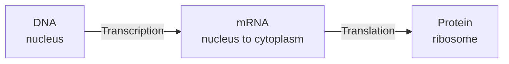
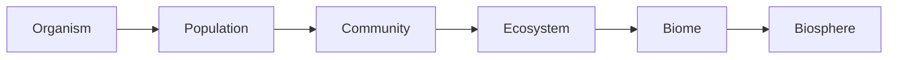
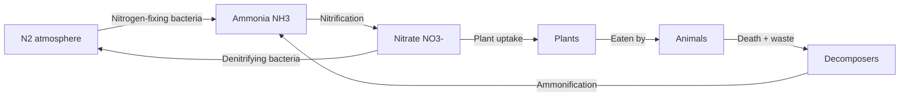
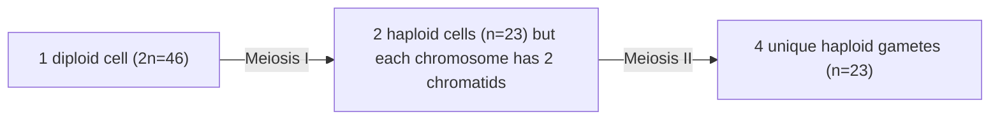
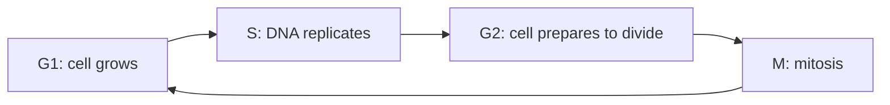

import Callout from '../../components/Callout.astro';
import KeyTerm from '../../components/KeyTerm.astro';
import Collapsible from '../../components/Collapsible.astro';
import Quiz from '../../components/Quiz.astro';
import Flashcards from '../../components/Flashcards.astro';
import RechartsBar from '../../components/RechartsBar.astro';
import RechartsLine from '../../components/RechartsLine.astro';
import NivoSankey from '../../components/NivoSankey.astro';
import NetworkGraph from '../../components/NetworkGraph.astro';
import MapView from '../../components/MapView.astro';
import VerticalTimeline from '../../components/VerticalTimeline.astro';
import Phylogeny from '../../components/Phylogeny.astro';
import DragMatch from '../../components/DragMatch.astro';
import DragSort from '../../components/DragSort.astro';
import Hotspots from '../../components/Hotspots.astro';
import Memorize from '../../components/Memorize.astro';
import Scrollytelling from '../../components/Scrollytelling.astro';
import PhETSim from '../../components/PhETSim.astro';
import DeepZoomAnnotated from '../../components/DeepZoomAnnotated.astro';
import CellSim from '../../components/CellSim.astro';
import Sketchfab from '../../components/Sketchfab.astro';
import MathBox from '../../components/MathBox.astro';
import VideoPlayer from '../../components/VideoPlayer.astro';
import Molecule from '../../components/Molecule.astro';
import DNASequence from '../../components/DNASequence.astro';
import PunnettSquare from '../../components/PunnettSquare.astro';
import EvolutionSim from '../../components/EvolutionSim.astro';
import TestTimer from '../../components/TestTimer.astro';

## What's on the Ohio Biology EOC

The exam tests four strands of the Ohio Learning Standards. Roughly equal weight across all four:

<RechartsBar
  data={[
    { strand: 'Heredity', percent: 25 },
    { strand: 'Evolution', percent: 25 },
    { strand: 'Ecology', percent: 25 },
    { strand: 'Cells', percent: 25 }
  ]}
  xKey="strand"
  bars={[{ dataKey: 'percent', name: '% of EOC questions' }]}
/>

- About **70 questions** total (mix of multiple choice, drag-and-drop, hot-spot, and short constructed response)
- **2 hours, 1 sitting**
- Passing scale score in Ohio: **700+** (proficient), **725+** (accelerated), **740+** (advanced)
- A graphing calculator is allowed but rarely needed
- A periodic table and formula sheet are provided

<Callout type="insight" title="Strategy in three sentences">
The EOC rewards **applying** concepts, not memorizing them. Most questions give you data (a graph, a Punnett square, a food web) and ask you to interpret it. Your job is to know **the rules** and **the reasoning**, not to recall trivia.
</Callout>

## How to use this guide

There are **four strands**, then a full reteach of **photosynthesis and cellular respiration**, then a **timed mock EOC**. Estimated total study time: 2 hours of focused review (or 4 sessions of 30 min each).

Every section has a quick **practice quiz** at the end. Use the floating Pomodoro at the bottom-right to time your study sessions. Use the **mock EOC test timer** at the very end to simulate test conditions.

---

# Strand 1: Heredity

You have two of each chromosome: one from each parent. Genes on those chromosomes carry instructions for traits. The interactive parts of this strand cover **DNA structure, replication, transcription, translation, mutations, and Mendelian genetics**.

## DNA structure

Below is the actual molecular structure of a short B-form DNA double helix from the Protein Data Bank. Drag to rotate. Notice the **double helix**, the **base pairs** holding the two strands together, and the **sugar-phosphate backbone** running on the outside.

<Molecule pdb="1BNA" style="cartoon" />

<Callout type="definition" title="The four bases">
DNA uses four nitrogenous bases:

- **A** (adenine) pairs with **T** (thymine) via 2 hydrogen bonds
- **G** (guanine) pairs with **C** (cytosine) via 3 hydrogen bonds

In RNA, **U** (uracil) replaces T. So the rule for transcription is **A→U, T→A, G→C, C→G**.
</Callout>

### Memorize the base pairing rules

<Memorize
  title="Base pairing rules"
  attribution="Critical for replication, transcription, and translation"
  text={`DNA to DNA pairing:
A pairs with T (two hydrogen bonds)
G pairs with C (three hydrogen bonds)

DNA to RNA pairing (transcription):
A in DNA pairs with U in RNA
T in DNA pairs with A in RNA
G in DNA pairs with C in RNA
C in DNA pairs with G in RNA

Memory aid:
Apples on Trees, Cars in Garages.
RNA replaces T with U because U is cheaper to make.`}
/>

## DNA replication walk-through

Replication happens before a cell divides. The double helix unwinds, both strands serve as templates, and DNA polymerase builds a new complementary strand on each. Every daughter cell ends up with one **old** strand and one **new** strand. This is called **semiconservative replication**.

<Scrollytelling
  graphicHeight="55vh"
  graphic={`

  
Step 0

  <svg viewBox='0 0 320 240' style='width: 100%; max-width: 320px; height: auto;'>
    <defs>
      <linearGradient id='strand1' x1='0' y1='0' x2='1' y2='0'><stop offset='0%' stop-color='#b91c1c'/><stop offset='100%' stop-color='#7f1d1d'/></linearGradient>
      <linearGradient id='strand2' x1='0' y1='0' x2='1' y2='0'><stop offset='0%' stop-color='#3b82f6'/><stop offset='100%' stop-color='#1e40af'/></linearGradient>
    </defs>
    <g id='helix-original' style='transition: opacity 600ms;'>
      <path d='M 60 30 Q 160 100 60 210' stroke='url(#strand1)' stroke-width='4' fill='none'/>
      <path d='M 60 30 Q -40 100 60 210' stroke='url(#strand2)' stroke-width='4' fill='none'/>
    </g>
    <g id='helix-fork' style='opacity: 0; transition: opacity 600ms;'>
      <path d='M 60 30 L 160 90' stroke='url(#strand1)' stroke-width='4' fill='none'/>
      <path d='M 60 30 L 160 90' stroke='url(#strand2)' stroke-width='4' fill='none' stroke-dasharray='2 4' style='transform: translateY(8px);'/>
      <path d='M 60 210 L 160 150' stroke='url(#strand1)' stroke-width='4' fill='none'/>
      <path d='M 60 210 L 160 150' stroke='url(#strand2)' stroke-width='4' fill='none' stroke-dasharray='2 4' style='transform: translateY(-8px);'/>
      <circle cx='160' cy='120' r='14' fill='#fbbf24' opacity='0.85'/>
      <text x='160' y='124' text-anchor='middle' fill='#0a0a0a' font-size='10' font-weight='700'>Heli</text>
    </g>
    <g id='helix-newstrands' style='opacity: 0; transition: opacity 600ms;'>
      <path d='M 60 30 L 260 30 Q 280 30 280 50' stroke='url(#strand1)' stroke-width='4' fill='none'/>
      <path d='M 60 30 L 260 30 Q 280 30 280 50' stroke='#22d3ee' stroke-width='3' fill='none' stroke-dasharray='3 3' style='transform: translateY(6px);'/>
      <path d='M 60 210 L 260 210 Q 280 210 280 190' stroke='url(#strand2)' stroke-width='4' fill='none'/>
      <path d='M 60 210 L 260 210 Q 280 210 280 190' stroke='#fbbf24' stroke-width='3' fill='none' stroke-dasharray='3 3' style='transform: translateY(-6px);'/>
    </g>
  </svg>
  
The DNA double helix sits coiled.

`}
  steps={[
    { id: 'closed', body: '<h3>1. Closed double helix</h3>
Before replication, DNA is wound into the familiar double helix. Two complementary strands held together by hydrogen bonds between paired bases (A-T, G-C).
' },
    { id: 'unwind', body: '<h3>2. Helicase unwinds</h3>
The enzyme <strong>helicase</strong> (yellow) breaks the hydrogen bonds, separating the strands at the <em>replication fork</em>. Each strand is now a template.
' },
    { id: 'polymerase', body: '<h3>3. DNA polymerase adds new bases</h3>
DNA polymerase reads each template strand 3\' to 5\' and adds complementary nucleotides 5\' to 3\'. A new strand grows on each old strand.
' },
    { id: 'done', body: '<h3>4. Two identical daughter helices</h3>
You end with two double helices, each containing one parental (old) strand and one new strand. This is called <strong>semiconservative replication</strong>: half conserved, half new.
' }
  ]}
  onStep={`(stepId) => {
    const labels = { closed: '1. Closed', unwind: '2. Helicase', polymerase: '3. Polymerase', done: '4. Two helices' };
    const captions = {
      closed: 'The DNA double helix sits coiled.',
      unwind: 'Helicase pries the strands apart at the replication fork.',
      polymerase: 'New nucleotides are added to each template, building two new strands.',
      done: 'Two identical daughter molecules. Each contains one old strand and one new.'
    };
    const elements = { closed: 'helix-original', unwind: 'helix-fork', polymerase: 'helix-fork', done: 'helix-newstrands' };
    document.getElementById('helix-original').style.opacity = stepId === 'closed' ? '1' : '0';
    document.getElementById('helix-fork').style.opacity = (stepId === 'unwind' || stepId === 'polymerase') ? '1' : '0';
    document.getElementById('helix-newstrands').style.opacity = stepId === 'done' ? '1' : '0';
    const labelEl = document.querySelector('[data-rep-label]');
    if (labelEl) labelEl.textContent = labels[stepId] || '';
    const capEl = document.querySelector('[data-rep-caption]');
    if (capEl) capEl.textContent = captions[stepId] || '';
  }`}
/>

## Central dogma: DNA → RNA → Protein

- **Transcription** copies a gene from DNA into mRNA. Happens in the nucleus.
- **Translation** reads the mRNA in groups of 3 bases (a **codon**) and assembles amino acids into a protein. Happens at the ribosome.

<Callout type="insight" title="The genetic code">
There are **64 possible codons** (4 bases × 4 × 4) but only **20 amino acids**, so most amino acids are coded by multiple codons (the code is "degenerate"). The codon **AUG** is the **start codon** (codes for methionine and starts every protein). Three codons (UAA, UAG, UGA) are **stop codons**.
</Callout>

### The genetic code in action

Below is a real human gene fragment. Hover any codon to see which amino acid it codes for.

<DNASequence
  sequence="ATGGCGAGCAGAGAGGAACTGGTGAGAATTAGCCAAGAGTTGCAA"
  features={[
    { start: 0, end: 3, label: "Start", color: "#16a34a" },
    { start: 42, end: 45, label: "Continuing...", color: "#7f1d1d" }
  ]}
/>

## Mutations

A **mutation** is any change in the DNA sequence. Mutations are the raw material for evolution. Four common types:

<Callout type="note" title="Silent mutation">
A base change that does NOT change the amino acid (because the genetic code is degenerate). No effect on the protein. Example: GCA → GCG, both code for alanine.
</Callout>

<Callout type="note" title="Missense mutation">
A base change that DOES change the amino acid. Example: sickle cell disease is caused by a single missense mutation (GAG → GTG) that swaps glutamic acid for valine in the beta-globin protein.
</Callout>

<Callout type="warning" title="Nonsense mutation">
A base change that creates a premature **stop codon**, truncating the protein. Usually destroys protein function entirely.
</Callout>

<Callout type="warning" title="Frameshift mutation">
An **insertion** or **deletion** of a base that's not a multiple of 3 shifts the entire reading frame downstream. Catastrophic. Every codon after the mutation is wrong.
</Callout>

## Mendelian genetics

Gregor Mendel worked out the rules of inheritance with pea plants in the 1860s, decades before anyone knew DNA existed. His three laws still drive every Punnett square you'll do.

<Callout type="theorem" title="Mendel's laws">
1. **Law of segregation:** each parent gives only ONE allele per gene to each offspring (because gametes are haploid).
2. **Law of independent assortment:** alleles for different genes are inherited independently of each other (assuming they're on different chromosomes).
3. **Law of dominance:** when two different alleles are inherited, the dominant one masks the recessive one in the phenotype.
</Callout>

### Punnett square: try it yourself

Cross two heterozygous brown-eyed parents. Change either parent's genotype to see the offspring ratios shift in real time.

<PunnettSquare
  parent1="Bb"
  parent2="Bb"
  dominant="B"
  traits={{ B: "Brown eyes", b: "Blue eyes" }}
  trait="Eye color"
/>

<Callout type="tip" title="The 3:1 trick">
A cross between two heterozygotes (Bb × Bb) ALWAYS gives a **3:1 phenotype ratio** (3 dominant : 1 recessive) and a **1:2:1 genotype ratio**. Memorize this.
</Callout>

## Pedigrees

A **pedigree** is a family tree that tracks a trait across generations. The Ohio EOC will give you one and ask whether the trait is dominant, recessive, X-linked, or autosomal.

<NetworkGraph
  layout="dagre"
  nodes={[
    { id: 'g1f', label: 'Father (aa)', color: '#3b82f6', shape: 'rectangle' },
    { id: 'g1m', label: 'Mother (Aa)', color: '#ec4899', shape: 'circle' },
    { id: 'g2a', label: 'Son (Aa)', color: '#3b82f6', shape: 'rectangle' },
    { id: 'g2b', label: 'Daughter (aa)', color: '#ec4899', shape: 'circle' },
    { id: 'g2c', label: 'Daughter (Aa)', color: '#ec4899', shape: 'circle' },
    { id: 'spouse1', label: 'Spouse (AA)', color: '#3b82f6', shape: 'rectangle' },
    { id: 'g3a', label: 'Grandchild (AA)', color: '#3b82f6', shape: 'rectangle' },
    { id: 'g3b', label: 'Grandchild (Aa)', color: '#ec4899', shape: 'circle' }
  ]}
  edges={[
    { source: 'g1f', target: 'g2a' },
    { source: 'g1f', target: 'g2b' },
    { source: 'g1f', target: 'g2c' },
    { source: 'g1m', target: 'g2a' },
    { source: 'g1m', target: 'g2b' },
    { source: 'g1m', target: 'g2c' },
    { source: 'g2a', target: 'g3a' },
    { source: 'g2a', target: 'g3b' },
    { source: 'spouse1', target: 'g3a' },
    { source: 'spouse1', target: 'g3b' }
  ]}
/>

<Callout type="tip" title="Reading a pedigree">
- **Squares** = males, **circles** = females
- **Filled** = expresses the trait, **empty** = does not
- **Horizontal line** = mating, **vertical line** = offspring
- If a trait skips generations and unaffected parents have affected kids, it's **recessive**
- If two affected parents have an unaffected child, the trait is **dominant** in those parents (and they're heterozygous)
</Callout>

## Heredity practice

### Drag to match: genotype → phenotype

<DragMatch
  pairs={[
    { left: 'BB', right: 'Homozygous dominant: brown eyes' },
    { left: 'Bb', right: 'Heterozygous: brown eyes (carrier)' },
    { left: 'bb', right: 'Homozygous recessive: blue eyes' },
    { left: 'XᴬY', right: 'Affected male (X-linked dominant)' },
    { left: 'XᴬXᵃ', right: 'Carrier female' }
  ]}
/>

### Self-quiz: heredity

<Quiz
  questions={[
    {
      q: "A heterozygous brown-eyed parent (Bb) crosses with a blue-eyed parent (bb). What percentage of offspring are predicted to have blue eyes?",
      choices: ["0%", "25%", "50%", "75%"],
      answer: 2,
      explain: "Bb × bb gives 50% Bb (brown) and 50% bb (blue). This is the classic test cross."
    },
    {
      q: "Which of the following mutations is most likely to have NO effect on the protein produced?",
      choices: ["Frameshift", "Nonsense", "Missense", "Silent"],
      answer: 3,
      explain: "Silent mutations change a base but not the amino acid (because the genetic code is degenerate). The protein is identical."
    },
    {
      q: "If both parents are heterozygous (Aa) for a recessive disease, what fraction of their children will be affected?",
      choices: ["0", "1/4", "1/2", "3/4"],
      answer: 1,
      explain: "Aa × Aa gives 1 AA : 2 Aa : 1 aa. Only the 1/4 that are aa are affected (carry both recessive alleles)."
    },
    {
      q: "DNA replication is described as 'semiconservative' because:",
      choices: [
        "Half the DNA is destroyed",
        "Each new helix has one old strand and one new strand",
        "Only one strand is copied",
        "Replication only happens in half the cells"
      ],
      answer: 1,
      explain: "Semi = half. Each daughter molecule conserves one of the original strands and pairs it with a newly synthesized complementary strand."
    },
    {
      q: "How many codons code for the 20 amino acids?",
      choices: ["20", "30", "60", "64"],
      answer: 3,
      explain: "There are 4³ = 64 possible codons. 61 code for amino acids (most amino acids have multiple codons) and 3 are stop codons."
    }
  ]}
/>

---

# Strand 2: Evolution

Evolution = change in the **allele frequencies** of a population over time. Natural selection is one of several mechanisms (others: genetic drift, gene flow, mutation, non-random mating). The Ohio EOC focuses on natural selection, evidence for evolution, and reading phylogenetic trees.

## The five lines of evidence

<Callout type="insight" title="1. Fossils">
The fossil record shows the same general progression everywhere: simpler organisms in older layers, more complex in newer. **Transitional fossils** like *Tiktaalik* (fish-tetrapod) and *Archaeopteryx* (dinosaur-bird) bridge major groups.
</Callout>

<Callout type="insight" title="2. Comparative anatomy">
**Homologous structures** (same origin, different function: the human arm, whale flipper, bat wing all have the same bone arrangement) suggest common ancestry. **Analogous structures** (different origin, same function: insect wings vs bird wings) suggest convergent evolution.
</Callout>

<Callout type="insight" title="3. Embryology">
Vertebrate embryos look strikingly similar in early development: gill slits, tails, similar limb buds. They diverge later. The shared early stages reflect shared ancestry.
</Callout>

<Callout type="insight" title="4. Biogeography">
Closely related species cluster geographically in ways that match historical land connections, not present-day climate. Australia has marsupials because it broke off Gondwana before placental mammals evolved there.
</Callout>

<Callout type="insight" title="5. Molecular evidence">
DNA and protein sequences match the patterns predicted by anatomy and the fossil record. Humans and chimps share **~98.8%** of their DNA. The more closely related two species are, the more similar their molecules.
</Callout>

## Watch natural selection happen

This is a real natural-selection simulator. The environment "favors" red-tinted organisms (the deep red background). Press **▶ Run**. Predators cull organisms whose color is far from red each generation; survivors reproduce with mild mutation. Watch the population shift toward red over 30+ generations.

<EvolutionSim populationSize={70} selectionPressure={0.4} mutationRate={0.1} environmentColor="#7f1d1d" />

<Callout type="theorem" title="Darwin's four conditions for natural selection">
1. **Variation** within a population (some organisms differ from others)
2. **Heritable** variation (those differences pass to offspring)
3. **Differential survival** (some variations help organisms survive longer)
4. **Differential reproduction** (survivors leave more offspring)

Result: the helpful traits become more common over generations.
</Callout>

## PhET: bunnies through generations

PhET's classic Natural Selection simulation lets you breed bunnies with different traits and watch which combinations survive different environments. Try the **Equator** preset, then add a wolf predator and watch which fur color dominates.

<PhETSim sim="natural-selection" />

## The Galápagos finches

When the medium ground finch population on Daphne Major faced a 1977 drought, only finches with bigger beaks could crack the few large seeds available. The next generation was measurably bigger-beaked. This is natural selection observed in real time, by Peter and Rosemary Grant.

<RechartsBar
  data={[
    { year: 'Pre-drought (1976)', beak_depth: 9.2 },
    { year: 'Post-drought (1978)', beak_depth: 9.7 }
  ]}
  xKey="year"
  bars={[{ dataKey: 'beak_depth', name: 'Mean beak depth (mm)' }]}
/>

A 0.5 mm shift in just 2 years. Multiply that across millions of years and you get the 13 distinct Darwin's finch species we see today, each with a beak adapted to a different food source.

## Phylogenetic trees

A **phylogeny** shows evolutionary relationships. Tip = present-day species. Internal node = common ancestor. The closer two tips share a common ancestor, the more closely related they are.

<Phylogeny newick="(Lamprey,(Shark,(Salmon,(Frog,(Lizard,(Mouse,Human))))));" />

<Callout type="tip" title="Reading trees">
Don't read tip-to-tip horizontally. Read by **most recent common ancestor**. A mouse and a human share a more recent common ancestor than a mouse and a lizard, so they're more closely related, even if they look less alike.
</Callout>

## Geologic timeline

Life has been around for about **3.8 billion years**. Mass extinctions reset the playing field five times. The most recent (and most relevant for the EOC) is the K-Pg extinction 66 million years ago that ended the dinosaurs.

<VerticalTimeline items={[
  { date: "3.8 billion years ago", title: "First life", body: "Single-celled prokaryotes (bacteria-like) appear in oceans.", icon: "🦠" },
  { date: "2.4 billion years ago", title: "Great Oxygenation Event", body: "Photosynthetic cyanobacteria fill the atmosphere with O2, killing most existing life. Aerobic respiration evolves.", icon: "💨" },
  { date: "1.5 billion years ago", title: "Eukaryotic cells", body: "Cells with nuclei and organelles. Likely arose via endosymbiosis (mitochondria, chloroplasts were engulfed bacteria).", icon: "🧬" },
  { date: "540 million years ago", title: "Cambrian Explosion", body: "Most major animal phyla appear in 20 million years. The fossil record explodes with diversity.", icon: "🦑" },
  { date: "400 million years ago", title: "Plants and animals on land", body: "First land plants, then arthropods, then tetrapods (Tiktaalik!).", icon: "🌿" },
  { date: "252 million years ago", title: "Permian-Triassic extinction", body: "The 'Great Dying.' 95% of marine species and 70% of land species go extinct.", icon: "💀" },
  { date: "230 million years ago", title: "First dinosaurs", body: "Reptiles diversify into the long dinosaur era.", icon: "🦖" },
  { date: "66 million years ago", title: "K-Pg extinction", body: "Asteroid impact ends the non-avian dinosaurs. Mammals (and birds, the only surviving dinosaurs) inherit the Earth.", icon: "☄️" },
  { date: "300,000 years ago", title: "Homo sapiens", body: "Anatomically modern humans appear in Africa.", icon: "🚶" },
  { date: "Today", title: "Sixth mass extinction (in progress)", body: "Driven by humans. Species are going extinct at 100-1,000x the background rate.", icon: "⚠️" }
]} />

## CrashCourse: natural selection (10 min)

John Green walks through Darwin's logic, the peppered moth, and antibiotic resistance.

<VideoPlayer url="https://www.youtube.com/watch?v=1HbvBVhpChI" />

## Hardy-Weinberg in 3D

When a population is in **Hardy-Weinberg equilibrium**, allele frequencies don't change. The conditions are strict (no mutation, no migration, no selection, infinite population, random mating) so it never quite holds in nature. The math gives you a baseline to compare real populations against.

The equation: $p^2 + 2pq + q^2 = 1$

where $p$ = frequency of dominant allele, $q$ = frequency of recessive allele, $p^2$ = % homozygous dominant, $2pq$ = % heterozygous, $q^2$ = % homozygous recessive.

<MathBox setup={`mathbox.set('focus', 4); mathbox.cartesian({ range: [[0,1],[0,1],[0,1]], scale: [2,2,1] }).axis({ axis: 'x' }).axis({ axis: 'y' }).axis({ axis: 'z' }).grid({ axes: 'xy' }).area({ width: 32, height: 32, axes: 'xy', expr: function (emit, p, q) { emit(p, q, p*p + 2*p*q + q*q); }, color: 0xb91c1c, shaded: true });`} />

## Evolution practice

<Quiz
  questions={[
    {
      q: "Which is the BEST evidence that whales descended from land mammals?",
      choices: [
        "Whales swim like fish",
        "Whales have lungs and vestigial pelvic bones",
        "Whales live in the ocean",
        "Whales are large"
      ],
      answer: 1,
      explain: "Vestigial structures (pelvis bones disconnected from any limb) and lungs reveal a land-dwelling ancestor. Convergent traits like swimming don't show ancestry."
    },
    {
      q: "After a drought killed off small-seed-eating finches, the next generation had bigger beaks. This is an example of:",
      choices: ["Genetic drift", "Natural selection", "Mutation", "Gene flow"],
      answer: 1,
      explain: "Selective pressure (only big-beaked birds could eat the remaining tough seeds) caused differential reproduction. Classic natural selection."
    },
    {
      q: "Two species of birds look almost identical but live on different continents and have different DNA. Their similarity is best explained by:",
      choices: ["Common ancestry", "Convergent evolution", "Genetic drift", "A shared mutation"],
      answer: 1,
      explain: "Different DNA + different geography means they evolved similar appearances independently in similar environments. That's convergent evolution (analogous structures)."
    },
    {
      q: "On a phylogenetic tree, which two species are most closely related?",
      choices: [
        "The two whose tips look the most similar",
        "The two whose tips are next to each other",
        "The two that share the most recent common ancestor",
        "The two on the same branch"
      ],
      answer: 2,
      explain: "Tree relationships are about shared ancestors, not tip position or appearance. Always trace down to find the most recent node both species share."
    },
    {
      q: "If a population is in Hardy-Weinberg equilibrium and the frequency of the recessive allele is 0.3, what fraction of the population is homozygous recessive?",
      choices: ["0.3", "0.09", "0.42", "0.49"],
      answer: 1,
      explain: "q² = 0.3² = 0.09 (or 9%). The Hardy-Weinberg equation gives genotype frequencies directly from allele frequencies."
    }
  ]}
/>

---

# Strand 3: Diversity and Interdependence (Ecology)

Ecology is the study of how living things interact with each other and their environment. The EOC tests **levels of organization, food webs, energy flow, biogeochemical cycles, biomes, and human impact**.

## Levels of organization

- **Organism** = one individual
- **Population** = same species in same area
- **Community** = all species in same area
- **Ecosystem** = community + abiotic factors (water, soil, temperature)
- **Biome** = group of similar ecosystems (e.g., all deserts)
- **Biosphere** = all life on Earth

## Forest food web

Click any species below to see how it's connected. **Producers** are at the bottom. **Apex predators** at the top. Energy flows up the chain.

<NetworkGraph
  layout="cose"
  nodes={[
    { id: 'sun', label: 'Sunlight', color: '#fbbf24', size: 30 },
    { id: 'oak', label: 'Oak tree (producer)', color: '#16a34a', size: 38 },
    { id: 'grass', label: 'Grass (producer)', color: '#16a34a', size: 32 },
    { id: 'berry', label: 'Berries (producer)', color: '#16a34a', size: 30 },
    { id: 'deer', label: 'Deer (1° consumer)', color: '#a16207', size: 36 },
    { id: 'rabbit', label: 'Rabbit (1° consumer)', color: '#a16207', size: 32 },
    { id: 'mouse', label: 'Mouse (1° consumer)', color: '#a16207', size: 30 },
    { id: 'fox', label: 'Fox (2° consumer)', color: '#dc2626', size: 36 },
    { id: 'owl', label: 'Owl (2° consumer)', color: '#dc2626', size: 32 },
    { id: 'wolf', label: 'Wolf (apex predator)', color: '#7f1d1d', size: 42 },
    { id: 'fungi', label: 'Fungi (decomposer)', color: '#52525b', size: 28 }
  ]}
  edges={[
    { source: 'sun', target: 'oak', label: 'energy' },
    { source: 'sun', target: 'grass', label: 'energy' },
    { source: 'sun', target: 'berry', label: 'energy' },
    { source: 'oak', target: 'deer', label: 'eaten by' },
    { source: 'grass', target: 'deer', label: 'eaten by' },
    { source: 'grass', target: 'rabbit', label: 'eaten by' },
    { source: 'berry', target: 'mouse', label: 'eaten by' },
    { source: 'berry', target: 'rabbit', label: 'eaten by' },
    { source: 'rabbit', target: 'fox', label: 'eaten by' },
    { source: 'mouse', target: 'owl', label: 'eaten by' },
    { source: 'mouse', target: 'fox', label: 'eaten by' },
    { source: 'deer', target: 'wolf', label: 'eaten by' },
    { source: 'fox', target: 'wolf', label: 'eaten by' },
    { source: 'wolf', target: 'fungi', label: 'decomposed by' },
    { source: 'fox', target: 'fungi', label: 'decomposed by' }
  ]}
/>

## Energy pyramid (the 10% rule)

Only about **10% of the energy** at one trophic level is passed up to the next. The rest is lost as heat (cellular respiration), waste, or never eaten. This is why apex predators are rare.

<NivoSankey
  height={420}
  data={{
    nodes: [
      { id: 'Sun (1,000,000)' },
      { id: 'Producers (100,000)' },
      { id: '1° consumers (10,000)' },
      { id: '2° consumers (1,000)' },
      { id: 'Apex (100)' },
      { id: 'Heat lost' }
    ],
    links: [
      { source: 'Sun (1,000,000)', target: 'Producers (100,000)', value: 100 },
      { source: 'Producers (100,000)', target: '1° consumers (10,000)', value: 10 },
      { source: 'Producers (100,000)', target: 'Heat lost', value: 90 },
      { source: '1° consumers (10,000)', target: '2° consumers (1,000)', value: 1 },
      { source: '1° consumers (10,000)', target: 'Heat lost', value: 9 },
      { source: '2° consumers (1,000)', target: 'Apex (100)', value: 0.1 },
      { source: '2° consumers (1,000)', target: 'Heat lost', value: 0.9 }
    ]
  }}
/>

## The biogeochemical cycles

### Carbon cycle

Carbon moves through the atmosphere, oceans, organisms, and rocks. Photosynthesis pulls CO₂ out of the air; respiration and combustion put it back.

<NivoSankey
  height={420}
  data={{
    nodes: [
      { id: 'Atmosphere CO2' },
      { id: 'Plants' },
      { id: 'Animals' },
      { id: 'Decomposers' },
      { id: 'Fossil fuels' },
      { id: 'Ocean' }
    ],
    links: [
      { source: 'Atmosphere CO2', target: 'Plants', value: 50 },
      { source: 'Plants', target: 'Animals', value: 20 },
      { source: 'Plants', target: 'Atmosphere CO2', value: 15 },
      { source: 'Animals', target: 'Atmosphere CO2', value: 10 },
      { source: 'Animals', target: 'Decomposers', value: 8 },
      { source: 'Plants', target: 'Decomposers', value: 12 },
      { source: 'Decomposers', target: 'Atmosphere CO2', value: 18 },
      { source: 'Fossil fuels', target: 'Atmosphere CO2', value: 25 },
      { source: 'Atmosphere CO2', target: 'Ocean', value: 22 },
      { source: 'Ocean', target: 'Atmosphere CO2', value: 18 }
    ]
  }}
/>

### Nitrogen cycle

Nitrogen is 78% of the atmosphere as N₂, but plants can't use it directly. **Nitrogen-fixing bacteria** in soil and root nodules convert N₂ into ammonia (NH₃), which becomes nitrate (NO₃⁻) that plants absorb.

<Callout type="insight" title="Why nitrogen matters">
Nitrogen is essential for **proteins** and **DNA**. Without nitrogen-fixing bacteria, no plants. Without plants, no animals. The entire food chain depends on a few species of soil bacteria.
</Callout>

### Water and phosphorus cycles

- **Water cycle:** evaporation → condensation → precipitation → runoff/groundwater → back to evaporation. Driven by the sun.
- **Phosphorus cycle:** unique in that there's no atmospheric form. Phosphorus moves through rocks → soil → plants → animals → decomposers → soil → eventually back to rocks via geological uplift. Slow.

## World biomes

A **biome** is a major ecosystem type defined by its climate (temperature + rainfall) and characteristic plants. The Ohio EOC focuses on these eight.

<MapView
  title="World biomes (representative locations)"
  center={[20, 0]}
  zoom={2}
  height="420px"
  markers={[
    { lat: 71.0, lng: -156.0, label: "Tundra (Alaska)", popup: "Cold, dry, treeless. Permafrost. Mosses, lichens, caribou.", color: "#bae6fd" },
    { lat: 60.0, lng: 100.0, label: "Taiga / Boreal forest (Siberia)", popup: "Cold winters, short summers. Conifers (spruce, pine). Moose, wolves.", color: "#15803d" },
    { lat: 45.0, lng: -85.0, label: "Temperate deciduous forest (Ohio!)", popup: "Four seasons. Maples, oaks. Deer, squirrels. This is YOU.", color: "#a16207" },
    { lat: -3.0, lng: -62.0, label: "Tropical rainforest (Amazon)", popup: "Hot, wet year-round. Highest biodiversity on Earth. ~50% of species.", color: "#16a34a" },
    { lat: -15.0, lng: 30.0, label: "Savanna (Africa)", popup: "Wet/dry seasons. Grasses with scattered trees. Lions, zebras, wildebeest.", color: "#facc15" },
    { lat: 30.0, lng: 28.0, label: "Desert (Sahara)", popup: "Less than 25 cm rain/year. Cacti, succulents. Adapted reptiles and mammals.", color: "#dc2626" },
    { lat: 38.0, lng: -100.0, label: "Temperate grassland (Great Plains)", popup: "Hot summers, cold winters. Grasses, no trees. Bison, prairie dogs.", color: "#a3a3a3" },
    { lat: 0.0, lng: -160.0, label: "Marine / Open ocean", popup: "70% of Earth. Phytoplankton produce ~50% of Earth's oxygen.", color: "#1e40af" }
  ]}
/>

## Population dynamics

Two growth models you must know:

<RechartsLine
  data={[
    { time: 1, exponential: 10, logistic: 10 },
    { time: 2, exponential: 20, logistic: 19 },
    { time: 3, exponential: 40, logistic: 36 },
    { time: 4, exponential: 80, logistic: 62 },
    { time: 5, exponential: 160, logistic: 88 },
    { time: 6, exponential: 320, logistic: 100 },
    { time: 7, exponential: 640, logistic: 100 },
    { time: 8, exponential: 1280, logistic: 100 }
  ]}
  xKey="time"
  lines={[
    { dataKey: 'exponential', name: 'Exponential growth' },
    { dataKey: 'logistic', name: 'Logistic growth' }
  ]}
/>

- **Exponential growth (J-curve):** unlimited resources, no predators. Bacteria in fresh agar. Real for very short bursts.
- **Logistic growth (S-curve):** limited resources cause growth to slow as population approaches **carrying capacity (K)**. The realistic model.

### Predator-prey: lynx and snowshoe hare

Hudson Bay fur trapping records (1845-1935) showed beautiful predator-prey oscillations. When hares are abundant, lynxes thrive. Lots of lynxes → hares decline. Few hares → lynxes starve. Few lynxes → hares rebound. Cycle.

<RechartsLine
  data={[
    { year: 1845, hare: 30, lynx: 5 },
    { year: 1855, hare: 80, lynx: 30 },
    { year: 1865, hare: 25, lynx: 50 },
    { year: 1875, hare: 75, lynx: 10 },
    { year: 1885, hare: 90, lynx: 35 },
    { year: 1895, hare: 20, lynx: 60 },
    { year: 1905, hare: 70, lynx: 8 },
    { year: 1915, hare: 60, lynx: 25 },
    { year: 1925, hare: 15, lynx: 50 },
    { year: 1935, hare: 50, lynx: 5 }
  ]}
  xKey="year"
  lines={[
    { dataKey: 'hare', name: 'Snowshoe hare (thousands)' },
    { dataKey: 'lynx', name: 'Lynx (thousands)' }
  ]}
/>

## Symbiosis

| Type | Effect on A | Effect on B | Example |
|------|-------------|-------------|---------|
| **Mutualism** | + | + | Bee + flower (pollination + nectar) |
| **Commensalism** | + | 0 | Barnacle + whale (ride + nothing) |
| **Parasitism** | + | – | Tapeworm + human |
| **Competition** | – | – | Two species fighting for same niche |

## Human impact

Atmospheric CO₂ has gone from ~280 ppm (pre-industrial) to over 420 ppm today, a level not seen in 3 million years.

<RechartsLine
  data={[
    { year: 1850, co2: 285 },
    { year: 1900, co2: 296 },
    { year: 1950, co2: 311 },
    { year: 1980, co2: 339 },
    { year: 2000, co2: 369 },
    { year: 2010, co2: 389 },
    { year: 2020, co2: 412 },
    { year: 2025, co2: 425 }
  ]}
  xKey="year"
  lines={[{ dataKey: 'co2', name: 'Atmospheric CO2 (ppm)' }]}
/>

## Ecology practice

<Quiz
  questions={[
    {
      q: "If a producer level has 100,000 kcal of energy, about how much should reach the secondary consumers?",
      choices: ["10,000 kcal", "1,000 kcal", "100 kcal", "100,000 kcal"],
      answer: 1,
      explain: "10% rule: 100,000 → 10,000 (1° consumer) → 1,000 (2° consumer). 90% lost at each step as heat."
    },
    {
      q: "Two species of warblers in the same tree have evolved to feed at different heights to avoid each other. This is most likely a result of:",
      choices: ["Mutualism", "Predation", "Competition", "Commensalism"],
      answer: 2,
      explain: "Resource partitioning is a classic outcome of competition. Both species suffered when they overlapped, so natural selection favored individuals that used different parts of the tree."
    },
    {
      q: "The temperate deciduous forest biome is characterized by:",
      choices: [
        "No rainfall and very high temperatures",
        "Four distinct seasons and trees that lose leaves in winter",
        "Permafrost and no trees",
        "Year-round rainfall and the highest biodiversity on Earth"
      ],
      answer: 1,
      explain: "Ohio is in this biome! Four seasons, deciduous trees (maples, oaks), moderate rainfall."
    },
    {
      q: "A population growing exponentially eventually slows as it approaches:",
      choices: ["Mutation rate", "Natural selection", "Carrying capacity", "Trophic cascade"],
      answer: 2,
      explain: "Carrying capacity (K) is the maximum population the environment can sustain. Resources run low, growth slows to zero."
    },
    {
      q: "Without nitrogen-fixing bacteria, plants would not be able to:",
      choices: [
        "Photosynthesize",
        "Make proteins and DNA",
        "Absorb water",
        "Reproduce"
      ],
      answer: 1,
      explain: "Plants need nitrogen to make proteins and nucleic acids. They can't fix N2 themselves; they depend entirely on bacteria to convert atmospheric nitrogen into a usable form."
    }
  ]}
/>

---

# Strand 4: Cells

The smallest unit of life. The Ohio EOC tests **cell structure, membrane transport, mitosis, meiosis, and a deep understanding of photosynthesis and cellular respiration** (the energy pathways).

## Cell structure: a real electron microscope view

Below is a real scanning electron microscope image. Zoom in (scroll/pinch) and click any annotation marker to identify the organelle.

<DeepZoomAnnotated
  src="https://openseadragon.github.io/example-images/highsmith/highsmith.dzi"
  markers={[
    { x: 0.3, y: 0.4, label: "Nucleus: contains DNA, controls cell" },
    { x: 0.55, y: 0.5, label: "Mitochondrion: ATP factory" },
    { x: 0.7, y: 0.3, label: "Ribosome: makes proteins" },
    { x: 0.45, y: 0.6, label: "ER: protein and lipid factory" }
  ]}
/>

### The 12 organelles you must know

| Organelle | Job | Found in |
|-----------|-----|----------|
| **Nucleus** | Stores DNA, controls cell | All eukaryotes |
| **Mitochondrion** | Makes ATP via cellular respiration | All eukaryotes |
| **Chloroplast** | Photosynthesis | Plants, algae only |
| **Ribosome** | Makes proteins | All cells |
| **Endoplasmic Reticulum (ER)** | Synthesizes proteins (rough) and lipids (smooth) | All eukaryotes |
| **Golgi apparatus** | Modifies, packages, ships proteins | All eukaryotes |
| **Lysosome** | Digestive enzymes, cleanup | Animals mostly |
| **Vacuole** | Storage (HUGE in plants for water) | All eukaryotes |
| **Cell wall** | Structural support | Plants, fungi, bacteria |
| **Cell membrane** | Selective barrier | All cells |
| **Cytoplasm** | Fluid where reactions happen | All cells |
| **Cytoskeleton** | Cell shape, organelle transport | All cells |

## Watch a real cell breathe

This Artistoo simulation runs a real cellular Potts model. Watch a single cell shift its shape moment by moment, the same way real biology models tissue formation and immune cell migration. The boundary jiggles because the algorithm continuously re-evaluates which pixels belong to the cell vs. the medium based on energy minimization, exactly the kind of stochastic process happening in your tissues right now.

<CellSim title="Live cellular Potts model" />

## Rotate a 3D mitochondrion

The mitochondrion is the powerhouse of the cell. Drag this 3D model to see the inner membrane folds (**cristae**) where the electron transport chain lives.

<Sketchfab uid="2cb6daea7d8f418087d8eed99f55cebf" />

## Membrane transport

The cell membrane is **selectively permeable**. Three kinds of transport:

<Callout type="note" title="Passive transport (no ATP)">
Molecules move DOWN their concentration gradient. Includes:
- **Diffusion:** small molecules (O₂, CO₂) directly through the lipid bilayer.
- **Osmosis:** water through aquaporins (special protein channels).
- **Facilitated diffusion:** larger molecules (glucose) through transport proteins.
</Callout>

<Callout type="warning" title="Active transport (uses ATP)">
Molecules move AGAINST their concentration gradient. Requires energy. The **sodium-potassium pump** (3 Na⁺ out, 2 K⁺ in per ATP) is the textbook example. Critical for nerve signaling.
</Callout>

<Callout type="insight" title="Bulk transport">
- **Endocytosis:** cell engulfs something large (the cell membrane wraps around a particle and pinches it inside)
- **Exocytosis:** cell releases something large (a vesicle fuses with the membrane and dumps contents outside)
</Callout>

## Mitosis

Mitosis is how somatic (body) cells divide. One cell → two genetically identical daughter cells. Used for growth, repair, and asexual reproduction.

<DragSort
  prompt="Drag the phases into the correct order"
  items={[
    { id: 'p', label: 'Prophase: chromosomes condense, nuclear envelope dissolves' },
    { id: 'm', label: 'Metaphase: chromosomes line up at the middle' },
    { id: 'a', label: 'Anaphase: sister chromatids pulled to opposite poles' },
    { id: 't', label: 'Telophase: nuclear envelopes reform, chromosomes uncondense' },
    { id: 'c', label: 'Cytokinesis: cytoplasm divides, two cells form' }
  ]}
  answer={['p', 'm', 'a', 't', 'c']}
/>

<Callout type="tip" title="Mnemonic">
**P**lease **M**ake **A**ll **T**eachers **C**ome.
</Callout>

## Meiosis

Meiosis makes **gametes** (sperm and eggs). One cell → four genetically UNIQUE haploid cells (half the chromosome number). Two divisions: meiosis I and meiosis II.

Two key events make every gamete unique:
1. **Crossing over** (prophase I): homologous chromosomes swap chunks
2. **Independent assortment** (metaphase I): each chromosome pair lines up randomly

<Callout type="theorem" title="Why we vary">
Crossing over + independent assortment means a single human can theoretically produce **2²³ = 8.4 million** different gametes. Now multiply by your partner's 8.4 million. Without even counting mutations, you'd need to have **70 trillion** kids before two siblings would be genetically identical.
</Callout>

## Cell cycle and cancer

The cell cycle has checkpoints that ensure DNA is replicated correctly before division. **Cancer** is what happens when a cell loses control of those checkpoints and divides uncontrollably.

<Callout type="warning" title="Cancer in one sentence">
Mutations in checkpoint genes (especially **p53**, the "guardian of the genome") let damaged cells continue dividing. The result: a tumor.
</Callout>

---

# Photosynthesis: full reteach

The Ohio EOC always has at least 3 questions on photosynthesis. Lock this down.

## The big equation

$$
6\text{CO}_2 + 6\text{H}_2\text{O} \xrightarrow{\text{light}} \text{C}_6\text{H}_{12}\text{O}_6 + 6\text{O}_2
$$

In words: **carbon dioxide + water + light energy → glucose + oxygen.**

## Where it happens

Inside the **chloroplast** (only in plants and algae):

- **Thylakoid membrane:** stage 1, the **light-dependent reactions**. Captures light energy.
- **Stroma:** stage 2, the **Calvin cycle** (light-independent reactions). Builds glucose.

## Stage 1: Light reactions

1. Photon hits chlorophyll in **Photosystem II**, exciting an electron.
2. Electron passes down the **electron transport chain**, pumping H⁺ into the thylakoid lumen.
3. **PSII replaces its lost electron by splitting water** (releasing **O₂** as waste).
4. Electron arrives at **Photosystem I**, gets re-energized by another photon.
5. Final destination: NADP⁺ + H⁺ → **NADPH** (loaded with energy).
6. The H⁺ gradient powers **ATP synthase** to make ATP via chemiosmosis.

**Outputs of light reactions: ATP, NADPH, O₂.**

## Stage 2: Calvin cycle

Uses the ATP and NADPH from Stage 1 to fix CO₂ into glucose. Three phases:

1. **Carbon fixation:** RuBisCO attaches CO₂ to RuBP.
2. **Reduction:** ATP and NADPH convert it into G3P. Some G3P leaves to make glucose.
3. **Regeneration:** remaining G3P recycled into RuBP.

**Stoichiometry:** 6 turns of the cycle, 18 ATP, 12 NADPH → 1 glucose.

## Photosynthesis energy flow

<NivoSankey
  height={520}
  data={{
    nodes: [
      { id: 'Sunlight' },
      { id: 'PSII' },
      { id: 'PSI' },
      { id: 'ATP' },
      { id: 'NADPH' },
      { id: 'Calvin cycle' },
      { id: 'Glucose' },
      { id: 'Heat lost' }
    ],
    links: [
      { source: 'Sunlight', target: 'PSII', value: 100 },
      { source: 'PSII', target: 'PSI', value: 60 },
      { source: 'PSII', target: 'ATP', value: 25 },
      { source: 'PSII', target: 'Heat lost', value: 15 },
      { source: 'PSI', target: 'NADPH', value: 50 },
      { source: 'PSI', target: 'Heat lost', value: 10 },
      { source: 'ATP', target: 'Calvin cycle', value: 25 },
      { source: 'NADPH', target: 'Calvin cycle', value: 50 },
      { source: 'Calvin cycle', target: 'Glucose', value: 70 },
      { source: 'Calvin cycle', target: 'Heat lost', value: 5 }
    ]
  }}
/>

---

# Cellular respiration: full reteach

The reverse of photosynthesis. Take glucose, extract its energy as ATP. Happens in **mitochondria** (and the cytoplasm for stage 1) in **all eukaryotes** (and the cytoplasm of bacteria/archaea).

## The big equation

$$
\text{C}_6\text{H}_{12}\text{O}_6 + 6\text{O}_2 \rightarrow 6\text{CO}_2 + 6\text{H}_2\text{O} + \text{ATP}
$$

In words: **glucose + oxygen → carbon dioxide + water + energy (ATP).**

Notice: this is photosynthesis **run backwards.** Plants store energy in glucose; respiration releases it.

## The three stages

### Stage 1: Glycolysis (in cytoplasm)

Glucose (6C) → 2 pyruvate (3C each).
- **Inputs:** 1 glucose, 2 ATP, 2 NAD⁺
- **Outputs:** 2 pyruvate, **4 ATP** (net 2), 2 NADH
- **Doesn't need oxygen.** This is the only stage that anaerobic organisms have.

### Stage 2: Krebs cycle / Citric Acid Cycle (in mitochondrial matrix)

Each pyruvate gets converted to acetyl-CoA, then enters the cycle.
- **Per glucose (2 pyruvates):** 2 ATP, 6 NADH, 2 FADH₂, 4 CO₂
- The CO₂ you exhale comes from here.

### Stage 3: Electron Transport Chain (on inner mitochondrial membrane)

NADH and FADH₂ from Stages 1 and 2 dump their electrons into the ETC. Electrons cascade down protein complexes, pumping H⁺ across the inner membrane. The H⁺ flows back through ATP synthase, making ATP. Final electron acceptor: **O₂** (forms water).

- **Per glucose:** ~28-32 ATP from oxidative phosphorylation
- **Total ATP per glucose: ~30-32** (varies slightly by cell type)

## Cellular respiration energy flow

Mirror of the photosynthesis Sankey. Glucose comes in; ATP and waste come out.

<NivoSankey
  height={520}
  data={{
    nodes: [
      { id: 'Glucose' },
      { id: 'O2' },
      { id: 'Glycolysis' },
      { id: 'Krebs cycle' },
      { id: 'ETC' },
      { id: 'ATP' },
      { id: 'CO2' },
      { id: 'H2O' },
      { id: 'Heat lost' }
    ],
    links: [
      { source: 'Glucose', target: 'Glycolysis', value: 100 },
      { source: 'Glycolysis', target: 'Krebs cycle', value: 80 },
      { source: 'Glycolysis', target: 'ATP', value: 5 },
      { source: 'Glycolysis', target: 'ETC', value: 15 },
      { source: 'Krebs cycle', target: 'CO2', value: 30 },
      { source: 'Krebs cycle', target: 'ETC', value: 45 },
      { source: 'Krebs cycle', target: 'ATP', value: 5 },
      { source: 'O2', target: 'ETC', value: 60 },
      { source: 'ETC', target: 'H2O', value: 30 },
      { source: 'ETC', target: 'ATP', value: 75 },
      { source: 'ETC', target: 'Heat lost', value: 15 }
    ]
  }}
/>

## Aerobic vs anaerobic

When **oxygen is available**, you do all 3 stages → ~32 ATP per glucose.

When **oxygen runs out** (sprinting, suffocating bacteria), cells skip stages 2-3 and do **fermentation** instead:

- **Lactic acid fermentation** (your muscles, some bacteria): glucose → 2 lactic acid + 2 ATP. The "burn" of intense exercise.
- **Alcoholic fermentation** (yeast): glucose → 2 ethanol + 2 CO₂ + 2 ATP. How beer and bread happen.

Fermentation gives only **2 ATP** per glucose vs 32 for full aerobic respiration. Massively less efficient.

## Photosynthesis vs respiration: side by side

| | Photosynthesis | Cellular respiration |
|--|----------------|----------------------|
| **Reactants** | CO₂ + H₂O + light | Glucose + O₂ |
| **Products** | Glucose + O₂ | CO₂ + H₂O + ATP |
| **Site** | Chloroplast | Mitochondrion |
| **Cells** | Plants, algae, some bacteria | All eukaryotes |
| **Energy** | Stores energy in glucose | Releases energy from glucose |
| **Electron carrier** | NADPH | NADH |

They are **the same chemistry, run in reverse**. Plants do photosynthesis to STORE energy as glucose. All cells (plants and animals) do respiration to RELEASE that energy as ATP.

## Cells practice

<Quiz
  questions={[
    {
      q: "Which organelle is found ONLY in plant cells?",
      choices: ["Mitochondrion", "Nucleus", "Chloroplast", "Ribosome"],
      answer: 2,
      explain: "Chloroplasts are exclusive to plants and algae. Plant cells also have mitochondria; both organelles work together (photosynthesis stores energy, respiration releases it)."
    },
    {
      q: "During mitosis, what happens during anaphase?",
      choices: [
        "Chromosomes line up at the middle",
        "Sister chromatids are pulled to opposite poles",
        "Chromosomes condense",
        "The cytoplasm divides"
      ],
      answer: 1,
      explain: "Anaphase = chromatids APART. Sister chromatids separate and move to opposite poles via spindle fibers."
    },
    {
      q: "How many UNIQUE daughter cells does meiosis produce from one starting cell?",
      choices: ["1", "2", "4", "8"],
      answer: 2,
      explain: "Meiosis I makes 2 haploid cells, then meiosis II splits each, giving 4 total. All 4 are genetically unique due to crossing over and independent assortment."
    },
    {
      q: "The light-dependent reactions of photosynthesis happen in the:",
      choices: ["Stroma", "Thylakoid membrane", "Outer chloroplast membrane", "Cytoplasm"],
      answer: 1,
      explain: "Photosystems and the electron transport chain are embedded in the thylakoid membrane. The stroma hosts the Calvin cycle (stage 2)."
    },
    {
      q: "Which stage of cellular respiration produces the MOST ATP?",
      choices: ["Glycolysis", "Krebs cycle", "Electron transport chain", "Fermentation"],
      answer: 2,
      explain: "ETC + oxidative phosphorylation produces ~28-32 ATP. Glycolysis and Krebs each produce only 2 ATP directly. Fermentation produces 2 total."
    },
    {
      q: "A red blood cell placed in pure water would:",
      choices: ["Shrivel", "Stay the same", "Burst", "Die immediately"],
      answer: 2,
      explain: "Pure water = hypotonic. Water rushes IN to the cell via osmosis. Animal cells without cell walls burst (lyse). Plant cells in this situation don't burst because the cell wall holds them rigid (turgor pressure)."
    },
    {
      q: "Why is fermentation less efficient than aerobic respiration?",
      choices: [
        "It produces too much waste",
        "It only completes glycolysis, skipping the Krebs cycle and ETC",
        "It happens in the wrong organelle",
        "It uses oxygen"
      ],
      answer: 1,
      explain: "Fermentation produces only 2 ATP from glucose because it stops after glycolysis. Without oxygen, there's no final electron acceptor for the ETC, so cells can't run stages 2-3."
    }
  ]}
/>

---

# Mock EOC: timed practice test

This 20-question mock test draws from all four strands. **Set the timer for 60 minutes** below and treat it like the real exam: no notes, no breaks. After you finish, check your score and revisit any sections where you missed.

<TestTimer minutes={60} title="Mock EOC time limit" />

<Quiz
  questions={[
    {
      q: "Which is the correct order of biological organization, from smallest to largest?",
      choices: [
        "Cell, tissue, organ, organism, population, ecosystem",
        "Tissue, cell, organism, population, ecosystem, biosphere",
        "Organism, population, community, ecosystem, biome, biosphere",
        "Atom, molecule, organelle, organism, ecosystem"
      ],
      answer: 0,
      explain: "Cells make tissues, tissues make organs, organs make organisms, organisms in groups make populations, etc."
    },
    {
      q: "Two parents are both heterozygous (Tt) for tongue rolling. What is the probability that their child will be a non-roller (tt)?",
      choices: ["0%", "25%", "50%", "75%"],
      answer: 1,
      explain: "Tt × Tt gives 1 TT : 2 Tt : 1 tt. Only 1/4 (25%) are tt."
    },
    {
      q: "DNA is to RNA as deoxyribose is to:",
      choices: ["Adenine", "Phosphate", "Ribose", "Thymine"],
      answer: 2,
      explain: "RNA's sugar is ribose. DNA's sugar is deoxyribose. The 'D' in DNA = deoxyribose."
    },
    {
      q: "If a cell is placed in a hypertonic solution, it will:",
      choices: [
        "Burst from water entering",
        "Shrink from water leaving",
        "Stay the same size",
        "Begin photosynthesis"
      ],
      answer: 1,
      explain: "Hypertonic = more solute outside the cell. Water flows OUT to balance the gradient. Cell shrinks (crenates if animal, plasmolyzes if plant)."
    },
    {
      q: "The Galápagos finches show that:",
      choices: [
        "Different species can never share an ancestor",
        "Beak shape is determined by diet through learning",
        "A single ancestral population can diversify into many species through natural selection",
        "Birds can teach their offspring new beak shapes"
      ],
      answer: 2,
      explain: "Adaptive radiation: one ancestral finch species spread to different islands and evolved different beak shapes adapted to different food sources, becoming 13 distinct species."
    },
    {
      q: "Which level of the energy pyramid contains the LEAST total energy?",
      choices: [
        "Producers",
        "Primary consumers",
        "Secondary consumers",
        "Apex predators"
      ],
      answer: 3,
      explain: "Energy is lost as heat at each trophic level (90% per level). Apex predators get the least because they're highest up the chain."
    },
    {
      q: "A frameshift mutation usually has a more severe effect on a protein than a missense mutation because:",
      choices: [
        "It only affects one amino acid",
        "It shifts the entire reading frame downstream of the insertion or deletion",
        "It always creates a stop codon",
        "It affects DNA but not RNA"
      ],
      answer: 1,
      explain: "Frameshift = insertion or deletion that's not a multiple of 3. Every codon downstream is now read in a different frame, producing a completely different (usually nonfunctional) protein."
    },
    {
      q: "Which of the following is NOT a product of cellular respiration?",
      choices: ["ATP", "CO2", "H2O", "Glucose"],
      answer: 3,
      explain: "Glucose is a REACTANT (input). Cellular respiration breaks glucose down to release the energy stored in its bonds."
    },
    {
      q: "On a phylogenetic tree, dolphins, bats, and whales each have very different forms but share a common mammalian ancestor. The forelimbs of all three are examples of:",
      choices: [
        "Convergent evolution",
        "Vestigial structures",
        "Homologous structures",
        "Analogous structures"
      ],
      answer: 2,
      explain: "Same origin (the mammalian ancestor's forelimb), different functions (swimming, flying, swimming). That's homologous. Analogous structures share function but not origin (insect wings vs bird wings)."
    },
    {
      q: "Asexual reproduction produces offspring that are genetically:",
      choices: [
        "Identical to the parent",
        "Half from each parent",
        "Mutations of the parent",
        "Random"
      ],
      answer: 0,
      explain: "Asexual reproduction = mitosis = clones. No mixing of two parents' genes."
    },
    {
      q: "Carbon enters the food chain primarily through:",
      choices: [
        "Animal respiration",
        "Plant photosynthesis",
        "Decomposition",
        "Combustion of fossil fuels"
      ],
      answer: 1,
      explain: "Plants take inorganic CO2 from the atmosphere and fix it into organic glucose via photosynthesis. That carbon then moves up the food chain when herbivores eat plants."
    },
    {
      q: "Which scenario would most likely INCREASE genetic variation in a population?",
      choices: [
        "Inbreeding",
        "A bottleneck event killing 90% of the population",
        "Mutation, sexual reproduction, and gene flow from another population",
        "Asexual reproduction"
      ],
      answer: 2,
      explain: "Mutation introduces NEW alleles. Sexual reproduction recombines them. Gene flow brings alleles from other populations. All three increase variation."
    },
    {
      q: "If the producers in an ecosystem all died, what would happen first?",
      choices: [
        "Apex predators would starve immediately",
        "Decomposers would dominate",
        "Primary consumers (herbivores) would starve, then everything above them",
        "Nothing - ecosystems can survive without producers"
      ],
      answer: 2,
      explain: "Producers are the base of the food web. Without them, primary consumers (herbivores) starve first, then the predators that eat them, etc. The ecosystem collapses from the bottom up."
    },
    {
      q: "Mitosis differs from meiosis in that mitosis:",
      choices: [
        "Produces 4 daughter cells; meiosis produces 2",
        "Produces gametes; meiosis produces somatic cells",
        "Produces genetically identical daughter cells; meiosis produces genetically unique ones",
        "Happens only in plants; meiosis happens in animals"
      ],
      answer: 2,
      explain: "Mitosis = clones (somatic cells). Meiosis = unique gametes for sexual reproduction."
    },
    {
      q: "A cell uses ATP to move sodium ions OUT of itself, against a concentration gradient. This is an example of:",
      choices: [
        "Diffusion",
        "Osmosis",
        "Facilitated diffusion",
        "Active transport"
      ],
      answer: 3,
      explain: "Against the gradient + uses ATP = active transport. The sodium-potassium pump is the textbook example."
    },
    {
      q: "Which of these is direct evidence that all life shares a common ancestor?",
      choices: [
        "All organisms reproduce",
        "All organisms use the same DNA-based genetic code",
        "All organisms move",
        "All organisms breathe oxygen"
      ],
      answer: 1,
      explain: "Every organism on Earth uses the same 4 nucleotides and the same 64-codon genetic code. The probability of independently evolving the same code is essentially zero. So we share an ancestor."
    },
    {
      q: "When two species both benefit from their interaction, the relationship is:",
      choices: ["Predation", "Competition", "Mutualism", "Parasitism"],
      answer: 2,
      explain: "Both benefit = mutualism. (Bees + flowers: bees get nectar, flowers get pollinated.)"
    },
    {
      q: "A scientist sees that a population's allele frequencies are NOT changing over time. Which condition could explain this?",
      choices: [
        "Strong natural selection",
        "Frequent mutations",
        "Hardy-Weinberg equilibrium",
        "Major migration into the population"
      ],
      answer: 2,
      explain: "Hardy-Weinberg equilibrium: a population not evolving. The 5 conditions (no selection, no mutation, no migration, infinite size, random mating) are met. Allele frequencies stay constant."
    },
    {
      q: "Which adaptation would help a desert plant survive?",
      choices: [
        "Large, thin leaves to maximize photosynthesis",
        "Shallow root systems to catch rain quickly",
        "Both: water-storing tissues AND a waxy cuticle",
        "Tall trunks for visibility"
      ],
      answer: 2,
      explain: "Both succulent water storage (cacti, aloe) AND waxy coverings to reduce evaporation are adaptations to arid environments."
    },
    {
      q: "Why does sickle cell disease persist in human populations even though it can be lethal?",
      choices: [
        "Mutations cannot be removed by selection",
        "Heterozygous carriers are protected from malaria",
        "It only affects men",
        "It does not affect reproduction"
      ],
      answer: 1,
      explain: "Heterozygous advantage. People with one sickle cell allele are partially protected from malaria. In malarial regions, that benefit outweighs the cost of homozygous-recessive offspring with the disease, so the recessive allele stays at high frequency."
    }
  ]}
/>

<Callout type="tip" title="After you finish">
- 18+ correct (90%+) = you're ready for the EOC
- 14-17 (70-85%) = solid, polish your weaker strand
- Below 14 = focus your remaining study on the strands you missed most. Re-read the relevant sections, redo the practice quizzes, and try this mock again in 2-3 days.
</Callout>

---

# Cheat sheets

## Heredity at a glance

| Concept | Key fact |
|---------|----------|
| DNA pairing | A-T, G-C |
| RNA pairing | A-U, T-A, G-C, C-G |
| Codon | 3 mRNA bases = 1 amino acid |
| Start codon | AUG |
| Stop codons | UAA, UAG, UGA |
| Total codons | 64 (61 amino acid + 3 stop) |
| Punnett Bb × Bb | 1 BB : 2 Bb : 1 bb (3:1 phenotype) |
| Punnett Bb × bb | 1 Bb : 1 bb (1:1) |
| Mutation types | Silent, missense, nonsense, frameshift |

## Evolution at a glance

| Concept | Key fact |
|---------|----------|
| Darwin's 4 conditions | Variation, heritability, differential survival, differential reproduction |
| 5 lines of evidence | Fossils, anatomy, embryology, biogeography, molecular |
| Homologous | Same origin, different function (e.g., human arm, whale flipper) |
| Analogous | Different origin, same function (insect wing, bird wing) |
| Hardy-Weinberg | p² + 2pq + q² = 1 |
| Speciation | Allopatric (geographic), sympatric (same area) |
| K-Pg extinction | 66 million years ago, ended dinosaurs |

## Ecology at a glance

| Concept | Key fact |
|---------|----------|
| 10% rule | 90% of energy lost between trophic levels |
| Carrying capacity | Max population sustainable by environment |
| Mutualism | + + |
| Commensalism | + 0 |
| Parasitism | + - |
| Competition | - - |
| Nitrogen fixation | Bacteria convert N2 → NH3 |
| Ohio's biome | Temperate deciduous forest |

## Cells at a glance

| Concept | Key fact |
|---------|----------|
| Plant-only organelle | Chloroplast, large vacuole, cell wall |
| ATP factory | Mitochondrion |
| Photosynthesis equation | 6 CO2 + 6 H2O → C6H12O6 + 6 O2 |
| Respiration equation | C6H12O6 + 6 O2 → 6 CO2 + 6 H2O + ATP |
| ATP per glucose (aerobic) | ~32 |
| ATP per glucose (fermentation) | 2 |
| Mitosis order | PMATC (Please Make All Teachers Come) |
| Meiosis output | 4 unique haploid cells |

---

# Last-minute review (the night before)

- Get **8 hours of sleep** (your brain consolidates memories during sleep)
- **Eat breakfast** (your brain runs on glucose; cellular respiration is real)
- Bring **2 sharpened pencils**, your **calculator** (if you have one), and a **water bottle**
- Read every question **carefully** before answering. The EOC loves "EXCEPT" and "NOT" trick questions.
- For diagram questions, **read the LABELS** before reading the question
- Don't change answers unless you're certain you misread something. First instincts are usually right.
- If you have time at the end, **review your "marked" questions**, but don't second-guess everything

You've got this. Go get that 740+.
