import Callout from '../../components/Callout.astro';
import KeyTerm from '../../components/KeyTerm.astro';
import Collapsible from '../../components/Collapsible.astro';
import Quiz from '../../components/Quiz.astro';
import Flashcards from '../../components/Flashcards.astro';
import TypingQuiz from '../../components/TypingQuiz.astro';
import DragSort from '../../components/DragSort.astro';
import MatchPairs from '../../components/MatchPairs.astro';
import Crossword from '../../components/Crossword.astro';
import Hotspots from '../../components/Hotspots.astro';
import Memorize from '../../components/Memorize.astro';
import RoughNotation from '../../components/RoughNotation.astro';
import VantaBackground from '../../components/VantaBackground.astro';
import Particles from '../../components/Particles.astro';
import Typewriter from '../../components/Typewriter.astro';
import Zdog from '../../components/Zdog.astro';
import Cesium from '../../components/Cesium.astro';
import Timeline from '../../components/Timeline.astro';
import MindMap from '../../components/MindMap.astro';
import StepThrough from '../../components/StepThrough.astro';
import TestTimer from '../../components/TestTimer.astro';
import GuillotineAnimation from '../../components/GuillotineAnimation.astro';
import TrenchWarfareSim from '../../components/TrenchWarfareSim.astro';
import FiveYearPlanGame from '../../components/FiveYearPlanGame.astro';
import DDayLandingSim from '../../components/DDayLandingSim.astro';
import JungleSpot from '../../components/JungleSpot.astro';
import MissileCrisisGame from '../../components/MissileCrisisGame.astro';

<VantaBackground type="globe" height={360}>
  

    
1500 to 1991

    <Typewriter
      variant="h1"
      text="Five centuries. One scroll."
      speed={55}
      className="font-serif text-3xl sm:text-5xl text-white leading-snug"
    />
    
From Versailles to the Berlin Wall, the long arc of modern Europe in twelve eras with twelve atmospheres, six simulations, and one mock final.

  

</VantaBackground>

## The whole arc on one globe

Drag to spin. Scroll to zoom. Click any marker for context. The arcs trace some of the most consequential movements: Napoleon's invasion of Russia, the Schlieffen Plan, Operation Barbarossa, D-Day, the Berlin Airlift, Soviet missiles arriving in Cuba.

<Cesium
  target={[50, 15, 14000000]}
  height={620}
  terrain="world"
  imagery="aerial-with-labels"
  markers={[
    { lat: 48.8049, lng: 2.1204, name: "Versailles", note: "Louis XIV moves court here in 1682. Apex of absolutism." },
    { lat: 51.5074, lng: -0.1278, name: "London", note: "Glorious Revolution 1688, industrial origin, Battle of Britain HQ 1940." },
    { lat: 48.8566, lng: 2.3522, name: "Paris", note: "Bastille 1789, Reign of Terror, 1944 liberation." },
    { lat: 48.2082, lng: 16.3738, name: "Vienna", note: "Habsburg seat. Congress of Vienna 1815." },
    { lat: 52.5200, lng: 13.4050, name: "Berlin", note: "Prussia, Kaiserreich, Wall, reunification." },
    { lat: 55.7558, lng: 37.6173, name: "Moscow", note: "Napoleon's farthest reach 1812. October Revolution 1917." },
    { lat: 59.9311, lng: 30.3609, name: "St Petersburg", note: "Peter the Great's window on Europe. February Revolution 1917." },
    { lat: 53.4808, lng: -2.2426, name: "Manchester", note: "Cotton mills. Peterloo Massacre 1819." },
    { lat: 50.6803, lng: 4.4127, name: "Waterloo", note: "Napoleon's final defeat, June 1815." },
    { lat: 43.8563, lng: 18.4131, name: "Sarajevo", note: "Franz Ferdinand assassinated, June 28 1914." },
    { lat: 49.1593, lng: 5.3848, name: "Verdun", note: "1916 attrition, ~700,000 casualties." },
    { lat: 49.9913, lng: 2.7762, name: "Somme", note: "1916 British offensive, ~1.2M casualties." },
    { lat: 48.1351, lng: 11.5820, name: "Munich", note: "1923 Beer Hall Putsch, 1938 Agreement." },
    { lat: 48.7080, lng: 44.5133, name: "Stalingrad", note: "1942 to 1943 Eastern Front turning point." },
    { lat: 49.3700, lng: -0.8700, name: "Normandy", note: "D-Day, June 6 1944." },
    { lat: 50.0354, lng: 19.2073, name: "Auschwitz", note: "Largest Nazi extermination camp." },
    { lat: 34.3853, lng: 132.4553, name: "Hiroshima", note: "First atomic bomb, August 6 1945." },
    { lat: 44.4953, lng: 34.1664, name: "Yalta", note: "Big Three conference, February 1945." },
    { lat: 23.1136, lng: -82.3666, name: "Havana", note: "Castro's Cuba. 1962 missile crisis." },
    { lat: 30.5852, lng: 32.2654, name: "Suez", note: "Canal opens 1869. 1956 crisis." },
    { lat: 64.1466, lng: -21.9426, name: "Reykjavik", note: "Reagan-Gorbachev summit, October 1986." },
    { lat: 50.8503, lng: 4.3517, name: "Brussels", note: "Berlin Conference seat, 1884 to 1885." },
    { lat: 52.5163, lng: 13.3777, name: "Brandenburg Gate", note: "Berlin Wall: erected 1961, fell 1989." },
    { lat: 41.0082, lng: 28.9784, name: "Constantinople", note: "Ottoman seat. Sick man of Europe. WWI Gallipoli flank." }
  ]}
  arcs={[
    { from: [48.8566, 2.3522], to: [55.7558, 37.6173], name: "Napoleon's invasion of Russia, 1812" },
    { from: [52.5200, 13.4050], to: [48.7080, 44.5133], name: "Operation Barbarossa, June 1941" },
    { from: [52.5200, 13.4050], to: [48.8566, 2.3522], name: "Schlieffen Plan, 1914" },
    { from: [50.8198, -1.0880], to: [49.3700, -0.8700], name: "D-Day, June 6 1944" },
    { from: [51.5074, -0.1278], to: [28.6139, 77.2090], name: "British imperial expansion to Delhi" },
    { from: [51.5074, -0.1278], to: [30.0444, 31.2357], name: "British Egypt: London to Cairo" },
    { from: [50.1109, 8.6821], to: [52.5200, 13.4050], name: "Berlin Airlift, 1948 to 1949" },
    { from: [55.7558, 37.6173], to: [23.1136, -82.3666], name: "Soviet missiles to Cuba, October 1962" },
    { from: [43.8563, 18.4131], to: [48.2082, 16.3738], name: "Sarajevo to Vienna: chain reaction, July 1914" }
  ]}
/>

## The twelve eras at a glance

Each branch leads to a section below. Click any node to expand a one-sentence cause-effect on that transition.

<MindMap
  title="The chronological arc, 1500 to 1991"
  markdown={`
# Modern Europe
## Absolutism (1600s)
- Versailles + divine right
- English limits: Civil War + Glorious Revolution
## Sci Rev + Enlightenment (1543–1789)
- New epistemology
- Locke, Voltaire, Rousseau
- Inspires revolutions
## French Revolution (1789–1799)
- Estates → Bastille → Terror → Directory
## Napoleon (1799–1815)
- Code + Continental System
- Russia 1812 → Waterloo
## Vienna + Nationalism (1815–1871)
- Metternich + balance of power
- 1848 → unification of Italy + Germany
## Industrial Revolution (1750–1900)
- Britain → factory → cities
- Capitalism vs socialism vs communism
## Imperialism (1870–1914)
- Berlin Conference → Africa partition
- India: Sepoy → Raj
## WWI (1914–1918)
- MAIN causes → Sarajevo
- Trenches + total war + Versailles
## Russian Revolution (1917–1939)
- Tsarist collapse → Bolsheviks
- Stalin: Plans + purges + collectivization
## Interwar (1919–1939)
- Versailles resentment + Crash
- Fascism → appeasement → Poland
## WWII (1939–1945)
- Blitzkrieg → Stalingrad → D-Day → bombs
## Cold War (1945–1991)
- Containment → NATO + Warsaw
- Cuba + Vietnam + Berlin Wall
- Gorbachev → 1989 → 1991
`}
/>

## Learning objectives

By the end of this guide you will be able to:

- Trace the chronological arc of modern Europe from absolutism through the Soviet collapse
- Explain how the Scientific Revolution and Enlightenment set up the political revolutions that followed
- Identify the cause-effect chains for every major war and revolution from the French Revolution through the Cold War
- Distinguish between the four pre-WWI MAIN causes and apply them to specific events
- Compare totalitarian regimes (Stalin, Hitler, Mussolini) on at least three axes
- Analyze how the same set of ideas (nationalism, industry, ideology) produced both progress and catastrophe
- Memorize 100+ key terms and 30 marquee dates with confidence
- Sit a 50-minute mock final and answer like a top-quartile student

## TL;DR

In five centuries Europe went from divine-right monarchies to constitutional democracies, from peasant economies to industrial superpowers, from continental dominance to two superpowers replacing it. The thread that connects all twelve eras is **ideas in action**. Enlightenment ideas killed absolutism. Industrial ideas killed feudalism. Nationalist ideas killed multi-ethnic empires. Marxist ideas killed the Tsar. Fascist ideas almost killed Western liberalism. By 1991 a Soviet ideology that had reshaped half the world simply imploded under its own internal contradictions. The story of modern Europe is the story of which ideas won and at what human cost.

## Glossary

A consolidated tour of 100+ key terms across all twelve eras. Hover any term in the prose below for the inline definition.

<Callout type="tip" title="How to use this guide">
  Read top-to-bottom for the chronological story, OR jump to any era heading via the floating table of contents on desktop. Each era has a hero strip with one quote, a cause-effect Mermaid diagram, one interactive moment, one primary source, and a mini-quiz. The final mock test at the bottom has 6 alternate question banks; click "↻ New quiz" to cycle.
</Callout>

---

## 1. Absolutism, 1600s

<VantaBackground type="cells" height={260}>
  

    
Era 1 · 1600s

    <Typewriter
      variant="h2"
      text="L'État, c'est moi."
      speed={55}
      className="font-serif text-2xl sm:text-3xl text-white leading-snug"
    />
    
Louis XIV (attributed). The state and the king are one.

  

</VantaBackground>

In the 17th century, European monarchs concentrated power in their own hands at unprecedented scale. France's <KeyTerm term="Louis XIV">the "Sun King," 1643 to 1715. Built Versailles, ran a bureaucratic centralized state, persecuted Protestants, and made France Europe's leading power. Coined the line "L'État, c'est moi."</KeyTerm> built Versailles as a stage on which the entire French nobility performed for him, while England moved the opposite direction toward parliamentary supremacy after the <KeyTerm term="Glorious Revolution">November 1688: William of Orange invades England, James II flees, Parliament invites William and his wife Mary to rule jointly with statutory limits. Establishes parliamentary supremacy in England.</KeyTerm>.

<Callout type="insight" title="Why this matters">
  Absolutism is the launchpad. The Scientific Revolution and Enlightenment are the explosive that destroyed it. Every later European political fight, from the French Revolution to the fall of the Soviet Union, is partly about which institution gets to claim the legitimacy that Louis XIV claimed for himself.
</Callout>

  

    <Zdog shape="sun" color="red" caption="Louis XIV, the Sun King" size={120} />
  

  

    <Zdog shape="cup" color="red" caption="Charles I, executed 1649" size={120} />
  

  

    <Zdog shape="dagger" color="red" caption="Cromwell, Lord Protector" size={120} />
  

The English path went the opposite direction. <KeyTerm term="Charles I">King of England 1625 to 1649. Tried to rule without Parliament, lost the English Civil War, and was executed in January 1649. The first king in modern Europe to be tried and executed by his own people.</KeyTerm> tried to rule without Parliament, fought the <KeyTerm term="English Civil War">1642 to 1649. Royalist Cavaliers vs. Parliamentarian Roundheads. Cromwell's New Model Army wins. Charles I executed.</KeyTerm>, lost, and was executed in 1649. Oliver <KeyTerm term="Cromwell">Puritan general, became Lord Protector after the Civil War. Ran a military dictatorship until his death in 1658. Cromwell was so unpopular his body was dug up and beheaded after the monarchy was restored.</KeyTerm> ruled as Lord Protector. The monarchy was restored in 1660 but bounced again in 1688 when <KeyTerm term="William and Mary">William of Orange and his wife Mary Stuart accepted Parliament's invitation to take the throne in 1688 in exchange for accepting the Bill of Rights. Established the principle that the monarch rules by Parliament's consent.</KeyTerm> accepted the throne under the <KeyTerm term="Bill of Rights 1689">English statute that made it illegal for the monarch to suspend laws, raise taxes, or maintain a standing army without Parliament's consent. Foundation of modern parliamentary democracy.</KeyTerm>.

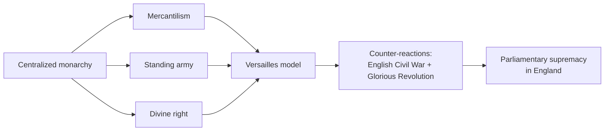

<RoughNotation type="underline" color="#b91c1c">The English Bill of Rights of 1689 ended absolutist claims in England seventy years before the French Revolution did the same in France.</RoughNotation>

<Quiz
  title="Era 1 check"
  questions={[
    {
      q: "Which document made it illegal for the English monarch to suspend laws or maintain a standing army without Parliament?",
      choices: ["Magna Carta", "Bill of Rights 1689", "Petition of Right 1628", "Habeas Corpus Act 1679"],
      answer: 1,
      explain: "The Bill of Rights, signed after William and Mary accepted Parliament's invitation, ended absolutist claims in England."
    },
    {
      q: "What does Louis XIV's line 'L'État, c'est moi' mean?",
      choices: ["The state belongs to the people", "I am the state", "The state belongs to God", "The state owes me"],
      answer: 1,
      explain: "Translates as 'I am the state.' Captures absolutism in five words."
    },
    {
      q: "Why is the Glorious Revolution called 'glorious'?",
      choices: ["It was a long bloody revolution", "James II was crowned king", "It transferred power without significant violence in England", "It restored Catholic rule"],
      answer: 2,
      explain: "Compared to the English Civil War 40 years earlier, the 1688 transfer of power was practically bloodless in England (though Ireland was a different story)."
    }
  ]}
/>

---

## 2. Scientific Revolution and Enlightenment, 1543 to 1789

<Particles preset="stars" height={260}>
  

    
Era 2 · 1543–1789

    <Typewriter
      variant="h2"
      text="I disapprove of what you say, but I will defend to the death your right to say it."
      speed={45}
      className="font-serif text-xl sm:text-2xl text-white leading-snug"
    />
    
Voltaire (paraphrase). The Enlightenment in one sentence.

  

</Particles>

The 16th and 17th centuries broke the medieval picture of the universe. Copernicus put the sun at the center; Galileo confirmed it with a telescope and was condemned by the Church for it; Newton showed the entire universe ran on mathematical laws. This was the <KeyTerm term="Scientific Revolution">A roughly two-century overhaul of European science (1543 to 1687) that replaced Aristotelian physics and earth-centered astronomy with experimental, math-driven explanations. Capstoned by Newton's *Principia* in 1687.</KeyTerm>: a method of reasoning, the <KeyTerm term="scientific method">Observe, hypothesize, experiment, revise. The rule that any claim about the natural world must be testable. Codified by Bacon and Descartes in the 17th century.</KeyTerm>, that produced reliable knowledge. The next century, philosophers asked: if reason works for stars, will it work for politics?

<Callout type="insight" title="Why this matters">
  The Enlightenment is the operating system of every revolution that follows. The American Declaration of Independence is a Lockean document. The French Declaration of the Rights of Man is a Rousseauian one. The Bill of Rights is a Montesquieuian one. When the 18th century is done thinking, the 17th-century absolute monarchy is dead, even if some thrones are still warm.
</Callout>

The thinkers worth knowing cold:

| Thinker | Big idea | Where it shows up |
|---|---|---|
| <KeyTerm term="Hobbes">Thomas Hobbes, 1588 to 1679. Argued in *Leviathan* (1651) that without strong central authority, life is "solitary, poor, nasty, brutish, and short." Used to defend absolutism.</KeyTerm> | Without a strong sovereign, life is brutal | Defends absolutism |
| <KeyTerm term="Locke">John Locke, 1632 to 1704. Argued in *Two Treatises of Government* (1689) that government exists to protect natural rights to life, liberty, and property. If it fails, citizens may overthrow it.</KeyTerm> | Natural rights, government by consent | American Declaration |
| <KeyTerm term="Voltaire">François-Marie Arouet, 1694 to 1778. French philosophe known for satire, advocacy of religious tolerance, and free speech. Targets: the Catholic Church, French monarchy, censorship.</KeyTerm> | Tolerance, free speech | Press freedom, secularism |
| <KeyTerm term="Montesquieu">Charles-Louis de Secondat, 1689 to 1755. *The Spirit of the Laws* (1748) argued for separation of powers among legislative, executive, and judicial branches.</KeyTerm> | <KeyTerm term="Separation of powers">Splitting government into branches that check each other. Originated by Montesquieu, embedded in the U.S. Constitution.</KeyTerm> | U.S. Constitution structure |
| <KeyTerm term="Rousseau">Jean-Jacques Rousseau, 1712 to 1778. *The Social Contract* (1762) argued legitimate government rests on the "general will" of the people. Inspired French and later democratic revolutionaries.</KeyTerm> | <KeyTerm term="Social contract">The agreement, real or implied, by which people give up some freedoms to government in exchange for protection of others. Theory developed by Hobbes, Locke, and Rousseau.</KeyTerm> | French Revolution |
| <KeyTerm term="Beccaria">Cesare Beccaria, 1738 to 1794. *On Crimes and Punishments* (1764) attacked torture and the death penalty, argued punishment should fit the crime. Foundation of modern criminal justice.</KeyTerm> | Reform criminal justice | Modern legal codes |
| <KeyTerm term="Wollstonecraft">Mary Wollstonecraft, 1759 to 1797. *A Vindication of the Rights of Woman* (1792) extended Enlightenment arguments to women. Foundational feminist text.</KeyTerm> | Women's rights | First-wave feminism |

These ideas spread through <KeyTerm term="Salons">Private gatherings hosted by educated women in 18th-century Paris where philosophers, writers, and aristocrats debated new ideas. The horizontal social network that powered the Enlightenment.</KeyTerm>, where literate women hosted philosophers and aristocrats together to argue about ideas, and through Diderot's massive *Encyclopedia* project. Some monarchs tried to absorb the new thinking without giving up power: <KeyTerm term="Enlightened despots">18th-century monarchs (Frederick the Great of Prussia, Catherine the Great of Russia, Joseph II of Austria) who adopted some Enlightenment reforms while keeping absolute political power. The contradiction was the point: reform from above to prevent revolution from below.</KeyTerm> like Frederick the Great or Catherine the Great. The contradiction (absolute power + Enlightenment ideas) couldn't last.

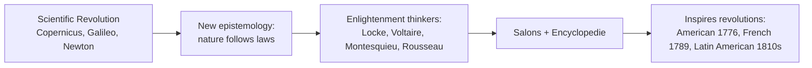

<RoughNotation type="circle" color="#b91c1c">If you can name the connection between Newton and Locke, you understand the entire 18th century: both believed reality follows discoverable laws.</RoughNotation>

<Quiz
  title="Era 2 check"
  questions={[
    {
      q: "Which thinker is associated with the social contract and the idea that 'the general will' should govern?",
      choices: ["Hobbes", "Locke", "Rousseau", "Montesquieu"],
      answer: 2,
      explain: "Rousseau's *Social Contract* (1762) argued that legitimate government must reflect the general will of the people."
    },
    {
      q: "Separation of powers among legislative, executive, and judicial branches was articulated by:",
      choices: ["Montesquieu in *The Spirit of the Laws*", "Locke in *Two Treatises*", "Voltaire in *Candide*", "Beccaria in *On Crimes and Punishments*"],
      answer: 0,
      explain: "Montesquieu, 1748. Embedded directly into the U.S. Constitution."
    },
    {
      q: "What was the contradiction at the heart of an enlightened despot like Frederick the Great?",
      choices: ["He hated Enlightenment thinkers", "He used Enlightenment ideas while keeping absolute power", "He gave up the throne", "He was Catholic"],
      answer: 1,
      explain: "Enlightened despots adopted reforms (legal codes, education) without surrendering autocracy. The point was reform from above to head off revolution from below."
    }
  ]}
/>

---

## 3. French Revolution, 1789 to 1799

<Particles preset="fire" height={260}>
  

    
Era 3 · 1789–1799

    <Typewriter
      variant="h2"
      text="Liberté, Égalité, Fraternité."
      speed={70}
      className="font-serif text-2xl sm:text-3xl text-white leading-snug"
    />
    
Liberty, equality, brotherhood. The slogan of the Revolution.

  

</Particles>

By 1789, France was bankrupt from wars, the harvests had failed, and Enlightenment ideas were on every educated tongue. The <KeyTerm term="Old Regime">The pre-1789 social and political order in France: divine-right monarchy + three estates + feudal privileges. Swept away in months by the Revolution.</KeyTerm> divided society into three estates: the First (clergy), the Second (nobility), and the Third (everyone else, including the wealthy <KeyTerm term="Bourgeoisie">The middle class: merchants, lawyers, professionals. Wealthy without noble status, bore most of the tax burden, drove the early Revolution.</KeyTerm>). The Third Estate paid most of the taxes; the first two paid almost none.

When <KeyTerm term="Louis XVI">King of France 1774 to 1792. Inherited a bankrupt state, vacillated under pressure, attempted to flee in 1791, and was executed by guillotine in January 1793.</KeyTerm> called the <KeyTerm term="Estates-General">A medieval assembly of the three estates, called by Louis XVI in May 1789 for the first time in 175 years to address the financial crisis. The Third Estate broke away to form the National Assembly.</KeyTerm> in 1789 to address the financial crisis, the Third Estate broke away and declared itself the <KeyTerm term="National Assembly">Self-declared by the Third Estate in June 1789. Took the Tennis Court Oath promising not to disband until France had a constitution. Became the legislative body of the early Revolution.</KeyTerm>, swore the <KeyTerm term="Tennis Court Oath">June 20, 1789. The Third Estate, locked out of their meeting hall, gathered at a tennis court and swore not to disband until France had a constitution.</KeyTerm>, and on July 14, 1789, Paris crowds stormed the <KeyTerm term="Bastille">A royal fortress and political prison in Paris. Stormed July 14, 1789, by a Paris crowd looking for gunpowder. Symbolically marked the end of the Old Regime; July 14 is now France's national holiday.</KeyTerm>. In August the Assembly published the <KeyTerm term="Declaration of the Rights of Man and Citizen">August 26, 1789. France's Enlightenment manifesto: men are born free and equal in rights; sovereignty resides in the nation; law is the expression of the general will. Permanent foundation of European human-rights thinking.</KeyTerm>, the Enlightenment expressed in legal form.

By 1793 the Revolution had radicalized. The <KeyTerm term="Jacobins">Radical revolutionary faction led by Robespierre. Drove the Reign of Terror.</KeyTerm> seized power, executed Louis XVI in January, and launched the <KeyTerm term="Reign of Terror">June 1793 to July 1794. Robespierre and the Committee of Public Safety executed political opponents at industrial scale via the guillotine. Roughly 17,000 official executions; thousands more died in prison.</KeyTerm> under the <KeyTerm term="Committee of Public Safety">The 12-man executive committee that ran France during the Reign of Terror. Robespierre dominated it.</KeyTerm>. The instrument was the <KeyTerm term="Guillotine">Mechanical execution device perfected in 1789. Sold to the public as humane and democratic: equal in death for noble and commoner. Used at industrial scale during the Reign of Terror.</KeyTerm>.

<GuillotineAnimation />

The Terror ate its own. <KeyTerm term="Robespierre">Maximilien Robespierre, 1758 to 1794. Lawyer, Jacobin, and architect of the Reign of Terror. Arrested and guillotined in July 1794 (the Thermidorian Reaction).</KeyTerm> was himself guillotined in July 1794 in the <KeyTerm term="Thermidorian Reaction">July 27, 1794. Convention members fearful of being purged next moved against Robespierre. He was executed the next day. Marked the end of the Reign of Terror.</KeyTerm>. The <KeyTerm term="Directory">The five-man executive committee that governed France 1795 to 1799 after the Terror. Corrupt, weak, and overthrown by Napoleon's coup of 18 Brumaire.</KeyTerm> took over: corrupt, weak, eventually overthrown by Napoleon.

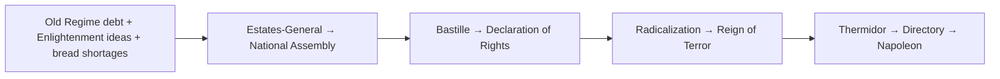

<Memorize
  title="Declaration of the Rights of Man and Citizen, opening articles"
  attribution="National Assembly, August 26, 1789"
  text={`Men are born and remain free and equal in rights. Social distinctions can be founded only on the common good.

The aim of every political association is the preservation of the natural and imprescriptible rights of man. These rights are liberty, property, security, and resistance to oppression.

The principle of all sovereignty resides essentially in the nation. No body, no individual can exercise authority that does not emanate expressly from it.

Law is the expression of the general will. All citizens have the right to take part, personally or through their representatives, in its formation.`}
/>

<Quiz
  title="Era 3 check"
  questions={[
    {
      q: "What event on July 14, 1789, became the symbolic start of the French Revolution?",
      choices: ["Tennis Court Oath", "Storming of the Bastille", "Execution of Louis XVI", "Coup of 18 Brumaire"],
      answer: 1,
      explain: "Bastille Day, France's national holiday, marks the storming of the royal fortress in Paris."
    },
    {
      q: "Who led the Committee of Public Safety during the Reign of Terror?",
      choices: ["Louis XVI", "Marie Antoinette", "Robespierre", "Napoleon"],
      answer: 2,
      explain: "Robespierre dominated the 12-man committee until July 1794, when he himself was guillotined."
    },
    {
      q: "The Thermidorian Reaction in July 1794 resulted in:",
      choices: ["The end of the monarchy", "The execution of Robespierre and the end of the Terror", "The rise of Napoleon", "The signing of the Declaration of the Rights of Man"],
      answer: 1,
      explain: "Convention members fearful of being purged next moved against Robespierre. He was executed July 28."
    }
  ]}
/>

---

## 4. Napoleon, 1799 to 1815

<VantaBackground type="halo" height={260}>
  

    
Era 4 · 1799–1815

    <Typewriter
      variant="h2"
      text="I love power. But it is as an artist that I love it."
      speed={48}
      className="font-serif text-xl sm:text-2xl text-white leading-snug"
    />
    
Napoleon Bonaparte. Hero of the Revolution. Emperor of France. Exile twice.

  

</VantaBackground>

In November 1799 a Corsican-born artillery officer named <KeyTerm term="Napoleon Bonaparte">1769 to 1821. Corsican artillery officer who rose during the Revolution, took power by coup in 1799, crowned himself Emperor of the French in 1804, conquered most of Europe, and was finally defeated at Waterloo in 1815. His Code reorganized civil law in 30+ countries.</KeyTerm> ended the Directory in a <KeyTerm term="Coup d'état">A sudden seizure of state power, usually by a small group. Napoleon's coup of 18 Brumaire (November 9, 1799) is the textbook case.</KeyTerm> on the 18th of Brumaire. Within five years he had crowned himself Emperor and was reorganizing European civil law through the <KeyTerm term="Napoleonic Code">Civil code promulgated in 1804. Eliminated feudal privilege, codified equality before the law, established property rights, and standardized contracts. Spread across most of Europe; modern French law is still based on it.</KeyTerm>.

He used <KeyTerm term="Plebiscite">A direct popular vote on a single question. Napoleon staged plebiscites three times to legitimize moves he had already made (Consul for Life, Empire). Always returned 99%+ approval.</KeyTerm> to legitimize each step (Consul for Life in 1802, Emperor in 1804, return from Elba in 1815). At his height in 1810, his empire ran from Madrid to Warsaw. Then the <KeyTerm term="Continental System">Napoleon's economic blockade of Britain, 1806 to 1814. Banned European nations from trading with Britain. Failed because European economies were more dependent on British trade than on French fiat. Russia broke it openly in 1810.</KeyTerm> and the 1812 invasion of Russia destroyed him.

  

    <Zdog shape="star" color="red" caption="Legion of Honor, 1802" size={120} />
  

  

    <Zdog shape="dagger" color="red" caption="Grande Armée" size={120} />
  

  

    <Zdog shape="hourglass" color="red" caption="100 days, 1815" size={120} />
  

Russia <KeyTerm term="Scorched-earth policy">Defensive strategy of burning crops, villages, and supplies as you retreat so the invader has nothing to live off. Russians used it against Napoleon in 1812; Soviets used it again against Hitler in 1941. Both invaders lost armies to starvation and winter.</KeyTerm>'d its way back to Moscow, leaving Napoleon's army nothing to eat. Of the 600,000 troops who entered Russia, fewer than 100,000 returned. He abdicated in 1814, escaped Elba for the Hundred Days in 1815, and lost permanently at <KeyTerm term="Waterloo">June 18, 1815. Wellington's British and Blücher's Prussian armies defeated Napoleon in Belgium. Napoleon exiled to St. Helena, where he died in 1821.</KeyTerm>.

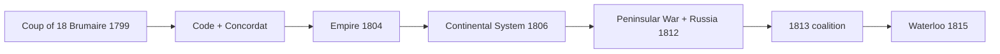

<RoughNotation type="underline" color="#b91c1c">The Continental System failed for the same reason most blockades fail: it asked European economies to do without their largest trading partner indefinitely.</RoughNotation>

<Quiz
  title="Era 4 check"
  questions={[
    {
      q: "Why did the Continental System fail?",
      choices: [
        "Napoleon ran out of soldiers",
        "Britain's navy was too weak to enforce a counter-blockade",
        "European economies depended on British trade more than on French alternatives",
        "Russia signed a separate peace"
      ],
      answer: 2,
      explain: "Smuggling thrived; Russia broke the system openly in 1810. The blockade was unenforceable across the entire continent."
    },
    {
      q: "What is Napoleon's most enduring legacy?",
      choices: ["The Continental System", "The Legion of Honor", "The Napoleonic Code", "The Concordat"],
      answer: 2,
      explain: "The 1804 civil code reorganized law in roughly 30 nations; modern French law still descends from it."
    },
    {
      q: "What broke Napoleon's empire?",
      choices: ["The British navy alone", "The 1812 invasion of Russia", "The Peninsular War alone", "The death of Marie Antoinette"],
      answer: 1,
      explain: "The Russian campaign of 1812 destroyed the Grande Armée. Of 600,000 men, fewer than 100,000 returned. The 1813 coalition followed."
    }
  ]}
/>

---

## 5. Congress of Vienna and the Age of Nationalism, 1815 to 1871

<VantaBackground type="rings" height={260}>
  

    
Era 5 · 1815–1871

    <Typewriter
      variant="h2"
      text="When France sneezes, the rest of Europe catches cold."
      speed={50}
      className="font-serif text-xl sm:text-2xl text-white leading-snug"
    />
    
Klemens von Metternich. The architect of post-Napoleonic Europe.

  

</VantaBackground>

After Napoleon's defeat, Europe's leaders met in Vienna to put the lid back on the bottle. The <KeyTerm term="Congress of Vienna">1814 to 1815. Five great powers (Britain, Russia, Austria, Prussia, restored France) met under Metternich's leadership to redraw Europe after Napoleon. Goals: restore legitimate monarchs, restore the balance of power, contain France.</KeyTerm> redrew the map under three principles: <KeyTerm term="Legitimacy">The principle that the rightful (pre-Napoleonic) royal dynasties should be restored to their thrones. Drove the Bourbon return to France, the restoration of the Habsburgs, and similar.</KeyTerm>, the <KeyTerm term="Balance of power">No single state should dominate Europe. Adjust borders, alliances, and buffer states to prevent any one power from outweighing the others. Held roughly from 1815 to 1914.</KeyTerm>, and conservative collaboration through the <KeyTerm term="Concert of Europe">Informal system 1815 to roughly 1914 in which the great powers met periodically to manage crises through diplomacy rather than war. Worked surprisingly well until Sarajevo.</KeyTerm>.

<KeyTerm term="Metternich">Klemens von Metternich, 1773 to 1859. Austrian Foreign Minister, Chancellor, master of the Concert of Europe. Hated nationalism, suppressed it ruthlessly inside the Habsburg Empire. Forced into exile during the 1848 revolutions.</KeyTerm> ran the system. He had reason to be paranoid: <KeyTerm term="Nationalism">The political idea that each nation (cultural and linguistic group) should have its own state. Threatened multi-ethnic empires (Habsburg, Ottoman, Russian) and unified previously divided peoples (Italians, Germans).</KeyTerm> was loose in Europe, and it threatened the multi-ethnic empires he served. The pattern repeated: liberal-nationalist uprisings (1830, 1848) pushed for constitutions and unified nation-states; conservative powers crushed them; some gains stuck. By 1871 both Italy (Cavour and Garibaldi) and Germany (Bismarck) had unified.

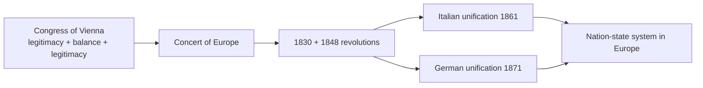

<Quiz
  title="Era 5 check"
  questions={[
    {
      q: "Which three principles guided the Congress of Vienna?",
      choices: ["Liberty, equality, fraternity", "Legitimacy, balance of power, conservative collaboration", "Industrialization, imperialism, militarism", "Democracy, sovereignty, nationalism"],
      answer: 1,
      explain: "Metternich's conservative trio: restore legitimate monarchs, prevent any one power from dominating, manage crises by joint diplomacy."
    },
    {
      q: "Why was nationalism a threat to Metternich's Austria?",
      choices: [
        "Austria had no national identity",
        "Austria was a multi-ethnic empire that nationalism would tear apart",
        "Austria was committed to communism",
        "Austria was bankrupt"
      ],
      answer: 1,
      explain: "The Habsburg Empire ruled Germans, Hungarians, Italians, Czechs, Poles, Romanians, and others. Nationalism was an existential threat."
    },
    {
      q: "Italy and Germany both unified into single nation-states by what year?",
      choices: ["1830", "1848", "1871", "1914"],
      answer: 2,
      explain: "Italy 1861 (Cavour, Garibaldi), Germany 1871 (Bismarck after the Franco-Prussian War)."
    }
  ]}
/>

---

## 6. Industrial Revolution, 1750 to 1900

<VantaBackground type="net" height={260}>
  

    
Era 6 · 1750–1900

    <Typewriter
      variant="h2"
      text="Workers of the world, unite. You have nothing to lose but your chains."
      speed={45}
      className="font-serif text-xl sm:text-2xl text-white leading-snug"
    />
    
Marx and Engels, *Communist Manifesto*, 1848.

  

</VantaBackground>

The Industrial Revolution started in Britain around 1750 because Britain had the right combination: coal, iron, capital, an <KeyTerm term="Agricultural Revolution">18th-century improvements (enclosure, crop rotation, selective breeding) that raised farm productivity, freed surplus labor for cities, and created the workforce for factories.</KeyTerm> that freed surplus labor, and stable institutions after 1688. <KeyTerm term="Industrialization">The shift from hand production in homes to machine production in factories. Started in textiles, spread to iron, then to chemistry, then to electricity. Reorganized human work and human cities.</KeyTerm> reorganized work: <KeyTerm term="Factors of production">Land, labor, capital, and entrepreneurship. The four inputs needed to produce goods. Britain had all four in 1750.</KeyTerm> moved into <KeyTerm term="Factory system">Centralized manufacturing under one roof, with machine-paced labor and a strict workday. Replaced the domestic "putting-out" system in textiles first.</KeyTerm>, peasants moved into cities (<KeyTerm term="Urbanization">The migration of population from rural areas to cities. Industrialization accelerated it dramatically; Manchester's population grew from ~25,000 in 1750 to ~300,000 by 1850.</KeyTerm>), and <KeyTerm term="Tenements">Crowded, unsanitary housing that sprang up in industrial cities. Tuberculosis, cholera, and child mortality were endemic.</KeyTerm> filled with workers.

The new economy needed an ideology. <KeyTerm term="Adam Smith">1723 to 1790. Scottish moral philosopher. *The Wealth of Nations* (1776) argued markets coordinate production better than governments. Originator of <KeyTerm term="Laissez-faire">"Let do." Economic policy in which government does not intervene in the market. Adam Smith's prescription, embraced by 19th-century British liberals.</KeyTerm> capitalism.</KeyTerm> defended <KeyTerm term="Capitalism">Economic system based on private ownership of the means of production, market exchange, and profit motive. Industrialized in Britain first, then spread.</KeyTerm>. Bentham's <KeyTerm term="Utilitarianism">"The greatest good for the greatest number." Jeremy Bentham's ethical theory; informed reformist liberals who pushed for child-labor laws, public health, and prison reform.</KeyTerm> argued for reform to maximize aggregate welfare. <KeyTerm term="Socialism">Economic system in which the means of production are owned collectively (often by the state) rather than privately. Originated as a 19th-century reaction to industrial inequality.</KeyTerm> said capitalism was unfair and demanded collective ownership. <KeyTerm term="Karl Marx">1818 to 1883. German philosopher and economist. *The Communist Manifesto* (1848 with Engels) and *Das Kapital* (1867) argued capitalism would be overthrown by the working class.</KeyTerm> went further with <KeyTerm term="Communism">Marx's vision of a classless, stateless society after the working class overthrows capitalism. The promise that animated 20th-century revolutionaries from Lenin to Mao.</KeyTerm>: capitalism contains the seeds of its own destruction.

Workers organized in <KeyTerm term="Unions">Worker associations that bargain collectively with employers for wages, hours, and conditions. Often illegal in the early industrial period; legalized in Britain 1871 and gradually elsewhere.</KeyTerm> and used <KeyTerm term="Strikes">Coordinated work stoppage to extract concessions from employers. The classic union tool.</KeyTerm> as their main weapon.

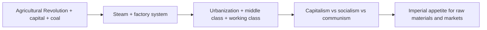

<RoughNotation type="circle" color="#b91c1c">Britain's combination of coal + capital + agricultural surplus + post-1688 stable institutions explains why industrialization started there and not in France or China.</RoughNotation>

<Quiz
  title="Era 6 check"
  questions={[
    {
      q: "Which factor most explains why Britain industrialized first?",
      choices: ["Strong central monarchy", "Coal + iron + capital + agricultural surplus + stable institutions", "Religious uniformity", "Lack of overseas colonies"],
      answer: 1,
      explain: "No single factor sufficed. Britain's combination of resources, finance, agricultural productivity, and political stability gave it the launchpad."
    },
    {
      q: "Who wrote the *Communist Manifesto*?",
      choices: ["Adam Smith", "John Stuart Mill", "Marx and Engels", "Charles Dickens"],
      answer: 2,
      explain: "Karl Marx and Friedrich Engels, 1848. The opening line 'a specter is haunting Europe, the specter of communism' is one of the most famous in political writing."
    },
    {
      q: "Laissez-faire is best described as:",
      choices: ["Government ownership of factories", "Government regulation of working conditions", "Government non-interference in markets", "Government redistribution of wealth"],
      answer: 2,
      explain: "Adam Smith's prescription. 'Let do.' Government should not intervene; the market coordinates better than central planners can."
    }
  ]}
/>

---

## 7. Imperialism, 1870 to 1914

<VantaBackground type="globe" height={260}>
  

    
Era 7 · 1870–1914

    <Typewriter
      variant="h2"
      text="Take up the White Man's burden."
      speed={50}
      className="font-serif text-xl sm:text-2xl text-white leading-snug"
    />
    
Rudyard Kipling, 1899. Read this as a primary source: the cultural justification for empire, in its own voice.

  

</VantaBackground>

<Callout type="warning" title="Reading the Kipling line">
  The phrase above is not an endorsement; it's a primary source from one of imperialism's biggest cheerleaders. The course expects you to recognize it as the cultural cover for material exploitation, and to be able to argue why the rhetoric outlasted the empire.
</Callout>

<KeyTerm term="Imperialism">Domination of one nation by another, politically, economically, or culturally. "New Imperialism" of 1870 to 1914 specifically refers to European, U.S., and Japanese expansion into Africa and Asia.</KeyTerm> went into overdrive after 1870. Industrial economies needed raw materials (rubber from Congo, oil from Persia, cotton from Egypt) and markets to sell back to. Industrial military technology (machine guns, steamships, quinine) made conquest cheaper than ever. The cultural cover came from <KeyTerm term="Social Darwinism">A late-19th-century misapplication of evolutionary theory to society. Argued some races and nations were "fitter" and morally entitled to dominate "less fit" peoples. Not science; ideology.</KeyTerm> and racist <KeyTerm term="Paternalism">"Father knows best." Ideology that imperial rule helped colonized peoples by bringing them civilization, religion, and order. Used to justify removing local sovereignty.</KeyTerm>.

The <KeyTerm term="Berlin Conference">November 1884 to February 1885. Fourteen European powers met in Berlin to partition Africa among themselves with no African delegates present. Created borders by line and ruler that ignored ethnic, linguistic, and religious geography. Roots of much of Africa's 20th-century instability.</KeyTerm> partitioned Africa with no African input. <KeyTerm term="Leopold II">King of the Belgians, 1865 to 1909. Personally owned the Congo Free State (~1885 to 1908) and ran it as a forced-labor rubber operation that killed an estimated 8 to 10 million Congolese.</KeyTerm> ran the Congo as a private rubber plantation under forced labor; estimates of Congolese dead during his reign reach 8 to 10 million. India was the British "<KeyTerm term="Jewel in the crown">Phrase for British India, the most economically and politically important colony in the British Empire. Britain ruled it directly through the Raj after 1858.</KeyTerm>"; the 1857 <KeyTerm term="Sepoy Mutiny">Indian uprising against the British East India Company, sparked partly by rumored use of pork and beef tallow on bullet cartridges (offensive to Hindu and Muslim soldiers). Britain crushed it and replaced Company rule with direct Crown rule (the Raj).</KeyTerm> failed and triggered direct Crown rule (the <KeyTerm term="Raj">Direct British rule of India, 1858 to 1947, after the Crown took over from the East India Company following the Sepoy Mutiny.</KeyTerm>).

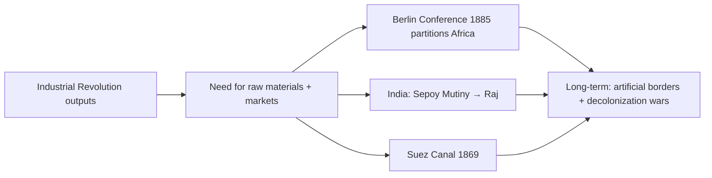

<Quiz
  title="Era 7 check"
  questions={[
    {
      q: "Why was the Berlin Conference of 1884 to 1885 important?",
      choices: [
        "It ended World War I",
        "It partitioned Africa among European powers without African delegates present",
        "It established the Suez Canal",
        "It launched the Sepoy Mutiny"
      ],
      answer: 1,
      explain: "Fourteen European powers drew straight-line borders across Africa that ignored ethnic, linguistic, and religious geography. Roots of much of the 20th-century instability."
    },
    {
      q: "What event triggered Britain's transition from Company rule to direct Crown rule (the Raj) in India?",
      choices: ["Boer War", "Sepoy Mutiny of 1857", "Berlin Conference", "Treaty of Versailles"],
      answer: 1,
      explain: "The Sepoy Mutiny, an Indian uprising in 1857, was crushed. Britain replaced East India Company rule with direct Crown rule the next year."
    },
    {
      q: "What ideology was used to justify European imperial rule on cultural grounds?",
      choices: ["Liberalism", "Social Darwinism + paternalism", "Pacifism", "Anarchism"],
      answer: 1,
      explain: "Social Darwinism (a misapplication of evolutionary theory) plus paternalism ('we're helping them by ruling them') gave moral cover to material exploitation."
    }
  ]}
/>

---

## 8. World War I, 1914 to 1918

<Particles preset="snow" height={260}>
  

    
Era 8 · 1914–1918

    <Typewriter
      variant="h2"
      text="The lamps are going out all over Europe; we shall not see them lit again in our lifetime."
      speed={42}
      className="font-serif text-xl sm:text-2xl text-white leading-snug"
    />
    
British Foreign Secretary Edward Grey, August 3, 1914.

  

</Particles>

The four pre-WWI causes are MAIN: Militarism, Alliances, Imperialism, Nationalism. Pre-war Europe had two armed camps: the <KeyTerm term="Triple Alliance">Pre-WWI alliance of Germany, Austria-Hungary, and Italy (1882). Italy switched sides in 1915 to join the Allies.</KeyTerm> (Germany, Austria-Hungary, Italy) and the <KeyTerm term="Triple Entente">Pre-WWI alliance of France, Russia, and Britain. Looser than the Triple Alliance but still binding enough that an attack on one drew the others in.</KeyTerm> (France, Russia, Britain). The Balkans were the "powder keg" of Europe: small nationalist states emerging from the dying Ottoman Empire, all jockeying for territory.

On June 28, 1914, the Serbian nationalist <KeyTerm term="Black Hand">Serbian terrorist organization that organized the assassination of Archduke Franz Ferdinand. Trained Gavrilo Princip and supplied weapons.</KeyTerm> assassinated Archduke Franz Ferdinand in Sarajevo. Austria-Hungary declared war on Serbia; Russia mobilized for Serbia; Germany declared war on Russia and France; Britain declared war on Germany when Germany invaded Belgium. Within six weeks the entire continent was at war. Germany's <KeyTerm term="Schlieffen Plan">Pre-war German war plan: knock France out of the war fast by sweeping through Belgium, then turn east to Russia. Failed at the First Battle of the Marne in September 1914; war became static.</KeyTerm> failed, and the <KeyTerm term="Western Front">The 600-mile front from the English Channel to the Swiss border. From late 1914 to spring 1918, almost no movement.</KeyTerm> froze into <KeyTerm term="Trench warfare">Static defensive warfare in opposing dug-in trenches. Crossing the no-man's land between trenches under artillery and machine gun fire was almost suicidal.</KeyTerm>.

<TrenchWarfareSim />

The war became <KeyTerm term="Total war">A war that mobilizes the entire society and economy. Industrial production retooled for weapons; civilians rationed; women entered factories; propaganda saturated public life.</KeyTerm>. By 1916, the battles of Verdun and the Somme were industrial-scale slaughter (Verdun: ~700,000 casualties; Somme: ~1.2 million). The U.S. entered in April 1917 after the <KeyTerm term="Zimmerman Note">January 1917 telegram from Germany's Foreign Secretary Zimmerman to Mexico, intercepted and decoded by Britain. Germany offered to help Mexico recover Texas, Arizona, New Mexico if Mexico joined the war against the U.S. Push factor in the U.S. declaration of war.</KeyTerm> and unrestricted submarine warfare. Russia exited via the <KeyTerm term="Treaty of Brest-Litovsk">March 1918. Lenin's new Bolshevik government signed a punishing peace with Germany to exit WWI. Russia lost ~25% of its population and ~33% of its industrial base.</KeyTerm>. Germany surrendered in November 1918.

The <KeyTerm term="Treaty of Versailles">June 28, 1919. The peace treaty that ended WWI. Imposed massive reparations on Germany, demilitarized the Rhineland, transferred German colonies to Allies, and (via Article 231) blamed Germany for starting the war.</KeyTerm>, signed in 1919, was harsher than Wilson's <KeyTerm term="Fourteen Points">U.S. President Woodrow Wilson's January 1918 peace proposals: open diplomacy, freedom of seas, free trade, self-determination, League of Nations. Most were watered down or dropped at Versailles.</KeyTerm> had promised. <KeyTerm term="Article 231">The "War Guilt Clause" of the Treaty of Versailles. Forced Germany to accept sole responsibility for starting WWI. Justified massive reparations and became a permanent grievance that Hitler exploited.</KeyTerm> blamed Germany for starting the war. The U.S. Senate refused to ratify, and the U.S. did not join the League of Nations.

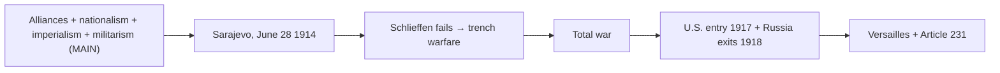

<Quiz
  title="Era 8 check"
  questions={[
    {
      q: "What does MAIN stand for as the four pre-WWI causes?",
      choices: [
        "Modernity, Aggression, Industry, Nationalism",
        "Militarism, Alliances, Imperialism, Nationalism",
        "Monarchies, Armies, Industries, Nations",
        "Munitions, Anglos, Italians, Nazis"
      ],
      answer: 1,
      explain: "Militarism + Alliances + Imperialism + Nationalism. The four-part standard answer for 'why did WWI start?'"
    },
    {
      q: "Who triggered the immediate outbreak in Sarajevo, June 28, 1914?",
      choices: [
        "Kaiser Wilhelm II",
        "A Serbian nationalist (Black Hand member Gavrilo Princip)",
        "Tsar Nicholas II",
        "An Austrian general"
      ],
      answer: 1,
      explain: "Princip, trained by the Black Hand, killed Archduke Franz Ferdinand and his wife."
    },
    {
      q: "Article 231 of the Treaty of Versailles is significant because:",
      choices: [
        "It established the League of Nations",
        "It was the War Guilt Clause that blamed Germany alone for WWI",
        "It set the WWII reparations",
        "It outlawed chemical weapons"
      ],
      answer: 1,
      explain: "Article 231 forced Germany to accept sole responsibility for starting WWI, justified massive reparations, and became Hitler's permanent grievance."
    }
  ]}
/>

---

## 9. Russian Revolution and Soviet Rise, 1917 to 1939

<VantaBackground type="fog" height={260}>
  

    
Era 9 · 1917–1939

    <Typewriter
      variant="h2"
      text='"Peace, Land, Bread."'
      speed={70}
      className="font-serif text-2xl sm:text-3xl text-white leading-snug"
    />
    
Bolshevik slogan, 1917. Three promises that won a revolution.

  

</VantaBackground>

WWI broke Tsarist Russia. Bread shortages in Petrograd, military catastrophes at the front, and total loss of confidence in Nicholas II produced the February Revolution of 1917. The Tsar abdicated. The <KeyTerm term="Provisional Government">The interim government that ran Russia between February and October 1917. Continued WWI, refused major land reform. Lost legitimacy because of those two failures.</KeyTerm> tried to keep fighting WWI; that finished it. In October, the <KeyTerm term="Bolsheviks">The radical Marxist faction of the Russian Social-Democratic Labor Party. Led by Lenin. Seized power in October 1917 and built the Soviet Union.</KeyTerm> seized power under <KeyTerm term="Lenin">Vladimir Ilyich Ulyanov, 1870 to 1924. Bolshevik leader who returned from exile in April 1917 (on a sealed German train), led the October Revolution, founded the Soviet Union, and ran it until his death.</KeyTerm>.

A vicious civil war followed (Reds vs Whites, ~1918 to 1922). Reds won. The early 1920s ran the <KeyTerm term="NEP">New Economic Policy, 1921 to 1928. Lenin's pragmatic retreat from War Communism: small-scale private trade allowed, peasants kept their land. Stalin abandoned it.</KeyTerm>, a partial market retreat. Lenin died in 1924. <KeyTerm term="Stalin">Joseph Stalin, 1878 to 1953. Bolshevik who outmaneuvered Trotsky to take Soviet leadership in the late 1920s. Ran the USSR through Five-Year Plans, the Great Purge, and WWII.</KeyTerm> outmaneuvered Trotsky and seized control by 1928.

<KeyTerm term="Totalitarianism">A political system in which the state seeks total control over public AND private life: economy, education, family, religion, art. Stalin's USSR is one example; Hitler's Germany is another.</KeyTerm> took shape under Stalin. The first <KeyTerm term="Five-Year Plans">Soviet centralized economic plans starting in 1928. Goal: rapid industrialization. Method: shift labor from countryside to factories, mass collectivization, brutal quotas.</KeyTerm> launched in 1928 with rapid industrialization through forced <KeyTerm term="Collectivization">Forced merger of millions of peasant farms into state-run "collective" farms. Peasants resisted; Stalin treated resistance as kulak counter-revolution. Roughly 5 million dead in the resulting famine, especially in Ukraine (the Holodomor of 1932 to 1933).</KeyTerm>.

<FiveYearPlanGame />

The <KeyTerm term="Great Purge">1936 to 1938. Stalin's mass arrests, show trials, and executions of political rivals, military officers, intellectuals, and ordinary citizens. Roughly 750,000 executed; millions sent to the Gulag.</KeyTerm> followed: ~750,000 executed, millions sent to the Gulag. The Red Army officer corps was decimated, which would matter when Hitler invaded.

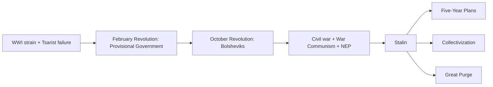

<Quiz
  title="Era 9 check"
  questions={[
    {
      q: "What was the most direct catalyst of the February Revolution in Russia?",
      choices: [
        "Lenin's return from Switzerland",
        "Bread shortages and the failure of the Tsar's leadership in WWI",
        "Stalin's purges",
        "The Treaty of Brest-Litovsk"
      ],
      answer: 1,
      explain: "WWI strain, Petrograd food shortages, and military defeats collapsed Tsarist legitimacy in days. Lenin returned later (April) on a German-arranged train."
    },
    {
      q: "Why did the Provisional Government fail between February and October 1917?",
      choices: [
        "It was overthrown by the Whites",
        "It refused to exit WWI or implement major land reform",
        "It was Communist",
        "It was monarchist"
      ],
      answer: 1,
      explain: "Continuing WWI and refusing land reform meant Russian peasants and soldiers had no reason to defend the new government when the Bolsheviks struck."
    },
    {
      q: "What was Stalin's first Five-Year Plan designed to do?",
      choices: ["Reduce inequality gradually", "Rapidly industrialize the USSR through collectivization and forced labor", "Restore Tsarist institutions", "Liberalize the economy"],
      answer: 1,
      explain: "Launched 1928. Industrial output rose dramatically; ~5 million died in the resulting famine, especially in Ukraine."
    }
  ]}
/>

---

## 10. Interwar Years, 1919 to 1939

<VantaBackground type="dots" height={260}>
  

    
Era 10 · 1919–1939

    <Typewriter
      variant="h2"
      text="Peace for our time."
      speed={50}
      className="font-serif text-2xl sm:text-3xl text-white leading-snug"
    />
    
Neville Chamberlain, returning from Munich, September 30, 1938. Eleven months later WWII began.

  

</VantaBackground>

Versailles created a fragile peace. Germany's <KeyTerm term="Weimar Republic">The democratic German government 1919 to 1933. Stigmatized by association with the Versailles signing. Fragile coalition governments, <KeyTerm term="Hyperinflation">An out-of-control inflation spiral. Weimar Germany's 1923 episode pushed the cost of a loaf of bread to billions of marks. Wiped out middle-class savings overnight.</KeyTerm> in 1923, brief recovery via the <KeyTerm term="Dawes Plan">1924. American-led restructuring of German reparations. U.S. banks lent to Germany, which paid France and Britain, which paid the U.S. back. Linked European recovery to U.S. credit.</KeyTerm>, then collapsed under the Depression.</KeyTerm> was branded the "stab in the back" government by the right and never had broad legitimacy. <KeyTerm term="Article 48">The Weimar Constitution emergency clause that let the President rule by decree in a crisis. Used legally hundreds of times after 1930. Hitler used it to dismantle democracy in 1933.</KeyTerm> let the President rule by decree in emergencies.

The 1929 <KeyTerm term="Stock Market Crash">October 1929 Wall Street crash. Triggered the Great Depression, which spread internationally through linked banking systems and tariff retaliation.</KeyTerm> exported the Great Depression. <KeyTerm term="Tariffs">Taxes on imports. The Smoot-Hawley Tariff (1930) was the U.S.'s response to the Crash; other countries retaliated. Global trade collapsed by ~65% by 1934.</KeyTerm> deepened it. Mass unemployment radicalized European voters. <KeyTerm term="Fascism">Far-right authoritarian ideology emphasizing extreme nationalism, hierarchy, militarism, and a single leader. Mussolini coined the term in Italy (1922); Hitler adapted it as Nazism.</KeyTerm> rose: <KeyTerm term="Mussolini">Benito Mussolini, 1883 to 1945. Founder of fascism. Marched on Rome in 1922 and ruled Italy until 1943. Hanged by Italian partisans April 1945.</KeyTerm> in Italy by 1922, <KeyTerm term="Hitler">Adolf Hitler, 1889 to 1945. Austrian-born German politician. Beer Hall Putsch 1923, *Mein Kampf* in prison, appointed Chancellor January 1933, dictator by August. Drove WWII and the Holocaust. Died by suicide April 30, 1945.</KeyTerm> in Germany by 1933.

Hitler's path: <KeyTerm term="Beer Hall Putsch">November 1923 failed coup attempt in Munich. Hitler imprisoned briefly; wrote *Mein Kampf* in prison; learned that legal seizure was the better path.</KeyTerm> in 1923, *<KeyTerm term="Mein Kampf">"My Struggle." Hitler's 1925 to 1926 autobiography and political manifesto. Laid out anti-Semitism, <KeyTerm term="Lebensraum">"Living space." Hitler's idea that Germany needed to expand eastward into Slavic lands to feed its population. Used to justify the invasion of Poland and the USSR.</KeyTerm>, the <KeyTerm term="Führer Principle">Total obedience to the leader (Führer). Embedded in Nazi ideology. Hitler's word was law.</KeyTerm>, and the goal of conquering Eastern Europe. Should have been a warning.</KeyTerm>* in prison, appointed Chancellor in January 1933, used Article 48 plus the Reichstag Fire to dismantle democracy by March, became absolute leader by August 1934.

The Western powers chose <KeyTerm term="Appeasement">The policy of granting concessions to Hitler in hopes he would be satisfied. Most associated with British PM Chamberlain. Failed because each concession encouraged the next demand.</KeyTerm>. The <KeyTerm term="Munich Agreement">September 1938. Britain and France gave Hitler the Sudetenland (western Czechoslovakia) in exchange for a promise of "peace for our time." Hitler annexed the rest of Czechoslovakia in March 1939. The textbook example of appeasement's failure.</KeyTerm> handed Hitler the Sudetenland in September 1938; he took the rest of Czechoslovakia six months later.

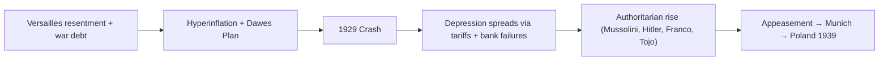

<Quiz
  title="Era 10 check"
  questions={[
    {
      q: "The Munich Agreement of 1938 illustrated which policy and why did it fail?",
      choices: [
        "Containment; it underestimated Soviet expansion",
        "Appeasement; Hitler interpreted concessions as weakness and invaded Czechoslovakia and Poland months later",
        "Brinkmanship; the Allies overcommitted",
        "Isolationism; Britain refused to act"
      ],
      answer: 1,
      explain: "Chamberlain's 'peace for our time' gambit traded the Sudetenland for promised peace. Hitler annexed the rest of Czechoslovakia in March 1939 and invaded Poland September 1."
    },
    {
      q: "Which Weimar Constitution clause let Hitler dismantle democracy by decree?",
      choices: ["Article 48", "Article 231", "The Bill of Rights", "Article 1"],
      answer: 0,
      explain: "Article 48's emergency clause was legally invoked to suspend civil liberties after the Reichstag Fire. The Enabling Act followed, giving Hitler dictatorial powers."
    },
    {
      q: "What was the primary lesson many democracies drew from the failure of the Munich Agreement?",
      choices: ["Negotiation always works", "Dictators must be confronted, not appeased", "International institutions always succeed", "Tariffs solve aggression"],
      answer: 1,
      explain: "Munich became shorthand for the failure of appeasement. The lesson reshaped postwar Cold War strategy (containment instead of accommodation)."
    }
  ]}
/>

---

## 11. World War II, 1939 to 1945

<VantaBackground type="clouds" height={260}>
  

    
Era 11 · 1939–1945

    <Typewriter
      variant="h2"
      text="We shall fight on the beaches…we shall never surrender."
      speed={45}
      className="font-serif text-xl sm:text-2xl text-white leading-snug"
    />
    
Winston Churchill, House of Commons, June 4, 1940.

  

</VantaBackground>

This section is intentionally compressed because there is a dedicated deep-dive guide. Open it for the full story: [Chapter 16 WWII Full Guide](/guides/world-war-ii). What you must know to pass the final:

The Nazi-Soviet Pact of August 1939 cleared Hitler's path to invade Poland on September 1. <KeyTerm term="Blitzkrieg">"Lightning war." German combined-arms doctrine of 1939 to 1941: tanks and dive bombers concentrate force at a single point, breaking the line and racing into the rear before the defender can react.</KeyTerm> conquered most of continental Europe in nine months. The <KeyTerm term="Battle of Britain">August to October 1940. RAF defended Britain against Luftwaffe air assault. Britain's victory ended Hitler's hope of invading. First major Allied success.</KeyTerm> ended Hitler's hope of invading the UK. <KeyTerm term="Operation Barbarossa">June 22, 1941. Hitler's invasion of the USSR. Initial gains huge; the Soviets traded space for time and counter-attacked at Stalingrad in 1942 to 1943.</KeyTerm> bogged down in Russian winter.

The U.S. entered after Pearl Harbor (December 7, 1941). The tide turned at <KeyTerm term="Stalingrad">August 1942 to February 1943. Soviet defense and counter-encirclement of the German Sixth Army at Stalingrad. ~2 million casualties. The Eastern Front turning point.</KeyTerm> in winter 1942 to 1943 and at <KeyTerm term="Midway">June 1942. U.S. Navy ambush of a Japanese carrier force in the central Pacific. Sank 4 Japanese carriers. The Pacific turning point.</KeyTerm> in June 1942.

<DDayLandingSim />

<KeyTerm term="D-Day">June 6, 1944. ~156,000 Allied troops landed in Normandy. Largest amphibious operation in history. Opened the second front in Western Europe.</KeyTerm> opened the second front. Germany surrendered May 8, 1945 (V-E Day). The U.S. dropped atomic bombs on Hiroshima (August 6) and Nagasaki (August 9), 1945. Japan surrendered August 14 (V-J Day).

The <KeyTerm term="Holocaust">Nazi systematic genocide of European Jews, plus Roma, disabled people, gay people, and Slavic POWs. Six million Jews murdered in extermination camps and shooting actions.</KeyTerm> killed 6 million Jews and millions of others. Camps like <KeyTerm term="Auschwitz">The largest Nazi extermination camp, in occupied Poland. Roughly 1.1 million people, mostly Jews, were murdered there.</KeyTerm> are central to the moral memory of the 20th century.

```mermaid
flowchart LR
  A[Nazi-Soviet Pact] --> B[Poland Sept 1939]
  B --> C[Blitzkrieg conquers continent]
  C --> D[Battle of Britain]
  D --> E[Barbarossa June 1941]
  E --> F[Pearl Harbor Dec 1941]
  F --> G[Stalingrad + Midway 1942-43]
  G --> H[D-Day 1944]
  H --> I[V-E Day May 1945]
  I --> J[Hiroshima + Nagasaki August 1945]
  J --> K[V-J Day]
```

<Quiz
  title="Era 11 check"
  questions={[
    {
      q: "Why was Stalingrad a turning point on the Eastern Front?",
      choices: [
        "Germany captured Moscow",
        "Soviet forces encircled and destroyed the German Sixth Army, halting the eastern advance",
        "The Allies invaded France",
        "The atomic bomb was used"
      ],
      answer: 1,
      explain: "Soviet counter-encirclement at Stalingrad in winter 1942 to 1943 destroyed the Sixth Army and broke German offensive capacity in the east."
    },
    {
      q: "What was the strategic importance of D-Day?",
      choices: [
        "It freed Berlin",
        "It opened a second front in Western Europe, forcing Germany to fight on two fronts at once",
        "It ended the Pacific War",
        "It captured Italy"
      ],
      answer: 1,
      explain: "Germany had to defend both east (against the USSR) and west (against the Allies). The two-front squeeze finished the Reich within 11 months."
    },
    {
      q: "Why did the Allies use the atomic bomb on Japan?",
      choices: [
        "Japan had no army left",
        "To force Japan's surrender without a costly invasion of the home islands and to demonstrate power to the USSR",
        "Because Truman wanted revenge for Pearl Harbor",
        "To stop Hitler"
      ],
      answer: 1,
      explain: "Truman cited the projected casualties of an invasion (~500,000 to 1 million U.S. dead, plus Japanese). Demonstrating the bomb to the Soviets was a secondary motivation."
    }
  ]}
/>

---

## 12. Cold War, 1945 to 1991

<Particles preset="stars" height={260}>
  

    
Era 12 · 1945–1991

    <Typewriter
      variant="h2"
      text="Mr. Gorbachev, tear down this wall!"
      speed={50}
      className="font-serif text-xl sm:text-2xl text-white leading-snug"
    />
    
Ronald Reagan at the Brandenburg Gate, June 12, 1987.

  

</Particles>

The Cold War was a 46-year political, economic, and ideological standoff between the U.S. and USSR that never became a hot direct war between them, but spawned proxy wars on every continent.

<Callout type="insight" title="Why the Cold War still matters">
  Almost every geopolitical conflict on the news today, NATO expansion, the South China Sea, Iran, Korea, Russia and Ukraine, Cuba, has roots that lead back to a Cold War decision made between 1945 and 1991. Understanding the original logic is the cheapest way to make sense of the present.
</Callout>

The <KeyTerm term="Yalta Conference">February 1945. FDR, Churchill, and Stalin met to plan the post-war order. Agreed to "free elections" in Eastern Europe. Stalin reneged immediately.</KeyTerm> set the stage. By 1946 Churchill was warning of an "Iron Curtain"; by 1947 Truman articulated <KeyTerm term="Containment">U.S. Cold War strategy: prevent Soviet expansion wherever it appears. Articulated by George Kennan in 1946. Justified the Truman Doctrine, Marshall Plan, NATO, Korean War.</KeyTerm> in his <KeyTerm term="Truman Doctrine">March 1947. Truman pledged U.S. support to "free peoples resisting subjugation by armed minorities or outside pressures." Specifically aimed at Greece and Turkey but became a general containment doctrine.</KeyTerm>.

The <KeyTerm term="Marshall Plan">1948 to 1952. About 13 billion dollars in U.S. aid to rebuild Western Europe. Doubled industrial output, prevented economic collapse, anchored Western Europe to the U.S. economically and politically. Refused by Soviet bloc.</KeyTerm> rebuilt Western Europe (13B over 4 years). The 1948 to 1949 <KeyTerm term="Berlin Blockade">Soviet blockade of West Berlin June 1948 to May 1949. The U.S. and Britain responded with the Berlin Airlift, supplying the city by air for 11 months.</KeyTerm> was the first major test; the airlift won the propaganda war. <KeyTerm term="NATO">North Atlantic Treaty Organization, 1949. Defensive alliance of U.S., Canada, and Western European countries. Article 5: an attack on one is an attack on all.</KeyTerm> was created in 1949; the <KeyTerm term="Warsaw Pact">Soviet-led military alliance, 1955 to 1991. Counterpart to NATO. Members included USSR, East Germany, Poland, Czechoslovakia, Hungary, Romania, Bulgaria, Albania (until 1968).</KeyTerm> in 1955.

The <KeyTerm term="Cuban Missile Crisis">October 14 to 28, 1962. The closest the world has come to nuclear war. Soviet missiles in Cuba; U.S. quarantine; Khrushchev's two letters; back-channel deal. Resolved by JFK's Trollope ploy plus a private agreement to remove Jupiter missiles from Turkey.</KeyTerm> was the closest the world came to nuclear war. <KeyTerm term="MAD">Mutually Assured Destruction. The doctrine that since both sides could destroy the other in a nuclear exchange, neither could rationally start one. Made nuclear weapons effectively unusable as offensive tools.</KeyTerm> shaped strategy from then on.

<MissileCrisisGame />

In Asia, <KeyTerm term="Vietnam War">~1955 to 1975. U.S. effort to prevent communist takeover of South Vietnam. Cost ~58,000 American lives and 1 to 3 million Vietnamese; ended in U.S. withdrawal and Vietnamese reunification under the North.</KeyTerm> dragged on for two decades, a humiliating defeat for the U.S. The Vietcong's mastery of jungle terrain made conventional warfare nearly useless.

<JungleSpot />

The end came surprisingly fast. <KeyTerm term="Gorbachev">Mikhail Gorbachev, born 1931. Last leader of the USSR (1985 to 1991). Introduced glasnost and perestroika in an effort to reform the Soviet system; ended up dissolving it. Won the Nobel Peace Prize in 1990.</KeyTerm> introduced <KeyTerm term="Glasnost">"Openness." Gorbachev's policy 1985 onward of permitting public discussion of Soviet problems, freer press, and political plurality.</KeyTerm> and <KeyTerm term="Perestroika">"Restructuring." Gorbachev's economic reforms 1985 onward, attempting to introduce market mechanisms into the Soviet system. Made things worse before they could get better.</KeyTerm>. By 1989, Eastern European communist regimes fell one by one; the <KeyTerm term="Berlin Wall">Erected August 13, 1961, by East Germany to stop the flow of refugees to the West. Symbol of the Cold War divide. Fell November 9, 1989.</KeyTerm> fell on November 9, 1989. The Soviet Union dissolved on December 25, 1991.

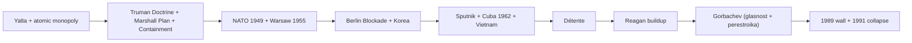

<Quiz
  title="Era 12 check"
  questions={[
    {
      q: "Why was the Berlin Airlift more successful than the Berlin Blockade was harmful?",
      choices: [
        "The Soviets ran out of food first",
        "NATO supplied West Berlin by air for 11 months at industrial scale, exposing the blockade as a propaganda failure",
        "The U.S. used nuclear threats",
        "East Germans rebelled"
      ],
      answer: 1,
      explain: "From June 1948 to May 1949, ~2.3M tons of supplies were flown into West Berlin. The Soviets ended the blockade with no concessions gained."
    },
    {
      q: "What does MAD stand for and why did it stabilize the Cold War?",
      choices: [
        "Massive American Deployment; it intimidated the USSR",
        "Mutually Assured Destruction; both sides could destroy the other, so neither could rationally start a nuclear war",
        "Military Alliance Doctrine; it bound NATO",
        "Maximum Atomic Defense; it referred to ABM systems"
      ],
      answer: 1,
      explain: "MAD made nuclear weapons effectively unusable as offensive tools and became the strategic logic of the entire arms race."
    },
    {
      q: "Which Gorbachev policy was about political openness and freer press?",
      choices: ["Perestroika", "Glasnost", "Containment", "Détente"],
      answer: 1,
      explain: "Glasnost = 'openness.' Perestroika = 'restructuring' (economic). Together they unintentionally dissolved the system they were meant to reform."
    }
  ]}
/>

---

## Putting it all together

Across five centuries the same patterns recur: ideas escape elite control and become movements; movements demand legitimacy from a state; the state either adapts (Glorious Revolution, Bismarckian Germany) or breaks (French Revolution, Tsarist Russia, Weimar Germany). Industrial technology repeatedly outruns the political institutions trying to govern it. Multi-ethnic empires (Habsburg, Ottoman, Romanov, Soviet) all eventually fail under the pressure of nationalism. And every grand peace settlement contains the seeds of the next war: Vienna held for 99 years, Versailles for 20, Yalta for 46.

<Callout type="insight" title="One-sentence test for any era">
  When a question is hard, ask: <em>which class is rising, which class is falling, and what new technology is reshaping power?</em> That covers most of modern Europe.
</Callout>

## Final exam mock test

Set the timer for 50 minutes. Take the quiz cold. Click "↻ New quiz" to cycle through six different question banks. Each bank is keyed to a different cluster of eras.

<TestTimer minutes={50} title="Modern Europe Final Mock" />

<Quiz
  title="Final mock: Modern Europe 1500 to 1991"
  questions={[
    {
      q: "Which document established that the English monarch could not suspend laws or maintain a standing army without Parliament's consent?",
      choices: ["Magna Carta", "English Bill of Rights 1689", "Petition of Right 1628", "Habeas Corpus Act 1679"],
      answer: 1,
      explain: "The Bill of Rights (1689) was signed when William and Mary accepted Parliament's invitation to take the throne after the Glorious Revolution."
    },
    {
      q: "Why did the Continental System fail?",
      choices: ["Napoleon ran out of soldiers", "Britain's navy was too weak to enforce a counter-blockade", "European economies depended on British trade more than on French alternatives", "Russia signed a separate peace"],
      answer: 2,
      explain: "Smuggling thrived; Russia broke the system openly in 1810. The blockade was unenforceable across the entire continent."
    },
    {
      q: "Which factor most explains why Britain industrialized first?",
      choices: ["Strong central monarchy", "Coal + iron + capital + agricultural surplus + stable institutions", "Religious uniformity", "Lack of overseas colonies"],
      answer: 1,
      explain: "Britain's combination of resources, finance, agricultural productivity, and political institutions gave it the launchpad."
    },
    {
      q: "Why was the Berlin Conference of 1884 to 1885 important?",
      choices: ["It ended World War I", "It partitioned Africa among European powers without African delegates present", "It established the Suez Canal", "It launched the Sepoy Mutiny"],
      answer: 1,
      explain: "Roots of much of Africa's 20th-century instability."
    },
    {
      q: "What does MAIN stand for as the four pre-WWI causes?",
      choices: ["Modernity, Aggression, Industry, Nationalism", "Militarism, Alliances, Imperialism, Nationalism", "Monarchies, Armies, Industries, Nations", "Munitions, Anglos, Italians, Nazis"],
      answer: 1,
      explain: "Militarism, Alliances, Imperialism, Nationalism."
    },
    {
      q: "What was the most direct catalyst of the February Revolution in Russia?",
      choices: ["Lenin's return from Switzerland", "Bread shortages and the failure of the Tsar's leadership in WWI", "Stalin's purges", "The Treaty of Brest-Litovsk"],
      answer: 1,
      explain: "WWI strain plus Petrograd food shortages collapsed Tsarist legitimacy in days."
    },
    {
      q: "The Munich Agreement of 1938 illustrated which policy and why did it fail?",
      choices: ["Containment; it underestimated Soviet expansion", "Appeasement; Hitler interpreted concessions as weakness and invaded Czechoslovakia and Poland months later", "Brinkmanship; the Allies overcommitted", "Isolationism; Britain refused to act"],
      answer: 1,
      explain: "Hitler annexed the rest of Czechoslovakia in March 1939 and invaded Poland September 1, 1939."
    },
    {
      q: "Why was the Berlin Airlift more successful than the Berlin Blockade was harmful?",
      choices: ["The Soviets ran out of food first", "NATO supplied West Berlin by air for 11 months at industrial scale, exposing the blockade as a propaganda failure", "The U.S. used nuclear threats", "East Germans rebelled"],
      answer: 1,
      explain: "From June 1948 to May 1949, ~2.3M tons of supplies were flown into West Berlin."
    },
    {
      q: "Which Enlightenment thinker is most associated with separation of powers?",
      choices: ["Hobbes", "Locke", "Rousseau", "Montesquieu"],
      answer: 3,
      explain: "*The Spirit of the Laws*, 1748. Embedded in the U.S. Constitution."
    },
    {
      q: "Stalingrad (1942 to 1943) is best described as:",
      choices: ["A naval battle in the Pacific", "The Eastern Front turning point that destroyed the German Sixth Army", "A diplomatic conference", "The site of the atomic bomb"],
      answer: 1,
      explain: "Soviet counter-encirclement; ~2 million casualties; broke German offensive capacity in the east."
    },
    {
      q: "What was glasnost?",
      choices: ["Soviet economic restructuring", "Soviet political openness and freer press", "A nuclear treaty", "A Soviet military doctrine"],
      answer: 1,
      explain: "Glasnost = 'openness.' Perestroika = 'restructuring' (economic)."
    },
    {
      q: "Which slogan summed up the Bolshevik appeal in 1917?",
      choices: ["Liberty, Equality, Fraternity", "Peace, Land, Bread", "Workers of the world, unite", "Lebensraum"],
      answer: 1,
      explain: "Three promises that won a revolution: end the war, give peasants the land, feed the cities."
    }
  ]}
  extraBanks={[
    [
      { q: "Who is the 'Sun King'?", choices: ["Charles I", "Louis XIV", "James II", "William of Orange"], answer: 1, explain: "Louis XIV, 1643 to 1715. Built Versailles. Reigned over the apex of French absolutism." },
      { q: "Heliocentric theory was proposed by:", choices: ["Aristotle", "Copernicus", "Newton", "Hobbes"], answer: 1, explain: "Copernicus's *De Revolutionibus* (1543) put the sun at the center of the solar system, replacing the geocentric Aristotelian model." },
      { q: "Locke's *Two Treatises* argues:", choices: ["Government should never be limited", "Government exists to protect natural rights and may be overthrown if it fails", "Society needs an absolute sovereign", "Property is theft"], answer: 1, explain: "Lockean foundation for the American Declaration of Independence." },
      { q: "An enlightened despot was a monarch who:", choices: ["Renounced absolutism", "Adopted some Enlightenment reforms while keeping absolute power", "Established democracy", "Became a philosopher"], answer: 1, explain: "Frederick the Great, Catherine the Great, Joseph II. Reform from above to head off revolution from below." },
      { q: "Beccaria's *On Crimes and Punishments* argued for:", choices: ["Stricter capital punishment", "An end to torture and reform of criminal justice", "Trial by ordeal", "Religious courts"], answer: 1, explain: "1764. Foundation of modern criminal-justice reform." }
    ],
    [
      { q: "Storming of the Bastille:", choices: ["May 5, 1789", "July 14, 1789", "August 26, 1789", "January 21, 1793"], answer: 1, explain: "France's national holiday." },
      { q: "Robespierre led which body during the Reign of Terror?", choices: ["The Estates-General", "The Committee of Public Safety", "The Directory", "The Jacobin Club exclusively"], answer: 1, explain: "The 12-man Committee of Public Safety dominated France from June 1793 to July 1794." },
      { q: "Napoleon crowned himself emperor in:", choices: ["1799", "1804", "1812", "1815"], answer: 1, explain: "December 2, 1804. Notably, he placed the crown on his own head." },
      { q: "What was the Concert of Europe?", choices: ["A musical festival", "An informal system of great-power diplomacy that managed crises 1815 to 1914", "A pan-European parliament", "A military alliance"], answer: 1, explain: "Worked surprisingly well at managing 19th-century crises until Sarajevo." },
      { q: "Italy and Germany unified into nation-states by:", choices: ["1830", "1848", "1871", "1914"], answer: 2, explain: "Italy 1861 (Cavour, Garibaldi); Germany 1871 (Bismarck after the Franco-Prussian War)." }
    ],
    [
      { q: "Which event accelerated industrialization in Britain by freeing labor for cities?", choices: ["The Glorious Revolution", "The Agricultural Revolution", "The Crusades", "The Reformation"], answer: 1, explain: "Enclosure, crop rotation, selective breeding raised farm productivity, freeing labor." },
      { q: "Adam Smith's *Wealth of Nations* (1776) defended:", choices: ["Communism", "Mercantilism", "Laissez-faire capitalism", "Feudalism"], answer: 2, explain: "Markets coordinate production better than governments." },
      { q: "Who wrote *Das Kapital*?", choices: ["Adam Smith", "Karl Marx", "Charles Dickens", "Friedrich Nietzsche"], answer: 1, explain: "Marx, 1867. Sequel to the *Communist Manifesto* (1848)." },
      { q: "The Berlin Conference of 1884 to 1885 was significant because:", choices: ["It ended WWI", "It partitioned Africa with no African delegates present", "It established the Common Market", "It legalized the slave trade"], answer: 1, explain: "Created borders by ruler that ignored ethnic geography. Roots of many modern conflicts." },
      { q: "Which Indian uprising prompted Britain to switch from Company rule to direct Crown rule (the Raj)?", choices: ["The Boer Revolt", "The Sepoy Mutiny of 1857", "The Salt March", "The Bengal Famine"], answer: 1, explain: "1857 Sepoy Mutiny against the East India Company. Britain crushed it; Crown took over in 1858." }
    ],
    [
      { q: "What does the 'M' in MAIN stand for?", choices: ["Monarchy", "Militarism", "Mercantilism", "Modernization"], answer: 1, explain: "MAIN = Militarism, Alliances, Imperialism, Nationalism." },
      { q: "The Schlieffen Plan failed at:", choices: ["Verdun", "The First Battle of the Marne", "Sarajevo", "Ypres"], answer: 1, explain: "September 1914. The German advance stalled, and the Western Front froze into trench warfare." },
      { q: "Article 231 of the Treaty of Versailles:", choices: ["Set up the League of Nations", "Was the War Guilt Clause", "Limited French troops", "Created the Polish Corridor"], answer: 1, explain: "The War Guilt Clause justified massive reparations and became Hitler's permanent grievance." },
      { q: "What did the Bolshevik slogan 'Peace, Land, Bread' promise?", choices: ["End the war + give peasants the land + feed the cities", "Defeat Germany + restore the Tsar + collectivize farms", "Free elections + private property + open trade", "Atheism + monarchy + tariffs"], answer: 0, explain: "The three promises Lenin made in 1917." },
      { q: "Why was Stalin's Five-Year Plan so brutal?", choices: ["It demanded modest improvements", "It demanded rapid industrialization through forced collectivization, causing ~5M famine deaths", "It paid peasants well", "It encouraged private trade"], answer: 1, explain: "Forced collectivization in Ukraine alone killed millions in the 1932 to 1933 Holodomor." }
    ],
    [
      { q: "What was the Weimar Republic?", choices: ["A monarchy in Austria", "The democratic German government 1919 to 1933", "A French resistance group", "A Soviet republic"], answer: 1, explain: "Stigmatized by the Versailles signing, weakened by hyperinflation and the Depression, dismantled by Hitler in 1933." },
      { q: "Hyperinflation in Weimar Germany peaked in:", choices: ["1919", "1923", "1929", "1933"], answer: 1, explain: "1923. A loaf of bread cost billions of marks. Wiped out middle-class savings overnight." },
      { q: "What was the Munich Agreement?", choices: ["A WWI peace treaty", "September 1938: Britain and France ceded Sudetenland to Hitler in exchange for promised peace", "An alliance against Stalin", "A trade agreement"], answer: 1, explain: "Textbook example of appeasement's failure. Hitler took the rest of Czechoslovakia six months later." },
      { q: "What was the Nazi-Soviet Pact?", choices: ["A peace treaty after WWI", "August 1939: Germany and USSR pledged not to attack each other and secretly partitioned Poland", "A Marshall Plan precursor", "A naval treaty"], answer: 1, explain: "Cleared Hitler's path to invade Poland September 1, 1939. Hitler broke it in June 1941 with Operation Barbarossa." },
      { q: "What is total war?", choices: ["Use of nuclear weapons", "Mobilization of the entire society and economy for war", "War between continents", "A religious war"], answer: 1, explain: "Industrial production retooled, civilians rationed, women in factories, propaganda saturating public life." }
    ],
    [
      { q: "Who proposed the policy of containment?", choices: ["Churchill", "Truman based on Kennan's writings", "FDR", "Eisenhower"], answer: 1, explain: "George Kennan's 1946 'long telegram' articulated containment; Truman applied it in March 1947." },
      { q: "Why did Stalin reject the Marshall Plan?", choices: ["The aid was insufficient", "Accepting it would have integrated the USSR into a U.S.-led economic system, undermining Stalin's control", "He preferred British aid", "It required democracy"], answer: 1, explain: "Stalin saw it (correctly) as a tool to anchor Western Europe to the U.S. Refused for himself and forbade Eastern Europe to accept." },
      { q: "Cuban Missile Crisis began when:", choices: ["Castro asked for help", "U-2 photographs revealed Soviet missile sites in Cuba in October 1962", "Kennedy invaded Cuba", "Khrushchev gave a speech"], answer: 1, explain: "October 14, 1962 photographs from U-2 reconnaissance flights." },
      { q: "JFK's actual response to the Cuban Missile Crisis was:", choices: ["Immediate airstrike", "Naval quarantine + private deal on Turkey missiles + 'Trollope ploy' on Khrushchev's letter", "Public negotiation", "Nuclear strike"], answer: 1, explain: "The blockade plus secret concession on Jupiter missiles in Turkey gave both sides a face-saving exit." },
      { q: "When did the Berlin Wall fall and the USSR dissolve?", choices: ["1985 and 1989", "1989 and 1991", "1991 and 1995", "1980 and 1985"], answer: 1, explain: "Wall fell November 9, 1989. USSR dissolved December 25, 1991." }
    ]
  ]}
/>

### Vocab drill

Type the term that matches each prompt. Use the accent buttons if needed.

<TypingQuiz
  title="Mega-guide vocab drill"
  promptLabel="Type the term for"
  pairs={[
    { en: "King who built Versailles, the 'Sun King'", es: "Louis XIV", alt: ["Louis 14"] },
    { en: "1689 English statute limiting the monarch's power", es: "Bill of Rights" },
    { en: "Adam Smith's 1776 defense of free markets", es: "Wealth of Nations", alt: ["The Wealth of Nations"] },
    { en: "Marx's 1848 manifesto with Engels", es: "Communist Manifesto" },
    { en: "1789 fortress stormed in Paris on July 14", es: "Bastille" },
    { en: "Napoleon's 1804 civil code", es: "Napoleonic Code" },
    { en: "1815 conference that redrew Europe", es: "Congress of Vienna" },
    { en: "Hitler's autobiographical manifesto, 1925", es: "Mein Kampf" },
    { en: "1938 agreement that ceded the Sudetenland", es: "Munich Agreement" },
    { en: "Soviet leader after Lenin", es: "Stalin", alt: ["Joseph Stalin"] },
    { en: "Defensive alliance founded 1949 with Article 5", es: "NATO" },
    { en: "Wall erected 1961 between East and West Berlin", es: "Berlin Wall" },
    { en: "Gorbachev's 'openness' policy", es: "glasnost" },
    { en: "Gorbachev's 'restructuring' policy", es: "perestroika" },
    { en: "1962 13-day nuclear standoff over missiles in Cuba", es: "Cuban Missile Crisis" }
  ]}
/>

### Order the events

Drag these into chronological order, oldest first.

<DragSort
  title="Chronology check"
  prompt="From earliest to latest."
  items={[
    { id: 'versailles', label: 'Louis XIV moves court to Versailles (1682)' },
    { id: 'glorious', label: 'Glorious Revolution in England (1688)' },
    { id: 'bastille', label: 'Storming of the Bastille (1789)' },
    { id: 'waterloo', label: 'Battle of Waterloo (1815)' },
    { id: 'manifesto', label: 'Communist Manifesto published (1848)' },
    { id: 'sarajevo', label: 'Franz Ferdinand assassinated in Sarajevo (1914)' },
    { id: 'versailles_treaty', label: 'Treaty of Versailles signed (1919)' },
    { id: 'munich', label: 'Munich Agreement (1938)' },
    { id: 'dday', label: 'D-Day (1944)' },
    { id: 'cuba', label: 'Cuban Missile Crisis (1962)' },
    { id: 'wall', label: 'Berlin Wall falls (1989)' },
    { id: 'ussr', label: 'Soviet Union dissolves (1991)' }
  ]}
  answer={['versailles', 'glorious', 'bastille', 'waterloo', 'manifesto', 'sarajevo', 'versailles_treaty', 'munich', 'dday', 'cuba', 'wall', 'ussr']}
/>

### Match the leader to the regime

<MatchPairs
  title="Leaders and regimes"
  pairs={[
    { left: 'Louis XIV', right: 'French absolutism' },
    { left: 'Robespierre', right: 'Reign of Terror (Jacobin France)' },
    { left: 'Metternich', right: 'Austrian conservatism / Concert of Europe' },
    { left: 'Bismarck', right: 'German unification' },
    { left: 'Lenin', right: 'Bolshevik Russia' },
    { left: 'Stalin', right: 'Soviet totalitarianism' },
    { left: 'Mussolini', right: 'Italian fascism' },
    { left: 'Hitler', right: 'Nazi Germany' },
    { left: 'Churchill', right: 'Britain in WWII' },
    { left: 'Gorbachev', right: 'Soviet glasnost / perestroika' }
  ]}
/>

## Flashcards

The complete consolidated deck. Sign in to track your spaced repetition across devices.

<Flashcards
  title="Modern Europe 1500 to 1991"
  cards={[
    { front: "Louis XIV", back: "French Sun King, 1643 to 1715. Built Versailles, ran a centralized absolutist state." },
    { front: "Glorious Revolution", back: "1688: William and Mary replace James II under Parliament's terms; foundation of parliamentary supremacy in England." },
    { front: "Bill of Rights 1689", back: "English statute limiting the monarch (no suspending laws, no standing army without Parliament)." },
    { front: "Heliocentric theory", back: "Copernicus 1543: sun at the center of the solar system, replacing the geocentric model." },
    { front: "Newton's Principia", back: "1687: capstone of the Scientific Revolution; mathematical laws of motion and gravity." },
    { front: "Locke", back: "Two Treatises 1689: government exists to protect natural rights; foundation for the American Declaration." },
    { front: "Voltaire", back: "French philosophe; satire, religious tolerance, free speech." },
    { front: "Montesquieu", back: "Spirit of the Laws 1748: separation of powers." },
    { front: "Rousseau", back: "Social Contract 1762: legitimate government rests on the general will." },
    { front: "Wollstonecraft", back: "Vindication of the Rights of Woman 1792: foundational feminist text." },
    { front: "Old Regime", back: "Pre-1789 French social system: divine-right monarchy + 3 estates + feudal privileges." },
    { front: "Tennis Court Oath", back: "June 20, 1789: Third Estate vows not to disband until France has a constitution." },
    { front: "Storming of the Bastille", back: "July 14, 1789. Symbolic start of the French Revolution." },
    { front: "Declaration of the Rights of Man", back: "August 26, 1789. France's Enlightenment manifesto." },
    { front: "Reign of Terror", back: "1793 to 1794. ~17,000 executed by guillotine under Robespierre and the Committee of Public Safety." },
    { front: "Thermidorian Reaction", back: "July 1794: Robespierre executed, Terror ends." },
    { front: "Napoleonic Code", back: "1804 civil code; equality before law, codified property rights; spread to ~30 nations." },
    { front: "Continental System", back: "Napoleon's 1806 to 1814 economic blockade of Britain. Failed because European economies needed British trade." },
    { front: "Waterloo", back: "June 18, 1815: Wellington and Blücher defeat Napoleon in Belgium." },
    { front: "Congress of Vienna", back: "1815. Metternich's restoration of legitimate monarchs and balance of power after Napoleon." },
    { front: "1848 Revolutions", back: "Liberal-nationalist uprisings across Europe; mostly crushed but seeded later unifications." },
    { front: "Adam Smith", back: "Scottish moral philosopher. Wealth of Nations 1776: laissez-faire capitalism." },
    { front: "Karl Marx", back: "Communist Manifesto 1848 (with Engels), Das Kapital 1867: capitalism contains the seeds of its destruction." },
    { front: "Berlin Conference", back: "1884 to 1885: European partition of Africa with no Africans present." },
    { front: "Sepoy Mutiny", back: "1857 Indian uprising; Britain crushed it and replaced Company rule with the Raj." },
    { front: "Triple Alliance / Triple Entente", back: "Pre-WWI alliance system: Germany, Austria-Hungary, Italy vs. France, Russia, Britain." },
    { front: "Schlieffen Plan", back: "Germany's pre-war plan to knock France out fast through Belgium. Failed at the Marne, September 1914." },
    { front: "Trench warfare", back: "Static defensive warfare on the Western Front 1914 to 1918; defensive technology outpaced offensive." },
    { front: "Article 231", back: "War Guilt Clause of the Treaty of Versailles. Blamed Germany alone; justified reparations." },
    { front: "Bolsheviks", back: "Lenin's radical Marxist faction. Seized power in October 1917; founded the USSR." },
    { front: "Five-Year Plans", back: "Stalin's centralized industrialization programs starting 1928. Forced collectivization; ~5 million famine deaths." },
    { front: "Great Purge", back: "1936 to 1938: Stalin's mass arrests, show trials, executions; ~750,000 executed; millions to the Gulag." },
    { front: "Weimar Republic", back: "Democratic German government 1919 to 1933; broke under Versailles resentment + hyperinflation + Depression." },
    { front: "Mein Kampf", back: "Hitler's 1925 autobiography and political manifesto; foreshadowed everything." },
    { front: "Munich Agreement", back: "September 1938: Sudetenland ceded to Hitler; six months later he took the rest of Czechoslovakia." },
    { front: "Nazi-Soviet Pact", back: "August 1939: Germany and USSR pledged non-aggression and secretly partitioned Poland." },
    { front: "Blitzkrieg", back: "German lightning warfare; combined arms breakthrough plus exploitation 1939 to 1941." },
    { front: "Stalingrad", back: "1942 to 1943 Eastern Front turning point; Soviet encirclement destroyed the German Sixth Army." },
    { front: "D-Day", back: "June 6, 1944. ~156,000 Allied troops in Normandy; opened the second front." },
    { front: "Holocaust", back: "Nazi systematic genocide of Jews and other groups; ~6 million Jews murdered." },
    { front: "Iron Curtain", back: "Churchill's 1946 phrase for the Soviet domination of Eastern Europe." },
    { front: "Truman Doctrine", back: "March 1947: U.S. pledges support to free peoples resisting subjugation. Containment in policy form." },
    { front: "Marshall Plan", back: "1948 to 1952: about 13 billion dollars U.S. aid to rebuild Western Europe." },
    { front: "NATO", back: "1949 defensive alliance of U.S., Canada, Western Europe. Article 5 mutual defense." },
    { front: "Warsaw Pact", back: "1955 Soviet-led counter-alliance." },
    { front: "Cuban Missile Crisis", back: "October 1962: closest the world came to nuclear war; resolved by JFK's blockade plus Trollope ploy plus Turkey deal." },
    { front: "MAD", back: "Mutually Assured Destruction; nuclear weapons effectively unusable as offensive tools." },
    { front: "Glasnost", back: "Gorbachev's 'openness': political plurality, freer press." },
    { front: "Perestroika", back: "Gorbachev's economic 'restructuring'." },
    { front: "Berlin Wall falls", back: "November 9, 1989." },
    { front: "Soviet Union dissolves", back: "December 25, 1991." }
  ]}
/>

## Mnemonics

A few that lock in the trickiest groups.

- **MAIN** for WWI causes: Militarism, Alliances, Imperialism, Nationalism.
- **The 4 R's of the French Revolution**: Resentment (causes), Republic (radical phase), Reign of Terror, Restoration (Bourbon, after Napoleon).
- **3 G's of imperialism**: Gold (resources), Glory (national prestige), God (cultural mission). Critical: this is what European leaders TOLD themselves; the actual driver was raw materials and markets.
- **Marshall, NATO, Warsaw, Wall, Wall**: The five-step Cold War shorthand. Marshall Plan 1948, NATO 1949, Warsaw Pact 1955, Wall up 1961, Wall down 1989.

## Common pitfalls

<Callout type="warning" title="Five mistakes that lose points on this exam">
  1. **Confusing "the Reign of Terror" with "the White Terror."** The Reign of Terror is the Jacobin terror of 1793 to 1794. The White Terror is the post-Thermidor revenge terror against former Jacobins. The exam wants the first one.
  2. **Treating WWI as caused by Sarajevo alone.** Sarajevo was the trigger. The causes were MAIN. Always name the structural causes plus the trigger.
  3. **Calling Stalin a fascist.** Stalin's USSR was totalitarian like Nazi Germany, but ideologically communist (left-wing). Fascism is right-wing. They had similar methods, opposite ideologies.
  4. **Calling the Russian Revolution one event.** It was two: February 1917 (Tsar abdicates, Provisional Government takes over) and October 1917 (Bolsheviks overthrow the Provisional Government).
  5. **Saying the U.S. fought in WWI from the start.** The U.S. was neutral 1914 to April 1917; the Zimmerman Note plus unrestricted submarine warfare brought it in.
</Callout>

## Cheat sheet

| Era | Years | One-line summary | Marquee event | Key person |
|---|---|---|---|---|
| 1. Absolutism | 1600s | Monarchs centralize power; Versailles vs. Glorious Revolution | 1688 | Louis XIV / William of Orange |
| 2. Sci Rev + Enlightenment | 1543–1789 | Reason as method; ideas overthrow tradition | 1762 *Social Contract* | Locke, Rousseau |
| 3. French Revolution | 1789–1799 | Old Regime collapses; Terror; Directory | July 14, 1789 | Robespierre |
| 4. Napoleon | 1799–1815 | Code, empire, overreach | Waterloo 1815 | Napoleon |
| 5. Vienna + Nationalism | 1815–1871 | Restoration; revolutions; unification | German unification 1871 | Metternich, Bismarck |
| 6. Industrial Revolution | 1750–1900 | Britain first; capitalism vs. socialism | *Communist Manifesto* 1848 | Marx |
| 7. Imperialism | 1870–1914 | Africa partitioned; India ruled | Berlin Conference 1885 | Leopold II |
| 8. WWI | 1914–1918 | MAIN causes; trench stalemate; Versailles | Sarajevo 1914 | Wilson |
| 9. Russian Revolution | 1917–1939 | Bolsheviks; Stalin's plans + purges | October 1917 | Lenin, Stalin |
| 10. Interwar | 1919–1939 | Crash; fascism; appeasement fails | Munich 1938 | Hitler, Chamberlain |
| 11. WWII | 1939–1945 | Blitzkrieg → Stalingrad → D-Day → bombs | D-Day 1944 | Churchill, Stalin, FDR, Truman |
| 12. Cold War | 1945–1991 | Containment; Cuba; Vietnam; Wall falls | Berlin Wall 1989 | Kennedy, Reagan, Gorbachev |

<Particles preset="stars" height={280}>
  

    
"We have, I fear, confused power with greatness."

    
Stewart Udall, 1965

  

</Particles>
