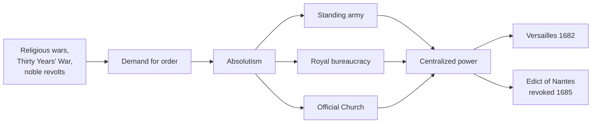
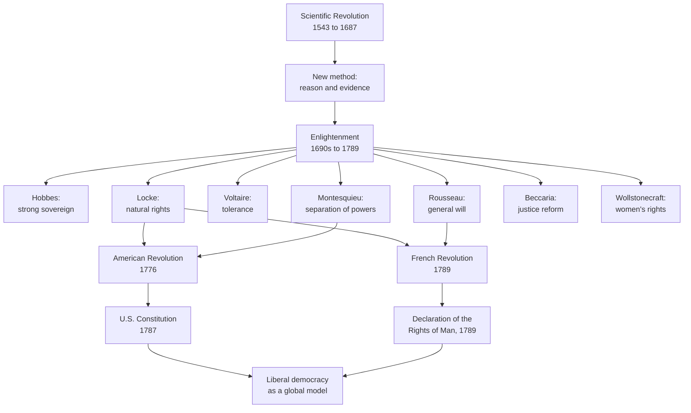
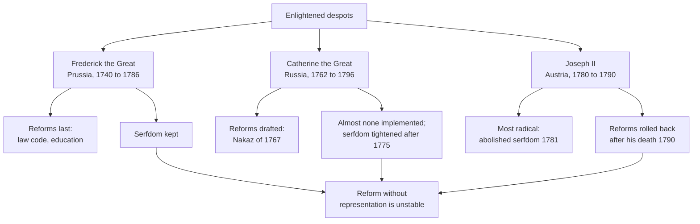
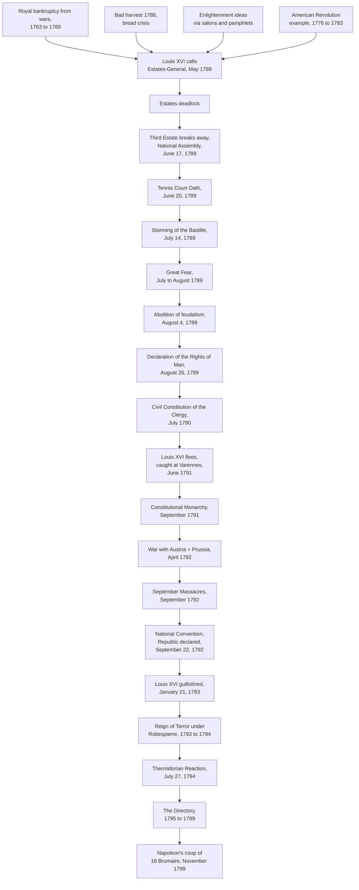
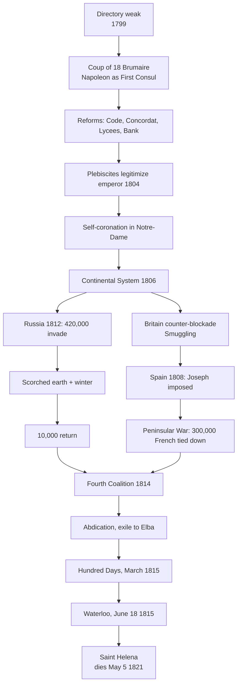
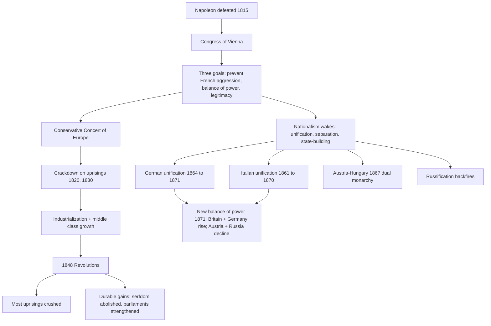
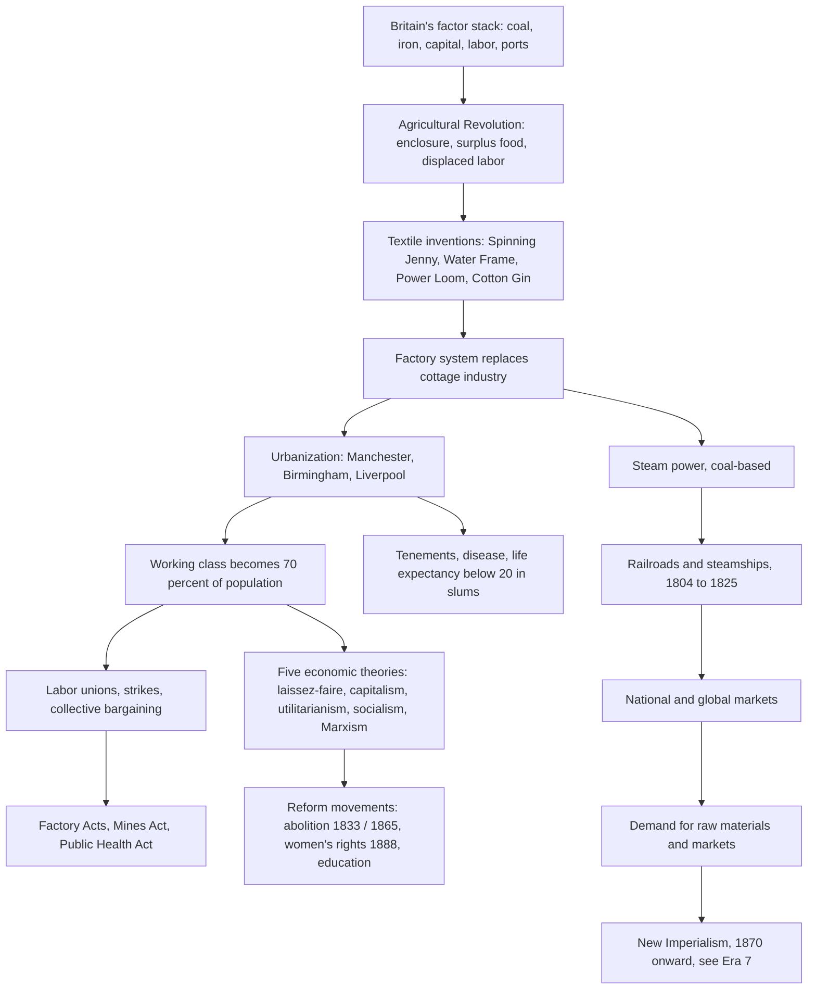
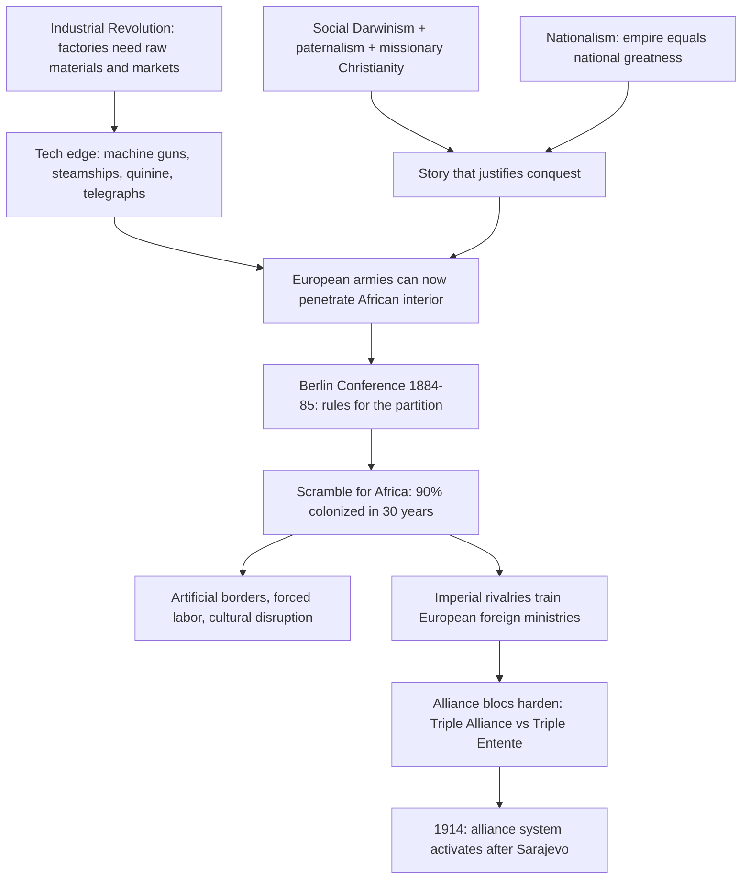
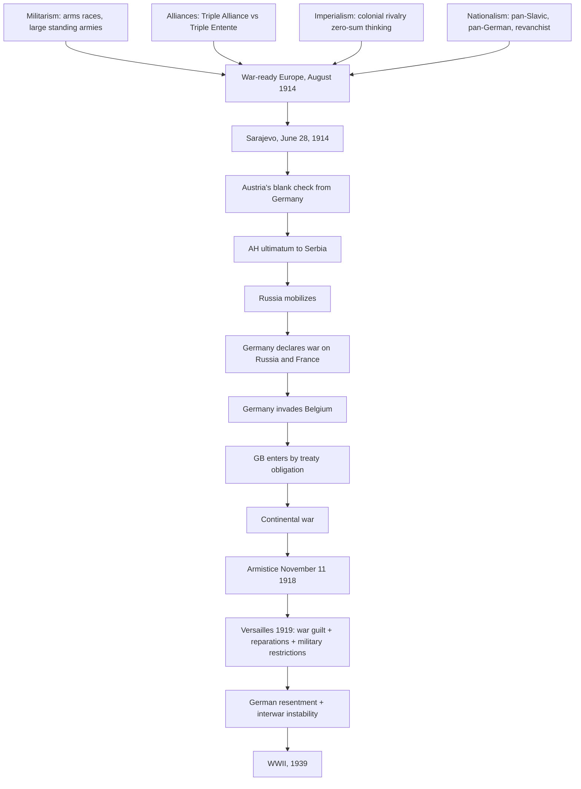
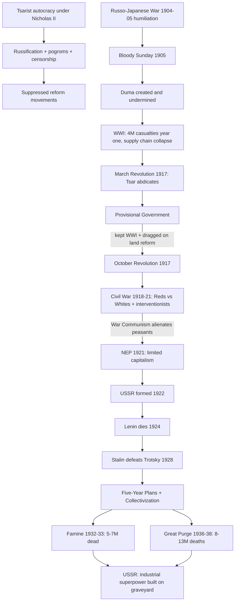

import Callout from '../../components/Callout.astro';
import KeyTerm from '../../components/KeyTerm.astro';
import Collapsible from '../../components/Collapsible.astro';
import Quiz from '../../components/Quiz.astro';
import Flashcards from '../../components/Flashcards.astro';
import TypingQuiz from '../../components/TypingQuiz.astro';
import DragSort from '../../components/DragSort.astro';
import MatchPairs from '../../components/MatchPairs.astro';
import Hotspots from '../../components/Hotspots.astro';
import RoughNotation from '../../components/RoughNotation.astro';
import VantaBackground from '../../components/VantaBackground.astro';
import AuroraBackground from '../../components/AuroraBackground.astro';
import Particles from '../../components/Particles.astro';
import Typewriter from '../../components/Typewriter.astro';
import Zdog from '../../components/Zdog.astro';
import Cesium from '../../components/Cesium.astro';
import Timeline from '../../components/Timeline.astro';
import ChronoTimeline from '../../components/ChronoTimeline.astro';
import VerticalTimeline from '../../components/VerticalTimeline.astro';
import VisTimeline from '../../components/VisTimeline.astro';
import MindMap from '../../components/MindMap.astro';
import Scrollytell from '../../components/Scrollytell.astro';
import TestTimer from '../../components/TestTimer.astro';
import Pomodoro from '../../components/Pomodoro.astro';
import ProgressRing from '../../components/ProgressRing.astro';
import BadFact from '../../components/BadFact.astro';
import TremorCard from '../../components/TremorCard.astro';
import MapView from '../../components/MapView.astro';
import DeckMap from '../../components/DeckMap.astro';
import Lottie from '../../components/Lottie.astro';
import NivoSankey from '../../components/NivoSankey.astro';
import TreeMap from '../../components/TreeMap.astro';
import WordCloud from '../../components/WordCloud.astro';
import RechartsBar from '../../components/RechartsBar.astro';
import DocAnnotate from '../../components/DocAnnotate.astro';
import TextAnnotate from '../../components/TextAnnotate.astro';
import ImageAnnotate from '../../components/ImageAnnotate.astro';
import DeepZoomAnnotated from '../../components/DeepZoomAnnotated.astro';
import DiffView from '../../components/DiffView.astro';
import GuillotineAnimation from '../../components/GuillotineAnimation.astro';
import VersaillesCourtGame from '../../components/VersaillesCourtGame.astro';
import TrenchWarfareSim from '../../components/TrenchWarfareSim.astro';
import FiveYearPlanGame from '../../components/FiveYearPlanGame.astro';
import DDayLandingSim from '../../components/DDayLandingSim.astro';
import JungleSpot from '../../components/JungleSpot.astro';
import MissileCrisisGame from '../../components/MissileCrisisGame.astro';
import HistoryAnimation from '../../components/HistoryAnimation.astro';
import BranchingScenario from '../../components/BranchingScenario.astro';
import Flag from '../../components/Flag.astro';
import DrawnSVG from '../../components/DrawnSVG.astro';
import Panorama360 from '../../components/Panorama360.astro';
import Flipbook from '../../components/Flipbook.astro';
import TroopMovement from '../../components/TroopMovement.astro';
import NetworkGraph from '../../components/NetworkGraph.astro';
import Choropleth from '../../components/Choropleth.astro';
import NivoCalendar from '../../components/NivoCalendar.astro';
import TimeSeries from '../../components/TimeSeries.astro';
import StepThrough from '../../components/StepThrough.astro';
import CompareSlider from '../../components/CompareSlider.astro';
import Sankey from '../../components/Sankey.astro';
import NivoStream from '../../components/NivoStream.astro';
import DichotomousKey from '../../components/DichotomousKey.astro';
import NumberLine from '../../components/NumberLine.astro';
import Statistics from '../../components/Statistics.astro';
import Memorize from '../../components/Memorize.astro';
import Crossword from '../../components/Crossword.astro';
import EChartsGlobe from '../../components/EChartsGlobe.astro';
import G6Graph from '../../components/G6Graph.astro';
import GuideLoader from '../../components/GuideLoader.astro';
import robespierreTree from '../../content/scenarios/robespierre-thermidor';

<GuideLoader />

<AuroraBackground class="-mx-4 sm:-mx-6 -mt-4 sm:-mt-6 px-6 sm:px-10 py-16 sm:py-24 rounded-2xl mb-10">
  

    <Typewriter text="Five centuries. One scroll." className="font-serif text-3xl sm:text-5xl font-bold text-white" />
    

      From Louis XIV's Versailles to the fall of the Soviet Union. A chronological mega-guide built around the cause, effect, and significance framework your final exam wants you to master.
    

  

</AuroraBackground>

{/* ReadingProgress and TableOfContents are auto-rendered by GuideLayout */}

## The whole arc on one globe

A photorealistic 3D globe of every place we will visit. Drag to rotate, scroll to zoom, hold middle-click or right-drag to tilt. Click any red pin to read what happened there. Pins are grouped roughly by era, from Bourbon Versailles through the Soviet collapse.

<Cesium
  height={560}
  target={[48, 15, 9500000]}
  imagery="aerial-with-labels"
  terrain="world"
  markers={[
    { lat: 48.8049, lng: 2.1204, name: "Versailles", note: "Louis XIV moves court here in 1682. Apex of absolutism. Treaty of Versailles signed in the Hall of Mirrors, June 28, 1919." },
    { lat: 51.5074, lng: -0.1278, name: "London", note: "Glorious Revolution 1688. English Bill of Rights 1689. Industrial Revolution origin. Battle of Britain HQ 1940. Postwar Big Three diplomacy." },
    { lat: 48.8566, lng: 2.3522, name: "Paris", note: "Bastille July 14, 1789. Declaration of the Rights of Man. Reign of Terror. Napoleonic capital. Paris Commune 1871. 1944 liberation." },
    { lat: 48.2082, lng: 16.3738, name: "Vienna", note: "Habsburg seat for 600 years. Congress of Vienna 1815. Hitler's hometown bus stop. Anschluss March 1938. 1961 Kennedy-Khrushchev summit." },
    { lat: 52.5200, lng: 13.4050, name: "Berlin", note: "Prussian capital. Kaiserreich proclaimed 1871. Weimar 1919. Hitler's chancellery 1933. Soviet capture May 1945. Wall 1961 to 1989." },
    { lat: 52.5163, lng: 13.3777, name: "Brandenburg Gate", note: "Built 1791. Hitler's torchlit parades. East-West border from 1961. Reagan's 'tear down this wall' 1987. Wall fell November 9, 1989." },
    { lat: 52.4332, lng: 13.1647, name: "Wannsee", note: "January 20, 1942 conference. Senior Nazi officials coordinated the bureaucracy of the Final Solution in 90 minutes." },
    { lat: 49.4521, lng: 11.0767, name: "Nuremberg", note: "Nazi Party rallies 1933 to 1938. 1935 race laws codified here. 1945 to 1946 war crimes tribunals." },
    { lat: 48.1351, lng: 11.5820, name: "Munich", note: "1923 Beer Hall Putsch. 1938 Munich Agreement: appeasement gives Hitler the Sudetenland." },
    { lat: 50.0354, lng: 19.2073, name: "Auschwitz", note: "Largest Nazi extermination complex. About 1.1 million people, mostly Jews, murdered 1942 to 1945." },
    { lat: 52.6296, lng: 22.0497, name: "Treblinka", note: "Pure death camp, Operation Reinhard. About 900,000 Jews murdered August 1942 to October 1943." },
    { lat: 50.4720, lng: 30.4493, name: "Babi Yar", note: "September 29 to 30, 1941. Einsatzgruppen and Wehrmacht shoot 33,771 Jews outside Kyiv in two days." },
    { lat: 55.7558, lng: 37.6173, name: "Moscow", note: "Napoleon's farthest reach September 1812, abandoned and burned. October Revolution 1917 capital from 1918. Stalingrad telegraph headquarters. Cold War counterpole to Washington." },
    { lat: 59.9311, lng: 30.3609, name: "St Petersburg / Petrograd / Leningrad", note: "Peter the Great's window on Europe, founded 1703. February Revolution March 1917. Bolshevik October Revolution. 872-day siege 1941 to 1944." },
    { lat: 56.8389, lng: 60.6057, name: "Yekaterinburg", note: "Tsar Nicholas II, his wife, and five children executed in a basement here, July 17, 1918." },
    { lat: 55.5200, lng: 35.8244, name: "Borodino", note: "September 7, 1812. Bloodiest single day of the Napoleonic Wars. About 70,000 casualties combined. Pyrrhic French victory en route to Moscow." },
    { lat: 48.7080, lng: 44.5133, name: "Stalingrad / Volgograd", note: "August 1942 to February 1943. Soviets encircle and destroy the German Sixth Army. About 2 million casualties combined. The European turning point of WWII." },
    { lat: 51.7194, lng: 36.1879, name: "Kursk", note: "July to August 1943. Largest tank battle in history. Soviet defensive victory permanently ends German offensive capability in the east." },
    { lat: 53.4808, lng: -2.2426, name: "Manchester", note: "Cotton mills, the first industrial city. Peterloo Massacre August 1819. Anti-Corn Law League. Engels writes Conditions of the Working Class here 1844." },
    { lat: 53.4084, lng: -2.9916, name: "Liverpool", note: "Atlantic slave trade hub through 1807. Cotton port for Manchester mills. Sectarian politics, mass emigration to America." },
    { lat: 52.4862, lng: -1.8904, name: "Birmingham", note: "Boulton and Watt steam engines. Lunar Society. Chartism, 1832 Reform agitation." },
    { lat: 50.6803, lng: 4.4127, name: "Waterloo", note: "June 18, 1815. Wellington and Blucher defeat Napoleon. The Hundred Days end; he is exiled to Saint Helena." },
    { lat: 51.3833, lng: 12.4500, name: "Leipzig", note: "October 1813 Battle of the Nations. Coalition of Russia, Austria, Prussia, Sweden crushes Napoleon. Largest battle in Europe before WWI." },
    { lat: 49.1431, lng: 16.7567, name: "Austerlitz / Slavkov u Brna", note: "December 2, 1805. Napoleon's tactical masterpiece against Russia and Austria. Ends the Third Coalition." },
    { lat: 36.1810, lng: -6.0356, name: "Trafalgar", note: "October 21, 1805. Nelson destroys the French and Spanish fleet. British naval supremacy for the next century. Nelson dies in the action." },
    { lat: 43.8563, lng: 18.4131, name: "Sarajevo", note: "June 28, 1914. Gavrilo Princip assassinates Archduke Franz Ferdinand. Triggers the alliance system; WWI begins five weeks later." },
    { lat: 49.1593, lng: 5.3848, name: "Verdun", note: "February to December 1916. German attempt to bleed France white. About 700,000 casualties combined. The shrine of French sacrifice." },
    { lat: 49.9913, lng: 2.7762, name: "Somme", note: "July to November 1916. British offensive: 57,000 casualties on the first day alone. About 1.2 million combined by the end." },
    { lat: 50.8503, lng: 2.8853, name: "Ypres / Ieper", note: "April 22, 1915. First mass chlorine gas attack in history. Three battles 1914, 1915, 1917. Hundreds of thousands dead in the salient." },
    { lat: 48.9606, lng: 2.8783, name: "Marne River", note: "September 5 to 12, 1914. French and British halt the Schlieffen Plan thirty miles from Paris. The 'Miracle of the Marne' guarantees a long war." },
    { lat: 53.5008, lng: 20.1356, name: "Tannenberg", note: "August 26 to 30, 1914. Hindenburg and Ludendorff destroy the Russian Second Army. Cements the Hindenburg myth and his political career." },
    { lat: 40.1958, lng: 26.3548, name: "Gallipoli", note: "April 1915 to January 1916. Allied amphibious landings against the Ottomans fail catastrophically. Forges Mustafa Kemal Ataturk's career." },
    { lat: 41.0082, lng: 28.9784, name: "Constantinople / Istanbul", note: "Ottoman seat through 1922. The 'sick man of Europe' across the long 19th century. Republic of Turkey proclaimed October 29, 1923." },
    { lat: 50.8503, lng: 4.3517, name: "Brussels", note: "Berlin Conference seat 1884 to 1885: European powers partition Africa with no African delegates present. Postwar EU and NATO capital." },
    { lat: 41.9028, lng: 12.4964, name: "Rome", note: "Papal States until 1870. Italian unification capital from 1871. Mussolini's March on Rome October 1922 begins fascist Italy." },
    { lat: 40.4168, lng: -3.7038, name: "Madrid", note: "Spanish Civil War 1936 to 1939: defended by the Republic, falls to Franco March 1939. Forty years of dictatorship begin." },
    { lat: 43.3183, lng: -2.6786, name: "Guernica", note: "April 26, 1937. Luftwaffe Condor Legion destroys the Basque town. First strategic bombing of civilians as deliberate doctrine. Picasso's painting." },
    { lat: 38.7223, lng: -9.1393, name: "Lisbon", note: "Portuguese empire seat. Carnation Revolution April 25, 1974 ends fifty years of Salazar dictatorship without bloodshed." },
    { lat: 52.3676, lng: 4.9041, name: "Amsterdam", note: "Dutch Golden Age capital. First modern stock exchange. Spinoza's tolerance. Frank family's hiding place 1942 to 1944." },
    { lat: 46.2044, lng: 6.1432, name: "Geneva", note: "Calvin's Reformation. Rousseau's birthplace. League of Nations 1920 to 1946. Cold War summit venue 1955 and 1985." },
    { lat: 60.1699, lng: 24.9384, name: "Helsinki", note: "August 1975 Helsinki Accords. Recognized post-WWII borders, committed signatories to human rights. Frame for Eastern dissident movements." },
    { lat: 47.4979, lng: 19.0402, name: "Budapest", note: "October 23 to November 10, 1956. Hungarian Uprising against Soviet domination. Crushed by 200,000 Red Army troops. About 2,500 Hungarians killed." },
    { lat: 50.0755, lng: 14.4378, name: "Prague", note: "Defenestrations 1618. August 1968 Soviet invasion ends the Prague Spring reforms. Velvet Revolution November 1989." },
    { lat: 54.3520, lng: 18.6466, name: "Gdansk", note: "August 1980 Lenin Shipyard strike. Solidarity born under Lech Walesa. First independent trade union in the Soviet bloc." },
    { lat: 51.3890, lng: 30.0992, name: "Chernobyl", note: "April 26, 1986. Reactor 4 explosion. Largest civil nuclear disaster. Glasnost-era reporting exposes Soviet decay." },
    { lat: 49.3700, lng: -0.8700, name: "Normandy", note: "D-Day, June 6, 1944. About 156,000 Allied troops cross the Channel. Operation Overlord opens the Western Front in France." },
    { lat: 51.0344, lng: 2.3768, name: "Dunkirk", note: "May 26 to June 4, 1940. Operation Dynamo evacuates 338,000 Allied troops from the beaches under fire. Britain stays in the war." },
    { lat: 30.8167, lng: 28.9500, name: "El Alamein", note: "October to November 1942. Montgomery defeats Rommel's Afrika Korps. North African turning point; with Stalingrad, the WWII pivot of late 1942." },
    { lat: 30.5852, lng: 32.2654, name: "Suez Canal", note: "Opens 1869, the imperial waterway. 1956 Suez Crisis: Britain and France humiliated; sun visibly sets on European empire." },
    { lat: 30.0444, lng: 31.2357, name: "Cairo", note: "British protectorate 1882 to 1922. Nasser's revolution 1952. Center of postwar Arab nationalism and Non-Aligned Movement." },
    { lat: 36.7538, lng: 3.0588, name: "Algiers", note: "French colonial capital from 1830. Algerian War 1954 to 1962. Battle of Algiers 1956 to 1957. Independence July 5, 1962." },
    { lat: 44.4953, lng: 34.1664, name: "Yalta", note: "February 4 to 11, 1945 conference. Roosevelt, Churchill, Stalin agree the postwar partition of Europe. Origin point of the Cold War order." },
    { lat: 51.5054, lng: 13.5847, name: "Potsdam", note: "July to August 1945 conference. Truman, Attlee, Stalin: Germany's occupation zones, Japan's ultimatum. Truman tells Stalin about the bomb." },
    { lat: 23.1136, lng: -82.3666, name: "Havana", note: "Castro's revolution January 1959. April 1961 Bay of Pigs. October 1962 Cuban Missile Crisis: thirteen days from nuclear war." },
    { lat: 64.1466, lng: -21.9426, name: "Reykjavik", note: "October 11 to 12, 1986. Reagan-Gorbachev summit. Nearly agree to abolish all nuclear weapons; SDI sinks the deal but momentum carries to INF 1987." },
    { lat: 38.8462, lng: -91.9335, name: "Fulton, Missouri", note: "March 5, 1946. Churchill at Westminster College: 'an iron curtain has descended across the Continent.' Names the Cold War divide." },
    { lat: 34.3853, lng: 132.4553, name: "Hiroshima", note: "August 6, 1945. First atomic bomb. About 140,000 dead by year-end. Forces Japanese surrender alongside Soviet entry into the Pacific war." },
    { lat: 32.7503, lng: 129.8779, name: "Nagasaki", note: "August 9, 1945. Second atomic bomb. About 70,000 dead by year-end. Japan announces surrender August 15." }
  ]}
/>

## The twelve eras at a glance

A scrollable Knight Lab timeline with thirty marquee dates, every century from 1500 onward. Use the arrows or the bottom rail to navigate.

<Timeline
  events={[
    { date: "1543", headline: "Copernicus publishes On the Revolutions", text: "Heliocentric theory: the Earth orbits the Sun, not the reverse. Opening shot of the Scientific Revolution." },
    { date: "1648", headline: "Peace of Westphalia", text: "Ends the Thirty Years' War. Establishes nation-state sovereignty as the basis of European order." },
    { date: "1651", headline: "Hobbes publishes Leviathan", text: "Argues that without strong central authority, life is solitary, poor, nasty, brutish, and short. The strongest defense of absolutism." },
    { date: "1682", headline: "Louis XIV moves court to Versailles", text: "Apex of absolutism. The Sun King uses architecture as political control over the French nobility." },
    { date: "1687", headline: "Newton publishes Principia", text: "Lays out laws of motion and universal gravitation. The capstone of the Scientific Revolution." },
    { date: "1688", headline: "Glorious Revolution", text: "William of Orange invades England. James II flees. Parliament invites William and Mary to rule under statutory limits." },
    { date: "1689", headline: "English Bill of Rights", text: "Parliament's consent required for laws, taxes, and a standing army. Foundation of constitutional monarchy." },
    { date: "1748", headline: "Montesquieu publishes The Spirit of the Laws", text: "Argues for separation of powers among legislative, executive, and judicial branches. Hard-coded into the U.S. Constitution forty years later." },
    { date: "1762", headline: "Rousseau publishes The Social Contract", text: "Legitimate government rests on the general will of the people. The intellectual fuel of the French Revolution." },
    { date: "1789-07-14", headline: "Storming of the Bastille", text: "A Paris crowd seizes the royal fortress. Symbolic start of the French Revolution. Now France's national holiday." },
    { date: "1789-08-26", headline: "Declaration of the Rights of Man and Citizen", text: "Men are born free and equal in rights. Sovereignty resides in the nation. The Enlightenment in legal form." },
    { date: "1793-01-21", headline: "Louis XVI executed", text: "Guillotined in the Place de la Revolution. The first king in modern Europe killed by his own people in a public trial." },
    { date: "1799-11-09", headline: "Napoleon's coup of 18 Brumaire", text: "Overthrows the Directory. Becomes First Consul. The Revolution is over; the Empire begins." },
    { date: "1804", headline: "Napoleonic Code published", text: "A unified civil code based on Enlightenment principles. Napoleon's most durable legacy, copied across Europe and Latin America." },
    { date: "1812", headline: "Napoleon invades Russia", text: "Half a million troops cross the Niemen. About 100,000 limp back. Scorched-earth retreat shatters the Grande Armee." },
    { date: "1815-06-18", headline: "Battle of Waterloo", text: "Wellington and Blucher defeat Napoleon. He is exiled to Saint Helena. The Hundred Days end." },
    { date: "1815", headline: "Congress of Vienna", text: "Metternich, Castlereagh, and Talleyrand redraw the map. Balance of power and legitimacy as twin principles." },
    { date: "1848", headline: "Year of Revolutions", text: "Liberal and nationalist uprisings sweep France, the German states, the Habsburg empire, and Italy. Most are crushed within a year." },
    { date: "1859", headline: "Darwin publishes On the Origin of Species", text: "Natural selection. Later misappropriated as Social Darwinism, used to justify imperialism and racism." },
    { date: "1871", headline: "German unification", text: "Bismarck's Prussia, fresh from defeating France, proclaims the German Empire in the Hall of Mirrors at Versailles." },
    { date: "1884", headline: "Berlin Conference opens", text: "European powers partition Africa with no African delegates present. Ignores ethnic boundaries; consequences run for a century." },
    { date: "1914-06-28", headline: "Franz Ferdinand assassinated in Sarajevo", text: "Gavrilo Princip and the Black Hand. The trigger that activates the alliance system." },
    { date: "1914-08-04", headline: "Britain declares war on Germany", text: "Germany violates Belgian neutrality executing the Schlieffen Plan. Britain enters by treaty obligation." },
    { date: "1917-11-07", headline: "Bolshevik October Revolution", text: "Lenin and Trotsky seize power in Petrograd. The first communist state in world history." },
    { date: "1919-06-28", headline: "Treaty of Versailles signed", text: "Germany accepts the war guilt clause, loses territory, pays reparations. Sets up the resentments that will fuel WWII." },
    { date: "1929-10-29", headline: "Wall Street Crash", text: "Black Tuesday. The U.S. stock market collapses. Trade and credit shrivel; Germany's recovery cracks within months." },
    { date: "1933-01-30", headline: "Hitler appointed Chancellor", text: "President Hindenburg names him under emergency conditions. Within months he dismantles the Weimar Republic." },
    { date: "1939-09-01", headline: "Germany invades Poland", text: "WWII begins in Europe. Britain and France declare war two days later." },
    { date: "1942-08", headline: "Battle of Stalingrad begins", text: "Hitler turns south to seize Caucasus oil. Six months of urban combat and a Soviet encirclement that traps the German Sixth Army." },
    { date: "1944-06-06", headline: "D-Day, Normandy landings", text: "Operation Overlord opens the Western Front. About 156,000 Allied troops cross the Channel and establish a beachhead." },
    { date: "1945-05-08", headline: "Victory in Europe Day", text: "Germany surrenders unconditionally. The European war ends three months before the Pacific does." },
    { date: "1945-08", headline: "Atomic bombs on Hiroshima and Nagasaki", text: "August 6 and August 9. Japan surrenders August 15. The nuclear age begins." },
    { date: "1947-03", headline: "Truman Doctrine", text: "Truman pledges aid to free peoples resisting subjugation. The first formal U.S. statement of containment." },
    { date: "1948", headline: "Marshall Plan launched", text: "About 12.5 billion dollars in U.S. aid rebuilds Western Europe. Stalin forbids Eastern Europe to participate." },
    { date: "1949-04-04", headline: "NATO founded", text: "The North Atlantic Treaty creates a mutual defense alliance. Article 5: an attack on one is an attack on all." },
    { date: "1955", headline: "Warsaw Pact formed", text: "The Soviet response to West Germany joining NATO. Eastern bloc military alliance." },
    { date: "1961-08-13", headline: "Berlin Wall erected", text: "East Germany seals off West Berlin overnight. The starkest physical symbol of the Iron Curtain." },
    { date: "1962-10", headline: "Cuban Missile Crisis", text: "Thirteen days. Kennedy and Khrushchev step back from nuclear war. Hotline established afterward." },
    { date: "1985-03", headline: "Gorbachev becomes Soviet leader", text: "Launches glasnost (openness) and perestroika (restructuring). Reforms accidentally accelerate Soviet collapse." },
    { date: "1989-11-09", headline: "Berlin Wall falls", text: "East Germany opens the border. Crowds tear down sections of the wall by hand." },
    { date: "1991-12-26", headline: "Soviet Union dissolved", text: "The USSR is formally dissolved. Fifteen successor states emerge. The Cold War ends without a hot war between superpowers." }
  ]}
/>

## The big picture

A mind map of how each era connects to the next. Drag to pan, scroll to zoom.

<MindMap
  title="The chronological arc, 1500 to 1991"
  markdown={`
# Modern Europe
## Absolutism (1600s)
- Versailles + divine right
- Three pillars: army + bureaucracy + Church
- English limits: Civil War + Glorious Revolution
## Sci Rev + Enlightenment (1543 to 1789)
- New epistemology: nature follows laws
- Hobbes + Locke + Voltaire + Montesquieu + Rousseau
- Salons + the Encyclopedie
- Enlightened despots (Frederick + Catherine)
- Inspires American + French + Latin American revolutions
## French Revolution (1789 to 1799)
- Old Regime + bankruptcy + bread shortages
- Estates-General to National Assembly
- Bastille to Declaration of Rights
- Reign of Terror to Thermidor to Directory
## Napoleon (1799 to 1815)
- Coup of 18 Brumaire + plebiscites
- Napoleonic Code + Continental System
- Russia 1812 to Waterloo 1815
## Vienna + Nationalism (1815 to 1871)
- Metternich + balance of power + legitimacy
- 1848 revolutions
- Italian + German unification
## Industrial Revolution (1750 to 1900)
- Britain first: resources + institutions
- Factory system + urbanization + class structure
- Capitalism + utilitarianism + socialism + communism
## Imperialism (1870 to 1914)
- Berlin Conference partitions Africa
- Sepoy Mutiny to Raj
- Social Darwinism + paternalism
## WWI (1914 to 1918)
- MAIN causes + Sarajevo
- Schlieffen Plan + trenches + total war
- Versailles + war guilt + Fourteen Points
## Russian Revolution (1917 to 1939)
- Tsarist collapse + Provisional Government failure
- Bolshevik October Revolution
- Stalin: Plans + Purges + collectivization
## Interwar (1919 to 1939)
- Weimar instability + hyperinflation
- 1929 Crash + Depression
- Fascism + Nazism + appeasement + Munich
## WWII (1939 to 1945)
- Blitzkrieg + Pact + Poland
- Stalingrad + Midway + D-Day
- Holocaust + atomic bomb
## Cold War (1945 to 1991)
- Containment + Truman Doctrine + Marshall Plan
- NATO + Warsaw Pact
- Berlin Blockade + Cuba + Vietnam + Wall
- Detente + Gorbachev + 1989 + 1991
`}
/>

## The power shift

A Sankey of how authority flowed across the five centuries: from dynasty to constitutional and revolutionary order, from there to the great ideologies, and finally to the two superpowers that replaced Europe at the center of the world.

<NivoSankey
  data={{
    nodes: [
      { id: "Dynasties (1500s to 1700s)" },
      { id: "Enlightenment ideas" },
      { id: "Constitutional monarchy" },
      { id: "Revolutionary republic" },
      { id: "Nationalism" },
      { id: "Industrial economy" },
      { id: "Liberalism" },
      { id: "Socialism / Communism" },
      { id: "Fascism / Nazism" },
      { id: "United States" },
      { id: "Soviet Union" }
    ],
    links: [
      { source: "Dynasties (1500s to 1700s)", target: "Enlightenment ideas", value: 60 },
      { source: "Dynasties (1500s to 1700s)", target: "Constitutional monarchy", value: 30 },
      { source: "Enlightenment ideas", target: "Constitutional monarchy", value: 25 },
      { source: "Enlightenment ideas", target: "Revolutionary republic", value: 35 },
      { source: "Enlightenment ideas", target: "Liberalism", value: 20 },
      { source: "Constitutional monarchy", target: "Liberalism", value: 30 },
      { source: "Revolutionary republic", target: "Nationalism", value: 30 },
      { source: "Revolutionary republic", target: "Liberalism", value: 15 },
      { source: "Nationalism", target: "Industrial economy", value: 20 },
      { source: "Nationalism", target: "Fascism / Nazism", value: 25 },
      { source: "Industrial economy", target: "Liberalism", value: 25 },
      { source: "Industrial economy", target: "Socialism / Communism", value: 30 },
      { source: "Liberalism", target: "United States", value: 50 },
      { source: "Socialism / Communism", target: "Soviet Union", value: 50 },
      { source: "Fascism / Nazism", target: "United States", value: 15 },
      { source: "Fascism / Nazism", target: "Soviet Union", value: 15 }
    ]
  }}
/>

## Learning objectives

By the end of this guide you should be able to:

- Apply the cause, effect, and significance framework to any era from 1500 to 1991.
- Trace the chronological arc of modern Europe from absolutism through the Soviet collapse.
- Explain how the Scientific Revolution and Enlightenment set up the political revolutions that followed.
- Identify the cause-effect chains for every major war and revolution from the French Revolution through the Cold War.
- Distinguish the four pre-WWI MAIN causes and apply them to specific events.
- Compare totalitarian regimes (Stalin, Hitler, Mussolini) on at least three axes.
- Analyze how the same set of ideas (nationalism, industry, ideology) produced both progress and catastrophe.
- Evaluate why the Treaty of Versailles contributed to future instability.
- Define and give examples of containment, brinkmanship, and detente.
- Explain how the Cold War ended without a hot war between the superpowers.
- Memorize 100+ key terms and 30 marquee dates with confidence.
- Sit a 50-minute mock final and answer like a top-quartile student.

## TL;DR

Twelve era summaries, one paragraph each. The thread that connects them is **ideas in action**. Enlightenment ideas killed absolutism. Industrial ideas killed feudalism. Nationalist ideas killed multi-ethnic empires. Marxist ideas killed the Tsar. Fascist ideas almost killed Western liberalism. Soviet ideas reshaped half the world and then imploded under their own contradictions.

**Era 1: Absolutism (1600s).** European monarchs centralized power on a scale never before seen. France's Louis XIV built Versailles as a stage on which the entire French nobility performed for him, defended his rule by divine right, and ran the state through a royal bureaucracy backed by a standing army and the Catholic Church. The cause was the chaos of religious wars, plague, and noble rebellion. The effect was a model of government, the absolutist state, that other European rulers copied. The significance: absolutism is the launchpad. Every later European political fight is partly about which institution gets to claim the legitimacy that Louis XIV claimed for himself.

**Era 2: Scientific Revolution and Enlightenment (1543 to 1789).** Copernicus, Galileo, and Newton replaced earth-centered astronomy and Aristotelian physics with experimental, math-driven science. The next century, philosophers asked: if reason works for stars, will it work for politics? Locke argued for natural rights, Voltaire for tolerance, Montesquieu for separation of powers, Rousseau for the social contract. Their ideas spread through salons and the Encyclopedie. The effect was an intellectual revolution that delegitimized divine-right monarchy. Enlightened despots like Frederick the Great tried to absorb the new thinking without giving up power; the contradiction could not last.

**Era 3: French Revolution (1789 to 1799).** Bankruptcy from wars, harvest failures, and Enlightenment ideas converged. Louis XVI called the Estates-General; the Third Estate broke away to form the National Assembly, swore the Tennis Court Oath, and on July 14 stormed the Bastille. The Declaration of the Rights of Man and Citizen put the Enlightenment into legal form. By 1793 the Revolution had radicalized into the Reign of Terror under Robespierre and the Committee of Public Safety; about 17,000 people were executed by guillotine. The Terror ate its own in the Thermidorian Reaction; the corrupt Directory followed. Significance: the Old Regime ended in months and could never come back.

**Era 4: Napoleon (1799 to 1815).** Napoleon overthrew the Directory in the coup of 18 Brumaire, used plebiscites to legitimize himself, and crowned himself Emperor in 1804. His most durable legacy is the Napoleonic Code, a unified civil code based on Enlightenment principles. He extended French power across Europe through the Continental System, family marriages onto foreign thrones, and battlefield victories. The 1812 invasion of Russia destroyed the Grande Armee through Russian scorched-earth tactics and winter. Defeat at Waterloo in 1815 ended the Hundred Days. Significance: Napoleon spread revolutionary ideas across Europe even as he betrayed the Revolution at home.

**Era 5: Vienna and Nationalism (1815 to 1871).** The Congress of Vienna under Metternich tried to restore the pre-Napoleonic order through legitimacy and balance of power. It worked for a generation, then cracked. The 1848 revolutions brought liberal and nationalist uprisings across France, the German states, the Habsburg empire, and Italy; most were crushed within a year. Italian unification under Cavour and Garibaldi was complete by 1870. German unification under Bismarck was proclaimed in 1871 in the Hall of Mirrors at Versailles after the Franco-Prussian War. Significance: nationalism became the master ideology of the next century, fueling unification, separation, and eventually world war.

**Era 6: Industrial Revolution (1750 to 1900).** Britain went first because it had coal, iron, capital, navigable rivers, and political stability. The Agricultural Revolution freed labor for the new factories. Steam power, railroads, and the factory system reorganized production. Cities exploded in size; tenements and disease followed. A new middle class displaced the old aristocracy at the top of the wealth ladder. Adam Smith defended laissez-faire capitalism; Bentham proposed utilitarianism; Owen and others proposed socialism; Marx pushed past them to communism. Workers organized into unions and struck for shorter hours and wages. Significance: industrialization gave Europe the technological superiority that made New Imperialism possible.

**Era 7: Imperialism (1870 to 1914).** Industrial Europe needed raw materials and markets, prestige and strategic position. The Berlin Conference of 1884 to 1885 partitioned Africa among European powers with no African representation present, ignoring ethnic boundaries. Forms of control included colony, protectorate, sphere of influence, and economic imperialism. Cultural justifications included Social Darwinism and the so-called White Man's Burden. India became the jewel in the crown after the Sepoy Mutiny shifted control from the East India Company to direct Crown rule under the Raj. Significance: imperial rivalries fed the alliance system that made WWI a continental rather than local war.

**Era 8: WWI (1914 to 1918).** The MAIN causes (militarism, alliances, imperialism, nationalism) loaded the gun; the assassination of Franz Ferdinand in Sarajevo on June 28, 1914 pulled the trigger. Germany's Schlieffen Plan to knock out France quickly failed; the Western Front bogged down into trench warfare and total war. The U.S. entered in 1917 after the Zimmerman Note and unrestricted submarine warfare. The Treaty of Versailles in 1919 imposed the war guilt clause, territorial losses, and reparations on Germany. Wilson's Fourteen Points, including the League of Nations, were largely sidelined and the U.S. Senate rejected the treaty. Significance: Versailles was so punitive it set up WWII within twenty years.

**Era 9: Russian Revolution (1917 to 1939).** WWI broke the tsarist system. The February Revolution of 1917 forced Nicholas II to abdicate; the Provisional Government failed because it kept fighting the war and dragged its feet on land reform. In October the Bolsheviks under Lenin and Trotsky seized power. After winning the Civil War, Lenin's New Economic Policy partially restored markets. Stalin succeeded him, launching Five-Year Plans for forced industrialization, collectivization that produced famines (about 5 to 7 million dead in Ukraine alone), and the Great Purge that killed or imprisoned millions through cult-of-personality terror. Significance: the first totalitarian state, and the model the Cold War West would oppose for forty years.

**Era 10: Interwar (1919 to 1939).** Weimar Germany inherited Versailles, hyperinflation, and a constitutional design (Article 48) that let presidents rule by decree. The Dawes Plan and a brief recovery cracked when the 1929 Wall Street Crash collapsed credit. The Depression discredited democratic governments. Hitler exploited the crisis: the Beer Hall Putsch failed in 1923, but Mein Kampf laid out his program of Lebensraum and racial nationalism, and in January 1933 he was appointed Chancellor. Britain and France's appeasement at Munich in 1938 gave Hitler the Sudetenland in exchange for a promise that lasted six months. Significance: democratic weakness plus economic catastrophe plus appeasement is a recipe for a second world war.

**Era 11: WWII (1939 to 1945).** Hitler's Nazi-Soviet Pact in August 1939 cleared his path to Poland. Blitzkrieg overran Poland, Denmark, Norway, the Low Countries, and France within ten months. Operation Barbarossa in June 1941 turned east; Stalingrad in 1942 to 1943 was the European turning point. The Pacific war began at Pearl Harbor; Midway in June 1942 was its turning point. D-Day on June 6, 1944 opened the Western Front. The Holocaust murdered about 6 million Jews under the Final Solution. Atomic bombs on Hiroshima and Nagasaki ended the Pacific war in August 1945. Significance: about 70 to 85 million dead; Europe broken; the U.S. and USSR rise as the new superpowers.

**Era 12: Cold War (1945 to 1991).** Yalta in February 1945 papered over Soviet intentions in Eastern Europe. The Truman Doctrine and Marshall Plan operationalized containment. The Berlin Blockade of 1948 to 1949 was countered by the Berlin Airlift; NATO formed in 1949, the Warsaw Pact in 1955. Proxy wars ran in Korea, Vietnam, and Afghanistan. The Cuban Missile Crisis of October 1962 pushed both superpowers to the nuclear brink and produced the hotline and detente. The Berlin Wall went up in 1961 and fell in 1989 as Gorbachev's glasnost and perestroika cascaded. The Soviet Union dissolved on December 26, 1991. Significance: a forty-six-year nuclear standoff ended without a hot war between the superpowers.

## Glossary

The 50 highest-leverage terms across all twelve eras. Each is the canonical short definition; era prose has fuller in-context use.

- <KeyTerm term="Absolute monarch">A ruler with unlimited power. Three pillars of an absolute state: standing army, royal bureaucracy, official Church. Example: Louis XIV.</KeyTerm>
- <KeyTerm term="Divine right">Monarchs derive authority directly from God; rebellion is heresy as well as treason.</KeyTerm>
- <KeyTerm term="Constitutional monarchy">Monarchy limited by a constitution and an elected legislature. Founded in England by the Bill of Rights of 1689.</KeyTerm>
- <KeyTerm term="Mercantilism">National wealth measured in bullion. Maximize exports, minimize imports, acquire colonies. The economic engine of absolutism.</KeyTerm>
- <KeyTerm term="Habeas Corpus">Legal right requiring the state to bring an arrested person before a court and justify the detention. Codified 1679.</KeyTerm>
- <KeyTerm term="Glorious Revolution">November 1688. William of Orange replaces James II almost without bloodshed; Parliament becomes supreme.</KeyTerm>
- <KeyTerm term="Bill of Rights 1689">English statute barring the monarch from suspending laws, raising taxes, or maintaining a standing army without Parliament's consent.</KeyTerm>
- <KeyTerm term="Petition of Right">1628. Banned taxation without parliamentary consent, arbitrary imprisonment, quartering of soldiers, peacetime martial law.</KeyTerm>
- <KeyTerm term="Heliocentric Theory">The Copernican model placing the Sun at the center of the solar system. Published 1543. Confirmed by Galileo's telescope.</KeyTerm>
- <KeyTerm term="Scientific method">Observe, hypothesize, experiment, revise. Codified by Bacon (induction) and Descartes (deduction).</KeyTerm>
- <KeyTerm term="Natural rights">Rights people are born with that no government can take away. Locke: life, liberty, property.</KeyTerm>
- <KeyTerm term="Social contract">An agreement by which people give up some freedoms to government in exchange for protection. Hobbes used it to defend absolutism, Locke to limit it, Rousseau to ground it in the general will.</KeyTerm>
- <KeyTerm term="Philosophe">A French Enlightenment public intellectual: Voltaire, Diderot, Montesquieu, Rousseau.</KeyTerm>
- <KeyTerm term="Enlightened despot">An 18th-century monarch (Frederick the Great, Catherine the Great, Joseph II) who adopted some Enlightenment reforms while keeping absolute power.</KeyTerm>
- <KeyTerm term="Separation of powers">Splitting government into legislative, executive, and judicial branches. Argued by Montesquieu in The Spirit of the Laws (1748).</KeyTerm>
- <KeyTerm term="Old Regime">The pre-1789 order in France: divine-right monarchy plus three estates plus feudal privileges.</KeyTerm>
- <KeyTerm term="Estates-General">Medieval French assembly of the three estates. Called by Louis XVI in May 1789 for the first time in 175 years.</KeyTerm>
- <KeyTerm term="Tennis Court Oath">June 20, 1789. The Third Estate, locked out of their hall, swore not to disband until France had a constitution.</KeyTerm>
- <KeyTerm term="Bastille">Royal fortress stormed July 14, 1789, by a Paris crowd looking for gunpowder. Symbolic end of the Old Regime.</KeyTerm>
- <KeyTerm term="Declaration of the Rights of Man">August 26, 1789. Men born free and equal; sovereignty resides in the nation; law is the expression of the general will.</KeyTerm>
- <KeyTerm term="Sans-Culottes">Working-class radical Parisians. Pressured the Convention from the streets and powered the Reign of Terror.</KeyTerm>
- <KeyTerm term="Jacobins">Radical revolutionary faction led by Robespierre. Drove the Reign of Terror.</KeyTerm>
- <KeyTerm term="Reign of Terror">June 1793 to July 1794. About 17,000 official executions; 85% peasants and middle class.</KeyTerm>
- <KeyTerm term="Thermidorian Reaction">July 27, 1794. Convention turns on Robespierre; he is guillotined the next day.</KeyTerm>
- <KeyTerm term="Napoleonic Code">1804 unified French civil code: equality before the law, secular government, protection of private property. Napoleon's most durable legacy.</KeyTerm>
- <KeyTerm term="Continental System">Napoleon's economic blockade against Britain, 1806 to 1814. Failed.</KeyTerm>
- <KeyTerm term="Scorched-earth">Destroying everything useful to the enemy as one retreats. Used by Russia in 1812 to wreck Napoleon's army.</KeyTerm>
- <KeyTerm term="Congress of Vienna">1814 to 1815. Metternich, Castlereagh, Talleyrand, Tsar Alexander I redrew Europe after Napoleon. Goals: balance of power, legitimacy, containment of France.</KeyTerm>
- <KeyTerm term="Balance of power">Doctrine that no single state should dominate the continent.</KeyTerm>
- <KeyTerm term="Concert of Europe">Informal post-1815 system of consultation among the great powers. Cracked in 1848; broken by the Crimean War.</KeyTerm>
- <KeyTerm term="Nation-state">A sovereign state whose population shares a common language, culture, and historical identity.</KeyTerm>
- <KeyTerm term="Factors of production">Land, labor, capital. Britain led the Industrial Revolution because it had abundant coal/iron, freed labor, and accumulated trade capital.</KeyTerm>
- <KeyTerm term="Urbanization">Migration from rural areas to cities. Britain became majority-urban around 1851.</KeyTerm>
- <KeyTerm term="Capitalism">Private ownership of production, market exchange, profit-driven investment. Defended by Adam Smith in Wealth of Nations (1776).</KeyTerm>
- <KeyTerm term="Laissez-faire">Doctrine that government should not interfere in the economy.</KeyTerm>
- <KeyTerm term="Communism">Marx and Engels's Communist Manifesto (1848): workers' revolution to abolish private property and class society.</KeyTerm>
- <KeyTerm term="Imperialism">Extending a country's authority over foreign territory by conquest, settlement, or domination.</KeyTerm>
- <KeyTerm term="Berlin Conference">November 1884 to February 1885. European powers, hosted by Bismarck, set rules for African partition. No African delegates.</KeyTerm>
- <KeyTerm term="Triple Alliance">Pre-WWI alliance of Germany, Austria-Hungary, Italy (1882). Italy switched sides 1915.</KeyTerm>
- <KeyTerm term="Triple Entente">Pre-WWI alliance of France, Russia, Britain (1894 to 1907).</KeyTerm>
- <KeyTerm term="Schlieffen Plan">German plan to defeat France in six weeks via Belgium before Russia could mobilize. Stopped at the Marne.</KeyTerm>
- <KeyTerm term="Trench warfare">Static, attrition fighting on the Western Front 1914 to 1918.</KeyTerm>
- <KeyTerm term="Article 231">War guilt clause of the Treaty of Versailles forcing Germany to accept sole WWI responsibility.</KeyTerm>
- <KeyTerm term="Bolsheviks">Lenin's radical Marxist faction. Seized power in October 1917. Renamed the Communist Party in 1918.</KeyTerm>
- <KeyTerm term="NEP">New Economic Policy, 1921 to 1928. Lenin's partial restoration of small-scale capitalism. Reversed by Stalin in 1928.</KeyTerm>
- <KeyTerm term="Five-Year Plans">Stalin's centralized economic blueprints from 1928, forcing rapid industrialization.</KeyTerm>
- <KeyTerm term="Great Purge">1936 to 1938. Stalin's mass arrests, show trials, executions. About 750,000 executed; millions sent to the Gulag.</KeyTerm>
- <KeyTerm term="Weimar Republic">German government from 1919 to 1933. Crippled by Versailles, hyperinflation, Article 48.</KeyTerm>
- <KeyTerm term="Munich Agreement">September 1938. Britain and France let Hitler annex the Sudetenland. Six months later he took the rest of Czechoslovakia.</KeyTerm>
- <KeyTerm term="Appeasement">Granting concessions to an aggressive power to avoid war. Failed because Hitler interpreted it as weakness.</KeyTerm>
- <KeyTerm term="Blitzkrieg">German lightning war. Fast armored thrusts, close air support, motorized infantry.</KeyTerm>
- <KeyTerm term="D-Day">June 6, 1944. About 156,000 Allied troops landed on five Normandy beaches. Opened the Western Front.</KeyTerm>
- <KeyTerm term="Holocaust">Systematic Nazi murder of about 6 million Jews and millions of others.</KeyTerm>
- <KeyTerm term="Containment">U.S. doctrine of preventing Soviet expansion through pressure short of direct war. Articulated by Kennan, 1946 to 1947.</KeyTerm>
- <KeyTerm term="Marshall Plan">1948 to 1952. About 12.5 billion dollars in U.S. aid to rebuild Western Europe.</KeyTerm>
- <KeyTerm term="NATO">Mutual defense alliance, founded April 4, 1949.</KeyTerm>
- <KeyTerm term="Warsaw Pact">Soviet response to West Germany joining NATO, May 1955.</KeyTerm>
- <KeyTerm term="Cuban Missile Crisis">October 1962. Closest the Cold War came to nuclear war. Resolved via secret negotiation.</KeyTerm>
- <KeyTerm term="Glasnost">Russian for openness. Gorbachev's mid-1980s policy of permitting public criticism.</KeyTerm>
- <KeyTerm term="Perestroika">Russian for restructuring. Gorbachev's mid-1980s economic reforms.</KeyTerm>

{/* === ERA 1: ABSOLUTISM === */}

## 1. Absolutism (1600s)

> "L'Etat, c'est moi." Era 1 of 12. Absolutism, 1600s. Versailles, divine right, and the king who became the state.

<Callout type="tip" title="Hold court before you read">
  Six historical decisions stand between you and your death in 1715. Try to keep all four pillars of your reign above zero. The choices Louis XIV actually made are marked after you commit. Then read the era to see why each one mattered.
</Callout>

<VersaillesCourtGame />

On a September morning in 1715, **Louis XIV** closes his eyes for the last time. He has reigned 72 years. Most of his subjects, peasant or duke, have known no other king. A page hurries down the gilded corridor of Versailles to ring the silver bell that announces a death in the royal family. The mirrors of the Hall of Mirrors throw the candlelight back across the marble. A century earlier, no European monarch had ruled this much, on this scale, with this kind of theatre. By his death, every other king in Europe is either copying him or fighting against the model he built.

<Callout type="insight" title="Why this matters">
  Absolutism is the launchpad. Every later European political fight, the Enlightenment, the French Revolution, even the Russian Revolution, is partly an argument with the model Louis XIV perfected: that one person, by divine right, can claim to be the state.
</Callout>

### Timeline

<VerticalTimeline items={[
  { date: '1610', title: 'Louis XIII takes the throne', body: 'Cardinal Richelieu becomes chief minister, begins centralizing royal power, weakens the high nobility.', icon: 'L' },
  { date: '1628', title: 'Petition of Right', body: 'English Parliament forces Charles I to accept four limits: no taxation without consent, no arbitrary imprisonment, no quartering of soldiers, no peacetime martial law.', icon: 'P' },
  { date: '1642', title: 'English Civil War begins', body: 'War between Charles I (Royalists) and Parliament (Puritans). Seven years of fighting.', icon: 'X' },
  { date: '1643', title: 'Louis XIV becomes king at age four', body: 'Cardinal Mazarin governs in his name. The Fronde, a series of noble revolts, will scar the boy king.', icon: 'L' },
  { date: '1649', title: 'Charles I executed', body: 'For the first time in modern Europe, a reigning monarch is publicly tried and beheaded by his own subjects.', icon: '+' },
  { date: '1651', title: 'Hobbes publishes Leviathan', body: 'Argues that without a strong central authority, life is "solitary, poor, nasty, brutish, and short." The strongest defense of absolutism.', icon: 'H' },
  { date: '1660', title: 'Restoration of Charles II', body: 'Parliament invites Charles II back from exile after Cromwell. The monarchy returns, but on Parliament\'s terms.', icon: 'C' },
  { date: '1661', title: 'Louis XIV takes personal control of France', body: 'At age 22, on the death of Mazarin, he refuses to appoint another chief minister. "L\'Etat, c\'est moi."', icon: 'L' },
  { date: '1679', title: 'Habeas Corpus Act', body: 'Charles II forced to sign a law requiring the state to bring a prisoner before a court and justify the detention. Bars indefinite jailing without charge.', icon: 'H' },
  { date: '1682', title: 'Louis XIV moves the court to Versailles', body: 'The palace becomes a stage on which the entire French nobility performs for the king. Apex of absolutism.', icon: 'V' },
  { date: '1685', title: 'Edict of Nantes revoked', body: 'Louis XIV ends religious tolerance for French Protestants (Huguenots). Around 200,000 flee to England, the Netherlands, Prussia.', icon: '!' },
  { date: '1688', title: 'Glorious Revolution', body: 'William of Orange invades England. James II flees. Parliament invites William and Mary to rule under statutory limits. Almost no bloodshed.', icon: 'W' },
  { date: '1689', title: 'English Bill of Rights', body: 'Statute makes it illegal for the monarch to suspend laws, raise taxes, or maintain a standing army without Parliament\'s consent. Foundation of constitutional monarchy.', icon: 'B' },
  { date: '1715', title: 'Louis XIV dies after 72 years on the throne', body: 'Leaves France glittering in culture but bankrupt in money. The seeds of 1789 are already in the soil.', icon: 'L' }
]} />

### Cause

By the early 1600s, the chaos of the Wars of Religion, the Thirty Years' War, the plague, and recurring noble revolts had convinced many Europeans that anything was preferable to anarchy. Power needed a center. <KeyTerm term="Absolute monarch">A ruler with unlimited power who controls all aspects of society. The three pillars of an absolute state are a standing army, a royal bureaucracy, and the official Church.</KeyTerm> emerged as that solution. The argument was simple, even brutal: religious and civil war are the alternative.

The intellectual scaffolding came from <KeyTerm term="Divine right">The claim that monarchs derive their authority directly from God and answer to no earthly power. Used to justify absolute rule and to make rebellion a sin as well as a crime.</KeyTerm>. If the king ruled by God's choice, then disobedience was not just treason, it was heresy. **Bishop Bossuet**, Louis XIV's tutor, hammered this argument into the boy king from age twelve onward. **Thomas Hobbes** in 1651 made the secular case in *Leviathan*: people are selfish and frightened, so they sign a <KeyTerm term="Social contract">The agreement, real or implied, by which people give up some freedoms to government in exchange for protection of others. Hobbes used it to defend absolutism, Locke to limit it.</KeyTerm> handing all power to a sovereign who can keep order. Hobbes was an English exile in Paris when he wrote it, and his royalist patrons read it eagerly.

The economy followed the politics. <KeyTerm term="Mercantilism">The economic theory that a nation's wealth is measured in bullion and that government should maximize exports, minimize imports, and acquire colonies for raw materials and captive markets. The economic engine of absolutism.</KeyTerm> made the king the central planner of the national economy. Louis XIV's finance minister **Jean-Baptiste Colbert** built tariff walls, founded royal manufactures (Gobelins tapestries, Saint-Gobain mirrors), and acquired colonies in the Caribbean and North America to feed the state with hard currency.

```mermaid
flowchart LR
  A[Religious wars,<br/>Thirty Years' War,<br/>noble revolts] --> B[Demand for order]
  B --> C[Absolutism]
  C --> D[Standing army]
  C --> E[Royal bureaucracy]
  C --> F[Official Church]
  D --> G[Centralized power]
  E --> G
  F --> G
  G --> H[Versailles 1682]
  G --> I[Edict of Nantes<br/>revoked 1685]
```

The three pillars of the absolutist state were not abstract. They were buildings, payroll lists, and printed liturgies. The standing army of about 400,000 men by 1700 was the largest on the continent. The bureaucracy of <RoughNotation type="underline" color="#b91c1c">intendants</RoughNotation>, royal officers sent into the provinces to collect taxes and report back, broke the old feudal grip of regional nobles. The Church, after the revocation of the Edict of Nantes in 1685, was uniformly Catholic and uniformly state-sponsored, with bishops appointed by the king.

Louis XIV understood that the way to neutralize the high nobility was not to fight them in the field, but to invite them to dinner. Every dinner. Forever. In 1682 he moved the court to **Versailles**, twelve miles outside Paris, and required the great families of France to spend most of the year in attendance. Power flowed only through closeness to the king's body. The man who held his shirt in the morning was more powerful than a regional governor. Meanwhile the king's intendants ran the provinces.

### Effect

The model spread. **Frederick William** of Brandenburg-Prussia (the Great Elector) and his grandson **Frederick William I** built a Prussian standing army that punched above the kingdom's weight. **Peter the Great** of Russia (1682 to 1725) modernized his army on Western lines, founded St Petersburg as a "window on Europe," and forced his nobles to shave their beards. **Maria Theresa** and her son **Joseph II** ran a centralized bureaucracy in Habsburg Austria. The Spanish Bourbons, the Italian Bourbons, and even smaller German princes all imitated some version of Louis XIV's court rituals, his royal academies, and his economic mercantilism.

Inside France itself, the costs caught up. Louis XIV fought four major wars (the War of Devolution, the Dutch War, the Nine Years' War, the War of Spanish Succession) and pushed France into a debt spiral that his great-grandson Louis XVI would still be paying off in 1789. The revocation of the Edict of Nantes in 1685 drove out perhaps 200,000 skilled Huguenots, a brain drain France could not afford. Famines in 1693 to 1694 and 1709 killed an estimated 1.3 million people. The cultural brilliance was real (the playwrights Moliere and Racine, the architecture of Mansart, the music of Lully) but it sat on top of a tax base that was bleeding out.

<DeepZoomAnnotated
  title="Hyacinthe Rigaud's 1701 portrait of Louis XIV"
  src="https://upload.wikimedia.org/wikipedia/commons/5/5f/Louis_XIV_of_France.jpg"
  height={520}
  markers={[
    { x: 0.5, y: 0.13, label: 'The wig', description: 'About four feet tall when worn. Conceals the king\'s real, balding head. Royal authority is performance.' },
    { x: 0.36, y: 0.66, label: 'The ermine cloak', description: 'Coronation regalia. Embroidered with gold fleur-de-lys. The pattern signals divine right and Bourbon dynasty.' },
    { x: 0.5, y: 0.85, label: 'The pose', description: 'Hand on hip, leg out. Borrowed from Roman emperor portraits. Louis XIV was 63 here, but the legs are a dancer\'s.' },
    { x: 0.78, y: 0.42, label: 'The sword', description: 'Joyeuse, the legendary coronation sword of the kings of France, said to have belonged to Charlemagne.' },
    { x: 0.21, y: 0.40, label: 'The crown on a cushion', description: 'Symbolic only. Louis XIV crowned himself, like later Napoleon, refusing to acknowledge Church authority over his rule.' }
  ]}
/>

The king's own palace became the most powerful instrument of his rule. The 73-meter Hall of Mirrors, completed in 1684, was the meeting room where ambassadors waited for an audience. The 357 mirrors faced gardens designed by Andre Le Notre, where every fountain and hedge was sized to make the king look central. To stand inside the Hall was to be inside an argument about who Europe answered to.

But the model was not universal. England, after a century of fighting, took the opposite path. The English Civil War of 1642 to 1649 was the first big crack in the European absolutist consensus. **Charles I** had tried to rule like a French king. He raised taxes without Parliament's consent, quartered soldiers in private homes, and ignored the **Petition of Right** that Parliament had forced him to sign in 1628. The Petition listed four limits: no imprisonment without a valid reason, no taxes without Parliament's approval, no forcing people to house soldiers, and no martial law in peacetime. Charles signed it for the cash and ignored it the moment he had the money. By 1641 Parliament had passed laws stripping his prerogatives, and Charles tried to arrest five leading members on the floor of the Commons. War broke out within months.

The fighting lasted seven years. The Puritan side, led by **Oliver Cromwell**, won. In 1649 Charles I was tried for treason and beheaded outside the Banqueting House in Whitehall. Never before had a reigning monarch faced a public execution, by his own subjects, in a public trial, in a courtroom. Cromwell ruled as a military dictator (Lord Protector) until his death in 1658, then his son Richard tried and failed to hold the title. In 1659 Parliament dissolved the Commonwealth and invited **Charles II**, son of the executed king, to take the throne in what became known as the Restoration. He arrived in 1660.

Charles II had spent his exile watching Louis XIV's France from a distance. He kept up the rituals of monarchy, but Parliament had learned. In 1679 Parliament forced him to sign the **Habeas Corpus Act**, which required the state to bring an arrested person before a court and justify the detention. The phrase **<KeyTerm term="Habeas Corpus">A legal right requiring the state to bring an arrested person before a court and justify the detention. Codified in England in 1679. Bars indefinite detention without charge.</KeyTerm>** is medieval Latin: "you should have the body." It is the single most important piece of due-process law in the English-speaking world.

When Charles II died in 1685 without a legitimate heir, the throne passed to his Catholic brother **James II**. James packed the army with Catholic officers, suspended laws against Catholics, and began openly favoring Catholic appointees. By 1688 a group of Protestant noblemen had had enough. They invited **William of Orange**, a Dutch prince married to James II's Protestant daughter Mary, to take the throne. William landed in southern England with an army in November 1688. James II's own army melted away. The king fled to France. The whole transition took six weeks and almost no blood, which is why English historians named it the <KeyTerm term="Glorious Revolution">November 1688: William of Orange invades England, James II flees, Parliament invites William and his wife Mary to rule jointly with statutory limits. Establishes parliamentary supremacy in England with almost no bloodshed.</KeyTerm>.

In 1689 Parliament passed the <KeyTerm term="Bill of Rights 1689">English statute that made it illegal for the monarch to suspend laws, raise taxes, or maintain a standing army without Parliament's consent. Foundation of modern parliamentary democracy and a direct ancestor of the U.S. Bill of Rights.</KeyTerm>, which William and Mary signed as a condition of their joint rule. It made it illegal for the monarch to suspend laws, raise taxes, or keep a standing army without Parliament's consent. It also gave subjects the right to petition the monarch and banned cruel and unusual punishment. England now had a <KeyTerm term="Constitutional monarchy">A monarchy whose power is limited by a written or unwritten constitution and by an elected legislature. Created in England by the Bill of Rights of 1689; later adopted as a model across Europe.</KeyTerm>. Through the 1700s the cabinet system formalized: monarch-appointed ministers who advised the crown but answered to Parliament, the connecting tissue between the executive and the legislature. By the time George I took the throne in 1714, the prime minister, not the king, was the day-to-day head of government.

Two countries, the same century, opposite directions.

#### France versus England in the 1600s

| Dimension | France under Louis XIV | England by 1689 |
|---|---|---|
| **Source of authority** | Divine right. King answers to God alone. | Parliamentary statute. King answers to Parliament. |
| **Religion** | Edict of Nantes revoked, 1685. State enforces Catholic uniformity. | Toleration Act, 1689. Protestants protected; Catholics still excluded from throne. |
| **Taxes** | King levies them by decree. Nobles and clergy exempt. | Parliament must consent. Bill of Rights, 1689. |
| **Standing army** | About 400,000 men, controlled by king. | Illegal without Parliament's consent. |
| **Court culture** | Versailles, 1682: nobles attend constantly. | Court matters less. Westminster matters more. |
| **Foundational document** | None. The king's word is law. | Petition of Right (1628), Habeas Corpus Act (1679), Bill of Rights (1689). |

<Flag code="FR" size="3em" title="Royal France under the Bourbon dynasty" /> <Flag code="GB" size="3em" title="Great Britain after 1707" />

The French royal banner of fleur-de-lys on white, and the Union Flag of Great Britain (formalized 1707) hung in two countries that would, within a hundred years, become the two poles of European political argument.

### Significance

Louis XIV's France set the template. Every later European absolutist (Frederick the Great, Catherine the Great, Joseph II) borrowed from his playbook: the standing army, the bureaucracy, the controlled Church, the cult of the ruler. England's Glorious Revolution set the counter-template: a monarch under law, a parliament that controls the purse, a written list of rights citizens can point to. The eighteenth-century Enlightenment will spend its energy choosing between these two templates and, in the end, killing both in their pure forms. The Atlantic revolutions (American 1776, French 1789) would explicitly reach back to the English example. The Petition of Right and the Bill of Rights of 1689 are both written into the U.S. Bill of Rights of 1791, almost word for word in places. **<RoughNotation type="underline" color="#b91c1c">The English Bill of Rights of 1689 is the direct ancestor of the U.S. Bill of Rights of 1791.</RoughNotation>** That is one of the single most testable sentences on the entire AP and college-prep European history exam.

### Check yourself

<Quiz title="Era 1: Absolutism" questions={[
  { q: "The three pillars of an absolute state are:", choices: ["Standing army, royal bureaucracy, official Church", "Parliament, courts, monarchy", "Nobility, clergy, peasantry", "Treasury, navy, university"], answer: 0, explain: "Force, administration, legitimacy." },
  { q: "What did Louis XIV do in 1685 that drove ~200,000 French Protestants out of France?", choices: ["Founded Versailles", "Doubled the salt tax", "Revoked the Edict of Nantes", "Lost the Battle of Blenheim"], answer: 2, explain: "Ended Huguenot toleration." },
  { q: "Why is the 1688 overthrow of James II called the 'Glorious Revolution'?", choices: ["Almost no bloodshed", "Restored the Catholic Stuart line", "Returned absolute power to the king", "Led by Cromwell"], answer: 0, explain: "James II fled; William and Mary took power." },
  { q: "Which document barred the English monarch from suspending laws, raising taxes, or keeping a standing army without Parliament?", choices: ["Magna Carta", "Petition of Right (1628)", "Habeas Corpus Act (1679)", "English Bill of Rights (1689)"], answer: 3, explain: "Founding statute of English constitutional monarchy." }
]} />

{/* === END OF ERA 1 === */}

{/* === ERA 2: SCIENTIFIC REVOLUTION AND ENLIGHTENMENT === */}

## 2. Scientific Revolution and Enlightenment (1543 to 1789)

> "I disapprove of what you say, but I will defend to the death your right to say it." Era 2 of 12. Reason, nature, happiness, progress, liberty.

In 1543, on the day of his death, the astronomer **Nicolaus Copernicus** holds a fresh-printed copy of *On the Revolutions of the Heavenly Spheres* in his hands for the first time. He has been working on the manuscript for thirty years and dared not publish it for fear of the Catholic Church. The book argues that the Earth orbits the Sun, not the other way around. Within a century, **Galileo Galilei** has confirmed it through a telescope and been put on trial in Rome for the trouble. Within two centuries, **Isaac Newton** has explained why the planets move that way using a single mathematical equation. And by 1789 a generation of French and Scottish thinkers has decided that if reason works on the heavens, it must work on government too. The Enlightenment is the political afterimage of the Scientific Revolution.

<Callout type="insight" title="Why this matters">
  The Enlightenment is the place where modern political vocabulary is born. Natural rights, separation of powers, social contract, freedom of speech, religious tolerance, women's equality. None of those phrases meant what they mean today before the philosophes. The American Revolution and the French Revolution did not invent these ideas. They tried to apply them.
</Callout>

### Timeline

<ChronoTimeline
  height="640px"
  mode="VERTICAL_ALTERNATING"
  items={[
    { title: '1543', cardTitle: 'Copernicus publishes On the Revolutions', cardSubtitle: 'Heliocentric theory', cardDetailedText: 'On his deathbed in Frauenburg, Copernicus releases the book that places the Sun at the center of the solar system. Opening shot of the Scientific Revolution.' },
    { title: '1620', cardTitle: 'Bacon publishes Novum Organum', cardSubtitle: 'Inductive reasoning', cardDetailedText: 'Francis Bacon argues that knowledge must come from observation and experiment, not from ancient authority.' },
    { title: '1633', cardTitle: 'Galileo on trial in Rome', cardSubtitle: 'Forced to recant heliocentrism', cardDetailedText: 'The Roman Inquisition convicts Galileo of heresy. He spends the rest of his life under house arrest. The Church acknowledges the error in 1992.' },
    { title: '1637', cardTitle: 'Descartes publishes Discourse on Method', cardSubtitle: 'Cogito, ergo sum', cardDetailedText: 'Rene Descartes builds knowledge from systematic doubt. "I think, therefore I am." Codifies deductive reasoning as the partner of Bacon\'s induction.' },
    { title: '1651', cardTitle: 'Hobbes publishes Leviathan', cardSubtitle: 'Defense of absolutism', cardDetailedText: 'Thomas Hobbes argues that without strong government, life is "solitary, poor, nasty, brutish, and short." A social contract justifies absolute monarchy.' },
    { title: '1687', cardTitle: 'Newton publishes Principia', cardSubtitle: 'Universal gravitation', cardDetailedText: 'Isaac Newton lays out three laws of motion and a single mathematical law of gravity that governs both planets and apples. The capstone of the Scientific Revolution.' },
    { title: '1689', cardTitle: 'Locke publishes Two Treatises of Government', cardSubtitle: 'Natural rights', cardDetailedText: 'John Locke argues for natural rights to life, liberty, and property, and for government by consent of the governed. The intellectual foundation of constitutional liberalism.' },
    { title: '1748', cardTitle: 'Montesquieu publishes The Spirit of the Laws', cardSubtitle: 'Separation of powers', cardDetailedText: 'Charles-Louis de Secondat, Baron de Montesquieu, argues that liberty depends on splitting government into legislative, executive, and judicial branches that check each other. Hard-coded into the U.S. Constitution forty years later.' },
    { title: '1751', cardTitle: 'Diderot launches the Encyclopedie', cardSubtitle: 'A 28-volume war on superstition', cardDetailedText: 'Denis Diderot and Jean d\'Alembert begin publishing a 28-volume reference work that compiles Enlightenment knowledge. Banned by the Church and the French government, but reprinted across Europe.' },
    { title: '1762', cardTitle: 'Rousseau publishes The Social Contract', cardSubtitle: 'The general will', cardDetailedText: 'Jean-Jacques Rousseau argues that legitimate government rests on the general will of the people. "Man is born free, and everywhere he is in chains." The intellectual fuel of the French Revolution.' },
    { title: '1764', cardTitle: 'Beccaria publishes On Crimes and Punishments', cardSubtitle: 'Justice reform', cardDetailedText: 'Cesare Beccaria argues against torture and capital punishment, and for laws that prevent crime rather than avenge it. Foundation of modern criminal justice.' },
    { title: '1776', cardTitle: 'Declaration of Independence', cardSubtitle: 'Locke goes to America', cardDetailedText: 'Thomas Jefferson rewrites Locke for the American Revolution: "life, liberty, and the pursuit of happiness." First explicit Enlightenment government in practice.' },
    { title: '1787', cardTitle: 'U.S. Constitution drafted', cardSubtitle: 'Montesquieu in action', cardDetailedText: 'Madison, Hamilton, and Jay design a federal government with three branches, checks and balances, and a Bill of Rights two years later. The Enlightenment rendered in legal code.' },
    { title: '1789', cardTitle: 'Declaration of the Rights of Man', cardSubtitle: 'France\'s turn', cardDetailedText: 'The French National Assembly translates Enlightenment principles into law: "Men are born and remain free and equal in rights." Era 2 closes; Era 3 begins.' },
    { title: '1792', cardTitle: 'Wollstonecraft publishes A Vindication', cardSubtitle: 'On the Rights of Woman', cardDetailedText: 'Mary Wollstonecraft applies Enlightenment principles to women: equal education, equal rights, equal personhood. A century ahead of mainstream acceptance.' }
  ]}
/>

### Cause

The Scientific Revolution did not emerge from nothing. It depended on the **Renaissance** revival of classical mathematics, the **printing press** (1450s onward) that let one person's argument reach a thousand readers in a year, the **Age of Exploration** that delivered evidence ancient authorities had been wrong about basic geography, and the founding of new universities (Padua, Leyden, Oxford, the Royal Society in 1660) that protected experimental research from purely theological gatekeepers.

The medieval consensus on astronomy was the **Ptolemaic** model: the Earth at the center, with the Sun, Moon, planets, and stars revolving around it. The Catholic Church endorsed it because Genesis described God placing the Earth at the center of creation, and Aristotle's physics described the heavens as fundamentally different from the corruptible Earth. <KeyTerm term="Geocentric Theory">The medieval Ptolemaic model that placed the Earth at the center of the universe, with the Sun, planets, and stars revolving around it. Reinforced by Aristotelian physics and Catholic theology.</KeyTerm> was, for over a thousand years, the official European answer.

In 1543 **Copernicus** challenged it. The <KeyTerm term="Heliocentric Theory">The Copernican model placing the Sun at the center of the solar system. Published by Copernicus in 1543 and confirmed by Galileo's telescope. Opening shot of the Scientific Revolution.</KeyTerm> placed the Sun at the center and the Earth as one planet among others. Copernicus had been quietly correct since the 1510s but feared the Church, so he timed the publication for the day he was expected to die. He was right to worry: a century later **Galileo** was put on trial precisely for arguing the same thing in Italian rather than Latin.

<figure class="not-prose my-8 surface rounded-2xl p-5 shadow-soft">
  <figcaption class="mb-3 font-serif text-base font-semibold">What Galileo saw, January 7, 1610</figcaption>
  <svg viewBox="0 0 800 380" xmlns="http://www.w3.org/2000/svg" class="w-full h-auto rounded-md" style="background:#020617;">
    <defs>
      <radialGradient id="star-glow"><stop offset="0%" stop-color="#fff" stop-opacity="1"/><stop offset="100%" stop-color="#fff" stop-opacity="0"/></radialGradient>
    </defs>
    {/* Background stars */}
    <g fill="#ffffff">
      <circle cx="60" cy="40" r="1.2"/><circle cx="120" cy="80" r="0.8"/><circle cx="200" cy="30" r="1.5"/><circle cx="280" cy="90" r="0.9"/><circle cx="360" cy="50" r="1"/><circle cx="500" cy="35" r="1.3"/><circle cx="580" cy="75" r="0.7"/><circle cx="660" cy="40" r="1"/><circle cx="730" cy="70" r="0.9"/><circle cx="80" cy="160" r="0.8"/><circle cx="180" cy="220" r="1"/><circle cx="240" cy="280" r="1.2"/><circle cx="40" cy="320" r="0.9"/><circle cx="120" cy="340" r="0.8"/><circle cx="320" cy="320" r="1"/><circle cx="600" cy="220" r="1.1"/><circle cx="700" cy="280" r="1"/><circle cx="760" cy="340" r="1.2"/><circle cx="540" cy="160" r="0.9"/><circle cx="450" cy="320" r="1.1"/><circle cx="380" cy="200" r="0.7"/>
    </g>
    {/* Jupiter and four moons (the Galilean discovery) */}
    <line x1="220" y1="190" x2="600" y2="190" stroke="#475569" stroke-width="0.5" stroke-dasharray="2 4"/>
    <circle cx="270" cy="190" r="3" fill="#fbbf24"/>
    <text x="270" y="218" text-anchor="middle" fill="#fbbf24" font-family="serif" font-size="10">Io</text>
    <circle cx="335" cy="190" r="3" fill="#fbbf24"/>
    <text x="335" y="218" text-anchor="middle" fill="#fbbf24" font-family="serif" font-size="10">Europa</text>
    <circle cx="420" cy="190" r="20" fill="#d97706"/>
    <ellipse cx="420" cy="190" rx="20" ry="3" fill="#92400e" opacity="0.5"/>
    <text x="420" y="240" text-anchor="middle" fill="#fff" font-family="serif" font-size="14" font-weight="bold">Jupiter</text>
    <circle cx="500" cy="190" r="3" fill="#fbbf24"/>
    <text x="500" y="218" text-anchor="middle" fill="#fbbf24" font-family="serif" font-size="10">Ganymede</text>
    <circle cx="565" cy="190" r="3" fill="#fbbf24"/>
    <text x="565" y="218" text-anchor="middle" fill="#fbbf24" font-family="serif" font-size="10">Callisto</text>
    {/* Header */}
    <text x="400" y="40" text-anchor="middle" fill="#e2e8f0" font-family="serif" font-size="18" font-style="italic">Padua, 11° E, January 7, 1610</text>
    <text x="400" y="62" text-anchor="middle" fill="#94a3b8" font-family="serif" font-size="12">Four "Medicean stars" orbiting Jupiter, drawn by Galileo's telescope</text>
    <text x="400" y="350" text-anchor="middle" fill="#cbd5e1" font-family="serif" font-size="11" font-style="italic">Planets had moons too. Earth was not unique. The Ptolemaic universe began to crack.</text>
  </svg>
</figure>

That is roughly the sky **Galileo** scanned through his telescope in 1610. He saw moons orbiting Jupiter (planets had moons too, the Earth was not unique), and phases of Venus that only made sense if Venus orbited the Sun, not Earth. The Catholic Church convicted him in 1633 of "vehement suspicion of heresy" and forced him to publicly recant. He spent the rest of his life under house arrest. In 1992, three hundred and fifty-nine years later, Pope John Paul II formally acknowledged that the Church had been wrong.

<DrawnSVG duration={150} startMode="inViewport" caption="The reveal: a heliocentric solar system, drawn one orbit at a time.">
<svg viewBox="0 0 600 360" xmlns="http://www.w3.org/2000/svg">
  <rect width="600" height="360" fill="#0a0a0a" />
  <circle cx="300" cy="180" r="22" fill="none" stroke="#fde047" stroke-width="3" />
  <circle cx="300" cy="180" r="55" fill="none" stroke="#a1a1aa" stroke-width="1" />
  <circle cx="300" cy="180" r="90" fill="none" stroke="#a1a1aa" stroke-width="1" />
  <circle cx="300" cy="180" r="125" fill="none" stroke="#a1a1aa" stroke-width="1" />
  <circle cx="300" cy="180" r="160" fill="none" stroke="#a1a1aa" stroke-width="1" />
  <circle cx="355" cy="180" r="6" fill="#a1a1aa" />
  <circle cx="390" cy="180" r="9" fill="#fde047" />
  <circle cx="425" cy="180" r="11" fill="#3b82f6" />
  <circle cx="460" cy="180" r="9" fill="#dc2626" />
  <text x="300" y="186" text-anchor="middle" fill="#0a0a0a" font-family="serif" font-size="14" font-weight="bold">SOL</text>
  <text x="300" y="50" text-anchor="middle" fill="#fafafa" font-family="serif" font-size="16">Copernicus, 1543</text>
  <text x="300" y="320" text-anchor="middle" fill="#a1a1aa" font-family="serif" font-size="12" font-style="italic">Mercury, Venus, Earth, Mars (selected)</text>
</svg>
</DrawnSVG>

The new system needed a new method. **Francis Bacon** in *Novum Organum* (1620) argued for **induction**, building knowledge from observation up. **Rene Descartes** in *Discourse on Method* (1637) argued for **deduction**, starting from undeniable axioms (most famously *cogito, ergo sum*) and reasoning down. The two men disagreed on the priority of evidence versus reason, but both rejected the idea that ancient authority alone could settle a question. Together they codified the <KeyTerm term="Scientific method">Observe, hypothesize, experiment, revise. The rule that any claim about the natural world must be testable. Codified by Bacon (induction) and Descartes (deduction) in the 17th century.</KeyTerm>: any claim about the natural world must be testable.

The capstone came from England. **Isaac Newton** in *Principia Mathematica* (1687) showed that the same law of universal gravitation explains both an apple falling on a farm in Lincolnshire and the orbit of the Moon around the Earth and the orbit of the Earth around the Sun. One equation, one universe. After Newton, "physics" was a mathematical science. And, equally importantly, the universe seemed to run by impersonal natural laws rather than by direct action of God. That was a theological earthquake.

<figure class="not-prose my-8 surface rounded-2xl p-5 shadow-soft">
  <figcaption class="mb-3 font-serif text-base font-semibold">Planets in motion (Newton's universe)</figcaption>
  

    {/* CSS-driven orbits. Each ring rotates at its own period; the planet is offset from the center of the ring so rotation traces a circle. */}
    
    

    

    

    

    

    
One equation, one universe. After Newton, planets and apples obey the same law.

  

</figure>

### Effect

The Enlightenment is the moment European thinkers asked: if reason works on the stars, can it work on government? On law? On religion? On the family? <KeyTerm term="Philosophe">A French Enlightenment thinker, public intellectual, and pamphleteer. Voltaire, Diderot, Montesquieu, and Rousseau were the most influential. Spread Enlightenment ideas through books, plays, and polemics.</KeyTerm> is the French word that gives the movement its character: not academic theorists, but pamphleteers, playwrights, and public critics who wrote for educated readers, not just universities.

The five core philosophe beliefs, listed explicitly in the source material, are:

1. **Reason**, the claim that truth comes from logic, not from authority or revelation.
2. **Nature**, the claim that what is natural is good and reasonable, and that superstition is unnatural.
3. **Happiness**, joy in this life, not just after death.
4. **Progress**, the claim that human society can and should improve.
5. **Liberty**, rights and freedoms, modeled on England's Glorious Revolution.

Two English thinkers set up the political argument. **Thomas Hobbes**, writing in the shadow of the English Civil War, took a dark view of human nature: people are selfish and frightened, and only a strong central authority can keep them from each other's throats. They sign a social contract and hand all power to a sovereign. **John Locke**, writing forty years later in the shadow of the Glorious Revolution, took the opposite view: people are reasonable, born with <KeyTerm term="Natural rights">Rights people are born with that no government can legitimately take away. Locke listed life, liberty, and property; Jefferson rephrased the third as the pursuit of happiness in 1776.</KeyTerm> to life, liberty, and property, and government's only legitimate purpose is to protect those rights. If a government fails, the people may overthrow it.

#### Hobbes versus Locke, side by side

| Dimension | Thomas Hobbes (1588 to 1679) | John Locke (1632 to 1704) |
|---|---|---|
| **Human nature** | People are naturally selfish, fearful, violent. Without authority, life is "solitary, poor, nasty, brutish, and short." | People are reasonable and capable of cooperation. They have inherent natural rights to life, liberty, and property. |
| **Role of government** | Strong central authority. The sovereign keeps order. Subjects trade freedoms for protection. | Limited government, by consent of the governed. Government's job is to protect natural rights, not to rule for its own sake. |
| **Right to revolt** | No. Once you sign the social contract, you cannot unsign it. Rebellion is always illegitimate. | Yes. If government violates natural rights or governs without consent, the people may dissolve it. |
| **Best government** | Absolute monarchy. (*Leviathan*, 1651.) | Constitutional, representative government. (*Two Treatises of Government*, 1689.) |
| **Influence on later events** | Quoted by defenders of absolutism. | Quoted by Jefferson in the Declaration of Independence (1776). |

The French philosophes built on Locke. **Voltaire** (Francois-Marie Arouet) was the great satirist of religious intolerance. He spent eleven months in the Bastille for insulting a duke, then three years exiled to England, where he saw constitutional monarchy in practice. He came back to France writing pamphlets in defense of religious tolerance and freedom of speech. His most famous attributed line, "I disapprove of what you say, but I will defend to the death your right to say it," is, fittingly, a quote he never actually said. We will return to that.

<BadFact source="Most history books, including the one in your hand" certainty="100%">
  Voltaire wrote: "I disapprove of what you say, but I will defend to the death your right to say it." This is the foundational sentence of free speech in Western thought.
</BadFact>

The line was actually written by **Evelyn Beatrice Hall** in her 1906 biography *The Friends of Voltaire*, where she used it to summarize Voltaire's attitude in her own words. She later admitted it was a paraphrase, not a translation. Voltaire himself never wrote anything quite that crisp. The misattribution sticks because the sentence is true to Voltaire's spirit, even if it is not his text. The Enlightenment is a movement so successful that we keep rewriting it in our own words and giving the credit back to the original authors.

**Charles-Louis de Secondat, Baron de Montesquieu**, in *The Spirit of the Laws* (1748), argued that liberty depends on splitting government into three branches that check each other: legislative (makes laws), executive (enforces them), judicial (interprets them). <KeyTerm term="Separation of powers">Splitting government into legislative, executive, and judicial branches that check each other. Argued by Montesquieu in The Spirit of the Laws (1748) and embedded in the U.S. Constitution.</KeyTerm> is so embedded in American political vocabulary that it can be hard to remember someone had to invent it. **James Madison** copied the structure into the U.S. Constitution forty years later, and quoted Montesquieu by name in the *Federalist Papers*.

**Jean-Jacques Rousseau** in *The Social Contract* (1762) reworked the Hobbes-Locke argument in a third direction. He agreed with Locke that legitimate government rests on the people, but he argued that the people speak through the **general will**, a kind of collective conscience expressed by majority decisions. The line that opens *The Social Contract* (`Man is born free, and everywhere he is in chains`) became the slogan of every revolutionary movement of the next two centuries. Rousseau also wrote about education (in *Emile*, 1762), arguing that children should be allowed to develop their natural curiosity rather than be drilled in classical languages.

**Cesare Beccaria** of Milan, in *On Crimes and Punishments* (1764), applied Enlightenment principles to criminal justice. He argued against torture and capital punishment, and in favor of laws that prevent crime through certainty rather than ferocity. Beccaria is the reason European criminal codes today aim at rehabilitation, not vengeance, and the reason the Eighth Amendment of the U.S. Bill of Rights bans cruel and unusual punishment.

**Mary Wollstonecraft** of London, in *A Vindication of the Rights of Woman* (1792), applied the same principles to women. If natural rights are universal, why are women excluded from education, property, and politics? Wollstonecraft was a century ahead of mainstream acceptance, but her argument was unanswerable on the philosophes' own terms. She is the bridge between Enlightenment universalism and modern feminism. Most male philosophes (Rousseau most famously, in *Emile*) kept conventional views about women: separate spheres, domestic education, motherhood as the female calling. Wollstonecraft pointed out, sharply, that this was the same circular reasoning the Old Regime used about peasants. Tell people they cannot reason, deny them the education that would make them reasonable, then point at their inability to reason as proof.

The salon culture that powered the Enlightenment was itself, paradoxically, a women's institution. **Marie-Therese Geoffrin** hosted writers and artists at her Rue Saint-Honore salon every Monday and Wednesday for thirty years. **Julie de Lespinasse** ran a smaller salon famous for its intellectual seriousness. **Madame du Chatelet**, Voltaire's lover and intellectual partner for fifteen years, translated Newton's *Principia* into French and added her own commentary; her edition was the standard French Newton for a century. The Enlightenment ran on women's networks and women's labor even when its texts denied women's full personhood. Wollstonecraft's *Vindication* names the contradiction.

```mermaid
flowchart TB
  A[Scientific Revolution<br/>1543 to 1687] --> B[New method:<br/>reason and evidence]
  B --> C[Enlightenment<br/>1690s to 1789]
  C --> D[Hobbes:<br/>strong sovereign]
  C --> E[Locke:<br/>natural rights]
  C --> F[Voltaire:<br/>tolerance]
  C --> G[Montesquieu:<br/>separation of powers]
  C --> H[Rousseau:<br/>general will]
  C --> I[Beccaria:<br/>justice reform]
  C --> J[Wollstonecraft:<br/>women's rights]
  E --> K[American Revolution<br/>1776]
  G --> K
  E --> L[French Revolution<br/>1789]
  H --> L
  K --> M[U.S. Constitution<br/>1787]
  L --> N[Declaration of the<br/>Rights of Man, 1789]
  M --> O[Liberal democracy<br/>as a global model]
  N --> O
```

### Significance

The ideas spread through three vehicles. <KeyTerm term="Salon">Private gathering hosted by educated women in 18th-century Paris where philosophers, writers, and aristocrats debated new ideas. The horizontal social network that powered the Enlightenment.</KeyTerm> were private gatherings in Paris, hosted mostly by educated upper-class women like **Madame Geoffrin** and **Madame du Deffand**, where philosophers, scientists, aristocrats, and ambassadors talked across class lines that the rest of French society kept rigid. The **Encyclopedie**, edited by Denis Diderot and Jean d'Alembert from 1751, was a 28-volume reference work that compiled Enlightenment knowledge, deliberately cross-referenced to undermine Church authority (the article on "Tolerance" pointed to the article on "Persecution," which pointed back). The French government banned it twice; Catherine the Great of Russia helped pay for the printing. And the **public sphere** of cafes, newspapers, and printed pamphlets gave readers of every class access to the new ideas.

<WordCloud
  title="Vocabulary of the Enlightenment"
  words={[
    { text: 'reason', weight: 100 },
    { text: 'liberty', weight: 95 },
    { text: 'rights', weight: 92 },
    { text: 'nature', weight: 85 },
    { text: 'progress', weight: 80 },
    { text: 'tolerance', weight: 78 },
    { text: 'happiness', weight: 76 },
    { text: 'consent', weight: 72 },
    { text: 'contract', weight: 70 },
    { text: 'philosophe', weight: 65 },
    { text: 'salon', weight: 62 },
    { text: 'encyclopedie', weight: 60 },
    { text: 'separation', weight: 58 },
    { text: 'general will', weight: 56 },
    { text: 'sovereignty', weight: 54 },
    { text: 'natural law', weight: 52 },
    { text: 'experiment', weight: 50 },
    { text: 'observation', weight: 48 },
    { text: 'method', weight: 46 },
    { text: 'tolerance', weight: 44 },
    { text: 'secular', weight: 42 },
    { text: 'reform', weight: 40 },
    { text: 'education', weight: 38 },
    { text: 'equality', weight: 36 },
    { text: 'fraternity', weight: 34 },
    { text: 'virtue', weight: 32 },
    { text: 'representation', weight: 30 },
    { text: 'dissent', weight: 28 },
    { text: 'liberty of conscience', weight: 26 },
    { text: 'public sphere', weight: 24 },
    { text: 'citizen', weight: 60 },
    { text: 'reform', weight: 38 },
    { text: 'humanity', weight: 36 }
  ]}
/>

Some monarchs read the philosophes and tried to absorb the new thinking without giving up power. <KeyTerm term="Enlightened despot">An 18th-century monarch (Frederick the Great of Prussia, Catherine the Great of Russia, Joseph II of Austria) who adopted some Enlightenment reforms while keeping absolute political power. The contradiction was the point: reform from above to head off revolution from below.</KeyTerm> reformed legal codes, abolished torture, expanded education, and corresponded with the philosophes themselves. **Frederick the Great** of Prussia hosted Voltaire at his court in Potsdam for two years (the friendship ended badly). **Catherine the Great** of Russia paid for the *Encyclopedie* and corresponded with Diderot. **Joseph II** of Austria abolished serfdom and granted religious toleration. But all three kept absolute political power, and the contradiction (reform without representation) could not last.

The philosophes' ideas spread fastest where absolutism was already weakest. In the British colonies of North America, the colonists invoked Locke explicitly. **Thomas Jefferson**'s opening of the **Declaration of Independence** of 1776 ("We hold these truths to be self-evident, that all men are created equal, that they are endowed by their Creator with certain unalienable Rights, that among these are Life, Liberty, and the pursuit of Happiness") is a near-direct paraphrase of Locke's "life, liberty, and property," with Locke's economic phrase tactfully softened to "the pursuit of happiness."

The newly independent United States first tried to govern under the **Articles of Confederation**, ratified in 1781. The Articles were so committed to limiting central power that the federal government had no power to tax, no power to regulate trade, and no executive branch. Within seven years it was clear the design was failing. The **U.S. Constitution** of 1787 replaced it: a strong federal government, three branches with checks and balances (Montesquieu), a popularly elected Congress (Locke and Rousseau), and a president and judiciary that constrained each other. Two years later the **Bill of Rights** added explicit protections for free speech, religion, due process, and trial by jury (Voltaire and Beccaria).

#### How Enlightenment ideas became American institutions

| Enlightenment thinker | Idea | Where it ended up |
|---|---|---|
| Locke | Natural rights, government by consent | Declaration of Independence (1776) |
| Montesquieu | Separation of powers, checks and balances | U.S. Constitution Articles I, II, III (1787) |
| Rousseau | Government rests on the popular will | Elected Congress, elected president |
| Voltaire | Freedom of speech and religion | First Amendment (1791) |
| Beccaria | Fair trials, no cruel and unusual punishment | Sixth and Eighth Amendments (1791) |
| Wollstonecraft | Equality of rights regardless of sex | Nineteenth Amendment (1920), 129 years later |

<DocAnnotate
  title="Locke's Second Treatise of Government, Chapter II, Section 6 (1689), annotated"
  text={`The state of nature has a law of nature to govern it, which obliges every one: and reason, which is that law, teaches all mankind, who will but consult it, that being all equal and independent, no one ought to harm another in his life, health, liberty, or possessions.`}
  annotations={[
    { start: 0, end: 26, label: 'State of nature', note: 'Locke imagines what humans would be like before any government. He thinks they would already be reasonable and free.', color: '#fee2e2' },
    { start: 27, end: 64, label: 'Law of nature', note: 'Reason itself is the law. No king, no priest, no holy book, just reason.', color: '#dbeafe' },
    { start: 95, end: 115, label: 'Equal and independent', note: 'Foundational claim: people are born equal in rights. Jefferson lifts this verbatim in 1776.', color: '#dcfce7' },
    { start: 130, end: 175, label: 'Life, health, liberty, possessions', note: 'The list of natural rights. Jefferson edits "possessions" to "the pursuit of happiness" to avoid the slavery-property argument.', color: '#fef3c7' }
  ]}
/>

The annotations highlight the four moves Locke makes in a single sentence: imagine humans before government (the state of nature), assert that reason is the natural law, claim humans are equal and independent by birth, and list the four rights that no government may legitimately violate. Jefferson reuses the structure verbatim in 1776; the French Declaration of the Rights of Man reuses it in 1789.

#### The enlightened despots: reform from above

Three eighteenth-century monarchs took the philosophes seriously, sort of. **Frederick the Great of Prussia** (1740 to 1786) abolished judicial torture, granted limited religious tolerance, expanded primary education, and built the first general code of Prussian law. He hosted **Voltaire** at his court in Potsdam from 1750 to 1753; the friendship ended when Voltaire mocked one of the king's poems and Frederick responded by having him briefly imprisoned at Frankfurt. Frederick's reforms made Prussia a more efficient state, but the Junker nobility kept their feudal privileges and the serfs stayed serfs.

**Catherine the Great of Russia** (1762 to 1796) corresponded with Diderot for years and personally bought his library to fund the *Encyclopedie*. She drafted a famous *Nakaz* (instruction) in 1767 that quoted Beccaria, Montesquieu, and Voltaire, and proposed legal reforms. Almost none of it was implemented. After the **Pugachev Rebellion** of 1773 to 1775 (a massive Cossack and peasant uprising), Catherine grew sharply more conservative and tightened serfdom rather than loosening it. The *Nakaz* sat on a shelf.

**Joseph II of Austria** (co-regent 1765 to 1780, sole ruler 1780 to 1790) was the most genuinely radical of the three. He abolished serfdom in 1781, granted religious toleration to Protestants and Jews the same year, dissolved hundreds of monasteries he considered useless, and introduced civil marriage. Almost all of his reforms were rolled back by his successor brother Leopold II under pressure from the nobility. The Joseph II case proves the contradiction the philosophes had warned about: enlightened reform without political representation is unstable. The next monarch undoes it.

```mermaid
flowchart TB
  A[Enlightened despots] --> B[Frederick the Great<br/>Prussia, 1740 to 1786]
  A --> C[Catherine the Great<br/>Russia, 1762 to 1796]
  A --> D[Joseph II<br/>Austria, 1780 to 1790]
  B --> E[Reforms last:<br/>law code, education]
  B --> F[Serfdom kept]
  C --> G[Reforms drafted:<br/>Nakaz of 1767]
  C --> H[Almost none implemented;<br/>serfdom tightened after 1775]
  D --> I[Most radical:<br/>abolished serfdom 1781]
  D --> J[Reforms rolled back<br/>after his death 1790]
  F --> K[Reform without<br/>representation is unstable]
  H --> K
  J --> K
```

The contradiction is the point of the entire era. The philosophes had argued that reason should govern. The enlightened despots had agreed with the reasoning, but kept the power. By the 1780s a generation of educated middle-class Europeans had read enough Locke and Rousseau to find the contradiction unbearable. They tried, in the United States in 1776 and 1787, to design a government from scratch on Enlightenment principles. They tried, in France in 1789, to do it again under fire. Era 3 is the test case.

### Check yourself

<Quiz title="Era 2: Scientific Revolution and Enlightenment" questions={[
  { q: "Heliocentric theory (Copernicus, 1543) claims:", choices: ["Earth at center of universe", "Sun at center of solar system, planets in orbit", "Moon orbits Sun directly", "Universe is infinite"], answer: 1, explain: "Heliocentric (helios = sun)." },
  { q: "Which philosophe is paired correctly?", choices: ["Hobbes: natural rights", "Locke: divine right", "Montesquieu: separation of powers", "Voltaire: torture as deterrent"], answer: 2, explain: "Montesquieu's Spirit of the Laws (1748)." },
  { q: "An enlightened despot:", choices: ["Abolished their throne", "Banned Enlightenment books", "Adopted Enlightenment reforms while keeping absolute power", "Was elected by subjects"], answer: 2, explain: "Frederick the Great, Catherine the Great, Joseph II reformed but kept power." },
  { q: "Locke's natural rights are:", choices: ["Life, liberty, pursuit of happiness", "Bread, land, peace", "Life, liberty, property", "Equality, fraternity, justice"], answer: 2, explain: "Jefferson rephrased property as 'pursuit of happiness' in 1776." }
]} />

{/* === END OF ERA 2 === */}

{/* === ERA 3: FRENCH REVOLUTION === */}

## 3. French Revolution (1789 to 1799)

> "Liberte, Egalite, Fraternite." Era 3 of 12. Bread, the Bastille, the guillotine, and a republic eating its own.

On the morning of July 14, 1789, **Bernard-Rene Jordan de Launay**, governor of the Bastille, looks out from his window over a courtyard of about 900 Parisians demanding gunpowder. They are not, on this morning, an organized political force. They are bakers and apprentices and porters and out-of-work veterans, and they are short on bread and short on patience. They want the gunpowder stockpiled inside the fortress because they have heard a rumor that **Louis XVI** is planning to use the army to dissolve the National Assembly. By mid-afternoon Launay has refused, then surrendered, then been killed; his head is paraded on a pike to the Place de Greve. The Bastille had held seven prisoners that morning. None of them mattered. What mattered was the symbol: the king's fortress had fallen to a Paris mob, and the mob had won. France would never go back.

<Callout type="insight" title="Why this matters">
  The French Revolution is the moment Enlightenment ideas leave the salon and hit the street. It is also the moment those ideas turn on themselves. By 1794, a movement that began with the slogan "Liberty, Equality, Fraternity" is executing about 17,000 people, most of them peasants and middle-class. The Revolution is the test case for every later debate about whether radical change is worth its costs.
</Callout>

### Timeline

<VerticalTimeline items={[
  { date: 'May 5, 1789', title: 'Estates-General convenes at Versailles', body: 'Louis XVI calls the Estates-General for the first time in 175 years to address bankruptcy. Each estate has one vote, so the 1st and 2nd Estates can outvote the 3rd, which is 97% of the population.', icon: 'E' },
  { date: 'June 17, 1789', title: 'Third Estate declares National Assembly', body: 'Frustrated with the voting setup, the 3rd Estate breaks away and claims to speak for the nation.', icon: 'N' },
  { date: 'June 20, 1789', title: 'Tennis Court Oath', body: 'Locked out of their meeting hall, the National Assembly gathers at a nearby indoor tennis court and swears not to disband until France has a constitution.', icon: 'T' },
  { date: 'July 14, 1789', title: 'Storming of the Bastille', body: 'A Paris mob, fearing royal troops are about to dissolve the Assembly, seizes the Bastille for its gunpowder. Today, France\'s national holiday.', icon: '!' },
  { date: 'July to August 1789', title: 'The Great Fear', body: 'Panic spreads in the countryside. Peasants attack noble estates and burn feudal records. The National Assembly responds by abolishing feudal privileges on August 4.', icon: '~' },
  { date: 'August 26, 1789', title: 'Declaration of the Rights of Man and Citizen', body: '"Men are born and remain free and equal in rights." The Enlightenment in legal form. Inspired by the American Declaration of Independence.', icon: 'D' },
  { date: 'October 5, 1789', title: 'Women\'s March on Versailles', body: 'Driven by bread shortages, thousands of women march twelve miles to Versailles and demand the king and queen come back to Paris. The royal family is now under closer watch.', icon: 'W' },
  { date: 'July 1790', title: 'Civil Constitution of the Clergy', body: 'The Assembly seizes Church land, makes priests state employees, and requires them to swear loyalty to the constitution. About half refuse.', icon: 'C' },
  { date: 'June 21, 1791', title: 'Louis XVI tries to flee France', body: 'The royal family is caught at Varennes, near the eastern border. Public confidence in the monarchy collapses. The radicals gain ground.', icon: 'F' },
  { date: 'September 1791', title: 'Constitution of 1791', body: 'France becomes a constitutional monarchy. The Legislative Assembly replaces the National Assembly. Louis reluctantly agrees.', icon: '1' },
  { date: 'April 1792', title: 'War with Austria and Prussia', body: 'France declares war to defend the Revolution. Other European powers soon join.', icon: 'X' },
  { date: 'September 1792', title: 'September Massacres and the National Convention', body: 'Revolutionaries fearing invasion kill royal guards and prisoners. The Convention abolishes the monarchy and declares France a republic.', icon: 'R' },
  { date: 'January 21, 1793', title: 'Louis XVI guillotined', body: 'Tried for treason, convicted by a margin of one vote, and beheaded in the Place de la Revolution.', icon: '+' },
  { date: 'June 1793 to July 1794', title: 'Reign of Terror', body: 'Robespierre and the Committee of Public Safety execute about 17,000 people in the name of revolutionary virtue. 85% of victims are peasants and middle-class.', icon: 'T' },
  { date: 'July 27, 1794', title: 'Thermidorian Reaction', body: '9 Thermidor, Year II. The Convention turns on Robespierre. He is arrested and guillotined the next day. The Terror ends.', icon: 'X' },
  { date: '1795 to 1799', title: 'The Directory', body: 'Five-man executive plus a two-house legislature. Stable on paper, corrupt and weak in practice. Overthrown by Napoleon in November 1799.', icon: 'D' }
]} />

### Cause

By the late 1780s France looked, on the surface, like Europe's premier power. About 28 million people, the largest army on the continent, the most sophisticated culture. Underneath, three crises ran in parallel and converged.

The **social** crisis was the structure of the **<KeyTerm term="Old Regime">The pre-1789 social and political order in France: divine-right monarchy plus three estates plus feudal privileges. Swept away in months by the Revolution.</KeyTerm>**. France was legally divided into three estates. The **First Estate** was the Catholic clergy: about 130,000 people, owning 10% of French land, paying almost no taxes. The **Second Estate** was the nobility: about 400,000 people (around 2% of the population), owning 20% of the land, also exempt from most taxes. The **Third Estate** was everyone else: 97% of the population. Inside the Third Estate, the **bourgeoisie** (the middle class of merchants, lawyers, and professionals) were educated and inspired by the Enlightenment but excluded from political power. The **urban workers** were poorly paid and often unemployed. The **peasants**, about 80% of the population, paid roughly half their income in taxes (combining royal taxes, Church tithes, and feudal dues to local nobles).

<TreeMap
  title="The three estates in 1789: population versus land ownership versus tax burden"
  data={{
    name: 'France 1789',
    children: [
      {
        name: '3rd Estate',
        children: [
          { name: 'Peasants (80% of pop, half of income in taxes)', value: 80 },
          { name: 'Urban workers (12% of pop, low wages)', value: 12 },
          { name: 'Bourgeoisie (5% of pop, heavy taxes)', value: 5 }
        ]
      },
      {
        name: '2nd Estate',
        children: [
          { name: 'Nobility (2% of pop, 20% of land, no taxes)', value: 2 }
        ]
      },
      {
        name: '1st Estate',
        children: [
          { name: 'Clergy (1% of pop, 10% of land, almost no taxes)', value: 1 }
        ]
      }
    ]
  }}
/>

The **economic** crisis was real. Two decades of expensive wars (the Seven Years' War of 1756 to 1763 had cost France its empire in North America and India; American independence in 1776 to 1783 cost France another 1.3 billion livres in support of the rebels) had pushed the royal treasury to bankruptcy. **Marie Antoinette**, the Austrian-born queen, became known as **"Madame Deficit"** for her well-publicized spending on dresses, jewelry, and the small theatrical hamlet at Versailles where she pretended to be a milkmaid. By 1788 the government was paying about half its budget on debt service alone. Banks refused to lend more.

Bread made the abstraction concrete. A typical Parisian working family ate three to four loaves of bread per day. Bread was the cheapest source of calories and the central staple of the diet. By July 1789 a bad harvest in 1788 plus government finance pressure had pushed the price of a four-pound loaf to about 14 sous, when a working-class male wage was about 25 sous a day. Bread alone was eating about half the household budget. Hungry people are the rawest political material there is.

<Callout type="definition" title="The bread math, 1789">
  Family of four, three to four loaves per day, half of working wages going to bread alone, harvest failure in 1788 lifting the price of grain. Empty bellies translate into politics in a way no Enlightenment pamphlet ever could.
</Callout>

The **political** crisis was the king himself. **Louis XVI** was indecisive, distracted, and inclined to delegate. His finance ministers (Turgot, Necker, Calonne) all proposed reforms that would have taxed the nobility. The nobility refused. Louis backed down. In May 1789, with bankruptcy imminent, he was forced to convene the **<KeyTerm term="Estates-General">A medieval French assembly of the three estates (clergy, nobility, commoners), called by Louis XVI in May 1789 for the first time in 175 years to address the financial crisis. The Third Estate broke away to form the National Assembly.</KeyTerm>** at Versailles for the first time in 175 years.

#### The map of France on the eve of revolution

<MapView
  title="France in 1789: where the Revolution would happen"
  center={[46.5, 2.5]}
  zoom={5}
  height="420px"
  markers={[
    { lat: 48.8566, lng: 2.3522, label: 'Paris', popup: 'About 600,000 people. Where bread riots, the Bastille, the Tuileries, and the Place de la Revolution are.' },
    { lat: 48.8049, lng: 2.1204, label: 'Versailles', popup: 'Twelve miles from Paris. Court of Louis XVI. Estates-General convenes here May 1789. Women march here October 1789.' },
    { lat: 49.1216, lng: 5.0382, label: 'Varennes', popup: 'Near the eastern border. Louis XVI is captured here trying to flee France in June 1791.' },
    { lat: 47.2184, lng: -1.5536, label: 'Nantes (Vendee)', popup: 'Western France. Massive peasant uprising against the Revolution, 1793 to 1796. About 200,000 dead.' },
    { lat: 45.7640, lng: 4.8357, label: 'Lyon', popup: 'Mass executions during the Reign of Terror, 1793 to 1794. Federalist revolt was crushed.' },
    { lat: 43.2965, lng: 5.3698, label: 'Marseille', popup: 'Port city. The volunteers who marched here to Paris brought with them what is now the French national anthem, La Marseillaise.' },
    { lat: 43.6047, lng: 1.4442, label: 'Toulouse', popup: 'Center of southern resistance to the Revolution. Mixed Catholic and federalist sympathies.' },
    { lat: 50.6292, lng: 3.0573, label: 'Lille', popup: 'Northern France. Garrison town near the Austrian Netherlands. Front line in the 1792 to 1794 wars.' }
  ]}
/>

The geography mattered. Paris, with about 600,000 people, dominated French politics by sheer weight of population and proximity to Versailles. The peasant Vendee in the west and the federalist Lyon in the southeast became the two great theaters of internal counter-revolution. The eastern border, where Louis XVI tried and failed to flee at Varennes, was the corridor through which Austrian and Prussian armies would invade in 1792.

The Estates-General met for six weeks in deadlock. Each estate had one collective vote, so the First and Second Estates could always outvote the Third even though the Third represented 97% of the population. On June 17, 1789, the Third Estate broke away, declared itself the **<KeyTerm term="National Assembly">Self-declared by the Third Estate in June 1789. Took the Tennis Court Oath promising not to disband until France had a constitution. Became the legislative body of the early Revolution.</KeyTerm>**, and claimed to speak for the nation. Three days later, locked out of their usual meeting hall, they gathered at a nearby indoor tennis court and swore the **<KeyTerm term="Tennis Court Oath">June 20, 1789. The Third Estate, locked out of their meeting hall, gathered at a tennis court and swore not to disband until France had a constitution. The first formal break from the Old Regime.</KeyTerm>**: they would not disband until France had a constitution.

Three weeks later, on July 14, the **<KeyTerm term="Bastille">A royal fortress and political prison in Paris. Stormed July 14, 1789, by a Paris crowd looking for gunpowder. Symbolically marked the end of the Old Regime; July 14 is now France's national holiday.</KeyTerm>** fell.

### Effect

<HistoryAnimation
  title="The Bastille Storms"
  loop
  scenes={[
    {
      duration: 4,
      caption: "Paris, July 14, 1789. A crowd of 900 gathers at the Bastille. They want gunpowder.",
      svg: `<svg viewBox="0 0 400 240" xmlns="http://www.w3.org/2000/svg">
        <rect width="400" height="240" fill="#fef3c7" />
        <rect x="240" y="60" width="100" height="160" fill="none" stroke="#27272a" stroke-width="3" />
        <rect x="252" y="48" width="14" height="14" fill="none" stroke="#27272a" stroke-width="2" />
        <rect x="276" y="48" width="14" height="14" fill="none" stroke="#27272a" stroke-width="2" />
        <rect x="300" y="48" width="14" height="14" fill="none" stroke="#27272a" stroke-width="2" />
        <rect x="324" y="48" width="14" height="14" fill="none" stroke="#27272a" stroke-width="2" />
        <text x="290" y="40" text-anchor="middle" font-family="serif" font-size="12" fill="#27272a">BASTILLE</text>
        <g stroke="#27272a" stroke-width="2" fill="none" stroke-linecap="round">
          <circle cx="60" cy="160" r="10" />
          <line x1="60" y1="170" x2="60" y2="200" />
          <line x1="60" y1="180" x2="46" y2="190" />
          <line x1="60" y1="180" x2="74" y2="190" />
          <line x1="60" y1="200" x2="50" y2="220" />
          <line x1="60" y1="200" x2="70" y2="220" />
          <circle cx="120" cy="160" r="10" />
          <line x1="120" y1="170" x2="120" y2="200" />
          <line x1="120" y1="180" x2="106" y2="172" />
          <line x1="120" y1="180" x2="134" y2="172" />
          <line x1="120" y1="200" x2="110" y2="220" />
          <line x1="120" y1="200" x2="130" y2="220" />
          <circle cx="180" cy="160" r="10" />
          <line x1="180" y1="170" x2="180" y2="200" />
          <line x1="180" y1="180" x2="166" y2="190" />
          <line x1="180" y1="180" x2="194" y2="190" />
          <line x1="180" y1="200" x2="170" y2="220" />
          <line x1="180" y1="200" x2="190" y2="220" />
        </g>
        <text x="120" y="135" text-anchor="middle" font-family="serif" font-size="14" fill="#b91c1c" font-weight="bold">DU PAIN!</text>
      </svg>`
    },
    {
      duration: 4,
      caption: "Nine hundred Parisians need gunpowder. The garrison of 82 has the gunpowder.",
      svg: `<svg viewBox="0 0 400 240" xmlns="http://www.w3.org/2000/svg">
        <rect width="400" height="240" fill="#fef3c7" />
        <text x="200" y="60" text-anchor="middle" font-family="serif" font-size="22" fill="#27272a" font-weight="bold">900 vs. 114</text>
        <text x="200" y="120" text-anchor="middle" font-family="serif" font-size="32" fill="#b91c1c" font-weight="bold">GUNPOWDER!</text>
        <text x="200" y="170" text-anchor="middle" font-family="serif" font-size="14" fill="#27272a">28,000 muskets from Les Invalides.</text>
        <text x="200" y="200" text-anchor="middle" font-family="serif" font-size="14" fill="#27272a">All useless without powder.</text>
      </svg>`
    },
    {
      duration: 4,
      caption: "French Guards defect. They bring cannon. The drawbridge falls.",
      svg: `<svg viewBox="0 0 400 240" xmlns="http://www.w3.org/2000/svg">
        <rect width="400" height="240" fill="#fef3c7" />
        <g transform="translate(200,140) rotate(-15)">
          <rect x="-50" y="-80" width="100" height="160" fill="none" stroke="#27272a" stroke-width="3" />
        </g>
        <rect x="40" y="200" width="60" height="20" fill="#52525b" />
        <circle cx="50" cy="225" r="8" fill="#27272a" />
        <circle cx="90" cy="225" r="8" fill="#27272a" />
        <line x1="100" y1="208" x2="160" y2="208" stroke="#27272a" stroke-width="2" stroke-dasharray="4 4" />
        <text x="200" y="40" text-anchor="middle" font-family="serif" font-size="18" fill="#b91c1c" font-weight="bold">CANNON. DRAWBRIDGE. FALL.</text>
      </svg>`
    },
    {
      duration: 4,
      caption: "The governor's head goes on a pike. Sundown, July 14, 1789.",
      svg: `<svg viewBox="0 0 400 240" xmlns="http://www.w3.org/2000/svg">
        <rect width="400" height="240" fill="#fef3c7" />
        <line x1="200" y1="40" x2="200" y2="200" stroke="#27272a" stroke-width="3" />
        <circle cx="200" cy="35" r="14" fill="#fca5a5" stroke="#27272a" stroke-width="2" />
        <line x1="194" y1="32" x2="190" y2="36" stroke="#27272a" stroke-width="1" />
        <line x1="206" y1="32" x2="210" y2="36" stroke="#27272a" stroke-width="1" />
        <path d="M195,42 Q200,46 205,42" stroke="#27272a" stroke-width="1.5" fill="none" />
        <text x="200" y="220" text-anchor="middle" font-family="serif" font-size="14" fill="#27272a" font-style="italic">de Launay, governor of the Bastille</text>
      </svg>`
    },
    {
      duration: 4,
      caption: "Forever after, July 14 is the national holiday of France.",
      svg: `<svg viewBox="0 0 400 240" xmlns="http://www.w3.org/2000/svg">
        <rect width="400" height="240" fill="#0a0a0a" />
        <rect x="100" y="80" width="40" height="80" fill="#0055a4" />
        <rect x="140" y="80" width="40" height="80" fill="#fafafa" />
        <rect x="180" y="80" width="40" height="80" fill="#ef4135" />
        <text x="200" y="200" text-anchor="middle" font-family="serif" font-size="18" fill="#fafafa" font-weight="bold">VIVE LA REVOLUTION!</text>
        <text x="200" y="225" text-anchor="middle" font-family="serif" font-size="12" fill="#a1a1aa">14 juillet</text>
      </svg>`
    }
  ]}
/>

The fall of the Bastille was the political crystallization. Within three weeks, the Great Fear (a wave of rural panic and peasant attacks on noble estates) forced the Assembly to abolish feudal privileges in a single all-night session on August 4, 1789. Three weeks after that, on August 26, the Assembly issued the **<KeyTerm term="Declaration of the Rights of Man">August 26, 1789. France's Enlightenment manifesto: men are born free and equal in rights; sovereignty resides in the nation; law is the expression of the general will. Permanent foundation of European human-rights thinking.</KeyTerm>**.

<DocAnnotate
  title="Declaration of the Rights of Man and Citizen, August 26, 1789 (excerpt)"
  text={`Article 1: Men are born and remain free and equal in rights. Social distinctions can be founded only on the common utility. Article 4: Liberty consists of doing anything which does not harm others; thus, the exercise of the natural rights of every man has only those borders which assure other members of the society the fruition of these same rights. Article 6: The law is the expression of the general will. All citizens have the right to take part personally, or by their representatives, in its formation. It must be the same for all, whether it protects or punishes.`}
  annotations={[
    { start: 0, end: 51, label: 'Free and equal', note: 'Direct echo of Locke and the American Declaration of 1776. Foundational claim of modern human rights.', color: '#fee2e2' },
    { start: 113, end: 200, label: 'Liberty defined', note: 'A negative-liberty definition: you are free to do what does not harm others. The minimal Enlightenment frame.', color: '#dbeafe' },
    { start: 309, end: 367, label: 'Rousseau\'s general will', note: 'Direct quote from Rousseau\'s Social Contract. The law is what the people, collectively, decide.', color: '#dcfce7' },
    { start: 421, end: 500, label: 'Equal application', note: 'Equal protection: the law treats everyone the same. Foundational anti-Old-Regime principle.', color: '#fef3c7' }
  ]}
/>

The Declaration was the Enlightenment compressed into seventeen articles. **Article 1** echoes Locke and Jefferson. **Article 4** defines liberty negatively (you are free to do what does not harm others). **Article 6** quotes Rousseau directly. The Declaration was, however, conspicuously silent about women. **Olympe de Gouges**, in 1791, would publish a *Declaration of the Rights of Woman and the Female Citizen* in response. She was guillotined in 1793.

In October 1789 the **Women's March on Versailles**, driven by bread shortages, brought thousands of Parisian women twelve miles to the palace, where they demanded the king and queen come back to Paris. The royal family was now confined to the Tuileries, under closer popular watch. In July 1790 the Assembly passed the **Civil Constitution of the Clergy**, seizing Church land to pay off the national debt and turning priests into salaried state employees who had to swear loyalty to the constitution. About half the French clergy refused, splitting the country between "constitutional" and "refractory" priests; this was the single biggest mistake the Revolution made in alienating rural Catholic France from its political project.

By June 1791 Louis XVI tried to flee France with his family. The royal coach was caught at **Varennes**, near the eastern border. The escape attempt destroyed any remaining trust between the king and the Revolution. By the time the Constitution of 1791 was signed, formally making France a constitutional monarchy with a Legislative Assembly, almost no one believed Louis XVI accepted it.

Inside the Legislative Assembly, factions hardened. **Radicals** sat on the left and pushed for a republic; **moderates** in the center wanted constitutional monarchy on Locke's model; **conservatives** on the right wanted to restore the Old Regime. Outside the Assembly, two new groups dominated street politics. **<KeyTerm term="Sans-Culottes">Literally those without knee-breeches. Working-class radical Parisians who wore long trousers as a class marker. Pressured the Convention from the streets and powered the Reign of Terror.</KeyTerm>** were Parisian working-class radicals, named after the long trousers they wore instead of the aristocratic knee-breeches (culottes). **Emigres** were nobles and royalist clergy who had fled France and were lobbying European courts to invade and restore the Old Regime.

In April 1792 the Legislative Assembly declared war on Austria and Prussia. Other European monarchies joined. The Revolution was now fighting all of conservative Europe. By that summer Paris was in panic. In the **September Massacres** of 1792, mobs killed about 1,300 royal guards and prisoners, fearing they would form a fifth column when the Prussians reached Paris. The Legislative Assembly, discredited, abolished the monarchy and called elections for a new body, the **National Convention**.

The Convention, dominated by the radical **<KeyTerm term="Jacobins">Radical revolutionary faction led by Robespierre. Argued for a centralized republic and revolutionary virtue. Drove the Reign of Terror through the Committee of Public Safety.</KeyTerm>**, declared France a republic on September 22, 1792. All adult males could vote and hold office (women still could not). Louis XVI was tried for treason, convicted by a margin of one vote on the death penalty, and **guillotined on January 21, 1793** in the Place de la Revolution. He died well, by all accounts. His last words were drowned out by drums.

By summer 1793 the Convention faced civil war in the Vendee, foreign invasion on multiple fronts, and economic collapse. **Maximilien Robespierre**, an austere lawyer from Arras, rose to dominate the **Committee of Public Safety**, the twelve-man committee that effectively ran France from the spring of 1793. Robespierre's stated goal was a **"Republic of Virtue"**, a regenerated society in which Old Regime habits had been burned out and replaced by Enlightenment ideals. The instrument was terror.

#### The phases of the Revolution

| Phase | Dates | Government | Defining moment |
|---|---|---|---|
| **Moderate** | 1789 to 1791 | National / Constituent Assembly, then Legislative Assembly | Storming of the Bastille; Declaration of the Rights of Man; Constitutional Monarchy |
| **Radical** | 1792 to 1794 | National Convention; Committee of Public Safety | Execution of Louis XVI; Reign of Terror; Robespierre |
| **Reaction** | 1795 to 1799 | The Directory | Thermidorian Reaction; Napoleon's coup of 18 Brumaire |

The **<KeyTerm term="Reign of Terror">June 1793 to July 1794. Robespierre and the Committee of Public Safety executed political opponents at industrial scale via the guillotine. About 17,000 official executions; thousands more died in prison.</KeyTerm>** ran from June 1793 to July 1794. About 17,000 official executions by **<KeyTerm term="Guillotine">Mechanical execution device perfected in 1789. Sold to the public as humane and democratic, equal in death for noble and commoner. Used at industrial scale during the Reign of Terror.</KeyTerm>**; thousands more died in prison or in extra-judicial massacres in the provinces. Notably, **85% of victims were peasants and middle-class**, not nobles or clergy. The popular image of the guillotine as a noble-killer is wrong on the data: most of the people on the cart were ordinary citizens accused of disloyalty by neighbors, soldiers, or revolutionary tribunals.

<GuillotineAnimation />

The guillotine was sold to the French public as a humanitarian advance. Before 1789, public executions in France had varied by class: nobles got the sword (quick if the executioner was skilled), commoners got the rope or the wheel (slow and excruciating). The guillotine, designed by **Dr. Joseph-Ignace Guillotin** and perfected by Dr. Antoine Louis, killed everyone the same way: a falling angled blade, severance in less than a second, by all medical accounts the most reliable method then known. Equality in death was the selling point. In practice, the guillotine became an industrial-scale political weapon. Trials happened in the morning, executions in the afternoon, and the cart traveled to and from the Place de la Revolution all summer of 1794.

### The Robespierre decision

By July 1794, the Terror had eaten its own. Robespierre had purged the **Hebertists** (the most radical sans-culottes faction) in March; he had purged the **Dantonists** (the more moderate Jacobins, including his old friend Georges Danton) in April. After six weeks of brooding withdrawal, he returned to the Convention on 8 Thermidor (July 26) and delivered a long speech vaguely accusing unnamed conspirators of treason. His refusal to name them terrified the deputies, who all assumed they were on the list. That night, Tallien, Fouche, Barras, Billaud-Varenne, and Collot d'Herbois conspired against him. The next morning, 9 Thermidor, the Convention turned.

You are now Robespierre. The morning of 9 Thermidor. What do you do?

<BranchingScenario
  title="You are Robespierre on 9 Thermidor"
  context="Paris, July 27, 1794 (9 Thermidor, Year II of the French Revolutionary calendar). Yesterday you delivered a long speech accusing unnamed conspirators of treason. Tonight Tallien, Fouche, Barras, and Billaud-Varenne are coordinating against you. The Convention reconvenes in three hours. Five branching paths. One historical truth."
  tree={robespierreTree}
  historicalAnswer="Robespierre tried to defend himself in the Convention on 9 Thermidor and was shouted down four times. The Convention voted for his arrest by acclamation. The Paris Commune attempted to rescue him, but the rain dispersed the sans-culotte battalions, the Commune failed to force the issue, and Barras's National Guard stormed the Hotel de Ville at about 2 AM on 10 Thermidor. Robespierre's jaw was shattered, by his own hand or a soldier's pistol. He was guillotined that afternoon, July 28, 1794, with twenty-one others. The Reign of Terror ended within days. The Thermidorian Reaction began."
/>

The historical Robespierre took the conciliatory approach, tried to defend himself in the Convention, was shouted down, and was arrested by acclamation. The Paris Commune attempted to rescue him; the rain dispersed the sans-culottes; the rescue failed. He was guillotined on July 28, 1794, the day after his arrest. The **<KeyTerm term="Thermidorian Reaction">July 27, 1794. Convention members fearful of being purged next moved against Robespierre. He was guillotined the next day. Marked the end of the Reign of Terror.</KeyTerm>** ended the Terror. Within a year the Convention had drafted a new constitution, replacing itself with the **<KeyTerm term="Directory">The five-man executive committee that governed France 1795 to 1799 after the Terror. Corrupt, weak, and overthrown by Napoleon's coup of 18 Brumaire.</KeyTerm>**: a five-man executive plus a two-house legislature.

The Directory was stable on paper and corrupt in practice. It relied increasingly on the army (and on a young Corsican general named **Napoleon Bonaparte**) to keep order in Paris and to win wars on the borders. By November 1799 the Directory was so unpopular that Napoleon's coup of 18 Brumaire dissolved it without a fight. The French Revolution, in any meaningful sense, was over. Era 4 begins.

#### Causal chain, in one diagram

```mermaid
flowchart TD
  A[Royal bankruptcy from wars,<br/>1763 to 1789] --> B[Louis XVI calls<br/>Estates-General, May 1789]
  C[Bad harvest 1788,<br/>bread crisis] --> B
  D[Enlightenment ideas<br/>via salons and pamphlets] --> B
  E[American Revolution<br/>example, 1776 to 1783] --> B
  B --> F[Estates deadlock]
  F --> G[Third Estate breaks away,<br/>National Assembly,<br/>June 17, 1789]
  G --> H[Tennis Court Oath,<br/>June 20, 1789]
  H --> I[Storming of the Bastille,<br/>July 14, 1789]
  I --> J[Great Fear,<br/>July to August 1789]
  J --> K[Abolition of feudalism,<br/>August 4, 1789]
  K --> L[Declaration of the Rights of Man,<br/>August 26, 1789]
  L --> M[Civil Constitution of the Clergy,<br/>July 1790]
  M --> N[Louis XVI flees,<br/>caught at Varennes,<br/>June 1791]
  N --> O[Constitutional Monarchy,<br/>September 1791]
  O --> P[War with Austria + Prussia,<br/>April 1792]
  P --> Q[September Massacres,<br/>September 1792]
  Q --> R[National Convention,<br/>Republic declared,<br/>September 22, 1792]
  R --> S[Louis XVI guillotined,<br/>January 21, 1793]
  S --> T[Reign of Terror under<br/>Robespierre, 1793 to 1794]
  T --> U[Thermidorian Reaction,<br/>July 27, 1794]
  U --> V[The Directory,<br/>1795 to 1799]
  V --> W[Napoleon's coup of<br/>18 Brumaire, November 1799]
```

#### Inside the radical phase

The Convention is, on paper, the most democratic body France had ever assembled. Universal manhood suffrage. No property qualification. About 750 deputies representing every region of France. In practice, the radical Jacobins dominated the Committee of Public Safety, which over the course of 1793 became the executive arm of the Republic. The Committee included Robespierre, Saint-Just (the youngest member, 25 in 1793), Couthon, Carnot ("the Organizer of Victory" who handled military supply), Billaud-Varenne, and seven others. They met in a small room in the Tuileries and signed off on policy, denunciations, arrest warrants, and law-of-22-Prairial expedited tribunals.

Outside Paris, the Republic was at war on multiple fronts. Austrian and Prussian armies on the eastern border. Spanish forces from the Pyrenees. British naval blockade. And, crucially, a counter-revolutionary uprising inside France itself, in the **Vendee** region of western France, where peasants outraged by the Civil Constitution of the Clergy and by mass conscription had formed peasant armies. The Vendee war from 1793 to 1796 killed perhaps 200,000 people, more than the official Reign of Terror, and is sometimes called France's "first modern civil war." The Republic crushed it brutally; some historians have called the campaign in the Vendee an early modern case of mass atrocity.

The Reign of Terror was not, despite the name, only about the guillotine. Drowning sentences ("Republican baptisms") in Nantes killed thousands. Mass shootings at Lyon killed thousands more. The Law of 22 Prairial (June 1794) abolished defense counsel and limited verdicts to acquittal or death. By July 1794, even loyal Jacobins were terrified. That terror, more than any external threat, brought down Robespierre on 9 Thermidor.

The wars also produced something the Old Regime had never imagined: the **levee en masse**, the August 1793 mass conscription decree that called every French male between 18 and 25 to military service. By the end of 1794 France had about 1.5 million men under arms, the largest army in European history to that point. The professional armies of Austria and Prussia, which had topped out at perhaps 200,000 each, could not match the tide. The wars of the French Revolution and Napoleon would, for the next twenty-two years, be wars of mass armies fueled by patriotism, conscription, and ideology. The age of the levee en masse is the age in which "the nation in arms" replaces "the king's army." That is one of the longest-lived legacies of the Revolution.

#### Casualties of the Revolution: a count

<RechartsBar
  data={[
    { event: 'Bastille (1789)', deaths: 100 },
    { event: 'Sept Massacres (1792)', deaths: 1300 },
    { event: 'Terror, guillotine', deaths: 17000 },
    { event: 'Terror, prison + extrajudicial', deaths: 25000 },
    { event: 'Vendee (1793 to 1796)', deaths: 200000 },
    { event: 'Revolutionary Wars (French dead)', deaths: 600000 }
  ]}
  xKey="event"
  bars={[{ dataKey: 'deaths', name: 'Estimated deaths', color: '#b91c1c' }]}
  height={360}
/>

The Reign of Terror, the most famous chapter, accounts for roughly 5% of the decade's casualties. The Vendee civil war and the Revolutionary Wars together killed an order of magnitude more people, almost all of them outside Paris. The popular memory of the Revolution centers on the Place de la Revolution and the cart of condemned aristocrats; the actual demographic damage was suffered by peasant conscripts on the Rhine and by Catholic peasants in the marshes of the west.

### Significance

The Revolution killed the Old Regime in months, and made it impossible for any later European political order to ignore the demands of the third estate, of secularism, of equal application of the law. It also taught every later revolutionary movement, from Russia in 1917 to China in 1949, both the model for radical change and the cautionary tale of how that change can devour itself. The slogan **<RoughNotation type="underline" color="#b91c1c">"Liberty, Equality, Fraternity"</RoughNotation>** survived the Terror and is still the motto of the French Republic today. So is the date July 14: every Bastille Day for two centuries has been a national reaffirmation that the Republic is older than any of its current institutions.

The Revolution also set up the next twenty years of European history. Napoleon will spread Revolutionary ideas across the continent at the point of a bayonet (Era 4). The Congress of Vienna will try to bury those ideas in 1815 (Era 5). The 1848 revolutions will dig them back up. The unification of Italy and Germany in the 1860s and 1870s will be partly Revolutionary nationalism finally finishing the job. And the Russian Revolution of 1917, when the Bolsheviks consciously model themselves on the Jacobins of 1793, is the French Revolution's last great echo.

#### What survived after Thermidor

| What the Revolution killed permanently | What it almost killed but survived | What it created and we still use |
|---|---|---|
| Feudal privilege of the First and Second Estates | Catholic Church power in France (eventually restored under Napoleon's Concordat in 1801) | The motto Liberty, Equality, Fraternity |
| The legal status of "subject" in favor of "citizen" | The monarchy itself (Napoleon will crown himself in 1804) | The metric system |
| Tax exemptions of the clergy and nobility | Universal manhood suffrage (lost again until 1848) | The Declaration of the Rights of Man |
| The Estates-General as a representative body | Free press and free assembly (suspended repeatedly) | July 14 as a national holiday |
| Internal customs barriers between French provinces | Public education (Convention plans, executed under Napoleon) | The civil code framework that Napoleon will codify in 1804 |

The Revolution and the Terror together did not produce the durable Republic the Convention's deputies thought they were building. That took until the Third Republic in 1870 to finally stick. But they made the Old Regime, in its 1788 form, impossible to restore. Even the Restoration kings after 1815 had to govern under a constitution. Even Napoleon called himself Emperor of the French, not King of France, signaling a state that drew its legitimacy from popular plebiscite rather than divine right. After 1789, the language of legitimacy in Europe had changed permanently.

### Check yourself

<Quiz title="Era 3: French Revolution" questions={[
  { q: "What percentage of the French population was the Third Estate in 1789?", choices: ["~50%", "~75%", "~90%", "~97%"], answer: 3, explain: "First and Second Estates combined were ~3% but paid almost no taxes." },
  { q: "Why did the Paris crowd storm the Bastille on July 14, 1789?", choices: ["Free political prisoners", "Assassinate the king", "Seize gunpowder for muskets taken from Les Invalides", "Celebrate the king's birthday"], answer: 2, explain: "Only seven prisoners were inside, none political." },
  { q: "About what percentage of Reign of Terror victims were peasants and middle class?", choices: ["~15%", "~50%", "~85%", "~99%"], answer: 2, explain: "Not a noble-killing campaign on the data." },
  { q: "What event ended the Reign of Terror?", choices: ["Napoleon's coup", "Louis XVI's escape to Varennes", "Treaty of Vienna", "Thermidorian Reaction, July 27, 1794"], answer: 3, explain: "Convention turned on Robespierre; guillotined the next day." }
]} />

#### Recall checklist

- [ ] First Estate (clergy, 1% of pop, 10% of land, near zero taxes); Second Estate (nobles, 2% pop, 20% land, no taxes); Third Estate (97% of pop).
- [ ] Bread context: 3 to 4 loaves per family per day. Half of a worker's wages on bread.
- [ ] "Madame Deficit" was the popular nickname for Marie Antoinette.
- [ ] Estates-General convenes May 1789 for the first time in 175 years.
- [ ] Tennis Court Oath, June 20, 1789. Storming of the Bastille, July 14, 1789.
- [ ] Declaration of the Rights of Man and Citizen, August 26, 1789.
- [ ] Civil Constitution of the Clergy, July 1790: seizes Church land; alienates rural Catholic France.
- [ ] Louis XVI's failed flight to Varennes, June 1791, destroys public trust.
- [ ] September Massacres, September 1792. Convention abolishes the monarchy. Republic declared September 22, 1792.
- [ ] Louis XVI guillotined, January 21, 1793.
- [ ] Reign of Terror, June 1793 to July 1794. About 17,000 official executions. Robespierre's "Republic of Virtue."
- [ ] Vendee uprising, 1793 to 1796: about 200,000 dead in counter-revolutionary peasant war.
- [ ] Levee en masse, August 1793: mass conscription. France fields 1.5 million soldiers by 1794.
- [ ] Thermidorian Reaction, July 27, 1794. Robespierre guillotined July 28.
- [ ] The Directory, 1795 to 1799. Five-man executive plus two-house legislature.
- [ ] Emigres versus sans-culottes: counter-revolutionary nobles abroad versus working-class radicals in Paris.
- [ ] Napoleon's coup of 18 Brumaire, November 9, 1799, ends the Revolution. Era 4 begins.

{/* === END OF ERA 3 === */}
{/* === ERA 4: NAPOLEON === */}

## 4. Napoleon, 1799 to 1815

> "I love power. But it is as an artist that I love it." Napoleon Bonaparte, in conversation with the artist David, c. 1808. Era 4: from a forgotten Corsican lieutenant to an emperor crowned by his own hand, then a prisoner of a rock in the South Atlantic. Sixteen years that taught Europe that revolution can wear a crown.

December 2, 1804. Notre-Dame Cathedral. Pope Pius VII has traveled from Rome through winter snow to anoint a new Catholic emperor. He stands at the altar, ready. Napoleon Bonaparte takes the laurel crown from the Pope's hands, lifts it, and places it on his own head. Then he crowns Josephine. The choreography is a message in stone: the Church can bless this throne, but it cannot grant it. Napoleon's authority comes from Napoleon. Five years earlier he was a thirty-year-old general overthrowing a corrupt directory in a half-bungled coup. Now he is the master of France and, soon, of most of continental Europe. He will rule for ten more years, redraw the map until it shatters, and die alone on a volcanic island four thousand miles from Paris.

<Callout type="insight" title="Why this matters">
  Napoleon is the hinge between revolution and reaction. He carries the French Revolution's reforms (legal equality, secular government, careers open to talent) at the point of a bayonet across Europe, even as he betrays the Revolution at home by crowning himself emperor. The Napoleonic Code outlives every battlefield. The map he draws is the map the Congress of Vienna will spend a year trying to unwrite.
</Callout>

### Timeline

A draggable, zoomable timeline of Napoleon's rise and fall. Drag horizontally; pinch or scroll to zoom.

<VisTimeline
  items={[
    { id: 1, content: "Coup of 18 Brumaire", start: "1799-11-09" },
    { id: 2, content: "Concordat with the Pope", start: "1801-07-15" },
    { id: 3, content: "Napoleonic Code published", start: "1804-03-21" },
    { id: 4, content: "Self-coronation in Notre-Dame", start: "1804-12-02" },
    { id: 5, content: "Louisiana Purchase to United States", start: "1803-04-30" },
    { id: 6, content: "Battle of Austerlitz", start: "1805-12-02" },
    { id: 7, content: "Continental System decreed", start: "1806-11-21" },
    { id: 8, content: "Peninsular War begins in Spain", start: "1808-05-02" },
    { id: 9, content: "Invasion of Russia begins", start: "1812-06-24" },
    { id: 10, content: "Burning of Moscow", start: "1812-09-14" },
    { id: 11, content: "Retreat from Moscow", start: "1812-10-19", end: "1812-12-14" },
    { id: 12, content: "Fourth Coalition defeats Napoleon", start: "1814-03-30" },
    { id: 13, content: "First abdication, exile to Elba", start: "1814-04-11" },
    { id: 14, content: "Hundred Days begin", start: "1815-03-20" },
    { id: 15, content: "Battle of Waterloo", start: "1815-06-18" },
    { id: 16, content: "Exile to Saint Helena", start: "1815-10-15" },
    { id: 17, content: "Napoleon dies on Saint Helena", start: "1821-05-05" }
  ]}
  start="1799-01-01"
  end="1822-01-01"
  height="320px"
/>

### Cause: how a Corsican became First Consul

In late 1799, the Directory is dying. Five squabbling commissioners, runaway inflation, and a public so sick of revolution it would welcome almost anyone with the nerve to end it. Napoleon Bonaparte returns from a failed but well-publicized campaign in Egypt with two assets the Directory has lost: a reputation for victory, and a brother (Lucien) who happens to be president of the Council of Five Hundred. On <RoughNotation type="underline" color="#b91c1c">November 9, 1799</RoughNotation>, the <KeyTerm term="Coup d'etat">Coup d'etat</KeyTerm> of 18 Brumaire begins. Napoleon marches grenadiers into the legislative chamber at Saint-Cloud. Deputies climb out windows. Lucien rallies the loyal soldiers with a theatrical oath. By midnight, the Directory has been replaced by a three-man Consulate, and Napoleon is First Consul.

<Callout type="note" title="The plebiscite trick">
  Napoleon legitimized each step of his climb with a <KeyTerm term="Plebiscite">Plebiscite</KeyTerm>: a yes-or-no popular vote with one question on the ballot. Consul for life in 1802. Emperor in 1804. The vote always returned overwhelming approval, partly because the alternative was unclear, partly because the count was managed. The ritual mattered: every step pretended to be the will of the people.
</Callout>

### Effect: where it began to crack

Three mistakes brought down Napoleon's empire, and they compound one another. The first was economic, the second was Spanish, the third was Russian. Each was a refusal to accept that empire on Napoleon's scale required cooperation he could not coerce.

<Callout type="warning" title="Mistake 1, the Continental System">
  In November 1806 Napoleon decreed that no European port under his control could trade with Britain. The plan was to starve Britain of markets and force a negotiated peace. The plan failed for two reasons. First, Britain's <RoughNotation type="circle" color="#b91c1c">Royal Navy</RoughNotation> set up a counter-blockade, seizing neutral ships that traded with the Continent. Second, smuggling thrived: cotton, sugar, and coffee flowed in through Holland, Spain, Russia, and the Hanseatic ports. European economies depended on British trade more than they depended on French politics. The blockade injured France's allies more than it injured Britain.
</Callout>

In Spain, Napoleon installed his brother Joseph in 1808 over a Bourbon king the Spanish actually liked. The Spanish responded by inventing a new style of war. They called it the <KeyTerm term="Coup d'etat">guerrilla</KeyTerm>: small groups, irregular ambushes, no fixed lines, no surrender. The French could win every battle and still lose the country. The Peninsular War (1808 to 1814) drained roughly three hundred thousand French troops who could not be spared from the central front. Spain became, in Napoleon's own private phrase, "the Spanish ulcer."

### Russia 1812: the catastrophe

On June 24, 1812, Napoleon crosses the Niemen with 420,000 men. The Russians under Barclay de Tolly and Kutuzov refuse to fight. They retreat hundreds of miles, burning villages, crops, and grain stores. Napoleon advances into a devouring emptiness. **Scorched-earth tactics** deny him supply. At Borodino on September 7, Kutuzov finally stands and fights. About 70,000 dead and wounded in a single day. Napoleon wins the field but cannot finish the Russian army. He enters Moscow on September 14 to find it empty. Fires set by the departing governor consume two-thirds of the city in three days. Alexander does not negotiate. Napoleon waits five weeks for a peace offer that never comes, then begins the retreat in October along a route his own army has stripped bare. The temperature falls. Cossack cavalry harasses the column. Horses die first; then men. At the Berezina crossing, thousands drown or freeze. Of 420,000 who crossed the Niemen, about 10,000 trickle home.

### The Tiny Tyrant: a five-scene cartoon

<HistoryAnimation
  title="The Tiny Tyrant"
  loop={false}
  scenes={[
    {
      duration: 5,
      caption: "Notre-Dame, December 2, 1804. The Pope has come from Rome. Napoleon takes the crown from his hands and places it on his own head.",
      svg: `<svg viewBox="0 0 400 240" xmlns="http://www.w3.org/2000/svg">
        <rect width="400" height="240" fill="#fffbf0" />
        <rect x="40" y="60" width="320" height="160" fill="none" stroke="#444" stroke-width="2" />
        <polygon points="40,60 200,20 360,60" fill="none" stroke="#444" stroke-width="2" />
        <g stroke="#000" stroke-width="2" fill="none">
          <circle cx="180" cy="150" r="12" />
          <path d="M168,150 L192,150 L186,200 L174,200 Z" fill="#7f1d1d" />
        </g>
        <g transform="translate(180 138)">
          <polygon points="-10,-2 -6,-12 0,-2 6,-12 10,-2 6,4 -6,4" fill="#facc15" stroke="#a16207" stroke-width="1" />
        </g>
        <g stroke="#000" stroke-width="2" fill="none">
          <circle cx="240" cy="150" r="12" />
          <rect x="232" y="158" width="16" height="44" fill="#fff" />
          <text x="240" y="220" text-anchor="middle" font-size="10" fill="#555">Pope</text>
        </g>
        <text x="200" y="38" text-anchor="middle" font-size="14" fill="#7f1d1d" font-weight="bold">"My power. Not yours."</text>
      </svg>`
    },
    {
      duration: 5,
      caption: "By 1810, the family business runs Europe. Brothers, in-laws, and stepsons sit on every spare throne.",
      svg: `<svg viewBox="0 0 400 240" xmlns="http://www.w3.org/2000/svg">
        <rect width="400" height="240" fill="#fffbf0" />
        <text x="200" y="30" text-anchor="middle" font-size="14" fill="#7f1d1d" font-weight="bold">Europe redrawn</text>
        <g font-family="Georgia,serif" font-size="11" fill="#111">
          <rect x="30" y="60" width="100" height="50" fill="#fee2e2" stroke="#b91c1c" />
          <text x="80" y="80" text-anchor="middle" font-weight="bold">Spain</text>
          <text x="80" y="98" text-anchor="middle">Joseph</text>
          <rect x="150" y="60" width="100" height="50" fill="#fee2e2" stroke="#b91c1c" />
          <text x="200" y="80" text-anchor="middle" font-weight="bold">Holland</text>
          <text x="200" y="98" text-anchor="middle">Louis</text>
          <rect x="270" y="60" width="100" height="50" fill="#fee2e2" stroke="#b91c1c" />
          <text x="320" y="80" text-anchor="middle" font-weight="bold">Westphalia</text>
          <text x="320" y="98" text-anchor="middle">Jerome</text>
          <rect x="30" y="130" width="100" height="50" fill="#fee2e2" stroke="#b91c1c" />
          <text x="80" y="150" text-anchor="middle" font-weight="bold">Tuscany</text>
          <text x="80" y="168" text-anchor="middle">Eliza</text>
          <rect x="150" y="130" width="100" height="50" fill="#fee2e2" stroke="#b91c1c" />
          <text x="200" y="150" text-anchor="middle" font-weight="bold">Naples</text>
          <text x="200" y="168" text-anchor="middle">Caroline + Murat</text>
          <rect x="270" y="130" width="100" height="50" fill="#fee2e2" stroke="#b91c1c" />
          <text x="320" y="150" text-anchor="middle" font-weight="bold">Italy</text>
          <text x="320" y="168" text-anchor="middle">Eugene</text>
        </g>
        <text x="200" y="220" text-anchor="middle" font-size="12" fill="#555" font-style="italic">"Family is policy."</text>
      </svg>`
    },
    {
      duration: 5,
      caption: "The Continental System fails. British counter-blockade and continent-wide smuggling break it from inside.",
      svg: `<svg viewBox="0 0 400 240" xmlns="http://www.w3.org/2000/svg">
        <rect width="400" height="240" fill="#fffbf0" />
        <rect x="60" y="80" width="280" height="80" fill="none" stroke="#7f1d1d" stroke-width="3" stroke-dasharray="8 4" />
        <text x="200" y="76" text-anchor="middle" font-size="13" fill="#7f1d1d" font-weight="bold">Continental System: NO British goods!</text>
        <g font-family="Georgia,serif" font-size="11" fill="#111">
          <text x="100" y="120" font-weight="bold" fill="#15803d">Smuggler</text>
          <text x="100" y="135">→ tea</text>
          <text x="100" y="150">→ sugar</text>
          <text x="200" y="120" font-weight="bold" fill="#15803d">Smuggler</text>
          <text x="200" y="135">→ cotton</text>
          <text x="200" y="150">→ coffee</text>
          <text x="300" y="120" font-weight="bold" fill="#15803d">Royal Navy</text>
          <text x="300" y="135">→ blockade</text>
          <text x="300" y="150">→ seizes ships</text>
        </g>
        <text x="200" y="200" text-anchor="middle" font-size="13" fill="#7f1d1d" font-weight="bold">Net effect: France hurts more than Britain.</text>
      </svg>`
    },
    {
      duration: 5,
      caption: "1812. Napoleon takes 420,000 men into Russia. Only 10,000 come home.",
      svg: `<svg viewBox="0 0 400 240" xmlns="http://www.w3.org/2000/svg">
        <rect width="400" height="240" fill="#fffbf0" />
        <text x="200" y="40" text-anchor="middle" font-size="14" fill="#111" font-weight="bold">In: 420,000</text>
        <rect x="40" y="60" width="320" height="28" fill="#7f1d1d" />
        <text x="200" y="125" text-anchor="middle" font-size="14" fill="#111" font-weight="bold">Out: 10,000</text>
        <rect x="40" y="140" width="8" height="28" fill="#7f1d1d" />
        <text x="200" y="200" text-anchor="middle" font-size="12" fill="#555" font-style="italic">Scorched earth. Burning Moscow. The road home.</text>
        <text x="200" y="225" text-anchor="middle" font-size="11" fill="#555">2.4 percent survive.</text>
      </svg>`
    },
    {
      duration: 5,
      caption: "Elba. The Hundred Days. Waterloo. Saint Helena. He dies on the rock in 1821.",
      svg: `<svg viewBox="0 0 400 240" xmlns="http://www.w3.org/2000/svg">
        <rect width="400" height="240" fill="#fffbf0" />
        <g font-family="Georgia,serif" font-size="12" fill="#111">
          <text x="40" y="50">1814: Elba (close)</text>
          <circle cx="190" cy="46" r="6" fill="#7f1d1d" />
          <text x="40" y="90">1815: returns, March</text>
          <circle cx="200" cy="86" r="6" fill="#facc15" stroke="#a16207" />
          <text x="40" y="130">1815: Waterloo, June 18</text>
          <circle cx="220" cy="126" r="6" fill="#000" />
          <text x="40" y="170">1815: Saint Helena (far)</text>
          <circle cx="220" cy="166" r="6" fill="#7f1d1d" />
          <text x="40" y="210" font-weight="bold">1821: dies, May 5</text>
          <line x1="170" y1="215" x2="360" y2="215" stroke="#000" stroke-width="2" />
        </g>
      </svg>`
    }
  ]}
/>

### Significance: an emperor who was also a code

Napoleon's military empire collapsed within a single year of the Russian retreat. His political empire (the family kingdoms, the Continental System, the satellite states) was unwound by the Congress of Vienna. But the legal empire endured. The <KeyTerm term="Napoleonic Code">Napoleonic Code</KeyTerm>, with its commitments to civil equality, secular government, and protection of property, was kept by every state Napoleon had occupied. Belgium kept it. The Rhineland kept it. Italy kept it. Louisiana kept it. Quebec used it as a template. Latin American republics, after winning their independence in the 1820s, modeled their civil codes on the French. Two centuries later, the Code is still the foundation of the legal systems of about thirty countries. Napoleon was right that he was an artist of power. He was wrong about which medium would last. The campaigns are battlefield diagrams. The Code is a living document.

### You are Napoleon at Borodino

Imagine the morning of September 7, 1812. The Russian army has at last decided to fight. You have about 130,000 men against Kutuzov's 120,000. Your supplies are running low. Winter is six weeks away. Choose your move.

<BranchingScenario
  title="You are Napoleon at Borodino"
  context="September 5, 1812. Your scouts report Kutuzov has fortified a line at Borodino, 75 miles west of Moscow. You have 130,000 men, exhausted from two months of forced marches. Supplies are short. Smolensk has not held the depots you ordered. Winter is coming."
  historicalAnswer="Napoleon attacked frontally at Borodino on September 7, 1812. The battle cost both armies roughly 70,000 casualties combined and ended in a tactical draw. Kutuzov retreated rather than be destroyed, leaving Moscow open. Napoleon entered Moscow a week later to find it empty and burning. Tsar Alexander I refused to negotiate. Napoleon waited five weeks for a peace offer that never came, then began the long retreat in mid-October. Of the 420,000 men who had crossed the Niemen in June, only about 10,000 returned."
  tree={{
    start: "morning",
    nodes: {
      morning: {
        scenario: "It is dawn on September 5. Kutuzov is dug in at Borodino. Marshal Davout urges a flanking march around the Russian left, which would take three days but might collapse the position without a battle. Marshal Murat wants a frontal assault tomorrow. Napoleon Berthier suggests halting at Smolensk for winter quarters and renewing the campaign in spring. A messenger arrives with a sealed offer of negotiation from a minor Russian envoy. What do you do?",
        choices: [
          { text: "Frontal assault on the Russian center at Borodino, tomorrow at sunrise.", next: "frontalAssault" },
          { text: "Davout's flanking march around the Russian left. Take three days; force them to retreat without a fight.", next: "flankingMarch" },
          { text: "Halt now. Withdraw to Smolensk for winter quarters. Renew the campaign in spring.", next: "winterQuarters" },
          { text: "Open the sealed negotiation note. Pause the army. See what the Tsar's envoy is offering.", next: "negotiate" },
          { text: "Feint at Borodino, then retreat west fast, drawing Kutuzov out of his fortifications.", next: "feintRetreat" }
        ]
      },
      frontalAssault: {
        scenario: "September 7. Eighty thousand Russians and roughly the same number of French face each other across a sloping field. Cannon open at six in the morning. By dusk both armies are wrecked. Russian losses, about 44,000. French losses, about 28,000. Kutuzov retreats in good order. The road to Moscow is open, but you have no fresh army left to chase him with. You enter Moscow on September 14 to find it deserted and beginning to burn.",
        ending: "frontalAssault",
        historicalNote: "This is exactly what happened. Borodino was tactically inconclusive but strategically catastrophic. Napoleon won the field and then could not turn the win into peace. Five weeks of waiting in burning Moscow, no Russian reply, then the long retreat. About 10,000 of 420,000 returned to Paris."
      },
      flankingMarch: {
        scenario: "You order Davout south by southeast on September 5. The march takes four days through wet ground. Kutuzov, alerted by Cossack scouts, withdraws fifteen miles east before you can pin him. Borodino is yours without a battle, but so is empty steppe. You have lost three days of campaigning weather and gained nothing decisive. Moscow is still ahead. Winter is now five weeks away.",
        ending: "flankingMarch",
        historicalNote: "Counterfactual but plausible. Davout did suggest a flanking maneuver in real history, and Napoleon overruled him in favor of a frontal attack. Even if the flanking had worked, the Russian army would have remained intact and the strategic problem (no peace, no supply, oncoming winter) would have been the same. The empty victory describes what Russia was offering the entire campaign: ground for a price."
      },
      winterQuarters: {
        scenario: "September 5. You order the army to fall back on Smolensk. Davout's corps takes the rearguard. The decision is unpopular: your generals call it 'turning back at the gates of Moscow.' But the magazines at Smolensk are intact. By December your men are sheltered, fed, and, for the first time in weeks, paid. In the spring you cross the Volga with a fresh army. Alexander, embarrassed by your failure to take Moscow, opens negotiations from a position of weakness. The Continental System holds another two years.",
        ending: "winterQuarters",
        historicalNote: "Counterfactual and historians debate whether it was even feasible. Napoleon's Russian campaign had stretched supply lines so thin that wintering at Smolensk was a real option discussed by his staff and rejected. The retreat would have demoralized the army and, more dangerously, demoralized the empire watching from Berlin and Vienna. But it almost certainly would have saved the Grande Armee. The 1812 campaign is the textbook case of stopping at the moment a campaign no longer serves its political goal."
      },
      negotiate: {
        scenario: "You break the seal. The note is from Maret, a French intermediary, reporting that the envoy carries no real authority. Alexander has not blinked. You realize the Tsar will negotiate only after Moscow is in your hands, or never. You waste a day reading reports. By the time you order the assault, Kutuzov has reinforced. Borodino on September 8 is bloodier and slower than it would have been the day before.",
        ending: "negotiate",
        historicalNote: "Counterfactual. Napoleon wrote letters to Alexander all summer and got no replies. Russia had decided in the spring of 1812 that the war was existential and that no peace would be signed at gunpoint. Napoleon's weakness in this campaign was not military but diplomatic: he did not believe the Tsar would refuse a major battlefield loss. Alexander's silence broke him."
      },
      feintRetreat: {
        scenario: "You order a partial retreat west on September 6, hoping to lure Kutuzov out of his fortifications. He does not move. He has read your campaigns and knows the trick. By September 9 you have lost a week, your men are eating their boots, and the Russian army has dug deeper. You are forced into a frontal assault anyway, on worse ground, with worse weather. The casualty list is longer than the historical Borodino.",
        ending: "feintRetreat",
        historicalNote: "Counterfactual. A feigned retreat is one of Napoleon's signature moves earlier in his career (Austerlitz, 1805). At Borodino, it would not have worked. Kutuzov was a survivor, not a glory-seeker. He had no need to engage on open ground when a defensive posture was already costing the French an army a week."
      }
    }
  }}
/>

### Causal flowchart: from coup to Saint Helena

```mermaid
flowchart TD
  A[Directory weak<br/>1799] --> B[Coup of 18 Brumaire<br/>Napoleon as First Consul]
  B --> C[Reforms: Code, Concordat, Lycees, Bank]
  C --> D[Plebiscites legitimize emperor 1804]
  D --> E[Self-coronation in Notre-Dame]
  E --> F[Continental System 1806]
  F --> G[Britain counter-blockade<br/>Smuggling]
  G --> H[Spain 1808: Joseph imposed]
  H --> I[Peninsular War: 300,000 French tied down]
  F --> J[Russia 1812: 420,000 invade]
  J --> K[Scorched earth + winter]
  K --> L[10,000 return]
  L --> M[Fourth Coalition 1814]
  I --> M
  M --> N[Abdication, exile to Elba]
  N --> O[Hundred Days, March 1815]
  O --> P[Waterloo, June 18 1815]
  P --> Q[Saint Helena<br/>dies May 5 1821]
```

### Check yourself

<Quiz
  title="Napoleon, 1799 to 1815"
  questions={[
    { q: "What was the immediate cause of Napoleon's rise to political power in November 1799?", choices: ["Coup of 18 Brumaire", "Victory at Waterloo", "Concordat with the Pope", "Death of Louis XVI"], answer: 0, explain: "Napoleon dissolved the Directory and became First Consul." },
    { q: "Why did the Continental System fail?", choices: ["Napoleon ran out of soldiers", "Britain's navy was too weak", "European economies depended on British trade and the Royal Navy enforced a counter-blockade", "Russia signed a separate peace in 1806"], answer: 2, explain: "Russia broke the system in 1810, prompting the 1812 invasion." },
    { q: "Napoleon's 1812 Russia campaign: how many in, how many out?", choices: ["~100,000 in, 80,000 returned", "~1 million in, 250,000 returned", "~50,000 in, 5,000 returned", "~420,000 in, ~10,000 returned"], answer: 3, explain: "Scorched earth, the burning of Moscow, and the winter retreat destroyed the Grande Armee." },
    { q: "What ended Napoleon's Hundred Days?", choices: ["Assassination", "A failed plebiscite", "The Battle of Waterloo, June 18, 1815", "Peasant uprising in Paris"], answer: 2, explain: "Wellington and Blucher defeated him. He was sent to St. Helena." }
  ]}
/>

{/* === END OF ERA 4 === */}

{/* === ERA 5: VIENNA AND NATIONALISM === */}

## 5. Vienna and Nationalism, 1815 to 1871

> "When France sneezes, the rest of Europe catches cold." Prince Klemens von Metternich, in conversation, c. 1830. Era 5: after the Napoleonic typhoon, the great powers tried to put Europe back into the eighteenth century. The map redrew itself anyway, in the language of the nation-state.

September 1814. Vienna. The Habsburg capital is full of monarchs. The host is Prince Klemens von Metternich, foreign minister of Austria, fifty years old, the kind of man who wears his vanity like a uniform. He is selling a story: that the Revolution was a fever, that legitimate kings can wake up like nothing happened, that the eighteenth century can be restored if the right men carve the map carefully enough. The story holds for thirty years. It does not hold for fifty.

<Callout type="insight" title="Why this matters">
  The Congress of Vienna sets the European order for a generation by trying to stop time. It works long enough to give Europe forty years of relative peace, then cracks under nationalism and liberalism. By 1871 the map has been redrawn by those very ideas.
</Callout>

### Timeline

A scrolling, alternating timeline through the long Restoration to unification.

<ChronoTimeline
  mode="VERTICAL_ALTERNATING"
  height="640px"
  items={[
    {
      title: "1814 Sept",
      cardTitle: "Congress of Vienna opens",
      cardSubtitle: "Metternich, Castlereagh, Talleyrand, Tsar Alexander I",
      cardDetailedText: "Four months of balls, banquets, and back-channel deals redraw Europe. Three principles: prevent French aggression (buffer states around France), balance of power (no single dominant continental power), legitimacy (restore the dynasties that ruled before 1789)."
    },
    {
      title: "1815 Sept",
      cardTitle: "Holy Alliance",
      cardSubtitle: "Russia, Austria, Prussia",
      cardDetailedText: "The three eastern monarchs sign a vague pact promising Christian principles in foreign policy. In practice, a cover for cooperative repression of liberal and national movements."
    },
    {
      title: "1815 Nov",
      cardTitle: "Quadruple Alliance",
      cardSubtitle: "Britain joins; later France makes it the Quintuple",
      cardDetailedText: "Becomes the basis for the Concert of Europe, periodic congresses to manage crises among the great powers. Cracks in 1820s; survives weakly until the Crimean War."
    },
    {
      title: "1820 to 1830",
      cardTitle: "First nationalist tremors",
      cardSubtitle: "Spain, Italy, Greece, France",
      cardDetailedText: "Liberal uprisings in Spain (1820) and Italy (1820 to 1821) crushed by Austrian intervention. Greek War of Independence (1821 to 1830) eventually wins independence with British, French, and Russian help. France replaces the Bourbons with the citizen-king Louis-Philippe in 1830."
    },
    {
      title: "1830",
      cardTitle: "Belgium breaks off",
      cardSubtitle: "Independence from the Netherlands",
      cardDetailedText: "Belgium, mostly Catholic and French-speaking, separates from the Protestant, Dutch-speaking Netherlands. Recognized as a neutral state in 1839 by treaty, the same treaty Britain will invoke when Germany invades Belgium in 1914."
    },
    {
      title: "1848",
      cardTitle: "The Year of Revolutions",
      cardSubtitle: "France, Germany, Austria, Italy",
      cardDetailedText: "Liberal and nationalist uprisings sweep nearly every European capital. Most are crushed within a year. Lasting gains include serfdom abolished in Austria-Hungary, a French Second Republic (briefly), constitutional reforms in Prussia and other German states."
    },
    {
      title: "1859 to 1861",
      cardTitle: "Italian unification",
      cardSubtitle: "Cavour, Garibaldi, Victor Emmanuel II",
      cardDetailedText: "Cavour, prime minister of Piedmont-Sardinia, allies with France against Austria. Garibaldi's volunteer Red Shirts conquer Sicily and Naples. The Kingdom of Italy is proclaimed in 1861, with Rome and Venice added by 1870."
    },
    {
      title: "1864 to 1870",
      cardTitle: "Bismarck's three wars",
      cardSubtitle: "Denmark, Austria, France",
      cardDetailedText: "Otto von Bismarck, Prussian minister-president, engineers wars against Denmark (1864), Austria (1866), and France (1870 to 1871). Each ends quickly and on Prussia's terms. The German states unify around Prussia."
    },
    {
      title: "1867",
      cardTitle: "Austria-Hungary, dual monarchy",
      cardSubtitle: "The Ausgleich",
      cardDetailedText: "The Habsburg empire, weakened by defeat against Prussia, splits sovereignty with Hungary. Two states share an emperor and a foreign policy but run their internal affairs separately. The compromise buys fifty years of survival; ethnic minorities are unhappy."
    },
    {
      title: "1871 Jan",
      cardTitle: "German Empire proclaimed",
      cardSubtitle: "Hall of Mirrors, Versailles",
      cardDetailedText: "Wilhelm I of Prussia is crowned German Emperor in the palace where Louis XIV had glittered two centuries earlier. The choice of Versailles is deliberate humiliation. Bismarck's design: a federal empire with twenty-five states, dominated by Prussia, with the chancellor reporting to the Kaiser, not to the Reichstag."
    }
  ]}
/>

### Cause: Europe in 1815, exhausted and cold

Twenty-five years of war ended on June 18, 1815. The continent counted its dead and its empty treasuries. The four victorious powers (Britain, Prussia, Russia, Austria) plus a defeated but skillful France met in Vienna. Three ideas drove their work.

  

    
Goal 1

    <h4 class="font-serif text-lg font-bold mb-3">Prevent French aggression</h4>
    
Strengthen the states ringing France: enlarge the Netherlands to include Belgium, give the Rhineland to Prussia, restore Switzerland as a guaranteed neutral. France was returned to its 1792 borders, but ringed with stronger neighbors. France would not be punished further; it would be contained.

  

  

    
Goal 2

    <h4 class="font-serif text-lg font-bold mb-3">Balance of power</h4>
    
<KeyTerm term="Balance of power">Balance of power</KeyTerm>: no single state dominant on the continent. Russia gained most of Poland; Prussia got the Rhineland and parts of Saxony; Austria recovered northern Italy. France itself was preserved as a great power because removing it would have left only four major players, which Metternich considered unstable.

  

  

    
Goal 3

    <h4 class="font-serif text-lg font-bold mb-3">Restore legitimacy</h4>
    
<KeyTerm term="Legitimacy">Legitimacy</KeyTerm>: pre-Napoleonic dynasties returned to their thrones. The Bourbons in France and Spain, the Habsburgs in Austria, the Hohenzollerns in Prussia, dozens of smaller dynasties in Italian and German states. The principle was a fiction (many of these dynasties had been gone for years), but the fiction stabilized the map.

  

<Callout type="note" title="Metternich, the architect">
  Klemens von Metternich was Austria's foreign minister from 1809 to 1848, longer than most monarchs reigned. He understood that the Habsburg empire (a multi-ethnic patchwork of Germans, Hungarians, Czechs, Italians, Poles, Croats, Romanians, Serbs, Ukrainians, and Slovenes) could survive only if national feeling stayed asleep. Every Vienna decision was, partly, a defense of Vienna itself. The system collapsed in 1848. So did Metternich, who fled to England in disguise.
</Callout>

### Effect: nationalism wakes up anyway

The first two decades after Vienna looked like a triumph. Liberal uprisings in Spain in 1820 and Italy in 1820 to 1821 were crushed by Austrian troops sent under the cover of the <KeyTerm term="Concert of Europe">Concert of Europe</KeyTerm>. Greek independence (1821 to 1830) was the first major exception, and even that was a matter of British, French, and Russian intervention rather than spontaneous victory. Then came 1830. France replaced the inflexible Bourbon Charles X with his cousin Louis-Philippe, the citizen-king. Belgium broke off from the Netherlands. Polish revolutionaries rose against Russia and were brutally crushed. The Vienna order had cracked, but it had not yet broken.

In 1848 it broke. Within a single spring, Paris, Vienna, Berlin, Milan, Rome, Budapest, and Prague all rose. Metternich fled. Louis-Philippe abdicated. The German states held a parliament at Frankfurt and offered the Prussian king the crown of a unified Germany (he refused). Most uprisings were crushed within a year. But many gains stuck.

<BadFact source="every textbook that simplifies the 1840s, c. 1900" certainty="0%">
  The 1848 revolutions did NOT all fail outright. They achieved durable gains: serfdom was abolished in Austria-Hungary, the French Second Republic was established (briefly, before Louis-Napoleon's 1851 coup made him Napoleon III), constitutional reforms passed in Prussia and other German states, and parliamentary institutions strengthened across the continent. The "year of revolutions" looks like a failure only if you measure it by what the radicals demanded, not by what they pried loose.
</BadFact>

### Three political schools

After 1815, three visions competed: **Conservatives** (throne, altar, hierarchy; tradition over change; Metternich, Burke), **Liberals** (constitutional monarchy with limited suffrage, free markets, careers open to talent; Cavour, the British Whigs), and **Radicals** (democratic republic with universal male suffrage, full legal equality; the 1848 revolutionaries, Mazzini).

### Three kinds of nationalism

The most powerful new force was nationalism: loyalty to a community defined by shared language, history, religion, or territory. It came in three flavors, each with different implications for the map.

  

    
Type 1

    <h4 class="font-serif text-lg font-bold mb-3">Unification</h4>
    
Merging culturally similar but politically scattered lands. <strong>Italy</strong> (about a dozen states unified by 1861, with Rome added in 1870). <strong>Germany</strong> (about 39 states unified under Prussia by 1871).

  

  

    
Type 2

    <h4 class="font-serif text-lg font-bold mb-3">Separation</h4>
    
Groups breaking away from multi-ethnic empires. Greek independence from the Ottomans (1830), Belgian independence from the Netherlands (1830 to 1839), later the Slavic and Balkan separations from Austria-Hungary and the Ottomans.

  

  

    
Type 3

    <h4 class="font-serif text-lg font-bold mb-3">State-building</h4>
    
Diverse populations forging a new nation around shared institutions rather than shared ethnicity. The classic case is the United States, where citizenship was civic and territorial. Latin American republics partly followed this model.

  

Each new flag was a defeat for Vienna: Belgium (1830), Greece (1830), Italy (1861), Germany (1871), Austria-Hungary (1867). Three multi-ethnic empires sat across the path of nationalism. **Austria-Hungary** (1867) split sovereignty with Hungary, buying fifty years and seeding the resentments that exploded at Sarajevo. **Russia** tried Russification, which intensified separatist nationalism rather than dissolving it. The **Ottomans** watched Greek, Serbian, Bulgarian, and Romanian separations carve away their European provinces.

### Italy and Germany unify

By the 1860s, the unifying nationalist movements had two engines. In <strong>Italy</strong>, Camillo Cavour, the prime minister of the small but well-administered Kingdom of Piedmont-Sardinia, allied with France against Austria, used Garibaldi's volunteer Red Shirts to take Sicily and Naples, and assembled the Kingdom of Italy under King Victor Emmanuel II by 1861. Rome was added in 1870 when French troops were withdrawn during the Franco-Prussian War.

In <strong>Germany</strong>, Otto von Bismarck used three short, decisive wars (against Denmark in 1864, Austria in 1866, France in 1870 to 1871) to unify the German states under Prussian dominance. The German Empire was proclaimed on January 18, 1871, in the Hall of Mirrors at Versailles, the same room where Louis XIV had glittered two centuries earlier. The choice was deliberate humiliation. Bismarck had built the most powerful state in Europe by hard-headed manipulation of crises and alliances. The new Germany inherited his methods.

### You are Bismarck after 1871

Imagine yourself in Berlin in early 1872. The German Empire has been proclaimed in the Hall of Mirrors a year earlier. France has been defeated, Alsace-Lorraine annexed, the Empire's federal constitution drafted. Now what? You can pick alliances, build forces, attack neighbors, or build colonies. Each move shapes the next forty years.

<BranchingScenario
  title="You are Bismarck after 1871"
  context="Berlin, 1872. You are Otto von Bismarck, chancellor of the year-old German Empire. You have unified Germany through three short wars. Now you must keep it. France is bitter and revanchist. Russia is on your eastern frontier. Britain watches from the sea. Austria-Hungary is wounded but useful. The next decisions you make will shape Europe for forty years."
  historicalAnswer="Bismarck pursued the Dual Alliance with Austria-Hungary in 1879, kept Russia in a separate Reinsurance Treaty (1887) so it would not ally with France, and avoided overseas colonies until domestic political pressure forced him to take a small empire in Africa and the Pacific in the mid-1880s. He built up the German army but kept the navy small to avoid antagonizing Britain. Above all he sought to isolate France and prevent a two-front war. The system worked as long as Bismarck himself ran it; Wilhelm II dismissed him in 1890 and let the Reinsurance Treaty lapse, which freed Russia to ally with France in 1894."
  tree={{
    start: "start",
    nodes: {
      start: {
        scenario: "It is the spring of 1872. The most pressing question is alliance architecture. Russia and Austria-Hungary both want close ties to Berlin. France is openly hostile and seeking allies. What is your priority?",
        choices: [
          { text: "Pursue an alliance with Austria-Hungary first. The Habsburgs share a German border and a fear of Slavic nationalism.", next: "austriaFirst" },
          { text: "Pursue an alliance with Russia first. The Tsar is conservative; an Eastern partnership keeps the borders calm.", next: "russiaFirst" },
          { text: "Pursue both in parallel through the Three Emperors' League, balancing on top of both.", next: "threeEmperors" },
          { text: "Aim for a continental rapprochement with France. Bury the wound; deny France allies.", next: "franceRapprochement" }
        ]
      },
      austriaFirst: {
        scenario: "1879. You sign the Dual Alliance with Austria-Hungary. The treaty pledges mutual defense if Russia attacks either. Russia, watching, considers what to do next. You can either reach for Russia separately, or commit to the Austrian line and let Russia drift.",
        choices: [
          { text: "Reach for Russia in a separate, secret treaty. Keep Russia out of France's orbit.", next: "reinsurance" },
          { text: "Let Russia drift. Build the German army to deter both fronts.", next: "drift" }
        ]
      },
      russiaFirst: {
        scenario: "You prioritize the Tsar. A close Russo-German understanding holds for several years, but Austria-Hungary, feeling sidelined, drifts toward Britain. By 1880 you have a friendly Russia and a cool Austria. The Balkans become a point of friction: Russia and Austria-Hungary both want influence in Bulgaria and Serbia.",
        choices: [
          { text: "Force Austria-Hungary back into the alliance system. Mediate the Balkan tensions through a congress.", next: "berlinCongress" },
          { text: "Stay close to Russia and let Austria-Hungary find Britain. Risk a southern Slavic-Hungarian flashpoint.", next: "balkansBoom" }
        ]
      },
      threeEmperors: {
        scenario: "You convene the Three Emperors' League: Germany, Austria-Hungary, Russia. The League holds for a decade, but it cracks during the 1875 to 1878 Balkan crisis when Russia and Austria-Hungary want different things in Bulgaria. You broker the Congress of Berlin in 1878 and emerge as the 'honest broker' of Europe. Now you must decide whether to let the Three Emperors' system die or rebuild it.",
        choices: [
          { text: "Let it die. Move to the Dual Alliance with Austria-Hungary plus a separate Reinsurance with Russia.", next: "reinsurance" },
          { text: "Rebuild the Three Emperors' League under tighter terms. Insist on shared Balkan policy.", next: "tripleSurvives" }
        ]
      },
      franceRapprochement: {
        scenario: "You attempt to soften French resentment. You return part of Alsace-Lorraine. The German press is outraged. The Reichstag refuses ratification. You resign. Your successor takes a hard line, and France allies with Russia anyway, in 1885 instead of 1894. The First World War breaks out earlier and on worse terms for Germany.",
        ending: "earlyWar",
        historicalNote: "Counterfactual. Bismarck never seriously considered returning Alsace-Lorraine. The annexation was popular at home and a wound in France that no half-measure would heal. Bismarck's actual policy, more cynical and more durable, was simply to deny France allies. Returning the territories would have weakened him domestically and produced an earlier, not a later, war."
      },
      reinsurance: {
        scenario: "1887. You sign the Reinsurance Treaty with Russia: a secret agreement that each will remain neutral if the other is attacked, with Balkan-specific exceptions. The system is now layered: Dual Alliance with Austria-Hungary in the open, Reinsurance Treaty with Russia in the dark, Italy added in 1882 as the Triple Alliance. France is isolated. Your test is whether the architecture survives without you.",
        choices: [
          { text: "Anchor the system in domestic institutions: a strong civil service, codified treaties.", next: "anchored" },
          { text: "Stay personally indispensable. The system runs on you; you intend to run it as long as you can.", next: "personalist" }
        ]
      },
      drift: {
        scenario: "You let Russia drift. Within a decade, Russia is signing a military convention with France (1894 in real history, earlier here). You face the two-front war you spent your career trying to avoid. You build the army to compensate, but the strategic problem is structural, not numerical.",
        ending: "twoFrontWar",
        historicalNote: "Counterfactual but well-grounded in the historical pattern. Bismarck's Reinsurance Treaty was lapsed by Wilhelm II in 1890; within four years, France and Russia had a military alliance. The two-front nightmare became the Schlieffen Plan, which became the Western Front. The lesson: letting Russia drift was the single largest avoidable error of post-Bismarckian Germany."
      },
      berlinCongress: {
        scenario: "1878. You host the Congress of Berlin and emerge as the 'honest broker.' Austria-Hungary is satisfied with Bosnia. Russia is angry about Bulgaria. The Balkans are quieter for fifteen years. Your reputation in Europe peaks.",
        ending: "honestBroker",
        historicalNote: "This is close to what happened in real history. The 1878 Congress of Berlin did position Bismarck as the 'honest broker of Europe' and stabilized the Balkans for a generation. The compromise generated long-term Russian resentment, but also bought time. Bismarck's reputation was at its height in the late 1870s."
      },
      balkansBoom: {
        scenario: "You stay close to Russia and let Austria-Hungary cool. By 1885 a Slavic-Hungarian crisis flares in Bulgaria. Without German mediation, Austria-Hungary and Russia stumble toward war. Britain offers Austria-Hungary support. You face a choice: back Russia openly, betray Austria-Hungary, or step in to mediate from a weaker position.",
        ending: "earlyAlliance",
        historicalNote: "Counterfactual. Real Bismarck never let Austria-Hungary feel abandoned. He understood that the Habsburgs were the more pliable partner, and Russia the more dangerous one to share borders with. Pushing Vienna toward London would have inverted the alliance map two decades early."
      },
      tripleSurvives: {
        scenario: "You hold the Three Emperors' League together. It works for fifteen years longer than in real history. The Triple Alliance with Italy is added. Eastern Europe is quiet. France is isolated. The cost is a permanent veto by Russia on Austrian Balkan adventures, which leaves Vienna chafing.",
        ending: "longPeace",
        historicalNote: "Counterfactual but plausible. Real Bismarck did try to keep all three eastern empires together, and the system did fracture over the Balkans. A more authoritarian, more disciplined version of the League might have lasted longer; the constitutional fact that Russia and Austria-Hungary both wanted Constantinople would have eventually broken it anyway."
      },
      anchored: {
        scenario: "You spend the late 1880s building a Foreign Office that thinks independently of any single chancellor. Treaties are codified, drafts are approved by the Reichstag in summary, the civil service is professionalized. When you retire in 1894, the system survives the transition. Wilhelm II finds himself constrained by institutions, not just by his chancellor's reputation.",
        ending: "institutionalSuccess",
        historicalNote: "Strongly counterfactual. Real Bismarck believed in personal management and resisted institutional checks on the chancellorship. The system depended on him. When Wilhelm II forced his resignation in 1890, the Reinsurance Treaty was allowed to lapse within months and the architecture began unwinding. An institutionalized Bismarckianism is a real what-if of European history."
      },
      personalist: {
        scenario: "You remain the indispensable man. The system runs on your judgment. You hold it together through the late 1880s. Then in 1888 the old Kaiser dies; his son rules for ninety-nine days; his grandson Wilhelm II is twenty-nine years old, vain, ambitious, impatient with you. By 1890 you have been dismissed. Within four years the Reinsurance Treaty is dead and Russia has signed with France.",
        ending: "dismissed",
        historicalNote: "This is what actually happened. Bismarck depended on Wilhelm I, an old man who deferred to him. Wilhelm II, twenty-nine in 1888, did not. Bismarck was dismissed on March 18, 1890. The Reinsurance Treaty was not renewed in 1890, which freed Russia to negotiate with France. The Franco-Russian alliance was signed in 1894. The Schlieffen Plan was drafted starting in 1891. The Bismarckian system died with him because it was him."
      }
    }
  }}
/>

### Significance: nationalism becomes the master ideology

The Vienna settlement intended to suppress nationalism. Instead, by giving the great powers a generation of peace, it gave national movements a generation to mature. By 1871, the political map of Europe was the map of <KeyTerm term="Nation-state">nation-states</KeyTerm>: not a perfect alignment of state and nation, but a closer one than at any time since the Reformation. The five great powers of 1815 (Britain, France, Russia, Austria, Prussia) had become five different powers of 1871. Britain remained, more dominant in trade. Germany rose to the top of continental power. Austria-Hungary survived only by halving itself. Russia retreated from Europe-shaping ambitions for a generation after the Crimean defeat. France, although still a great power, no longer set the European agenda.

The deeper effect was a long-running tension: liberal ideas (constitutions, suffrage, civil rights) and nationalist ideas (a state for our people) were sometimes allies, sometimes rivals. They were allies in the Greek and Italian risings, where liberal nationalists fought together. They were rivals when nationalism turned ethnic, exclusive, and willing to use the state's coercive power against minority populations. The contradiction would matter more, not less, in the next century.

### Causal flowchart

```mermaid
flowchart TD
  A[Napoleon defeated 1815] --> B[Congress of Vienna]
  B --> C[Three goals: prevent French aggression, balance of power, legitimacy]
  C --> D[Conservative Concert of Europe]
  D --> E[Crackdown on uprisings 1820, 1830]
  E --> F[Industrialization + middle class growth]
  F --> G[1848 Revolutions]
  G --> H[Most uprisings crushed]
  G --> I[Durable gains: serfdom abolished, parliaments strengthened]
  C --> J[Nationalism wakes: unification, separation, state-building]
  J --> K[Italian unification 1861 to 1870]
  J --> L[German unification 1864 to 1871]
  J --> M[Austria-Hungary 1867 dual monarchy]
  J --> N[Russification backfires]
  L --> O[New balance of power 1871: Britain + Germany rise; Austria + Russia decline]
  K --> O
```

### Check yourself

<Quiz
  title="Vienna and Nationalism, 1815 to 1871"
  questions={[
    { q: "What were the three goals of the Congress of Vienna?", choices: ["Industrialize Europe, expand colonial empires, modernize armies", "Prevent French aggression, restore balance of power, restore legitimate monarchies", "Establish democracies, abolish serfdom, draft European constitutions", "Promote nationalism, redraw ethnic boundaries"], answer: 1, explain: "Three principles: prevent French aggression via buffer states, restore balance of power, restore pre-Napoleonic dynasties." },
    { q: "Who was 'the architect of restoration' at Vienna?", choices: ["Tsar Alexander I", "Lord Castlereagh", "Talleyrand", "Klemens von Metternich"], answer: 3, explain: "Metternich was Austria's foreign minister from 1809 to 1848. He fled in 1848 when the system cracked." },
    { q: "Which best describes the three types of nationalist movement?", choices: ["Religious, linguistic, economic", "Imperial, colonial, anti-colonial", "Unification (Italy, Germany), separation (Greece, Belgium), state-building (USA)", "Royalist, republican, federal"], answer: 2, explain: "Unification merged scattered lands; separation broke regions from empires; state-building forged a nation around shared institutions." },
    { q: "Which power balance changed most between 1815 and 1871?", choices: ["Britain and France switched", "Austria and Russia rose", "Britain and Germany rose; Austria and Russia declined", "All remained equal"], answer: 2, explain: "By 1871 Britain and Germany dominated. Austria-Hungary halved itself in 1867; Russia was wounded after the Crimean War." }
  ]}
/>

{/* === END OF ERA 5 === */}

{/* === ERA 6: INDUSTRIAL REVOLUTION === */}

## 6. Industrial Revolution, 1750 to 1900

> "Workers of the world, unite. You have nothing to lose but your chains." Karl Marx and Friedrich Engels, The Communist Manifesto, February 1848. Era 6: machines replace muscle, factories replace cottages, slums replace fields, and a new ideology forms in the cities to argue about who owns the new wealth.

Manchester, 1820. A nine-year-old child stands on a wooden platform under a cotton-spinning machine. Her job, called a piecer, is to crawl beneath the moving frame and tie together the broken threads. The machine never stops. The shift is fourteen hours, six days a week. The air is thick with cotton dust. By the time she is sixteen, if she lives that long, her lungs will be permanently scarred. Her mother also worked in the mill. Her father is a loom mechanic. Her grandparents farmed in Lancashire until the enclosures of the 1790s sold off the common land they had grazed. There was no work in the village. There is work here. Her village in 1750 had four hundred people. Manchester in 1820 has 130,000 and is climbing past 300,000 by 1850. She has never seen a tree she could climb.

<Callout type="insight" title="Why this matters">
  The Industrial Revolution rewrote three things at once: the means of production (from hand to machine), the geography of population (from village to city), and the social order (from estates to classes). The wealth it generated paid for ironclad navies, transcontinental railroads, and modern medicine, but the bottom 70 percent of the population paid for it first, in lives shortened by decades. Every later European story (imperialism, World War I, Russian Revolution, the welfare state, the Cold War) is partly a reckoning with the Industrial Revolution's bargain.
</Callout>

### Timeline of industrial milestones

A scroll-revealed alternating timeline of the inventions, infrastructure, and ideas that built industrial Europe.

<VerticalTimeline
  items={[
    { date: "1733", title: "Flying Shuttle", subtitle: "John Kay", body: "Doubles the speed of weaving by allowing the shuttle to be propelled across the loom by a single weaver. Creates a thread shortage that motivates faster spinning.", icon: "⚒" },
    { date: "1764", title: "Spinning Jenny", subtitle: "James Hargreaves", body: "Multi-spindle spinning frame. One worker can now spin eight threads at once. Cottage spinners begin to lose their work.", icon: "⚒" },
    { date: "1769", title: "Water Frame", subtitle: "Richard Arkwright", body: "Water-powered spinning machine, too large for a cottage. Forces production into purpose-built factories near rivers. Birth of the factory system.", icon: "⚒" },
    { date: "1779", title: "Spinning Mule", subtitle: "Samuel Crompton", body: "Combines the Spinning Jenny and Water Frame. Produces stronger, finer thread on a much larger scale.", icon: "⚒" },
    { date: "1785", title: "Power Loom", subtitle: "Edmund Cartwright", body: "Mechanical weaving. Closes the textile cycle: machine-spun thread, machine-woven cloth. Hand-loom weavers start losing wages.", icon: "⚒" },
    { date: "1793", title: "Cotton Gin", subtitle: "Eli Whitney (USA)", body: "Removes seeds from raw cotton fifty times faster than by hand. Massively increases cotton supply for British mills. Tragically extends slavery in the American South.", icon: "⚒" },
    { date: "1804", title: "First Steam Locomotive", subtitle: "Richard Trevithick", body: "First successful steam-powered locomotive runs in South Wales. Begins the transition from canal-and-horse to rail freight.", icon: "🚂" },
    { date: "1807", title: "First Steamboat", subtitle: "Robert Fulton (USA)", body: "Fulton's Clermont steams up the Hudson River. River and ocean travel begins to free itself from wind and current.", icon: "🚢" },
    { date: "1825", title: "Stockton and Darlington Railway", subtitle: "First public passenger rail line", body: "George Stephenson's Locomotion No. 1 hauls coal and passengers between Stockton and Darlington in northeast England. Railroad mania follows.", icon: "🚂" },
    { date: "1833", title: "Britain abolishes slavery in the empire", subtitle: "Slavery Abolition Act", body: "Slavery, except in territories controlled by the East India Company, is outlawed across the British Empire. About 800,000 enslaved people in the Caribbean become legally free.", icon: "✦" },
    { date: "1848", title: "Communist Manifesto published", subtitle: "Karl Marx and Friedrich Engels", body: "London, February 1848. Argues that the Industrial Revolution has produced two opposing classes (bourgeoisie and proletariat) whose conflict will end in proletarian revolution and the abolition of class society.", icon: "📕" },
    { date: "1851", title: "Britain becomes majority-urban", subtitle: "First country in history", body: "The 1851 census shows more Britons living in cities than in rural areas. The Great Exhibition at the Crystal Palace announces British industrial supremacy to the world.", icon: "🏙" },
    { date: "1865", title: "United States abolishes slavery", subtitle: "Thirteenth Amendment", body: "After the American Civil War, the Thirteenth Amendment abolishes slavery throughout the United States. The cotton gin's bargain is finally unwound.", icon: "✦" },
    { date: "1876", title: "Telephone", subtitle: "Alexander Graham Bell", body: "First successful telephone transmission. The Second Industrial Revolution (steel, electricity, chemicals, communications) accelerates.", icon: "📞" },
    { date: "1888", title: "International Council for Women founded", subtitle: "Washington, DC", body: "First international women's rights organization. Coordinates suffrage, property, and education campaigns across industrial nations.", icon: "✦" }
  ]}
/>

### Cause: why Britain went first

Industrialization was not inevitable. It happened in Britain first because Britain had a particular combination of advantages no other country fully shared.

<Callout type="note" title="The factor stack">
  <strong>Land:</strong> abundant <KeyTerm term="Factors of production">coal and iron ore</KeyTerm>, navigable rivers, deep harbors, and a temperate, wet climate suited to cotton spinning. <strong>Labor:</strong> the <KeyTerm term="Agricultural Revolution">Agricultural Revolution</KeyTerm> (enclosures, crop rotation, selective breeding) had increased food output and freed surplus rural labor for new factories. <strong>Capital:</strong> two centuries of trade with India, the Caribbean, and the Americas had built up wealth in the hands of London merchants and provincial banks willing to fund risky new ventures. <strong>Politics:</strong> the Glorious Revolution had stabilized property rights, low domestic tariffs, and a parliament friendly to entrepreneurs. <strong>Geography:</strong> island access to overseas markets and raw materials, plus an empire that could absorb manufactured goods.
</Callout>

The textile industry industrialized first. Demand for cotton cloth ran ahead of any cottage producer's capacity. The Spinning Jenny, Water Frame, Power Loom, and Cotton Gin each closed a bottleneck and created a new one further down the line. Production left the cottage and concentrated in <KeyTerm term="Factory system">factory</KeyTerm> buildings near rivers, then later near coalfields when steam replaced water as the main power source.

#### The takeoff curve

UK coal and pig-iron output, plus rail kilometres laid, on a single time axis. Notice how rail explodes after 1830 and pulls coal and iron up with it. The curves are not linear; industrial growth compounded.

<TimeSeries
  title="British output, 1750 to 1900"
  height={300}
  data={[
    [-6940512000, -6309792000, -5678848000, -5048064000, -4417056000, -3786272000, -3155488000, -2524704000, -1893920000, -1262936000, -631952000, 0],
    [4.7, 6.2, 10.1, 16.0, 22.3, 30.4, 49.4, 81.0, 110.4, 149.3, 184.0, 225.0],
    [25, 32, 68, 125, 226, 250, 670, 1390, 2260, 3810, 5900, 7800],
    [0, 0, 0, 0, 0, 0, 0, 1490, 9800, 21800, 28800, 30000]
  ]}
  series={[
    { label: "Coal output (M tonnes)", color: "#b91c1c" },
    { label: "Pig iron (k tonnes)", color: "#27272a" },
    { label: "Rail kilometres", color: "#dc2626" }
  ]}
/>

Source: B.R. Mitchell's <em>British Historical Statistics</em>; rail figures from the Board of Trade. The x-axis runs 1750 to 1900 in 14-year buckets. Notice that coal output rises ~50x and rail kilometres go from zero in 1815 to 30,000 by 1900.

### Effect: a new social class structure

Industrial society sorted itself into three layers, and the layer at the top was new.

  

    
Top, ~5 percent

    <h4 class="font-serif text-lg font-bold mb-3">Industrial Upper Class</h4>
    
Factory owners, mine owners, railway barons, banking houses. Wealth surpassed the old landed aristocracy by mid-century. They built mansions in suburbs upwind of the smokestacks, sat in Parliament, and increasingly intermarried with the gentry whose money they had outpaced.

  

  

    
Middle, ~25 percent

    <h4 class="font-serif text-lg font-bold mb-3">Middle Class</h4>
    
Professionals, merchants, managers, clerks, doctors, lawyers. Comfortable but conscious of their distance from both the wealthy and the poor. Built terraced houses with servants, sent sons to grammar schools, valued respectability, sobriety, savings. The political base of nineteenth-century liberalism.

  

  

    
Bottom, ~70 percent

    <h4 class="font-serif text-lg font-bold mb-3">Working Class</h4>
    
Factory operatives, miners, dockworkers, domestic servants. Long hours, dangerous conditions, fragile budgets. Lived in tenements, often without running water. The first generations died young in cities that gradually learned to keep them alive. The political base of nineteenth- and twentieth-century socialism and labor.

  

### Significance: five economic theories born in the smoke

The Industrial Revolution did not just produce machines and money. It produced an argument about how human beings should organize the production of wealth. Five major theories took shape between 1776 and 1848.

  

    
1776

    <h4 class="font-serif text-lg font-bold mb-3">Laissez-faire</h4>
    
Government should not interfere in the economy. Self-interest, competition, and supply and demand together produce wealth as if guided by an invisible hand. Argued by Adam Smith in <em>The Wealth of Nations</em>, 1776.

  

  

    
~1800

    <h4 class="font-serif text-lg font-bold mb-3">Capitalism</h4>
    
Private ownership of the means of production, market exchange, and profit-driven investment. The dominant economic system of the industrial nineteenth century. Lifted overall output but left the distribution of gains highly unequal.

  

  

    
~1820

    <h4 class="font-serif text-lg font-bold mb-3">Utilitarianism</h4>
    
Policies should produce the greatest happiness for the greatest number. Argued by Jeremy Bentham and refined by John Stuart Mill. Used to justify factory inspections, prison reform, and public health Acts.

  

  

    
~1825

    <h4 class="font-serif text-lg font-bold mb-3">Socialism</h4>
    
Public or cooperative ownership of the means of production. Aimed to reduce inequality without abolishing markets entirely. Robert Owen, Saint-Simon, Charles Fourier. Owen ran a model factory at New Lanark with shorter hours, schools, and decent housing, and tried (and failed) to build a utopian community in Indiana.

  

  

    
1848

    <h4 class="font-serif text-lg font-bold mb-3">Marxism / Communism</h4>
    
A radical form of socialism. Karl Marx and Friedrich Engels argued in <em>The Communist Manifesto</em> (1848) that industrial society had produced two classes (bourgeoisie and proletariat) whose conflict would end in revolution and a classless society. Became the official ideology of the Soviet Union after 1917.

  

  

    
Trade-offs

    <h4 class="font-serif text-lg font-bold mb-3">Where they meet</h4>
    
In practice, every industrial society borrowed from several theories at once. Britain combined laissez-faire rhetoric with Factory Acts in fact. Germany, under Bismarck, combined a capitalist economy with the first state social-insurance system. The Soviet Union after 1917 attempted full Marxism. The history of the next century is the history of these mixes.

  

### Causal flowchart: from steam to social theory

```mermaid
flowchart TD
  A[Britain's factor stack: coal, iron, capital, labor, ports] --> B[Agricultural Revolution: enclosure, surplus food, displaced labor]
  B --> C[Textile inventions: Spinning Jenny, Water Frame, Power Loom, Cotton Gin]
  C --> D[Factory system replaces cottage industry]
  D --> E[Steam power, coal-based]
  E --> F[Railroads and steamships, 1804 to 1825]
  F --> G[National and global markets]
  D --> H[Urbanization: Manchester, Birmingham, Liverpool]
  H --> I[Tenements, disease, life expectancy below 20 in slums]
  H --> J[Working class becomes 70 percent of population]
  J --> K[Labor unions, strikes, collective bargaining]
  K --> L[Factory Acts, Mines Act, Public Health Act]
  J --> M[Five economic theories: laissez-faire, capitalism, utilitarianism, socialism, Marxism]
  M --> N[Reform movements: abolition 1833 / 1865, women's rights 1888, education]
  G --> O[Demand for raw materials and markets]
  O --> P[New Imperialism, 1870 onward, see Era 7]
```

### Check yourself

<Quiz
  title="Industrial Revolution, 1750 to 1900"
  questions={[
    {
      q: "What was the correct sequence of major textile inventions in the early Industrial Revolution?",
      choices: [
        "Spinning Jenny, Water Frame, Power Loom, Cotton Gin",
        "Cotton Gin, Power Loom, Water Frame, Spinning Jenny",
        "Power Loom, Spinning Jenny, Cotton Gin, Water Frame",
        "Water Frame, Cotton Gin, Power Loom, Spinning Jenny"
      ],
      answer: 0,
      explain: "The Spinning Jenny (Hargreaves, 1764) increased thread output. The Water Frame (Arkwright, 1769) required factories. The Power Loom (Cartwright, 1785) closed the loop on weaving. The Cotton Gin (Whitney, 1793) supplied British mills with American cotton at scale. Each invention solved a bottleneck and created the next one."
    },
    {
      q: "What was the rough life expectancy of a worker living in the worst Manchester slums in the mid-1800s?",
      choices: [
        "About 60 years",
        "Under 20 years",
        "About 45 years",
        "About 30 years"
      ],
      answer: 1,
      explain: "Source notes give life expectancy at birth in the worst city slums as under 20 years. Most of those lost years were children under five who died of cholera, typhus, or tuberculosis. As public-health reforms spread later in the century, the figure rose, but the early industrial city was, statistically, one of the most lethal environments humans had ever built."
    },
    {
      q: "Why did the Industrial Revolution begin in Britain rather than France or Germany?",
      choices: [
        "Britain was the only country with steam engines",
        "France and Germany lacked any technical inventors",
        "Britain was much larger than its rivals",
        "Britain had the full factor stack: coal, iron, capital from trade, freed labor from the Agricultural Revolution, navigable rivers, and politically stable property rights"
      ],
      answer: 3,
      explain: "The Industrial Revolution depended on a combination of conditions: abundant coal and iron, accumulated capital from overseas trade, surplus labor freed from agriculture, navigable rivers and good ports, low internal tariffs, and a parliament friendly to entrepreneurs. Britain was the only country in the late 1700s that combined all of these at once."
    },
    {
      q: "What was the share of the British population that became part of the working class by mid-century?",
      choices: [
        "About 30 percent",
        "About 70 percent",
        "About 50 percent",
        "About 90 percent"
      ],
      answer: 1,
      explain: "By the mid-nineteenth century, roughly 70 percent of the British population was working class: factory operatives, miners, dockworkers, domestic servants, and the urban unskilled. Their political weight grew slowly; mass enfranchisement came in 1867 (urban men) and 1884 (rural men), and only after that did Parliament become reliably responsive to working-class concerns."
    },
    {
      q: "Which of these economic theories argued that government should not interfere in the economy?",
      choices: [
        "Marxism",
        "Utilitarianism",
        "Laissez-faire (Adam Smith)",
        "Communism"
      ],
      answer: 2,
      explain: "Laissez-faire, French for 'let do,' is the doctrine that the state should not interfere with prices, wages, or production. Adam Smith's <em>The Wealth of Nations</em> (1776) argued that self-interest, competition, and the invisible hand would, in aggregate, produce greater wealth than any planner. Utilitarianism justified some interventions on greatest-happiness grounds; Marxism and communism rejected laissez-faire entirely."
    },
    {
      q: "Why is The Communist Manifesto (1848) historically significant?",
      choices: [
        "It started the French Revolution",
        "It was the first economic textbook",
        "Karl Marx and Friedrich Engels argued that industrial society had produced two opposing classes whose conflict would end in revolution and a classless society; it became the founding text of the communist movement",
        "It abolished slavery in Britain"
      ],
      answer: 2,
      explain: "Published in London in February 1848, weeks before the year's revolutions, the Manifesto was a small pamphlet at the time. Its argument, that capitalism produces two classes (bourgeoisie and proletariat) whose conflict would end in proletarian revolution and the abolition of class society, became the founding text of the communist movement and, after 1917, the official ideology of the Soviet Union."
    },
    {
      q: "What did the British Slavery Abolition Act of 1833 do?",
      choices: [
        "Abolished slavery in the United States",
        "Banned the slave trade only in Britain itself",
        "Abolished slavery throughout the British Empire (with a transitional apprenticeship period and exceptions in territories controlled by the East India Company)",
        "Made slavery legal in the colonies"
      ],
      answer: 2,
      explain: "The Slavery Abolition Act of 1833 outlawed slavery across most of the British Empire. About 800,000 enslaved people in the Caribbean became legally free, with a transitional 'apprenticeship' system that ended in 1838. Slavery in territories controlled by the East India Company was abolished separately later. The United States abolished slavery in 1865 with the Thirteenth Amendment after the Civil War."
    },
    {
      q: "What does the BadFact about the Luddites correctly say about who they were?",
      choices: [
        "They opposed all forms of technology in principle",
        "They were a religious movement opposing industry",
        "They were factory owners protecting their patents",
        "They were skilled craftsmen protesting wage cuts and unsafe conditions, who targeted specific machines used to bypass labor agreements rather than all machinery"
      ],
      answer: 3,
      explain: "The Luddites of the 1810s were skilled hosiery and lace-makers in the English Midlands, organizing during a steep wage and employment crisis. They targeted specific machines being used by employers to bypass craft standards and break labor agreements. They were not Romantic anti-technologists. The popular caricature came from later industrialist propaganda."
    }
  ]}
/>

{/* === END OF ERA 6 === */}
{/* === START OF ERA 7: IMPERIALISM === */}

## Era 7: Imperialism, 1870 to 1914

<Callout type="warning" title="Primary source: read as evidence, not endorsement">
  The pull quote below is taken from Rudyard Kipling's 1899 poem "The White Man's Burden." It is taught here as a primary source artifact, the kind of imperial propaganda Europeans used to dress conquest as moral duty. We quote it so you can analyze it. We do not endorse it.
</Callout>

> "Take up the White Man's burden." Rudyard Kipling, 1899. The line that gave Europeans a self-flattering vocabulary for empire, and that still poisons the way we talk about that century.

### The arc on a vertical timeline

<VerticalTimeline items={[
  { date: "1830", title: "France invades Algeria", body: "Opening shot of New Imperialism. France treats Algeria as part of metropolitan France, not as a colony.", icon: "F" },
  { date: "1857", title: "Sepoy Mutiny", body: "Indian troops in the British East India Company army revolt over greased cartridges. Crushed by 1858.", icon: "I" },
  { date: "1858", title: "British Crown takes India", body: "Parliament dissolves the East India Company and installs direct Crown rule. The Raj begins.", icon: "C" },
  { date: "1869", title: "Suez Canal opens", body: "Egyptian and French engineering links the Mediterranean to the Red Sea. London to Bombay shrinks by weeks.", icon: "S" },
  { date: "1879", title: "Leopold II hires Stanley", body: "Belgium's king begins his private project to control the Congo basin under cover of a humanitarian society.", icon: "L" },
  { date: "1882", title: "Britain occupies Egypt", body: "After a nationalist revolt, British troops take Cairo. Egypt becomes a protectorate in all but name.", icon: "E" },
  { date: "1884", title: "Berlin Conference opens", body: "Bismarck hosts fourteen European nations to set rules for African claims. No African delegates present.", icon: "B" },
  { date: "1885", title: "Berlin Conference ends", body: "The General Act sets effective occupation as the rule for valid claims. Triggers the Scramble.", icon: "B" },
  { date: "1896", title: "Ethiopia defeats Italy at Adwa", body: "Menelik II's army routs the Italian invasion. Ethiopia stays independent for four more decades.", icon: "A" },
  { date: "1898", title: "Fashoda Incident", body: "British and French expeditions meet in the Sudan. War almost breaks out, then France backs down.", icon: "F" },
  { date: "1899", title: "Kipling publishes 'White Man's Burden'", body: "An English-language slogan for the next generation of imperial apologetics.", icon: "K" },
  { date: "1908", title: "Belgium takes the Congo from Leopold", body: "After international outcry over forced rubber labor and millions of deaths, Belgium nationalizes Leopold's private colony.", icon: "C" },
  { date: "1914", title: "About 90 percent of Africa colonized", body: "On the eve of WWI, only Ethiopia and Liberia remain independent on the continent.", icon: "9" }
]} />

### Cause: factories, flags, and a borrowed racial theory

<KeyTerm term="Imperialism">The policy of extending a country's authority over foreign territory, by conquest, settlement, or economic and political domination. New Imperialism (1870 to 1914) was driven by industrial demand for raw materials and markets, national prestige, and the technological gap with the colonized.</KeyTerm>

By 1870, Europe is the workshop of the world. British factories want American cotton and Indian indigo and Malayan rubber and Congolese ivory. German firms want copper for electrical wire. French banks want somewhere to send the capital they have piled up. The metropole has run out of cheap labor and cheap land at home. It has not run out of ambition. So the search for raw materials, captive markets, and prestige all push in the same direction: outward.

But there is one more piece. Europeans had spent the last century telling themselves a flattering story about why their machines worked. The story called itself science.

<KeyTerm term="Social Darwinism">A misapplication of Darwin's natural selection to human societies, arguing that some races and nations were biologically superior and destined to dominate. Used to justify imperialism and racism.</KeyTerm>

<KeyTerm term="Paternalism">The colonial doctrine that subject peoples were like children needing European guidance, education, and Christianization. Used to make exploitation sound like moral duty.</KeyTerm>

<Callout type="warning" title="Two stories Europeans told themselves">
  Social Darwinism said European victory was nature's verdict, the strong dominating the weak. Paternalism said European victory was a moral duty, the strong owing protection to the weak. Both stories solved the same problem: how do you square exploitation with the Enlightenment ideal of universal human dignity? You don't. You redefine "human" so it does not include the people you want to exploit.
</Callout>

### Four motives, one acronym

The motives behind New Imperialism are classically grouped into four buckets that almost spell something memorable. Use whichever ordering helps you remember:

<figcaption class="font-serif text-base font-semibold mb-2">Why Europeans built empires (the four-motives stack)</figcaption>
<RechartsBar
  data={[
    { motive: "Economic", weight: 40 },
    { motive: "Political", weight: 25 },
    { motive: "Social/Cultural", weight: 25 },
    { motive: "Exploratory", weight: 10 }
  ]}
  xKey="motive"
  bars={[{ dataKey: "weight", name: "Relative weight" }]}
  height={360}
/>

<Callout type="tip" title="The four motives in plain English">
  **Economic.** Industrial Europe needs rubber, cotton, oil, ivory, palm oil, copper, tin, and cheap labor. It also needs markets to sell finished goods back to. **Political.** Empires equal national greatness. A Prussian who would not have dreamed of South Pacific atolls in 1800 wants German New Guinea by 1885. **Social/Cultural.** Social Darwinism plus paternalism plus missionary Christianity equal a self-justifying ideology. **Exploratory.** A genuine if smaller motive: Stanley, Livingstone, the search for the source of the Nile. Often the cover story for the other three.
</Callout>

### Effect: the Berlin Conference and the cake

In 1880 only about ten percent of Africa is under European rule. Most of that is coastal: French Algeria, British Cape Colony, Portuguese trading posts. The interior is independent. African armies have successfully fought off European armies for centuries. Tropical disease (malaria especially) has killed Europeans faster than Europeans could replace them. Then, in roughly thirty years, that ten percent becomes ninety.

The catalyst is a meeting in Berlin in the winter of 1884 to 1885.

<KeyTerm term="Berlin Conference">November 1884 to February 1885. European powers, hosted by Bismarck, partitioned Africa among themselves with no African delegates present. Drew borders that ignored ethnic and linguistic boundaries; consequences run for over a century.</KeyTerm>

<DeepZoomAnnotated
  title="Colonial Africa, 1913"
  src="https://images.weserv.nl/?url=commons.wikimedia.org/wiki/Special:FilePath/Colonial_Africa_1913_map.svg&w=1600&output=png"
  height={520}
  markers={[
    { x: 0.42, y: 0.18, label: "French North Africa", description: "Algeria (1830, settler colony treated as part of France itself), Tunisia (1881 protectorate), and the Moroccan protectorate (1912)." },
    { x: 0.65, y: 0.18, label: "British Egypt", description: "Protectorate after 1882. The Suez Canal makes Egypt strategic gold for the route to India." },
    { x: 0.55, y: 0.50, label: "Belgian Congo", description: "Leopold II's personal property until 1908, then formally Belgium's. Rubber-extraction regime; estimates of forced-labor deaths run as high as 10 million." },
    { x: 0.72, y: 0.40, label: "Ethiopia", description: "One of only two African states never colonized in this era. Menelik II defeats Italy at Adwa, 1896. Stays independent until Mussolini's invasion in 1935." },
    { x: 0.27, y: 0.42, label: "Liberia", description: "The other never-colonized African state. Founded by freed American slaves in 1822, declared independence 1847. Maintained by U.S. diplomatic backing." },
    { x: 0.66, y: 0.55, label: "British East Africa", description: "Kenya and Uganda. Mixed indirect-rule and white settlement. The 1895 Imperial British East Africa Company is replaced by direct Crown rule." },
    { x: 0.55, y: 0.85, label: "South Africa (UK)", description: "Cape Colony plus the former Boer republics (Transvaal, Orange Free State) after the 1899-1902 Boer War. Settler-dominated, gold-rich." }
  ]}
/>

#### See it as a globe: imperial sea-lanes, c. 1900

Drag to spin. The arcs are the sea-lanes that fed industrial Europe: cotton from Bombay to Liverpool, rubber from the Congo to Antwerp, gold from the Witwatersrand to London, sugar from Cuba and Java to Amsterdam, oil after 1900 from Baku and the Persian Gulf. The pulses are not just trade lines; they are imperial life-support cables. Cut one, the metropole feels it within weeks.

<EChartsGlobe
  title="Imperial sea-lanes feeding industrial Europe, c. 1900"
  height={520}
  autoRotate
  autoRotateSpeed={5}
  points={[
    { name: "London",     lng:  -0.13, lat: 51.51, color: "#fcd34d" },
    { name: "Liverpool",  lng:  -2.99, lat: 53.41, color: "#fcd34d" },
    { name: "Amsterdam",  lng:   4.90, lat: 52.37, color: "#fcd34d" },
    { name: "Antwerp",    lng:   4.40, lat: 51.22, color: "#fcd34d" },
    { name: "Marseille",  lng:   5.37, lat: 43.30, color: "#fcd34d" },
    { name: "Bombay",     lng:  72.83, lat: 18.96, color: "#f87171" },
    { name: "Hong Kong",  lng: 114.17, lat:  22.32, color: "#f87171" },
    { name: "Shanghai",   lng: 121.47, lat:  31.23, color: "#f87171" },
    { name: "Singapore",  lng: 103.83, lat:   1.30, color: "#f87171" },
    { name: "Cape Town",  lng:  18.42, lat: -33.92, color: "#f87171" },
    { name: "Lagos",      lng:   3.38, lat:   6.45, color: "#f87171" },
    { name: "Boma (Congo)", lng: 13.05, lat:  -5.85, color: "#f87171" },
    { name: "Suez",       lng:  32.55, lat:  29.96, color: "#fde68a" },
    { name: "Aden",       lng:  45.03, lat:  12.78, color: "#fde68a" },
    { name: "Buenos Aires", lng: -58.38, lat: -34.61, color: "#f87171" },
    { name: "Havana",     lng: -82.37, lat:  23.11, color: "#f87171" },
    { name: "New York",   lng: -74.01, lat:  40.71, color: "#fcd34d" },
    { name: "Sydney",     lng: 151.21, lat: -33.87, color: "#f87171" },
    { name: "Baku",       lng:  49.84, lat:  40.41, color: "#fde68a" }
  ]}
  arcs={[
    { from: [ 72.83,  18.96], to: [-2.99, 53.41], color: "#fcd34d", value: 9 },
    { from: [121.47,  31.23], to: [-0.13, 51.51], color: "#dc2626", value: 7 },
    { from: [103.83,   1.30], to: [-2.99, 53.41], color: "#dc2626", value: 6 },
    { from: [ 18.42, -33.92], to: [-0.13, 51.51], color: "#fcd34d", value: 8 },
    { from: [  3.38,   6.45], to: [ 4.40, 51.22], color: "#dc2626", value: 5 },
    { from: [ 13.05,  -5.85], to: [ 4.40, 51.22], color: "#dc2626", value: 8 },
    { from: [-58.38, -34.61], to: [-0.13, 51.51], color: "#fcd34d", value: 6 },
    { from: [-82.37,  23.11], to: [ 4.90, 52.37], color: "#fcd34d", value: 5 },
    { from: [-74.01,  40.71], to: [ 5.37, 43.30], color: "#fcd34d", value: 7 },
    { from: [ 32.55,  29.96], to: [-0.13, 51.51], color: "#fde68a", value: 9 },
    { from: [ 45.03,  12.78], to: [-2.99, 53.41], color: "#fde68a", value: 6 },
    { from: [ 49.84,  40.41], to: [ 5.37, 43.30], color: "#fde68a", value: 5 },
    { from: [114.17,  22.32], to: [-0.13, 51.51], color: "#dc2626", value: 6 },
    { from: [151.21, -33.87], to: [-2.99, 53.41], color: "#fcd34d", value: 5 },
    { from: [ 72.83,  18.96], to: [ 32.55, 29.96], color: "#fcd34d", value: 9 }
  ]}
/>

Yellow nodes are European metropoles, red are colonial supply ports, gold are choke points (Suez, Aden, Baku). The animated arcs are the trade routes whose disruption in 1914 (Atlantic, Mediterranean) and again 1939 (Pacific, Indian Ocean) immediately translated to home-front rationing.

<HistoryAnimation
  title="Cutting Africa Like a Cake"
  scenes={[
    {
      duration: 5,
      caption: "Berlin, November 1884. Bismarck hosts fourteen European powers in a long room. No Africans are invited.",
      svg: `<svg viewBox="0 0 400 240" xmlns="http://www.w3.org/2000/svg"><rect width="400" height="240" fill="#fffbe5" /><rect x="60" y="120" width="280" height="40" fill="none" stroke="#000" stroke-width="3" /><g stroke="#000" stroke-width="2" fill="none"><circle cx="80" cy="100" r="10" /><line x1="80" y1="110" x2="80" y2="130" /><circle cx="130" cy="100" r="10" /><line x1="130" y1="110" x2="130" y2="130" /><circle cx="180" cy="100" r="10" /><line x1="180" y1="110" x2="180" y2="130" /><circle cx="230" cy="100" r="10" /><line x1="230" y1="110" x2="230" y2="130" /><circle cx="280" cy="100" r="10" /><line x1="280" y1="110" x2="280" y2="130" /><circle cx="330" cy="100" r="10" /><line x1="330" y1="110" x2="330" y2="130" /></g><text x="200" y="50" text-anchor="middle" font-family="serif" font-size="22" font-weight="bold">14 powers, 0 Africans</text><text x="200" y="200" text-anchor="middle" font-family="serif" font-size="14" fill="#444">Berlin, winter 1884</text></svg>`
    },
    {
      duration: 5,
      caption: "On the table sits a cake. The cake is shaped like Africa.",
      svg: `<svg viewBox="0 0 400 240" xmlns="http://www.w3.org/2000/svg"><rect width="400" height="240" fill="#fffbe5" /><path d="M 200 40 Q 270 70 280 130 Q 290 200 240 220 L 200 230 Q 150 220 130 180 Q 110 130 130 90 Q 160 50 200 40 Z" fill="#b91c1c" stroke="#000" stroke-width="3" /><text x="200" y="135" text-anchor="middle" font-family="serif" font-size="22" font-weight="bold" fill="#fff">AFRICA</text><text x="200" y="20" text-anchor="middle" font-family="serif" font-size="16" fill="#000">a cake on the table</text></svg>`
    },
    {
      duration: 5,
      caption: "Knives slice. Britain takes the east. France takes the northwest. Germany takes a corner. Belgium takes the middle. Italy and Portugal take what is left.",
      svg: `<svg viewBox="0 0 400 240" xmlns="http://www.w3.org/2000/svg"><rect width="400" height="240" fill="#fffbe5" /><path d="M 200 40 Q 270 70 280 130 Q 290 200 240 220 L 200 230 Q 150 220 130 180 Q 110 130 130 90 Q 160 50 200 40 Z" fill="#fee2e2" stroke="#000" stroke-width="3" /><line x1="130" y1="130" x2="280" y2="130" stroke="#000" stroke-width="3" stroke-dasharray="4 4" /><line x1="200" y1="40" x2="200" y2="230" stroke="#000" stroke-width="3" stroke-dasharray="4 4" /><line x1="160" y1="170" x2="260" y2="80" stroke="#000" stroke-width="3" stroke-dasharray="4 4" /><text x="160" y="90" text-anchor="middle" font-family="sans-serif" font-size="11" font-weight="bold">FR</text><text x="240" y="90" text-anchor="middle" font-family="sans-serif" font-size="11" font-weight="bold">GB</text><text x="160" y="180" text-anchor="middle" font-family="sans-serif" font-size="11" font-weight="bold">BE</text><text x="240" y="180" text-anchor="middle" font-family="sans-serif" font-size="11" font-weight="bold">DE</text></svg>`
    },
    {
      duration: 5,
      caption: "The new borders cut straight through ethnic groups, languages, watersheds, and trade networks. Lines on a map do not respect lives on the ground.",
      svg: `<svg viewBox="0 0 400 240" xmlns="http://www.w3.org/2000/svg"><rect width="400" height="240" fill="#fffbe5" /><g stroke="#000" stroke-width="2" fill="none"><circle cx="120" cy="120" r="10" /><line x1="120" y1="130" x2="120" y2="160" /><circle cx="160" cy="120" r="10" /><line x1="160" y1="130" x2="160" y2="160" /><circle cx="200" cy="120" r="10" /><line x1="200" y1="130" x2="200" y2="160" /><circle cx="240" cy="120" r="10" /><line x1="240" y1="130" x2="240" y2="160" /><circle cx="280" cy="120" r="10" /><line x1="280" y1="130" x2="280" y2="160" /></g><line x1="180" y1="40" x2="180" y2="200" stroke="#b91c1c" stroke-width="4" stroke-dasharray="6 4" /><text x="180" y="225" text-anchor="middle" font-family="serif" font-size="14" fill="#b91c1c">colonial border</text><text x="200" y="30" text-anchor="middle" font-family="serif" font-size="14">one ethnic group, two countries</text></svg>`
    },
    {
      duration: 5,
      caption: "Decades of conflict follow. Some of those borders are still drawn the same way today.",
      svg: `<svg viewBox="0 0 400 240" xmlns="http://www.w3.org/2000/svg"><rect width="400" height="240" fill="#fffbe5" /><text x="200" y="80" text-anchor="middle" font-family="serif" font-size="20" font-weight="bold">1885 to today</text><text x="200" y="115" text-anchor="middle" font-family="serif" font-size="14">borders unchanged</text><text x="200" y="140" text-anchor="middle" font-family="serif" font-size="14">conflicts unresolved</text><line x1="80" y1="170" x2="320" y2="170" stroke="#b91c1c" stroke-width="3" /><text x="200" y="200" text-anchor="middle" font-family="serif" font-size="14" fill="#b91c1c">consequences run for over a century</text></svg>`
    }
  ]}
  loop={true}
/>

The Berlin Conference set one rule that mattered above all: **effective occupation**. To claim a piece of African territory, a European power had to actually be on the ground, with troops or administrators or settlers. That single rule turned the Scramble from a slow drift into a sprint.

<BadFact title="Berlin did not actually draw the borders">
  Common simplification: "the Berlin Conference of 1884 to 1885 partitioned Africa." That is not quite right. The Conference did not in itself draw most colonial borders. What it did was set the rules of the game: free navigation on the Niger and Congo rivers, an effective-occupation requirement for valid claims, and a polite way for powers to recognize each others' spheres without going to war. Most actual partition happened in the years after, through bilateral treaties, military expeditions, and treaties with African chiefs (often signed under coercion or misrepresentation). Berlin was the rulebook, not the map.
</BadFact>

### Significance: why this era matters

<KeyTerm term="Berlin Conference">November 1884 to February 1885. European powers, hosted by Bismarck, partitioned Africa among themselves with no African delegates present. Drew borders that ignored ethnic and linguistic boundaries; consequences run for over a century.</KeyTerm>

Three significances stack up. First, **imperialism remade the global economy**: Europe became the workshop, the rest of the world the resource basket and the market. That economic geography lasted until decolonization in the mid-twentieth century, and its echoes are still visible in trade flows today. Second, **the colonial borders drawn between 1884 and 1914 are mostly the borders that still exist on the map**. African civil wars, ethnic conflicts, and statelessness in the late twentieth century happen on borders drawn by Europeans who had never been there. Third, **imperial rivalry fed the alliance system that produced WWI**. Britain and France had nearly gone to war over Fashoda in the Sudan in 1898. Germany felt boxed out of the partition and demanded "a place in the sun." The colonial competitions trained European foreign ministries to think in terms of zero-sum great-power blocs. When the Sarajevo crisis hit in 1914, the diplomatic muscle memory that responded had been built at Berlin.

### Mermaid: the cause-effect chain

```mermaid
flowchart TD
  A[Industrial Revolution: factories need raw materials and markets] --> B[Tech edge: machine guns, steamships, quinine, telegraphs]
  C[Social Darwinism + paternalism + missionary Christianity] --> D[Story that justifies conquest]
  E[Nationalism: empire equals national greatness] --> D
  B --> F[European armies can now penetrate African interior]
  D --> F
  F --> G[Berlin Conference 1884-85: rules for the partition]
  G --> H[Scramble for Africa: 90% colonized in 30 years]
  H --> I[Artificial borders, forced labor, cultural disruption]
  H --> J[Imperial rivalries train European foreign ministries]
  J --> K[Alliance blocs harden: Triple Alliance vs Triple Entente]
  K --> L[1914: alliance system activates after Sarajevo]
```

### Primary source corner

<DocAnnotate
  title="Kipling, 'The White Man's Burden,' 1899 (excerpt)"
  text={`Take up the White Man's burden,
Send forth the best ye breed,
Go bind your sons to exile,
To serve your captives' need;
To wait, in heavy harness,
On fluttered folk and wild,
Your new-caught, sullen peoples,
Half devil and half child.`}
/>

<Callout type="note" title="Reading the poem">
Four phrases do most of the work. **"White Man's burden"** frames imperial conquest as a moral duty rather than economic exploitation: it is the slogan that gave a generation of Europeans and Americans a way to feel virtuous about empire. **"captives' need"** is paternalist sleight of hand: the colonized are recast as people whose own needs require European service, when the actual labor relationship is the reverse. **"fluttered folk and wild"** is dehumanizing language; the poem's argument depends on its readers accepting that the colonized are not fully their equals. **"Half devil and half child"** packages the two stock figures of imperial rhetoric: the colonized as either dangerous savage or helpless infant. Both stories solve the same problem, denying full humanity while claiming to act on its behalf.
</Callout>

<Callout type="warning" title="Reading like a historian, not like Kipling">
  This poem is what historians call a primary source. Your job with it is to identify the rhetorical work it does, not to be moved by it. Kipling published it in 1899, the year the United States annexed the Philippines. Its immediate audience was Americans. Its argument, in plain English: "join us in this conquest, the moral cost will feel heavy, but the burden is yours and you must carry it." Read it the way you would read a recruiting pamphlet.
</Callout>

### Quiz

<Quiz questions={[
  { q: "What rule did the Berlin Conference of 1884 to 1885 establish?", choices: ["African leaders must consent", "Effective occupation: a power must be on the ground to claim a territory", "One colony per nation", "Borders must follow ethnic groups"], answer: 1, explain: "Turned the Scramble into a sprint." },
  { q: "Which African state successfully resisted European conquest?", choices: ["Egypt", "Sudan", "Ethiopia", "Nigeria"], answer: 2, explain: "Menelik II's army defeated Italy at Adwa in 1896." },
  { q: "What event triggered the transfer of Indian rule from the East India Company to the British Crown?", choices: ["Suez Canal opening", "Sepoy Mutiny", "Bengal famine", "Berlin Conference"], answer: 1, explain: "The 1857 mutiny led to direct Crown rule in 1858." },
  { q: "Roughly how much of Africa was under European control before 1880?", choices: ["~10 percent", "~30 percent", "~50 percent", "~80 percent"], answer: 0, explain: "The Scramble between 1880 and 1914 raised European control to ~90 percent." }
]} />

{/* === END OF ERA 7 === */}

{/* === START OF ERA 8: WORLD WAR I === */}

## Era 8: World War I, 1914 to 1918

> "The lamps are going out all over Europe; we shall not see them lit again in our lifetime." Edward Grey, British Foreign Secretary, the evening of August 3, 1914. Less than twenty-four hours later Britain declared war on Germany.

### Cause: the four MAIN causes

The textbook acronym is **MAIN**: Militarism, Alliances, Imperialism, Nationalism. Each is loaded; together they made a regional crisis impossible to contain.

<Collapsible title="M is for Militarism">
Glorification of military power and the maintenance of large standing armies. Germany doubled its army between 1880 and 1914. Britain and Germany ran a naval-shipbuilding race centered on the dreadnought battleship. Generals had detailed mobilization timetables and very little flexibility once they were activated. The military culture of pre-1914 Europe assumed a war was coming and that being unprepared was the worst sin.
</Collapsible>

<Collapsible title="A is for Alliances">
Europe split into two armed blocs. Triple Alliance (1882): Germany, Austria-Hungary, Italy. Triple Entente (1907): France, Russia, Great Britain. Treaty obligations meant a war between any two great powers could pull in the rest. Sarajevo activated all of it within five weeks.
</Collapsible>

<Collapsible title="I is for Imperialism">
Decades of colonial rivalry trained European foreign ministries to treat each other as zero-sum competitors. Britain and France nearly went to war over Fashoda in 1898. Germany resented being late to the partition of Africa. The Russo-Japanese War of 1904 to 1905 humiliated Russia. Imperial competition made every diplomatic crisis feel like a test of national prestige.
</Collapsible>

<Collapsible title="N is for Nationalism">
Pride and loyalty to one's nation, often expressed as hostility toward others. Pan-Slavic nationalism in Serbia. Pan-German nationalism in Berlin. Revanchist French nationalism wanting Alsace-Lorraine back from Germany after 1871. The Balkans had a dozen ethnic groups inside three multi-ethnic empires (Ottoman, Austro-Hungarian, Russian). Nationalism made every crisis emotional.
</Collapsible>

<KeyTerm term="Triple Alliance">The pre-WWI defensive alliance of Germany, Austria-Hungary, and Italy (signed 1882). Italy switched sides in 1915 and joined the Allies; Germany and Austria-Hungary fought as the Central Powers.</KeyTerm>

<KeyTerm term="Triple Entente">The pre-WWI loose alliance of France, Russia, and Britain, formalized between 1894 and 1907. Counterweight to the Triple Alliance and the framework of the WWI Allied side.</KeyTerm>

#### See the alliance system

The treaties were a web, not a list. Drag any node to untangle. The clusters tell the story: Central Powers in red, Entente in dark, Italy already drifting (it would switch in 1915), Serbia tied to Russia by Pan-Slav sentiment, Belgium pulled in by the British guarantee of 1839 the moment Germany violated it.

<NetworkGraph
  title="European alliances on the eve of WWI"
  layout="cose"
  height={460}
  nodes={[
    { id: "GER", label: "Germany", group: "central" },
    { id: "AUS", label: "Austria-Hungary", group: "central" },
    { id: "ITA", label: "Italy", group: "central" },
    { id: "OTT", label: "Ottoman Empire", group: "central" },
    { id: "FRA", label: "France", group: "entente" },
    { id: "RUS", label: "Russia", group: "entente" },
    { id: "GBR", label: "Britain", group: "entente" },
    { id: "BEL", label: "Belgium", group: "neutral" },
    { id: "SRB", label: "Serbia", group: "neutral" },
    { id: "USA", label: "USA (1917)", group: "entente" }
  ]}
  edges={[
    { source: "GER", target: "AUS", label: "Dual Alliance 1879" },
    { source: "GER", target: "ITA", label: "Triple Alliance 1882" },
    { source: "AUS", target: "ITA", label: "Triple Alliance 1882" },
    { source: "GER", target: "OTT", label: "1914" },
    { source: "FRA", target: "RUS", label: "Franco-Russian 1894" },
    { source: "FRA", target: "GBR", label: "Entente Cordiale 1904" },
    { source: "GBR", target: "RUS", label: "Anglo-Russian 1907" },
    { source: "RUS", target: "SRB", label: "Pan-Slav patron" },
    { source: "GBR", target: "BEL", label: "1839 guarantee" },
    { source: "USA", target: "GBR", label: "1917" },
    { source: "USA", target: "FRA", label: "1917" }
  ]}
/>

### The domino falls

#### The 37-day chain in 7 clicks

Each click is one cable, one ultimatum, or one declaration. By the end you have walked from a single act of political assassination to a six-power continental war, in five weeks.

<StepThrough
  title="From Sarajevo to general war, June 28 to August 4, 1914"
  height={260}
  steps={[
    { html: `

June 28, 1914

Gavrilo Princip, a Bosnian Serb nationalist tied to the Black Hand, shoots Archduke Franz Ferdinand and his wife Sophie in Sarajevo.

`, caption: "The trigger. Princip is 19. The Black Hand is a Serbian-officer-led terror network." },
    { html: `

July 5, 1914

Germany issues the 'blank cheque' to Austria-Hungary: Berlin will back Vienna in any action against Serbia, including war with Russia if it comes to that.

`, caption: "Germany removes Austria-Hungary's only restraint." },
    { html: `

July 23, 1914

Austria-Hungary delivers an ultimatum to Serbia with terms specifically designed to be unacceptable. 48 hours to accept.

`, caption: "Vienna wants war, not compliance. Serbia accepts almost everything anyway." },
    { html: `

July 28, 1914

Austria-Hungary declares war on Serbia. Vienna shells Belgrade. Russia begins partial mobilization to defend its Slav client.

`, caption: "Mobilization in 1914 was a one-way operation. Once started, it was nearly impossible to halt." },
    { html: `

August 1, 1914

Germany declares war on Russia. Mobilization plans automatically activate the Schlieffen Plan, which requires immediate war with France.

`, caption: "The German plan made escalation mechanical: invade France first, then turn east." },
    { html: `

August 3, 1914

Germany declares war on France. The next day, German troops cross into neutral Belgium.

`, caption: "Belgium's neutrality was guaranteed by an 1839 treaty Britain had co-signed." },
    { html: `

August 4, 1914

Britain declares war on Germany over the Belgian violation. Six powers, four continents of empire, one continental war. The lights go out across Europe.

`, caption: "37 days from a Sarajevo cafe to global war. The Foreign Secretary Sir Edward Grey: 'we shall not see them lit again in our lifetime.'" }
  ]}
/>

<HistoryAnimation
  title="The Domino Falls"
  scenes={[
    {
      duration: 5,
      caption: "Sarajevo, June 28, 1914. Princip eats a sandwich at Schiller's Cafe.",
      svg: `<svg viewBox="0 0 400 240" xmlns="http://www.w3.org/2000/svg"><rect width="400" height="240" fill="#fffbe5" /><rect x="50" y="100" width="300" height="120" fill="none" stroke="#000" stroke-width="3" /><text x="200" y="80" text-anchor="middle" font-family="serif" font-size="20" font-weight="bold">SCHILLER'S CAFE</text><circle cx="200" cy="160" r="14" fill="none" stroke="#000" stroke-width="2" /><line x1="200" y1="174" x2="200" y2="200" stroke="#000" stroke-width="2" /><line x1="200" y1="180" x2="180" y2="195" stroke="#000" stroke-width="2" /><line x1="200" y1="180" x2="220" y2="195" stroke="#000" stroke-width="2" /><text x="240" y="160" font-family="serif" font-size="12">G. Princip</text><text x="200" y="225" text-anchor="middle" font-family="serif" font-size="12">eating a sandwich</text></svg>`
    },
    {
      duration: 5,
      caption: "Two shots. Archduke Franz Ferdinand is dead. So is his wife Sophie.",
      svg: `<svg viewBox="0 0 400 240" xmlns="http://www.w3.org/2000/svg"><rect width="400" height="240" fill="#fee2e2" /><text x="200" y="100" text-anchor="middle" font-family="serif" font-size="40" font-weight="bold" fill="#b91c1c">BANG BANG</text><text x="200" y="150" text-anchor="middle" font-family="serif" font-size="22" font-weight="bold">Franz Ferdinand</text><text x="200" y="180" text-anchor="middle" font-family="serif" font-size="22" font-weight="bold">Sophie</text><text x="200" y="215" text-anchor="middle" font-family="serif" font-size="14">June 28, 1914</text></svg>`
    },
    {
      duration: 5,
      caption: "Telegraphs fly. Vienna asks Berlin for support. Germany sends the blank check.",
      svg: `<svg viewBox="0 0 400 240" xmlns="http://www.w3.org/2000/svg"><rect width="400" height="240" fill="#fffbe5" /><circle cx="100" cy="120" r="40" fill="none" stroke="#000" stroke-width="3" /><text x="100" y="125" text-anchor="middle" font-family="sans-serif" font-size="16" font-weight="bold">VIENNA</text><circle cx="300" cy="120" r="40" fill="none" stroke="#000" stroke-width="3" /><text x="300" y="125" text-anchor="middle" font-family="sans-serif" font-size="16" font-weight="bold">BERLIN</text><line x1="140" y1="120" x2="260" y2="120" stroke="#000" stroke-width="2" stroke-dasharray="4 4" /><polygon points="260,114 270,120 260,126" fill="#000" /><text x="200" y="100" text-anchor="middle" font-family="serif" font-size="13">"help?"</text><text x="200" y="160" text-anchor="middle" font-family="serif" font-size="13" fill="#b91c1c">"BLANK CHECK"</text></svg>`
    },
    {
      duration: 5,
      caption: "Treaties auto-trigger. AH declares war on Serbia. Russia mobilizes. Germany declares war on Russia and France.",
      svg: `<svg viewBox="0 0 400 240" xmlns="http://www.w3.org/2000/svg"><rect width="400" height="240" fill="#fffbe5" /><g><rect x="40" y="80" width="40" height="100" fill="#b91c1c" /><rect x="100" y="80" width="40" height="100" fill="#b91c1c" /><rect x="160" y="80" width="40" height="100" fill="#b91c1c" /><rect x="220" y="80" width="40" height="100" fill="#b91c1c" /><rect x="280" y="80" width="40" height="100" fill="#b91c1c" /><rect x="340" y="80" width="40" height="100" fill="#b91c1c" /></g><text x="60" y="200" text-anchor="middle" font-size="9">AH</text><text x="120" y="200" text-anchor="middle" font-size="9">RU</text><text x="180" y="200" text-anchor="middle" font-size="9">DE</text><text x="240" y="200" text-anchor="middle" font-size="9">FR</text><text x="300" y="200" text-anchor="middle" font-size="9">GB</text><text x="360" y="200" text-anchor="middle" font-size="9">IT</text><text x="200" y="50" text-anchor="middle" font-family="serif" font-size="20" font-weight="bold" fill="#b91c1c">DOMINO</text></svg>`
    },
    {
      duration: 5,
      caption: "By August 4, all of Europe is at war. Six weeks from sandwich to continental war.",
      svg: `<svg viewBox="0 0 400 240" xmlns="http://www.w3.org/2000/svg"><rect width="400" height="240" fill="#1e293b" /><text x="200" y="80" text-anchor="middle" font-family="serif" font-size="22" font-weight="bold" fill="#fff">EUROPE AT WAR</text><text x="200" y="120" text-anchor="middle" font-family="serif" font-size="14" fill="#fff">June 28: Sarajevo</text><text x="200" y="142" text-anchor="middle" font-family="serif" font-size="14" fill="#fff">August 4: continental war</text><text x="200" y="180" text-anchor="middle" font-family="serif" font-size="18" fill="#fbbf24">5 weeks, 6 days</text></svg>`
    }
  ]}
  loop={true}
/>

### First Battle of the Marne and the trench

The German advance came within forty miles of Paris. The French government evacuated to Bordeaux. Then, in early September 1914, the French Sixth Army (reportedly transported in part by Paris taxicabs) and the British Expeditionary Force counterattacked north of Paris along the Marne River. The Germans, exhausted, overextended, and short of supplies, were pushed back about forty miles and dug in. The First Battle of the Marne was the most consequential battle of 1914. It saved Paris. It killed the Schlieffen Plan. And by stopping a war of movement, it created the war of position that would define the next four years.

<KeyTerm term="Trench warfare">The static, attrition-style warfare that dominated the Western Front from 1914 to 1918. Two parallel lines of trenches separated by no man's land, machine guns, barbed wire, and artillery. Produced casualties on a scale never before seen.</KeyTerm>

<Panorama360
  src="https://images.weserv.nl/?url=commons.wikimedia.org/wiki/Special:FilePath/Cheshire_Regiment_trench_Somme_1916.jpg&w=1600"
  title="A British trench, the Somme, July 1916"
  caption="Drag to look around. The men are from A Company, 11th Battalion, The Cheshire Regiment, near the Albert-Bapaume road at Ovillers-la-Boisselle. Note the duck boards on the floor, the loophole in the parapet, and the cramped width that left no room to walk past another soldier without turning sideways."
  attribution="Imperial War Museum / Wikimedia Commons (note: this is a flat photograph; orchestrator may swap for a true 360 image)"
  hotspots={[]}
  height={460}
/>

<TrenchWarfareSim />

#### The casualty distribution

Battle casualties (killed plus wounded plus missing) for the major Western and Eastern Front engagements 1914 to 1918, in thousands. The histogram shows the shape: most battles produced six-figure casualty totals; a handful (Verdun, Somme, Brusilov, Spring Offensive) produced seven-figure totals.

<Statistics
  title="Battle casualties, WWI (thousands, both sides)"
  unit=" thousand"
  bins={10}
  data={[450, 250, 700, 1200, 1700, 850, 500, 300, 220, 480, 1000, 600, 250, 900, 400, 350, 1500, 1100, 750, 320, 200, 180, 540, 410]}
/>

Sample of major battles including the Frontiers, Tannenberg, Marne, Ypres I-III, Verdun, Somme, Brusilov, Caporetto, Passchendaele, Cambrai, Spring Offensives, Hundred Days, and others. Numbers are mid-range estimates; primary-source data varies by 10-20%.

### Why the US entered the war (April 1917)

The United States stayed officially neutral for almost three years. Three things changed in 1916 to 1917 that pushed Wilson into asking Congress for war:

<Collapsible title="1. Unrestricted submarine warfare">
Germany used U-boats to sink ships without warning, including neutral and passenger ships, to choke off British supplies. The 1915 sinking of the Lusitania (which killed 128 Americans) had pushed Germany to suspend the policy. In January 1917 Germany resumed it, calculating that knocking Britain out fast would matter more than keeping the US out. Wrong calculation.
</Collapsible>

<Collapsible title="2. Strong economic ties to the Allies">
By 1917 American banks (especially J.P. Morgan) had lent the Allies more than two billion dollars. American factories were tooled to produce British and French munitions. If the Allies lost, those loans defaulted and those orders dried up. American economic interests were no longer remotely neutral.
</Collapsible>

<Collapsible title="3. The Zimmerman Note">
January 1917: German Foreign Minister Arthur Zimmerman sent a coded telegram to Mexico proposing an alliance: if Mexico attacked the United States, Germany would help Mexico recover Texas, New Mexico, and Arizona after the war. British intelligence intercepted and decoded the telegram and handed it to the Americans. When the text was published in the US press in March 1917, public opinion flipped. The final straw.
</Collapsible>

<KeyTerm term="Zimmerman Note">January 1917 telegram from German Foreign Minister Zimmerman to Mexico, proposing a Mexican-German alliance against the U.S. with Mexico recovering Texas, New Mexico, and Arizona. Intercepted by British intelligence; helped push the U.S. into the war.</KeyTerm>

On April 2, 1917, Wilson asked Congress for war. He received it four days later. American troops would not arrive in serious numbers until 1918, but their arrival was decisive.

### The end: 1918

The German army's last gamble came in spring 1918. Spearheaded by storm-trooper tactics that tried to bypass strongpoints rather than reduce them, the **Spring Offensive** punched into Allied lines and came within forty miles of Paris again. Then the offensive ran out of steam. The Germans had concentrated their best soldiers in those attacks; once those soldiers were spent, the army behind them was thin. Two million fresh **American troops** were arriving in France by the summer. At the **Second Battle of the Marne** (July to August 1918) the Allied counterattack began, and it did not stop. Bulgaria and the Ottoman Empire surrendered first. Austria-Hungary collapsed under its own ethnic revolutions. Inside Germany, sailors mutinied at Kiel, soldiers refused to fight, and the Kaiser abdicated. On **November 11, 1918, at 11 AM**, an armistice took effect.

### The peace conference and a flawed treaty

<Collapsible title="Wilson (USA): vision">
President Woodrow Wilson came to Paris with the Fourteen Points. Goals: end secret alliances, freedom of the seas, reduce militaries, fairness in colonial claims, self-determination for ethnic groups, and a League of Nations to keep future peace. Wilson believed punishment of Germany would create resentment and future war. He was right. He was also out-negotiated.
</Collapsible>

<Collapsible title="Clemenceau (France): revenge">
Prime Minister Georges Clemenceau, nicknamed 'the Tiger,' had lived through two German invasions of France in his lifetime (1870 and 1914). He wanted Germany permanently weakened: massive reparations, demilitarized Rhineland, lost colonies, a war guilt clause, sharply restricted military. He got most of it.
</Collapsible>

<Collapsible title="Lloyd George (UK): pragmatism">
Prime Minister David Lloyd George wanted a Germany weak enough not to threaten Britain again, but strong enough to be a market for British exports and a counterweight to Bolshevik Russia. He triangulated between Wilson and Clemenceau. The result was harsh enough to humiliate Germany without weakening it permanently, the worst of both worlds.
</Collapsible>

<KeyTerm term="Treaty of Versailles">June 28, 1919. The peace treaty that ended WWI between the Allies and Germany. Imposed the war guilt clause, territorial losses, military restrictions, and reparations on Germany. The U.S. Senate refused to ratify.</KeyTerm>

<KeyTerm term="Article 231">The war guilt clause of the Treaty of Versailles. Forced Germany to accept sole responsibility for causing WWI, providing the legal basis for reparations. The single most resented article in interwar Germany.</KeyTerm>

<KeyTerm term="Fourteen Points">Woodrow Wilson's January 1918 outline of war aims and a postwar settlement, including open diplomacy, freedom of the seas, self-determination, and a League of Nations. Mostly ignored at Versailles by Britain and France.</KeyTerm>

The **Treaty of Versailles** was signed on June 28, 1919, exactly five years after the assassination of Franz Ferdinand. The choice of date was deliberate.

<DiffView
  title="Wilson's Fourteen Points (draft) vs Treaty of Versailles (final)"
  before={`1. Open diplomacy: no more secret treaties.
2. Freedom of the seas in peace and war.
3. Free trade among nations.
4. General disarmament.
5. Adjust colonial claims fairly, weighing local populations.
6. Evacuate Russia; let it pick its own government.
7. Restore Belgium.
8. Return Alsace-Lorraine to France.
9. Adjust Italy's borders along clear lines of nationality.
10. Self-determination for the peoples of Austria-Hungary.
11. Restore the Balkan states.
12. Self-determination within the Ottoman Empire; free passage of the Dardanelles.
13. Independent Poland with sea access.
14. A general association of nations: the League.`}
  after={`KEPT (mostly):
- Belgium restored.
- Alsace-Lorraine returned to France.
- Independent Poland with sea access (Polish Corridor).
- League of Nations established.
- New states from Austria-Hungary (Czechoslovakia, Yugoslavia, etc.).
- Ottoman partition under mandates (Iraq, Syria, Transjordan, Lebanon, Palestine).

DROPPED OR REVERSED:
- "Open diplomacy": kept secret negotiations during the conference itself.
- "Freedom of the seas": dropped under British pressure.
- "Free trade": dropped.
- "General disarmament": only Germany disarmed; the Allies did not.
- "Fair colonial claims": German colonies handed to Britain, France, Japan as League mandates.

ADDED (over Wilson's objections):
- Article 231 (war guilt) clause: Germany sole cause of war.
- Massive reparations: 132 billion gold marks (later reduced).
- Military: army capped at 100,000, no air force, no submarines, no tanks.
- Rhineland demilitarized.
- Colonies stripped.
- US Senate rejected the treaty entirely. The League launched without the US.`}
/>

### Significance: the war that did not end the war

WWI killed about 9 million soldiers and 13 million civilians. It cost roughly 338 billion dollars. **New York replaced London as the world's financial capital**. Three multi-ethnic empires (Russian, Austro-Hungarian, Ottoman) collapsed, and a fourth (German) turned into a republic and then into a Nazi dictatorship. The war redrew the map of Europe and the Middle East. It produced a peace treaty so resented in Germany that Hitler's central political promise (revoke Versailles) was a winning argument from 1920 onward.

The war also did something quieter: it ended Europe's century-long faith in progress. Pre-1914 Europeans believed they had figured it out. Industrial capitalism plus liberal democracy plus colonial expansion would deliver ever-rising prosperity. The trenches killed that confidence. The literature, art, and politics of the 1920s and 1930s are partly an attempt to think about what comes after.

<RoughNotation type="underline" color="#b91c1c">
  Memorize this for the final: the Treaty of Versailles was so punitive it set up WWII within twenty years.
</RoughNotation>

### Mermaid: MAIN to war to settlement to resentment

```mermaid
flowchart TD
  M[Militarism: arms races, large standing armies] --> W[War-ready Europe, August 1914]
  A[Alliances: Triple Alliance vs Triple Entente] --> W
  I[Imperialism: colonial rivalry zero-sum thinking] --> W
  N[Nationalism: pan-Slavic, pan-German, revanchist] --> W
  W --> S[Sarajevo, June 28, 1914]
  S --> AC[Austria's blank check from Germany]
  AC --> ULT[AH ultimatum to Serbia]
  ULT --> RU[Russia mobilizes]
  RU --> DE[Germany declares war on Russia and France]
  DE --> BE[Germany invades Belgium]
  BE --> GB[GB enters by treaty obligation]
  GB --> WW[Continental war]
  WW --> ARM[Armistice November 11 1918]
  ARM --> V[Versailles 1919: war guilt + reparations + military restrictions]
  V --> R[German resentment + interwar instability]
  R --> WW2[WWII, 1939]
```

### Quiz

<Quiz questions={[
  { q: "What does MAIN stand for?", choices: ["Militarism, Alliances, Imperialism, Nationalism", "Money, Anger, Ideology, Negotiation", "Marne, Ardennes, Italy, Normandy", "Munich, Antwerp, Istanbul, Norway"], answer: 0, explain: "Four long-term causes of WWI." },
  { q: "Why did the Schlieffen Plan fail?", choices: ["Germany ran out of soldiers", "Belgium held; French rallied at the Marne; Russia mobilized faster than expected", "Britain refused to enter", "Italy entered too early"], answer: 1, explain: "All three core assumptions broke. Stopped at the Marne, September 1914." },
  { q: "What did Article 231 establish?", choices: ["League of Nations", "Germany's sole WWI responsibility (war guilt)", "Polish Corridor boundary", "132 billion gold marks reparations"], answer: 1, explain: "Legal hook for reparations." },
  { q: "Which new countries emerged from Austria-Hungary?", choices: ["Austria, Hungary, Czechoslovakia, Yugoslavia", "Iraq, Syria, Transjordan, Lebanon", "Finland, Estonia, Latvia, Lithuania", "Poland, Romania, Bulgaria, Greece"], answer: 0, explain: "A-H dissolved into four states." }
]} />

{/* === END OF ERA 8 === */}

{/* === START OF ERA 9: RUSSIAN REVOLUTION AND SOVIET RISE === */}

## Era 9: Russian Revolution and Soviet Rise, 1917 to 1939

> "Peace, Land, Bread." Bolshevik slogan, 1917. Three words for an empire's three crises: a war it could not end, a peasantry without farms, and a population that was actually starving.

### Cause: a regime that could not reform itself

<KeyTerm term="Bolsheviks">The radical Marxist faction led by Lenin that seized power in the Russian Revolution of October 1917. Renamed the Communist Party in 1918. Founded the Soviet Union.</KeyTerm>

By the late 1800s Russia had a problem its rulers refused to see. The country was modernizing fast in narrow places (Moscow, St Petersburg, the new oilfields at Baku) and not at all in most of the rest. The autocracy under Nicholas II tried to hold the line through three tools, all of them brittle: censorship, secret police, and **Russification**. Russification meant forcing non-Russian peoples (Poles, Ukrainians, Finns, Jews, Central Asian Muslims) to adopt Russian language and Orthodox Christianity. It produced resistance instead of unity. Pogroms (anti-Jewish riots, often state-tolerated or state-organized) drove waves of Jewish emigration to Western Europe and the United States and radicalized those who stayed.

<Callout type="note" title="Russia's industrial paradox">
  By 1900 Russia ranked **fourth in global steel production**. The Trans-Siberian Railway, completed in 1916, linked Moscow to Vladivostok. Foreign capital (mostly French) had built modern factories in cities. But the working class lived in conditions Friedrich Engels would have recognized: long hours, low wages, no unions (illegal), no political voice. Eighty percent of Russia was still peasants tied to a land system that had only formally ended serfdom in 1861. The country was modern enough to produce a militant working class and traditional enough to be ruled by a Tsar who claimed divine right. The combination was unstable.
</Callout>

The 1904-1905 **Russo-Japanese War** humiliated the regime. A small Asian power (which the Russian elite had assumed was inferior by Social Darwinist logic) defeated the Russian Pacific fleet, then crushed the Russian Baltic fleet that sailed across the world to relieve it. The war exposed a corrupt military, a thin railroad system, and an autocrat in over his head.

In January 1905, a procession of about 200,000 unarmed workers marched on the Winter Palace in St Petersburg to petition the Tsar for reforms. They sang hymns. They carried icons and a portrait of Nicholas II. Soldiers opened fire. Hundreds were killed. The day became known as **Bloody Sunday**, and it ruptured the last thread of belief that the Tsar was a benevolent father to his people. Strikes and mutinies swept the country. To buy time, Nicholas issued the October Manifesto promising a parliament (the **Duma**). He then dissolved the Duma twice when its elected members tried to legislate, and rewrote the rules to ensure compliant successors. By 1907 the autocracy looked like it had survived. The compromise was ash.

### The two revolutions of 1917

<Collapsible title="March (February) Revolution">
Spontaneous, popular, and broad-based. Triggered by Petrograd women textile workers on International Women's Day. Within a week, 240,000 strikers. Soldiers refused to fire on civilians, then mutinied. Nicholas II abdicated on March 15. The 300-year Romanov dynasty ended in eight days. Power went to a Provisional Government led first by Prince Lvov and then by Alexander Kerensky.
</Collapsible>

<Collapsible title="Provisional Government (March-October 1917)">
Liberal-socialist coalition that promised eventual elections. It made two fatal choices. First, it kept Russia in WWI (under pressure from Britain, France, and the US, who needed Russia tying down German divisions). Second, it dragged its feet on land reform, refusing to authorize peasant seizures of aristocratic estates until a constituent assembly could decide the question. Both choices destroyed its support.
</Collapsible>

<Collapsible title="Soviets (alternative power, 1917)">
Workers' and soldiers' councils that sprang up in factories and army units. Called themselves Soviets ('councils' in Russian). The Petrograd Soviet rivaled the Provisional Government from below. By summer 1917, in many places the Soviets were the actual government and the Provisional ministers had moral authority but not real power.
</Collapsible>

<Collapsible title="October (November) Revolution">
Tightly organized Bolshevik coup. Lenin, returned from Swiss exile in April (Germany shipped him through in a sealed train, hoping he would destabilize Russia), pushed his party to seize power. On November 7, Bolshevik Red Guards seized telegraph offices, train stations, bridges, and the Winter Palace. The Provisional Government had about 3,000 defenders and collapsed within a day. The Bolsheviks had about 25,000 active fighters in Petrograd. Lenin was now in charge.
</Collapsible>

<KeyTerm term="Provisional Government">The post-tsarist government from March to October 1917, led first by Prince Lvov and then by Alexander Kerensky. Failed because it kept Russia in WWI and dragged its feet on land reform. Overthrown by the Bolsheviks.</KeyTerm>

### Effect: Five-Year Plans and collectivization

In 1928 Stalin replaced NEP with a **command economy**. Government bureaucracies set production quotas for steel, coal, oil, electricity, machinery. The first **Five-Year Plan** ran from 1928 to 1932. Targets were aggressive, often impossible. Managers who missed quotas faced arrest. Workers who showed up late could be fined or fired. Industrial output, especially in heavy industry, did rise dramatically. The USSR became a major industrial power within a decade. The cost was paid in three currencies.

<Collapsible title="Lenin's NEP, 1921-1928">
Limited capitalism. Peasants could sell surplus grain on open markets. Small private businesses (shops, workshops, restaurants) were legal. Heavy industry, banking, and foreign trade stayed state-owned. Result: economy recovered to prewar levels by 1925. Trade-off: a class of small private operators (the 'NEP-men') accumulated some wealth, which orthodox Bolsheviks despised.
</Collapsible>

<Collapsible title="Stalin's command economy, 1928-">
No private market in agriculture or industry. State sets production targets through Five-Year Plans. Prices, wages, and resource allocation all decided by central planners (Gosplan). Forced collectivization of agriculture, with all individual farms merged into state-controlled collective farms (kolkhozy and sovkhozy). Heavy industry massively expanded; consumer goods chronically scarce. Trade-off: rapid industrialization at the cost of millions of lives and chronic inefficiency.
</Collapsible>

The first cost was paid in **collectivization**. Stalin announced in 1929 that all peasant farms would be merged into collective farms. Peasants resisted by slaughtering livestock rather than handing it to the state. Cattle, pigs, and horses across the USSR were killed. The wealthier peasants, called **kulaks**, were singled out for liquidation as a class: deported to Siberia, sent to gulag camps, or executed. The result, predictably, was an agricultural disaster. The harvest of 1932 was poor. Stalin's government ordered grain seized for export anyway. The result was famine, especially in **Ukraine and Kazakhstan**.

<figcaption class="font-serif text-base font-semibold mb-2">Famine deaths under Stalin (estimates, in thousands per year)</figcaption>
<RechartsBar
  data={[
    { year: "1928", deaths: 0 },
    { year: "1929", deaths: 100 },
    { year: "1930", deaths: 300 },
    { year: "1931", deaths: 500 },
    { year: "1932", deaths: 1500 },
    { year: "1933", deaths: 4500 },
    { year: "1934", deaths: 800 },
    { year: "1935", deaths: 100 }
  ]}
  xKey="year"
  bars={[{ dataKey: "deaths", name: "Estimated deaths (thousands)" }]}
  height={360}
/>

The 1932-1933 Ukrainian famine, called the **Holodomor** ("death by hunger"), killed an estimated 3 to 5 million Ukrainians and 1 to 2 million Kazakhs. It is widely classified by historians as a deliberate man-made famine, though debates continue over whether it should be classified as genocide. Either way, its political effect was to break peasant resistance to the regime. Soviet agriculture would never fully recover.

### The Five-Year Plan game

<FiveYearPlanGame />

### Primary source corner

<DocAnnotate
  title="Lenin, 'Decree on Land,' November 8, 1917 (excerpt)"
  text={`The right of private ownership of land shall be abolished forever; land shall not be sold, purchased, leased, mortgaged, or otherwise alienated. All land, whether state, crown, monastery, church, factory, entailed, private, public, peasant, etc., shall be confiscated without compensation and become the property of the whole people, and pass into the use of all those who cultivate it.`}
/>

<Callout type="note" title="What to notice in the Decree on Land">
**"Private ownership of land shall be abolished forever":** the single sentence that delivered Lenin's "Land" promise. It legalized peasant seizures of aristocratic estates that were already happening in the countryside, and it bound the new regime to those seizures.

**"Confiscated without compensation":** no payment to former owners. This made the decree more radical than even the most aggressive land reforms in other revolutions. In France 1789, peasants eventually paid for the lands they took.

**"Pass into the use of all those who cultivate it":** in 1917, this looked like a peasant-friendly policy. The peasant who works the land has rights to it. By 1929, Stalin's collectivization would reverse the meaning, putting the land in the use of state-controlled collective farms, not the individual peasant.
</Callout>

### Mermaid: how Russia got from Tsar to Stalin

```mermaid
flowchart TD
  T[Tsarist autocracy under Nicholas II] --> R[Russification + pogroms + censorship]
  R --> U[Suppressed reform movements]
  W[Russo-Japanese War 1904-05 humiliation] --> BS[Bloody Sunday 1905]
  BS --> D[Duma created and undermined]
  D --> WW[WWI: 4M casualties year one, supply chain collapse]
  WW --> MR[March Revolution 1917: Tsar abdicates]
  MR --> PG[Provisional Government]
  PG -->|kept WWI + dragged on land reform| O[October Revolution 1917]
  O --> CW[Civil War 1918-21: Reds vs Whites + interventionists]
  CW -->|War Communism alienates peasants| NEP[NEP 1921: limited capitalism]
  NEP --> USSR[USSR formed 1922]
  USSR --> LD[Lenin dies 1924]
  LD --> ST[Stalin defeats Trotsky 1928]
  ST --> FYP[Five-Year Plans + Collectivization]
  FYP --> FA[Famine 1932-33: 5-7M dead]
  FYP --> GP[Great Purge 1936-38: 8-13M deaths]
  FA --> SU[USSR: industrial superpower built on graveyard]
  GP --> SU
```

### Significance: why this era matters

Three significances. First, the Russian Revolution produced the **first communist state in world history**, and from 1917 to 1991 Marxism-Leninism would be a real political alternative for a third of the world. Second, Stalin's USSR provided the model of **totalitarianism** that the Cold War West would oppose for forty years, and that other communist regimes (Mao's China, Kim's North Korea, Castro's Cuba) would copy in modified forms. Third, the **state-led industrialization model** (heavy capital investment in heavy industry under central planning, financed by squeezing the peasantry) became a template for many twentieth-century developing countries seeking to catch up to the West, with mixed results that often included similar human costs.

### Quiz

<Quiz questions={[
  { q: "Most direct catalyst of the February (March) Revolution?", choices: ["Lenin's return from Switzerland", "Bread shortages and Tsar's WWI failure", "Stalin's purges", "Brest-Litovsk"], answer: 1, explain: "Women textile workers led the strike on March 8, 1917." },
  { q: "What did Lenin's three-word slogan promise?", choices: ["Land, Liberty, Equality", "Peace, Land, Bread", "Workers of the World, Unite", "Freedom, Socialism, Order"], answer: 1, explain: "End WWI, give peasants the land, feed the cities." },
  { q: "What did Lenin's NEP do?", choices: ["Introduced full communism", "Allowed peasants to sell surplus grain and small private businesses", "Forced collectivization", "Created the first Five-Year Plan"], answer: 1, explain: "Partial retreat from Marxism (1921 to 1928). Stalin reversed it in 1928." },
  { q: "What was the Great Purge (1936-1938)?", choices: ["A famine", "Stalin's mass arrests, show trials, and executions producing ~750,000 to millions of deaths", "The Civil War", "War Communism"], answer: 1, explain: "Targeted party officials, military officers, and ordinary citizens." }
]} />

{/* === END OF ERA 9 === */}
{/* === ERA 10: INTERWAR YEARS === */}

## Era 10: Interwar, 1919 to 1939

> "Peace for our time." Neville Chamberlain, 1938. Twenty years between two wars: a wheelbarrow of marks for a loaf of bread, a failed putsch in a beer hall, a market crash in New York that breaks Berlin, a piece of paper waved at an airfield, and six months later the deal is dust.

It is November 1923 in Berlin. A housewife pushes a wheelbarrow down a side street near the Alexanderplatz. Inside the wheelbarrow are bricks of paper banknotes, neatly tied with string. She is going to buy a single loaf of bread. The marks in the wheelbarrow weigh more than the bread will. By the time she reaches the bakery, the price has gone up again. She has been doing this every day for six months. She used to be middle class. She has lost her savings, her husband's pension, and her trust in the men who run the country. When somebody comes along, in a few years, who promises that he can fix all this and that the people who broke it deserve to be punished, she may listen.

This is the era of the broken interwar. Versailles handed Germany a humiliation. Weimar inherited the humiliation and the unpaid bill. Inflation tore through the savings of the people who were supposed to anchor democracy. A short recovery built on American loans collapsed when the American market crashed. Authoritarian regimes promised order in place of chaos and accelerated toward war. Britain and France traded Czechoslovakia for a piece of paper. Six months later, the paper was worthless and the war was on.

<Callout type="warning" title="The cause-effect spine of this era">
  **Cause:** Versailles humiliated Germany; Weimar had no democratic tradition; the Depression broke the recovery; appeasement at Munich rewarded aggression. **Effect:** Hitler took power legally, rebuilt the German military, swallowed Austria, the Sudetenland, and then Poland. **Significance:** within twenty years of one war ending, the next was on. The 1919 to 1939 arc is the most important counterexample to the idea that punishing your enemies brings peace.
</Callout>

### Cause: Versailles, Weimar, and the stab in the back

The Treaty of Versailles was signed June 28, 1919, on the fifth anniversary of Franz Ferdinand's assassination. The Allies designed the date and the venue (the Hall of Mirrors at Versailles, where Bismarck had proclaimed the German Empire in 1871) to humiliate. Germany lost about 13 percent of its territory and 10 percent of its population. Its army was capped at 100,000 men. It accepted the war guilt clause (Article 231). Reparations were eventually set at 132 billion gold marks, a sum so large the German economy could not realistically pay it.

<KeyTerm term="Weimar Republic">The German government from 1919 to 1933. Born out of WWI defeat and named for the city where its constitution was drafted. Crippled by Versailles, hyperinflation, and Article 48 emergency rule. Dismantled by Hitler in 1933.</KeyTerm>

The men who signed Versailles for Germany were Weimar Republic officials, not the Kaiser, not the generals. Most of the German army's senior leadership, including Hindenburg, lived comfortably with the convenient story that they had not actually been beaten in the field. Germany, the story went, had been betrayed by liberals, socialists, communists, and Jews, who stabbed the army in the back from the home front. This was the **stab-in-the-back myth**. It was false: the German army had been militarily exhausted by November 1918, the front was collapsing, and the high command itself had told the Kaiser it could not continue. But the myth was politically useful. It let nationalists blame the new democracy for an outcome they had themselves engineered.

<KeyTerm term="Stab-in-the-back myth">The false claim that Germany lost WWI not on the battlefield but because liberals, socialists, communists, and Jews betrayed the army from the home front. Used by the German right to delegitimize the Weimar Republic and to identify scapegoats. Adopted as official Nazi history.</KeyTerm>

Weimar inherited four problems at once. It was blamed for signing Versailles. It had no deep democratic tradition: Germany had been a Kaiserreich until weeks before the constitution was written. It used proportional representation, which produced fragmented coalitions and frequent governments. And Article 48 of its own constitution let the president rule by decree in emergencies. The clause that was supposed to save the republic in a crisis was the clause that ended it.

<RoughNotation type="circle" color="#dc2626">Weimar's design contained the seeds of its own collapse.</RoughNotation> The Reichstag could not pass laws under coalition stalemate; the president could rule by decree under Article 48; therefore Article 48 became the government. By 1932, Hindenburg was issuing more decrees than the Reichstag was passing laws. When Hitler became Chancellor in January 1933 and got the Reichstag Fire Decree from Hindenburg the following month, he was using a system that had already taught itself to bypass democracy.

<MindMap
  title="Causal map: Versailles to WWII"
  markdown={`
# Versailles 1919
## War guilt clause + reparations
- Stab-in-the-back myth on the German right
- Weimar blamed for signing
## Hyperinflation 1923
- Middle class savings destroyed
- Right-wing radicalization
## Wall Street Crash 1929
- Global trade falls 62 percent
- German unemployment surges
### Nazi rise
- Hitler appointed Chancellor 1933
- Reichstag Fire and Enabling Act
- Totalitarian state
#### Aggression sequence
- Rhineland 1936
- Anschluss 1938
- Sudetenland 1938
- Munich Agreement 1938
- Rest of Czechoslovakia 1939
- Poland 1939: WWII begins
`}
/>

### The Great Depression breaks democracy

The U.S. economy in the 1920s looked enormous and was structurally hollow. The top 5 percent of earners pocketed 33 percent of national income. Sixty percent of families earned less than 2,000 dollars a year, the contemporary line for what counted as a decent living. Most Americans could not afford the goods their factories were producing. Inventories piled up. Farmers were already in trouble, with crop prices falling and debts rising. Banks were lending freely against rising stock prices. Many ordinary investors were buying stocks "on margin," meaning with borrowed money, on the assumption that prices would keep rising indefinitely.

On October 29, 1929, **Black Tuesday**, the U.S. stock market collapsed. Within weeks, banks failed. Within months, U.S. lenders called in their international loans, including the loans propping up Germany. Within two years, **global trade had dropped 62 percent**. **Unemployment reached 30 percent** in some industrial countries. Farmers lost their land; wages and prices fell sharply.

<KeyTerm term="Black Tuesday">October 29, 1929. The U.S. stock market collapsed in a single trading day, wiping out billions in paper wealth. Marked the start of the Great Depression. Triggered the global credit and trade collapse that radicalized politics across Europe.</KeyTerm>

**The Depression by the numbers:**

  <TremorCard label="Drop in global trade, 1929 to 1932" value="62%" helper="Tariff retaliation collapsed cross-border commerce." />
  <TremorCard label="Peak unemployment in some industrial nations" value="30%" helper="Germany was hit hardest; the U.S. peaked around 25 percent." />
  <TremorCard label="U.S. top 5 percent share of income, 1920s" value="33%" helper="Structural inequality that hollowed consumer demand." />
  <TremorCard label="U.S. families under 2,000 dollars a year" value="60%" helper="The 'decent living' line of the era." />

In the United States, Franklin D. Roosevelt was elected in 1932. The **New Deal** included public works jobs, Social Security, a federal minimum wage, banking reforms (FDIC, Glass-Steagall), and aid to farmers and businesses. It softened the worst of the Depression and saved American democracy. Full economic recovery, though, did not arrive until WWII pumped government spending into the economy at war scale. In Britain and France, governments chose austerity, balanced budgets, and slow recovery. In Germany, weak coalition governments fell one after another. In Italy, fascism was already in power. In the Soviet Union, Stalin's command economy claimed (without democratic checks on the numbers) to be growing while the West collapsed. Each model of response shaped the politics that followed.

### Effect: fascism in Italy, Nazism in Germany, militarism in Japan

**Communism (Soviet model under Stalin):** left-wing; class struggle as the engine of history; goal is class equality through state ownership of the means of production; international revolution as the long-term aim; collectivized agriculture and centrally planned industry; one-party rule under the cult of the leader.

**Fascism (Italian model under Mussolini):** right-wing; ethnic and national identity as the engine of history; goal is national greatness through corporatist economy (private ownership but state-directed); militarism and territorial expansion; alliance with traditional institutions (Church, business, monarchy); one-party rule under a charismatic leader.

A useful comparison table:

| Dimension | Communism | Fascism |
|---|---|---|
| Economy | State ownership of production | Private ownership, state direction (corporatism) |
| Social order | Class equality (in theory) | Hierarchy by ethnicity, nation, role |
| Role of nation | Subordinate to international workers' revolution | Supreme; nation as the highest value |
| View of class | Class struggle as engine | Class collaboration; class struggle is "divisive" |
| Role of religion | Atheist; suppress religion | Often allied with traditional churches |
| One party? | Yes | Yes |
| Cult of leader? | Yes | Yes |

The shared features (one-party rule, secret police, propaganda, suppression of opposition) made Stalin's USSR, Mussolini's Italy, and Hitler's Germany all **totalitarian**. The differences in goals and ideology mattered, however, especially after 1939, when the Nazi-Soviet Pact briefly aligned them, and after 1941, when Hitler's invasion of the USSR pulled them violently apart.

#### Mussolini's Italy: the first fascist state

Italy was the first to fall. After WWI, Italy felt cheated by the peace settlement: it had been promised territory in the secret Treaty of London (1915), and Versailles delivered less. Unemployment was high. Inflation was high. Fear of communism was high. Coalition governments could not pass anything.

<KeyTerm term="Fascism">A right-wing political ideology and movement built on extreme nationalism, militarism, charismatic one-party leadership, suppression of opposition, and rejection of liberalism, individual rights, and class-based politics in favor of national or ethnic unity. Originated in Mussolini's Italy in the 1920s.</KeyTerm>

Benito Mussolini founded the **Fascist Party** in 1919. He used a paramilitary group called the **Black Shirts** to break strikes, attack socialists, and intimidate political opponents. In October 1922, Mussolini staged the **March on Rome**: tens of thousands of Black Shirts converged on the capital. King Victor Emmanuel III, fearful of civil war and quietly relieved at having someone strong to manage the country, appointed Mussolini Prime Minister rather than calling out the army. Within years Mussolini had censored the press, jailed opponents, banned other parties, and consolidated personal control.

Mussolini's most successful political move was the **Lateran Treaty** of 1929, which resolved a decades-old quarrel with the Catholic Church by recognizing Vatican City as a sovereign state. The Church gave Mussolini international legitimacy; he gave the Church recognition. He never achieved the totalitarian saturation Hitler did, but Italy was clearly authoritarian by the late 1920s.

In 1935, Italy **invaded Ethiopia**. The League of Nations condemned the invasion and imposed sanctions on Italy, but did not embargo oil, the one commodity that might have stopped the campaign. Britain and France also wanted Mussolini as a counterweight to Hitler and quietly avoided a real confrontation. The Ethiopians fought hard and lost. The League looked weak again. The lesson, watched by Tokyo and Berlin: aggression carried no real cost.

#### Hitler's Germany: how a democracy ate itself

After the Beer Hall Putsch failed in November 1923, Hitler served less than a year in Landsberg prison. He used the time to dictate **Mein Kampf** ("My Struggle"). The book set out his program in unmistakable terms: a Greater Germany unifying all ethnic Germans; **Lebensraum** ("living space") in Eastern Europe at the expense of Slavic peoples; the racial hierarchy of an "Aryan" master race; Jews as the great enemy and conspiracy behind every German setback; rejection of democracy and Marxism alike. The book sold modestly in the 1920s and enormously after 1933, when it became a wedding gift handed out by the German state.

<Flipbook
  title="Mein Kampf, excerpts for analysis"
  attribution="Public-domain English translations from the 1925 to 1926 original. Use this only as study material, never as endorsement."
  cover={{ title: "Mein Kampf", subtitle: "How rhetoric prepared the ground for genocide", color: "#fee2e2" }}
  warning={{
    title: "Studying historical primary sources",
    body: "Mein Kampf is included here as historical evidence of how the Nazi regime weaponized rhetoric to justify genocide. It is included for analysis, not endorsement. The text contains anti-Semitic and supremacist content. Read the analytical framing alongside the excerpts.",
    accent: "critical"
  }}
  pages={[
    { content: "<h3>Excerpt 1: The Lebensraum doctrine</h3>
Hitler argued that Germany was overpopulated and needed land in the east. The argument was a thin economic skin over a racial program. The land was already inhabited; he simply did not consider Slavic populations a population.

<em>'And so we National Socialists consciously draw a line beneath the foreign policy tendency of our pre-War period. We take up where we broke off six hundred years ago. We stop the endless German movement to the south and west, and turn our gaze toward the land in the east.'</em>

<strong>Analyze:</strong> What is the rhetorical move from 'we draw a line' to 'we turn our gaze east'? What is being elided?
" },
    { content: "<h3>Excerpt 2: Race as the engine of history</h3>
Hitler treats race not as one factor among many but as the only real engine of historical change. Every other category (economic, religious, geographic) is reframed in racial terms.

<em>'All occurrences in world history are only the expression of the races' instinct of self-preservation, in the good or bad sense.'</em>

<strong>Analyze:</strong> If every event has the same single cause, what kinds of evidence become impossible to use against the theory? Compare to other monocausal worldviews.
" },
    { content: "<h3>Excerpt 3: The big lie technique</h3>
The most cynical passage. Hitler explicitly describes the propaganda technique he will later use, while attributing it to the people he plans to scapegoat.

<em>'In the big lie there is always a certain force of credibility; because the broad masses of a nation are always more easily corrupted in the deeper strata of their emotional nature than consciously or voluntarily.'</em>

<strong>Analyze:</strong> Why is this passage so chilling in retrospect? How does naming the technique not protect the audience from it?
" },
    { content: "<h3>Excerpt 4: The 'stab in the back'</h3>
Hitler reinforces the false story that Germany was betrayed in 1918 rather than militarily defeated. The myth identifies a domestic enemy and provides justification for the violence to come.

<em>'In the years 1913 and 1914 I expressed for the first time, in various circles which today partly stand faithfully by the Movement, the conviction that the question of the future of the German nation is the question of destroying Marxism.'</em>

<strong>Analyze:</strong> How does the stab-in-the-back myth function politically? Who does it scapegoat, and who does it absolve?
" },
    { content: "<h3>Why we read this</h3>
We do not read Mein Kampf because it deserves attention as literature or philosophy. We read it because it is the receipts. Hitler said in 1925 what he intended to do, and most of Europe failed to take him at his word until it was too late.

The lesson for historians and citizens is clarity: when a movement names its enemies and methods openly, the public statement is information, not bluster. Reading the document carefully is part of the work of preventing its repetition.
" }
  ]}
/>

In January 1933, with the Depression at full bite and Nazi votes peaking, President Hindenburg appointed Hitler Chancellor. Within a month, the **Reichstag Fire** (February 27) gave Hitler a pretext: a Dutch Communist named Marinus van der Lubbe was caught at the scene, the Nazis blamed a wider Communist conspiracy, and Hindenburg signed the Reichstag Fire Decree suspending civil liberties. In March, the **Enabling Act** passed the Reichstag (with Communist deputies already arrested and the Center Party intimidated into voting yes). It gave Hitler the legal right to make laws without the Reichstag for four years. He used it to ban other parties, dissolve labor unions, purge the civil service, and consolidate every level of power.

<KeyTerm term="Reichstag Fire">The burning of the German parliament building on February 27, 1933, weeks after Hitler became Chancellor. The Nazis blamed Communists and used the event to push through emergency decrees suspending civil liberties. Whether the Nazis themselves set the fire is still historically debated.</KeyTerm>

<KeyTerm term="Enabling Act">March 23, 1933. Reichstag law that let Hitler's cabinet pass laws without parliamentary consent for four years, including laws that violated the Weimar Constitution. Renewed in 1937 and 1941. The legal foundation of the Nazi dictatorship.</KeyTerm>

<KeyTerm term="Nuremberg Laws">September 1935. A package of Nazi racial laws that stripped Jews of German citizenship, banned marriage and sexual relations between Jews and non-Jews, and codified Nazi racial categories. Legal architecture for the persecution that culminated in the Holocaust.</KeyTerm>

<KeyTerm term="Kristallnacht">"Night of broken glass," November 9 to 10, 1938. Coordinated Nazi attacks on Jewish homes, businesses, and synagogues across Germany and Austria. About 100 Jews killed; about 30,000 arrested and sent to camps; thousands of synagogues destroyed. The turning point from legal persecution to open violence.</KeyTerm>

The Nazi state then turned outward. **1935: rearmament**, in defiance of Versailles. **March 1936: remilitarization of the Rhineland**, also in defiance of Versailles, with Hitler's generals later admitting they would have retreated had France marched. **March 1938: Anschluss**, the annexation of Austria, after which Hitler proclaimed it from a balcony in Vienna. **September 1938: the Sudetenland Crisis**, when Hitler demanded the German-speaking border region of Czechoslovakia.

#### Japan: the second front of authoritarian expansion

Japan was different in form (a constitutional monarchy with an emperor, not a one-party fascist state), but in the 1930s it followed the same pattern: militarists captured the government, the press was muzzled, and the state turned outward toward expansion.

In **September 1931**, the Japanese Kwantung Army staged the Mukden Incident (a fake railway sabotage) to justify the invasion of **Manchuria**. Japan installed a puppet state, **Manchukuo**, with the deposed Chinese emperor Puyi as figurehead. The League of Nations condemned the invasion, accomplished nothing, and Japan walked out of the League in 1933. This was the **first major test of the League** and the League failed.

In **July 1937**, Japan launched a full-scale **invasion of China**. The atrocities at Nanjing in December 1937 and January 1938 (the **Rape of Nanjing**) killed an estimated 200,000 to 300,000 Chinese civilians and prisoners of war, with mass rape and torture on a scale that shocked even sympathetic foreign observers. The international reaction was outrage and very limited action. Japan continued to advance.

### Significance: Munich, the paper, and the war that followed

By September 1938, Hitler's demand for the Sudetenland threatened a European war. Britain's Prime Minister Neville Chamberlain flew to Germany three times in two weeks (his first international flight ever) to negotiate. The fourth meeting, the **Munich Conference** of September 29 to 30, 1938, included Britain (Chamberlain), France (Daladier), Germany (Hitler), and Italy (Mussolini). Czechoslovakia, whose territory was being given away, was not invited. The Soviet Union was not invited either.

<KeyTerm term="Munich Agreement">September 30, 1938. Britain, France, Germany, and Italy met in Munich and agreed that Hitler could annex the German-speaking Sudetenland of Czechoslovakia in exchange for a promise of no further demands. Czechoslovakia, the country whose territory was at stake, was not invited. Six months later, Hitler seized the rest of Czechoslovakia. The textbook case of failed appeasement.</KeyTerm>

The deal: Hitler got the Sudetenland; Britain and France got a promise. Chamberlain landed at Heston Aerodrome the next day, waved a piece of paper signed by Hitler, and told the cameras the agreement meant **"peace for our time."** Within six months, Hitler took the rest of Czechoslovakia, Mussolini took Albania, and Britain and France pledged to defend Poland. The pledge was tested on September 1, 1939.

<TextAnnotate
  title="Chamberlain at Heston, September 30, 1938: select any phrase to annotate it"
  text="My good friends, for the second time in our history, a British Prime Minister has returned from Germany bringing peace with honour. I believe it is peace for our time. We thank you from the bottom of our hearts. Go home and get a nice quiet sleep."
/>

**Reading guide:**
- *"for the second time in our history"*: Chamberlain is invoking Disraeli's 1878 "peace with honour" line after the Congress of Berlin. He wants to be the inheritor of that tradition.
- *"peace with honour"*: The contested phrase. Critics, including Churchill, argued there was no honour in handing Czechoslovakia to Hitler without consulting it.
- *"peace for our time"*: Often misquoted as "peace in our time." Lasted six months as a promise; lasted decades as a cautionary phrase.

<BadFact source="Anti-Chamberlain mythology">
  The Munich Agreement was NOT "appeasement" in Chamberlain's view; he saw it as buying time to rearm Britain (which it did: RAF expansion 1938 to 1940 was significant, with Spitfire and Hurricane production ramping up and the Chain Home radar network completed). Whether the trade-off was worth Czechoslovakia's loss is the historian's debate, not a closed case.
</BadFact>

<Callout type="insight" title="Class poll: should Britain and France have gone to war over Czechoslovakia in September 1938?">
  Pick the position you find most defensible and write a sentence explaining why.

  - **Yes (Hitler must be stopped).** Hitler was already openly planning further conquests; stopping him in 1938 would have cost less than 1939.
  - **Yes (Czech army was strong).** The Czech army was modern, mountainous, and well-fortified; with French and British backing it could have held.
  - **No (Britain unprepared).** Britain was militarily unprepared in 1938; appeasement bought a year of rearmament that helped win the Battle of Britain.
  - **No (public opinion).** Public opinion in Britain and France was deeply anti-war; a 1938 declaration would have collapsed support at home.
</Callout>

#### "You are Chamberlain at Munich"

Step into 10 Downing Street on September 28, 1938. The German army is already at the Czech border. Hitler's deadline is hours away. The Czech president is begging by telegram. Roosevelt is silent. The British public is terrified. What do you do?

<BranchingScenario
  title="You are Chamberlain at Munich"
  context="London, September 28, 1938. Hitler has demanded the Sudetenland by October 1. The Czech army is mobilized. France has pledged to support Czechoslovakia. The Soviet Union has offered to help, but only with Polish or Romanian transit. Britain is rearming but not ready. You have a phone call from Mussolini at noon offering a four-power conference."
  historicalAnswer="Chamberlain attended the Munich Conference on September 29 to 30 and signed the agreement. He returned to London with the famous 'peace for our time' paper. Hitler seized the rest of Czechoslovakia six months later. Czechoslovakia, with one of the most modern armies in Central Europe and the heavily fortified Sudeten mountains, was lost without a shot. Britain used the breathing room to expand the RAF and complete the Chain Home radar network, both critical in the 1940 Battle of Britain. Whether the breathing room was worth the loss of Czechoslovakia is among the most argued counterfactuals of the twentieth century."
  tree={{
    start: 'start',
    nodes: {
      start: {
        scenario: "It is the morning of September 28, 1938. Mussolini's call has come. He has proposed a four-power conference in Munich for tomorrow: you, Daladier, Hitler, himself. Czechoslovakia is not invited. Your inbox is stacked with conflicting cables: the Czech president pleading for a guarantee, the French premier asking what you will do, your own ambassador in Berlin describing Hitler as enraged but possibly bluffable. The cabinet meets in two hours.",
        choices: [
          { text: "Accept Mussolini's invitation. Fly to Munich and negotiate the Sudetenland away in exchange for a written promise.", next: "munichDeal" },
          { text: "Refuse the conference. Tell Mussolini that Britain will fight if Hitler invades. Pledge full British and French support to Czechoslovakia.", next: "warSeptember" },
          { text: "Accept the conference but demand Soviet participation and Czech consultation. Make any deal contingent on those.", next: "czechIncluded" },
          { text: "Accept the conference but secretly warn Czechoslovakia to mobilize and defend regardless of the outcome.", next: "czechFightsAlone" }
        ]
      },
      munichDeal: {
        scenario: "You fly to Munich. The four powers meet. Mussolini presents Hitler's terms as if they were his own ideas. The Sudetenland goes to Germany. Czechoslovakia is given days to evacuate its border fortifications. You return to Heston Aerodrome with a paper signed by Hitler and announce 'peace for our time' to the crowd. Six months later, Hitler seizes the rest of Czechoslovakia and Britain and France pledge to defend Poland. The pledge is tested on September 1, 1939.",
        ending: "historical: appeasement, then war",
        historicalNote: "This is what actually happened. Chamberlain went to Munich, signed the agreement, and used the famous 'peace for our time' phrase. Hitler took the rest of Czechoslovakia in March 1939; Britain and France went to war over Poland in September 1939. The breathing room was real (RAF expansion, radar) but at the cost of one of Europe's strongest armies and best mountain barrier."
      },
      warSeptember: {
        scenario: "You refuse Mussolini. You tell Parliament that Britain will fight alongside France if Hitler invades Czechoslovakia. Hitler's generals, who later admitted they were dismayed by the prospect of a two-front war in 1938, urge him to back down. Hitler hesitates for ten days, then orders a partial demobilization. The crisis deflates without a deal. Czechoslovakia keeps its borders. Hitler turns his fury inward, purges several skeptical generals, and accelerates plans against Poland. Britain rearms more slowly because the immediate panic has passed. War still comes, in 1940 or 1941, fought over Poland or Romania.",
        ending: "alternate: Hitler blinks, war delayed",
        historicalNote: "This branch is plausible but speculative. We know from German military archives that several senior generals, including Beck and Halder, were deeply opposed to a 1938 war and may have considered removing Hitler if Britain stood firm. Whether that resistance would have materialized is impossible to say. The longer-term result, war, was probably unavoidable as long as Hitler was in power."
      },
      czechIncluded: {
        scenario: "You demand that Czechoslovakia and the Soviet Union be at the table. Hitler refuses; Mussolini refuses; the conference falls apart. France hesitates. The Czech army mobilizes. Hitler invades on October 1. France joins; Britain follows three days later. The Soviet Union offers to help but Poland refuses transit. Czechoslovakia fights for six weeks before its border falls; Prague is taken in late November. The war begins a year early. France is unprepared. The Battle of France is fought in 1939 instead of 1940. The outcome is highly uncertain.",
        ending: "alternate: war one year early",
        historicalNote: "This counterfactual highlights an underappreciated point: the Soviet Union's offer of help in 1938 was real but politically impossible because Poland would not let Soviet troops cross its territory. The choice of 'Czechoslovakia included' would have probably crashed the conference. Britain in 1938 was even less prepared for war than in 1939; the gamble was therefore worse, not better."
      },
      czechFightsAlone: {
        scenario: "You sign at Munich, but secretly tell the Czech president to mobilize and resist. Hitler's troops cross the border on October 1; the Czechs fight in the Sudeten mountains and the line of border fortresses. France, having signed Munich, refuses to help. The Soviets cannot get troops through Poland. The Czechs hold for three weeks before retreating to Bohemia, where they are encircled and forced to surrender. Britain looks duplicitous; France looks weak; Hitler looks invincible. The war comes anyway. Czechoslovakia is destroyed in detail. The Sudeten fortifications and Czech tank designs (later used by Germany in 1940) are partly preserved as resistance trophies.",
        ending: "alternate: Czechoslovakia fights alone, is crushed, but buys time",
        historicalNote: "This branch picks up the historical detail that the Czech border defenses were genuinely formidable. The Skoda works produced excellent tanks and artillery, much of which Germany captured intact at Munich and later used in the 1940 Battle of France. Had Czechoslovakia fought, Germany would have won (probably) but at significantly higher cost and with delayed access to the Skoda industrial base. The cost to Czechoslovakia, however, would have been catastrophic."
      }
    }
  }}
/>

{/* === END OF ERA 10 === */}

{/* === ERA 11: WORLD WAR II === */}

## Era 11: World War II, 1939 to 1945

> "We shall fight on the beaches... we shall never surrender." Churchill, June 1940. Six years, sixty million dead. Blitzkrieg, Barbarossa, Pearl Harbor, Stalingrad, Midway, D-Day, Auschwitz, Hiroshima. The largest war in human history, compressed into the spine of one century.

It is just before dawn on June 6, 1944. General Dwight D. Eisenhower, Supreme Allied Commander, has spent the night writing two messages. The first is a press communique announcing the successful landings on the Normandy coast. The second is shorter and folded into his pocket: it is an apology, addressed to the American and British people, taking sole responsibility for the failure of the invasion. He carries that letter all day and into the next, until news from the beaches makes it unnecessary, and he files it away. The note still exists. It begins: "Our landings... have failed... and I have withdrawn the troops. My decision to attack at this time and place was based upon the best information available. The troops, the air and the Navy did all that bravery and devotion to duty could do. If any blame or fault attaches to the attempt it is mine alone."

That is the weight of the war this section covers. We will move quickly: this guide compresses the WWII material because there is a 977-line standalone deep-dive at `/guides/world-war-ii/`. Here we want the spine.

<Callout type="tip" title="Compressed by design">
  This section is intentionally short. Treat it as the spine of a much larger story. For full theater-by-theater detail, the Holocaust, the home fronts, the strategic bombing campaign, intelligence and codebreaking, see the standalone WWII deep-dive linked at the end of this section.
</Callout>

#### Six years on a calendar

Each marked day is a marquee event. Hover any cell for the date, click and zoom with the year buttons. The density tells the story: the Western Front quiet years 1940 to 1942, the violent compression of 1944, and the simultaneous European/Pacific endings in 1945.

<NivoCalendar
  from="1939-01-01"
  to="1945-12-31"
  height={620}
  data={[
    { day: "1939-09-01", value: 9 },
    { day: "1939-09-03", value: 7 },
    { day: "1940-04-09", value: 6 },
    { day: "1940-05-10", value: 8 },
    { day: "1940-06-04", value: 7 },
    { day: "1940-06-22", value: 8 },
    { day: "1940-07-10", value: 7 },
    { day: "1940-09-15", value: 7 },
    { day: "1941-04-06", value: 6 },
    { day: "1941-06-22", value: 10 },
    { day: "1941-12-07", value: 10 },
    { day: "1941-12-08", value: 9 },
    { day: "1941-12-11", value: 8 },
    { day: "1942-01-20", value: 10 },
    { day: "1942-06-04", value: 9 },
    { day: "1942-08-23", value: 8 },
    { day: "1942-10-23", value: 8 },
    { day: "1942-11-08", value: 7 },
    { day: "1943-02-02", value: 9 },
    { day: "1943-07-05", value: 8 },
    { day: "1943-07-10", value: 6 },
    { day: "1943-09-08", value: 5 },
    { day: "1944-01-27", value: 6 },
    { day: "1944-06-06", value: 10 },
    { day: "1944-06-22", value: 8 },
    { day: "1944-08-25", value: 7 },
    { day: "1944-09-17", value: 5 },
    { day: "1944-10-20", value: 5 },
    { day: "1944-12-16", value: 7 },
    { day: "1945-02-04", value: 8 },
    { day: "1945-02-13", value: 6 },
    { day: "1945-04-01", value: 6 },
    { day: "1945-04-12", value: 7 },
    { day: "1945-04-30", value: 9 },
    { day: "1945-05-08", value: 10 },
    { day: "1945-07-17", value: 7 },
    { day: "1945-08-06", value: 10 },
    { day: "1945-08-09", value: 9 },
    { day: "1945-08-15", value: 10 },
    { day: "1945-09-02", value: 10 }
  ]}
/>

Color intensity = relative significance to the European or Pacific war (1 to 10). Reading from left to right: Sept 1939 invasion of Poland to Sept 1945 Japanese surrender. The blank stretches are not empty: Auschwitz operated through all of them.

### Cause: how Hitler started, what Stalin signed, and why Pearl Harbor

The **Nazi-Soviet Pact** of August 23, 1939 was the diplomatic earthquake of the prewar period. Hitler and Stalin, ideological enemies in public, signed a non-aggression treaty plus secret protocols dividing Eastern Europe into spheres. Hitler now had a free hand in the west: he could invade Poland without fighting Russia. Stalin got the eastern half of Poland, the Baltic states, and time.

<KeyTerm term="Nazi-Soviet Pact">August 23, 1939. Non-aggression treaty between Germany and the Soviet Union with secret protocols dividing Poland and the Baltics into spheres of influence. Cleared Hitler's path to invade Poland on September 1. Hitler broke the pact in June 1941 with Operation Barbarossa.</KeyTerm>

On **September 1, 1939**, Germany invaded Poland with **Blitzkrieg**, the combined-arms doctrine of fast armored thrusts, motorized infantry, close air support, and disrupted enemy communications. Britain and France declared war on September 3 but could do little to help Poland directly. Warsaw fell within four weeks. The Soviet Union, per the secret protocols, invaded eastern Poland on September 17.

In the spring and summer of 1940, Blitzkrieg overran Denmark, Norway, the Netherlands, Belgium, Luxembourg, and France in ten weeks. The British Expeditionary Force was nearly trapped at Dunkirk; about 338,000 Allied troops were evacuated across the Channel by the Royal Navy and a flotilla of small civilian boats. France surrendered on June 22, 1940. Hitler chose the same Compiegne railway carriage in which Germany had signed the 1918 armistice as the venue for the French surrender, then had the carriage shipped to Berlin.

The **Battle of Britain** ran from July through October 1940. Hitler needed air superiority over the Channel before he could mount **Operation Sealion**, the planned invasion of Britain. The RAF, fighting from a dense radar network and with new Spitfire and Hurricane fighters, denied him that superiority. By autumn the Luftwaffe had switched from attacking RAF airfields to bombing British cities (the **Blitz**), which was psychologically punishing but did not break British war production. Sealion was indefinitely postponed. Britain stayed in the war.

In **June 1941**, Hitler launched **Operation Barbarossa**, the invasion of the Soviet Union, with about 3.8 million Axis troops along a 1,800 mile front. He believed the Soviet system would collapse within months. It did not. The Wehrmacht advanced enormous distances (Leningrad besieged for nearly 900 days; Moscow approached but never taken), but its supply lines snapped under the size of the country and the brutality of the Russian winter. By December 1941 the German army was stalled outside Moscow.

<KeyTerm term="Operation Barbarossa">June 22, 1941. Hitler's invasion of the Soviet Union with about 3.8 million Axis troops. The largest land invasion in history. Strategic logic: Lebensraum, oil, the elimination of the Soviet Union as a power. Failed to win in 1941; bogged down outside Moscow; reversed at Stalingrad in late 1942.</KeyTerm>

In the Pacific, Japan's leadership concluded that the U.S. would inevitably oppose its expansion in Southeast Asia. The Roosevelt administration had embargoed oil and steel exports to Japan in 1940 and 1941. Japan's strategic answer was a preemptive strike to disable the U.S. Pacific Fleet, then negotiate a settlement from a position of strength.

On **December 7, 1941**, Japanese carrier-launched aircraft attacked the U.S. Pacific Fleet at **Pearl Harbor**. About 2,400 Americans were killed; eight battleships were sunk or damaged; the U.S. aircraft carriers, the strategically crucial ships, were at sea and survived. Roosevelt called it "a date which will live in infamy." Congress declared war on Japan the next day. Germany and Italy declared war on the U.S. on December 11, honoring the Tripartite Pact. WWII was now genuinely a world war.

### Effect: the turning points and the long Allied push

**Stalingrad (August 1942 to February 1943)** was the European turning point. Hitler's drive south for Caucasus oil bogged down in a city named for Stalin, where Hitler insisted on house-by-house fighting. The Soviets, under Generals Zhukov and Vasilevsky, encircled the German Sixth Army with **Operation Uranus** in November 1942. After a two-and-a-half-month siege, the Sixth Army surrendered on February 2, 1943. About 2 million casualties on both sides combined, including civilians. After Stalingrad, Germany would not win a single major offensive in the east.

<KeyTerm term="Stalingrad">August 1942 to February 1943 battle on the Volga. Hitler aimed at Caucasus oil; the Soviets encircled and destroyed the German Sixth Army. About 2 million casualties on both sides combined. The European turning point of WWII.</KeyTerm>

**Midway (June 4 to 7, 1942)** was the Pacific turning point. The U.S. Navy, aided by broken Japanese codes (the same JN-25 cipher U.S. cryptanalysts had been working on for years), ambushed and sank four Japanese fleet aircraft carriers in a single day at the cost of one of its own. Japan never recovered the carrier striking power it lost at Midway. From mid-1942 onward, Japan was on the strategic defensive.

<KeyTerm term="Midway">June 4 to 7, 1942 naval battle in the central Pacific. The U.S. Navy, aided by broken Japanese codes, sank four Japanese aircraft carriers. The Pacific turning point.</KeyTerm>

**D-Day (June 6, 1944)** opened the Western Front. About 156,000 Allied troops landed on five Normandy beaches: Utah and Omaha (American), Gold and Sword (British), Juno (Canadian). The plan, **Operation Overlord**, was the largest amphibious operation in history (Operation Iceberg at Okinawa in April 1945 was actually larger by tonnage but smaller by personnel landed; D-Day is the largest cross-channel invasion). German defenders had spent four years building the **Atlantic Wall** of fortifications. The Allied deception campaign (**Operation Fortitude**) had convinced German command that the real attack would come at Pas-de-Calais, leaving Normandy comparatively undermanned.

<ImageAnnotate
  src="https://commons.wikimedia.org/wiki/Special:FilePath/Beach%20Defenses%2C%20Normandy%2C%206%20May%201944%20(14321210636).jpg?width=960"
  alt="German beach defenses along the Normandy coast, May 1944, one month before D-Day"
/>

Czech-hedgehog and other beach obstacles emplaced by Rommel along the Normandy coast in spring 1944. Designed to rip out landing-craft hulls at high tide and rip out wading troops at low tide. The Allies landed at low tide specifically to expose them so combat engineers could blow them with shaped charges. Wikimedia Commons / public domain. Click "Annotate" above to mark up the photo yourself: locate the Czech hedgehogs, the wooden Rommelspargel stakes, and the tetrahedron concrete obstacles.

#### Walk it: the Omaha Beach landing

The most punished of the five D-Day beaches was Omaha, where high cliffs overlooked the strand and the planned naval and air bombardment had largely missed the German positions. About 2,000 Americans were killed or wounded at Omaha on June 6 alone. The component below puts you in a first-person 2.5D view of the landing: you are walking off the ramp of an LCVP into surf and machine-gun fire.

<DDayLandingSim />

#### How the troops moved

D-Day landings from Portsmouth and the rest of southern England crossed the Channel at five points. Operation Barbarossa swept east in three army groups. The TroopMovement component below animates both.

<TroopMovement
  title="D-Day landings, June 6, 1944"
  caption="About 156,000 Allied troops crossed the Channel from staging areas in southern England to land on five Normandy beaches between 6:30 and 7:30 AM."
  arcs={[
    { from: [-1.0880, 50.8198], to: [-1.1700, 49.4150], label: "Utah Beach", t: 0 },
    { from: [-1.0880, 50.8198], to: [-0.8800, 49.3700], label: "Omaha Beach", t: 0.1 },
    { from: [-1.0880, 50.8198], to: [-0.5500, 49.3400], label: "Gold Beach", t: 0.2 },
    { from: [-1.0880, 50.8198], to: [-0.4500, 49.3400], label: "Juno Beach", t: 0.3 },
    { from: [-1.0880, 50.8198], to: [-0.2500, 49.3000], label: "Sword Beach", t: 0.4 }
  ]}
  basemap="europe"
  height={400}
  showTimeline
  duration={6000}
/>

<TroopMovement
  title="Operation Barbarossa, June to December 1941"
  caption="Three German army groups advanced east from Berlin: North toward Leningrad, Center toward Moscow, South toward the Caucasus and Stalingrad."
  arcs={[
    { from: [13.4050, 52.5200], to: [30.3609, 59.9311], label: "Army Group North to Leningrad", t: 0, color: "black" },
    { from: [13.4050, 52.5200], to: [37.6173, 55.7558], label: "Army Group Center to Moscow", t: 0.1, color: "black" },
    { from: [13.4050, 52.5200], to: [44.5133, 48.7080], label: "Army Group South to Stalingrad", t: 0.2, color: "black" }
  ]}
  basemap="europe"
  height={400}
  showTimeline
  duration={6000}
/>

### The Holocaust

The Nazi Final Solution, formalized at the **Wannsee Conference** in January 1942, was the planned extermination of all European Jews. Six death camps in occupied Poland (Auschwitz-Birkenau, Treblinka, Sobibor, Belzec, Chelmno, Majdanek) and a network of concentration and forced-labor camps across Nazi-occupied Europe were the physical infrastructure. About **six million Jews** were murdered. Including Roma, Soviet POWs, disabled people, political prisoners, gay men, Slavic civilians targeted for racial reasons, and others, the total Holocaust death toll is generally given as about **eleven million**.

<KeyTerm term="Holocaust">The systematic Nazi murder of about 6 million Jews and millions of others (Roma, Soviet POWs, disabled people, political prisoners, gay men) during WWII. Industrial-scale genocide, executed in death camps such as Auschwitz, Treblinka, and Sobibor.</KeyTerm>

The Holocaust gets full theater-by-theater treatment in the standalone WWII guide. The two pieces every student needs in this overview: it was state-organized industrial murder, not a wartime accident; and it was ideologically continuous with the Nuremberg Laws and Kristallnacht of 1935 and 1938. The legal architecture preceded the killing apparatus.

### "You are Truman in August 1945"

By July 1945, the U.S. had successfully tested an atomic bomb at Trinity in New Mexico. Germany had already surrendered. Japan had not. U.S. military planners estimated Operation Downfall (the planned invasion of Japan) at hundreds of thousands of American casualties and millions of Japanese ones. You are Harry S. Truman, three months into the presidency, learning of the bomb only weeks before it is operational. What do you do?

<BranchingScenario
  title="You are Truman in August 1945"
  context="Potsdam, late July 1945. Germany has surrendered. The Trinity test has succeeded. Japan has not surrendered despite firebombing of 67 cities and naval blockade. The Joint Chiefs estimate Operation Downfall (the invasion of the Japanese home islands) at perhaps 250,000 to 1 million U.S. casualties and similar or higher Japanese civilian and military casualties. You have two atomic bombs ready and a third nearly so."
  historicalAnswer="Truman approved the atomic bombings on Hiroshima (August 6) and Nagasaki (August 9). Japan announced surrender on August 14. The decision remains among the most argued counterfactuals in modern history. Defenders point to the projected casualties of an invasion and the demonstrated Japanese willingness to fight on Okinawa to the last man. Critics point to evidence that Japan was already considering surrender via Soviet mediation, that the Soviet declaration of war on August 8 may have been more decisive than the bombs, and that a demonstration shot or modified surrender terms could have ended the war without the use of nuclear weapons against cities."
  tree={{
    start: 'start',
    nodes: {
      start: {
        scenario: "It is Potsdam, late July 1945. Stimson hands you the photo from the Trinity test. The bomb works. Stalin has agreed to enter the Pacific war within three months of V-E Day, which puts him in the war by August 8. Japan has not surrendered. The Joint Chiefs are nearly unanimous that an invasion will be hideously costly. You have the option to issue an ultimatum (the Potsdam Declaration) and decide what to do if it is not accepted.",
        choices: [
          { text: "Drop atomic bombs on Hiroshima and Nagasaki to force unconditional surrender.", next: "historicalDrop" },
          { text: "Demonstrate the bomb to Japanese observers on an uninhabited Pacific island first; bomb cities only if surrender is still refused.", next: "demonstration" },
          { text: "Tighten the naval blockade and continue conventional bombing. Wait Japan out.", next: "blockade" },
          { text: "Launch Operation Downfall: invasion of Kyushu in November 1945, Honshu in March 1946.", next: "invasion" }
        ]
      },
      historicalDrop: {
        scenario: "On August 6 the bomber Enola Gay drops 'Little Boy' on Hiroshima; about 80,000 die instantly, 140,000 by year-end. On August 8 the Soviet Union declares war on Japan. On August 9 'Fat Man' is dropped on Nagasaki; about 35,000 die instantly, 70,000 by year-end. Emperor Hirohito intervenes against the war faction in his cabinet. Japan announces surrender on August 14; the formal documents are signed September 2 aboard the USS Missouri. The nuclear age begins.",
        ending: "historical: surrender on August 14",
        historicalNote: "This is what happened. The historical question is not just whether the bombings were necessary to end the war but which factor was most decisive: Hiroshima, the Soviet declaration, Nagasaki, or the cumulative pressure. Recent scholarship (especially Hasegawa) emphasizes the Soviet entry as more decisive in Japanese cabinet deliberations than the bombs themselves."
      },
      demonstration: {
        scenario: "You announce a demonstration test for August 6 on Iwo Jima, with Japanese observers and international press. The test succeeds; the destruction is impressive but at distance. Japan's war cabinet remains divided; the army faction argues the U.S. only has a few of these, that a demonstration is also a confession of squeamishness, and that Japan should fight on. Two weeks pass without surrender. You face the same choice again, with even less time before the Soviet entry on August 8 reshapes the political situation. You drop a bomb on Hiroshima on August 20. Japan surrenders on August 28. The war is over a fortnight later. How history judges the demonstration first depends on how it judges the two extra weeks.",
        ending: "alternate: demonstration first, slight delay",
        historicalNote: "This branch reflects a real proposal made by physicists in the Franck Report (June 1945) and seriously considered by Truman's interim committee. The committee rejected it on grounds that (a) the U.S. had only two production bombs at the time and could not afford to waste one, (b) Japanese observers might dismiss a remote test, (c) the second bomb might fail and provide perverse encouragement to fight on. We cannot know whether a demonstration would have shortened the war or lengthened it."
      },
      blockade: {
        scenario: "You forgo the atomic bomb. Conventional bombing continues; the naval blockade tightens; Soviet forces sweep through Manchuria. Japanese civilian casualties from starvation and bombing escalate through the autumn of 1945. The army faction in Tokyo retains its grip. Surrender comes in December 1945, possibly January 1946, with massive additional civilian deaths and a Soviet zone of occupation including northern Hokkaido. The Cold War starts with a divided Japan rather than a unified one.",
        ending: "alternate: prolonged blockade, divided Japan",
        historicalNote: "This branch reflects the position of Admiral Leahy and others who argued Japan was already nearly defeated by mid-1945. The risk: Soviet entry on August 8 and rapid advance into Korea and northern Japan would have produced a Korea-style partition of Japan itself. The U.S. occupation of post-war Japan would have been enormously different."
      },
      invasion: {
        scenario: "You authorize Operation Olympic for November 1, 1945 (invasion of Kyushu) and Operation Coronet for March 1, 1946 (invasion of Honshu). Both go ahead. Japanese resistance is what Okinawa predicted: kamikazes, suicidal infantry charges, mass civilian casualties. By summer 1946 the U.S. has lost between 250,000 and 750,000 soldiers and the Japanese have lost millions. The Soviet Union takes Hokkaido. The atomic bomb is unused but the death toll is far higher. American politics for a generation is shaped by 'the second great war.'",
        ending: "alternate: invasion, far greater casualties",
        historicalNote: "Casualty estimates for Operation Downfall are heavily disputed. The Joint Chiefs in summer 1945 produced a wide range, from 100,000 to over a million U.S. casualties. The Japanese Ketsu-Go defense plan called for total mobilization including civilian volunteers; Okinawa's 12,000 U.S. and 100,000 Japanese deaths were a preview. Most historians agree the invasion would have been horrific; how much more horrific than what actually happened is the question."
      }
    }
  }}
/>

The atomic bombs were dropped on **Hiroshima (August 6, 1945)** and **Nagasaki (August 9, 1945)**. Japan announced surrender on August 14 (V-J Day). The formal documents were signed on the USS Missouri in Tokyo Bay on September 2, 1945.

<KeyTerm term="Atomic bomb">Nuclear weapon dropped by the U.S. on Hiroshima (August 6, 1945) and Nagasaki (August 9, 1945). About 200,000 dead by year-end, mostly civilians. Forced Japanese surrender on August 15 and opened the nuclear age.</KeyTerm>

### Significance: a primary source from Yalta

The post-war shape of Europe was negotiated at the **Yalta Conference** in February 1945, while the war was still on. The Big Three (Roosevelt, Churchill, Stalin) agreed in principle to divide Germany into occupation zones, hold free elections in Eastern Europe (a promise Stalin would not keep), bring the Soviet Union into the Pacific war, and establish the United Nations. Below, an excerpt from the Yalta protocols.

<DocAnnotate
  title="Protocol of Proceedings, Yalta Conference, February 1945 (excerpt)"
  text="We have agreed on common policies and plans for enforcing the unconditional surrender terms which we shall impose together on Nazi Germany after German armed resistance has been finally crushed. It is our inflexible purpose to destroy German militarism and Nazism and to ensure that Germany will never again be able to disturb the peace of the world. The establishment of order in Europe and the rebuilding of national economic life must be achieved by processes which will enable the liberated peoples to destroy the last vestiges of Nazism and Fascism and to create democratic institutions of their own choice. This is a principle of the Atlantic Charter, the right of all peoples to choose the form of government under which they will live, the restoration of sovereign rights and self-government to those peoples who have been forcibly deprived of them by the aggressor nations."
/>

**Reading guide:**
- *"unconditional surrender":* Roosevelt's Casablanca doctrine (January 1943). Eliminated negotiated peace as an option. Meant to prevent another stab-in-the-back myth.
- *"inflexible purpose to destroy German militarism":* Treaty language. The U.S., USSR, and UK interpreted "destroy German militarism" differently in their occupation zones.
- *"democratic institutions of their own choice":* Stalin agreed to this language and ignored it. Within five years, Eastern Europe was a Soviet bloc.
- *"Atlantic Charter":* The Atlantic Charter (1941) had committed the Allies, in principle, to self-determination. Yalta tried to extend it to liberated Europe.

<BadFact source="Common WWII mythology">
  D-Day was NOT the largest amphibious landing in history. By tonnage, Operation Iceberg (the U.S. invasion of Okinawa, April 1945) was larger. D-Day was the largest cross-channel invasion and the largest single-day amphibious assault by personnel landed.
</BadFact>

<Callout type="insight" title="Class poll: was the atomic bomb necessary to end the war?">
  Pick the position you find most defensible and write a sentence explaining why.

  - **Yes (saved lives).** The projected cost of an invasion of Japan, in both Allied and Japanese lives, was almost certainly higher than the bomb's death toll.
  - **Yes (no real alternative).** Yes, but only because the alternatives (demonstration, modified surrender terms) were not seriously tested.
  - **No (Soviets decisive).** The Soviet declaration of war on August 8 was the decisive shock; Japan would have surrendered shortly without the bombs.
  - **No (alternatives existed).** A demonstration shot or relaxation of unconditional surrender terms could likely have ended the war by autumn 1945.
</Callout>

### Significance: total casualties and the new world

Total deaths from WWII are estimated at between 70 and 85 million people, including military and civilians. The Soviet Union lost about 27 million; China lost about 15 to 20 million; Germany about 8 million; Poland about 6 million (about half of them Jewish); Japan about 3 million; Britain and the U.S. about 450,000 and 420,000 respectively (smaller in absolute terms because both were spared the home-territory destruction the others endured).

#### The deaths, sankeyed

Two thirds of the dead were civilians, and the geographic distribution is wildly uneven. The Soviet Union and China together account for roughly half. Hover any flow for the magnitude. Numbers are millions, mid-range estimates.

<Sankey
  title="WWII deaths, by country and by category (millions)"
  height={460}
  nodes={[
    { id: "USSR" }, { id: "China" }, { id: "Germany" }, { id: "Poland" },
    { id: "Japan" }, { id: "Yugoslavia" }, { id: "France" }, { id: "Britain" },
    { id: "USA" }, { id: "Italy" }, { id: "Romania" }, { id: "Hungary" }, { id: "Other" },
    { id: "Military" }, { id: "Civilian" },
    { id: "Combat" }, { id: "Holocaust" }, { id: "Famine, disease, terror" }, { id: "Strategic bombing" }
  ]}
  links={[
    { source: "USSR",       target: "Military", value: 11 },
    { source: "USSR",       target: "Civilian", value: 16 },
    { source: "China",      target: "Military", value: 4 },
    { source: "China",      target: "Civilian", value: 16 },
    { source: "Germany",    target: "Military", value: 5 },
    { source: "Germany",    target: "Civilian", value: 3 },
    { source: "Poland",     target: "Military", value: 0.4 },
    { source: "Poland",     target: "Civilian", value: 5.6 },
    { source: "Japan",      target: "Military", value: 2.1 },
    { source: "Japan",      target: "Civilian", value: 0.9 },
    { source: "Yugoslavia", target: "Military", value: 0.4 },
    { source: "Yugoslavia", target: "Civilian", value: 0.6 },
    { source: "France",     target: "Military", value: 0.2 },
    { source: "France",     target: "Civilian", value: 0.4 },
    { source: "Britain",    target: "Military", value: 0.4 },
    { source: "Britain",    target: "Civilian", value: 0.07 },
    { source: "USA",        target: "Military", value: 0.42 },
    { source: "Italy",      target: "Military", value: 0.3 },
    { source: "Italy",      target: "Civilian", value: 0.15 },
    { source: "Romania",    target: "Military", value: 0.3 },
    { source: "Romania",    target: "Civilian", value: 0.5 },
    { source: "Hungary",    target: "Military", value: 0.3 },
    { source: "Hungary",    target: "Civilian", value: 0.3 },
    { source: "Other",      target: "Military", value: 0.5 },
    { source: "Other",      target: "Civilian", value: 1.5 },
    { source: "Military",   target: "Combat", value: 25.4 },
    { source: "Civilian",   target: "Holocaust", value: 6.0 },
    { source: "Civilian",   target: "Famine, disease, terror", value: 35.0 },
    { source: "Civilian",   target: "Strategic bombing", value: 4.0 }
  ]}
/>

By V-J Day in August 1945, three things had become structurally true:
1. Europe was no longer the center of the world. The U.S. and the USSR were the two real superpowers.
2. The U.S. had a nuclear monopoly and the world's largest economy. It would not give up the monopoly easily, and the world's largest economy gave it the wherewithal to underwrite a postwar order on its own terms.
3. The Cold War had begun. The Yalta and Potsdam conferences papered over a basic disagreement about Eastern Europe; that disagreement would dominate the next forty-six years.

<Quiz title="Era 11: WWII" questions={[
  { q: "Why was the Nazi-Soviet Pact strategically decisive in August 1939?", choices: ["It made Stalin a Nazi", "It freed Hitler from a two-front war and let Stalin annex eastern Poland and the Baltics", "It forced Britain and France to sign Munich", "It cancelled Versailles"], answer: 1, explain: "Hitler avoided a two-front war for two years." },
  { q: "What made Stalingrad the European turning point?", choices: ["First German defeat anywhere", "Sixth Army destroyed; strategic initiative passed to the Soviets", "Opened the door for D-Day", "Hitler died after"], answer: 1, explain: "Wehrmacht superiority shattered against Soviet manpower." },
  { q: "What did D-Day accomplish on June 6, 1944?", choices: ["Liberated Paris", "Captured Berlin", "Established a beachhead on five Normandy beaches; opened the Western Front", "Forced German surrender"], answer: 2, explain: "Eleven more months to Berlin, but a real third front." },
  { q: "About how many people died in WWII?", choices: ["5 to 10 million", "20 to 30 million", "40 to 50 million", "70 to 85 million"], answer: 3, explain: "About two-thirds were civilians. The USSR alone lost ~27 million." }
]} />

<Callout type="note" title="Want WWII in depth?">
  This section is intentionally compressed. For the full deep-dive, see the [standalone WWII guide](/guides/world-war-ii/), 977 lines covering every major theater, the Holocaust, the home fronts, codebreaking, the strategic bombing campaign, and the immediate post-war settlement.
</Callout>

{/* === END OF ERA 11 === */}

{/* === ERA 12: COLD WAR === */}

## Era 12: Cold War, 1945 to 1991

> "Mr. Gorbachev, tear down this wall!" Reagan, 1987. Forty-six years of standoff: a wall built overnight in Berlin, missiles ninety miles from Florida, a spy plane shot down over Sverdlovsk, a man in Moscow named Gorbachev who took the words of his own ideology seriously enough to break it.

It is October 16, 1962. President John F. Kennedy's national security advisor, McGeorge Bundy, walks into the Oval Office with a manila folder. Inside are photographs taken three days earlier by a U-2 reconnaissance plane over western Cuba. The photos show Soviet medium-range and intermediate-range ballistic missile installations under construction, ninety miles from the Florida Keys. With those missiles operational, Soviet warheads could reach Washington in under five minutes.

Kennedy meets with the Joint Chiefs that morning. The military proposes air strikes followed by an invasion. Kennedy convenes the **EXCOMM** (Executive Committee of the National Security Council) and asks for options short of war. For the next thirteen days, the United States and the Soviet Union come closer to nuclear war than they ever will again. The story does not end with anyone fighting; it ends with a secret deal, two men who were genuinely afraid, and a hotline installed afterward so it never happens that way again.

This is the Cold War: a forty-six-year political and ideological conflict between the United States and the Soviet Union, characterized by tension, competition, proxy wars, espionage, propaganda, and threats, but never direct conventional warfare between the superpowers themselves. It begins in 1945 with allies arguing about the future of Eastern Europe. It ends on December 25, 1991, with one of the two superpowers ceasing to exist.

<Callout type="warning" title="The cause-effect spine of the era">
  **Cause:** the WWII alliance was a marriage of convenience between systems with incompatible ideologies; the moment the Nazi enemy disappeared, the marriage broke. **Effect:** Europe was divided by an iron curtain; nuclear arms races, alliance systems (NATO and the Warsaw Pact), and proxy wars structured world politics for two generations. **Significance:** the war that everybody expected (a third world war between the superpowers) never happened. Why it did not is the most important policy question of the second half of the twentieth century.
</Callout>

### Cause: from Yalta to Potsdam, the alliance breaks

In **February 1945**, with Soviet troops 50 miles from Berlin and the European war in its closing months, the **Big Three** met at **Yalta** in the Crimea. Roosevelt, Churchill, and Stalin agreed on the postwar shape of Europe in principle: Germany divided into occupation zones; the Soviet Union to enter the Pacific war within three months of V-E Day; "free elections" in Eastern Europe; the United Nations to be founded.

Five months later, the same three governments (with **Truman** replacing the deceased Roosevelt and Attlee replacing Churchill mid-conference after the British general election) met again at **Potsdam**, outside Berlin. By July 1945 the war in Europe was over, the U.S. had successfully tested an atomic bomb, and the alliance was already wobbling. Truman pressed Stalin on the free-elections promise; Stalin made vague reassurances. Soviet-installed governments in Poland, Romania, Bulgaria, Hungary were already a fact on the ground.

The disagreement was not just personal. Stalin's grievances ran back to the Russian Civil War (Western intervention against the Bolsheviks), the exclusion from Versailles, the absence from Munich, and what he saw as deliberate Anglo-American foot-dragging on opening a second front before D-Day. The Western leaders' grievances were the Nazi-Soviet Pact, the suppression of free elections in Eastern Europe, Communist subversion of governments in France and Italy, and Stalin's manifest unwillingness to keep promises.

In **March 1946**, in a speech at Westminster College in **Fulton, Missouri**, the now-out-of-office Churchill named the new division: "From Stettin in the Baltic to Trieste in the Adriatic, an iron curtain has descended across the Continent." The phrase **Iron Curtain** stuck.

<KeyTerm term="Iron Curtain">A phrase popularized by Winston Churchill in his March 5, 1946 speech at Westminster College in Fulton, Missouri. Named the political and ideological boundary that divided Europe into Western (democratic, capitalist) and Eastern (Communist, Soviet-controlled) blocs from the late 1940s until 1989.</KeyTerm>

The **United Nations** was founded in 1945 by 50 nations, headquartered in New York City. Its **General Assembly** included all member nations; its **Security Council** held the real power, with five permanent members holding veto rights: the United States, the United Kingdom, the Soviet Union, France, and China (the Republic of China at first; the People's Republic took the seat in 1971). The veto guaranteed that no UN action would directly target a great power. The UN never stopped a Cold War tension. It did help prevent another world war, mostly by providing forums where ambassadors could shout at each other instead of generals shooting.

#### Containment, the Truman Doctrine, and the Marshall Plan

The intellectual answer to what to do about the USSR came from the U.S. diplomat **George Kennan** in 1946 and 1947. Kennan's argument, published in 1947 in Foreign Affairs under the pseudonym "X," was that Soviet expansionism was driven by the regime's internal needs, that direct war was avoidable, but that any further Soviet advance had to be met with firm but patient resistance until Soviet ideology exhausted itself. He called the policy **containment**.

<KeyTerm term="Containment">U.S. doctrine, articulated by George Kennan in 1946 to 1947, of preventing further Soviet expansion through political, economic, and military pressure without direct war. Operationalized through the Truman Doctrine, Marshall Plan, and NATO.</KeyTerm>

In **March 1947**, President Truman addressed Congress to ask for 400 million dollars in aid to Greece (where a communist insurgency was active) and Turkey (under Soviet pressure). The speech announced what became the **Truman Doctrine**: the United States would support free peoples resisting subjugation by armed minorities or outside pressures.

<DocAnnotate
  title="Truman Doctrine speech, March 12, 1947 (excerpt)"
  text="I believe that it must be the policy of the United States to support free peoples who are resisting attempted subjugation by armed minorities or by outside pressures. I believe that we must assist free peoples to work out their own destinies in their own way. I believe that our help should be primarily through economic and financial aid which is essential to economic stability and orderly political processes. The free peoples of the world look to us for support in maintaining their freedoms. If we falter in our leadership, we may endanger the peace of the world, and we shall surely endanger the welfare of our nation."
/>

**Reading guide:**
- *"armed minorities":* a specific reference to the Greek Communists. *"outside pressures":* a specific reference to the Soviet Union pressuring Turkey for naval base access.
- *"their own destinies in their own way":* the universalizing move. The doctrine became open-ended; any anti-communist government anywhere could in principle ask for U.S. support.
- *"primarily through economic and financial aid":* the Marshall Plan (announced three months later) operationalized this idea at scale. 12.5 billion dollars over four years.
- *"if we falter in our leadership":* framed U.S. retreat from Europe (the 1920s pattern) as endangering Americans themselves. The political case for engagement, not just the moral case.

In June 1947, Secretary of State George Marshall, in a Harvard commencement address, proposed a comprehensive program of U.S. economic aid to rebuild Western Europe. The **Marshall Plan** distributed about **12.5 billion dollars** between 1948 and 1952 (about 175 billion in 2024 dollars) to sixteen Western European nations. Stalin forbade Eastern European countries from participating. The plan worked: it stabilized Western European economies, reduced the appeal of communist parties in France and Italy, and tied Western Europe economically to the United States.

<KeyTerm term="Marshall Plan">1948 to 1952. About 12.5 billion dollars in U.S. aid to rebuild Western Europe. Designed to prevent communist takeovers by stabilizing economies. Stalin forbade Eastern European countries from accepting it.</KeyTerm>

#### The Berlin Blockade and Berlin Airlift

In **June 1948**, Stalin tested the limits. He cut all land and water access to **West Berlin**, the Western-occupied half of the city, which sat 100 miles inside the Soviet zone of Germany. About 2.5 million Berliners depended on imported food and fuel. Stalin's calculation was that the West would either accept the loss of West Berlin or risk war over a city it could not feasibly supply.

The Western answer was the **Berlin Airlift**. For **eleven months** (June 1948 through May 1949), the U.S. and British air forces flew **about 2.3 million tons** of food, coal, and supplies into West Berlin's three airports. At peak, planes were landing every 90 seconds. Stalin lifted the blockade on May 12, 1949 without firing a shot. The Airlift exposed the blockade as a propaganda failure, and Berlin became, for forty years, the most resonant symbol of the Cold War.

<KeyTerm term="Berlin Blockade">June 1948 to May 1949. Stalin cut land and water access to West Berlin. The U.S. and Britain countered with the Berlin Airlift, flying in food and fuel for eleven months until Stalin lifted the blockade.</KeyTerm>

<TroopMovement
  title="Berlin Airlift, June 1948 to May 1949"
  caption="C-47s and C-54s flew about 2.3 million tons of supplies into West Berlin from airbases in West Germany, primarily Frankfurt am Main, Wiesbaden, and Celle. At the peak of the operation a plane landed at Tempelhof every 90 seconds."
  arcs={[
    { from: [8.6821, 50.1109], to: [13.3777, 52.5163], label: "Frankfurt to Tempelhof", t: 0 },
    { from: [8.2436, 50.0826], to: [13.3777, 52.5163], label: "Wiesbaden to Tempelhof", t: 0.2 },
    { from: [10.0808, 52.6243], to: [13.3777, 52.5163], label: "Celle to Tempelhof", t: 0.4 }
  ]}
  basemap="europe"
  height={400}
  showTimeline
  duration={6000}
/>

In April 1949, the U.S., Canada, and ten Western European nations signed the North Atlantic Treaty, founding **NATO**. Article 5 committed each member to treat an armed attack on any other as an attack on itself.

In May 1955, after West Germany joined NATO, the Soviet Union and seven Eastern European satellites signed the **Warsaw Pact** as a counterweight.

<KeyTerm term="NATO">North Atlantic Treaty Organization, founded April 4, 1949. Mutual defense alliance of the U.S., Canada, and ten Western European countries. Article 5: an attack on one is an attack on all.</KeyTerm>

<KeyTerm term="Warsaw Pact">May 1955 Soviet response to West Germany joining NATO. Mutual defense alliance of the USSR, East Germany, Poland, Czechoslovakia, Hungary, Romania, Bulgaria, and Albania. Dissolved in 1991.</KeyTerm>

<figcaption class="text-xs uppercase tracking-[0.16em] font-semibold text-ink-500 mt-2">NATO members (red) vs Warsaw Pact members (black) at the 1980 high point</figcaption>

<DeckMap
  initialView={{ longitude: 15, latitude: 50, zoom: 3 }}
  height={460}
  points={[
    { lng: -77.0369, lat: 38.9072, size: 14, color: [220, 38, 38] },
    { lng: -75.6972, lat: 45.4215, size: 12, color: [220, 38, 38] },
    { lng: -0.1278, lat: 51.5074, size: 14, color: [220, 38, 38] },
    { lng: 2.3522, lat: 48.8566, size: 14, color: [220, 38, 38] },
    { lng: 8.6821, lat: 50.1109, size: 12, color: [220, 38, 38] },
    { lng: 12.4964, lat: 41.9028, size: 12, color: [220, 38, 38] },
    { lng: -3.7038, lat: 40.4168, size: 10, color: [220, 38, 38] },
    { lng: -9.1393, lat: 38.7223, size: 10, color: [220, 38, 38] },
    { lng: 24.9384, lat: 60.1699, size: 10, color: [161, 161, 170] },
    { lng: 8.5417, lat: 47.3769, size: 10, color: [161, 161, 170] },
    { lng: 37.6173, lat: 55.7558, size: 16, color: [31, 31, 31] },
    { lng: 13.4050, lat: 52.5200, size: 12, color: [31, 31, 31] },
    { lng: 21.0122, lat: 52.2297, size: 12, color: [31, 31, 31] },
    { lng: 14.4378, lat: 50.0755, size: 12, color: [31, 31, 31] },
    { lng: 19.0402, lat: 47.4979, size: 10, color: [31, 31, 31] },
    { lng: 26.1025, lat: 44.4268, size: 10, color: [31, 31, 31] },
    { lng: 23.3219, lat: 42.6977, size: 10, color: [31, 31, 31] }
  ]}
/>

#### The two pyramids

The same alliances laid out as command hierarchies, side by side. Both blocs centralized strategy under a single capital (Washington vs Moscow); both routed planning through a single integrated military command (SHAPE vs the Joint Command). Drag any node, scroll to zoom, double-click empty space to reset.

<G6Graph
  title="NATO and Warsaw Pact, the command structure (c. 1980)"
  layout="dagre"
  rankdir="TB"
  height={520}
  nodes={[
    { id: "NATO",   label: "NATO",                    group: "natoApex" },
    { id: "NAC",    label: "North Atlantic Council",  group: "natoBody" },
    { id: "MC",     label: "Military Committee",      group: "natoBody" },
    { id: "SHAPE",  label: "SHAPE (Allied Cmd Europe)", group: "natoBody" },
    { id: "USA",    label: "United States",           group: "natoMem" },
    { id: "UK",     label: "United Kingdom",          group: "natoMem" },
    { id: "FR",     label: "France*",                 group: "natoMem" },
    { id: "WGER",   label: "West Germany",            group: "natoMem" },
    { id: "ITA",    label: "Italy",                   group: "natoMem" },
    { id: "CAN",    label: "Canada",                  group: "natoMem" },
    { id: "TUR",    label: "Turkey",                  group: "natoMem" },
    { id: "WP",     label: "Warsaw Pact",             group: "wpApex" },
    { id: "PCC",    label: "Political Cons. Cmte",    group: "wpBody" },
    { id: "JC",     label: "Joint Command",           group: "wpBody" },
    { id: "USSR",   label: "Soviet Union",            group: "wpMem" },
    { id: "EGER",   label: "East Germany",            group: "wpMem" },
    { id: "POL",    label: "Poland",                  group: "wpMem" },
    { id: "CZE",    label: "Czechoslovakia",          group: "wpMem" },
    { id: "HUN",    label: "Hungary",                 group: "wpMem" },
    { id: "ROM",    label: "Romania",                 group: "wpMem" },
    { id: "BUL",    label: "Bulgaria",                group: "wpMem" }
  ]}
  edges={[
    { source: "NATO", target: "NAC" },
    { source: "NATO", target: "MC" },
    { source: "MC",   target: "SHAPE" },
    { source: "NAC",  target: "USA" },
    { source: "NAC",  target: "UK" },
    { source: "NAC",  target: "FR" },
    { source: "NAC",  target: "WGER" },
    { source: "NAC",  target: "ITA" },
    { source: "NAC",  target: "CAN" },
    { source: "NAC",  target: "TUR" },
    { source: "WP",   target: "PCC" },
    { source: "WP",   target: "JC" },
    { source: "PCC",  target: "USSR" },
    { source: "PCC",  target: "EGER" },
    { source: "PCC",  target: "POL" },
    { source: "PCC",  target: "CZE" },
    { source: "PCC",  target: "HUN" },
    { source: "PCC",  target: "ROM" },
    { source: "PCC",  target: "BUL" }
  ]}
/>

*France withdrew from NATO's integrated military command in 1966 under de Gaulle but remained a treaty member; it rejoined the integrated command in 2009. Notice the same shape: civilian council on top, integrated military command beside it, member states below. The structures mirrored each other deliberately.

### Effect: standoff, brinkmanship, the missile crisis

#### The arms race

The U.S. broke the nuclear seal in 1945. The Soviets joined the club in **August 1949**. The U.S. tested a **hydrogen bomb in 1952**; the USSR followed in **1953**. By the early 1960s both sides had stockpiles measured in the thousands of warheads, deliverable by intercontinental ballistic missile, by submarine-launched ballistic missile, or by long-range bomber. The doctrine that emerged, half by design and half by structural logic, was **MAD**: Mutual Assured Destruction. Either side launching a first strike would be guaranteed massive nuclear retaliation. Nuclear war became, in this strange way, "stabilizing."

<KeyTerm term="MAD">Mutual Assured Destruction. The Cold War doctrine that any nuclear attack by one superpower would be met with overwhelming retaliation, ensuring both sides' annihilation. Made nuclear war irrational and produced a paradoxical stability.</KeyTerm>

#### Warhead inventories, both sides

The two stockpiles together peaked at over 60,000 warheads in the mid-1980s. Each band shows one country's share of the global active stockpile across the Cold War. Notice the U.S. lead through 1965, the Soviet catch-up under Khrushchev and Brezhnev, and the start of mutual reductions after Reagan-Gorbachev in the late 1980s.

<NivoStream
  height={320}
  keys={["United States", "Soviet Union", "Britain", "France", "China"]}
  data={[
    { "United States": 6,    "Soviet Union": 0,    "Britain": 0,   "France": 0,   "China": 0 },
    { "United States": 369,  "Soviet Union": 25,   "Britain": 14,  "France": 0,   "China": 0 },
    { "United States": 18638,"Soviet Union": 1605, "Britain": 211, "France": 4,   "China": 0 },
    { "United States": 31255,"Soviet Union": 6129, "Britain": 311, "France": 36,  "China": 5 },
    { "United States": 26008,"Soviet Union": 11643,"Britain": 384, "France": 188, "China": 75 },
    { "United States": 24304,"Soviet Union": 19055,"Britain": 492, "France": 274, "China": 205 },
    { "United States": 23368,"Soviet Union": 30062,"Britain": 432, "France": 360, "China": 280 },
    { "United States": 23574,"Soviet Union": 39197,"Britain": 422, "France": 412, "China": 425 },
    { "United States": 21392,"Soviet Union": 35804,"Britain": 422, "France": 521, "China": 433 },
    { "United States": 17000,"Soviet Union": 28000,"Britain": 380, "France": 525, "China": 434 }
  ]}
/>

Estimated active stockpiles in 5-year buckets, 1945 to 1990. Source: Federation of American Scientists. The total global stockpile crossed 60,000 warheads in the mid-1980s and has been declining since.

Eisenhower's Secretary of State John Foster Dulles called the prevailing strategy **brinkmanship**: the deliberate willingness to push a confrontation to the edge of war in order to extract concessions. Brinkmanship worked at scale in some cases (Berlin, Cuba) and produced extraordinarily dangerous moments. By the late 1960s it had begun to feel insane to its own practitioners.

<KeyTerm term="Brinkmanship">A Cold War strategy, associated with John Foster Dulles, of pushing a confrontation to the edge of war (the brink) to force the opponent to back down. Used during the Suez Crisis (1956), Berlin (1958, 1961), and the Cuban Missile Crisis (1962). Critics argued the costs of error were existential.</KeyTerm>

**The Cold War by the numbers:**

  <TremorCard label="Berlin Wall length" value="96 mi" helper="Concrete sections plus inner-German border fence." />
  <TremorCard label="Berlin Wall peak height" value="12 ft" helper="Plus a 'death strip' minefield and watchtowers." />
  <TremorCard label="Berlin Airlift duration" value="11 months" helper="June 1948 to May 1949." />
  <TremorCard label="Berlin Airlift tonnage" value="2.3M tons" helper="Food, coal, supplies into West Berlin by air alone." />
  <TremorCard label="Marshall Plan total" value="12.5B USD" helper="About 175 billion in 2024 dollars." />
  <TremorCard label="Peak nuclear stockpile, 1986" value="70,000" helper="Combined U.S. and Soviet warheads." />
  <TremorCard label="U.S. defense, peak Cold War" value="6% GDP" helper="Reagan-era buildup; today about 3 percent." />
  <TremorCard label="Iran Hostage Crisis" value="444 days" helper="Released the hour Reagan was inaugurated." />

#### The Space Race

Competition extended to outer space. In **October 1957**, the USSR launched **Sputnik**, the first artificial satellite. The U.S. responded with frantic investment in science and engineering education (the National Defense Education Act of 1958), the founding of NASA, and Project Mercury. The Soviets put the first man in space (Yuri Gagarin, April 1961). The U.S. landed men on the Moon (Apollo 11, July 1969). The technological yield (rocketry, transistors, computer networking, satellite communications) eventually changed every part of the global economy.

#### The U-2 incident

In **May 1960**, just before a planned summit between Eisenhower and Khrushchev in Paris, a U-2 spy plane piloted by Francis Gary Powers was shot down over Sverdlovsk in the Soviet Union. Eisenhower initially denied that the U.S. ran U-2 flights over Soviet territory; Khrushchev then produced both the wreckage and the captured pilot. The Paris summit collapsed. The thaw of the late 1950s collapsed with it.

#### Cuba and the missile crisis

Cuba was ruled by Fulgencio Batista, a U.S.-backed dictator, until 1959. **Fidel Castro** led a revolution and overthrew Batista that year. Castro's first international moves were nationalist; his alignment was not yet clear. When Castro nationalized U.S.-owned sugar mills, Eisenhower imposed an embargo. Castro turned to the Soviets for economic and military aid. By 1960 Cuba was firmly in the Soviet orbit.

In **April 1961**, three months into Kennedy's presidency, the CIA launched the **Bay of Pigs** invasion: about 1,400 Cuban exiles, trained and equipped by the U.S., landed on the southern Cuban coast. The plan depended on a popular uprising that did not happen and on U.S. air support that Kennedy refused to provide. The invasion was crushed within three days. The U.S. looked weak, Castro looked stronger, and Khrushchev concluded that Kennedy was a man who could be bullied.

In **October 1962**, U-2 photos confirmed Soviet medium-range ballistic missile installations under construction in Cuba. For thirteen days, the **Cuban Missile Crisis** played out in secrecy and in public. Kennedy imposed a naval **quarantine** (technically a blockade is an act of war; "quarantine" was a euphemism designed to leave political room). Soviet ships approached the line and turned back. Behind the scenes, Robert Kennedy met with the Soviet ambassador Anatoly Dobrynin to broker a deal: the Soviets would remove the missiles from Cuba; the United States would publicly pledge not to invade Cuba and would (this part secret for decades) remove its Jupiter missiles from Turkey.

<KeyTerm term="Cuban Missile Crisis">October 1962. Thirteen days during which the U.S. discovered Soviet nuclear missiles in Cuba and imposed a naval quarantine. Kennedy and Khrushchev stepped back from nuclear war via secret negotiation. The closest the Cold War came to going hot.</KeyTerm>

#### Walk it: thirteen days as a scrolly story

<Scrollytell
  title="The thirteen days of October 1962"
  steps={[
    { id: "oct16", heading: "October 16: the photos arrive", body: "McGeorge Bundy briefs Kennedy on the U-2 photos. EXCOMM convenes. The military proposes air strikes; Kennedy asks for less escalatory options." },
    { id: "oct17", heading: "October 17 to 21: secret deliberation", body: "Five days of intense secret deliberation. Kennedy publicly maintains a normal schedule to avoid panic. EXCOMM debates invasion, surgical strike, blockade, diplomatic pressure." },
    { id: "oct22", heading: "October 22: public announcement", body: "Kennedy announces the discovery on television and declares a naval quarantine. About 100 million Americans watch. The Soviets are publicly informed at the same time as the U.S. public." },
    { id: "oct24", heading: "October 24: ships approach the line", body: "The first Soviet ships approach the quarantine line. Several turn back. Dean Rusk says: 'We're eyeball to eyeball, and I think the other fellow just blinked.'" },
    { id: "oct26", heading: "October 26: Khrushchev's first letter", body: "A long, rambling, conciliatory letter offering removal of missiles in exchange for a U.S. pledge not to invade Cuba." },
    { id: "oct27a", heading: "October 27 morning: the harder letter", body: "A second, harder letter from Khrushchev arrives demanding the U.S. also remove Jupiter missiles from Turkey. Same day, a U-2 is shot down over Cuba; the pilot, Major Rudolf Anderson, is killed." },
    { id: "oct27b", heading: "October 27 evening: the secret deal", body: "Robert Kennedy meets Soviet ambassador Dobrynin secretly. The deal: the Soviets remove the missiles publicly; the U.S. pledges no invasion publicly; the U.S. removes the Turkey missiles within months, but secretly, as face-saving for Khrushchev." },
    { id: "oct28", heading: "October 28: the radio announcement", body: "Khrushchev announces on Moscow radio that the missiles will be removed. The crisis ends. Both leaders are shaken. A direct hotline between Moscow and Washington is installed in 1963." }
  ]}
/>

#### Watch it: thirteen days as an animation

<HistoryAnimation
  title="Thirteen Days of Chicken"
  loop={false}
  scenes={[
    {
      duration: 5,
      caption: "October 16, 1962. A U-2 spots Soviet missile sites under construction in Cuba.",
      svg: `<svg viewBox="0 0 400 240" xmlns="http://www.w3.org/2000/svg"><rect width="400" height="240" fill="#0c0c14"/><circle cx="80" cy="80" r="40" fill="none" stroke="#ffd166" stroke-width="2"/><text x="80" y="86" font-family="serif" font-size="14" fill="#ffd166" text-anchor="middle">U-2</text><polygon points="180,180 220,180 240,210 160,210" fill="#dc2626" stroke="#fff" stroke-width="2"/><text x="200" y="200" font-family="serif" font-size="11" fill="#fff" text-anchor="middle">CUBA</text><line x1="120" y1="100" x2="180" y2="190" stroke="#ffd166" stroke-dasharray="4 3"/></svg>`
    },
    {
      duration: 5,
      caption: "JFK and Khrushchev face off across the Atlantic. Both sides go to DEFCON 2.",
      svg: `<svg viewBox="0 0 400 240" xmlns="http://www.w3.org/2000/svg"><rect width="400" height="240" fill="#0c0c14"/><circle cx="100" cy="120" r="30" fill="#1f1f1f" stroke="#dc2626" stroke-width="2"/><text x="100" y="125" font-family="serif" font-size="11" fill="#fff" text-anchor="middle">JFK</text><circle cx="300" cy="120" r="30" fill="#1f1f1f" stroke="#dc2626" stroke-width="2"/><text x="300" y="125" font-family="serif" font-size="11" fill="#fff" text-anchor="middle">KHR</text><line x1="130" y1="120" x2="270" y2="120" stroke="#dc2626" stroke-width="3"/><text x="200" y="100" font-family="serif" font-size="14" fill="#dc2626" text-anchor="middle">DEFCON 2</text></svg>`
    },
    {
      duration: 5,
      caption: "October 24. U.S. Navy quarantines the island. Soviet ships approach the line.",
      svg: `<svg viewBox="0 0 400 240" xmlns="http://www.w3.org/2000/svg"><rect width="400" height="240" fill="#0c0c14"/><polygon points="280,160 320,160 340,190 260,190" fill="#dc2626"/><text x="300" y="180" font-family="serif" font-size="11" fill="#fff" text-anchor="middle">CUBA</text><line x1="160" y1="80" x2="160" y2="220" stroke="#fff" stroke-width="2" stroke-dasharray="6 3"/><text x="160" y="70" font-family="serif" font-size="12" fill="#fff" text-anchor="middle">QUARANTINE</text><polygon points="100,150 130,150 130,170 100,170" fill="#71717a" stroke="#fff" stroke-width="1"/><text x="115" y="190" font-family="serif" font-size="9" fill="#fff" text-anchor="middle">SOV SHIP</text></svg>`
    },
    {
      duration: 5,
      caption: "October 27. RFK meets Dobrynin. Secret deal: missiles out, no invasion, Turkey removal hushed.",
      svg: `<svg viewBox="0 0 400 240" xmlns="http://www.w3.org/2000/svg"><rect width="400" height="240" fill="#0c0c14"/><rect x="120" y="80" width="160" height="100" fill="none" stroke="#fff" stroke-width="2"/><text x="200" y="120" font-family="serif" font-size="14" fill="#ffd166" text-anchor="middle">SECRET MEETING</text><text x="200" y="140" font-family="serif" font-size="11" fill="#fff" text-anchor="middle">RFK ↔ Dobrynin</text><text x="200" y="160" font-family="serif" font-size="10" fill="#fff" text-anchor="middle">Justice Dept., 7:45 PM</text></svg>`
    },
    {
      duration: 5,
      caption: "October 28. Khrushchev announces removal. Crisis ends. Hotline installed in 1963.",
      svg: `<svg viewBox="0 0 400 240" xmlns="http://www.w3.org/2000/svg"><rect width="400" height="240" fill="#0c0c14"/><circle cx="200" cy="120" r="60" fill="none" stroke="#16a34a" stroke-width="3"/><text x="200" y="115" font-family="serif" font-size="16" fill="#16a34a" text-anchor="middle">CRISIS</text><text x="200" y="140" font-family="serif" font-size="16" fill="#16a34a" text-anchor="middle">ENDS</text><text x="200" y="200" font-family="serif" font-size="11" fill="#fff" text-anchor="middle">DIRECT MOSCOW-WASHINGTON HOTLINE INSTALLED 1963</text></svg>`
    }
  ]}
/>

#### Play it: you are JFK

The MissileCrisisGame is the v1 first-person crisis simulation, preserved.

<MissileCrisisGame />

#### Vietnam: spot the Vietcong

The Cold War's longest hot proxy was Vietnam. American patrols learned, slowly and at terrible cost, that the dense jungle hid an enemy who chose every encounter. Try it from a Marine's POV.

<JungleSpot />

### Detente and renewed tension

By the late 1960s, the costs of brinkmanship had become unmistakable. The Sino-Soviet split (the USSR cut aid and refused to share nuclear technology with China in 1959; relations deteriorated through the 1960s into border clashes) opened space for U.S. diplomacy with both Moscow and Beijing.

**Richard Nixon** and his National Security Advisor **Henry Kissinger** practiced **realpolitik**, decision-making based on practical power balance rather than ideology. Nixon visited China in February 1972 (the famous "only Nixon could go to China") and the USSR three months later, signing the **SALT I** treaty limiting strategic nuclear weapons. The decade of **detente** ran roughly from 1969 to 1979. Other detente-era achievements: the Helsinki Accords (1975), the Apollo-Soyuz Test Project (1975), routinized arms-control negotiations.

<KeyTerm term="Detente">French for relaxation. The 1970s easing of U.S.-Soviet tensions through arms control treaties (SALT I in 1972), the Helsinki Accords (1975), and a hotline. Ended after the Soviet invasion of Afghanistan in 1979.</KeyTerm>

Detente ended around 1979. The Soviet invasion of **Afghanistan** in December 1979, the Iranian Revolution and its disruption of Persian Gulf oil supplies, and the election of **Ronald Reagan** in November 1980 closed the era. Reagan ramped up U.S. defense spending sharply, denounced the USSR as an "evil empire" in 1983, and announced the **Strategic Defense Initiative (SDI)** in 1983, a proposed missile-defense system. SDI was widely derided as "Star Wars" and never fully developed, but it (along with U.S. missile deployments in Western Europe and the broader rearmament) put pressure on a Soviet economy that could not match the spending.

### "You are Gorbachev in 1989"

Step into the Kremlin in summer 1989. Eastern Europe is sliding. The economy is broken. The army is restless. What do you do?

<BranchingScenario
  title="You are Gorbachev in 1989"
  context="Moscow, summer and autumn 1989. Glasnost is four years old; perestroika is failing economically. Eastern European communist parties are visibly losing legitimacy: Poland's Solidarity has won partially free elections; Hungary has opened its border with Austria; East German citizens are leaving through Hungary by the tens of thousands. The Soviet army general staff favors a hard line. Reformers in your inner circle warn that intervention would shatter what you have built. Foreign minister Shevardnadze is in your office."
  historicalAnswer="Gorbachev let the satellites go. He explicitly renounced the Brezhnev Doctrine of intervention to defend communist regimes (the so-called 'Sinatra Doctrine': they could do it 'their way'). The Berlin Wall fell on November 9, 1989. Within a year, Eastern European communist regimes had collapsed; within two years, the Soviet Union itself had dissolved. Whether Gorbachev intended to end communism or whether his reforms slipped from his control is one of the most debated questions about him."
  tree={{
    start: 'start',
    nodes: {
      start: {
        scenario: "It is October 1989. Erich Honecker, East Germany's hardline leader, has asked for Soviet military backing to suppress the protests now nightly in Leipzig and Berlin. Hungarians have already opened their Austrian border, and tens of thousands of East Germans are using it as an escape route. The Politburo is divided: defense minister Yazov and KGB chief Kryuchkov want intervention; Shevardnadze and Yakovlev want to let it run; you have not yet decided.",
        choices: [
          { text: "Let it run. Renounce the Brezhnev Doctrine publicly. Tell Honecker the Soviet army will not intervene.", next: "letItGo" },
          { text: "Order limited military backing for East Germany; suppress the protests Tiananmen-style. Buy time for managed reform.", next: "crackdown" },
          { text: "Push deeper reforms in the USSR itself: open elections within the Communist Party, full press freedom, real federalism. Bet on a reformed but surviving Union.", next: "deepReform" },
          { text: "Go Chinese: keep the political party in power but accelerate economic liberalization. Defer political opening.", next: "chineseRoad" }
        ]
      },
      letItGo: {
        scenario: "In a press conference, your spokesman Gennady Gerasimov dubs the new policy 'the Sinatra Doctrine': they can do it their way. East German leadership panics. Honecker resigns October 18; his successor Krenz stumbles into the November 9 mistake (a press officer mishandles the announcement of new travel rules and people simply walk to the Wall, which the border guards do not have orders to stop). The Wall opens. By the end of 1989, Czechoslovakia, Bulgaria, and Romania have lost their communist regimes. By October 1990 Germany is reunified. By December 1991, the Soviet Union itself has dissolved.",
        ending: "historical: Wall falls, Soviet Union dissolves",
        historicalNote: "This is what happened. The 'Sinatra Doctrine' phrase was real (Gerasimov, October 1989). The November 9 Wall opening was a literal mistake by an East German press officer named Schabowski, who misread cue cards from the Politburo. Once the crowds arrived at the checkpoints, the guards did not have orders to fire and made the historical decision to open the gates."
      },
      crackdown: {
        scenario: "Soviet armored divisions enter East Berlin. Protests are crushed; about 1,000 die. The world condemns the action; the Reagan-Gorbachev partnership collapses; arms control unravels. You have bought a year, maybe two, of stability in East Germany. The economic crisis at home worsens because you have lost your Western credit. Eventually the inevitable happens, but slower and bloodier. The Soviet system collapses anyway around 1995, but the post-Soviet space is far more violent than in our timeline.",
        ending: "alternate: crackdown, collapse delayed but bloodier",
        historicalNote: "This is the road China took at Tiananmen Square in June 1989. The Chinese case suggests the strategy can work in the short term: the Chinese Communist Party kept power and pivoted to economic reform without political opening. But China had a different starting position (party still legitimate among many, economy already partially liberalized, no satellite empire to lose). For Gorbachev to follow this road in 1989 would have required reversing five years of explicit anti-Stalinism, and historians broadly agree it would not have saved the Soviet Union."
      },
      deepReform: {
        scenario: "You bet everything on deeper reform. You announce truly open elections within the Communist Party. You allow non-communist parties. You accept a reformed Union Treaty that gives much more autonomy to the republics. The economy gets worse before it gets better. Yeltsin, your rival, runs for and wins the Russian presidency in 1991. The August 1991 coup attempt by hardliners fails (much as in real history). But the Union Treaty is signed in time; the Baltic states still leave but Russia, Ukraine, and Belarus stay together in a confederation. The USSR survives in name and substance, drastically reformed. You are remembered as a transformative leader.",
        ending: "alternate: reformed Union survives",
        historicalNote: "This branch is closest to what Gorbachev himself believed he was trying to do. The August 1991 coup actually happened; the new Union Treaty was scheduled to be signed within days; the coup failed but in failing it discredited Gorbachev and accelerated dissolution. A successful Union Treaty would have required Yeltsin's cooperation, which Gorbachev never quite secured. The branch is plausible if Gorbachev had managed Yeltsin earlier and better."
      },
      chineseRoad: {
        scenario: "You suspend glasnost. You keep one-party rule. You launch market reforms more aggressively. Foreign investment flows; the economy stabilizes by 1993. But you have undone most of what made you globally legendary. Western leaders are confused. Reformers in your circle resign. The KGB is delighted. By 2000 the USSR looks like an autocratic state with a partly-market economy: a bigger, less competent China. Eastern Europe has already fallen by then; the Cold War alignment of the early 1990s is jagged.",
        ending: "alternate: Chinese-road USSR",
        historicalNote: "This branch was probably impossible. Gorbachev's whole project depended on glasnost as a way to break the resistance of party hardliners to perestroika. Without political opening, the Soviet bureaucracy would have absorbed and neutralized the economic reforms exactly as it had absorbed all previous attempts. The Chinese road worked because the Chinese Communist Party in 1978 was both more legitimate and less encrusted than the Soviet one in 1985. Gorbachev did not have that option."
      }
    }
  }}
/>

### The collapse: 1989 to 1991

**1985:** Mikhail Gorbachev becomes General Secretary of the Communist Party. He launches **glasnost** ("openness," easing censorship and political prisoners) and **perestroika** ("restructuring," economic liberalization including local management of farms and factories, foreign investment, partial market mechanisms). He also pushes **democratization** within the party, allowing competitive internal elections.

<KeyTerm term="Glasnost">Russian for openness. Gorbachev's mid-1980s policy of permitting public criticism, freer press, and disclosure of Soviet crimes. Loosened the grip of censorship and surfaced grievances the regime could no longer contain.</KeyTerm>

<KeyTerm term="Perestroika">Russian for restructuring. Gorbachev's mid-1980s economic reforms that introduced limited market mechanisms into the Soviet economy. Failed to revive growth and accelerated the system's collapse.</KeyTerm>

In **December 1987**, Reagan and Gorbachev signed the **INF Treaty** (Intermediate-Range Nuclear Forces), eliminating an entire class of land-based nuclear missiles in Europe. The arms race began to wind down.

In **1989**, the satellite empire collapsed in a wave: partially free elections in Poland (June), border opening between Hungary and Austria (May), mass protests in Leipzig and Berlin (October to November), the **fall of the Berlin Wall** (November 9), the Velvet Revolution in Czechoslovakia (November), the violent overthrow of the Ceausescu regime in Romania (December).

The **Berlin Wall** had been built in August 1961 to stop East Germans from escaping to West Germany via West Berlin (about 2.6 million people had left between 1949 and 1961). It came down on **November 9, 1989** when East German Politburo spokesman Gunter Schabowski misread his cue cards at a press conference and announced new travel rules taking effect "immediately." East Berliners walked to the checkpoints. The guards, with no orders to fire and growing crowds in front of them, opened the gates.

**October 3, 1990:** East and West Germany were formally reunified under the West German constitution.

In the Soviet Union itself, things moved fast. In **August 1991**, hardliners in the Politburo, KGB, and military attempted a coup against Gorbachev while he was vacationing in Crimea. Boris Yeltsin, then president of the Russian Soviet Federative Socialist Republic, climbed onto a tank outside the Russian White House and called for resistance. The coup collapsed within three days. But the post-coup political dynamics turned decisively against the central Soviet government.

In December 1991, the leaders of Russia, Ukraine, and Belarus signed the Belovezha Accords dissolving the Soviet Union and creating the **Commonwealth of Independent States (CIS)**. **December 25, 1991:** Gorbachev resigned. The Soviet flag was lowered over the Kremlin. The USSR formally ceased to exist on December 26, 1991.

<BadFact source="Reagan mythology">
  Reagan's "Tear down this wall!" speech was NOT well-received initially. Many of his own advisors urged him to cut the line; Western media barely covered the speech at the time. It became iconic only after the Wall actually fell two years later, retroactively framing Reagan as having predicted (or even caused) the collapse.
</BadFact>

<Callout type="insight" title="Class poll: did Gorbachev mean to end communism, or did his reforms slip out of control?">
  Pick the position you find most defensible and write a sentence explaining why.

  - **He intended it.** He intended to dismantle Soviet communism in something close to the form it ended up taking; the chaos was the price of doing it.
  - **He intended reform, not end.** He intended to reform communism into a humane democratic socialism, not to end it. The collapse was a failure from his perspective.
  - **He lost control.** He started reforms with limited intentions and lost control as forces he had not anticipated overtook events.
  - **Structurally doomed.** Whatever Gorbachev intended, the Soviet system was already structurally doomed by the late 1980s; his reforms only changed the timing.
</Callout>

<RoughNotation type="underline" color="#dc2626">The Cold War ended without a hot war between the superpowers.</RoughNotation> That is the structural fact that has to be explained. The competing explanations: nuclear deterrence stabilized the standoff by raising the cost of war; containment exhausted the USSR economically; Gorbachev was a contingent individual whose specific decisions made the peaceful exit possible; the Soviet system was not legitimate enough to defend itself. Most historians take some combination of all four.

{/* === END OF ERA 12 === */}

## Putting it all together

Five centuries down. Twelve eras. About 100 key terms. Sixty marquee dates. Six wars on the tier of "if Europe loses, the world is different." We close with the patterns that recur, because the patterns are what the test is actually testing.

<Callout type="tip" title="What this section is for">
  Cause-effect reasoning across eras is what separates a memorizing student from a thinking one. The mock test will reward students who can connect the French Revolution's pattern to the Russian Revolution's, or the Munich pattern to the Yalta pattern, or the print-Reformation pattern to the Internet age. Read this section as a cross-era index of recurring shapes.
</Callout>

### Five recurring patterns

**1. Revolution then reaction.** Revolutions rarely settle into the order their authors imagined. The French Revolution gave us the Reign of Terror, then Napoleon, then the Bourbons restored. The Russian Revolution gave us Stalin. 1989 in Eastern Europe gave us, eventually, illiberal populism in some places. The pattern: a revolution displaces a settled order, the displaced order's constituencies do not disappear, and the new order accommodates the predecessor's ghosts.

**2. War, settlement, resentment, war.** Vienna 1815 worked for a generation, then cracked under nationalism. Versailles 1919 humiliated Germany without crippling it; twenty years later Hitler reversed every clause. Yalta and Potsdam papered over a basic disagreement about Eastern Europe and produced the Cold War. Settlements that humiliate without disabling tend to produce the next war.

**3. Ideology, mass movement, totalitarianism.** The arc to totalitarianism takes three phases: a small number of intellectuals develop the framework (Marx 1848, Mussolini 1919, Hitler 1924), a crisis makes it attractive at scale (WWI, the Depression), the mass movement captures the state, often legally (Lenin 1917, Mussolini 1922, Hitler 1933), and dismantles the institutions that constrained it.

**4. Technology shifts power.** Printing press into Reformation. Atlantic shipping into overseas empire. Steam and rails into industrial Europe and conscript armies. Atomic weapons into Cold War deterrence. Computing into Soviet collapse. The political form an era takes is constrained by what its dominant technologies make possible.

**5. Empire then decolonization.** First empires 1500s to 1700s. New Imperialism 1870 to 1914 partitioned Africa and Asia. Mandates 1919 reorganized the substance under new legal cover. WWII bankrupted the empires; the wave of independence 1945 to 1965 created most of today's nation-state map. Economic and cultural influence outlast formal empire.

{/* === END OF PUTTING IT ALL TOGETHER === */}

## Final exam mock test

A 50-minute mock final under exam conditions. Work through the 25-question main bank, then click "New quiz" to cycle through six alternate banks (5 questions each, 55 total).

<TestTimer minutes={50} title="Modern Europe Final Mock" />

<Quiz
  title="Mock final, main bank: 25 questions across all 12 eras"
  questions={[
    { q: "Which document made it illegal for the English monarch to suspend laws, raise taxes, or maintain a standing army without Parliament's consent?", choices: ["English Bill of Rights 1689", "Magna Carta", "Petition of Right 1628", "Habeas Corpus Act 1679"], answer: 0, explain: "The 1689 Bill of Rights ended absolutist claims in England after the Glorious Revolution." },
    { q: "The three pillars of an absolutist state are:", choices: ["Constitution, parliament, free press", "Standing army, royal bureaucracy, official Church", "Divine right, social contract, natural law", "Aristocracy, clergy, third estate"], answer: 1, explain: "Force, administration, legitimacy. Louis XIV embodied all three." },
    { q: "Whose 1543 publication of De Revolutionibus opened the Scientific Revolution?", choices: ["Galileo", "Newton", "Copernicus", "Tycho Brahe"], answer: 2, explain: "Copernicus argued for heliocentrism." },
    { q: "Which thinker argued in The Spirit of the Laws (1748) for separating government into three branches?", choices: ["Voltaire", "Rousseau", "Locke", "Montesquieu"], answer: 3, explain: "Montesquieu's separation of powers became the U.S. constitutional template." },
    { q: "The Tennis Court Oath of June 1789 was sworn by:", choices: ["The National Assembly (Third Estate)", "The Estates-General as a whole", "The Jacobin Club", "The Committee of Public Safety"], answer: 0, explain: "The Third Estate, locked out of their hall, swore not to disband until France had a constitution." },
    { q: "About how many people were officially executed during the Reign of Terror?", choices: ["~700", "~17,000", "~100,000", "~1 million"], answer: 1, explain: "About 17,000 official executions, 85% peasants and middle class." },
    { q: "Napoleon's most durable legacy was:", choices: ["The Continental System", "The Concordat", "The Napoleonic Code", "The plebiscite system"], answer: 2, explain: "The 1804 code: equality before the law, secular government, protection of private property." },
    { q: "Which 1814 to 1815 conference redrew Europe under legitimacy and balance of power?", choices: ["Treaty of Paris", "Concert of Europe", "Treaty of Tilsit", "Congress of Vienna"], answer: 3, explain: "Metternich, Castlereagh, Talleyrand, Tsar Alexander I." },
    { q: "Britain industrialized first because it had which combination of factors?", choices: ["Coal/iron, freed labor, accumulated capital", "Empire and navy alone", "Government planning", "Cheap immigrant labor"], answer: 0, explain: "Land, labor, and capital all in unique abundance from the late 18th century." },
    { q: "The 1884 to 1885 conference at which European powers set rules for partitioning Africa was the:", choices: ["Algeciras", "Berlin Conference", "Yalta", "Brussels"], answer: 1, explain: "Hosted by Bismarck. No African delegates present." },
    { q: "The German plan to defeat France in six weeks was the:", choices: ["Plan XVII", "War Plan Black", "Schlieffen Plan", "Operation Michael"], answer: 2, explain: "Stopped at the Marne in September 1914." },
    { q: "Which clause of the Treaty of Versailles forced Germany to accept sole responsibility for WWI?", choices: ["Article 48", "Article 22", "Article 5", "Article 231"], answer: 3, explain: "The war guilt clause." },
    { q: "In November 1917, who seized power from the Provisional Government?", choices: ["The Bolsheviks under Lenin", "The Mensheviks", "The Black Hundreds", "The Socialist Revolutionaries"], answer: 0, explain: "Lenin's Bolsheviks took the Winter Palace." },
    { q: "Stalin's Five-Year Plans replaced which earlier policy?", choices: ["War Communism", "The New Economic Policy (NEP)", "Collectivization", "The Great Leap Forward"], answer: 1, explain: "Lenin's NEP allowed small-scale capitalism 1921 to 1928." },
    { q: "About how many were executed during the Great Purge of 1936 to 1938?", choices: ["~50,000", "~2 million", "~750,000", "~5 million"], answer: 2, explain: "About 750,000 executed; millions more sent to the Gulag." },
    { q: "The German government from 1919 to 1933 was the:", choices: ["Bonn Republic", "Reich Republic", "Bavarian Republic", "Weimar Republic"], answer: 3, explain: "Crippled by Versailles, hyperinflation, Article 48." },
    { q: "At Munich in September 1938, Britain and France let Hitler annex which region?", choices: ["The Sudetenland", "The Rhineland", "The Saar", "Bohemia"], answer: 0, explain: "Six months later he seized the rest of Czechoslovakia." },
    { q: "Which 1942 to 1943 battle on the Volga was the European turning point of WWII?", choices: ["Kursk", "Stalingrad", "Berlin", "Leningrad"], answer: 1, explain: "Soviets encircled and destroyed the German Sixth Army." },
    { q: "On D-Day, about how many Allied troops landed on Normandy?", choices: ["~50,000", "~500,000", "~156,000", "~1 million"], answer: 2, explain: "About 156,000 across five beaches." },
    { q: "Kennan's doctrine of preventing Soviet expansion through pressure short of war was called:", choices: ["Rollback", "Brinkmanship", "Massive Retaliation", "Containment"], answer: 3, explain: "Operationalized via the Truman Doctrine, Marshall Plan, and NATO." },
    { q: "The Marshall Plan transferred about how much in aid 1948 to 1952?", choices: ["~12.5 billion dollars", "~5 billion", "~20 billion", "~50 billion"], answer: 0, explain: "About 12.5 billion. Stalin forbade Eastern Europe from accepting." },
    { q: "Which October 1962 event came closest to nuclear war?", choices: ["Berlin Blockade", "Cuban Missile Crisis", "Hungarian Uprising", "U-2 incident"], answer: 1, explain: "Resolved via secret negotiation including U.S. missiles in Turkey." },
    { q: "Which Gorbachev policy translates to 'restructuring'?", choices: ["Glasnost", "Detente", "Perestroika", "Sobornost"], answer: 2, explain: "Glasnost was openness; perestroika was economic restructuring." },
    { q: "The Berlin Wall fell on:", choices: ["October 3, 1989", "January 1, 1990", "December 25, 1989", "November 9, 1989"], answer: 3, explain: "An East German press officer's confused phrasing triggered crowds." },
    { q: "Which event most directly ended the European balance-of-power system?", choices: ["WWI 1914 to 1918", "Franco-Prussian War 1870 to 1871", "Crimean War 1853 to 1856", "Russian Revolution 1917"], answer: 0, explain: "WWI broke four empires." }
  ]}
  extraBanks={[
    [
      { q: "Hobbes argued life without strong central authority is:", choices: ["Solitary, poor, nasty, brutish, short", "Free and peaceful", "Governed by reason", "A state of grace"], answer: 0, explain: "Hobbes used this to defend absolute sovereignty." },
      { q: "The 1685 revocation of the Edict of Nantes drove ~200,000 of which group out of France?", choices: ["Jansenists", "Huguenots", "Jewish merchants", "Anabaptists"], answer: 1, explain: "French Protestants fled." },
      { q: "Galileo's chief tool for confirming heliocentrism was:", choices: ["A planetarium", "An astrolabe", "Tycho Brahe's tables", "The telescope"], answer: 3, explain: "Showed Jupiter's moons and Venus's phases." },
      { q: "Locke's natural rights were:", choices: ["Life, liberty, pursuit of happiness", "Liberty, equality, fraternity", "Life, liberty, property", "Land, labor, capital"], answer: 2, explain: "Jefferson rephrased property as the pursuit of happiness." },
      { q: "Versailles in 1682 functioned politically as:", choices: ["Theatrical stage that bound nobility close to the king", "A defensive fortress", "A working office", "A hunting retreat"], answer: 0, explain: "Louis XIV neutralized nobles by requiring constant attendance." }
    ],
    [
      { q: "On July 14, 1789, the Paris crowd stormed the Bastille primarily seeking:", choices: ["Political prisoners", "Gunpowder and weapons", "Royal grain", "Foreign mercenaries"], answer: 1, explain: "Only seven prisoners, none political." },
      { q: "Robespierre fell from power on:", choices: ["July 27, 1794 (9 Thermidor)", "July 14, 1794", "August 10, 1794", "September 21, 1794"], answer: 0, explain: "Convention members moved against him." },
      { q: "Russia defeated Napoleon's 1812 invasion through:", choices: ["Borodino", "British Royal Navy", "Ottoman alliance", "Scorched-earth and the winter"], answer: 3, explain: "Burning crops and bridges; Moscow burned." },
      { q: "Congress of Vienna's 'legitimacy' meant:", choices: ["Restoring pre-Napoleonic dynasties", "Universal suffrage", "Parliamentary supremacy", "Codifying the Napoleonic Code"], answer: 0, explain: "Bourbons restored in France; Habsburgs in Austria." },
      { q: "Italian and German unification (1861, 1871) created:", choices: ["Constitutional monarchies", "Republican federations", "Customs unions", "Nation-states"], answer: 3, explain: "Cavour and Bismarck used realpolitik." }
    ],
    [
      { q: "Britain became the first majority-urban country around:", choices: ["~1851", "~1800", "~1880", "~1900"], answer: 0, explain: "By 1851 more than half lived in cities." },
      { q: "Tenements killed workers primarily through:", choices: ["Industrial accidents at home", "Heating-fuel poisoning", "Cholera, typhus, tuberculosis", "Crime"], answer: 2, explain: "Cheap, overcrowded housing without sanitation." },
      { q: "The Communist Manifesto (1848) was written by:", choices: ["Lenin and Trotsky", "Marx and Engels", "Bakunin and Proudhon", "Owen and Fourier"], answer: 1, explain: "Argued for a workers' revolution." },
      { q: "Egypt under Britain after 1882 is the textbook example of a:", choices: ["Protectorate", "Colony", "Sphere of influence", "Mandate"], answer: 0, explain: "Local rulers ran internal affairs; Britain controlled foreign policy." },
      { q: "The Sepoy Mutiny of 1857 was sparked by:", choices: ["A new tax", "Rumors that rifle cartridges used pork and beef fat", "Railways", "Forced Christian conversion"], answer: 1, explain: "Religious insult to Hindu and Muslim soldiers." }
    ],
    [
      { q: "Franz Ferdinand was assassinated on June 28, 1914 by:", choices: ["Gavrilo Princip", "Lenin", "Trotsky", "Bismarck"], answer: 0, explain: "Princip was a member of the Black Hand." },
      { q: "The bloodiest day for British forces in WWI was:", choices: ["Verdun", "Passchendaele", "The Somme July 1, 1916", "Gallipoli"], answer: 2, explain: "About 57,000 British casualties on the first day of the Somme." },
      { q: "The U.S. entered WWI in April 1917 in response to:", choices: ["German invasion of U.S. soil", "Soviet propaganda", "Russian alliance", "Unrestricted submarine warfare and the Zimmerman Note"], answer: 3, explain: "Germany resumed unrestricted U-boat war Feb 1917." },
      { q: "Lenin's 1917 mass-support slogan was:", choices: ["Workers of the world unite", "Dictatorship of the proletariat", "Liberty equality fraternity", "Peace, Land, and Bread"], answer: 3, explain: "End war, redistribute land, feed cities." },
      { q: "Stalin's collectivization caused a famine that killed in Ukraine and Kazakhstan about:", choices: ["~100,000", "~1 million", "~5 to 7 million", "~20 million"], answer: 2, explain: "Holodomor and Kazakh famine." }
    ],
    [
      { q: "Germany's hyperinflation peaked in 1923 with one U.S. dollar reaching:", choices: ["~4.2 trillion marks", "~10,000 marks", "~100 marks", "~1 quadrillion marks"], answer: 0, explain: "By November 1923. Destroyed middle-class savings." },
      { q: "Hitler became Chancellor on:", choices: ["After 1933 popular majority", "February 27, 1933 after the Reichstag Fire", "January 30, 1933 by Hindenburg's appointment", "August 2, 1934"], answer: 2, explain: "Appointed legally. Nazis never won an outright majority." },
      { q: "Italian fascism differed from Nazism most importantly in:", choices: ["Having no leader cult", "Lacking systematic racial antisemitism as a founding principle", "Being democratic", "Opposing the Catholic Church"], answer: 1, explain: "Italian fascism added antisemitism only in 1938." },
      { q: "The Final Solution was formalized at:", choices: ["Munich 1938", "Wannsee January 1942", "Berlin 1944", "Nuremberg Rallies"], answer: 1, explain: "Senior Nazi officials coordinated the bureaucratic plan on January 20, 1942." },
      { q: "The atomic bombs were dropped on:", choices: ["June 6 and 22, 1944", "July 16 and 24, 1945", "September 2 and 9, 1945", "August 6 and 9, 1945"], answer: 3, explain: "Hiroshima Aug 6, Nagasaki Aug 9." }
    ],
    [
      { q: "Containment was articulated by:", choices: ["Kennan", "Marshall", "Truman", "Acheson"], answer: 0, explain: "Kennan's 1947 X article." },
      { q: "The Berlin Blockade and Airlift took place:", choices: ["Oct 1949 to Jun 1950", "Jun 1948 to May 1949", "Aug 1961 to Jun 1963", "Oct 1962"], answer: 1, explain: "11 months." },
      { q: "The Warsaw Pact was the Soviet response to:", choices: ["The Marshall Plan", "Cuban Missile Crisis", "Berlin Wall", "West Germany joining NATO 1955"], answer: 3, explain: "May 1955 Warsaw Treaty." },
      { q: "The Berlin Wall went up on:", choices: ["November 9, 1989", "October 1, 1962", "August 13, 1961", "May 8, 1945"], answer: 2, explain: "Stop the brain drain westward." },
      { q: "The Soviet Union formally dissolved on:", choices: ["August 19, 1991", "October 3, 1990", "January 1, 1992", "December 25, 1991"], answer: 3, explain: "Gorbachev resigned; Soviet flag lowered on Christmas Day 1991." }
    ]
  ]}
/>

### Vocabulary drill: 15 critical key terms

<TypingQuiz
  title="Vocab drill"
  promptLabel="Type the term that matches"
  acceptArticles="ignore"
  pairs={[
    { en: "A ruler with unlimited power who controls all of society. Example: Louis XIV.", es: "Absolute monarch", explain: "Three pillars: army, bureaucracy, Church." },
    { en: "Copernicus's 1543 model placing the Sun at the center.", es: "Heliocentric Theory", explain: "Confirmed by Galileo's telescope." },
    { en: "June 1789 oath where the Third Estate vowed not to disband until France had a constitution.", es: "Tennis Court Oath", explain: "First formal break from the Old Regime." },
    { en: "1793 to 1794. Robespierre's executions of political opponents at industrial scale.", es: "Reign of Terror", explain: "About 17,000 official executions." },
    { en: "1804 unified French civil code that became Napoleon's most durable legacy.", es: "Napoleonic Code", explain: "Equality before the law and protection of private property." },
    { en: "1814 to 1815 conference that redrew Europe.", es: "Congress of Vienna", explain: "Metternich, Castlereagh, Talleyrand." },
    { en: "Doctrine that government should not interfere in the economy.", es: "Laissez-faire", explain: "Adam Smith and 19th-century classical liberalism." },
    { en: "1884 to 1885 conference where European powers set rules for partitioning Africa.", es: "Berlin Conference", explain: "No African delegates present." },
    { en: "German plan to defeat France in six weeks.", es: "Schlieffen Plan", explain: "Stopped at the Marne in September 1914." },
    { en: "War guilt clause of the Treaty of Versailles.", es: "Article 231", explain: "Provided the legal basis for reparations." },
    { en: "Stalin's centralized economic blueprints, beginning 1928.", es: "Five-Year Plans", explain: "Massive industrial output at massive human cost." },
    { en: "The German government from 1919 to 1933.", es: "Weimar Republic", explain: "Crippled by Versailles, hyperinflation, and Article 48." },
    { en: "Granting concessions to an aggressive power to avoid war.", es: "Appeasement", explain: "Chamberlain at Munich 1938." },
    { en: "1948 to 1952 program transferring about 12.5 billion dollars in U.S. aid to rebuild Western Europe.", es: "Marshall Plan", explain: "Stalin forbade Eastern European participation." },
    { en: "Russian for 'openness.' Gorbachev's mid-1980s policy of permitting public criticism.", es: "Glasnost", explain: "Loosened censorship and surfaced grievances." }
  ]}
/>

### Order the events chronologically

<DragSort
  title="Order 12 marquee events from 1648 to 1991"
  prompt="Drag each card into the correct chronological position."
  items={[
    { id: "westphalia", label: "Peace of Westphalia (1648)" },
    { id: "bastille", label: "Storming of the Bastille (1789)" },
    { id: "waterloo", label: "Battle of Waterloo (1815)" },
    { id: "manifesto", label: "Communist Manifesto (1848)" },
    { id: "germany", label: "German unification (1871)" },
    { id: "berlin", label: "Berlin Conference (1884 to 1885)" },
    { id: "ww1", label: "World War I begins (1914)" },
    { id: "october", label: "Bolshevik Revolution (1917)" },
    { id: "munich", label: "Munich Agreement (1938)" },
    { id: "dday", label: "D-Day (1944)" },
    { id: "cuban", label: "Cuban Missile Crisis (1962)" },
    { id: "ussr", label: "Soviet Union dissolves (1991)" }
  ]}
  answer={["westphalia", "bastille", "waterloo", "manifesto", "germany", "berlin", "ww1", "october", "munich", "dday", "cuban", "ussr"]}
/>

### Match leader to regime or doctrine

<MatchPairs
  title="Match leader to regime, doctrine, or signature event"
  pairs={[
    { term: "Louis XIV", def: "Absolutism (Versailles, divine right)" },
    { term: "Robespierre", def: "Reign of Terror" },
    { term: "Napoleon", def: "Napoleonic Code and Continental System" },
    { term: "Bismarck", def: "German unification by realpolitik" },
    { term: "Marx", def: "Communism (Communist Manifesto, 1848)" },
    { term: "Lenin", def: "Bolshevik Revolution and the Soviet state" },
    { term: "Stalin", def: "Five-Year Plans and the Great Purge" },
    { term: "Hitler", def: "Nazism and the Third Reich" },
    { term: "Truman", def: "Containment doctrine" },
    { term: "Gorbachev", def: "Glasnost and Perestroika" }
  ]}
/>

### Map drill: pre-WWI Europe

<Hotspots
  title="Pre-WWI Europe (label the alliances, c. 1914)"
  image="https://commons.wikimedia.org/wiki/Special:FilePath/Map_Europe_alliances_1914-en.svg?width=1280"
  alt="Map of Europe in 1914"
  mode="quiz"
  spots={[
    { x: 50, y: 36, label: "Germany", description: "Central Power. Triple Alliance member." },
    { x: 56, y: 42, label: "Austria-Hungary", description: "Central Power. Triple Alliance member." },
    { x: 38, y: 48, label: "France", description: "Triple Entente member." },
    { x: 28, y: 26, label: "United Kingdom", description: "Triple Entente member." },
    { x: 75, y: 28, label: "Russian Empire", description: "Triple Entente member." },
    { x: 62, y: 60, label: "Serbia", description: "Sparked WWI after the assassination of Franz Ferdinand." }
  ]}
/>

## Flashcards

A 60-card deck across the 12 eras.

<Flashcards
  title="60 core flashcards"
  cards={[
    { front: "Three pillars of absolutism", back: "Standing army, royal bureaucracy, official Church." },
    { front: "Divine right", back: "Monarchs derive authority directly from God; rebellion is heresy." },
    { front: "Glorious Revolution date and outcome", back: "November 1688. William of Orange replaces James II almost without bloodshed." },
    { front: "English Bill of Rights 1689", back: "Monarch cannot suspend laws, raise taxes, or maintain a standing army without Parliament's consent." },
    { front: "Petition of Right 1628", back: "No taxation without consent, no arbitrary imprisonment, no quartering of soldiers, no peacetime martial law." },
    { front: "Edict of Nantes revocation (1685)", back: "Louis XIV ends Huguenot toleration; about 200,000 flee France." },
    { front: "Hobbes, Leviathan (1651)", back: "Without strong central authority, life is nasty, brutish, and short." },
    { front: "Locke, Two Treatises (1689)", back: "Government's job is to protect natural rights." },
    { front: "Heliocentric Theory (1543)", back: "Copernicus places the Sun at the center of the solar system." },
    { front: "Newton's Principia (1687)", back: "Universal laws of motion and gravitation." },
    { front: "Natural rights (Locke)", back: "Life, liberty, and property." },
    { front: "Separation of powers (1748)", back: "Montesquieu's argument to split government into legislative, executive, judicial." },
    { front: "Estates-General called", back: "May 1789, by Louis XVI, for the first time in 175 years." },
    { front: "Tennis Court Oath", back: "June 20, 1789. Third Estate swears not to disband until France has a constitution." },
    { front: "Bastille storming", back: "July 14, 1789." },
    { front: "Declaration of the Rights of Man", back: "August 26, 1789." },
    { front: "Reign of Terror", back: "June 1793 to July 1794. About 17,000 executions; 85% peasants and middle class." },
    { front: "Thermidorian Reaction", back: "July 27, 1794. Convention turns on Robespierre." },
    { front: "18 Brumaire", back: "November 9, 1799. Napoleon's coup." },
    { front: "Napoleonic Code (1804)", back: "Equality before the law, secular government, protection of private property." },
    { front: "Continental System", back: "1806 to 1814. Napoleon's economic blockade against Britain." },
    { front: "Russia 1812", back: "Scorched earth and winter shatter Napoleon's army." },
    { front: "Waterloo", back: "June 18, 1815." },
    { front: "Congress of Vienna", back: "1814 to 1815. Metternich. Restored balance of power." },
    { front: "Italian unification", back: "1861 under Cavour and Garibaldi." },
    { front: "German unification", back: "January 1871 by Bismarck." },
    { front: "Factors of production", back: "Land, labor, capital." },
    { front: "Adam Smith, Wealth of Nations (1776)", back: "Self-interest channeled by competition produces social benefit." },
    { front: "Communist Manifesto (1848)", back: "Marx and Engels: workers' revolution." },
    { front: "Berlin Conference", back: "1884 to 1885. European powers set rules for African partition." },
    { front: "Sepoy Mutiny", back: "1857. Crown takes India." },
    { front: "Suez Canal", back: "1869." },
    { front: "Triple Alliance", back: "Germany, A-H, Italy (1882)." },
    { front: "Triple Entente", back: "France, Russia, Britain (1894 to 1907)." },
    { front: "Schlieffen Plan", back: "Defeat France in six weeks via Belgium." },
    { front: "First Battle of the Marne", back: "September 1914. Schlieffen Plan fails." },
    { front: "Trench warfare", back: "Static, attrition fighting on the Western Front 1914 to 1918." },
    { front: "Verdun and Somme", back: "1916. About 1.7 million combined casualties." },
    { front: "Zimmerman Note", back: "January 1917. German-Mexican alliance proposal." },
    { front: "Article 231", back: "War guilt clause." },
    { front: "Fourteen Points", back: "Wilson's January 1918 plan." },
    { front: "October Revolution", back: "November 7, 1917. Bolsheviks seize the Winter Palace." },
    { front: "NEP", back: "1921 to 1928. Lenin's partial restoration of capitalism." },
    { front: "Five-Year Plans", back: "1928. Stalin's central planning." },
    { front: "Collectivization", back: "1929. Famine kills 5 to 7 million in Ukraine and Kazakhstan." },
    { front: "Great Purge", back: "1936 to 1938. About 750,000 executed." },
    { front: "Article 48", back: "Weimar emergency-powers article." },
    { front: "Hyperinflation peak", back: "November 1923. About 4.2 trillion marks per dollar." },
    { front: "Lebensraum", back: "Hitler's doctrine of eastward expansion." },
    { front: "Beer Hall Putsch", back: "November 1923. Hitler's failed Munich coup." },
    { front: "Munich Agreement", back: "September 1938." },
    { front: "Nazi-Soviet Pact", back: "August 23, 1939." },
    { front: "Battle of Britain", back: "July to October 1940. RAF defeats Luftwaffe." },
    { front: "Operation Barbarossa", back: "June 22, 1941." },
    { front: "D-Day", back: "June 6, 1944. About 156,000 troops." },
    { front: "Holocaust toll", back: "About 6 million Jews murdered." },
    { front: "Iron Curtain speech", back: "Churchill at Fulton, Missouri, March 5, 1946." },
    { front: "Truman Doctrine", back: "March 1947. Aid to Greece and Turkey." },
    { front: "Marshall Plan", back: "1948 to 1952. About 12.5 billion dollars." },
    { front: "NATO founded", back: "April 4, 1949." },
    { front: "Berlin Wall", back: "Built August 13, 1961. Fell November 9, 1989." },
    { front: "Cuban Missile Crisis", back: "October 1962." },
    { front: "Soviet Union dissolves", back: "December 25, 1991." }
  ]}
/>

## Mnemonics

<Callout type="tip" title="MAIN: causes of World War I">
**M**ilitarism, **A**lliances, **I**mperialism, **N**ationalism.
</Callout>

<Callout type="tip" title="ABC: three pillars of absolutism">
**A**rmy, **B**ureaucracy, **C**hurch.
</Callout>

<Callout type="tip" title="CCNAW: the five questions for any era">
**C**ause, **C**ourse, **N**otable figures, **A**ftermath, **W**hy it matters.
</Callout>

<Callout type="tip" title="CALMS: Industrial Revolution preconditions">
**C**oal and iron, **A**gricultural revolution, **L**aissez-faire, **M**arkets, **S**urplus capital.
</Callout>

<Callout type="tip" title="WPLDS: WWI to WWII">
**W**eimar instability, **P**unitive Versailles, **L**ack of U.S. engagement, **D**epression, **S**oviets sign with Hitler 1939.
</Callout>

<Callout type="tip" title="PCS: cause-effect-significance">
**P**recipitating cause, **C**onsequences, **S**ignificance.
</Callout>

## Common pitfalls

<Callout type="warning" title="Marshall Plan dollar amount">
About 12.5 billion dollars between 1948 and 1952, not 13.
</Callout>

<Callout type="warning" title="Russian Revolution dates">
The two 1917 revolutions are commonly called February and October from the old Julian calendar. By the modern Gregorian calendar they took place in March and November.
</Callout>

<Callout type="warning" title="Appeasement was not just cowardice">
Chamberlain understood it as buying time to rearm Britain. The exam-correct critique is that it failed because Hitler interpreted concessions as weakness.
</Callout>

<Callout type="warning" title="Mussolini was Fascist, not Nazi">
Italian Fascism (1922) and German Nazism (1933) overlap on authoritarianism but differ on systematic racial antisemitism.
</Callout>

<Callout type="warning" title="Reign of Terror demographics">
About 85% of the roughly 17,000 official guillotinings were peasants and middle class, not nobles.
</Callout>

<Callout type="warning" title="Hitler was appointed, not coup'd">
Hitler became Chancellor on January 30, 1933 by legal appointment from Hindenburg.
</Callout>

<Callout type="warning" title="Versailles did not 'cause' WWII alone">
A major contributor among many: Great Depression, Weimar fragility, League failure, Munich, Nazi ideology, Nazi-Soviet Pact.
</Callout>

<Callout type="warning" title="Three distinct Cold-War endpoints">
Wall fell November 9, 1989. Cold War generally dated 1989 to 1991. USSR dissolved December 25, 1991.
</Callout>

## Cheat sheet

| Era | Years | Key cause | Key effect | Significance |
|---|---|---|---|---|
| Absolutism | 1600s | Religious wars and noble revolts | Versailles, standing armies, mercantilism | Sets the frame the Enlightenment will challenge |
| Sci Rev + Enlightenment | 1543 to 1789 | Telescope, printing press, religious pluralism | Scientific method; natural rights; separation of powers | Reason replaces tradition |
| French Revolution | 1789 to 1799 | Bankruptcy, bad harvests, inflexible Old Regime | Tennis Court Oath, Bastille, Rights of Man, Reign of Terror | First modern political revolution |
| Napoleon | 1799 to 1815 | Power vacuum after Directory | Code, Continental System, Russia, Waterloo | Spreads revolutionary law while restoring autocracy |
| Vienna and nationalism | 1815 to 1871 | Conservative shock at the Revolution | Balance of power, Concert of Europe, unifications | Sets up the alliance grid that fails in 1914 |
| Industrial Revolution | 1750 to 1900 | Coal, iron, freed labor, accumulated capital | Factory system, urbanization, capitalism, socialism | Economic transformation everything political downstream sits on |
| Imperialism | 1870 to 1914 | Industrial demand for raw materials and markets | Berlin Conference rules; partition of Africa | Globalizes European competition |
| World War I | 1914 to 1918 | MAIN causes plus Sarajevo | Trench warfare, Versailles, four empires fall | Ends the long 19th century |
| Russian Revolution | 1917 to 1939 | Tsarist collapse; Lenin's organization | Soviet state, NEP, Five-Year Plans, Great Purge | First communist great power |
| Interwar | 1919 to 1939 | Versailles resentment, Depression, Weimar fragility | Rise of Mussolini and Hitler; Munich | How unstable democracies fail |
| World War II | 1939 to 1945 | Lebensraum, failed appeasement, Nazi-Soviet Pact | Holocaust, Stalingrad, D-Day, atomic bomb | Most destructive event in human history |
| Cold War | 1945 to 1991 | Ideological clash; nuclear weapons | Containment, NATO, Berlin Wall, Cuban Missile Crisis | Forty-six years of bipolar standoff |

## Memorize the dates

Twelve dates that the AP, EOC, and most college European-history finals will assume you can produce on demand. Switch modes (Read, Cloze, First letter, Cold recall) to drill them.

<Memorize
  title="Twelve dates you must know cold"
  attribution="The chronological backbone of modern Europe"
  text={`1648  Peace of Westphalia ends the Thirty Years' War and codifies state sovereignty.
1688  Glorious Revolution: Parliament invites William and Mary; constitutional monarchy.
1789  Storming of the Bastille on July 14 begins the French Revolution.
1815  Battle of Waterloo on June 18; Congress of Vienna redraws the map.
1848  Year of Revolutions sweeps France, the German states, the Habsburgs, Italy.
1871  Bismarck proclaims the German Empire in the Hall of Mirrors at Versailles.
1914  Franz Ferdinand assassinated June 28 in Sarajevo; WWI begins August.
1917  Bolshevik October Revolution; Lenin and Trotsky take power in Petrograd.
1919  Treaty of Versailles signed June 28 in the Hall of Mirrors.
1939  Germany invades Poland September 1; Britain and France declare war September 3.
1945  V-E Day May 8; atomic bombs August 6 and 9; V-J Day August 15.
1989  Berlin Wall falls November 9; the Cold War effectively ends.`}
/>

## Vocab review crossword

Sixteen of the highest-leverage terms from across the guide. Click a square, type the answer, advance to the next clue with Tab.

<Crossword
  title="Modern Europe vocab review"
  words={[
    { answer: "ABSOLUTISM",     clue: "Form of monarchy with unlimited royal authority (Louis XIV's model)." },
    { answer: "VERSAILLES",     clue: "Royal palace and 1919 treaty venue, both near Paris." },
    { answer: "BOURGEOISIE",    clue: "Marx's name for the industrial middle class that owns the means of production." },
    { answer: "BOLSHEVIK",      clue: "Lenin's faction; took power in October 1917." },
    { answer: "ENTENTE",        clue: "Pre-1914 alliance of France, Russia, Britain." },
    { answer: "BLITZKRIEG",     clue: "German doctrine of fast armored thrusts; flattened Poland and France." },
    { answer: "APPEASEMENT",    clue: "Chamberlain's 1938 strategy; gave Hitler the Sudetenland." },
    { answer: "CONTAINMENT",    clue: "U.S. Cold War doctrine of preventing Soviet expansion." },
    { answer: "GLASNOST",       clue: "Gorbachev's 'openness' policy of the mid-1980s." },
    { answer: "PERESTROIKA",    clue: "Gorbachev's 'restructuring' of the Soviet economy." },
    { answer: "GUILLOTINE",     clue: "Tool of the Reign of Terror; took Louis XVI's head January 1793." },
    { answer: "JACOBINS",       clue: "Robespierre's radical faction in the French Revolution." },
    { answer: "REPARATIONS",    clue: "Payments imposed on Germany by the 1919 treaty." },
    { answer: "FASCISM",        clue: "Mussolini's ideology; nationalist, militarist, anti-liberal." },
    { answer: "DETENTE",        clue: "1970s easing of U.S.-Soviet tensions; SALT I and Helsinki." },
    { answer: "STALINGRAD",     clue: "Battle on the Volga, 1942 to 1943; European turning point of WWII." }
  ]}
/>

## The chronology rail

The same twelve key dates plotted on a single number line. Use it as a visual anchor for any essay that asks you to place an unfamiliar event in context.

<NumberLine
  title="Modern Europe at a glance, 1648 to 1989"
  min={1640}
  max={1995}
  step={50}
  marks={[
    { at: 1648, label: "Westphalia" },
    { at: 1688, label: "Glorious Rev" },
    { at: 1789, label: "Bastille" },
    { at: 1815, label: "Waterloo" },
    { at: 1848, label: "Revolutions" },
    { at: 1871, label: "German unif." },
    { at: 1914, label: "WWI" },
    { at: 1917, label: "October Rev" },
    { at: 1919, label: "Versailles" },
    { at: 1939, label: "WWII" },
    { at: 1945, label: "V-E / V-J" },
    { at: 1989, label: "Wall falls" }
  ]}
  intervals={[
    { from: 1789, to: 1815, color: "#dc2626", label: "Revolutionary / Napoleonic" },
    { from: 1815, to: 1914, color: "#52525b", label: "Long 19th century" },
    { from: 1914, to: 1945, color: "#7f1d1d", label: "Two world wars" },
    { from: 1945, to: 1991, color: "#27272a", label: "Cold War" }
  ]}
/>

## Synthesis: classify any revolution

A short branching key. Walk it once for each revolution this guide covers and see how the same questions sort them into very different bins. The exam likes to hand you an unfamiliar revolt and ask which type it is; this is the trellis to use.

<DichotomousKey
  title="What kind of revolution is this?"
  yesLabel="Yes"
  noLabel="No"
  tree={{
    question: "Did the revolution overthrow the monarchy?",
    yes: {
      question: "Was its ideological framework Marxist or proto-Marxist?",
      yes: {
        question: "Did the revolution succeed in installing a socialist or communist state that survived more than five years?",
        yes:  { result: "Communist revolution", note: "Russian Revolution 1917, Chinese Revolution 1949, Cuban Revolution 1959. The Bolshevik / vanguard-party model usually applies." },
        no:   { result: "Failed leftist uprising", note: "Spartacist Revolt 1919 (Berlin), Bavarian Soviet Republic 1919, Hungarian Soviet Republic 1919. Crushed within a year, but they leave the political vocabulary changed." }
      },
      no: {
        question: "Did the revolution institutionalize representative or constitutional government?",
        yes:  { result: "Liberal-constitutional revolution", note: "French Revolution 1789 (in its 1789 to 1791 phase), 1848 revolutions where they succeeded, eventually the Russian February Revolution of March 1917." },
        no:   { result: "Charismatic-authoritarian revolution", note: "French Revolution after Thermidor / Napoleon's coup; Mussolini's March on Rome 1922; Hitler's Machtergreifung 1933 (constitutional in form, revolutionary in substance)." }
      }
    },
    no: {
      question: "Did it transfer formal power between elites without mobilizing the broad public?",
      yes: {
        question: "Was the change peaceful?",
        yes:  { result: "Palace revolution / coup", note: "Glorious Revolution 1688 (substantially). Most 18th-century European 'revolutions' fit here." },
        no:   { result: "Coup d'etat", note: "Napoleon's 18 Brumaire 1799; many Latin American and 20th-century examples." }
      },
      no: {
        question: "Was the goal national liberation from external rule?",
        yes:  { result: "National-liberation revolution", note: "Italian unification 1861, German unification 1871, Polish independence 1918, Indian independence 1947, the wave of African decolonizations 1956 to 1975." },
        no:   { result: "Social or cultural revolution", note: "Industrial Revolution (technological-economic), Scientific Revolution (epistemic), Sexual Revolution 1960s. They reshape society without changing political sovereignty." }
      }
    }
  }}
/>

## Study session

You have walked from Versailles in 1682 to the Soviet flag coming down on December 25, 1991.

<Pomodoro workMin={25} title="Twenty-five minute focused study block" />

  <ProgressRing value={100} label="Twelve eras complete" />

<Callout type="insight" title="What you have done">
Twelve eras, dozens of key terms, a 55-question mock test, 60 flashcards. The exam should feel familiar.
</Callout>

<AuroraBackground intensity="bold" />

  

    "It is not what you do for your children but what you have taught them to do for themselves that will make them successful human beings."
  

  
Stewart Udall

  
Good luck. Go take the test.

{/* === END OF GUIDE === */}
