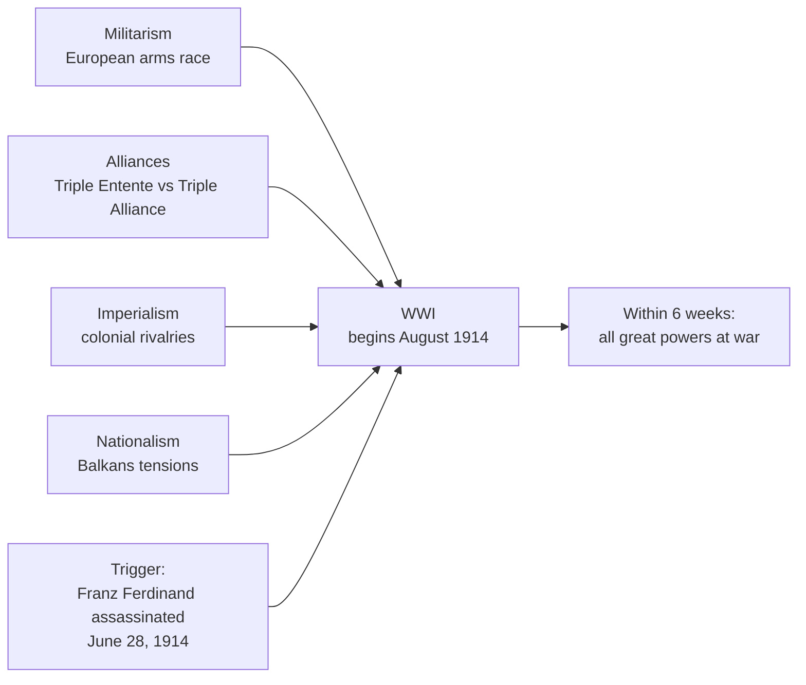
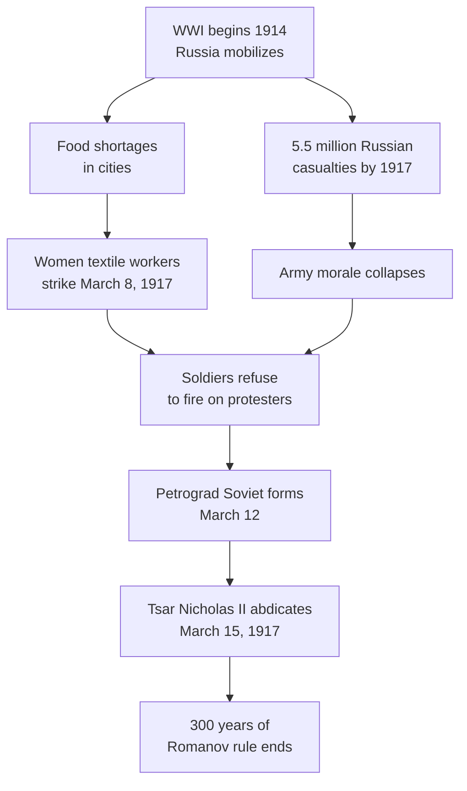
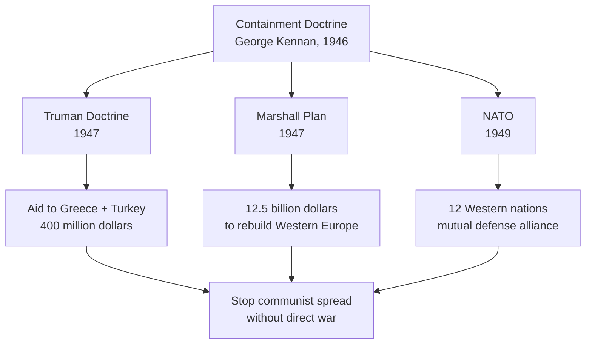

import Callout from '../../components/Callout.astro';
import KeyTerm from '../../components/KeyTerm.astro';
import Collapsible from '../../components/Collapsible.astro';
import Quiz from '../../components/Quiz.astro';
import Flashcards from '../../components/Flashcards.astro';
import Cesium from '../../components/Cesium.astro';
import Timeline from '../../components/Timeline.astro';
import VisTimeline from '../../components/VisTimeline.astro';
import MapView from '../../components/MapView.astro';
import MapLibreView from '../../components/MapLibreView.astro';
import StepThrough from '../../components/StepThrough.astro';
import DiffView from '../../components/DiffView.astro';
import TremorCard from '../../components/TremorCard.astro';
import RechartsBar from '../../components/RechartsBar.astro';
import RechartsLine from '../../components/RechartsLine.astro';
import HistoryAnimation from '../../components/HistoryAnimation.astro';
import SpeechBubble from '../../components/SpeechBubble.astro';
import Flag from '../../components/Flag.astro';
import GuideLoader from '../../components/GuideLoader.astro';
import Typewriter from '../../components/Typewriter.astro';
import Particles from '../../components/Particles.astro';
import VantaBackground from '../../components/VantaBackground.astro';
import AuroraBackground from '../../components/AuroraBackground.astro';
import BadFact from '../../components/BadFact.astro';
import MindMap from '../../components/MindMap.astro';
import NetworkGraph from '../../components/NetworkGraph.astro';
import CompareSlider from '../../components/CompareSlider.astro';
import ReadingProgress from '../../components/ReadingProgress.astro';
import Crossword from '../../components/Crossword.astro';
import Memorize from '../../components/Memorize.astro';
import DragSort from '../../components/DragSort.astro';
import MatchPairs from '../../components/MatchPairs.astro';
import Hotspots from '../../components/Hotspots.astro';
import Poll from '../../components/Poll.astro';
import TestTimer from '../../components/TestTimer.astro';
import Pomodoro from '../../components/Pomodoro.astro';
import Sankey from '../../components/Sankey.astro';
import NivoSunburst from '../../components/NivoSunburst.astro';
import NivoStream from '../../components/NivoStream.astro';
import NivoChord from '../../components/NivoChord.astro';
import Choropleth from '../../components/Choropleth.astro';
import Cartogram from '../../components/Cartogram.astro';
import HeatMap from '../../components/HeatMap.astro';
import Dendrogram from '../../components/Dendrogram.astro';
import DocAnnotate from '../../components/DocAnnotate.astro';
import TextAnnotate from '../../components/TextAnnotate.astro';
import ImageAnnotate from '../../components/ImageAnnotate.astro';
import TrenchWarfareSim from '../../components/TrenchWarfareSim.astro';
import FiveYearPlanGame from '../../components/FiveYearPlanGame.astro';
import DDayLandingSim from '../../components/DDayLandingSim.astro';
import MissileCrisisGame from '../../components/MissileCrisisGame.astro';
import JungleSpot from '../../components/JungleSpot.astro';
import EuropeAtlasQuiz from '../../components/EuropeAtlasQuiz.astro';

<GuideLoader maxSeconds={10} stepPx={700} stepMs={130} />

<ReadingProgress />

  <Particles preset="links" backgroundColor="#0a0a0a" particleColor="#f87171" height={380} />
  

    
Final Exam Companion

    <h1 class="font-serif text-4xl md:text-6xl font-bold text-white mb-4">Adv Modern Euro</h1>
    

      <Typewriter text="Five sections. Two world wars. One final exam." speed={45} />
    

    
1914 to 1991 · Built for visual learners

  

  <TremorCard label="Years covered" value="1914-1991" helper="The 77 years that shaped the modern world" />
  <TremorCard label="Sections" value="5" helper="WWI, Russian Rev, Interwar, WWII, Cold War" />
  <TremorCard label="Key terms" value="90+" helper="Every term from the official study guide" />
  <TremorCard label="Custom simulations" value="5" helper="Trench, Five-Year Plan, D-Day, Missile Crisis, Jungle" />

<Callout type="insight" title="The framing that wins this final">
  Every section, every essay, every multiple choice question on the final test bends back to one structure: **Cause → Effect → Significance**. The teacher said it themselves at the top of the official study guide. Don't memorize dates as a list. Memorize them as **why this happened, what it caused, and why it matters for what comes next.**
</Callout>

<Callout type="tip" title="How to use this guide">
  1. **Start at the master overview** below: spin the Cesium globe to see all five sections at once, scrub the master timeline, scan the MindMap to feel the causal chain.
  2. **Review the master glossary** — every key term in one place.
  3. **Work through each of the five sections in order.** They build on each other: the unfinished business of WWI causes WWII; the Russian Revolution feeds straight into the Cold War.
  4. **Each section's "Check yourself" quiz** is your reality check. Take it, then cycle back to anything you missed.
  5. **End with the cumulative mock final** at the bottom: 50-minute timed test, mixed across all five sections, with re-rollable question banks.
</Callout>

## The whole arc on one globe

Drag to spin. Scroll to zoom. Click any marker for a one-line context note. Every section's key locations are pinned here.

<Cesium
  target={[40, 15, 14000000]}
  height={520}
  terrain="world"
  imagery="aerial-with-labels"
  markers={[
    { lat: 43.8563, lng: 18.4131, name: "Sarajevo", note: "June 28, 1914. Franz Ferdinand assassinated. Trigger of WWI." },
    { lat: 52.5200, lng: 13.4050, name: "Berlin", note: "German capital across all five sections. Wall built 1961, fell 1989." },
    { lat: 48.8566, lng: 2.3522, name: "Paris", note: "Two Battles of the Marne (1914, 1918). Treaty of Versailles signed nearby." },
    { lat: 49.1600, lng: 5.3800, name: "Verdun", note: "Feb-Dec 1916. 700,000 casualties. Symbol of WWI futility." },
    { lat: 49.9400, lng: 2.8100, name: "Somme", note: "July-Nov 1916. 1+ million casualties. Industrial-scale slaughter." },
    { lat: 51.5074, lng: -0.1278, name: "London", note: "Allied capital across both world wars and the early Cold War." },
    { lat: 38.9072, lng: -77.0369, name: "Washington DC", note: "Wilson's 14 Points, Truman Doctrine, NATO, all signed here." },
    { lat: 41.0082, lng: 28.9784, name: "Constantinople (Istanbul)", note: "Ottoman capital. Gallipoli campaign 1915. Empire collapses 1918." },
    { lat: 59.9311, lng: 30.3609, name: "Petrograd (St. Petersburg)", note: "March + November Revolutions of 1917 began here." },
    { lat: 55.7558, lng: 37.6173, name: "Moscow", note: "Bolshevik HQ 1918 onward. USSR capital. Soviet hub of the Cold War." },
    { lat: 56.8389, lng: 60.6057, name: "Yekaterinburg", note: "Tsar Nicholas II and family executed July 1918. End of Romanov dynasty." },
    { lat: 48.2082, lng: 16.3738, name: "Vienna", note: "Austria-Hungary capital. Empire collapses 1918." },
    { lat: 48.1351, lng: 11.5820, name: "Munich", note: "Beer Hall Putsch 1923. Munich Agreement 1938 (appeasement)." },
    { lat: 41.9028, lng: 12.4964, name: "Rome", note: "Mussolini's March on Rome 1922. Birthplace of fascism." },
    { lat: 40.4168, lng: -3.7038, name: "Madrid", note: "Spanish Civil War 1936-1939. Test run for WWII alliances." },
    { lat: 41.7956, lng: 123.4327, name: "Mukden, Manchuria", note: "Japanese invasion 1931. League of Nations fails its first test." },
    { lat: 32.0603, lng: 118.7969, name: "Nanjing", note: "Rape of Nanjing 1937-1938. Japanese atrocity." },
    { lat: 48.7080, lng: 44.5133, name: "Stalingrad (Volgograd)", note: "Aug 1942 - Feb 1943. Eastern Front turning point." },
    { lat: 49.3700, lng: -0.8700, name: "Normandy", note: "D-Day, June 6, 1944. Largest amphibious invasion in history." },
    { lat: 21.3650, lng: -157.9740, name: "Pearl Harbor", note: "Dec 7, 1941. US enters WWII." },
    { lat: 50.0359, lng: 19.1783, name: "Auschwitz", note: "Largest Nazi death camp. ~1.1 million murdered." },
    { lat: 35.6762, lng: 139.6503, name: "Tokyo", note: "Imperial Japan's command. Firebombed 1945, surrenders Aug 14." },
    { lat: 34.3853, lng: 132.4553, name: "Hiroshima", note: "Aug 6, 1945. First atomic bomb used in war." },
    { lat: 32.7503, lng: 129.8779, name: "Nagasaki", note: "Aug 9, 1945. Second atomic bomb. Japan surrenders Aug 14." },
    { lat: 44.4951, lng: 34.1660, name: "Yalta", note: "Feb 1945. Roosevelt + Churchill + Stalin. Cold War seeds." },
    { lat: 52.4009, lng: 13.0656, name: "Potsdam", note: "July 1945. Truman vs Stalin. The alliance breaks." },
    { lat: 23.1136, lng: -82.3666, name: "Havana", note: "Castro's communist Cuba 1959. 90 miles from Florida." },
    { lat: 35.6892, lng: 51.3890, name: "Tehran", note: "Iranian Revolution 1979. Hostages held 444 days." },
    { lat: 39.9042, lng: 116.4074, name: "Beijing", note: "Mao's communist China 1949. Splits with USSR 1959." }
  ]}
/>

## Master timeline, 1914 to 1991

77 years. ~50 events. Color-coded by section: WWI (red), Russian Revolution (crimson), Interwar (gray), WWII (red-orange), Cold War (light red).

<Timeline
  height="780px"
  title={{ headline: "Adv Modern Europe Final", text: "1914 to 1991: The 77 years that shaped the modern world" }}
  events={[
    { date: "1914-06-28", headline: "Franz Ferdinand assassinated in Sarajevo", text: "A 19-year-old Serbian nationalist named Gavrilo Princip fires two shots. Within 6 weeks, all of Europe is at war." },
    { date: "1914-07-28", headline: "Austria-Hungary declares war on Serbia", text: "Germany's 'blank check' encourages aggression. Russia mobilizes to defend Serbia." },
    { date: "1914-08-04", headline: "Britain enters the war", text: "Germany invades neutral Belgium. Britain honors its Belgium guarantee. The war is now European." },
    { date: "1914-09-05", headline: "First Battle of the Marne", text: "Schlieffen Plan fails. Western Front becomes a stalemate. Trench warfare begins." },
    { date: "1915-04-25", headline: "Gallipoli campaign begins", text: "British/ANZAC attempt to seize Constantinople. Disastrous failure." },
    { date: "1915-05-23", headline: "Italy joins the Allies", text: "Italy switches from the Triple Alliance after Britain promises Italian-speaking lands." },
    { date: "1916-02-21", headline: "Battle of Verdun begins", text: "Germany attacks France's fortress. 10 months. 700,000 casualties. No territory changes hands." },
    { date: "1916-07-01", headline: "Battle of the Somme begins", text: "British offensive. 60,000 British casualties on day one. 1+ million total." },
    { date: "1917-04-06", headline: "United States declares war on Germany", text: "Unrestricted submarine warfare + Zimmerman Note + economic ties pull the US in." },
    { date: "1917-03-08", headline: "March Revolution in Russia", text: "Women textile workers strike on International Women's Day. Within days, Tsar Nicholas II abdicates." },
    { date: "1917-11-07", headline: "Bolshevik Revolution", text: "Lenin's Bolsheviks seize power. 'Peace, Land, Bread.'" },
    { date: "1918-03-03", headline: "Treaty of Brest-Litovsk", text: "Russia exits WWI. Loses huge territory. Germany frees up Eastern Front troops." },
    { date: "1918-07-15", headline: "Second Battle of the Marne", text: "Last German offensive. 2 million fresh US troops break it. Germany retreats." },
    { date: "1918-11-11", headline: "Armistice", text: "Germany signs ceasefire. 11th hour, 11th day, 11th month. WWI ends." },
    { date: "1919-06-28", headline: "Treaty of Versailles signed", text: "Article 231 'War Guilt Clause' blames Germany. Sets up resentment that fuels WWII." },
    { date: "1919-08-11", headline: "Weimar Republic founded", text: "New German democracy. Saddled with reparations and the stigma of signing Versailles." },
    { date: "1921-03-15", headline: "Lenin announces NEP", text: "New Economic Policy. Tactical retreat from full communism. Peasants can sell extra crops." },
    { date: "1922-10-28", headline: "Mussolini's March on Rome", text: "Black Shirts march. King appoints Mussolini PM. First fascist government." },
    { date: "1922-12-30", headline: "USSR formed", text: "Russia, Ukraine, Belarus, Transcaucasia merge into the Union of Soviet Socialist Republics." },
    { date: "1923-11-08", headline: "Beer Hall Putsch", text: "Hitler's failed Munich coup. Imprisoned. Writes Mein Kampf in prison." },
    { date: "1923-11-15", headline: "German hyperinflation peaks", text: "200 billion marks for one loaf of bread. Wheelbarrows of cash to buy groceries." },
    { date: "1924-08-30", headline: "Dawes Plan", text: "200 million dollar US loan restructures German reparations. Stabilizes Europe briefly." },
    { date: "1924-01-21", headline: "Lenin dies", text: "Succession battle. Stalin outmaneuvers Trotsky." },
    { date: "1928-10-01", headline: "First Five-Year Plan begins", text: "Stalin's forced industrialization. Rapid growth, massive human cost." },
    { date: "1929-10-29", headline: "Black Tuesday: Wall Street crashes", text: "US stock market collapse triggers Great Depression. Spreads globally." },
    { date: "1931-09-18", headline: "Japan invades Manchuria", text: "League of Nations fails its first test. Japan walks out of the League." },
    { date: "1933-01-30", headline: "Hitler becomes Chancellor", text: "Appointed legally. Reichstag Fire (Feb 27) leads to Enabling Act. Democracy ends." },
    { date: "1935-09-15", headline: "Nuremberg Laws", text: "Strip German Jews of citizenship. Prelude to the Holocaust." },
    { date: "1936-03-07", headline: "Hitler remilitarizes the Rhineland", text: "Violates Versailles. France and Britain do nothing. Appeasement begins." },
    { date: "1936-07-17", headline: "Spanish Civil War begins", text: "Franco's nationalists, backed by Germany and Italy, fight the Republic. Test run for WWII." },
    { date: "1937-12-13", headline: "Rape of Nanjing", text: "Japanese army massacres 200,000+ Chinese civilians over 6 weeks." },
    { date: "1938-09-30", headline: "Munich Agreement", text: "Britain + France hand Hitler the Sudetenland. Chamberlain: 'Peace for our time.'" },
    { date: "1939-08-23", headline: "Nazi-Soviet Nonaggression Pact", text: "Hitler and Stalin secretly divide Poland. The world is stunned." },
    { date: "1939-09-01", headline: "Germany invades Poland", text: "Blitzkrieg in 3 weeks. Britain and France declare war. WWII begins." },
    { date: "1941-06-22", headline: "Operation Barbarossa", text: "Hitler breaks the pact and invades the USSR. Largest invasion in history." },
    { date: "1941-12-07", headline: "Pearl Harbor", text: "Japan attacks. US enters WWII." },
    { date: "1942-08-23", headline: "Battle of Stalingrad begins", text: "USSR defeats Germany over 5 months. 2 million casualties. Eastern Front turning point." },
    { date: "1942-06-04", headline: "Battle of Midway", text: "US Navy destroys 4 Japanese carriers. Pacific turning point." },
    { date: "1944-06-06", headline: "D-Day", text: "Largest amphibious invasion in history. Second front opens in Western Europe." },
    { date: "1945-02-04", headline: "Yalta Conference", text: "Roosevelt, Churchill, Stalin. Germany to be divided. Free-elections promise (broken)." },
    { date: "1945-05-08", headline: "V-E Day", text: "Germany surrenders. War in Europe ends." },
    { date: "1945-07-17", headline: "Potsdam Conference", text: "Truman replaces FDR. Demands free elections. Stalin refuses. Cold War begins." },
    { date: "1945-08-06", headline: "Hiroshima atomic bomb", text: "First atomic weapon used in war. ~140,000 dead." },
    { date: "1945-08-09", headline: "Nagasaki atomic bomb", text: "Japan surrenders Aug 14. WWII ends." },
    { date: "1947-03-12", headline: "Truman Doctrine", text: "US aid to countries resisting communism. Containment policy formalized." },
    { date: "1948-06-24", headline: "Berlin Airlift begins", text: "Stalin blocks West Berlin. US/UK fly in supplies for 11 months." },
    { date: "1949-04-04", headline: "NATO formed", text: "12 Western nations. Mutual defense alliance." },
    { date: "1955-05-14", headline: "Warsaw Pact formed", text: "USSR + 7 satellites. Direct response to NATO." },
    { date: "1957-10-04", headline: "Sputnik launched", text: "First artificial satellite. Space Race begins." },
    { date: "1961-08-13", headline: "Berlin Wall built", text: "East Germany seals off West Berlin. The wall stands 28 years." },
    { date: "1962-10-16", headline: "Cuban Missile Crisis", text: "13 days. Closest the world ever came to nuclear war." },
    { date: "1985-03-11", headline: "Gorbachev takes power", text: "Glasnost, perestroika, democratization. Begins to reform from within." },
    { date: "1989-11-09", headline: "Berlin Wall falls", text: "East Germans cross freely. Communism collapses across Eastern Europe." },
    { date: "1991-12-25", headline: "USSR dissolves", text: "Gorbachev resigns. 15 republics independent. Cold War over." }
  ]}
/>

## The causal chain at a glance

This MindMap shows the spine of the entire 77 years. Every section's outcome becomes the next section's setup.

<MindMap
  title="How the five sections connect"
  height={520}
  markdown={`# 1914 to 1991
## 1. WWI
- MAIN causes (Militarism, Alliances, Imperialism, Nationalism)
- Trench warfare = stalemate
- Russia exits early (Brest-Litovsk)
- US enters late (Zimmerman Note, U-boats)
- Treaty of Versailles -> German resentment
## 2. Russian Revolution
- Tsar Nicholas II falls (March 1917)
- Provisional Government fails
- Lenin's Bolsheviks (November 1917)
- NEP buys time
- Stalin's totalitarianism (Five-Year Plans, Great Purge)
## 3. Interwar
- Weimar weakness + hyperinflation
- Great Depression (1929) globalizes the crisis
- Mussolini + Hitler rise
- Appeasement (Munich 1938) fails
- Nazi-Soviet Pact 1939 clears the path
## 4. WWII
- Blitzkrieg conquers Europe
- Stalingrad + Midway + D-Day = turning points
- Holocaust
- Atomic bombs end the war in the Pacific
- US + USSR emerge as superpowers -> Cold War setup
## 5. Cold War
- Yalta + Potsdam break the alliance
- Containment + Truman Doctrine + Marshall Plan + NATO
- Cuban Missile Crisis = brinkmanship peak
- Detente then renewed tension
- Gorbachev's reforms collapse the USSR`}
/>

## Master glossary

Every key term from the official Final Exam Study Guide and chapter-specific key-term sheets. Hover any term in any section's prose to see this definition.

### World War I (Section 1)

  
<strong class="font-serif font-semibold text-ink-900 dark:text-ink-100">Triple Alliance</strong>1882 alliance: Germany, Austria-Hungary, Italy. (Italy switches sides in 1915.)

  
<strong class="font-serif font-semibold text-ink-900 dark:text-ink-100">Triple Entente</strong>1907 alliance: France, Russia, Great Britain.

  
<strong class="font-serif font-semibold text-ink-900 dark:text-ink-100">Militarism</strong>Glorifying the military and keeping a large, ready-to-fight army. Pre-1914 Europe was in an arms race.

  
<strong class="font-serif font-semibold text-ink-900 dark:text-ink-100">Alliance System</strong>Network of secret defense agreements. When one country fell into war, the rest were dragged in by treaty.

  
<strong class="font-serif font-semibold text-ink-900 dark:text-ink-100">Imperialism</strong>Stronger nations controlling weaker ones for resources, markets, and prestige. A pre-1914 source of friction.

  
<strong class="font-serif font-semibold text-ink-900 dark:text-ink-100">Nationalism</strong>Pride and loyalty to one's nation or ethnic group. United Germans and Italians; tore apart Austria-Hungary and Ottoman Empire.

  
<strong class="font-serif font-semibold text-ink-900 dark:text-ink-100">Balkan Peninsula (powder keg)</strong>Southeastern Europe. Many ethnic groups, many revolts, multiple empires colliding. Where WWI started.

  
<strong class="font-serif font-semibold text-ink-900 dark:text-ink-100">July Crisis</strong>The 5 weeks between Franz Ferdinand's assassination (June 28, 1914) and Britain entering the war (Aug 4, 1914). Cascading diplomatic failure.

  
<strong class="font-serif font-semibold text-ink-900 dark:text-ink-100">Archduke Franz Ferdinand</strong>Heir to the Austro-Hungarian throne. Assassinated June 28, 1914 in Sarajevo by Gavrilo Princip.

  
<strong class="font-serif font-semibold text-ink-900 dark:text-ink-100">Black Hand</strong>Serbian nationalist secret society that backed Princip. The connection that triggered Austria-Hungary's ultimatum to Serbia.

  
<strong class="font-serif font-semibold text-ink-900 dark:text-ink-100">Blank Check</strong>Germany's promise of unconditional support to Austria-Hungary in July 1914. Encouraged A-H to attack Serbia.

  
<strong class="font-serif font-semibold text-ink-900 dark:text-ink-100">Central Powers</strong>Germany, Austria-Hungary, Ottoman Empire, Bulgaria.

  
<strong class="font-serif font-semibold text-ink-900 dark:text-ink-100">Allied Powers</strong>Britain, France, Russia (until 1917), Italy (from 1915), United States (from 1917), Japan, plus colonial troops.

  
<strong class="font-serif font-semibold text-ink-900 dark:text-ink-100">Western Front</strong>The trench line from the English Channel to Switzerland. Stalemate for 4 years.

  
<strong class="font-serif font-semibold text-ink-900 dark:text-ink-100">Schlieffen Plan</strong>Germany's pre-war plan to defeat France quickly through Belgium, then turn east to fight Russia. Failed at the First Battle of the Marne.

  
<strong class="font-serif font-semibold text-ink-900 dark:text-ink-100">First Battle of the Marne</strong>September 1914. France stops the German advance. Schlieffen Plan dies. Stalemate begins.

  
<strong class="font-serif font-semibold text-ink-900 dark:text-ink-100">Battle of Verdun</strong>February to December 1916. German attack on French fortress. ~700,000 casualties. Symbol of the futility of WWI.

  
<strong class="font-serif font-semibold text-ink-900 dark:text-ink-100">Battle of the Somme</strong>July to November 1916. British offensive. Over 1 million casualties. Symbol of industrial-scale warfare.

  
<strong class="font-serif font-semibold text-ink-900 dark:text-ink-100">Trench Warfare</strong>Soldiers dug into long defensive ditches. Machine guns, barbed wire, and artillery made attacks suicidal. Caused the stalemate.

  
<strong class="font-serif font-semibold text-ink-900 dark:text-ink-100">Stalemate</strong>A standstill where neither side can win. Defined the Western Front for nearly 4 years.

  
<strong class="font-serif font-semibold text-ink-900 dark:text-ink-100">US Isolationism</strong>American policy of staying out of European conflicts. Held until Germany's submarine warfare and the Zimmerman Note made neutrality impossible.

  
<strong class="font-serif font-semibold text-ink-900 dark:text-ink-100">Unrestricted Submarine Warfare</strong>Germany sank any ship in war zones, including civilian. The sinking of the Lusitania (1915) and resumption of the policy in 1917 pulled the US toward war.

  
<strong class="font-serif font-semibold text-ink-900 dark:text-ink-100">Zimmerman Note</strong>January 1917. Germany secretly proposed an alliance with Mexico against the US. British intercepted and shared with the US. Tipped public opinion to war.

  
<strong class="font-serif font-semibold text-ink-900 dark:text-ink-100">Total War</strong>Entire society mobilized for the war effort. Civilian factories make weapons. Rationing. Propaganda. Women in the workforce. Every resource directed at victory.

  
<strong class="font-serif font-semibold text-ink-900 dark:text-ink-100">Propaganda</strong>Government messaging to shape public opinion. Posters, films, news. Demonized the enemy ("the Hun"), recruited soldiers, sold war bonds.

  
<strong class="font-serif font-semibold text-ink-900 dark:text-ink-100">Eastern Front</strong>Russia vs Germany and Austria-Hungary. Less trench-bound than the West. Russia bore enormous casualties (4+ million in year one).

  
<strong class="font-serif font-semibold text-ink-900 dark:text-ink-100">Gallipoli Campaign</strong>1915 Allied attempt to seize the Dardanelles and Constantinople. Failed disastrously. ~250,000 Allied casualties.

  
<strong class="font-serif font-semibold text-ink-900 dark:text-ink-100">Treaty of Brest-Litovsk</strong>March 1918. Russia exits the war. Loses Poland, Ukraine, Baltics, Finland. Frees up German troops for the Western Front.

  
<strong class="font-serif font-semibold text-ink-900 dark:text-ink-100">Second Battle of the Marne</strong>July 1918. Germany's last offensive. 2 million fresh US troops break it. Germany begins retreating.

  
<strong class="font-serif font-semibold text-ink-900 dark:text-ink-100">Armistice</strong>Ceasefire. November 11, 1918, 11 a.m. Germany signs. WWI ends.

  
<strong class="font-serif font-semibold text-ink-900 dark:text-ink-100">Paris Peace Conference</strong>January 1919. Big Four (US, UK, France, Italy) negotiate the postwar order. No Germany, no Russia.

  
<strong class="font-serif font-semibold text-ink-900 dark:text-ink-100">Woodrow Wilson</strong>US president. Brought idealism (Fourteen Points) to a Europe that wanted revenge.

  
<strong class="font-serif font-semibold text-ink-900 dark:text-ink-100">Fourteen Points</strong>Wilson's plan: end secret alliances, freedom of seas, reduce militaries, fair colonial claims, self-determination, League of Nations.

  
<strong class="font-serif font-semibold text-ink-900 dark:text-ink-100">League of Nations</strong>First international body to prevent war. Wilson's idea. The US Senate refused to join. Doomed it from the start.

  
<strong class="font-serif font-semibold text-ink-900 dark:text-ink-100">Treaty of Versailles</strong>June 28, 1919. Punished Germany: lost territory, lost colonies, capped army at 100,000, paid reparations. Sowed the seeds of WWII.

  
<strong class="font-serif font-semibold text-ink-900 dark:text-ink-100">Article 231 (War Guilt Clause)</strong>Forced Germany to accept full blame for WWI. Justification for reparations. Bred the resentment that Hitler exploited.

### Russian Revolution (Section 2)

  
<strong class="font-serif font-semibold text-ink-900 dark:text-ink-100">Provisional Government</strong>Temporary government after the March 1917 abdication of Tsar Nicholas II. Failed because it kept Russia in WWI and didn't redistribute land.

  
<strong class="font-serif font-semibold text-ink-900 dark:text-ink-100">Bolsheviks</strong>Lenin's radical communist faction. Seized power in November 1917. "Peace, Land, Bread."

  
<strong class="font-serif font-semibold text-ink-900 dark:text-ink-100">Vladimir Lenin</strong>Leader of the Bolshevik Revolution. Returned from exile via German train. First Soviet leader. Died 1924.

  
<strong class="font-serif font-semibold text-ink-900 dark:text-ink-100">Soviets</strong>Worker and soldier councils. Parallel power to the Provisional Government. Lenin's slogan: "All power to the Soviets."

  
<strong class="font-serif font-semibold text-ink-900 dark:text-ink-100">Russian Civil War</strong>1918-1921. Reds (Bolsheviks) vs Whites (anti-Bolsheviks, plus foreign interventionists). Reds win.

  
<strong class="font-serif font-semibold text-ink-900 dark:text-ink-100">Leon Trotsky</strong>Lenin's chief lieutenant. Built and led the Red Army during the Civil War. Lost the succession battle to Stalin. Exiled, later assassinated.

  
<strong class="font-serif font-semibold text-ink-900 dark:text-ink-100">NEP (New Economic Policy)</strong>Lenin's 1921 retreat from full communism. Peasants could sell extra crops. Small businesses allowed. Tactical, not ideological.

  
<strong class="font-serif font-semibold text-ink-900 dark:text-ink-100">USSR</strong>Union of Soviet Socialist Republics. Formed 1922. Russia plus Ukraine, Belarus, Transcaucasia. Eventually 15 republics.

  
<strong class="font-serif font-semibold text-ink-900 dark:text-ink-100">Joseph Stalin</strong>Lenin's successor (1924-1953). Five-Year Plans, collectivization, Great Purge. Killed millions. Built the USSR into a superpower.

  
<strong class="font-serif font-semibold text-ink-900 dark:text-ink-100">Totalitarianism</strong>Government that controls every aspect of life: economy, religion, education, media, family. Stalin's USSR is the textbook case.

  
<strong class="font-serif font-semibold text-ink-900 dark:text-ink-100">Five-Year Plans</strong>Stalin's forced industrialization. Set production targets across the economy. Rapid growth. Massive human cost.

  
<strong class="font-serif font-semibold text-ink-900 dark:text-ink-100">Collectivization</strong>Forced merger of peasant farms into giant state-run collective farms. Kulaks resisted, were liquidated. Famine killed millions.

  
<strong class="font-serif font-semibold text-ink-900 dark:text-ink-100">Great Purge</strong>1936-1938. Stalin's mass arrests and executions. ~8 to 13 million dead. Eliminated rivals, generals, Old Bolsheviks. Show trials.

  
<strong class="font-serif font-semibold text-ink-900 dark:text-ink-100">Cult of Personality</strong>Propaganda treats the leader as godlike and infallible. Stalin's portraits everywhere. History rewritten to center him.

### Interwar Years (Section 3)

  
<strong class="font-serif font-semibold text-ink-900 dark:text-ink-100">Weimar Republic</strong>German democracy, 1919-1933. Saddled with Versailles guilt, hyperinflation, depression. Collapsed when Hitler came to power.

  
<strong class="font-serif font-semibold text-ink-900 dark:text-ink-100">Article 48</strong>Weimar emergency-powers clause. Hitler used it after the Reichstag Fire to suspend civil liberties.

  
<strong class="font-serif font-semibold text-ink-900 dark:text-ink-100">Proportional Representation</strong>Weimar's voting system. Tiny parties got seats. Coalitions were unstable. Made governing nearly impossible.

  
<strong class="font-serif font-semibold text-ink-900 dark:text-ink-100">Hyperinflation</strong>Germany 1923. 200 billion marks for a loaf of bread. Wheelbarrows of cash. Wiped out middle-class savings. Bred resentment.

  
<strong class="font-serif font-semibold text-ink-900 dark:text-ink-100">Dawes Plan</strong>1924. US loaned 200 million dollars to restructure German reparations. Briefly stabilized Europe. Made Germany dependent on US loans.

  
<strong class="font-serif font-semibold text-ink-900 dark:text-ink-100">Stock Market Crash (1929)</strong>October 29, 1929 ("Black Tuesday"). US stock market collapses. Triggers the Great Depression. Spreads globally through American loans.

  
<strong class="font-serif font-semibold text-ink-900 dark:text-ink-100">Great Depression</strong>1929-1939. Global economic collapse. Unemployment hit 30 percent. Trade dropped 62 percent. Discredited democracy in many countries.

  
<strong class="font-serif font-semibold text-ink-900 dark:text-ink-100">Tariffs</strong>Taxes on imports. Countries raised them to protect domestic industries. Choked global trade. Made the Depression worse.

  
<strong class="font-serif font-semibold text-ink-900 dark:text-ink-100">Collective Security</strong>Idea behind the League of Nations. If one nation is attacked, others respond together. Failed in the 1930s when nobody enforced it.

  
<strong class="font-serif font-semibold text-ink-900 dark:text-ink-100">Fascism</strong>Authoritarian, nationalist, militaristic ideology. Worships the state and the leader. Glorifies violence. Italy under Mussolini, Germany under Hitler.

  
<strong class="font-serif font-semibold text-ink-900 dark:text-ink-100">Benito Mussolini</strong>Italian dictator. Founded fascism. March on Rome 1922. Modeled the playbook Hitler followed.

  
<strong class="font-serif font-semibold text-ink-900 dark:text-ink-100">Adolf Hitler</strong>German dictator. Nazi Party leader. Chancellor 1933. Caused WWII and the Holocaust. Suicide April 30, 1945.

  
<strong class="font-serif font-semibold text-ink-900 dark:text-ink-100">Nazism</strong>German fascism. Adds racial ideology: Aryan supremacy, anti-Semitism, Lebensraum (living space).

  
<strong class="font-serif font-semibold text-ink-900 dark:text-ink-100">Anti-Semitism</strong>Hatred of Jews. Core to Nazi ideology. Led to Nuremberg Laws (1935), Kristallnacht (1938), and the Holocaust.

  
<strong class="font-serif font-semibold text-ink-900 dark:text-ink-100">Lebensraum</strong>"Living space." Hitler's claim that Germany needed Eastern European land to grow. Justification for invading Poland and the USSR.

  
<strong class="font-serif font-semibold text-ink-900 dark:text-ink-100">Führer Principle</strong>Absolute obedience to the leader. The Führer is the state. No checks, no balances, no dissent.

  
<strong class="font-serif font-semibold text-ink-900 dark:text-ink-100">Beer Hall Putsch</strong>November 1923. Hitler's failed Munich coup. Imprisoned. Wrote Mein Kampf in prison.

  
<strong class="font-serif font-semibold text-ink-900 dark:text-ink-100">Mein Kampf</strong>Hitler's 1925 memoir/manifesto. Spelled out his goals: anti-Semitism, Lebensraum, undoing Versailles. Few took it seriously until too late.

  
<strong class="font-serif font-semibold text-ink-900 dark:text-ink-100">Remilitarization of the Rhineland</strong>March 1936. Hitler moves troops into the buffer zone. Violates Versailles. France and Britain do nothing. Appeasement begins.

  
<strong class="font-serif font-semibold text-ink-900 dark:text-ink-100">Invasion of Manchuria</strong>September 1931. Japan seizes Manchuria from China. League of Nations condemns but does nothing. Japan walks out of the League.

  
<strong class="font-serif font-semibold text-ink-900 dark:text-ink-100">Rape of Nanjing</strong>December 1937 - January 1938. Japanese army massacres ~200,000 Chinese civilians and POWs. War crime defining the Pacific theater.

  
<strong class="font-serif font-semibold text-ink-900 dark:text-ink-100">Munich Agreement</strong>September 1938. Britain, France, Germany, Italy meet. Hand Hitler the Sudetenland. Czechoslovakia not invited. Chamberlain: "Peace for our time."

  
<strong class="font-serif font-semibold text-ink-900 dark:text-ink-100">Appeasement</strong>Giving in to an aggressor's demands to avoid war. Britain and France did this with Hitler 1936-1938. It encouraged him.

  
<strong class="font-serif font-semibold text-ink-900 dark:text-ink-100">Axis Powers</strong>Germany, Italy, Japan. Anti-Comintern Pact 1936. Tripartite Pact 1940.

  
<strong class="font-serif font-semibold text-ink-900 dark:text-ink-100">Neutrality Acts</strong>US laws of the 1930s designed to keep America out of foreign wars. Banned arms sales to belligerents. Loosened as WWII approached.

  
<strong class="font-serif font-semibold text-ink-900 dark:text-ink-100">Nazi-Soviet Nonaggression Pact</strong>August 1939. Hitler and Stalin secretly agree not to attack each other and divide Poland. Stunned the world. Cleared the path to WWII.

### World War II (Section 4)

  
<strong class="font-serif font-semibold text-ink-900 dark:text-ink-100">Blitzkrieg</strong>"Lightning war." Fast tank columns + dive bombers + radio coordination. Conquered Poland in 3 weeks, France in 6.

  
<strong class="font-serif font-semibold text-ink-900 dark:text-ink-100">Battle of Britain</strong>Summer-Fall 1940. RAF defeats Luftwaffe. Hitler postpones invasion of Britain. First German setback.

  
<strong class="font-serif font-semibold text-ink-900 dark:text-ink-100">Operation Barbarossa</strong>June 22, 1941. Hitler's invasion of the USSR. Largest invasion in history. Initial success, then bogged down.

  
<strong class="font-serif font-semibold text-ink-900 dark:text-ink-100">Pearl Harbor</strong>December 7, 1941. Japan's surprise attack on US Pacific Fleet. Pulls the US into WWII.

  
<strong class="font-serif font-semibold text-ink-900 dark:text-ink-100">Battle of Stalingrad</strong>August 1942 - February 1943. USSR defeats German Sixth Army. ~2 million casualties. Eastern Front turning point.

  
<strong class="font-serif font-semibold text-ink-900 dark:text-ink-100">Battle of Midway</strong>June 1942. US Navy destroys 4 Japanese carriers. Pacific theater turning point.

  
<strong class="font-serif font-semibold text-ink-900 dark:text-ink-100">D-Day</strong>June 6, 1944. Largest amphibious invasion in history. Allies land at Normandy. Opens the second front. ~3,000 Allied dead on day one.

  
<strong class="font-serif font-semibold text-ink-900 dark:text-ink-100">Holocaust</strong>Systematic Nazi murder of 6 million Jews and 5 million others (Roma, disabled, Soviet POWs, political prisoners). Death camps: Auschwitz, Treblinka, Sobibor, etc.

  
<strong class="font-serif font-semibold text-ink-900 dark:text-ink-100">Atomic Bomb</strong>Nuclear weapon. US dropped on Hiroshima (Aug 6, 1945) and Nagasaki (Aug 9, 1945). Japan surrendered Aug 14.

  
<strong class="font-serif font-semibold text-ink-900 dark:text-ink-100">V-E Day</strong>May 8, 1945. Victory in Europe. Germany surrenders.

  
<strong class="font-serif font-semibold text-ink-900 dark:text-ink-100">V-J Day</strong>August 14-15, 1945. Victory over Japan. Japan surrenders after the atomic bombs.

### Cold War (Section 5)

  
<strong class="font-serif font-semibold text-ink-900 dark:text-ink-100">Cold War</strong>1945-1991 political and ideological conflict between the US and USSR. Tension, competition, threats. No direct fighting between the two.

  
<strong class="font-serif font-semibold text-ink-900 dark:text-ink-100">Yalta Conference</strong>February 1945. FDR + Churchill + Stalin in Crimea. Germany to be divided. Free-elections promise (Stalin breaks it).

  
<strong class="font-serif font-semibold text-ink-900 dark:text-ink-100">Potsdam Conference</strong>July 1945. Truman + Attlee + Stalin near Berlin. Truman demands free elections. Stalin refuses. Alliance breaks.

  
<strong class="font-serif font-semibold text-ink-900 dark:text-ink-100">Iron Curtain</strong>Churchill's 1946 phrase. The line dividing democratic Western Europe from Soviet-controlled Eastern Europe.

  
<strong class="font-serif font-semibold text-ink-900 dark:text-ink-100">Containment</strong>US master strategy. Stop the spread of communism without direct war. Drove every Cold War policy.

  
<strong class="font-serif font-semibold text-ink-900 dark:text-ink-100">Truman Doctrine</strong>1947. US aid to countries resisting communism. First applied to Greece and Turkey.

  
<strong class="font-serif font-semibold text-ink-900 dark:text-ink-100">Marshall Plan</strong>1947. 12.5 billion dollars to rebuild Western Europe. Strengthened economies and undercut communism's appeal.

  
<strong class="font-serif font-semibold text-ink-900 dark:text-ink-100">Berlin Airlift</strong>1948-1949. Stalin blocks West Berlin. US/UK fly in 2.3 million tons of supplies over 11 months. Stalin lifts the blockade.

  
<strong class="font-serif font-semibold text-ink-900 dark:text-ink-100">NATO</strong>North Atlantic Treaty Organization. 1949. US, Canada, Western Europe. Mutual defense alliance.

  
<strong class="font-serif font-semibold text-ink-900 dark:text-ink-100">Warsaw Pact</strong>1955. USSR + 7 Eastern European satellites. Direct response to NATO and West Germany joining NATO.

  
<strong class="font-serif font-semibold text-ink-900 dark:text-ink-100">Brinkmanship</strong>Pushing a conflict to the very edge of war so the other side backs down. Eisenhower-era strategy.

  
<strong class="font-serif font-semibold text-ink-900 dark:text-ink-100">Sputnik</strong>First artificial satellite. USSR launched it October 4, 1957. Sparked the Space Race and reshaped US science education.

  
<strong class="font-serif font-semibold text-ink-900 dark:text-ink-100">Cuban Missile Crisis</strong>October 1962. 13 days. USSR places nuclear missiles in Cuba. JFK quarantines. Closest the world came to nuclear war.

  
<strong class="font-serif font-semibold text-ink-900 dark:text-ink-100">John F. Kennedy</strong>US president during the Cuban Missile Crisis. His handling defined nuclear-age diplomacy.

  
<strong class="font-serif font-semibold text-ink-900 dark:text-ink-100">Fidel Castro</strong>Cuban revolutionary. Overthrew Batista in 1959. Allied Cuba with the USSR. The 90-mile-from-Florida communist state.

  
<strong class="font-serif font-semibold text-ink-900 dark:text-ink-100">Détente</strong>French for "easing of tension." Nixon's 1970s policy: relax Cold War hostilities through diplomacy. Opens China, signs SALT I.

  
<strong class="font-serif font-semibold text-ink-900 dark:text-ink-100">Mikhail Gorbachev</strong>Last Soviet leader (1985-1991). Glasnost, perestroika, democratization. His reforms unintentionally collapsed the USSR.

  
<strong class="font-serif font-semibold text-ink-900 dark:text-ink-100">Glasnost</strong>Russian for "openness." Free speech, free press, political transparency. Gorbachev's reform.

  
<strong class="font-serif font-semibold text-ink-900 dark:text-ink-100">Perestroika</strong>Russian for "restructuring." Limited free markets, allowed small businesses. Gorbachev's economic reform.

  
<strong class="font-serif font-semibold text-ink-900 dark:text-ink-100">Berlin Wall</strong>Built August 13, 1961, by East Germany. Stopped people fleeing to the West. Fell November 9, 1989. Symbol of the Cold War.

---

# Section 1 · World War I

  <Particles preset="links" backgroundColor="#1a0606" particleColor="#7f1d1d" height={220} density={28} />
  

    
Chapter 13 · 1914 to 1919

    <h2 class="font-serif text-3xl md:text-5xl font-bold text-white mb-2">The Great War</h2>
    
"It will be over by Christmas." It wasn't.

  

  <TremorCard label="Duration" value="4 years 3 months" helper="July 28, 1914 to November 11, 1918" />
  <TremorCard label="Total casualties" value="~40 million" helper="20 million dead, 21 million wounded across all powers" />

<Callout type="insight" title="Why this section matters">
  WWI is where the modern world starts. Empires fall, communism takes power in Russia, the US enters Europe for the first time, and the bad peace at Versailles plants every seed of WWII. Master the **MAIN** causes, the trench-warfare stalemate, why the US entered late, and why the Treaty of Versailles created instability instead of stability.
</Callout>

## Section timeline

<VisTimeline
  height="500px"
  start="1914-06-01"
  end="1919-07-01"
  items={[
    { id: 1, group: "Cause", content: "Franz Ferdinand assassinated", start: "1914-06-28" },
    { id: 2, group: "Cause", content: "Austria-Hungary declares war", start: "1914-07-28" },
    { id: 3, group: "Cause", content: "Britain enters", start: "1914-08-04" },
    { id: 4, group: "Effect", content: "1st Battle of the Marne", start: "1914-09-05" },
    { id: 5, group: "Effect", content: "Gallipoli", start: "1915-04-25" },
    { id: 6, group: "Effect", content: "Italy joins Allies", start: "1915-05-23" },
    { id: 7, group: "Effect", content: "Verdun begins", start: "1916-02-21" },
    { id: 8, group: "Effect", content: "Somme begins", start: "1916-07-01" },
    { id: 9, group: "Effect", content: "US enters", start: "1917-04-06" },
    { id: 10, group: "Effect", content: "Russia exits (Brest-Litovsk)", start: "1918-03-03" },
    { id: 11, group: "Effect", content: "2nd Battle of the Marne", start: "1918-07-15" },
    { id: 12, group: "Effect", content: "Armistice", start: "1918-11-11" },
    { id: 13, group: "Significance", content: "Treaty of Versailles", start: "1919-06-28" }
  ]}
  groups={[
    { id: "Cause", content: "Cause" },
    { id: "Effect", content: "Effect" },
    { id: "Significance", content: "Significance" }
  ]}
/>

## Cause

Europe had been mostly peaceful for 30 years. By 1914, four pressures had built underneath that peace until any spark would set it off.

### The MAIN causes

  

    
M

    <h4 class="font-serif text-lg font-bold text-accent-900 dark:text-accent-100 mb-2">Militarism</h4>
    
Glorifying the military and racing to build the strongest army. Germany and Britain ran a naval arms race for two decades.

  

  

    
A

    <h4 class="font-serif text-lg font-bold text-accent-900 dark:text-accent-100 mb-2">Alliances</h4>
    
Secret defense agreements. When one country fell into war, every signatory got dragged in by treaty obligation.

  

  

    
I

    <h4 class="font-serif text-lg font-bold text-accent-900 dark:text-accent-100 mb-2">Imperialism</h4>
    
Stronger nations carving up the rest of the world. By 1914 most of Africa and Asia was European-owned. Friction over colonies.

  

  

    
N

    <h4 class="font-serif text-lg font-bold text-accent-900 dark:text-accent-100 mb-2">Nationalism</h4>
    
Pride in one's nation or ethnic group. Unified Germans and Italians. Tore Austria-Hungary and the Ottomans apart from inside.

  

<Callout type="tip" title="Memory hook: MAIN">
  **M**ilitarism · **A**lliances · **I**mperialism · **N**ationalism. Memorize this acronym. It's the backbone of any WWI essay answer.
</Callout>

How those four causes plus the assassination trigger combined to start a world war:

### The two pre-war alliances

  

    
1882

    <h3 class="font-serif text-2xl font-bold text-blue-900 dark:text-blue-100 mb-3">Triple Alliance</h3>
    
<Flag code="DE" size={28} />Germany

    
<Flag code="AT" size={28} />Austria-Hungary

    
<Flag code="IT" size={28} />Italy (switches sides 1915)

  

  

    
1907

    <h3 class="font-serif text-2xl font-bold text-accent-900 dark:text-accent-100 mb-3">Triple Entente</h3>
    
<Flag code="FR" size={28} />France

    
<Flag code="RU" size={28} />Russia

    
<Flag code="GB" size={28} />Great Britain

  

### The Balkan powder keg

The Balkan Peninsula had everything needed for an explosion: many ethnic groups, a long history of revolts, multiple empires colliding (Austrian, Ottoman, Russian), and newly independent countries trying to expand.

<MapLibreView
  center={[20, 43]}
  zoom={5}
  height={360}
  style="https://demotiles.maplibre.org/style.json"
  markers={[
    { lng: 18.4131, lat: 43.8563, name: "Sarajevo", description: "June 28, 1914. Franz Ferdinand assassinated here. Trigger of WWI." },
    { lng: 20.4633, lat: 44.8176, name: "Belgrade", description: "Capital of Serbia. Slavic nationalist leadership." },
    { lng: 16.3738, lat: 48.2082, name: "Vienna", description: "Capital of Austria-Hungary. The empire that was insulted." },
    { lng: 28.9784, lat: 41.0082, name: "Constantinople", description: "Capital of the dying Ottoman Empire." },
    { lng: 23.7275, lat: 37.9838, name: "Athens", description: "Greece, eventually Allied." }
  ]}
/>

In **1908**, Austria-Hungary annexed Bosnia and Herzegovina, infuriating Serbia, which wanted to rule the Slavic populations there. The fuse was lit. It only needed a match.

### The July Crisis (1914): step by step

<StepThrough
  title="From assassination to world war in 5 weeks"
  steps={[
    {
      html: `

1
<h3 style="font-family:serif;font-size:20px;margin:8px 0;">June 28, 1914 · Sarajevo</h3>
Archduke <strong>Franz Ferdinand</strong>, heir to Austria-Hungary, is assassinated by <strong>Gavrilo Princip</strong>, a 19-year-old Serbian nationalist tied to the <strong>Black Hand</strong>.

`,
      caption: "The spark."
    },
    {
      html: `

2
<h3 style="font-family:serif;font-size:20px;margin:8px 0;">Germany's "Blank Check"</h3>
Germany promises Austria-Hungary unconditional support against Serbia. This emboldens A-H to demand the impossible.

`,
      caption: "The escalation."
    },
    {
      html: `

3
<h3 style="font-family:serif;font-size:20px;margin:8px 0;">July 28 · A-H declares war on Serbia</h3>
Serbia accepts most of A-H's harsh ultimatum, but not all. Austria-Hungary declares war anyway. Russia begins mobilizing to defend Serbia.

`,
      caption: "The first declaration."
    },
    {
      html: `

4
<h3 style="font-family:serif;font-size:20px;margin:8px 0;">Aug 1-3 · Germany declares war on Russia and France</h3>
The alliance system kicks in like dominoes. Germany invades neutral Belgium en route to France.

`,
      caption: "The cascade."
    },
    {
      html: `

5
<h3 style="font-family:serif;font-size:20px;margin:8px 0;">Aug 4 · Britain enters</h3>
Britain had a treaty obligation to defend Belgian neutrality. The local Serbia conflict is now a European war. Within months, Japan and the Ottomans join. The world is at war.

`,
      caption: "Six weeks. Five great powers. One world war."
    }
  ]}
  height={300}
/>

<HistoryAnimation
  title="The Domino Falls"
  scenes={[
    {
      duration: 4,
      caption: "June 28, 1914. A 19-year-old steps out of a Sarajevo café.",
      svg: `<svg viewBox="0 0 400 240" xmlns="http://www.w3.org/2000/svg">
        <rect width="400" height="240" fill="#fff"/>
        <text x="200" y="40" text-anchor="middle" font-family="serif" font-size="14" fill="#52525b">SARAJEVO</text>
        <g stroke="#000" stroke-width="2" fill="none" stroke-linecap="round">
          <circle cx="200" cy="120" r="10"/>
          <line x1="200" y1="130" x2="200" y2="170"/>
          <line x1="200" y1="145" x2="180" y2="155"/>
          <line x1="200" y1="145" x2="220" y2="155"/>
          <line x1="200" y1="170" x2="190" y2="200"/>
          <line x1="200" y1="170" x2="210" y2="200"/>
        </g>
        <text x="200" y="225" text-anchor="middle" font-family="serif" font-size="12" fill="#000">Princip · 19 · tuberculosis · two pistol shots</text>
      </svg>`
    },
    {
      duration: 4,
      caption: "Within 5 weeks, every alliance treaty triggers.",
      svg: `<svg viewBox="0 0 400 240" xmlns="http://www.w3.org/2000/svg">
        <rect width="400" height="240" fill="#fff"/>
        <text x="200" y="30" text-anchor="middle" font-family="serif" font-size="14" font-weight="bold">DOMINOES FALL</text>
        <g fill="#b91c1c" stroke="#000" stroke-width="1">
          <rect x="40" y="80" width="20" height="80" transform="rotate(-15 50 120)"/>
          <text x="50" y="180" text-anchor="middle" font-family="serif" font-size="10">A-H</text>
          <rect x="100" y="100" width="20" height="80" transform="rotate(-30 110 140)"/>
          <text x="110" y="200" text-anchor="middle" font-family="serif" font-size="10">RUS</text>
          <rect x="170" y="120" width="20" height="80" transform="rotate(-45 180 160)"/>
          <text x="180" y="220" text-anchor="middle" font-family="serif" font-size="10">GER</text>
          <rect x="240" y="120" width="20" height="80" transform="rotate(-60 250 160)"/>
          <text x="250" y="220" text-anchor="middle" font-family="serif" font-size="10">FRA</text>
          <rect x="310" y="120" width="20" height="80" transform="rotate(-75 320 160)"/>
          <text x="320" y="220" text-anchor="middle" font-family="serif" font-size="10">UK</text>
        </g>
      </svg>`
    },
    {
      duration: 5,
      caption: "All of Europe at war. Within months, Japan, Italy, the Ottomans. Eventually the United States.",
      svg: `<svg viewBox="0 0 400 240" xmlns="http://www.w3.org/2000/svg">
        <rect width="400" height="240" fill="#fff"/>
        <text x="200" y="50" text-anchor="middle" font-family="serif" font-size="22" font-weight="bold" fill="#b91c1c">WORLD WAR</text>
        <g stroke="#000" stroke-width="2" fill="none" stroke-linecap="round">
          <circle cx="100" cy="130" r="6"/>
          <circle cx="160" cy="130" r="6"/>
          <circle cx="220" cy="130" r="6"/>
          <circle cx="280" cy="130" r="6"/>
          <circle cx="340" cy="130" r="6"/>
        </g>
        <text x="200" y="180" text-anchor="middle" font-family="serif" font-size="14" fill="#000">~70 million troops mobilized</text>
        <text x="200" y="210" text-anchor="middle" font-family="serif" font-size="14" fill="#000">From a single bullet in Bosnia.</text>
      </svg>`
    }
  ]}
  loop={true}
/>

### The two sides during the war

  

    <h3 class="font-serif text-xl font-bold mb-3 text-ink-900 dark:text-ink-100">Central Powers</h3>
    <ul class="space-y-2 text-sm text-ink-700 dark:text-ink-300">
      <li class="flex items-center gap-3"><Flag code="DE" size={24} /> Germany</li>
      <li class="flex items-center gap-3"><Flag code="AT" size={24} /> Austria-Hungary</li>
      <li class="flex items-center gap-3"><Flag code="TR" size={24} /> Ottoman Empire (joins late 1914)</li>
      <li class="flex items-center gap-3"><Flag code="BG" size={24} /> Bulgaria (joins 1915)</li>
    </ul>
  

  

    <h3 class="font-serif text-xl font-bold mb-3 text-ink-900 dark:text-ink-100">Allied Powers</h3>
    <ul class="space-y-2 text-sm text-ink-700 dark:text-ink-300">
      <li class="flex items-center gap-3"><Flag code="GB" size={24} /> Great Britain</li>
      <li class="flex items-center gap-3"><Flag code="FR" size={24} /> France</li>
      <li class="flex items-center gap-3"><Flag code="RU" size={24} /> Russia (exits 1918)</li>
      <li class="flex items-center gap-3"><Flag code="IT" size={24} /> Italy (joins 1915)</li>
      <li class="flex items-center gap-3"><Flag code="JP" size={24} /> Japan</li>
      <li class="flex items-center gap-3"><Flag code="US" size={24} /> United States (joins 1917)</li>
      <li class="flex items-center gap-3"><Flag code="BE" size={24} /> Belgium, Serbia, Romania, Greece, Portugal</li>
    </ul>
  

## Effect

### The Schlieffen Plan and how it failed

Germany feared a **two-front war**: France in the west, Russia in the east. The **Schlieffen Plan** said: smash France quickly through Belgium, then turn east before Russia could finish mobilizing.

It depended on speed. It got neither.

<StepThrough
  title="Why the Schlieffen Plan failed"
  steps={[
    {
      html: `
<h3 style="font-family:serif;font-size:20px;color:#b91c1c;margin-bottom:14px;">1. Belgium fights back</h3>
Belgium was supposed to be a quick highway to France. Instead, the Belgian army held up the German advance for weeks. The clock was already broken.

`,
      caption: "Plan: speed. Reality: resistance."
    },
    {
      html: `
<h3 style="font-family:serif;font-size:20px;color:#b91c1c;margin-bottom:14px;">2. Russia mobilizes faster than predicted</h3>
Germany expected Russia to take 6 weeks. It took 10 days. Germany had to peel off troops to defend the Eastern Front, weakening the western drive.

`,
      caption: "Plan: one front at a time. Reality: two fronts immediately."
    },
    {
      html: `
<h3 style="font-family:serif;font-size:20px;color:#b91c1c;margin-bottom:14px;">3. First Battle of the Marne (Sept 1914)</h3>
German forces were 30 miles from Paris. The Allies regrouped along the Marne River and pushed them back. Schlieffen Plan dies. Quick war becomes long war.

`,
      caption: "Stalemate begins. Trenches start being dug."
    }
  ]}
  height={300}
/>

### Trench warfare and the Western Front stalemate

  
A typical trench cross-section

  <pre class="text-xs leading-tight font-mono text-ink-800 dark:text-ink-200 overflow-x-auto">
   own side                 NO MAN'S LAND                    enemy side
   ────────────             ────────────────────             ────────────
   ║ trench  ║ → barbed wire → craters/mud/corpses → barbed wire ← ║ trench  ║
   ║ sandbag ║                                                     ║ sandbag ║
   ║ duck-   ║   machine guns sweep at any movement                ║ duck-   ║
   ║ board   ║   poison gas drifts on the wind                     ║ board   ║
   ║ dug-out ║   artillery shells obliterate fortifications        ║ dug-out ║
  </pre>

By early 1915, both sides had dug 400+ miles of trenches stretching from the English Channel to Switzerland. The land between, **No Man's Land**, became a wasteland of barbed wire, mud, and craters.

  <TremorCard label="Western Front length" value="~440 miles" helper="From the English Channel to the Swiss border" />
  <TremorCard label="Trench depth" value="6-8 feet" helper="Deep enough to stand and walk hidden from artillery" />
  <TremorCard label="Conditions" value="Rats, mud, lice" helper="Standing water in waist-deep trenches caused 'trench foot' that rotted toes" />
  <TremorCard label="Stalemate duration" value="~4 years" helper="The lines barely moved between 1914 and 1918" />

### Modern warfare = mass casualties

Industrial-era weapons collided with 19th-century tactics. The result was massacre.

  
<h4 class="font-serif font-bold mb-1">Machine guns</h4>
600 rounds per minute. One gun could mow down a battalion.

  
<h4 class="font-serif font-bold mb-1">Poison gas</h4>
Chlorine and mustard gas. Burned lungs, blinded soldiers. Drifted with the wind.

  
<h4 class="font-serif font-bold mb-1">Tanks</h4>
First used by Britain at the Somme (1916). Slow, unreliable, but unstoppable when they worked.

  
<h4 class="font-serif font-bold mb-1">Submarines (U-boats)</h4>
Germany sank merchant ships to starve Britain. Caused the Lusitania crisis (1915).

  
<h4 class="font-serif font-bold mb-1">Airplanes</h4>
First used for reconnaissance, then for dogfights and bombing. Aerial warfare was born.

  
<h4 class="font-serif font-bold mb-1">Artillery</h4>
Long-range guns lobbed shells miles. Caused the majority of WWI deaths and "shell shock."

### Casualties by major battle

<RechartsBar
  title="Estimated total casualties (killed + wounded + missing) by battle"
  data={[
    { battle: "1st Marne (1914)", casualties: 500000 },
    { battle: "Gallipoli (1915-16)", casualties: 470000 },
    { battle: "Verdun (1916)", casualties: 700000 },
    { battle: "Somme (1916)", casualties: 1100000 },
    { battle: "Passchendaele (1917)", casualties: 700000 },
    { battle: "2nd Marne (1918)", casualties: 280000 }
  ]}
  xKey="battle"
  bars={[{ dataKey: "casualties", color: "#b91c1c", name: "Total casualties" }]}
/>

### Why the United States entered the war

For three years (1914-1917), the US held to its policy of **isolationism**. Then three things changed Wilson's mind.

<StepThrough
  title="Three reasons the US declared war (April 6, 1917)"
  steps={[
    {
      html: `

1
<h3 style="font-family:serif;font-size:20px;margin:8px 0;">Unrestricted submarine warfare</h3>
Germany announced it would sink any ship in war zones, including civilian. The 1915 sinking of the British liner <strong>Lusitania</strong> killed 128 Americans. Germany resumed unrestricted U-boat attacks in 1917.

`,
      caption: "Civilian deaths radicalized US public opinion."
    },
    {
      html: `

2
<h3 style="font-family:serif;font-size:20px;margin:8px 0;">Strong economic ties to the Allies</h3>
US factories and banks had loaned billions to Britain and France. If they lost, the loans would default. The US economy was effectively backing the Allied side.

`,
      caption: "Money followed the British, then the troops did."
    },
    {
      html: `

3
<h3 style="font-family:serif;font-size:20px;margin:8px 0;">The Zimmerman Note (Jan 1917)</h3>
Germany secretly proposed an alliance with Mexico against the US. British intelligence intercepted the telegram and shared it. Public outrage exploded. Wilson asked Congress for war.

`,
      caption: "The final straw."
    }
  ]}
  height={300}
/>

### Total war on the home front

<Callout type="insight" title="What 'Total War' means">
  Every part of society is mobilized for the war effort. Civilian factories build weapons. Food is rationed. Women take on industrial jobs. Propaganda saturates the press. The line between soldier and civilian disappears.
</Callout>

  

    <h4 class="font-serif text-lg font-bold text-blue-900 dark:text-blue-100 mb-2">Allied home fronts</h4>
    <ul class="text-sm text-ink-800 dark:text-ink-200 list-disc list-inside space-y-1">
      <li>Britain rationed sugar, butter, meat by 1918.</li>
      <li>US Liberty Bonds raised billions.</li>
      <li>Women filled factory and munitions jobs in record numbers.</li>
      <li>Propaganda demonized "the Hun" (Germans).</li>
      <li>Press freedom restricted. Anti-war voices arrested.</li>
    </ul>
  

  

    <h4 class="font-serif text-lg font-bold text-accent-900 dark:text-accent-100 mb-2">Central Powers home fronts</h4>
    <ul class="text-sm text-ink-800 dark:text-ink-200 list-disc list-inside space-y-1">
      <li>British naval blockade caused starvation in Germany by 1917.</li>
      <li>"Turnip winter" 1916-1917: Germans survived on turnips.</li>
      <li>Strikes erupted in Berlin and Vienna.</li>
      <li>Austria-Hungary's ethnic minorities began deserting.</li>
      <li>By 1918, civilian morale collapsed.</li>
    </ul>
  

### Russia exits the war

The Eastern Front had been catastrophic for Russia. Over **5.5 million** Russian soldiers were dead, wounded, or captured by 1917. The food supply collapsed. The Tsar fell (March 1917). The new **Bolshevik** government, led by Lenin, signed the **Treaty of Brest-Litovsk** in March 1918, exiting the war and giving up huge territory: Poland, Ukraine, the Baltics, Finland.

<TremorCard label="Russian WWI casualties by 1917" value="~5.5 million" delta="Worst on either side" deltaType="decrease" helper="Dead, wounded, or captured. Drove the revolution that toppled the Tsar." />

For Germany, this was a brief gift: troops freed from the East could now flood west for a final offensive. But the gift came too late.

### The end: 1918

<StepThrough
  title="How WWI ended"
  steps={[
    {
      html: `
<h3 style="font-family:serif;font-size:20px;color:#b91c1c;margin-bottom:14px;">Spring 1918 · Germany's last gamble</h3>
With Russia out, Germany launched a massive Western offensive. Pushed within 50 miles of Paris. Then ran out of supplies and troops.

`,
      caption: "All in. Came up short."
    },
    {
      html: `
<h3 style="font-family:serif;font-size:20px;color:#b91c1c;margin-bottom:14px;">July 1918 · Second Battle of the Marne</h3>
Two million fresh US troops break the German offensive. The Allies counter-attack and don't stop pushing.

`,
      caption: "American Expeditionary Force tips the balance."
    },
    {
      html: `
<h3 style="font-family:serif;font-size:20px;color:#b91c1c;margin-bottom:14px;">Fall 1918 · Central Powers collapse</h3>
Bulgaria surrenders Sept 29. Ottomans surrender Oct 30. Austria-Hungary surrenders Nov 3. Kaiser Wilhelm II abdicates Nov 9. Germany is alone.

`,
      caption: "Dominoes fall the other way."
    },
    {
      html: `
<h3 style="font-family:serif;font-size:20px;color:#b91c1c;margin-bottom:14px;">Nov 11, 1918 · Armistice</h3>
11 a.m. on the 11th day of the 11th month. Germany signs a ceasefire in a railway car in France. WWI is over.

`,
      caption: "20 million dead. 21 million wounded. 4 empires destroyed."
    }
  ]}
  height={300}
/>

### Marquee: Trench warfare simulator

Step into the trenches. Click through tactical decisions and feel the impossibility of the Western Front.

<TrenchWarfareSim />

## Significance

### The Paris Peace Conference (1919)

Four men decided the postwar order. None of them were German, Russian, or Austro-Hungarian.

  

    <Flag code="US" size={32} />
    <h4 class="font-serif font-bold mt-2">Wilson</h4>
    
United States. Wanted his Fourteen Points. Idealist.

  

  

    <Flag code="FR" size={32} />
    <h4 class="font-serif font-bold mt-2">Clemenceau</h4>
    
France. Wanted Germany crippled. Vengeful.

  

  

    <Flag code="GB" size={32} />
    <h4 class="font-serif font-bold mt-2">Lloyd George</h4>
    
Britain. Wanted to weaken Germany economically. Pragmatic.

  

  

    <Flag code="IT" size={32} />
    <h4 class="font-serif font-bold mt-2">Orlando</h4>
    
Italy. Wanted territory promised in 1915. Sidelined.

  

### Wilson's Fourteen Points

Wilson came with a vision: a fairer world after the war. The other three Allies humored him.

  
<h4 class="font-serif font-bold mb-1">1. End secret alliances</h4>
No more backroom defense pacts that drag everyone into war.

  
<h4 class="font-serif font-bold mb-1">2. Freedom of the seas</h4>
Free passage for civilian shipping in peacetime.

  
<h4 class="font-serif font-bold mb-1">3. Reduce militaries</h4>
Disarmament to prevent another arms race.

  
<h4 class="font-serif font-bold mb-1">4. Fair colonial claims</h4>
Consider the wishes of colonized peoples.

  
<h4 class="font-serif font-bold mb-1">5. Self-determination</h4>
Ethnic groups should govern themselves. Birth of new nations.

  
<h4 class="font-serif font-bold mb-1">14. League of Nations</h4>
A global body to prevent future wars. The crown jewel.

### Treaty of Versailles vs Wilson's vision

  

    
Wilson wanted

    <h3 class="font-serif text-lg font-bold text-emerald-900 dark:text-emerald-100 mb-3">"Peace without victory"</h3>
    <ul class="text-sm text-ink-800 dark:text-ink-200 list-disc list-inside space-y-1">
      <li>No punishment, just stability</li>
      <li>Germany rejoins the family of nations</li>
      <li>Self-determination for all peoples</li>
      <li>League of Nations as global referee</li>
      <li>Open diplomacy</li>
    </ul>
  

  

    
Versailles delivered

    <h3 class="font-serif text-lg font-bold text-accent-900 dark:text-accent-100 mb-3">"Peace with revenge"</h3>
    <ul class="text-sm text-ink-800 dark:text-ink-200 list-disc list-inside space-y-1">
      <li><strong>Article 231</strong> War Guilt Clause: Germany blamed for everything</li>
      <li>33 billion dollars in reparations to be paid by Germany</li>
      <li>German army capped at 100,000 troops</li>
      <li>Germany loses 13 percent of territory and all colonies</li>
      <li>Rhineland demilitarized</li>
      <li>League of Nations created, but US Senate refused to join</li>
    </ul>
  

### Why the treaty made future war more likely

<Callout type="warning" title="The seeds of WWII">
  The Treaty of Versailles humiliated Germany without crippling its capacity to recover. Reparations bred resentment. War Guilt clause bred shame. The League of Nations had no teeth (and no US membership). Self-determination created a patchwork of new nations in Eastern Europe with disputed borders. Every grievance Hitler later exploited was created by this treaty.
</Callout>

### The map of Europe redrawn

Four empires fell: German, Austro-Hungarian, Russian, Ottoman. New nations were carved out of their corpses.

  
New nations created from former empires

  

    
<Flag code="PL" size={20} /> Poland

    
<Flag code="CZ" size={20} /> Czechoslovakia

    
<Flag code="HU" size={20} /> Hungary

    
<Flag code="AT" size={20} /> Austria

    
<Flag code="YU" size={20} /> Yugoslavia

    
<Flag code="FI" size={20} /> Finland

    
<Flag code="EE" size={20} /> Estonia

    
<Flag code="LV" size={20} /> Latvia

    
<Flag code="LT" size={20} /> Lithuania

    
<Flag code="IQ" size={20} /> Iraq (British mandate)

    
<Flag code="SY" size={20} /> Syria (French mandate)

    
<Flag code="LB" size={20} /> Lebanon (French mandate)

  

### The US Senate rejects the treaty

Despite Wilson's pleas, the **US Senate refused to ratify** the Treaty of Versailles in 1919-1920. The US never joined the League of Nations. The world's strongest economic power retreated into isolation. The League was crippled before it began.

## Common pitfalls

<BadFact source="every confused student ever" certainty="0%" title="MISCONCEPTION 1">
  WWI started because Franz Ferdinand was assassinated.
</BadFact>

The assassination was the **trigger**, not the cause. The MAIN forces (Militarism, Alliances, Imperialism, Nationalism) were the actual causes. Without them, the assassination would have been a regional incident. Always lead with MAIN, then mention the trigger.

<BadFact source="rushed essay writers" certainty="0%" title="MISCONCEPTION 2">
  The US joined WWI because of the Lusitania.
</BadFact>

The Lusitania sank in **1915**. The US declared war in **1917**, two years later. The actual triggers were the resumption of unrestricted submarine warfare in early 1917 plus the Zimmerman Note. The Lusitania was a contributing factor to public opinion, not the proximate cause.

<BadFact source="confused chronology" certainty="0%" title="MISCONCEPTION 3">
  The Treaty of Versailles ended WWI.
</BadFact>

The **Armistice** of November 11, 1918 ended the fighting. The Treaty of Versailles was signed June 28, 1919, seven months later. Different events. Different documents.

## Check yourself

<Quiz
  title="Section 1 practice"
  questions={[
    {
      q: "Which mnemonic captures the four main causes of WWI?",
      choices: ["MAIN", "PIES", "WARS", "BOOM"],
      answer: 0,
      explain: "MAIN: Militarism, Alliances, Imperialism, Nationalism."
    },
    {
      q: "Who was assassinated on June 28, 1914 in Sarajevo?",
      choices: [
        "Kaiser Wilhelm II",
        "Tsar Nicholas II",
        "Archduke Franz Ferdinand",
        "Otto von Bismarck"
      ],
      answer: 2,
      explain: "Archduke Franz Ferdinand, heir to Austria-Hungary, was killed by Gavrilo Princip."
    },
    {
      q: "What was Germany's pre-war plan to avoid a two-front war?",
      choices: ["The Bismarck Doctrine", "The Schlieffen Plan", "The Marne Strategy", "The Berlin Plan"],
      answer: 1,
      explain: "The Schlieffen Plan: defeat France quickly through Belgium, then turn east to fight Russia."
    },
    {
      q: "Which battle ruined the Schlieffen Plan?",
      choices: ["Battle of Verdun", "Battle of the Somme", "Gallipoli", "First Battle of the Marne"],
      answer: 3,
      explain: "September 1914. The Allies pushed Germany back from Paris. Stalemate began."
    },
    {
      q: "Trench warfare led to which outcome?",
      choices: [
        "A quick German victory",
        "A 4-year stalemate on the Western Front",
        "A Russian breakthrough",
        "Naval supremacy for Britain"
      ],
      answer: 1,
      explain: "Trenches plus machine guns plus barbed wire made attacks suicidal. Lines barely moved for 4 years."
    },
    {
      q: "Which was NOT a reason the US entered WWI?",
      choices: [
        "Unrestricted submarine warfare",
        "The Zimmerman Note",
        "Strong economic ties to the Allies",
        "British invasion of US territory"
      ],
      answer: 3,
      explain: "Britain never invaded the US. The other three are the actual reasons (the famous '3 reasons')."
    },
    {
      q: "What did the Zimmerman Note propose?",
      choices: [
        "A US-German alliance",
        "A German-Mexican alliance against the US",
        "An end to the war",
        "Submarine restrictions"
      ],
      answer: 1,
      explain: "Germany secretly proposed Mexico join an anti-US alliance. British intelligence intercepted it."
    },
    {
      q: "TOTAL WAR most nearly means:",
      choices: [
        "A short, decisive war",
        "Civilian and military spheres are blurred; entire society mobilizes",
        "Nuclear war",
        "A war fought entirely at sea"
      ],
      answer: 1,
      explain: "Total war mobilizes the entire society: rationing, women in factories, propaganda, censorship."
    },
    {
      q: "Why did Russia exit WWI in 1918?",
      choices: [
        "Russia won the war",
        "The Bolshevik Revolution overthrew the Tsar; Lenin signed Brest-Litovsk to focus on civil war",
        "Russia ran out of soldiers",
        "Russia switched to the Central Powers"
      ],
      answer: 1,
      explain: "March Revolution toppled the Tsar; November Revolution put Lenin in power; he signed Brest-Litovsk to exit WWI."
    },
    {
      q: "When did Germany sign the armistice?",
      choices: [
        "November 11, 1918",
        "June 28, 1919",
        "July 4, 1918",
        "January 1, 1919"
      ],
      answer: 0,
      explain: "11 a.m., November 11, 1918. The Treaty of Versailles came 7 months later."
    },
    {
      q: "Which document blamed Germany for WWI and demanded reparations?",
      choices: [
        "Wilson's Fourteen Points",
        "The Treaty of Brest-Litovsk",
        "Article 231 of the Treaty of Versailles (War Guilt Clause)",
        "The Munich Agreement"
      ],
      answer: 2,
      explain: "Article 231 forced Germany to accept full blame, justifying reparations and breeding the resentment Hitler exploited."
    },
    {
      q: "Wilson's Fourteen Points did NOT include:",
      choices: [
        "Self-determination for ethnic groups",
        "League of Nations",
        "Reparations from Germany",
        "End to secret alliances"
      ],
      answer: 2,
      explain: "Reparations came from the OTHER Allied leaders (Clemenceau, Lloyd George). Wilson opposed harsh punishment."
    },
    {
      q: "Why did the US Senate reject the Treaty of Versailles?",
      choices: [
        "They wanted harsher punishment for Germany",
        "Concerns over League of Nations limiting US sovereignty",
        "They wanted to keep fighting",
        "Wilson refused to negotiate"
      ],
      answer: 1,
      explain: "Senate Republicans worried the League could drag the US into future wars. Wilson refused to compromise. Treaty rejected."
    },
    {
      q: "TRENCH WARFARE most nearly means:",
      choices: [
        "Naval combat",
        "Soldiers fighting from long defensive ditches with machine guns and artillery dominating no-man's-land between",
        "Aerial dogfights",
        "Cavalry charges"
      ],
      answer: 1,
      explain: "Trench warfare: dug-in defenses, machine guns, barbed wire, artillery. Made offensive movement nearly impossible."
    },
    {
      q: "Italy was originally in the Triple Alliance. What did it do during WWI?",
      choices: [
        "Stayed neutral the whole war",
        "Switched sides and joined the Allies in 1915",
        "Stayed loyal to Germany throughout",
        "Was occupied by Austria-Hungary"
      ],
      answer: 1,
      explain: "Italy joined the Allies in 1915 after Britain promised it Italian-speaking land currently in Austria-Hungary."
    },
    {
      q: "What turned the tide in 1918 against Germany?",
      choices: [
        "Russian counter-offensive",
        "Two million fresh US troops arrived",
        "British naval invasion of Berlin",
        "Italian invasion from the south"
      ],
      answer: 1,
      explain: "After the US entered in 1917, fresh American troops broke Germany's last 1918 offensive at the 2nd Battle of the Marne."
    }
  ]}
/>

---

# Section 2 · Russian Revolution

  <Particles preset="links" backgroundColor="#1a0606" particleColor="#b91c1c" height={220} density={28} />
  

    
Chapter 14 · 1917 to 1939

    <h2 class="font-serif text-3xl md:text-5xl font-bold text-white mb-2">From the Tsar to Stalin</h2>
    
"Peace, Land, Bread." Then the price.

  

  <TremorCard label="Tsar to USSR" value="22 years" helper="Nicholas II abdicates March 1917, USSR founded December 1922" />
  <TremorCard label="Stalin's victims" value="~20 million" delta="Internal deaths" deltaType="decrease" helper="Great Purge + collectivization famine + gulags + executions" />

<Callout type="insight" title="Why this section matters">
  The Russian Revolution is two stories layered on each other. **First**: how WWI broke the 300-year-old Romanov dynasty in eight months. **Second**: how Stalin turned a revolution about peace and bread into one of the most brutal totalitarian states in history. The teacher tests both arcs.
</Callout>

## Section timeline

<VisTimeline
  height="540px"
  start="1916-12-01"
  end="1940-01-01"
  items={[
    { id: 1, group: "Collapse", content: "Rasputin assassinated", start: "1916-12-30" },
    { id: 2, group: "Collapse", content: "March Revolution", start: "1917-03-08" },
    { id: 3, group: "Collapse", content: "Tsar abdicates", start: "1917-03-15" },
    { id: 4, group: "Bolsheviks", content: "Lenin returns from exile", start: "1917-04-16" },
    { id: 5, group: "Bolsheviks", content: "November Revolution", start: "1917-11-07" },
    { id: 6, group: "Bolsheviks", content: "Brest-Litovsk (exits WWI)", start: "1918-03-03" },
    { id: 7, group: "Bolsheviks", content: "Civil War (Reds vs Whites)", start: "1918-06-01", end: "1921-10-01" },
    { id: 8, group: "Bolsheviks", content: "NEP announced", start: "1921-03-15" },
    { id: 9, group: "Bolsheviks", content: "USSR formed", start: "1922-12-30" },
    { id: 10, group: "Stalin", content: "Lenin dies", start: "1924-01-21" },
    { id: 11, group: "Stalin", content: "First Five-Year Plan", start: "1928-10-01" },
    { id: 12, group: "Stalin", content: "Collectivization", start: "1929-01-01" },
    { id: 13, group: "Stalin", content: "Great Purge", start: "1936-08-01", end: "1938-11-01" },
    { id: 14, group: "Stalin", content: "Nazi-Soviet Pact", start: "1939-08-23" }
  ]}
  groups={[
    { id: "Collapse", content: "Tsar falls" },
    { id: "Bolsheviks", content: "Lenin era" },
    { id: "Stalin", content: "Stalin era" }
  ]}
/>

## Cause

### How WWI broke Nicholas II

Russia entered WWI proud and confident. By 1917, it had lost more soldiers than any other power and the country was starving.

<RechartsBar
  title="Russian WWI casualties year by year (millions)"
  data={[
    { year: "1914", casualties: 1.0 },
    { year: "1915", casualties: 2.0 },
    { year: "1916", casualties: 1.7 },
    { year: "1917", casualties: 0.9 }
  ]}
  xKey="year"
  bars={[{ dataKey: "casualties", color: "#b91c1c", name: "Casualties (millions)" }]}
/>

  

    <h4 class="font-serif font-bold mb-1 text-accent-900 dark:text-accent-100">Military disaster</h4>
    
Russia's army was huge but poorly equipped. Soldiers shared rifles. Generals were incompetent. ~5.5 million casualties by 1917.

  

  

    <h4 class="font-serif font-bold mb-1 text-accent-900 dark:text-accent-100">Tsar takes command</h4>
    
In 1915 Nicholas II personally took control of the army. Now every defeat was his fault, not his generals'.

  

  

    <h4 class="font-serif font-bold mb-1 text-accent-900 dark:text-accent-100">Czarina + Rasputin</h4>
    
With the Tsar at the front, his wife Alexandra ruled. She fell under the spell of Rasputin, a mystical "holy man." Scandal everywhere.

  

  

    <h4 class="font-serif font-bold mb-1 text-accent-900 dark:text-accent-100">Food collapses</h4>
    
Cities ran out of bread. Workers struck. Soldiers refused to fire on protesters.

  

  

    <h4 class="font-serif font-bold mb-1 text-accent-900 dark:text-accent-100">Soviets emerge</h4>
    
Worker and soldier councils formed in factories and barracks. Parallel power to the failing government.

  

  

    <h4 class="font-serif font-bold mb-1 text-accent-900 dark:text-accent-100">Loss of legitimacy</h4>
    
300 years of Romanov rule. Six months of WWI. The dynasty was finished.

  

The cascade from war to abdication, in one diagram:

### The March Revolution (1917)

<StepThrough
  title="From bread riots to abdication in 8 days"
  steps={[
    {
      html: `

1
<h3 style="font-family:serif;font-size:20px;margin:8px 0;">March 8 · International Women's Day strike</h3>
Petrograd's women textile workers walk out demanding bread. Other workers join. By March 10, ~200,000 are on strike.

`,
      caption: "The first crack."
    },
    {
      html: `

2
<h3 style="font-family:serif;font-size:20px;margin:8px 0;">March 11 · Soldiers refuse to fire on crowds</h3>
Tsar Nicholas orders the army to disperse the protesters by force. Soldiers refuse. Many join the protesters. The military backbone snaps.

`,
      caption: "The army turned."
    },
    {
      html: `

3
<h3 style="font-family:serif;font-size:20px;margin:8px 0;">March 12 · Petrograd Soviet forms</h3>
A council of workers and soldiers seizes the city. Same day, the Duma declares a Provisional Government. Two centers of power, one country.

`,
      caption: "Dual power begins."
    },
    {
      html: `

4
<h3 style="font-family:serif;font-size:20px;margin:8px 0;">March 15 · Tsar Nicholas II abdicates</h3>
Generals tell Nicholas the army won't follow him. He abdicates for himself and his son. 300 years of Romanov rule, ended in a railway car.

`,
      caption: "The dynasty dies."
    }
  ]}
  height={300}
/>

### Why the Provisional Government failed

The Provisional Government inherited the throne but not its problems.

  

    
Problem 1

    <h4 class="font-serif font-bold mb-1">Stayed in WWI</h4>
    
Russia was already collapsing under WWI casualties. The Provisional Government promised the Allies it would fight on. The army melted.

  

  

    
Problem 2

    <h4 class="font-serif font-bold mb-1">No land redistribution</h4>
    
90 percent of Russians were peasants who wanted noble land redistributed. The Provisional Government delayed reform. Peasants started seizing land themselves.

  

  

    
Problem 3

    <h4 class="font-serif font-bold mb-1">No popular base</h4>
    
It was an unelected committee of liberals and moderates. The Petrograd Soviet had real loyalty from workers and soldiers. The Provisional Government had paperwork.

  

### Lenin's three-word slogan

In April 1917, Germany helped the exiled Bolshevik leader **Vladimir Lenin** travel home in a sealed train (Germany hoped he'd destabilize Russia further). He showed up at the Petrograd railway station with a slogan:

  <blockquote class="font-serif text-3xl italic text-ink-900 dark:text-ink-100 mb-3">
    "Peace · Land · Bread"
  </blockquote>
  
Three words. Each one solved a problem the Provisional Government could not.

  

    <h4 class="font-serif text-lg font-bold text-accent-900 dark:text-accent-100">Peace</h4>
    
Get out of WWI. Soldiers wanted to go home. Lenin promised.

  

  

    <h4 class="font-serif text-lg font-bold text-accent-900 dark:text-accent-100">Land</h4>
    
Take from nobles, give to peasants. Lenin promised.

  

  

    <h4 class="font-serif text-lg font-bold text-accent-900 dark:text-accent-100">Bread</h4>
    
Feed the cities. End the rationing crisis. Lenin promised.

  

## Effect

### The November Revolution (1917)

On the night of **November 7, 1917**, Bolshevik Red Guards seized telegraph offices, train stations, the Winter Palace. The Provisional Government surrendered without much resistance. Lenin was now in charge.

His first acts in office:

  
<h4 class="font-serif font-bold mb-1">Decree on Peace</h4>
Russia exits WWI. Treaty of Brest-Litovsk signed March 1918.

  
<h4 class="font-serif font-bold mb-1">Decree on Land</h4>
Noble estates seized and redistributed to peasant councils.

  
<h4 class="font-serif font-bold mb-1">Workers' control of factories</h4>
Worker committees took over industrial production.

  
<h4 class="font-serif font-bold mb-1">Banks nationalized</h4>
All private banks merged into one state bank.

  
<h4 class="font-serif font-bold mb-1">Church separated from state</h4>
Religious institutions stripped of property and political power.

  
<h4 class="font-serif font-bold mb-1">Romanovs executed</h4>
July 1918. Tsar Nicholas, his wife, and all five children shot in a basement in Yekaterinburg.

### The Russian Civil War (1918-1921)

Most of the country wasn't ready for a Bolshevik takeover. Civil war erupted between the **Reds** (Bolsheviks) and the **Whites** (everyone else).

  

    <h3 class="font-serif text-xl font-bold text-accent-900 dark:text-accent-100 mb-2">The Reds</h3>
    <ul class="text-sm text-ink-800 dark:text-ink-200 list-disc list-inside space-y-1">
      <li>Bolsheviks under Lenin</li>
      <li>Red Army organized and led by <strong>Trotsky</strong></li>
      <li>Held the central core (Petrograd, Moscow)</li>
      <li>Single ideology, single command</li>
      <li>Used "War Communism" (forced grain seizures, total state control of economy)</li>
    </ul>
  

  

    <h3 class="font-serif text-xl font-bold text-blue-900 dark:text-blue-100 mb-2">The Whites</h3>
    <ul class="text-sm text-ink-800 dark:text-ink-200 list-disc list-inside space-y-1">
      <li>Tsarists, liberals, moderate socialists, Mensheviks, ethnic separatists</li>
      <li>Foreign interventionists (Britain, France, US, Japan, Czech Legion)</li>
      <li>Held the periphery (Siberia, Far East, Caucasus)</li>
      <li>No common ideology, multiple commands</li>
      <li>Couldn't agree on what came after winning</li>
    </ul>
  

The Reds won by 1921. They had unity, geography (interior lines), and ruthlessness. The Whites had chaos.

### NEP: a tactical retreat

By 1921, Russia was destroyed. **War Communism** (the policy of seizing peasants' grain to feed the cities) had triggered famine. Strikes broke out. The Bolshevik base started cracking.

Lenin's response: **NEP (New Economic Policy)**.

<Callout type="insight" title="What NEP did">
  Peasants could keep their surplus crops and sell them. Small businesses (under 20 employees) could operate privately. State retained big industry, banks, and foreign trade. **Tactical retreat from full communism. Ideological compromise to keep power.**
</Callout>

NEP worked. Production recovered. But many Bolsheviks called it a betrayal of the revolution. The fight over what came next would define the 1920s.

### From Lenin to Stalin

Lenin died in **January 1924**. He left no clear successor. Two men competed:

  

    
Frontrunner

    <h3 class="font-serif text-2xl font-bold text-blue-900 dark:text-blue-100 mb-3">Leon Trotsky</h3>
    <ul class="text-sm text-ink-800 dark:text-ink-200 list-disc list-inside space-y-1">
      <li>Hero of the Civil War; built the Red Army</li>
      <li>Brilliant orator and theorist</li>
      <li>Wanted "permanent revolution" abroad</li>
      <li>Lenin's preferred successor (per his testament)</li>
    </ul>
    
Outmaneuvered. Exiled 1929. Assassinated by a Soviet agent in Mexico, 1940.

  

  

    
Underdog

    <h3 class="font-serif text-2xl font-bold text-accent-900 dark:text-accent-100 mb-3">Joseph Stalin</h3>
    <ul class="text-sm text-ink-800 dark:text-ink-200 list-disc list-inside space-y-1">
      <li>General Secretary of the Communist Party (boring administrative job)</li>
      <li>Used the position to install loyalists in every regional party</li>
      <li>Wanted "socialism in one country" (focus on USSR)</li>
      <li>Patient, ruthless, willing to wait years</li>
    </ul>
    
Won. Ruled the USSR from 1928 to his death in 1953.

  

## Significance

### Stalin's totalitarianism

By 1929, Stalin had crushed his rivals. He launched the most controlled society in history.

<Callout type="warning" title="Defining totalitarianism">
  A government that tries to control **every aspect** of public AND private life: the economy, religion, education, family, art, news, even thought. The leader is the state; the state is the ideology; the ideology is the truth.
</Callout>

  
<h4 class="font-serif font-bold mb-1 text-accent-900 dark:text-accent-100">One-party state</h4>
Communist Party only. No opposition allowed. No real elections.

  
<h4 class="font-serif font-bold mb-1 text-accent-900 dark:text-accent-100">Secret police</h4>
NKVD watched everyone. Neighbors informed on neighbors. Trust collapsed.

  
<h4 class="font-serif font-bold mb-1 text-accent-900 dark:text-accent-100">Cult of personality</h4>
Stalin's portrait everywhere. Schools taught his greatness. Cities renamed (Volgograd became Stalingrad).

  
<h4 class="font-serif font-bold mb-1 text-accent-900 dark:text-accent-100">Censored media</h4>
All press state-run. Foreign radio jammed. History rewritten to center Stalin.

  
<h4 class="font-serif font-bold mb-1 text-accent-900 dark:text-accent-100">State-controlled economy</h4>
Five-Year Plans set every output target. Markets abolished. Profit motive replaced with quotas.

  
<h4 class="font-serif font-bold mb-1 text-accent-900 dark:text-accent-100">Gulag system</h4>
Vast forced-labor camps in Siberia. Millions arrested for trivial or fabricated offenses. Many died.

### The Five-Year Plans (1928 onward)

Stalin's goal: industrialize the USSR fast enough to survive the next inevitable war. The cost was paid in lives.

<RechartsLine
  title="Soviet industrial output, 1928 to 1940 (1928 = 100)"
  data={[
    { year: "1928", output: 100 },
    { year: "1932", output: 200 },
    { year: "1937", output: 380 },
    { year: "1940", output: 460 }
  ]}
  xKey="year"
  lines={[{ dataKey: "output", color: "#b91c1c", name: "Industrial output index" }]}
/>

  <TremorCard label="Steel production" value="4x growth" delta="1928 to 1937" deltaType="increase" helper="USSR became the world's third largest steel producer." />
  <TremorCard label="Cities built" value="Hundreds" helper="Magnitogorsk and Komsomolsk built from nothing in the wilderness." />
  <TremorCard label="Workers conscripted" value="Tens of millions" helper="Forced labor and 'voluntary' shock workers. Few opted out." />

### Collectivization disaster

The Five-Year Plans needed grain to feed industrial workers and to export for foreign currency. Stalin's solution: force the 25 million peasant family farms into giant state-run **collective farms**.

<StepThrough
  title="Why collectivization killed millions"
  steps={[
    {
      html: `
<h3 style="font-family:serif;font-size:20px;color:#b91c1c;margin-bottom:14px;">Step 1 · Targeting kulaks</h3>
Stalin labeled successful peasants <strong>kulaks</strong> and declared class war on them. Confiscated their land, deported them, executed many.

`,
      caption: "The wealthier you were, the more dangerous it was to live."
    },
    {
      html: `
<h3 style="font-family:serif;font-size:20px;color:#b91c1c;margin-bottom:14px;">Step 2 · Peasant resistance</h3>
Peasants slaughtered their own livestock and burned their own crops rather than surrender to collective farms. Half the cattle, two-thirds of the sheep, killed.

`,
      caption: "Better dead than collectivized."
    },
    {
      html: `
<h3 style="font-family:serif;font-size:20px;color:#b91c1c;margin-bottom:14px;">Step 3 · Famine, especially in Ukraine</h3>
Crops collapsed. Stalin took grain anyway and exported it for foreign currency. <strong>Holodomor</strong> in Ukraine killed ~4 million in 1932-1933 alone.

`,
      caption: "Engineered famine."
    },
    {
      html: `
<h3 style="font-family:serif;font-size:20px;color:#b91c1c;margin-bottom:14px;">Step 4 · Total death toll</h3>
~6 to 8 million dead from starvation, deportation, and execution during collectivization. Soviet agriculture never fully recovered.

`,
      caption: "The price of forced industrialization."
    }
  ]}
  height={300}
/>

### The Great Purge (1936-1938)

Stalin's paranoia turned inward. He eliminated everyone who might oppose him.

<HistoryAnimation
  title="Stalin's Great Purge"
  scenes={[
    {
      duration: 4,
      caption: "1936. Stalin orders show trials of Old Bolsheviks. Public confessions. Executions.",
      svg: `<svg viewBox="0 0 400 240" xmlns="http://www.w3.org/2000/svg">
        <rect width="400" height="240" fill="#fff"/>
        <text x="200" y="40" text-anchor="middle" font-family="serif" font-size="14" font-weight="bold">SHOW TRIAL · 1936</text>
        <g stroke="#000" stroke-width="2" fill="none" stroke-linecap="round">
          <circle cx="200" cy="120" r="12"/>
          <line x1="200" y1="132" x2="200" y2="170"/>
          <line x1="200" y1="145" x2="180" y2="160"/>
          <line x1="200" y1="145" x2="220" y2="160"/>
          <line x1="200" y1="170" x2="190" y2="200"/>
          <line x1="200" y1="170" x2="210" y2="200"/>
        </g>
        <text x="200" y="225" text-anchor="middle" font-family="serif" font-size="11" fill="#b91c1c">"I confess to everything"</text>
      </svg>`
    },
    {
      duration: 4,
      caption: "Then the army. Stalin executes 3 of 5 marshals, 13 of 15 army commanders.",
      svg: `<svg viewBox="0 0 400 240" xmlns="http://www.w3.org/2000/svg">
        <rect width="400" height="240" fill="#fff"/>
        <text x="200" y="40" text-anchor="middle" font-family="serif" font-size="14" font-weight="bold">RED ARMY DECAPITATED</text>
        <g stroke="#000" stroke-width="2" fill="none">
          <line x1="80" y1="100" x2="120" y2="140"/>
          <line x1="120" y1="100" x2="80" y2="140"/>
          <line x1="160" y1="100" x2="200" y2="140"/>
          <line x1="200" y1="100" x2="160" y2="140"/>
          <line x1="240" y1="100" x2="280" y2="140"/>
          <line x1="280" y1="100" x2="240" y2="140"/>
        </g>
        <text x="200" y="180" text-anchor="middle" font-family="serif" font-size="13">3 of 5 marshals</text>
        <text x="200" y="200" text-anchor="middle" font-family="serif" font-size="13">13 of 15 army commanders</text>
        <text x="200" y="220" text-anchor="middle" font-family="serif" font-size="11" fill="#b91c1c">All shot. Two years before WWII.</text>
      </svg>`
    },
    {
      duration: 5,
      caption: "Then ordinary citizens. Neighbors denounce neighbors. Quotas filled. Trains roll east.",
      svg: `<svg viewBox="0 0 400 240" xmlns="http://www.w3.org/2000/svg">
        <rect width="400" height="240" fill="#fff"/>
        <text x="200" y="30" text-anchor="middle" font-family="serif" font-size="14" font-weight="bold">GULAG ARCHIPELAGO</text>
        <rect x="60" y="100" width="280" height="60" fill="none" stroke="#000" stroke-width="2"/>
        <line x1="60" y1="160" x2="60" y2="180" stroke="#000" stroke-width="2"/>
        <line x1="120" y1="160" x2="120" y2="180" stroke="#000" stroke-width="2"/>
        <line x1="180" y1="160" x2="180" y2="180" stroke="#000" stroke-width="2"/>
        <line x1="240" y1="160" x2="240" y2="180" stroke="#000" stroke-width="2"/>
        <line x1="300" y1="160" x2="300" y2="180" stroke="#000" stroke-width="2"/>
        <line x1="340" y1="160" x2="340" y2="180" stroke="#000" stroke-width="2"/>
        <text x="200" y="135" text-anchor="middle" font-family="serif" font-size="11" fill="#52525b">prisoner train · destination Siberia</text>
        <text x="200" y="220" text-anchor="middle" font-family="serif" font-size="11" fill="#b91c1c">~8 to 13 million dead. Most never charged with anything.</text>
      </svg>`
    },
    {
      duration: 4,
      caption: "By 1938, Stalin had killed almost every revolutionary who had been with Lenin in 1917.",
      svg: `<svg viewBox="0 0 400 240" xmlns="http://www.w3.org/2000/svg">
        <rect width="400" height="240" fill="#fff"/>
        <text x="200" y="60" text-anchor="middle" font-family="serif" font-size="22" font-weight="bold" fill="#b91c1c">1917 BOLSHEVIKS</text>
        <text x="200" y="100" text-anchor="middle" font-family="serif" font-size="56" font-weight="bold" fill="#000">28 →</text>
        <text x="280" y="100" text-anchor="start" font-family="serif" font-size="56" font-weight="bold" fill="#b91c1c">3</text>
        <text x="200" y="180" text-anchor="middle" font-family="serif" font-size="13">28 members of original Central Committee</text>
        <text x="200" y="200" text-anchor="middle" font-family="serif" font-size="13">Only 3 survived Stalin's Great Purge</text>
      </svg>`
    }
  ]}
  loop={true}
/>

<TremorCard label="Great Purge total dead" value="~8 to 13 million" delta="1936-1938" deltaType="decrease" helper="Executions, gulag deaths, deportation deaths combined." />

### Marquee: Five-Year Plan strategy game

You are Stalin's planning commissar. Hit the targets. Pay the price.

<FiveYearPlanGame />

### Communist theory vs Stalin's practice

  

    
Marx promised

    <ul class="text-sm text-ink-800 dark:text-ink-200 list-disc list-inside space-y-1">
      <li>"Workers of the world, unite"</li>
      <li>Classless society</li>
      <li>State withers away</li>
      <li>Production for human need, not profit</li>
      <li>Free, equal cooperative society</li>
    </ul>
  

  

    
Stalin delivered

    <ul class="text-sm text-ink-800 dark:text-ink-200 list-disc list-inside space-y-1">
      <li>One man on top, one party in control</li>
      <li>New class of party elites with privileges</li>
      <li>State stronger than any tsarist regime</li>
      <li>Production for state quotas, not human need</li>
      <li>Coerced, surveilled, terrorized society</li>
    </ul>
  

## Common pitfalls

<BadFact source="confused chronology" certainty="0%" title="MISCONCEPTION 1">
  Lenin and Stalin ruled the USSR together.
</BadFact>

Lenin died in **January 1924**. Stalin took over by **1928**. They overlapped in the Communist Party but never co-ruled. Lenin's New Economic Policy (NEP) was the OPPOSITE of Stalin's Five-Year Plans.

<BadFact source="oversimplifiers" certainty="0%" title="MISCONCEPTION 2">
  The Russian Revolution happened in October.
</BadFact>

There were **two revolutions in 1917**: the **March Revolution** (overthrew the Tsar) and the **November Revolution** (Bolsheviks took power). The November Revolution is sometimes called the "October Revolution" because Russia was on the Julian calendar at the time. On the modern Gregorian calendar it's November 7.

<BadFact source="rushed essay writers" certainty="0%" title="MISCONCEPTION 3">
  The Five-Year Plans worked perfectly.
</BadFact>

They massively grew heavy industry, yes. But they **caused famine** in Ukraine (Holodomor), **slaughtered livestock** as peasants resisted collectivization, and produced **terrible consumer goods**. Always pair "rapid industrialization" with "massive human cost."

## Check yourself

<Quiz
  title="Section 2 practice"
  questions={[
    {
      q: "Why did WWI weaken Tsar Nicholas II?",
      choices: [
        "He won every battle but became unpopular",
        "He took personal command of the army, so every defeat was his fault",
        "He refused to fight at all",
        "He surrendered to Germany in 1915"
      ],
      answer: 1,
      explain: "Taking command in 1915 made him personally responsible for the disastrous casualties."
    },
    {
      q: "What started the March Revolution of 1917?",
      choices: [
        "A military coup",
        "Women textile workers striking on International Women's Day",
        "Lenin's speech at the Finland Station",
        "A naval mutiny"
      ],
      answer: 1,
      explain: "March 8 (International Women's Day). Petrograd women textile workers walked out demanding bread."
    },
    {
      q: "Why did the Provisional Government fail?",
      choices: [
        "It stayed in WWI, didn't redistribute land, and lacked popular support",
        "It moved too fast on reforms",
        "Lenin assassinated its leaders",
        "Foreign powers invaded"
      ],
      answer: 0,
      explain: "Three problems: continued WWI, failed land reform, and no real popular base."
    },
    {
      q: "What was Lenin's three-word slogan?",
      choices: [
        "Workers, Unite, Now",
        "Peace, Land, Bread",
        "Liberty, Equality, Fraternity",
        "Communism, Socialism, Marxism"
      ],
      answer: 1,
      explain: "Peace, Land, Bread. Each word solved a problem the Provisional Government could not."
    },
    {
      q: "When did the Bolsheviks take power?",
      choices: [
        "March 1917",
        "July 1917",
        "November 1917",
        "December 1922"
      ],
      answer: 2,
      explain: "November 7, 1917 (the 'October Revolution' on the old Russian calendar)."
    },
    {
      q: "Which treaty took Russia out of WWI?",
      choices: [
        "Treaty of Versailles",
        "Treaty of Brest-Litovsk",
        "Treaty of Rapallo",
        "Treaty of Trianon"
      ],
      answer: 1,
      explain: "Treaty of Brest-Litovsk, March 1918. Russia gave up huge territory to exit the war."
    },
    {
      q: "Who built and led the Red Army during the Civil War?",
      choices: [
        "Stalin",
        "Trotsky",
        "Lenin",
        "Khrushchev"
      ],
      answer: 1,
      explain: "Leon Trotsky. He's the reason the Reds won. Stalin later exiled and assassinated him for it."
    },
    {
      q: "What was the NEP?",
      choices: [
        "Stalin's purge",
        "Lenin's New Economic Policy: tactical retreat from full communism, allowing some private business",
        "A military doctrine",
        "Russia's WWI exit treaty"
      ],
      answer: 1,
      explain: "NEP let peasants sell extra crops and small businesses operate. Pragmatic, not ideological."
    },
    {
      q: "TOTALITARIANISM most nearly means:",
      choices: [
        "A democracy",
        "A government that tries to control every aspect of public AND private life",
        "A monarchy",
        "Anarchy"
      ],
      answer: 1,
      explain: "Total control: economy, religion, family, education, art, news, even thought."
    },
    {
      q: "What were the Five-Year Plans?",
      choices: [
        "Stalin's forced industrialization with state-set production targets",
        "Five years of NEP",
        "Lenin's Civil War strategy",
        "Trotsky's foreign policy"
      ],
      answer: 0,
      explain: "Stalin's plan to industrialize fast. Worked for heavy industry. Killed millions in the process."
    },
    {
      q: "What did COLLECTIVIZATION do?",
      choices: [
        "Created free-market farming",
        "Forced peasant farms into state-run collective farms; caused massive famine",
        "Distributed land to all citizens equally",
        "Restored Tsarist agriculture"
      ],
      answer: 1,
      explain: "Forced merger of family farms into giant collectives. Peasants resisted by killing livestock. Famine killed millions, especially in Ukraine."
    },
    {
      q: "What was the Great Purge?",
      choices: [
        "An economic reform",
        "Stalin's mass arrests, show trials, and executions of perceived rivals (1936-1938)",
        "A medical campaign",
        "A famine relief effort"
      ],
      answer: 1,
      explain: "1936-1938. ~8-13 million dead from executions, gulags, and deportations. Decapitated the army on the eve of WWII."
    },
    {
      q: "What is a CULT OF PERSONALITY?",
      choices: [
        "A religious sect",
        "A leader treated as godlike and infallible through propaganda",
        "A dance craze",
        "A political coalition"
      ],
      answer: 1,
      explain: "Stalin's portraits everywhere. History rewritten. Cities renamed for him (Stalingrad). Worship instead of governance."
    },
    {
      q: "Who succeeded Lenin as Soviet leader?",
      choices: [
        "Trotsky",
        "Khrushchev",
        "Stalin",
        "Brezhnev"
      ],
      answer: 2,
      explain: "Stalin outmaneuvered Trotsky from his administrative position as General Secretary."
    },
    {
      q: "When was the USSR formally founded?",
      choices: [
        "November 1917",
        "March 1918",
        "December 1922",
        "January 1924"
      ],
      answer: 2,
      explain: "December 30, 1922. Russia, Ukraine, Belarus, Transcaucasia merged into the Union of Soviet Socialist Republics."
    },
    {
      q: "How does communist theory compare to Stalin's practice?",
      choices: [
        "They were identical",
        "Stalin practiced what Marx preached perfectly",
        "Theory promised classless equality; practice delivered one-man rule and a privileged party elite",
        "Theory was more violent than practice"
      ],
      answer: 2,
      explain: "Marx promised a classless workers' society. Stalin delivered totalitarian rule with a new ruling class of party elites."
    }
  ]}
/>

---

# Section 3 · Interwar Years

  <Particles preset="snow" backgroundColor="#0a0a0a" particleColor="#a3a3a3" height={220} density={32} />
  

    
Chapter 15 · 1919 to 1939

    <h2 class="font-serif text-3xl md:text-5xl font-bold text-white mb-2">Between the Wars</h2>
    
Democracy fails. Fascism rises. Appeasement breaks.

  

  <TremorCard label="Years of fragile peace" value="20" helper="November 1918 armistice to September 1939 invasion of Poland" />
  <TremorCard label="Weimar bread cost (1923)" value="200 billion marks" delta="Hyperinflation peak" deltaType="decrease" helper="Up from under 1 mark in 1918" />

<Callout type="insight" title="Why this section matters">
  The Interwar Years are about why peace failed. Democracies were weak. Economies cratered. Fascism filled the vacuum. Appeasement encouraged aggressors. Every Cause-Effect-Significance arc here ends with the same Significance: WWII becomes inevitable. The teacher specifically tests **why democracies weakened, why fascism rose, why appeasement failed.**
</Callout>

## Section timeline

<VisTimeline
  height="620px"
  start="1919-01-01"
  end="1939-10-01"
  items={[
    { id: 1, group: "Democracy", content: "Weimar Republic founded", start: "1919-08-11" },
    { id: 2, group: "Fascism", content: "Mussolini's March on Rome", start: "1922-10-28" },
    { id: 3, group: "Fascism", content: "Beer Hall Putsch", start: "1923-11-08" },
    { id: 4, group: "Democracy", content: "German hyperinflation peaks", start: "1923-11-15" },
    { id: 5, group: "Democracy", content: "Dawes Plan", start: "1924-08-30" },
    { id: 6, group: "Democracy", content: "Locarno Pact", start: "1925-10-16" },
    { id: 7, group: "Democracy", content: "Kellogg-Briand Pact", start: "1928-08-27" },
    { id: 8, group: "Crash", content: "Black Tuesday", start: "1929-10-29" },
    { id: 9, group: "Aggression", content: "Japan invades Manchuria", start: "1931-09-18" },
    { id: 10, group: "Fascism", content: "Hitler becomes Chancellor", start: "1933-01-30" },
    { id: 11, group: "Fascism", content: "Reichstag Fire / Enabling Act", start: "1933-02-27" },
    { id: 12, group: "Fascism", content: "Nuremberg Laws", start: "1935-09-15" },
    { id: 13, group: "Aggression", content: "Italy invades Ethiopia", start: "1935-10-03" },
    { id: 14, group: "Aggression", content: "Hitler remilitarizes Rhineland", start: "1936-03-07" },
    { id: 15, group: "Aggression", content: "Spanish Civil War begins", start: "1936-07-17" },
    { id: 16, group: "Aggression", content: "Anschluss (Austria)", start: "1938-03-12" },
    { id: 17, group: "Aggression", content: "Munich Agreement", start: "1938-09-30" },
    { id: 18, group: "Aggression", content: "Kristallnacht", start: "1938-11-09" },
    { id: 19, group: "Aggression", content: "Hitler takes rest of Czechoslovakia", start: "1939-03-15" },
    { id: 20, group: "Aggression", content: "Nazi-Soviet Pact", start: "1939-08-23" },
    { id: 21, group: "Aggression", content: "Germany invades Poland", start: "1939-09-01" }
  ]}
  groups={[
    { id: "Democracy", content: "Weak democracies" },
    { id: "Crash", content: "Economic collapse" },
    { id: "Fascism", content: "Rise of fascism" },
    { id: "Aggression", content: "Aggression + appeasement" }
  ]}
/>

## Cause

### Why democracies weakened after WWI

Postwar Europe had more democracies than ever before. Most of them failed within 20 years. Why?

  

    <h4 class="font-serif font-bold mb-1 text-accent-900 dark:text-accent-100">No democratic tradition</h4>
    
Germany, Austria, Hungary, Poland, Czechoslovakia were all new democracies in 1919. They had no muscle memory for compromise or rule of law.

  

  

    <h4 class="font-serif font-bold mb-1 text-accent-900 dark:text-accent-100">Weimar weakness</h4>
    
Germany's new democracy was blamed for signing the hated Treaty of Versailles ("November Criminals"). It started its life dishonored.

  

  

    <h4 class="font-serif font-bold mb-1 text-accent-900 dark:text-accent-100">Proportional representation</h4>
    
Tiny parties got seats. Coalitions had to include 5 to 8 parties. Decisions were impossible.

  

  

    <h4 class="font-serif font-bold mb-1 text-accent-900 dark:text-accent-100">Article 48</h4>
    
The Weimar Constitution let the President rule by emergency decree. Hitler used it to suspend civil liberties after the Reichstag Fire.

  

  

    <h4 class="font-serif font-bold mb-1 text-accent-900 dark:text-accent-100">Economic chaos</h4>
    
Reparations, hyperinflation, then the Great Depression. People lost faith in democratic institutions to fix anything.

  

  

    <h4 class="font-serif font-bold mb-1 text-accent-900 dark:text-accent-100">Communist + fascist threats</h4>
    
Both extremes pulled voters away from the moderate center. Streets became battlegrounds.

  

### Hyperinflation: 1923

Germany owed reparations in gold. To pay them, the government printed money. Then printed more. Then more. The math broke.

<RechartsLine
  title="Cost of one loaf of bread in Germany, 1918 to 1923 (marks)"
  data={[
    { year: "Jan 1918", marks: 1 },
    { year: "Jan 1922", marks: 4 },
    { year: "Jan 1923", marks: 250 },
    { year: "Jul 1923", marks: 3500 },
    { year: "Sep 1923", marks: 1500000 },
    { year: "Oct 1923", marks: 1500000000 },
    { year: "Nov 1923", marks: 200000000000 }
  ]}
  xKey="year"
  lines={[{ dataKey: "marks", color: "#b91c1c", name: "Marks per loaf of bread" }]}
/>

<Callout type="warning" title="What hyperinflation feels like">
  In November 1923, Germans paid wages twice a day because money lost value by the hour. Workers ran from the factory to buy bread before prices doubled again. Lifelong savings vanished overnight. The middle class was wiped out. They blamed democracy.
</Callout>

### Dawes Plan rescues Germany (briefly)

In **1924**, the US-led **Dawes Plan** loaned Germany 200 million dollars. New currency was issued. Reparations were restructured. Stability returned.

  
1924 to 1929

  <h3 class="font-serif text-xl font-bold text-emerald-900 dark:text-emerald-100 mb-3">"The Golden Twenties"</h3>
  
A brief period of stability. American loans flooded into Germany. Germany paid reparations to France and Britain. France and Britain paid war debts back to the US. The whole house of cards depended on US loans continuing.

  
When Black Tuesday hit in 1929, US loans stopped. The whole interlocked system collapsed.

### The Great Depression goes global

October 29, 1929: **Black Tuesday**. The US stock market lost 25 percent of its value in a day. The cascade went global through American loans.

  <TremorCard label="US stock market loss" value="-25% in 1 day" delta="Black Tuesday" deltaType="decrease" helper="Wiped out millions in savings overnight." />
  <TremorCard label="Global trade decline" value="-62%" delta="1929 to 1932" deltaType="decrease" helper="Tariffs (especially Smoot-Hawley) choked international trade." />
  <TremorCard label="Peak unemployment" value="~30%" delta="USA + Germany 1932" deltaType="decrease" helper="One in three workers without a job." />
  <TremorCard label="US bank failures" value="9,000+" delta="1929 to 1933" deltaType="decrease" helper="Depositors lost everything. FDIC didn't exist yet." />

### How tariffs made it worse

When the crash hit, governments tried to protect their own economies by raising **tariffs** (taxes on imports). The US's **Smoot-Hawley Tariff (1930)** was the worst offender. Other countries retaliated. International trade collapsed.

<Callout type="warning" title="Tariff trap">
  Tariffs feel protective in the short term. They wreck things in the long term: domestic prices rise, foreign markets close, exporters lose customers, factories close, unemployment grows. Smoot-Hawley turned a recession into a global depression.
</Callout>

### How Roosevelt's New Deal responded (US)

  
<h4 class="font-serif font-bold mb-1 text-blue-900 dark:text-blue-100">Public works</h4>
CCC, WPA, TVA built highways, dams, parks. Created jobs.

  
<h4 class="font-serif font-bold mb-1 text-blue-900 dark:text-blue-100">Social Security</h4>
Pensions for the elderly, unemployment insurance.

  
<h4 class="font-serif font-bold mb-1 text-blue-900 dark:text-blue-100">Minimum wage</h4>
Fair Labor Standards Act 1938. Set a wage floor and a 40-hour week.

  
<h4 class="font-serif font-bold mb-1 text-blue-900 dark:text-blue-100">Banking reform</h4>
FDIC insured deposits. SEC regulated stock market.

  
<h4 class="font-serif font-bold mb-1 text-blue-900 dark:text-blue-100">Agricultural support</h4>
AAA paid farmers to reduce overproduction and stabilize prices.

  
<h4 class="font-serif font-bold mb-1 text-blue-900 dark:text-blue-100">Net effect</h4>
Saved US democracy. Bought time until WWII industrial mobilization fully ended the Depression.

In Germany, there was no Roosevelt. There was Hitler.

## Effect

### Mussolini and the birth of fascism (1922)

  

    
1919 to 1922

    <h3 class="font-serif text-xl font-bold text-accent-900 dark:text-accent-100 mb-3">How Mussolini took power</h3>
    <ul class="text-sm text-ink-800 dark:text-ink-200 list-disc list-inside space-y-1">
      <li>Founded the Fascist Party 1919</li>
      <li>Recruited <strong>Black Shirt</strong> paramilitaries</li>
      <li>Beat up socialists and communists in the streets</li>
      <li><strong>March on Rome</strong> Oct 1922</li>
      <li>King Victor Emmanuel III appoints him Prime Minister rather than fight</li>
    </ul>
  

  

    
1922 to 1939

    <h3 class="font-serif text-xl font-bold text-accent-900 dark:text-accent-100 mb-3">What Mussolini did with it</h3>
    <ul class="text-sm text-ink-800 dark:text-ink-200 list-disc list-inside space-y-1">
      <li>Banned other parties; total state control</li>
      <li><strong>Lateran Treaty 1929</strong> with the Pope (settled the "Roman Question")</li>
      <li>Public works to fight unemployment</li>
      <li>Invaded <strong>Ethiopia 1935</strong> for an empire</li>
      <li>Allied with Hitler</li>
    </ul>
  

### Defining fascism

  
<h4 class="font-serif font-bold mb-1 text-accent-900 dark:text-accent-100">Authoritarianism</h4>
One leader, one party, no opposition. The Führer Principle in Germany.

  
<h4 class="font-serif font-bold mb-1 text-accent-900 dark:text-accent-100">Extreme nationalism</h4>
"Italy first" or "Germany first." The nation matters more than individual rights.

  
<h4 class="font-serif font-bold mb-1 text-accent-900 dark:text-accent-100">Militarism</h4>
Glorify war and the armed forces. Soldiers parade. Civilians wear uniforms.

  
<h4 class="font-serif font-bold mb-1 text-accent-900 dark:text-accent-100">Anti-communism</h4>
Crush left-wing parties and unions. Win business support by promising order.

  
<h4 class="font-serif font-bold mb-1 text-accent-900 dark:text-accent-100">Cult of the leader</h4>
Mussolini "Il Duce." Hitler "Führer." The leader is infallible. The leader is the state.

  
<h4 class="font-serif font-bold mb-1 text-accent-900 dark:text-accent-100">Propaganda + censorship</h4>
Mass rallies, films, radio, posters. Opposition press shut down.

### Fascism vs Communism

  

    <h3 class="font-serif text-xl font-bold text-accent-900 dark:text-accent-100 mb-3">Fascism</h3>
    <ul class="text-sm text-ink-800 dark:text-ink-200 list-disc list-inside space-y-1">
      <li>Right-wing</li>
      <li>Hyper-nationalist (one nation supreme)</li>
      <li>Private property kept; big business kept</li>
      <li>Ethnic/racial hierarchy</li>
      <li>Glorifies tradition, military, "the leader"</li>
      <li>Crushes labor unions</li>
    </ul>
  

  

    <h3 class="font-serif text-xl font-bold text-blue-900 dark:text-blue-100 mb-3">Communism</h3>
    <ul class="text-sm text-ink-800 dark:text-ink-200 list-disc list-inside space-y-1">
      <li>Left-wing</li>
      <li>Internationalist (workers of the world unite)</li>
      <li>Private property abolished</li>
      <li>Class struggle (workers vs owners)</li>
      <li>Glorifies revolution, workers, "the party"</li>
      <li>Promotes labor unions (state-controlled)</li>
    </ul>
  

<Callout type="tip" title="Both totalitarian, opposite ideologies">
  Fascism and communism are political opposites in theory, but in practice they look the same to ordinary citizens: secret police, single party, no rights, propaganda, prison camps. They hated each other and fought constantly (Spanish Civil War, Eastern Front).
</Callout>

### Hitler's path to power (1923-1933)

<StepThrough
  title="From beer hall to Reichstag"
  steps={[
    {
      html: `

1
<h3 style="font-family:serif;font-size:20px;margin:8px 0;">1923 · Beer Hall Putsch</h3>
Hitler tries to overthrow the Bavarian government with a small Nazi force. Police crush it. He gets 5 years prison (serves 9 months). Writes <strong>Mein Kampf</strong> in prison.

`,
      caption: "Lesson learned: get power legally, not by coup."
    },
    {
      html: `

2
<h3 style="font-family:serif;font-size:20px;margin:8px 0;">1929-1932 · Depression boosts Nazis</h3>
Stock crash hits Germany hardest because of dependence on US loans. Unemployment 30 percent. Nazi Party vote share goes from 2.6 percent (1928) to 37 percent (1932). Largest party in the Reichstag.

`,
      caption: "Hitler rises with the unemployment line."
    },
    {
      html: `

3
<h3 style="font-family:serif;font-size:20px;margin:8px 0;">Jan 30, 1933 · Hitler appointed Chancellor</h3>
President Hindenburg appoints Hitler Chancellor (head of government). Conservatives think they can control him. They are wrong.

`,
      caption: "Power handed over legally."
    },
    {
      html: `

4
<h3 style="font-family:serif;font-size:20px;margin:8px 0;">Feb 27, 1933 · Reichstag Fire</h3>
German parliament burns down. Hitler blames communists. Uses Article 48 emergency powers to ban opposition parties and arrest leftists.

`,
      caption: "Crisis becomes opportunity."
    },
    {
      html: `

5
<h3 style="font-family:serif;font-size:20px;margin:8px 0;">March 23, 1933 · Enabling Act</h3>
Reichstag passes a law letting Hitler issue any law for 4 years without parliamentary approval. Democracy ends. Weimar Republic dies. The Third Reich begins.

`,
      caption: "From democracy to dictatorship in 53 days."
    }
  ]}
  height={300}
/>

### Nazi ideology in practice

<TextAnnotate
  title="From Mein Kampf (1925) — heavily framed for educational purposes"
  text="The state exists for the racial preservation of the German people. The German citizen must be Aryan blood. Foreigners and Jews shall not be German citizens. The strong must dominate the weak. This is the eternal law of nature."
  notes={[
    { quote: "racial preservation", note: "Core Nazi ideology: race purity above everything." },
    { quote: "Aryan blood", note: "Nazi pseudo-science of a 'master race.' Has no scientific basis." },
    { quote: "Foreigners and Jews shall not be German citizens", note: "Foreshadows Nuremberg Laws (1935) which legally stripped Jews of citizenship." },
    { quote: "The strong must dominate the weak", note: "Justification for Lebensraum and the Holocaust." }
  ]}
/>

<Callout type="warning" title="Why we read Mein Kampf with framing">
  This material is included to teach how the Nazi state weaponized rhetoric, not to endorse it. Hitler's ideology was put into action through the Nuremberg Laws (1935), Kristallnacht (1938), and ultimately the Holocaust. Understanding the ideology is necessary to understand how a modern state committed genocide.
</Callout>

### Nazi terror in stages

  
<h4 class="font-serif font-bold mb-1">1933 · Boycott of Jewish businesses</h4>
SA stormtroopers stand outside Jewish-owned shops to discourage customers.

  
<h4 class="font-serif font-bold mb-1">1935 · Nuremberg Laws</h4>
Strip German Jews of citizenship. Ban marriage between Jews and Germans. Define "who is a Jew" by descent.

  
<h4 class="font-serif font-bold mb-1">1938 · Kristallnacht (Nov 9-10)</h4>
"Night of Broken Glass." 7,000 Jewish businesses, 267 synagogues destroyed. 30,000 Jewish men sent to concentration camps.

  
<h4 class="font-serif font-bold mb-1">1939+ · Concentration camps</h4>
Dachau, Buchenwald, Sachsenhausen. Detention without trial. Forced labor. Murder.

  
<h4 class="font-serif font-bold mb-1">1941+ · Death camps</h4>
Auschwitz, Treblinka, Sobibor, Belzec. Industrial-scale extermination of Jews and others.

  
<h4 class="font-serif font-bold mb-1">By 1945 · The Holocaust</h4>
~6 million Jews and ~5 million others (Roma, disabled, Soviet POWs, political prisoners) murdered.

## Significance

### Aggression goes unchecked

The 1930s were a decade of aggressors testing the postwar order. Each time the international community failed to respond, the next test got bolder.

<StepThrough
  title="The road to WWII"
  steps={[
    {
      html: `
<h3 style="font-family:serif;font-size:20px;color:#b91c1c;margin-bottom:14px;">1931 · Japan invades Manchuria</h3>
Japan seizes Manchuria, sets up puppet state Manchukuo. League of Nations condemns. Japan walks out of the League. <strong>League fails its first big test.</strong>

`,
      caption: "Lesson for aggressors: the League is toothless."
    },
    {
      html: `
<h3 style="font-family:serif;font-size:20px;color:#b91c1c;margin-bottom:14px;">1935 · Italy invades Ethiopia</h3>
Mussolini wants an empire. Ethiopia is one of two African countries not yet colonized. League imposes weak sanctions. Italy wins anyway. League fails again.

`,
      caption: "Mussolini ignores the League."
    },
    {
      html: `
<h3 style="font-family:serif;font-size:20px;color:#b91c1c;margin-bottom:14px;">March 1936 · Hitler remilitarizes Rhineland</h3>
Treaty of Versailles forbade German troops in the Rhineland. Hitler sends them in anyway. France and Britain do nothing. <strong>Appeasement begins.</strong>

`,
      caption: "Hitler's biggest gamble. He wins it."
    },
    {
      html: `
<h3 style="font-family:serif;font-size:20px;color:#b91c1c;margin-bottom:14px;">1936-1939 · Spanish Civil War</h3>
Fascist Franco rebels against Spanish Republic. Hitler and Mussolini back Franco; USSR backs the Republic; Britain/France stay neutral. Franco wins. Test run for WWII alliances.

`,
      caption: "Western democracies abandon Spanish democracy."
    },
    {
      html: `
<h3 style="font-family:serif;font-size:20px;color:#b91c1c;margin-bottom:14px;">March 1938 · Anschluss with Austria</h3>
Hitler annexes his birth country, Austria. No shots fired. World does nothing. Versailles forbade this. Doesn't matter.

`,
      caption: "Greater Germany expands."
    },
    {
      html: `
<h3 style="font-family:serif;font-size:20px;color:#b91c1c;margin-bottom:14px;">Sept 1938 · Munich Agreement</h3>
Hitler demands the Sudetenland (German-speaking part of Czechoslovakia). Britain (Chamberlain), France (Daladier), Germany, Italy meet in Munich. <strong>Czechoslovakia is not invited.</strong> Hand over Sudetenland. Chamberlain returns: "Peace for our time."

`,
      caption: "The textbook example of appeasement."
    },
    {
      html: `
<h3 style="font-family:serif;font-size:20px;color:#b91c1c;margin-bottom:14px;">March 1939 · Hitler takes the rest of Czechoslovakia</h3>
Six months after promising "peace," Hitler invades the rest of Czechoslovakia. Britain and France realize appeasement is dead. They pledge to defend Poland.

`,
      caption: "Appeasement officially fails."
    },
    {
      html: `
<h3 style="font-family:serif;font-size:20px;color:#b91c1c;margin-bottom:14px;">Aug 1939 · Nazi-Soviet Pact</h3>
Hitler and Stalin shock the world by signing a nonaggression pact. Secret protocol: divide Poland. Hitler now has no Eastern Front to worry about.

`,
      caption: "The path is clear."
    },
    {
      html: `
<h3 style="font-family:serif;font-size:20px;color:#b91c1c;margin-bottom:14px;">Sept 1, 1939 · Germany invades Poland</h3>
Britain and France honor their pledge. Sept 3: WWII begins.

`,
      caption: "20 years of fragile peace, ended."
    }
  ]}
  height={300}
/>

The chain of concessions that ended in war:

```mermaid
flowchart LR
  R[March 1936<br/>Rhineland remilitarized] --> A1[Britain + France:<br/>no response]
  A1 --> AN[March 1938<br/>Anschluss with Austria]
  AN --> A2[Britain + France:<br/>no response]
  A2 --> SU[Sept 1938<br/>Sudetenland<br/>Munich Agreement]
  SU --> A3[Chamberlain:<br/>'Peace for our time']
  A3 --> CZ[March 1939<br/>Hitler takes the rest<br/>of Czechoslovakia]
  CZ --> NSP[Aug 1939<br/>Nazi-Soviet Pact]
  NSP --> P[Sept 1, 1939<br/>Germany invades Poland]
  P --> WWII[WWII begins]
```

### Why appeasement failed

<Callout type="warning" title="Appeasement, defined">
  Giving in to an aggressor's demands in hopes of avoiding war. Britain and France did this with Hitler from 1933 to 1939, hoping each concession would be the last. Each one made the next demand bigger and easier.
</Callout>

  

    
Why they tried it

    <h3 class="font-serif text-lg font-bold text-emerald-900 dark:text-emerald-100 mb-3">Reasonable fears</h3>
    <ul class="text-sm text-ink-800 dark:text-ink-200 list-disc list-inside space-y-1">
      <li>WWI memory: 20 million dead. Nobody wanted another one.</li>
      <li>Britain and France hadn't rearmed. Needed time.</li>
      <li>Germany's grievances about Versailles seemed legitimate.</li>
      <li>Many in the West saw Hitler as a useful counterweight to Stalin.</li>
      <li>Public opinion was strongly anti-war.</li>
    </ul>
  

  

    
Why it failed

    <h3 class="font-serif text-lg font-bold text-accent-900 dark:text-accent-100 mb-3">Encouraged Hitler</h3>
    <ul class="text-sm text-ink-800 dark:text-ink-200 list-disc list-inside space-y-1">
      <li>Each concession told Hitler the West wouldn't fight.</li>
      <li>Each concession made Germany stronger relative to its neighbors.</li>
      <li>Czechoslovakia (1938 to 1939) showed promises meant nothing.</li>
      <li>By 1939, war was inevitable AND the West was now weaker.</li>
      <li>"Peace for our time" became "war within a year."</li>
    </ul>
  

### International cooperation breaks down

The League of Nations was supposed to prevent exactly this. Why didn't it?

  
<h4 class="font-serif font-bold mb-1">No US membership</h4>
Senate refused to ratify the Treaty of Versailles. World's strongest economy never joined.

  
<h4 class="font-serif font-bold mb-1">No army</h4>
League could only impose sanctions or condemn. No teeth.

  
<h4 class="font-serif font-bold mb-1">Members walked out</h4>
Japan left after Manchuria condemnation. Germany left when Hitler took power. Italy left after Ethiopia sanctions.

  
<h4 class="font-serif font-bold mb-1">Slow + indecisive</h4>
Required unanimous votes. Discussions dragged on while crises moved faster.

  
<h4 class="font-serif font-bold mb-1">Major powers ignored it</h4>
Britain and France went around the League when it suited them (Munich 1938).

  
<h4 class="font-serif font-bold mb-1">Lesson for the UN</h4>
When the UN was founded in 1945, it was given a Security Council with permanent members AND the ability to authorize military force. Lesson learned.

### Marquee: "Appeasement Lessons"

<HistoryAnimation
  title="Appeasement"
  scenes={[
    {
      duration: 4,
      caption: "September 1938. Chamberlain returns from Munich waving a paper.",
      svg: `<svg viewBox="0 0 400 240" xmlns="http://www.w3.org/2000/svg">
        <rect width="400" height="240" fill="#fff"/>
        <text x="200" y="40" text-anchor="middle" font-family="serif" font-size="14">SEPTEMBER 1938 · LONDON</text>
        <g stroke="#000" stroke-width="2" fill="none" stroke-linecap="round">
          <circle cx="200" cy="120" r="12"/>
          <line x1="200" y1="132" x2="200" y2="170"/>
          <line x1="200" y1="145" x2="180" y2="155"/>
          <line x1="200" y1="145" x2="220" y2="155"/>
          <rect x="225" y="148" width="40" height="20" fill="#fff" stroke="#000" stroke-width="1"/>
          <text x="245" y="162" text-anchor="middle" font-family="serif" font-size="9">PEACE</text>
          <line x1="200" y1="170" x2="190" y2="200"/>
          <line x1="200" y1="170" x2="210" y2="200"/>
        </g>
        <text x="200" y="225" text-anchor="middle" font-family="serif" font-size="13" fill="#b91c1c">"Peace for our time."</text>
      </svg>`
    },
    {
      duration: 4,
      caption: "Hitler watches the West celebrate. He learns: they will not fight.",
      svg: `<svg viewBox="0 0 400 240" xmlns="http://www.w3.org/2000/svg">
        <rect width="400" height="240" fill="#fff"/>
        <text x="200" y="40" text-anchor="middle" font-family="serif" font-size="14">BERLIN · OCTOBER 1938</text>
        <g stroke="#000" stroke-width="2" fill="none" stroke-linecap="round">
          <circle cx="200" cy="120" r="14"/>
          <line x1="186" y1="118" x2="194" y2="120"/>
          <line x1="200" y1="134" x2="200" y2="170"/>
          <line x1="200" y1="170" x2="190" y2="200"/>
          <line x1="200" y1="170" x2="210" y2="200"/>
        </g>
        <text x="200" y="225" text-anchor="middle" font-family="serif" font-size="13" fill="#b91c1c">"They will not stop me."</text>
      </svg>`
    },
    {
      duration: 5,
      caption: "March 1939. Hitler takes the rest of Czechoslovakia. The promise was a lie.",
      svg: `<svg viewBox="0 0 400 240" xmlns="http://www.w3.org/2000/svg">
        <rect width="400" height="240" fill="#fff"/>
        <text x="200" y="50" text-anchor="middle" font-family="serif" font-size="22" fill="#b91c1c" font-weight="bold">PROMISE BROKEN</text>
        <text x="200" y="100" text-anchor="middle" font-family="serif" font-size="14">Sept 1938: Sudetenland only</text>
        <text x="200" y="125" text-anchor="middle" font-family="serif" font-size="14">March 1939: ALL of Czechoslovakia</text>
        <text x="200" y="180" text-anchor="middle" font-family="serif" font-size="13">Britain and France: "We were lied to."</text>
        <text x="200" y="200" text-anchor="middle" font-family="serif" font-size="13">Pledge to defend Poland.</text>
        <text x="200" y="220" text-anchor="middle" font-family="serif" font-size="13" fill="#b91c1c">Too late.</text>
      </svg>`
    },
    {
      duration: 5,
      caption: "The lesson: aggressors don't stop. Each concession invites the next.",
      svg: `<svg viewBox="0 0 400 240" xmlns="http://www.w3.org/2000/svg">
        <rect width="400" height="240" fill="#fff"/>
        <text x="200" y="50" text-anchor="middle" font-family="serif" font-size="20" font-weight="bold">APPEASEMENT</text>
        <text x="200" y="100" text-anchor="middle" font-family="serif" font-size="14">1936 · Rhineland</text>
        <text x="200" y="125" text-anchor="middle" font-family="serif" font-size="14">1938 · Anschluss + Sudetenland</text>
        <text x="200" y="150" text-anchor="middle" font-family="serif" font-size="14">1939 · Czechoslovakia + Danzig</text>
        <text x="200" y="200" text-anchor="middle" font-family="serif" font-size="14" fill="#b91c1c" font-weight="bold">Sept 1, 1939: Poland</text>
        <text x="200" y="225" text-anchor="middle" font-family="serif" font-size="11">WWII begins.</text>
      </svg>`
    }
  ]}
  loop={true}
/>

## Common pitfalls

<BadFact source="rushed essay writers" certainty="0%" title="MISCONCEPTION 1">
  Hitler took over Germany in a violent coup.
</BadFact>

He did NOT. The Beer Hall Putsch (1923) was a failed coup. Hitler became Chancellor in **January 1933 by legal appointment** by President Hindenburg. He used emergency powers (Article 48) and the Enabling Act (March 1933) to dismantle democracy from within. The terrifying lesson: democracies can vote themselves out of existence.

<BadFact source="oversimplifiers" certainty="0%" title="MISCONCEPTION 2">
  Fascism and communism are basically the same.
</BadFact>

In **practice** (secret police, single party, no rights, propaganda) they look similar. In **ideology** they are opposites. Fascism: ultra-nationalist, hierarchy of races, private property kept, glorifies tradition. Communism: internationalist workers' revolution, classless society, no private property. They hated each other and fought constantly (Spanish Civil War, Eastern Front).

<BadFact source="confused chronology" certainty="0%" title="MISCONCEPTION 3">
  The Munich Agreement was signed in 1939.
</BadFact>

It was signed in **September 1938**, six months before WWII. Germany invaded the rest of Czechoslovakia in **March 1939**. Germany invaded Poland (starting WWII) in **September 1939**. The Munich Agreement is a 1938 event, and its failure is what made WWII inevitable.

## Check yourself

<Quiz
  title="Section 3 practice"
  questions={[
    {
      q: "Which best describes the Weimar Republic?",
      choices: [
        "A strong, stable democracy",
        "A fragile German democracy weakened by Versailles guilt, Article 48, hyperinflation, and the Depression",
        "A communist state",
        "A monarchy"
      ],
      answer: 1,
      explain: "Weimar was set up to fail: blamed for Versailles, weak constitution, economic shocks, extremist parties on both flanks."
    },
    {
      q: "What was Hyperinflation in Germany 1923?",
      choices: [
        "A gradual rise in prices",
        "Money lost so much value that 1 loaf of bread cost 200 billion marks by November",
        "A stock market boom",
        "A trade surplus"
      ],
      answer: 1,
      explain: "Germans paid wages twice a day. Lifelong savings vanished. Wiped out the middle class."
    },
    {
      q: "What did the Dawes Plan do?",
      choices: [
        "Started WWII",
        "Loaned Germany 200 million dollars from the US to restructure reparations",
        "Banned reparations",
        "Built the Berlin Wall"
      ],
      answer: 1,
      explain: "1924. Briefly stabilized Europe. Made Germany dependent on US loans. When the loans stopped in 1929, the system collapsed."
    },
    {
      q: "When did the US stock market crash?",
      choices: [
        "October 29, 1929 (Black Tuesday)",
        "December 7, 1941",
        "September 1, 1939",
        "June 28, 1914"
      ],
      answer: 0,
      explain: "Black Tuesday, Oct 29, 1929. Triggered the Great Depression."
    },
    {
      q: "How did tariffs make the Great Depression worse?",
      choices: [
        "Lowered prices everywhere",
        "Choked international trade as countries retaliated; global trade dropped ~62 percent",
        "Created jobs",
        "Boosted consumer spending"
      ],
      answer: 1,
      explain: "Smoot-Hawley (1930) and retaliations turned a recession into a global depression."
    },
    {
      q: "Who was Mussolini?",
      choices: [
        "Soviet leader",
        "Italian fascist dictator who took power via the March on Rome 1922",
        "British prime minister",
        "American president"
      ],
      answer: 1,
      explain: "Mussolini founded fascism. March on Rome 1922. King appointed him PM rather than fight."
    },
    {
      q: "Define FASCISM:",
      choices: [
        "Internationalist communist movement",
        "A democracy",
        "Authoritarian, hyper-nationalist, militaristic ideology with cult of the leader and crushing of opposition",
        "A trade agreement"
      ],
      answer: 2,
      explain: "Fascism: one party, one leader, ultra-nationalism, glorifies military, crushes opposition. Italy under Mussolini, Germany under Hitler."
    },
    {
      q: "What was Hitler's failed 1923 coup attempt called?",
      choices: [
        "Reichstag Fire",
        "Kristallnacht",
        "Beer Hall Putsch",
        "Anschluss"
      ],
      answer: 2,
      explain: "Beer Hall Putsch, Munich, 1923. Failed. Hitler imprisoned. Wrote Mein Kampf in prison."
    },
    {
      q: "How did Hitler become Chancellor?",
      choices: [
        "Won a coup",
        "Was legally appointed by President Hindenburg in January 1933 after Nazi Party became largest in parliament",
        "Inherited from his father",
        "Won a popular election with 90 percent"
      ],
      answer: 1,
      explain: "Legally appointed in January 1933. Conservatives thought they could control him. They were wrong."
    },
    {
      q: "What was LEBENSRAUM?",
      choices: [
        "A treaty",
        "Hitler's claim that Germany needed Eastern European 'living space' for its growing population",
        "An economic plan",
        "A political party"
      ],
      answer: 1,
      explain: "Lebensraum justified invading Poland and the USSR. Pseudo-scientific racism turned into state policy."
    },
    {
      q: "What were the Nuremberg Laws?",
      choices: [
        "An economic stimulus",
        "1935 Nazi laws that stripped German Jews of citizenship and banned Jewish-German marriages",
        "WWI peace terms",
        "A military doctrine"
      ],
      answer: 1,
      explain: "1935. Legalized Nazi anti-Semitism. Defined 'who is a Jew' by descent. Foreshadowed the Holocaust."
    },
    {
      q: "Define APPEASEMENT:",
      choices: [
        "Aggressively confronting an enemy",
        "Giving in to an aggressor's demands in hopes of avoiding war",
        "Forming military alliances",
        "Building up arms"
      ],
      answer: 1,
      explain: "Appeasement: concede to avoid war. Britain and France did this with Hitler 1936-1938. Encouraged him."
    },
    {
      q: "What happened at the Munich Agreement (Sept 1938)?",
      choices: [
        "WWII began",
        "Britain, France, Germany, Italy met. They handed Hitler the Sudetenland. Czechoslovakia was not invited.",
        "Hitler was overthrown",
        "Germany surrendered"
      ],
      answer: 1,
      explain: "Munich is the textbook example of appeasement. Czechoslovakia got no say in losing its own territory."
    },
    {
      q: "Why did appeasement fail?",
      choices: [
        "It worked perfectly",
        "Each concession told Hitler the West wouldn't fight, encouraging the next demand",
        "Hitler died",
        "The League of Nations stopped it"
      ],
      answer: 1,
      explain: "Appeasement made Germany stronger relative to its neighbors and emboldened Hitler. By 1939, war was inevitable AND the West was weaker."
    },
    {
      q: "What was the Nazi-Soviet Pact (Aug 1939)?",
      choices: [
        "An alliance between Hitler and Stalin to attack the US",
        "A nonaggression pact between Hitler and Stalin that secretly divided Poland; cleared Hitler's path to invade",
        "A peace treaty ending WWI",
        "A trade agreement"
      ],
      answer: 1,
      explain: "Stunned the world. Hitler now had no Eastern Front to fear. Two weeks later, Germany invaded Poland."
    },
    {
      q: "Why did the League of Nations fail?",
      choices: [
        "It had too much power",
        "No US membership, no army, members walked out when condemned, slow and indecisive, major powers ignored it",
        "It was too short-lived to matter",
        "It only had one member"
      ],
      answer: 1,
      explain: "All of these. The League had no teeth. The UN was designed in 1945 to fix every one of these problems."
    }
  ]}
/>

---

# Section 4 · World War II

  <Particles preset="links" backgroundColor="#1a0606" particleColor="#dc2626" height={220} density={28} />
  

    
Chapter 16 · 1939 to 1945

    <h2 class="font-serif text-3xl md:text-5xl font-bold text-white mb-2">The Second World War</h2>
    
Six years. Sixty million dead. The world reordered.

  

  <TremorCard label="Total dead" value="~60 million" delta="Civilians + military" deltaType="decrease" helper="Worst war in human history. ~3 percent of the world's 1939 population." />
  <TremorCard label="Holocaust dead" value="~11 million" delta="6 million Jews + 5 million others" deltaType="decrease" helper="Roma, disabled, Soviet POWs, political prisoners." />

<Callout type="insight" title="Why this section matters">
  WWII is where everything before this guide pays off. WWI's Treaty of Versailles + Russia's Stalin + Interwar fascism + appeasement = a war so total it ends 19th-century Europe forever. The teacher tests your ability to identify the **three turning points** (Stalingrad, Midway, D-Day) and to explain how WWII set up the Cold War.
</Callout>

<Callout type="tip" title="Deep dive available">
  This section covers the WWII content needed for the final exam. For a more detailed chapter-specific treatment with extra primary sources and battle maps, see the **<a href="/guides/world-war-ii/" class="font-semibold underline">Chapter 16 WW2 Full guide</a>** in the library.
</Callout>

## Section timeline

<VisTimeline
  height="500px"
  start="1939-09-01"
  end="1945-09-30"
  items={[
    { id: 1, group: "Early war", content: "Germany invades Poland", start: "1939-09-01" },
    { id: 2, group: "Early war", content: "Battle of Britain", start: "1940-07-10" },
    { id: 3, group: "Early war", content: "Operation Barbarossa", start: "1941-06-22" },
    { id: 4, group: "Early war", content: "Pearl Harbor", start: "1941-12-07" },
    { id: 5, group: "Turning points", content: "Battle of Midway", start: "1942-06-04" },
    { id: 6, group: "Turning points", content: "Stalingrad begins", start: "1942-08-23" },
    { id: 7, group: "Turning points", content: "Stalingrad ends", start: "1943-02-02" },
    { id: 8, group: "Turning points", content: "D-Day", start: "1944-06-06" },
    { id: 9, group: "End", content: "Yalta Conference", start: "1945-02-04" },
    { id: 10, group: "End", content: "V-E Day", start: "1945-05-08" },
    { id: 11, group: "End", content: "Hiroshima", start: "1945-08-06" },
    { id: 12, group: "End", content: "Nagasaki", start: "1945-08-09" },
    { id: 13, group: "End", content: "V-J Day", start: "1945-08-15" }
  ]}
  groups={[
    { id: "Early war", content: "Axis expansion" },
    { id: "Turning points", content: "Tide turns" },
    { id: "End", content: "End of war" }
  ]}
/>

## Cause: Axis expansion

### The Nazi-Soviet Pact: the door swings open

In **August 1939**, the world was stunned. Hitler (anti-communist) and Stalin (communist) signed a **nonaggression pact**. Secretly, they agreed to divide Poland.

<Callout type="warning" title="Why the pact was decisive">
  Hitler had always feared a two-front war. The pact removed that fear. With Stalin neutral, Hitler could invade Poland without Soviet retaliation. **One week later**, on September 1, 1939, Germany invaded Poland. Britain and France honored their pledge to defend Poland. WWII began.
</Callout>

### Blitzkrieg: lightning war

Germany's strategy combined fast tank columns, dive bombers (Stukas), and radio-coordinated infantry to shatter slower defenders before they could organize.

  <TremorCard label="Poland" value="3 weeks" helper="Invaded Sept 1. Surrendered late Sept. Stalin took the eastern half per the pact." />
  <TremorCard label="Denmark" value="1 day" helper="April 9, 1940. Surrendered the same day." />
  <TremorCard label="Norway" value="2 months" helper="Strategic for German U-boat bases in the North Sea." />
  <TremorCard label="France" value="6 weeks" helper="May-June 1940. The fall of France stunned the world. Britain stood alone." />

### Britain stands alone (1940)

After France fell, Britain was the only major democracy still fighting. Hitler tried to bomb Britain into submission (the **Battle of Britain**, July to October 1940). The RAF held. Hitler postponed invasion plans permanently.

<Callout type="insight" title="Why Britain mattered">
  Britain's survival in 1940 mattered for one reason: it kept the war alive in Western Europe. Without Britain, there's no D-Day staging ground later. Without D-Day, the Soviet Union liberates Western Europe alone. The whole shape of the postwar world depends on that summer of dogfights over Kent.
</Callout>

### Operation Barbarossa: Hitler breaks the pact

On **June 22, 1941**, Hitler launched **Operation Barbarossa**: a 3-million-troop invasion of the USSR. Largest military operation in history.

  

    
Why Hitler attacked the USSR

    <ul class="text-sm text-ink-800 dark:text-ink-200 list-disc list-inside space-y-1">
      <li><strong>Lebensraum</strong> ideology: Eastern Europe was supposed to become German "living space."</li>
      <li>Anti-communism core to Nazi worldview.</li>
      <li>Soviet oil and grain were strategic prizes.</li>
      <li>Stalin had purged his own generals (1937). Hitler thought the Red Army was paper.</li>
    </ul>
  

  

    
Why early Axis success didn't last

    <ul class="text-sm text-ink-800 dark:text-ink-200 list-disc list-inside space-y-1">
      <li>Russia is enormous. Supply lines stretched thin.</li>
      <li>Russian winter destroyed German equipment built for European weather.</li>
      <li>Stalin moved factories east of the Urals where Germans couldn't bomb them.</li>
      <li>Lend-Lease Act: US shipped massive war supplies to USSR.</li>
      <li>Russian civilians fought back. Total war.</li>
    </ul>
  

### Pearl Harbor: the US enters

On **December 7, 1941**, Japan launched a surprise attack on the US Pacific Fleet at Pearl Harbor, Hawaii. 2,400 Americans killed. 8 battleships sunk or damaged.

<TremorCard label="Pearl Harbor" value="Dec 7, 1941" delta="A date which will live in infamy" deltaType="decrease" helper="Japan's surprise attack pulled the US into WWII. Germany declared war on the US 4 days later." />

The next day, FDR called it "**a date which will live in infamy**" and Congress declared war. Germany declared war on the US **four days later**, dragging the US into the European theater too.

## Effect: the three turning points

Three battles bent the war toward Allied victory: Midway in the Pacific, Stalingrad in the East, D-Day in the West.

### Battle of Midway (June 1942) · Pacific theater

<HistoryAnimation
  title="The Tide Turns"
  scenes={[
    {
      duration: 4,
      caption: "June 4, 1942. The US Navy intercepts coded Japanese radio. They know where the strike is coming.",
      svg: `<svg viewBox="0 0 400 240" xmlns="http://www.w3.org/2000/svg">
        <rect width="400" height="240" fill="#bfdbfe"/>
        <text x="200" y="40" text-anchor="middle" font-family="serif" font-size="14" font-weight="bold">PACIFIC OCEAN · JUNE 4, 1942</text>
        <text x="200" y="120" text-anchor="middle" font-family="serif" font-size="14">[U.S. CRYPTOGRAPHERS]</text>
        <text x="200" y="150" text-anchor="middle" font-family="serif" font-size="13" fill="#b91c1c">"Code broken. Target: Midway."</text>
      </svg>`
    },
    {
      duration: 4,
      caption: "US dive bombers catch 4 Japanese carriers refueling planes on deck. All four sink.",
      svg: `<svg viewBox="0 0 400 240" xmlns="http://www.w3.org/2000/svg">
        <rect width="400" height="240" fill="#bfdbfe"/>
        <g fill="#000">
          <ellipse cx="80" cy="120" rx="30" ry="6" opacity="0.5"/>
          <ellipse cx="170" cy="130" rx="30" ry="6" opacity="0.5"/>
          <ellipse cx="260" cy="120" rx="30" ry="6" opacity="0.5"/>
          <ellipse cx="350" cy="130" rx="30" ry="6" opacity="0.5"/>
        </g>
        <g stroke="#b91c1c" stroke-width="3">
          <line x1="80" y1="50" x2="80" y2="120"/>
          <line x1="170" y1="50" x2="170" y2="130"/>
          <line x1="260" y1="50" x2="260" y2="120"/>
          <line x1="350" y1="50" x2="350" y2="130"/>
        </g>
        <text x="200" y="200" text-anchor="middle" font-family="serif" font-size="13" fill="#b91c1c" font-weight="bold">4 carriers · 250+ aircraft · gone in 6 minutes</text>
      </svg>`
    },
    {
      duration: 5,
      caption: "Japan's offensive capacity destroyed. From here on, the Pacific war moves toward Tokyo.",
      svg: `<svg viewBox="0 0 400 240" xmlns="http://www.w3.org/2000/svg">
        <rect width="400" height="240" fill="#fff"/>
        <text x="200" y="60" text-anchor="middle" font-family="serif" font-size="22" font-weight="bold" fill="#b91c1c">PACIFIC TURNING POINT</text>
        <text x="200" y="120" text-anchor="middle" font-family="serif" font-size="14">Before Midway: Japan attacks</text>
        <text x="200" y="145" text-anchor="middle" font-family="serif" font-size="14">After Midway: Japan retreats</text>
        <text x="200" y="200" text-anchor="middle" font-family="serif" font-size="11" fill="#52525b">Three years of US "island hopping" follows.</text>
      </svg>`
    }
  ]}
  loop={true}
/>

### Battle of Stalingrad (Aug 1942 - Feb 1943) · Eastern Front

  <TremorCard label="Duration" value="5 months" helper="Aug 23, 1942 to Feb 2, 1943." />
  <TremorCard label="Total casualties" value="~2 million" delta="Both sides" deltaType="decrease" helper="Largest urban battle in history." />
  <TremorCard label="German Sixth Army" value="Annihilated" helper="91,000 surrendered. Only 5,000 ever returned home from Soviet camps." />
  <TremorCard label="After Stalingrad" value="USSR pushes west" delta="2 years to Berlin" deltaType="moderateIncrease" helper="From here, Germans retreat all the way home." />

<Callout type="insight" title="Why Stalingrad mattered">
  Hitler ordered the city held at all costs because it bore Stalin's name (a propaganda obsession). Stalin ordered it held at all costs for the same reason. Soviet troops turned every building into a fortress. After 5 months and 2 million casualties, the German Sixth Army was annihilated. Hitler had spent his last operational reserves. The Eastern Front rolled westward from this point on.
</Callout>

### D-Day (June 6, 1944) · Western Front

<TremorCard label="Allied troops landed on D-Day" value="156,000" helper="Across 5 beaches: Utah, Omaha, Gold, Juno, Sword." />

<TremorCard label="Allied dead on D-Day" value="~3,000" helper="Worst at Omaha Beach. American soldiers under withering fire from German bunkers above the beach." />

<TremorCard label="By August 1944" value="2 million Allied troops in France" delta="Second front opened" deltaType="moderateIncrease" helper="Germany now fought USSR in the East AND Allies in the West simultaneously." />

<Callout type="insight" title="Why D-Day mattered">
  After 4 years, Germany had a Western Front again. Hitler now had to defend in two directions at once. The Soviets were already pushing in from the East. By August, Paris was liberated. By April 1945, Berlin fell. D-Day didn't win the war by itself, but it shortened it by months and ensured Western Europe wouldn't end up under Soviet control.
</Callout>

### Marquee: Storm Omaha Beach

You are an Allied soldier in the second wave at Omaha. The first wave was massacred. Make it to the seawall.

<DDayLandingSim />

## Total war and society

Like WWI but more so: every economy mobilized for war, every society reshaped by it.

  
<h4 class="font-serif font-bold mb-1 text-blue-900 dark:text-blue-100">US war production</h4>
300,000 aircraft. 89,000 tanks. 41 billion rounds of ammo. By 1944 the US was building two ships a day.

  
<h4 class="font-serif font-bold mb-1 text-blue-900 dark:text-blue-100">Women in the workforce</h4>
"Rosie the Riveter." Women filled factory jobs, drove trucks, served in non-combat military roles.

  
<h4 class="font-serif font-bold mb-1 text-blue-900 dark:text-blue-100">Rationing</h4>
Sugar, butter, gasoline, rubber, meat. Civilians grew "victory gardens." Coupon books for purchases.

  
<h4 class="font-serif font-bold mb-1 text-blue-900 dark:text-blue-100">Propaganda</h4>
Posters, films, radio. Frank Capra's "Why We Fight" series. Disney made anti-Nazi cartoons.

  
<h4 class="font-serif font-bold mb-1 text-accent-900 dark:text-accent-100">Civilian bombing</h4>
Blitz on London. Allied firebombing of Dresden, Hamburg, Tokyo. Cities became targets.

  
<h4 class="font-serif font-bold mb-1 text-accent-900 dark:text-accent-100">Japanese-American internment</h4>
~120,000 US citizens of Japanese descent were rounded up into camps despite no evidence of disloyalty.

## The Holocaust

<Callout type="warning" title="The Holocaust, by the numbers">
  Between 1941 and 1945, Nazi Germany systematically murdered approximately **6 million Jews** and approximately **5 million others** (Roma, disabled, Soviet POWs, Polish civilians, political prisoners, gay people, Jehovah's Witnesses). It was an industrial-scale genocide, with extermination camps, gas chambers, mass shootings, and starvation as policy.
</Callout>

### How it escalated

  
<h4 class="font-serif font-bold mb-1">1933 to 1938 · Discrimination</h4>
Boycotts. Nuremberg Laws. Kristallnacht.

  
<h4 class="font-serif font-bold mb-1">1939 to 1941 · Ghettos</h4>
Polish Jews forced into walled neighborhoods. Warsaw Ghetto: 400,000 in 1.3 sq miles. Starvation.

  
<h4 class="font-serif font-bold mb-1">1941 · Mobile killing units</h4>
Einsatzgruppen followed German troops into the USSR. Mass shootings of Jews. Babi Yar (Sept 1941): 33,000 killed in 2 days.

  
<h4 class="font-serif font-bold mb-1">1942+ · Extermination camps</h4>
Auschwitz, Treblinka, Sobibor, Belzec, Majdanek, Chelmno. Gas chambers. Industrial genocide.

### Long-term significance

  
<h4 class="font-serif font-bold mb-1">Universal Declaration of Human Rights (1948)</h4>
UN response. First global statement of inalienable individual rights.

  
<h4 class="font-serif font-bold mb-1">Nuremberg Trials (1945-1946)</h4>
First time war criminals were tried by an international tribunal. Defined "crimes against humanity."

  
<h4 class="font-serif font-bold mb-1">State of Israel (1948)</h4>
Pressure for a Jewish state grew dramatically after the Holocaust. UN partition of Palestine 1947.

  
<h4 class="font-serif font-bold mb-1">Genocide Convention (1948)</h4>
UN treaty defining genocide as a crime under international law.

  
<h4 class="font-serif font-bold mb-1">"Never again"</h4>
Moral imperative shaping postwar international law and Holocaust education.

  
<h4 class="font-serif font-bold mb-1">Holocaust denial criminalized</h4>
Many European countries make Holocaust denial a crime. Memory becomes legal.

## Significance: end of war and a new world order

### Yalta Conference (Feb 1945)

The Big Three (Roosevelt, Churchill, Stalin) met in Crimea to plan the postwar order. Germany would be split into 4 occupation zones. Eastern Europe was promised "free elections" (Stalin would break that promise).

### V-E Day (May 8, 1945)

Berlin fell to Soviet troops on May 2. Hitler killed himself in a bunker on April 30. Germany surrendered on May 8. Europe's war was over.

### The atomic bombs (August 1945)

Japan refused to surrender. The Manhattan Project, a 2-billion-dollar US scientific effort, had built two atomic bombs.

<StepThrough
  title="The decision and the aftermath"
  steps={[
    {
      html: `
<h3 style="font-family:serif;font-size:20px;color:#b91c1c;margin-bottom:14px;">Aug 6, 1945 · Hiroshima</h3>
B-29 "Enola Gay" drops "Little Boy" atomic bomb. ~80,000 killed instantly. Total dead from radiation by year's end: ~140,000.

`,
      caption: "First nuclear weapon used in war."
    },
    {
      html: `
<h3 style="font-family:serif;font-size:20px;color:#b91c1c;margin-bottom:14px;">Aug 9, 1945 · Nagasaki</h3>
Second bomb, "Fat Man." ~40,000 killed instantly. ~74,000 dead by year's end. Same day, USSR declared war on Japan.

`,
      caption: "Combined Japanese-Soviet pressure became unbearable."
    },
    {
      html: `
<h3 style="font-family:serif;font-size:20px;color:#b91c1c;margin-bottom:14px;">Aug 15, 1945 · Japan surrenders</h3>
Emperor Hirohito announces unconditional surrender by radio. WWII is over.

`,
      caption: "The atomic age begins."
    }
  ]}
  height={300}
/>

### The new world order

  
<h4 class="font-serif font-bold mb-1 text-blue-900 dark:text-blue-100">Two superpowers emerge</h4>
Britain bankrupt. France traumatized. Germany destroyed. Japan defeated. The US and USSR are the only powers left standing.

  
<h4 class="font-serif font-bold mb-1 text-blue-900 dark:text-blue-100">United Nations founded</h4>
June 1945. 50 founding members. Designed to fix every flaw of the League of Nations.

  
<h4 class="font-serif font-bold mb-1 text-blue-900 dark:text-blue-100">Decolonization begins</h4>
Britain and France too weak to hold colonies. India independent 1947. African independence wave 1957-1960s.

  
<h4 class="font-serif font-bold mb-1 text-blue-900 dark:text-blue-100">Nuclear age</h4>
The bombs ended WWII and started the existential anxiety of the Cold War. War would never be the same.

  
<h4 class="font-serif font-bold mb-1 text-blue-900 dark:text-blue-100">Marshall Plan</h4>
1947. 12.5 billion dollars to rebuild Western Europe. Both economic recovery AND containment of communism.

  
<h4 class="font-serif font-bold mb-1 text-accent-900 dark:text-accent-100">Cold War setup</h4>
USSR controlled Eastern Europe (where its army had liberated). US-USSR alliance (always pragmatic) collapsed within months. Cold War began.

## Common pitfalls

<BadFact source="rushed essay writers" certainty="0%" title="MISCONCEPTION 1">
  D-Day won WWII.
</BadFact>

D-Day shortened the war and saved Western Europe from Soviet liberation. But by June 6, 1944, the USSR had already pushed Germany 700 miles from Stalingrad and was crushing the German army on the Eastern Front. About **80 percent** of German military casualties happened on the Eastern Front, not the Western. The USSR did most of the fighting against Germany. Don't underweight that.

<BadFact source="confused chronology" certainty="0%" title="MISCONCEPTION 2">
  The US dropped the atomic bombs to end the war in Europe.
</BadFact>

Germany had **already surrendered** on May 8, 1945, three months before the bombs. The bombs were used to end the war with **Japan** in the Pacific, not the war in Europe.

<BadFact source="oversimplifiers" certainty="0%" title="MISCONCEPTION 3">
  The Holocaust started when the war started.
</BadFact>

Anti-Jewish persecution started in **1933** the moment Hitler took power. The Holocaust as systematic mass murder began in **1941** during the invasion of the USSR (mobile killing units), with the death-camp system fully operational by **1942**. The Holocaust is a 12-year process, not a single event.

## Check yourself

<Quiz
  title="Section 4 practice"
  questions={[
    {
      q: "What was the Nazi-Soviet Pact (Aug 1939)?",
      choices: [
        "An alliance between Hitler and Stalin to attack the US",
        "A nonaggression pact secretly dividing Poland; cleared Hitler's path to invade",
        "A peace treaty",
        "A trade agreement"
      ],
      answer: 1,
      explain: "Stunned the world. Removed Hitler's two-front-war fear. Two weeks later Germany invaded Poland."
    },
    {
      q: "Define BLITZKRIEG:",
      choices: [
        "A defensive strategy",
        "Trench warfare",
        "Fast tank columns + dive bombers + radio coordination, designed to break defenders quickly",
        "Naval combat"
      ],
      answer: 2,
      explain: "Lightning war. Conquered Poland in 3 weeks, Denmark in 1 day, France in 6 weeks."
    },
    {
      q: "Why did early Axis success NOT last?",
      choices: [
        "Germany ran out of soldiers",
        "Russia's vastness, its winter, US Lend-Lease, Soviet evacuated factories, civilian resistance",
        "The atomic bomb",
        "France joined the Axis"
      ],
      answer: 1,
      explain: "All these factors stalled Germany's invasion of the USSR. Then the Allies pushed back."
    },
    {
      q: "Why was Stalingrad a turning point?",
      choices: [
        "It opened a Western Front",
        "USSR destroyed the German Sixth Army; Germany never recovered the strategic initiative on the Eastern Front",
        "It ended the war",
        "It started WWII"
      ],
      answer: 1,
      explain: "Aug 1942 to Feb 1943. ~2 million casualties. Germans retreated all the way to Berlin from this point."
    },
    {
      q: "What was the turning point in the Pacific?",
      choices: [
        "Pearl Harbor",
        "Battle of Midway (June 1942)",
        "D-Day",
        "Stalingrad"
      ],
      answer: 1,
      explain: "US Navy destroyed 4 Japanese carriers. Japan's offensive capacity ended. Pacific tide turned."
    },
    {
      q: "What was the significance of D-Day (June 6, 1944)?",
      choices: [
        "It ended the war immediately",
        "Largest amphibious invasion in history; opened a second front in Western Europe",
        "It was the first US battle in WWII",
        "It was a Japanese attack"
      ],
      answer: 1,
      explain: "Allies landed at Normandy. Forced Germany to fight in two directions. Saved Western Europe from Soviet liberation."
    },
    {
      q: "How did total war affect civilians in WWII?",
      choices: [
        "It didn't",
        "Civilians were rationed, mobilized for war work, bombed in cities, interned, and propagandized",
        "Civilians were exempt from war",
        "Civilians lived as in peacetime"
      ],
      answer: 1,
      explain: "Total war erased the soldier-civilian line. Cities were bombed. Women filled factories. Japanese-Americans interned."
    },
    {
      q: "What was the goal of the Holocaust?",
      choices: [
        "Imprisonment of political enemies",
        "Deportation of Jews",
        "Genocide: systematic murder of Jews and other 'undesirables'",
        "Forced labor only"
      ],
      answer: 2,
      explain: "Genocide. ~6 million Jews and ~5 million others (Roma, disabled, Soviet POWs, etc.) systematically murdered."
    },
    {
      q: "What is the long-term significance of the Holocaust?",
      choices: [
        "Universal Declaration of Human Rights, Nuremberg Trials, Genocide Convention, the State of Israel, the moral imperative 'never again'",
        "It was forgotten quickly",
        "It led to the Cold War",
        "It started WWII"
      ],
      answer: 0,
      explain: "All these emerged after WWII as direct responses. International human rights law begins here."
    },
    {
      q: "Why did the US use atomic bombs?",
      choices: [
        "To defeat Germany",
        "To force Japan to surrender, avoid a costly invasion, and demonstrate power to the USSR",
        "To start the Cold War",
        "To test the technology"
      ],
      answer: 1,
      explain: "Forecast US casualties from invading Japan: 500,000 to 1 million. Bombs ended the war in 9 days."
    },
    {
      q: "Why was Japan defeated?",
      choices: [
        "Japan won",
        "Combination of US industrial production, US naval island-hopping, USSR entering, and atomic bombs",
        "Russia invaded Tokyo",
        "China defeated Japan alone"
      ],
      answer: 1,
      explain: "All these together. US could outproduce Japan many-fold. Atomic bombs and Soviet entry tipped the final balance."
    },
    {
      q: "How did WWII reshape global power?",
      choices: [
        "Britain became the dominant power",
        "The US and USSR emerged as the only superpowers; Europe was weakened; decolonization began",
        "Germany rebuilt and dominated",
        "Japan led Asia"
      ],
      answer: 1,
      explain: "Britain bankrupt. France weakened. Germany destroyed. Japan defeated. Two superpowers left, on opposite sides."
    },
    {
      q: "What postwar challenges did Europe face?",
      choices: [
        "Rebuilding bombed cities, feeding millions of refugees, and handling Soviet expansion",
        "Boredom",
        "Tourism",
        "Olympic games"
      ],
      answer: 0,
      explain: "Cities flattened. Tens of millions displaced. The Marshall Plan addressed economic recovery."
    },
    {
      q: "How did WWII lead to the Cold War?",
      choices: [
        "WWII solved everything",
        "USSR controlled Eastern Europe; ideological clash with US; Yalta promises broken; alliance collapsed",
        "Germany started another war immediately",
        "Japan attacked again"
      ],
      answer: 1,
      explain: "USSR's army held everywhere it had pushed Germany back. Stalin broke promises about free elections. Cold War began as WWII ended."
    },
    {
      q: "When did Pearl Harbor happen?",
      choices: [
        "September 1, 1939",
        "December 7, 1941",
        "June 6, 1944",
        "August 6, 1945"
      ],
      answer: 1,
      explain: "Japan's surprise attack pulled the US into WWII. FDR called it 'a date which will live in infamy.'"
    },
    {
      q: "How many people died in the Holocaust total?",
      choices: [
        "1 million",
        "100,000",
        "About 11 million",
        "100 million"
      ],
      answer: 2,
      explain: "About 6 million Jews and 5 million others (Roma, disabled, Soviet POWs, Polish civilians, political prisoners, gay people, Jehovah's Witnesses)."
    }
  ]}
/>

---

# Section 5 · Cold War

  <Particles preset="links" backgroundColor="#0a0a0a" particleColor="#f87171" height={220} density={28} />
  

    
Chapters 17 + 19 · 1945 to 1991

    <h2 class="font-serif text-3xl md:text-5xl font-bold text-white mb-2">The Cold War</h2>
    
Two superpowers. One nuclear shadow. Forty-six years.

  

  <TremorCard label="Duration" value="46 years" helper="1945 (end of WWII) to 1991 (USSR dissolves Dec 25)" />
  <TremorCard label="Direct US-USSR battles" value="0" helper="The whole point of 'cold' war: tension, no shooting between the two giants" />

<Callout type="insight" title="Why this section matters">
  The Cold War is the spine of the second half of the 20th century. The teacher tests **5 sub-areas**: origins (ideological clash + Yalta), escalation (Berlin, NATO/Warsaw, proxy wars), major events (Cuban Missile Crisis), global Cold War (Latin America, China-USSR split), and the end (Gorbachev's reforms). Master each.
</Callout>

<Callout type="tip" title="Deep dive available">
  This section covers the Cold War content needed for the final exam. For an even more detailed treatment with extra primary sources, see the **<a href="/guides/cold-war/" class="font-semibold underline">Chapter 17 Adv Mod Euro Quiz Study Guide</a>** in the library.
</Callout>

## Section timeline

<VisTimeline
  height="660px"
  start="1945-01-01"
  end="1992-01-01"
  items={[
    { id: 1, group: "Origins", content: "Yalta Conference", start: "1945-02-04" },
    { id: 2, group: "Origins", content: "Potsdam Conference", start: "1945-07-17" },
    { id: 3, group: "Origins", content: "Iron Curtain speech", start: "1946-03-05" },
    { id: 4, group: "Origins", content: "Truman Doctrine", start: "1947-03-12" },
    { id: 5, group: "Origins", content: "Marshall Plan", start: "1947-06-05" },
    { id: 6, group: "Escalation", content: "Berlin Airlift", start: "1948-06-24", end: "1949-05-12" },
    { id: 7, group: "Escalation", content: "NATO formed", start: "1949-04-04" },
    { id: 8, group: "Escalation", content: "Korean War", start: "1950-06-25", end: "1953-07-27" },
    { id: 9, group: "Escalation", content: "Warsaw Pact formed", start: "1955-05-14" },
    { id: 10, group: "Escalation", content: "Sputnik", start: "1957-10-04" },
    { id: 11, group: "Major events", content: "Berlin Wall built", start: "1961-08-13" },
    { id: 12, group: "Major events", content: "Cuban Missile Crisis", start: "1962-10-16" },
    { id: 13, group: "Major events", content: "Vietnam escalates", start: "1965-03-08" },
    { id: 14, group: "Global", content: "Soviet-Chinese Split", start: "1959-06-15" },
    { id: 15, group: "Global", content: "Bay of Pigs", start: "1961-04-17" },
    { id: 16, group: "Global", content: "Nixon visits China", start: "1972-02-21" },
    { id: 17, group: "Global", content: "SALT I signed", start: "1972-05-26" },
    { id: 18, group: "Global", content: "Iranian Revolution", start: "1979-02-11" },
    { id: 19, group: "End", content: "Reagan elected", start: "1981-01-20" },
    { id: 20, group: "End", content: "Gorbachev takes power", start: "1985-03-11" },
    { id: 21, group: "End", content: "INF Treaty", start: "1987-12-08" },
    { id: 22, group: "End", content: "Berlin Wall falls", start: "1989-11-09" },
    { id: 23, group: "End", content: "USSR dissolves", start: "1991-12-25" }
  ]}
  groups={[
    { id: "Origins", content: "Origins" },
    { id: "Escalation", content: "Escalation" },
    { id: "Major events", content: "Major events" },
    { id: "Global", content: "Global" },
    { id: "End", content: "End" }
  ]}
/>

## Cause: ideological clash

### Two opposite worldviews

  

    

      <Flag code="US" size={36} />
      <h3 class="font-serif text-2xl font-bold text-blue-900 dark:text-blue-100">United States</h3>
    

    
Government

    <ul class="text-sm text-ink-800 dark:text-ink-200 mb-3 list-disc list-inside space-y-1">
      <li>Democracy, free elections</li>
      <li>Multiple political parties</li>
      <li>Free press</li>
    </ul>
    
Economy

    <ul class="text-sm text-ink-800 dark:text-ink-200 mb-3 list-disc list-inside space-y-1">
      <li>Capitalism, free markets, private property</li>
      <li>Profit motive</li>
    </ul>
    
Postwar goals

    
Spread democracy, gain markets, rebuild Europe, reunite Germany.

  

  

    

      <Flag code="RU" size={36} />
      <h3 class="font-serif text-2xl font-bold text-accent-900 dark:text-accent-100">Soviet Union</h3>
    

    
Government

    <ul class="text-sm text-ink-800 dark:text-ink-200 mb-3 list-disc list-inside space-y-1">
      <li>One-party communist state</li>
      <li>No opposition</li>
      <li>State-controlled press</li>
    </ul>
    
Economy

    <ul class="text-sm text-ink-800 dark:text-ink-200 mb-3 list-disc list-inside space-y-1">
      <li>Central planning, no private property</li>
      <li>State sets all production targets</li>
    </ul>
    
Postwar goals

    
Spread communism, secure buffer in Eastern Europe (invaded twice in 25 years), keep Germany weak and divided.

  

### Yalta vs Potsdam: alliance to enemies in 5 months

  

    
February 1945

    <h3 class="font-serif text-xl font-bold text-emerald-900 dark:text-emerald-100 mb-2">Yalta Conference</h3>
    
<strong>Leaders:</strong> Roosevelt (USA), Churchill (UK), Stalin (USSR).

    
<strong>Mood:</strong> Cooperative. Germany still fighting. All three need each other.

    
Decisions:

    <ul class="text-sm text-ink-800 dark:text-ink-200 list-disc list-inside space-y-1">
      <li>Germany divided into 4 occupation zones</li>
      <li>USSR to receive reparations</li>
      <li>Eastern European countries promised <strong>free elections</strong></li>
      <li>UN to be founded</li>
    </ul>
  

  

    
July 1945

    <h3 class="font-serif text-xl font-bold text-accent-900 dark:text-accent-100 mb-2">Potsdam Conference</h3>
    
<strong>Leaders:</strong> Truman (replaces FDR), Attlee (replaces Churchill), Stalin.

    
<strong>Mood:</strong> Hostile. Germany surrendered. US has just tested an atomic bomb.

    
Conflict:

    <ul class="text-sm text-ink-800 dark:text-ink-200 list-disc list-inside space-y-1">
      <li>Truman demands free elections in Eastern Europe</li>
      <li>Stalin refuses; Soviet troops already there</li>
      <li>Stalin says <em>communism and capitalism cannot coexist</em></li>
    </ul>
    
Result: alliance over. Cold War begins.

  

### The Iron Curtain falls

In **March 1946**, Winston Churchill traveled to Fulton, Missouri and named the divide:

  <blockquote class="font-serif text-xl italic text-ink-800 dark:text-ink-200">
    "From Stettin in the Baltic to Trieste in the Adriatic, an iron curtain has descended across the continent."
  </blockquote>
  
Winston Churchill, March 5, 1946

The phrase stuck because it was true. East of the line: communist states answerable to Moscow. West of the line: democracies. Europe was split.

### Containment: the US master strategy

In **1946**, US diplomat George Kennan sent a "Long Telegram" from Moscow arguing the Soviet system would expand wherever it met no resistance. The right move: contain it. Stop the spread without direct war.

<Callout type="insight" title="Containment in three doctrines">
  **Truman Doctrine (1947)** — economic and military aid to any country resisting communism. First applied to Greece and Turkey ($400M). **Marshall Plan (1947)** — $12.5 billion in aid to rebuild Western Europe. Both economic recovery AND containment of communism. **NATO (1949)** — mutual-defense alliance of 12 Western nations. An attack on one is an attack on all.
</Callout>

The three pillars of containment, all branching from the same doctrine:

## Effect: escalation

### Berlin Blockade and Airlift (1948-1949)

In June 1948, Stalin blocked all road, rail, and water access to West Berlin (which was deep inside the Soviet zone). Goal: starve the Western Allies out.

  <TremorCard label="Duration" value="11 months" helper="June 24, 1948 to May 12, 1949" />
  <TremorCard label="Total flights" value="277,000" helper="Allied planes landed at Tempelhof every 90 seconds at peak" />
  <TremorCard label="Tons delivered" value="2.3 million" helper="Coal, flour, milk, medicine, even Christmas candy" />
  <TremorCard label="Outcome" value="Stalin lifted blockade" delta="Without firing a shot" deltaType="moderateIncrease" helper="First major Cold War confrontation. The West won." />

### NATO vs Warsaw Pact

  

    
1949

    <h3 class="font-serif text-xl font-bold text-blue-900 dark:text-blue-100 mb-3">NATO</h3>
    
North Atlantic Treaty Organization. 12 founding nations: US, Canada, UK, France, Italy, Belgium, Netherlands, Luxembourg, Denmark, Norway, Iceland, Portugal. Mutual defense.

    
"An attack on one is an attack on all."

  

  

    
1955

    <h3 class="font-serif text-xl font-bold text-accent-900 dark:text-accent-100 mb-3">Warsaw Pact</h3>
    
USSR + 7 satellites: East Germany, Poland, Czechoslovakia, Hungary, Romania, Bulgaria, Albania. Direct response to NATO and West Germany joining NATO.

    
A Soviet sphere with no real choice for satellites.

  

### Proxy wars: hot conflicts inside a cold war

The US and USSR never fought each other directly. Instead, they backed opposite sides of regional wars all over the world.

  
<h4 class="font-serif font-bold mb-1">Korea (1950-1953)</h4>
North Korea (Soviet-backed) invades South Korea (US-backed). UN intervenes. Stalemate at the 38th parallel. Korea split to this day.

  
<h4 class="font-serif font-bold mb-1">Vietnam (1955-1975)</h4>
US fights communist North Vietnam. 58,000 US dead. US withdraws 1973. Vietnam unified under communism 1975.

  
<h4 class="font-serif font-bold mb-1">Afghanistan (1979-1989)</h4>
USSR invaded; US-funded mujahideen resisted. "Soviet Vietnam." Drained Soviet treasury and morale.

  
<h4 class="font-serif font-bold mb-1">Angola, Mozambique</h4>
USSR backed communist liberation movements; US/South Africa backed opponents.

  
<h4 class="font-serif font-bold mb-1">Nicaragua (1979-1990)</h4>
Sandinistas (communist) overthrew US-backed dictator. US backed Contras.

  
<h4 class="font-serif font-bold mb-1">Greece, Iran, Guatemala</h4>
CIA-backed coups or interventions early in the Cold War. Containment in action.

### The arms race and Sputnik

<RechartsLine
  title="Nuclear warhead stockpiles, 1945 to 1990"
  data={[
    { year: "1945", USA: 6, USSR: 0, UK: 0, France: 0, China: 0 },
    { year: "1950", USA: 369, USSR: 5, UK: 0, France: 0, China: 0 },
    { year: "1955", USA: 3057, USSR: 200, UK: 14, France: 0, China: 0 },
    { year: "1960", USA: 20434, USSR: 1605, UK: 30, France: 0, China: 0 },
    { year: "1965", USA: 31139, USSR: 6129, UK: 271, France: 32, China: 5 },
    { year: "1970", USA: 26008, USSR: 11643, UK: 280, France: 36, China: 75 },
    { year: "1975", USA: 27519, USSR: 19055, UK: 350, France: 188, China: 185 },
    { year: "1980", USA: 24304, USSR: 30062, UK: 350, France: 250, China: 205 },
    { year: "1985", USA: 23368, USSR: 39197, UK: 350, France: 360, China: 243 },
    { year: "1990", USA: 21392, USSR: 37000, UK: 300, France: 505, China: 232 }
  ]}
  xKey="year"
  lines={[
    { dataKey: "USA", color: "#b91c1c", name: "United States" },
    { dataKey: "USSR", color: "#000000", name: "Soviet Union" },
    { dataKey: "UK", color: "#525252", name: "United Kingdom" },
    { dataKey: "France", color: "#a3a3a3", name: "France" },
    { dataKey: "China", color: "#f87171", name: "China" }
  ]}
/>

  
<strong class="font-mono">USA</strong>peak 1965, 31k

  
<strong class="font-mono">USSR</strong>peak 1985, 39k

  
<strong class="font-mono">UK</strong>~350 sustained

  
<strong class="font-mono">France</strong>peak 1990, 505

  
<strong class="font-mono">China</strong>peak 1985, 243

<TremorCard label="Sputnik" value="Oct 4, 1957" delta="First artificial satellite" deltaType="moderateIncrease" helper="USSR launched it. Proved Soviet ICBM-class rockets. Started the Space Race. Reshaped US science education." />

### Berlin Wall (1961)

By 1961, ~3 million East Germans had fled to West Berlin and from there to West Germany. Stalin's successors couldn't tolerate it.

<HistoryAnimation
  title="The Wall"
  scenes={[
    {
      duration: 4,
      caption: "August 12, 1961. East Germans cross freely between sectors of Berlin.",
      svg: `<svg viewBox="0 0 400 240" xmlns="http://www.w3.org/2000/svg">
        <rect width="400" height="240" fill="#fff"/>
        <rect x="60" y="80" width="120" height="120" fill="none" stroke="#1d4ed8" stroke-width="3"/>
        <text x="120" y="220" text-anchor="middle" font-family="serif" font-size="14" fill="#1d4ed8">WEST</text>
        <rect x="220" y="80" width="120" height="120" fill="none" stroke="#b91c1c" stroke-width="3"/>
        <text x="280" y="220" text-anchor="middle" font-family="serif" font-size="14" fill="#b91c1c">EAST</text>
        <g stroke="#000" stroke-width="2" fill="none" stroke-linecap="round">
          <circle cx="200" cy="140" r="6"/>
          <line x1="200" y1="146" x2="200" y2="170"/>
        </g>
        <text x="200" y="60" text-anchor="middle" font-family="serif" font-size="13">freely walking between</text>
      </svg>`
    },
    {
      duration: 5,
      caption: "August 13, 1961. Overnight, East German troops string barbed wire across the city. Then concrete.",
      svg: `<svg viewBox="0 0 400 240" xmlns="http://www.w3.org/2000/svg">
        <rect width="400" height="240" fill="#fff"/>
        <rect x="60" y="80" width="120" height="120" fill="none" stroke="#1d4ed8" stroke-width="3"/>
        <rect x="220" y="80" width="120" height="120" fill="none" stroke="#b91c1c" stroke-width="3"/>
        <rect x="194" y="60" width="12" height="160" fill="#52525b" stroke="#000" stroke-width="2"/>
        <text x="200" y="50" text-anchor="middle" font-family="serif" font-size="11" fill="#000">guard tower + concrete wall</text>
        <text x="120" y="220" text-anchor="middle" font-family="serif" font-size="14" fill="#1d4ed8">WEST</text>
        <text x="280" y="220" text-anchor="middle" font-family="serif" font-size="14" fill="#b91c1c">EAST</text>
      </svg>`
    },
    {
      duration: 5,
      caption: "It stood 28 years. ~140 East Germans died trying to cross.",
      svg: `<svg viewBox="0 0 400 240" xmlns="http://www.w3.org/2000/svg">
        <rect width="400" height="240" fill="#fff"/>
        <rect x="194" y="40" width="12" height="200" fill="#52525b" stroke="#000" stroke-width="2"/>
        <text x="200" y="30" text-anchor="middle" font-family="serif" font-size="22" font-weight="bold" fill="#b91c1c">28 YEARS</text>
        <text x="200" y="220" text-anchor="middle" font-family="serif" font-size="13">a city, a family, a country, cut in half</text>
      </svg>`
    }
  ]}
  loop={true}
/>

## Major events: Cuban Missile Crisis (October 1962)

This is the marquee Cold War event. The world stood 13 days from nuclear war.

### How Cuba ended up Soviet

<StepThrough
  title="From Batista to missiles in 4 steps"
  steps={[
    {
      html: `

1
<h3 style="font-family:serif;font-size:20px;margin:8px 0;">1959 · Castro overthrows Batista</h3>
Cuba had been ruled by US-backed dictator Fulgencio Batista. Fidel Castro's guerrilla movement seized Havana January 1, 1959. Castro turned communist; nationalized US-owned sugar mills.

`,
      caption: "A communist state 90 miles from Florida."
    },
    {
      html: `

2
<h3 style="font-family:serif;font-size:20px;margin:8px 0;">1961 · Bay of Pigs (April)</h3>
CIA-trained 1,400 Cuban exiles. Sent them to invade and topple Castro. Disaster. Most captured or killed within 3 days. Embarrassed JFK. Strengthened Soviet-Cuban alliance.

`,
      caption: "Cuba runs to the USSR for protection."
    },
    {
      html: `

3
<h3 style="font-family:serif;font-size:20px;margin:8px 0;">Summer 1962 · USSR ships missiles</h3>
Khrushchev sent nuclear missiles to Cuba. Goals: protect Castro from another invasion AND match US missiles in Turkey aimed at the USSR.

`,
      caption: "Nuclear-tipped Soviet missiles 90 miles from Florida."
    },
    {
      html: `

4
<h3 style="font-family:serif;font-size:20px;margin:8px 0;">Oct 14, 1962 · US discovers them</h3>
A U-2 spy plane photographs the launch sites under construction. JFK is informed Oct 16. The 13 days begin.

`,
      caption: "The crisis goes hot."
    }
  ]}
  height={300}
/>

### The 13 days

<StepThrough
  title="Cuban Missile Crisis · day by day"
  steps={[
    {
      html: `
<h3 style="font-family:serif;font-size:20px;color:#b91c1c;margin-bottom:14px;">Oct 16-21 · Secret deliberations</h3>
JFK convenes ExComm (Executive Committee). Options: airstrike, full invasion, blockade, or negotiation. JFK chooses <strong>naval quarantine</strong> (calling it "blockade" would be technically an act of war).

`,
      caption: "Negotiation through pressure, not bombs."
    },
    {
      html: `
<h3 style="font-family:serif;font-size:20px;color:#b91c1c;margin-bottom:14px;">Oct 22 · JFK addresses the nation</h3>
JFK announces the missiles, the quarantine, and demands USSR remove them. US military goes to DEFCON 2 (one step from nuclear war). World holds its breath.

`,
      caption: "First time the public learns about it."
    },
    {
      html: `
<h3 style="font-family:serif;font-size:20px;color:#b91c1c;margin-bottom:14px;">Oct 24 · Soviet ships approach the line</h3>
US Navy waits. Soviet ships approach. Khrushchev orders them to turn back. Cargo not the crucial missiles. The first flinch.

`,
      caption: "Khrushchev backs off the immediate confrontation."
    },
    {
      html: `
<h3 style="font-family:serif;font-size:20px;color:#b91c1c;margin-bottom:14px;">Oct 26-27 · Back-channel deal</h3>
A U-2 is shot down over Cuba. JFK's brother Bobby meets the Soviet ambassador. Deal: <strong>USSR removes Cuba missiles. US publicly promises not to invade Cuba; secretly removes US missiles from Turkey.</strong>

`,
      caption: "Both sides save face."
    },
    {
      html: `
<h3 style="font-family:serif;font-size:20px;color:#b91c1c;margin-bottom:14px;">Oct 28 · Khrushchev announces withdrawal</h3>
Soviet missiles dismantled and shipped home. World steps back from the brink. The Hot Line phone is later installed between Washington and Moscow.

`,
      caption: "13 days from nuclear war. Both sides learn never to come this close again."
    }
  ]}
  height={300}
/>

### Why it mattered

  
<h4 class="font-serif font-bold mb-1 text-accent-900 dark:text-accent-100">Brinkmanship's peak</h4>
Cuban Missile Crisis was the closest the Cold War came to going hot. Both sides learned: never that close again.

  
<h4 class="font-serif font-bold mb-1 text-accent-900 dark:text-accent-100">JFK's reputation made</h4>
After the Bay of Pigs disaster, JFK proved he could face down Khrushchev. Defining moment of his presidency.

  
<h4 class="font-serif font-bold mb-1 text-accent-900 dark:text-accent-100">Khrushchev fell</h4>
Soviet hardliners blamed him for backing down. He was forced out of power in 1964.

  
<h4 class="font-serif font-bold mb-1 text-accent-900 dark:text-accent-100">Hot Line installed</h4>
Direct phone link between Washington and Moscow. So future crises wouldn't go through telegrams.

  
<h4 class="font-serif font-bold mb-1 text-accent-900 dark:text-accent-100">Limited Test Ban Treaty (1963)</h4>
First arms-control treaty. Banned atmospheric nuclear tests.

  
<h4 class="font-serif font-bold mb-1 text-accent-900 dark:text-accent-100">MAD doctrine emerges</h4>
Mutually Assured Destruction. Both sides realized first strike = own annihilation. New restraint.

### Marquee: navigate the 13 days

You are JFK. Make the calls.

<MissileCrisisGame />

## Global Cold War

### Latin America

  
<h4 class="font-serif font-bold mb-1">Why Castro = threat</h4>
Communist state 90 miles from US shore. Cuba supported revolutionary movements across Latin America. Showed communism could win in the Western Hemisphere.

  
<h4 class="font-serif font-bold mb-1">Bay of Pigs (1961)</h4>
Failed CIA-backed exile invasion. Key fact: it FAILED. Cuba stayed communist. JFK refused to commit US military support.

  
<h4 class="font-serif font-bold mb-1">Chile (1973)</h4>
CIA-backed coup overthrew socialist president Allende. Pinochet dictatorship for 17 years.

  
<h4 class="font-serif font-bold mb-1">Nicaragua, El Salvador</h4>
1980s. Reagan administration backed anti-communist forces (Contras).

  
<h4 class="font-serif font-bold mb-1">Cuban embargo</h4>
Started 1960. Still in effect today. The longest embargo in history.

  
<h4 class="font-serif font-bold mb-1">Pattern</h4>
Containment in the Western Hemisphere meant tolerating right-wing dictators if they were anti-communist.

### Soviet-Chinese Split (1959)

China and the USSR were both communist. They should have been allies. Instead, one of the bitterest splits of the Cold War.

  

    
Causes

    <h3 class="font-serif text-lg font-bold text-accent-900 dark:text-accent-100 mb-3">Why they split</h3>
    <ul class="text-sm text-ink-800 dark:text-ink-200 list-disc list-inside space-y-1">
      <li>Mao wanted China's own version of communism, not Stalin's</li>
      <li>Khrushchev's "destalinization" angered Mao</li>
      <li>Border disputes along Ussuri River</li>
      <li>Both competed for influence in Asia and Africa</li>
      <li>USSR refused to share nuclear technology with China</li>
    </ul>
  

  

    
Effect

    <h3 class="font-serif text-lg font-bold text-blue-900 dark:text-blue-100 mb-3">A wedge for Nixon</h3>
    <ul class="text-sm text-ink-800 dark:text-ink-200 list-disc list-inside space-y-1">
      <li>1959 USSR cuts off aid to China</li>
      <li>1969 brief border war along Ussuri River</li>
      <li>1972 <strong>Nixon visits China</strong>, exploits the split</li>
      <li>USSR now had to worry about TWO superpowers, not one</li>
      <li>Helped end the Cold War long-term</li>
    </ul>
  

### Détente (1969-1979)

After the Cuban Missile Crisis, both sides realized brinkmanship was suicidal. Nixon shifted to **détente** — easing tensions through diplomacy.

  <TremorCard label="Nixon visits China" value="Feb 1972" delta="Wedge between USSR and China" deltaType="moderateIncrease" helper="22 years of silence broken. Reshaped the Cold War triangle." />
  <TremorCard label="SALT I Treaty" value="May 1972" delta="First nuclear arms cap" deltaType="moderateIncrease" helper="Strategic Arms Limitation Treaty. Capped ICBMs and SLBMs. Signed by Nixon and Brezhnev." />
  <TremorCard label="Helsinki Accords" value="Aug 1975" delta="35-nation human rights deal" deltaType="moderateIncrease" helper="USSR agreed to respect human rights. Soviet dissidents quoted it for decades." />

### Iran: Cold War rules don't always work

  
<h4 class="font-serif font-bold mb-1">1953 · CIA coup</h4>
CIA + MI6 overthrew Iran's elected PM Mossadegh. Restored the pro-Western Shah Reza Pahlavi.

  
<h4 class="font-serif font-bold mb-1">1953-1979 · Shah's Iran</h4>
Modernized but repressive. SAVAK secret police tortured opponents. Wealth inequality severe.

  
<h4 class="font-serif font-bold mb-1">1979 · Iranian Revolution</h4>
Ayatollah Khomeini led an Islamic revolution. Shah fled. Iran became an Islamic theocracy hostile to BOTH the US AND USSR.

  
<h4 class="font-serif font-bold mb-1">1979-1981 · Hostage Crisis</h4>
52 Americans seized at the Tehran embassy. Held 444 days. Released as Reagan was inaugurated.

  
<h4 class="font-serif font-bold mb-1">1980-1988 · Iran-Iraq War</h4>
Saddam invaded Iran. 8 years. ~1 million dead. US tilted toward Iraq.

  
<h4 class="font-serif font-bold mb-1">Lesson</h4>
Not every conflict was East vs West. Religious nationalism could overturn both blocs.

### Marquee: spot the Vietcong

You are an American patrol. The jungle hides everything. Click on the enemy before they fire.

<JungleSpot />

## Significance: end of the Cold War

### Reagan's pressure (1981-1989)

Reagan called the USSR an "Evil Empire." He poured money into the military and proposed **SDI (Strategic Defense Initiative)**, a space-based missile-defense system nicknamed "Star Wars."

<Callout type="insight" title="Why SDI mattered">
  SDI was never fully built. But the THREAT of it forced the USSR to spend money on countermeasures it couldn't afford. The Soviet economy was already stagnating. Reagan's military buildup made it crack.
</Callout>

### Gorbachev's three reforms (1985-1991)

In **March 1985**, Mikhail Gorbachev became leader of the USSR at age 54. He understood the Soviet economy was rotting. He launched three massive reforms.

  

    
Glasnost

    <h3 class="font-serif text-xl font-bold text-accent-900 dark:text-accent-100 mb-2">"Openness"</h3>
    
Lifted censorship. Allowed criticism of the government. Released political prisoners. Newspapers could print true stories about Stalin's crimes.

  

  

    
Perestroika

    <h3 class="font-serif text-xl font-bold text-accent-900 dark:text-accent-100 mb-2">"Restructuring"</h3>
    
Limited free markets. Allowed small businesses. Tried to inject competition into the moribund Soviet economy.

  

  

    
Democratization

    <h3 class="font-serif text-xl font-bold text-accent-900 dark:text-accent-100 mb-2">"Limited elections"</h3>
    
First contested Soviet elections in 1989. Multi-candidate ballots. Communist Party lost monopoly on power.

  

<Callout type="warning" title="What Gorbachev never intended">
  Gorbachev was trying to **save** communism by reforming it. He believed an honest, efficient USSR could survive. Instead, his reforms unleashed forces he couldn't control. By 1989 Eastern European satellites were breaking free. By 1991 the USSR was gone.
</Callout>

### How reforms weakened Soviet control

<StepThrough
  title="From reform to collapse"
  steps={[
    {
      html: `
<h3 style="font-family:serif;font-size:20px;color:#b91c1c;margin-bottom:14px;">1986-1988 · Glasnost reveals the rot</h3>
As censorship lifted, Soviets learned: economic data was fake, Chernobyl had been hidden, history was lies. Trust in the system collapsed.

`,
      caption: "Truth was the bomb."
    },
    {
      html: `
<h3 style="font-family:serif;font-size:20px;color:#b91c1c;margin-bottom:14px;">1988 · Gorbachev refuses to crush satellites</h3>
For the first time, a Soviet leader said: Eastern European countries could choose their own path. Brezhnev Doctrine dead.

`,
      caption: "The threat that held the empire together vanished."
    },
    {
      html: `
<h3 style="font-family:serif;font-size:20px;color:#b91c1c;margin-bottom:14px;">1989 · Eastern Europe breaks free</h3>
Poland's Solidarity won free elections. Hungary opened the border to Austria. Czechoslovakia's Velvet Revolution. Romania executed Ceausescu. All in one year.

`,
      caption: "The dominoes fell the other way."
    },
    {
      html: `
<h3 style="font-family:serif;font-size:20px;color:#b91c1c;margin-bottom:14px;">Nov 9, 1989 · Berlin Wall falls</h3>
East German government announced the border would open. Crowds from both sides converged. Within hours, hammers were attacking the wall. By morning, chunks of concrete were souvenirs.

`,
      caption: "The defining symbol of the Cold War, dismantled overnight."
    },
    {
      html: `
<h3 style="font-family:serif;font-size:20px;color:#b91c1c;margin-bottom:14px;">Oct 3, 1990 · Germany reunifies</h3>
East and West Germany merged into one democratic federal republic less than a year after the wall fell.

`,
      caption: "The 1945 division undone."
    },
    {
      html: `
<h3 style="font-family:serif;font-size:20px;color:#b91c1c;margin-bottom:14px;">Dec 25, 1991 · USSR dissolves</h3>
Gorbachev resigned. The Soviet flag came down over the Kremlin. 15 republics became independent: Russia, Ukraine, Belarus, Kazakhstan, and 11 others. <strong>The Cold War is over.</strong>

`,
      caption: "46 years. No direct US-USSR battle. The Cold War never went hot."
    }
  ]}
  height={300}
/>

### Causes of the USSR's collapse

  
<h4 class="font-serif font-bold mb-1 text-accent-900 dark:text-accent-100">Economic stagnation</h4>
Central planning failed to produce consumer goods. Shortages everywhere. Empty store shelves.

  
<h4 class="font-serif font-bold mb-1 text-accent-900 dark:text-accent-100">Military overspending</h4>
~25 percent of Soviet GDP went to military. Couldn't sustain SDI competition with US.

  
<h4 class="font-serif font-bold mb-1 text-accent-900 dark:text-accent-100">Afghanistan disaster</h4>
10 years of war (1979-1989). 15,000 Soviet dead. Drained morale and treasury.

  
<h4 class="font-serif font-bold mb-1 text-accent-900 dark:text-accent-100">Nationalism in republics</h4>
Baltic states, Ukraine, Georgia, Central Asia all wanted independence. Glasnost let them say it out loud.

  
<h4 class="font-serif font-bold mb-1 text-accent-900 dark:text-accent-100">Loss of legitimacy</h4>
Glasnost revealed the lies. Nobody believed the official story anymore.

  
<h4 class="font-serif font-bold mb-1 text-accent-900 dark:text-accent-100">Reagan's pressure</h4>
Military buildup forced the USSR to spend money it didn't have. SDI was the breaking point.

## Common pitfalls

<BadFact source="every confused student ever" certainty="0%" title="MISCONCEPTION 1">
  The Cold War was a war between the US and USSR.
</BadFact>

It was NOT. The Cold War was political and ideological. The two superpowers **never directly fought each other**. Korea and Vietnam were proxy wars where the US fought communist forces but never directly fought Soviet troops.

<BadFact source="rushed essay writers" certainty="0%" title="MISCONCEPTION 2">
  Yalta and Potsdam are basically the same conference.
</BadFact>

They are NOT. **Yalta = the agreement** (Feb 1945, FDR + Churchill + Stalin, cooperative). **Potsdam = the breakdown** (July 1945, Truman + Attlee + Stalin, hostile). The free-elections promise is at Yalta. The argument over keeping it is at Potsdam.

<BadFact source="bad textbooks" certainty="0%" title="MISCONCEPTION 3">
  Gorbachev wanted to end the USSR.
</BadFact>

He absolutely did NOT. Gorbachev was trying to **save** the USSR by reforming it. He believed a more open, more efficient Soviet Union could survive. His reforms unleashed forces (nationalism, free press, economic chaos) he couldn't control. By 1991 the USSR was gone. He was the last person to want that outcome.

<BadFact source="confused study aids" certainty="0%" title="MISCONCEPTION 4">
  The Berlin Wall and the Iron Curtain are the same thing.
</BadFact>

Different things. The **Iron Curtain** is the metaphorical line dividing all of Eastern Europe from Western Europe (Churchill's 1946 phrase). The **Berlin Wall** is one specific concrete wall, built in 1961, that divided just the city of Berlin. The wall was a physical piece of the larger curtain.

## Check yourself

<Quiz
  title="Section 5 practice"
  questions={[
    {
      q: "How did ideology cause the Cold War?",
      choices: [
        "Both sides shared the same ideology",
        "Capitalism vs communism: opposite economic systems and political ideologies left no middle ground",
        "Religion divided them",
        "Linguistic differences"
      ],
      answer: 1,
      explain: "US wanted markets, democracy, capitalism. USSR wanted a worker-state spread globally. The clash was structural."
    },
    {
      q: "How did Yalta create tension over Eastern Europe?",
      choices: [
        "Stalin refused to attend",
        "Stalin promised free elections in Eastern Europe but his army was already there; he never delivered",
        "Eastern Europe rejected Stalin",
        "The US invaded Eastern Europe"
      ],
      answer: 1,
      explain: "Yalta promised free elections. Stalin's troops occupied the territory. He installed pro-Soviet governments instead."
    },
    {
      q: "Define CONTAINMENT:",
      choices: [
        "Direct invasion of communist countries",
        "US strategy to stop the spread of communism without direct war",
        "USSR strategy",
        "An economic plan"
      ],
      answer: 1,
      explain: "Containment was the master strategy. Drove the Truman Doctrine, Marshall Plan, NATO, Korean War, Vietnam War."
    },
    {
      q: "What was the Berlin Airlift?",
      choices: [
        "USSR airdropped supplies to East Berlin",
        "US/UK flew 2.3 million tons of supplies into West Berlin for 11 months when Stalin blocked ground access",
        "A military invasion",
        "A trade agreement"
      ],
      answer: 1,
      explain: "Stalin blocked roads, rail, water access to West Berlin in 1948. US/UK responded with the airlift. Stalin lifted the blockade May 1949."
    },
    {
      q: "How did NATO and the Warsaw Pact increase Cold War tensions?",
      choices: [
        "They were friendly partners",
        "Created two opposing armed alliances; any local conflict could escalate via mutual-defense clauses",
        "They prevented all conflict",
        "They were never used"
      ],
      answer: 1,
      explain: "Two armed blocs. Mutual defense made every flashpoint potentially world-war scale."
    },
    {
      q: "What is a PROXY WAR?",
      choices: [
        "A direct war between superpowers",
        "A war where superpowers back opposite local sides without fighting each other directly",
        "A peaceful negotiation",
        "A trade dispute"
      ],
      answer: 1,
      explain: "Korea, Vietnam, Afghanistan, Angola, Nicaragua. Hot wars at the local level. Cold war between the giants."
    },
    {
      q: "What is BRINKMANSHIP?",
      choices: [
        "Negotiation through diplomacy",
        "Pushing a conflict to the edge of war so the other side backs down",
        "Avoiding all confrontation",
        "Building bridges"
      ],
      answer: 1,
      explain: "Eisenhower-era doctrine. Cuban Missile Crisis is the textbook example. Both sides realized it was too risky to keep doing."
    },
    {
      q: "Why was the Cuban Missile Crisis a defining moment?",
      choices: [
        "It was minor",
        "Closest the world ever came to nuclear war; 13 days; resolved by USSR removing missiles + US secretly removing missiles from Turkey",
        "Started WWII",
        "Ended the Cold War"
      ],
      answer: 1,
      explain: "October 1962. JFK demanded missile removal. Naval quarantine. Khrushchev backed down with the secret Turkey-missile concession."
    },
    {
      q: "What was JFK's role in the Cuban Missile Crisis?",
      choices: [
        "He wasn't involved",
        "He chose naval quarantine over invasion or airstrike, demanded removal publicly, accepted Khrushchev's deal",
        "He invaded Cuba",
        "He resigned"
      ],
      answer: 1,
      explain: "Quarantine was the careful choice (less aggressive than blockade, which is technically war). His handling defined his presidency."
    },
    {
      q: "Why did nuclear weapons change Cold War strategy?",
      choices: [
        "They didn't",
        "First strike meant mutual annihilation (MAD); both sides developed restraint; brinkmanship gave way to détente",
        "They made invasion easier",
        "They ended the Cold War immediately"
      ],
      answer: 1,
      explain: "Mutually Assured Destruction. Both sides could destroy the other. Made direct war suicidal. Forced negotiation."
    },
    {
      q: "Why did the US view Castro as a threat?",
      choices: [
        "Castro was friendly to the US",
        "Communist state 90 miles from Florida; Cuba supported revolutions across Latin America; tilted toward USSR after Bay of Pigs",
        "Castro invaded Texas",
        "Castro was elected by Americans"
      ],
      answer: 1,
      explain: "Communism in the Western Hemisphere was a containment failure. Cuba became a Soviet ally and supported other revolutionary movements."
    },
    {
      q: "What caused the Soviet-Chinese Split (1959)?",
      choices: [
        "China invaded the USSR",
        "Mao wanted China's own communism, not Stalin's; Khrushchev's destalinization angered Mao; USSR cut aid and refused to share nuclear tech",
        "Mao died",
        "USSR conquered China"
      ],
      answer: 1,
      explain: "Two communist powers diverged on ideology, leadership, and resources. Nixon would exploit this in 1972."
    },
    {
      q: "What were Gorbachev's three reforms?",
      choices: [
        "Containment, brinkmanship, détente",
        "Glasnost (openness), Perestroika (restructuring), Democratization (limited elections)",
        "NATO, Warsaw Pact, UN",
        "Truman, Marshall, Eisenhower"
      ],
      answer: 1,
      explain: "Glasnost (openness, free speech), perestroika (economic restructuring), democratization (multi-candidate elections)."
    },
    {
      q: "How did Gorbachev's reforms weaken Soviet control?",
      choices: [
        "They strengthened it",
        "Glasnost revealed lies, perestroika exposed economic failure, democratization let republics demand independence, and Gorbachev refused to crush satellites with force",
        "Stalin came back",
        "They had no effect"
      ],
      answer: 1,
      explain: "Truth, market exposure, elections, and refusal to use force together unraveled the empire from within."
    },
    {
      q: "What is the significance of the Berlin Wall's fall?",
      choices: [
        "It started WWII",
        "Symbolized the end of the Cold War; East Germans crossed freely; reunified Germany followed; communism collapsed across Eastern Europe",
        "Built more barriers",
        "It was rebuilt"
      ],
      answer: 1,
      explain: "Nov 9, 1989. The defining symbol of Cold War division, dismantled overnight by the people it had divided."
    },
    {
      q: "What caused the USSR's collapse (1991)?",
      choices: [
        "A military invasion",
        "Economic stagnation, military overspending, Afghanistan disaster, nationalism in the republics, Reagan's pressure, glasnost revealing lies",
        "An asteroid",
        "Climate change"
      ],
      answer: 1,
      explain: "Multiple long-term causes Gorbachev's reforms accelerated. Dec 25, 1991: Gorbachev resigned. 15 republics became independent."
    }
  ]}
/>

---

# Putting it all together

The five sections aren't five separate stories. They're one story told in five chapters, each one's outcome becoming the next one's setup.

<MindMap
  title="The 77-year causal chain"
  height={520}
  markdown={`# 1914 to 1991
## WWI
- MAIN causes (Militarism + Alliances + Imperialism + Nationalism)
- Trench stalemate, ~20 million dead
- Russia exits early -> Bolshevik Revolution
- US enters late -> tips the balance
- Treaty of Versailles -> German resentment
## Russian Rev
- WWI breaks Tsar Nicholas II
- Bolsheviks promise Peace, Land, Bread
- Civil War (Reds vs Whites)
- Stalin replaces Lenin -> Five-Year Plans + Great Purge
- Sets up the USSR that will be the Cold War rival
## Interwar
- Weimar weakness + Versailles humiliation
- Hyperinflation 1923 + Great Depression 1929
- Mussolini + Hitler rise
- Appeasement encourages aggression
- Nazi-Soviet Pact 1939 clears path to war
## WWII
- Blitzkrieg conquers Europe
- Stalingrad + Midway + D-Day = turning points
- Holocaust
- Atomic bombs end Pacific war
- US + USSR emerge as superpowers
## Cold War
- Yalta + Potsdam break the alliance
- Containment + Truman Doctrine + Marshall Plan + NATO
- Cuban Missile Crisis = brinkmanship peak
- Detente then Reagan pressure
- Gorbachev's reforms collapse the USSR`}
/>

## Recurring themes the teacher loves

  

    <h4 class="font-serif font-bold mb-1 text-accent-900 dark:text-accent-100">War creates the next war</h4>
    
WWI's bad peace at Versailles directly causes WWII. WWII's incomplete peace at Yalta directly causes the Cold War. Each war's ending is the next war's beginning.

  

  

    <h4 class="font-serif font-bold mb-1 text-accent-900 dark:text-accent-100">Economic crisis breeds extremism</h4>
    
Hyperinflation 1923 + Depression 1929 = Hitler 1933. When centrist democracies fail to deliver, voters turn to authoritarians who promise certainty.

  

  

    <h4 class="font-serif font-bold mb-1 text-accent-900 dark:text-accent-100">Appeasement fails</h4>
    
Munich 1938 is the textbook lesson. Aggressors don't stop with one concession. Each one invites the next bigger demand.

  

  

    <h4 class="font-serif font-bold mb-1 text-accent-900 dark:text-accent-100">Total war reshapes society</h4>
    
WWI and WWII both: women in workforce, civilian rationing, propaganda, rationing, government controls. The peacetime state never fully shrinks back afterward.

  

  

    <h4 class="font-serif font-bold mb-1 text-accent-900 dark:text-accent-100">Ideology creates real bodies</h4>
    
Stalin's communism, Hitler's Nazism, Mao's Maoism: ideas with body counts in the millions. Belief systems put into state power become weapons.

  

  

    <h4 class="font-serif font-bold mb-1 text-accent-900 dark:text-accent-100">Empires unravel slowly then fast</h4>
    
Romanov, German, Austro-Hungarian, Ottoman in 1918. British and French colonial empires after 1945. Soviet empire in 1989-1991. Same pattern: crisis exposes the rot, then collapse is sudden.

  

## Test in geographic context

Click each marker. Identify which section of the final exam each location belongs to.

<Hotspots
  src="https://upload.wikimedia.org/wikipedia/commons/thumb/8/80/World_map_-_low_resolution.svg/1024px-World_map_-_low_resolution.svg.png"
  alt="World map for cumulative geography review"
  spots={[
    { x: 53, y: 34, label: "Sarajevo", description: "Section 1 (WWI). Trigger of WWI: Franz Ferdinand assassinated June 28, 1914." },
    { x: 50, y: 33, label: "Verdun", description: "Section 1 (WWI). 700,000 casualties in the longest battle of WWI." },
    { x: 56, y: 28, label: "Petrograd", description: "Section 2 (Russian Revolution). March 1917 women's strike + November 1917 Bolshevik Revolution." },
    { x: 51, y: 35, label: "Munich", description: "Section 3 (Interwar). 1923 Beer Hall Putsch + 1938 Munich Agreement (appeasement)." },
    { x: 60, y: 36, label: "Stalingrad", description: "Section 4 (WWII). Eastern Front turning point Aug 1942-Feb 1943." },
    { x: 21, y: 50, label: "Hiroshima", description: "Section 4 (WWII). First atomic bomb in war, Aug 6, 1945." },
    { x: 52, y: 36, label: "Berlin", description: "Section 5 (Cold War). Wall built 1961, fell 1989." },
    { x: 19, y: 60, label: "Havana", description: "Section 5 (Cold War). Cuban Missile Crisis 1962." },
    { x: 56, y: 50, label: "Tehran", description: "Section 5 (Cold War). Iranian Revolution 1979." }
  ]}
/>

## Order these events in time

Drag each event into chronological order from earliest to latest.

<DragSort
  title="Order events from 1914 to 1991"
  items={[
    "Franz Ferdinand assassinated",
    "Russia exits WWI (Brest-Litovsk)",
    "Treaty of Versailles signed",
    "Bolshevik Revolution",
    "Stalin's First Five-Year Plan begins",
    "Wall Street Crash (Black Tuesday)",
    "Hitler becomes Chancellor",
    "Munich Agreement",
    "Germany invades Poland",
    "Pearl Harbor",
    "Battle of Stalingrad ends",
    "D-Day",
    "Atomic bomb on Hiroshima",
    "Yalta Conference",
    "Potsdam Conference",
    "Truman Doctrine + Marshall Plan",
    "NATO formed",
    "Sputnik launched",
    "Berlin Wall built",
    "Cuban Missile Crisis",
    "Nixon visits China + SALT I",
    "Gorbachev takes power",
    "Berlin Wall falls",
    "USSR dissolves"
  ]}
/>

## Match leaders to events

<MatchPairs
  title="Leader to defining event"
  pairs={[
    { term: "Wilson", def: "Fourteen Points and the League of Nations" },
    { term: "Lenin", def: "Bolshevik Revolution and 'Peace, Land, Bread'" },
    { term: "Stalin", def: "Five-Year Plans, Great Purge, Yalta" },
    { term: "Hitler", def: "Nazi seizure of power, Holocaust, Operation Barbarossa" },
    { term: "Mussolini", def: "March on Rome 1922, invasion of Ethiopia 1935" },
    { term: "Chamberlain", def: "Munich Agreement and 'peace for our time'" },
    { term: "FDR", def: "New Deal, Pearl Harbor response, Yalta" },
    { term: "Truman", def: "Atomic bombs, Truman Doctrine, Potsdam" },
    { term: "Churchill", def: "British WWII leadership, Iron Curtain speech" },
    { term: "Khrushchev", def: "Cuban Missile Crisis, destalinization" },
    { term: "JFK", def: "Cuban Missile Crisis, Bay of Pigs" },
    { term: "Nixon", def: "Visits China 1972, SALT I, détente" },
    { term: "Reagan", def: "SDI, 'Evil Empire' speech, military buildup" },
    { term: "Gorbachev", def: "Glasnost, perestroika, end of USSR" }
  ]}
/>

## Europe atlas warmup

Map literacy is half the battle on the final. Click each country as it's named. Two guesses per country. Toggle **Microstates** on if your teacher includes them.

<EuropeAtlasQuiz />

## Cumulative mock final test

<TremorCard label="Format" value="50 minutes" delta="Real test conditions" deltaType="moderateIncrease" helper="Mixed across all 5 sections. Click 'New quiz' for additional banks." />

<TestTimer minutes={50} />

<Quiz
  title="Mock final · 25 questions"
  questions={[
    { q: "What were the four main causes of WWI?", choices: ["Monarchy, atheism, slavery, famine", "Militarism, alliances, imperialism, nationalism", "Fascism, communism, racism, isolationism", "Taxation, migration, plague, drought"], answer: 1, explain: "MAIN: Militarism, Alliances, Imperialism, Nationalism. The other lists mix in unrelated or later-era forces." },
    { q: "Who triggered WWI?", choices: ["Kaiser Wilhelm II", "Vladimir Lenin", "Gavrilo Princip", "Archduke Franz Ferdinand"], answer: 2, explain: "Princip, a Bosnian Serb nationalist, assassinated Archduke Franz Ferdinand June 28, 1914 in Sarajevo." },
    { q: "What was the Schlieffen Plan?", choices: ["Germany's plan to beat France fast, then turn on Russia", "Russia's plan to mobilize against Austria in six weeks", "Britain's plan to blockade German ports by sea", "France's plan to retake Alsace-Lorraine head-on"], answer: 0, explain: "It failed at the First Battle of the Marne, producing the trench-warfare stalemate." },
    { q: "Why did the US enter WWI?", choices: ["A secret alliance bound it to defend Russia", "A German army landed on the American coast", "It wanted to annex territory from Mexico", "Unrestricted U-boat warfare and the Zimmermann Telegram"], answer: 3, explain: "The Lusitania (1915) shifted opinion, but the proximate 1917 triggers were the U-boat campaign and the Zimmermann Telegram." },
    { q: "What was Article 231 of the Treaty of Versailles?", choices: ["The clause founding the League of Nations", "The clause assigning Germany guilt for the war", "The clause banning a German air force", "The clause returning Alsace-Lorraine to France"], answer: 1, explain: "The War Guilt Clause. It justified reparations and bred the resentment that fueled WWII. The others are real but separate Versailles terms." },
    { q: "What overthrew Tsar Nicholas II?", choices: ["A Bolshevik armed uprising led by Lenin", "Strikes and bread riots in the March 1917 crisis", "A German-funded coup inside the army", "An Allied expedition sent to depose him"], answer: 1, explain: "The March Revolution. WWI losses, food shortages, and strikes broke the 300-year dynasty before Lenin returned." },
    { q: "Why did the Provisional Government fail?", choices: [
      "It kept Russia in the war and stalled land reform",
      "It moved too fast on radical socialism",
      "Its leaders were assassinated by Lenin",
      "It was toppled by an Allied invasion"
    ], answer: 0, explain: "Staying in WWI and delaying land redistribution fed Lenin's slogan: Peace, Land, Bread." },
    { q: "What was Lenin's slogan?", choices: ["Workers of the world, unite", "Peace, Land, Bread", "Liberty, Equality, Fraternity", "All power to the Tsar"], answer: 1, explain: "Three words, each targeting a problem the Provisional Government refused to solve." },
    { q: "Totalitarianism is best defined as a government that:", choices: ["Controls all public and private life", "Splits power among three branches", "Is a monarchy bound by a constitution", "Has no central authority at all"], answer: 0, explain: "Stalin's USSR and Hitler's Germany are the textbook cases. The others describe democracy, constitutional monarchy, and anarchy." },
    { q: "What did collectivization cause?", choices: ["A surge in private peasant farming", "A famine that killed millions, worst in Ukraine", "A boom in Soviet consumer goods", "A peaceful handover of land to peasants"], answer: 1, explain: "Forced farm mergers plus peasant resistance produced the famine (Holodomor in Ukraine)." },
    { q: "What was the Great Purge?", choices: ["A Soviet five-year industrial drive", "A government famine-relief campaign", "Stalin's mass arrests and executions, 1936-1938", "A Red Army offensive into Poland"], answer: 2, explain: "Stalin killed rivals, officers, and ordinary citizens; estimates run 8-13 million. It gutted the Red Army before WWII." },
    { q: "When did the Wall Street Crash happen?", choices: ["October 1929", "September 1939", "December 1941", "June 1914"], answer: 0, explain: "Black Tuesday, October 29, 1929. It triggered the global Depression that discredited democracies." },
    { q: "How did Hitler take power?", choices: ["He won a landslide with ninety percent", "He was legally appointed Chancellor in 1933", "He seized power in an armed coup", "He was installed by a foreign army"], answer: 1, explain: "Hindenburg appointed him January 1933; he then dismantled democracy via the Reichstag Fire and Enabling Act." },
    { q: "Appeasement is best defined as:", choices: ["Conceding to an aggressor to avoid war", "Confronting an aggressor with force", "Forming alliances against a rival", "Rapidly building up arms"], answer: 0, explain: "Britain and France did this with Hitler, 1936-1938. Each concession invited the next demand; Munich 1938 is the classic case." },
    { q: "What was the Nazi-Soviet Pact (1939)?", choices: [
      "A joint plan to attack the United States",
      "A nonaggression deal that secretly split Poland",
      "A trade treaty swapping oil for machines",
      "A peace settlement that ended the war"
    ], answer: 1, explain: "It erased Hitler's two-front-war fear. WWII began two weeks later when Germany invaded Poland." },
    { q: "What is blitzkrieg?", choices: ["A static defense behind fortifications", "A naval blockade of enemy ports", "A slow war of attrition in trenches", "A fast assault with tanks, planes, and radio"], answer: 3, explain: "Lightning war. It conquered Poland in three weeks and France in six." },
    { q: "Why was Stalingrad a turning point?", choices: ["It opened the Allied Western Front", "The USSR destroyed Germany's Sixth Army there", "It was the battle that ended the war", "It was the invasion that started the war"], answer: 1, explain: "Roughly 2 million casualties over 5 months. Germany never regained the initiative in the east." },
    { q: "What was the goal of the Holocaust?", choices: [
      "Temporary imprisonment of political foes",
      "Systematic genocide of Jews and others",
      "Wartime forced labor only",
      "Deportation of minorities out of Europe only"
    ], answer: 1, explain: "State-organized, industrial-scale extermination: roughly 6 million Jews plus about 5 million others." },
    { q: "Why did the US drop atomic bombs?", choices: [
      "To beat the USSR to a defeated Germany",
      "To force Japan's surrender without an invasion",
      "To deliberately start the Cold War",
      "Only to field-test a new weapon"
    ], answer: 1, explain: "A ground invasion of Japan was projected at 500,000 to 1 million US casualties. The bombs ended the war in nine days." },
    { q: "How did Yalta create Cold War tension?", choices: [
      "Stalin refused to attend the conference",
      "The US invaded the Soviet zone of Germany",
      "Eastern Europe rejected Soviet occupation",
      "Stalin pledged free elections he never held"
    ], answer: 3, explain: "Yalta got the promise; Potsdam exposed the broken promise as the Red Army stayed put." },
    { q: "Containment is best defined as:", choices: ["Invading communist states to topple them", "Stopping communism's spread without direct war", "The Soviet plan to expand into Asia", "A US economic recovery plan for Europe"], answer: 1, explain: "It drove the Truman Doctrine, Marshall Plan, NATO, Korea, and Vietnam." },
    { q: "What did the Berlin Airlift do?", choices: [
      "Bombed East German military targets",
      "Supplied blockaded West Berlin by air",
      "Evacuated Allied troops from East Berlin",
      "Built the first stretch of the Berlin Wall"
    ], answer: 1, explain: "Eleven months of flights beat the Soviet ground blockade. The West won without firing a shot." },
    { q: "What was the Cuban Missile Crisis?", choices: [
      "A 13-day standoff over Soviet missiles in Cuba",
      "A direct US-Soviet naval battle near Florida",
      "A failed US ground invasion of Havana",
      "A US-Soviet race to reach the moon"
    ], answer: 0, explain: "October 1962. Kennedy quarantined Cuba; the USSR withdrew its missiles; the US quietly pulled missiles from Turkey." },
    { q: "What were Gorbachev's three reforms?", choices: [
      "Containment, brinkmanship, detente",
      "Glasnost, perestroika, democratization",
      "NATO, Warsaw Pact, Comecon",
      "Truman, Marshall, Eisenhower"
    ], answer: 1, explain: "Openness, restructuring, limited elections. They opened the door to collapse rather than saving the USSR." },
    { q: "When did the Berlin Wall fall?", choices: ["November 1989", "October 1990", "December 1991", "August 1961"], answer: 0, explain: "Nov 9, 1989. Germany reunified Oct 3, 1990; the USSR dissolved Dec 25, 1991. The wall went up in Aug 1961." }
  ]}
  extraBanks={[
    [
      { q: "Which empire was NOT destroyed by WWI?", choices: ["German", "Austro-Hungarian", "Russian", "British"], answer: 3, explain: "The British Empire was weakened but survived; the German, Austro-Hungarian, and Russian empires all fell." },
      { q: "Which 1916 battle lasted about ten months?", choices: ["Marne", "Somme", "Verdun", "Gallipoli"], answer: 2, explain: "Verdun, Feb-Dec 1916, roughly 700,000 casualties." },
      { q: "Russia's WWI casualties by 1917 were about:", choices: ["50,000", "500,000", "5.5 million", "50 million"], answer: 2, explain: "About 5.5 million dead, wounded, or captured by 1917, which drove the revolution." },
      { q: "Which country was NOT in the Triple Entente?", choices: ["France", "Russia", "Germany", "Great Britain"], answer: 2, explain: "Germany was in the Triple Alliance. The Entente was France, Russia, and Britain." },
      { q: "What was 'total war'?", choices: ["A brief, limited border conflict", "A whole society mobilized for war", "A war fought only at sea", "A war fought with nuclear arms"], answer: 1, explain: "Civilian factories, rationing, propaganda, and women in the workforce erased the soldier-civilian line." },
      { q: "What was the Russian Civil War?", choices: ["A 1914 war of Reds against the Tsar", "A 1918-1921 war of Reds against Whites", "A single 1917 general strike", "Another name for the 1917 revolution"], answer: 1, explain: "The Reds won by 1921 through unity, central position, and Trotsky's Red Army." },
      { q: "What was Trotsky's main role?", choices: ["Stalin's loyal deputy premier", "Founder and leader of the Red Army", "Head of the Provisional Government", "A tsarist general fighting the Reds"], answer: 1, explain: "Civil War hero. Stalin outmaneuvered him, then had him assassinated in Mexico in 1940." },
      { q: "Hyperinflation in Germany peaked in:", choices: ["1918", "1923", "1929", "1933"], answer: 1, explain: "By November 1923 a loaf of bread cost hundreds of billions of marks." },
      { q: "What was the Dawes Plan?", choices: ["A German war-mobilization strategy", "A 1924 US loan restructuring reparations", "The treaty that ended WWI", "Weimar Germany's constitution"], answer: 1, explain: "It briefly stabilized Europe but left Germany dependent on US loans." },
      { q: "Fascism is best described as:", choices: [
        "A workers' revolution to end class",
        "Authoritarian, nationalist, leader-worshiping rule",
        "A society with no government",
        "A liberal parliamentary democracy"
      ], answer: 1, explain: "Right-wing totalitarianism: Italy under Mussolini, Germany under Hitler." },
      { q: "What was the Lateran Treaty (1929)?", choices: [
        "The peace terms ending WWI",
        "Mussolini's settlement with the Vatican",
        "Hitler's nonaggression pact with Stalin",
        "The founding charter of the League"
      ], answer: 1, explain: "It created Vatican City as an independent state and won Mussolini Catholic support." },
      { q: "What were the Nuremberg Laws?", choices: [
        "A Nazi public-works stimulus",
        "1935 laws stripping Jews of citizenship",
        "The post-WWI reparations schedule",
        "A German army field doctrine"
      ], answer: 1, explain: "They defined 'who is a Jew' by descent and foreshadowed the Holocaust." },
      { q: "What happened at the Munich Agreement?", choices: [
        "Hitler was forced from power",
        "Britain and France let Hitler take the Sudetenland",
        "World War II officially ended",
        "The Soviet Union was invaded"
      ], answer: 1, explain: "Sept 1938. The textbook appeasement case. 'Peace for our time' lasted six months." },
      { q: "What is blitzkrieg?", choices: [
        "A submarine commerce-raiding campaign",
        "A combined tank, air, and radio assault",
        "A war of attrition in fixed trenches",
        "A strategic bombing campaign of cities"
      ], answer: 1, explain: "Germany's WWII method: speed and combined arms broke slower defenders." },
      { q: "What ended WWII in Europe?", choices: [
        "The Japanese attack on Pearl Harbor",
        "The atomic bombings of two cities",
        "Berlin's fall and Germany's May 1945 surrender",
        "Italy's surrender and exit from the war"
      ], answer: 2, explain: "V-E Day, May 8, 1945. The atomic bombs ended the Pacific war three months later." },
      { q: "What ended WWII in the Pacific?", choices: [
        "The D-Day landings in Normandy",
        "The Soviet victory at Stalingrad",
        "Atomic bombs plus the Soviet entry against Japan",
        "The Japanese attack on Pearl Harbor"
      ], answer: 2, explain: "Hiroshima Aug 6, Nagasaki Aug 9; Japan surrendered Aug 14-15, 1945." },
      { q: "What was Sputnik?", choices: [
        "A Soviet premier after Stalin",
        "The first artificial Earth satellite",
        "An early Soviet hydrogen bomb",
        "A US-Soviet arms-control treaty"
      ], answer: 1, explain: "USSR launched it in 1957, sparking the Space Race and reshaping US science education." },
      { q: "What was the Truman Doctrine?", choices: [
        "US aid sent to communist governments",
        "US aid to nations resisting communism",
        "The peace terms imposed after WWI",
        "A US plan to invade the Soviet bloc"
      ], answer: 1, explain: "The 1947 policy (Greece and Turkey) that made containment formal US strategy." },
      { q: "How much was the Marshall Plan?", choices: [
        "500 million dollars",
        "1 billion dollars",
        "12.5 billion dollars",
        "100 billion dollars"
      ], answer: 2, explain: "About 12.5 billion dollars, the largest foreign-aid program in history at the time." },
      { q: "Why did the Bay of Pigs fail?", choices: [
        "Castro fled the island before the landing",
        "A hurricane scattered the invasion fleet",
        "Soviet troops repelled the landing force",
        "The exile force was small and got no US air cover"
      ], answer: 3, explain: "1961. About 1,400 exiles, most captured or killed. It embarrassed JFK and tightened the Soviet-Cuban alliance." },
      { q: "What was the Soviet-Chinese Split (1959)?", choices: [
        "China and the USSR formed a tight alliance",
        "The two diverged and the USSR cut aid",
        "Mao's death ended the alliance",
        "The USSR militarily conquered China"
      ], answer: 1, explain: "China wanted its own communism; the USSR refused to share nuclear tech. Nixon exploited the rift in 1972." },
      { q: "What was detente?", choices: [
        "A massive Cold War arms buildup",
        "An easing of Cold War tensions",
        "A total trade embargo on the USSR",
        "The peak of the nuclear arms race"
      ], answer: 1, explain: "Nixon's pragmatic shift: China visit 1972, SALT I, Helsinki Accords." },
      { q: "What was the Iranian Revolution (1979)?", choices: [
        "A pro-Western military coup",
        "Khomeini's overthrow of the US-backed Shah",
        "A Soviet invasion of Iran",
        "A Cuban-style communist takeover"
      ], answer: 1, explain: "Religious nationalism toppled a Cold War client state and was hostile to both the US and USSR." },
      { q: "What was Reagan's SDI?", choices: [
        "A US-Soviet trade agreement",
        "A space-based missile-defense program",
        "A nuclear-weapons reduction treaty",
        "A domestic public-jobs program"
      ], answer: 1, explain: "1983 'Star Wars.' Never built, but the threat forced Soviet spending it could not afford." },
      { q: "When did the USSR dissolve?", choices: [
        "November 1989",
        "October 1990",
        "December 1991",
        "August 1961"
      ], answer: 2, explain: "Dec 25, 1991. Gorbachev resigned; 15 republics went independent." }
    ],
    [
      { q: "Glasnost is Russian for:", choices: ["restructuring", "openness", "democracy", "capitalism"], answer: 1, explain: "Gorbachev's reform: free press, allowed criticism of the government, freed political prisoners." },
      { q: "Perestroika was Gorbachev's policy of:", choices: ["political openness and free press", "limited multi-candidate elections", "economic restructuring toward markets", "containing Western influence"], answer: 2, explain: "It tried to inject competition into a stagnant command economy." },
      { q: "Yalta and Potsdam were:", choices: [
        "two names for the same meeting",
        "two 1945 conferences, one cooperative, one tense",
        "two treaties that ended WWI",
        "two major Cold War proxy battles"
      ], answer: 1, explain: "Yalta (Feb) was the agreement; Potsdam (July) was the breakdown when Stalin would not allow free elections." },
      { q: "Who said 'an iron curtain has descended'?", choices: ["Stalin", "Truman", "Churchill", "Roosevelt"], answer: 2, explain: "Churchill, at Fulton, Missouri, March 5, 1946. The phrase named the divide and stuck." },
      { q: "What was NATO?", choices: [
        "A Soviet-led military alliance",
        "A 1949 Western mutual-defense alliance",
        "A peacekeeping body within the UN",
        "A European free-trade agreement"
      ], answer: 1, explain: "Containment in alliance form: an attack on one is an attack on all. It still exists." },
      { q: "What was the Warsaw Pact?", choices: [
        "The USSR's 1955 alliance with its satellites",
        "A pre-WWI European alliance system",
        "A postwar European trade treaty",
        "A US-Soviet arms-control agreement"
      ], answer: 0, explain: "It mirrored NATO and dissolved with the USSR in 1991." },
      { q: "What is brinkmanship?", choices: [
        "Patient step-by-step negotiation",
        "Pushing a crisis to the edge of war",
        "Avoiding every confrontation entirely",
        "Building economic ties to a rival"
      ], answer: 1, explain: "An Eisenhower-era doctrine; the Cuban Missile Crisis was its peak." },
      { q: "What does MAD stand for in Cold War strategy?", choices: [
        "A WWII US bombing doctrine",
        "A secret Soviet intelligence agency",
        "Mutually Assured Destruction",
        "A nuclear test-ban treaty"
      ], answer: 2, explain: "If either side strikes first, both are annihilated, which is the logic that restrained direct war." },
      { q: "How do the Iron Curtain and Berlin Wall differ?", choices: [
        "They are two names for one thing",
        "The Curtain is the metaphor; the Wall is concrete",
        "They divided entirely different countries",
        "They differ only by which decade they began"
      ], answer: 1, explain: "The Iron Curtain is the abstract Europe-wide divide; the Berlin Wall (1961-1989) is one physical piece of it." },
      { q: "Which was a proxy war?", choices: ["Korean War", "Vietnam War", "Soviet-Afghan War", "All of the above"], answer: 3, explain: "In each, the US and USSR backed opposite sides without fighting each other directly." },
      { q: "When did Germany reunify?", choices: ["November 1989", "October 1990", "December 1991", "August 1961"], answer: 1, explain: "Oct 3, 1990, less than a year after the wall fell. Now German Unity Day." },
      { q: "Why did appeasement fail?", choices: [
        "It actually kept the peace",
        "Each concession invited Hitler's next demand",
        "Hitler died before it was tested",
        "The League of Nations blocked it"
      ], answer: 1, explain: "Aggressors do not stop at one concession. By 1939 war was unavoidable and the West was weaker." },
      { q: "Why did the League of Nations fail to stop fascism?", choices: [
        "It enforced sanctions aggressively",
        "It had no army, no US, and no unity",
        "It had not been founded yet",
        "Its proceedings were kept secret"
      ], answer: 1, explain: "Toothless and ignored by major powers. The UN was designed in 1945 to fix these flaws." },
      { q: "What was Hitler's failed 1923 coup?", choices: [
        "Reichstag Fire",
        "Kristallnacht",
        "Beer Hall Putsch",
        "Anschluss"
      ], answer: 2, explain: "It failed; Hitler was jailed and wrote Mein Kampf. Lesson learned: take power legally." },
      { q: "What was Kristallnacht?", choices: [
        "A diplomatic peace conference",
        "The 1938 'Night of Broken Glass' pogrom",
        "A reparations agreement",
        "A Nazi propaganda film"
      ], answer: 1, explain: "Nov 9-10, 1938: 7,000 businesses and 267 synagogues destroyed; 30,000 Jewish men sent to camps." },
      { q: "Who was JFK?", choices: [
        "A Soviet premier",
        "US president during the Missile Crisis",
        "A British prime minister",
        "A West German chancellor"
      ], answer: 1, explain: "John F. Kennedy, in office 1961-1963; defining moment was steering the Cuban Missile Crisis short of nuclear war." },
      { q: "What did the atomic bomb at Hiroshima do?", choices: [
        "Caused no casualties at all",
        "Killed tens of thousands instantly",
        "Was the event that started WWII",
        "Was the strike that defeated Germany"
      ], answer: 1, explain: "Aug 6, 1945: about 80,000 dead instantly, roughly 140,000 by year's end. Nagasaki followed Aug 9." },
      { q: "Whose policy was the New Deal?", choices: [
        "Hitler",
        "Mussolini",
        "Roosevelt",
        "Stalin"
      ], answer: 2, explain: "FDR's Depression response: public works, Social Security, banking reform, minimum wage." },
      { q: "What was 'August Madness'?", choices: [
        "1914 patriotic war fever in Europe",
        "Hitler's annual birthday rallies",
        "A record European heat wave",
        "A German military operation"
      ], answer: 0, explain: "Both sides expected a short, glorious war. Trench stalemate set in by autumn 1914." },
      { q: "What was Lebensraum?", choices: [
        "A formal European peace treaty",
        "Hitler's demand for eastern 'living space'",
        "A Soviet central-planning agency",
        "A German political party"
      ], answer: 1, explain: "Pseudo-scientific racism as state policy; it justified invading Poland and the USSR." },
      { q: "What was the 'War Guilt Clause'?", choices: [
        "Versailles Article 231 blaming Germany",
        "An international war-crimes tribunal",
        "A new rule in the laws of war",
        "A separate German peace treaty"
      ], answer: 0, explain: "It justified reparations and bred the resentment Hitler later exploited." },
      { q: "Mussolini's Black Shirts were:", choices: [
        "an elite Italian naval unit",
        "fascist street paramilitaries",
        "a Spanish expeditionary force",
        "communist rural guerrillas"
      ], answer: 1, explain: "Street-level enforcers who made Italy ungovernable until the king appointed Mussolini PM." },
      { q: "What was a 'Five-Year Plan'?", choices: [
        "Lenin's market-based NEP",
        "Stalin's forced industrialization drive",
        "FDR's Depression recovery program",
        "Hitler's secret rearmament scheme"
      ], answer: 1, explain: "State-set production targets. Heavy industry boomed; consumer goods stayed dismal; Ukraine starved." },
      { q: "What is a Cold War 'satellite nation'?", choices: [
        "a country that operates satellites",
        "a Soviet-controlled nominal independent",
        "a permanently neutral buffer state",
        "a founding member of NATO"
      ], answer: 1, explain: "Poland, Hungary, Czechoslovakia, Romania, Bulgaria, East Germany: a Soviet buffer zone." },
      { q: "When did Mikhail Gorbachev take power?", choices: [
        "1973",
        "1985",
        "1991",
        "1962"
      ], answer: 1, explain: "March 11, 1985. Reforms began at once; the USSR was gone within seven years." }
    ]
  ]}
/>

## Master crossword

<Crossword
  title="Final exam vocab"
  words={[
    { answer: "MAIN", clue: "WWI causes acronym (Militarism, Alliances, Imperialism, Nationalism)" },
    { answer: "SCHLIEFFEN", clue: "German plan to defeat France quickly" },
    { answer: "VERSAILLES", clue: "1919 treaty that punished Germany" },
    { answer: "BOLSHEVIKS", clue: "Lenin's communist faction" },
    { answer: "STALIN", clue: "Lenin's successor; Great Purge" },
    { answer: "PURGE", clue: "Stalin's mass executions 1936-1938" },
    { answer: "WEIMAR", clue: "Germany's interwar democracy" },
    { answer: "FASCISM", clue: "Italy under Mussolini, Germany under Hitler" },
    { answer: "APPEASEMENT", clue: "Giving in to aggressors to avoid war" },
    { answer: "BLITZKRIEG", clue: "German lightning war" },
    { answer: "STALINGRAD", clue: "Eastern Front turning point" },
    { answer: "HOLOCAUST", clue: "Nazi genocide of Jews" },
    { answer: "CONTAINMENT", clue: "US Cold War master strategy" },
    { answer: "GLASNOST", clue: "Gorbachev's openness reform" },
    { answer: "PERESTROIKA", clue: "Gorbachev's restructuring reform" }
  ]}
/>

## Master flashcards

The full 100+ card deck. Drill until you can recall every term cold.

<Flashcards
  cards={[
    { front: "MAIN", back: "Acronym for the four causes of WWI: Militarism, Alliances, Imperialism, Nationalism." },
    { front: "Triple Alliance", back: "Pre-WWI defense pact: Germany, Austria-Hungary, Italy (Italy switched sides 1915)." },
    { front: "Triple Entente", back: "Pre-WWI defense pact: France, Russia, Great Britain." },
    { front: "Balkans", back: "'Powder keg of Europe.' Many ethnic groups, many empires colliding. Where WWI started." },
    { front: "Franz Ferdinand", back: "Heir to Austria-Hungary. Assassinated June 28, 1914 in Sarajevo. Trigger of WWI." },
    { front: "Black Hand", back: "Serbian nationalist group that backed assassin Princip." },
    { front: "Blank Check", back: "Germany's promise of unconditional support to Austria-Hungary in July 1914. Encouraged escalation." },
    { front: "Schlieffen Plan", back: "Germany's plan to defeat France quickly through Belgium then turn east. Failed at the First Battle of the Marne." },
    { front: "First Battle of the Marne", back: "Sept 1914. France stops Germany. Schlieffen Plan dies. Trench-warfare stalemate begins." },
    { front: "Verdun", back: "Feb-Dec 1916. ~700,000 casualties. Symbol of WWI futility." },
    { front: "Somme", back: "July-Nov 1916. ~1+ million casualties. Industrial-scale slaughter." },
    { front: "Trench Warfare", back: "Soldiers in long defensive ditches. Machine guns, gas, artillery. Caused the 4-year stalemate." },
    { front: "Total War", back: "Entire society mobilized for the war effort. Civilian factories make weapons. Rationing. Propaganda." },
    { front: "Zimmerman Note", back: "Jan 1917. Germany secretly proposed alliance with Mexico against the US. Tipped public opinion to war." },
    { front: "Unrestricted Submarine Warfare", back: "Germany sank any ship in war zones. Lusitania 1915. Resumed 1917, pulling US into WWI." },
    { front: "Treaty of Brest-Litovsk", back: "March 1918. Russia exits WWI. Loses Poland, Ukraine, Baltics, Finland." },
    { front: "Armistice", back: "Ceasefire. November 11, 1918, 11 a.m. Germany signed. WWI ended." },
    { front: "Wilson", back: "US president. Brought Fourteen Points and the League of Nations idea." },
    { front: "Fourteen Points", back: "Wilson's plan: end secret alliances, freedom of seas, self-determination, League of Nations." },
    { front: "League of Nations", back: "First international body to prevent war. US Senate refused to join. Failed in 1930s." },
    { front: "Treaty of Versailles", back: "June 28, 1919. Punished Germany: lost territory, paid reparations, capped army. Sowed seeds of WWII." },
    { front: "Article 231", back: "War Guilt Clause. Forced Germany to accept full blame for WWI. Justified reparations." },
    { front: "Provisional Government", back: "Russia's temporary government after the March 1917 abdication. Failed because it stayed in WWI and didn't redistribute land." },
    { front: "Bolsheviks", back: "Lenin's radical communist faction. Seized power November 1917. 'Peace, Land, Bread.'" },
    { front: "Lenin", back: "Bolshevik leader. Returned from exile 1917. First Soviet leader. Died 1924." },
    { front: "Trotsky", back: "Lenin's chief lieutenant. Built the Red Army. Lost succession to Stalin. Exiled then assassinated." },
    { front: "Russian Civil War", back: "1918-1921. Reds (Bolsheviks) vs Whites + foreign interventionists. Reds won." },
    { front: "NEP", back: "Lenin's New Economic Policy. 1921 retreat from full communism. Peasants could sell extra crops." },
    { front: "USSR", back: "Union of Soviet Socialist Republics. Formed 1922. 15 republics. Dissolved Dec 25, 1991." },
    { front: "Stalin", back: "Lenin's successor (1924-1953). Five-Year Plans, collectivization, Great Purge. Killed millions." },
    { front: "Totalitarianism", back: "Government that tries to control every aspect of public AND private life." },
    { front: "Five-Year Plans", back: "Stalin's forced industrialization. Set production targets across the economy." },
    { front: "Collectivization", back: "Forced merger of peasant farms into state-run collective farms. Caused famine. Millions died." },
    { front: "Great Purge", back: "1936-1938. Stalin's mass arrests and executions. ~8-13 million dead. Decapitated the Red Army on the eve of WWII." },
    { front: "Cult of Personality", back: "Propaganda treats the leader as godlike and infallible. Stalin's portraits everywhere." },
    { front: "Weimar Republic", back: "German democracy 1919-1933. Saddled with Versailles guilt and economic collapse. Hitler ended it." },
    { front: "Article 48", back: "Weimar emergency-powers clause. Hitler used it after the Reichstag Fire to suspend civil liberties." },
    { front: "Proportional Representation", back: "Weimar voting system. Tiny parties got seats. Coalitions unstable. Hard to govern." },
    { front: "Hyperinflation", back: "Germany 1923. 200 billion marks for a loaf of bread. Wiped out the middle class." },
    { front: "Dawes Plan", back: "1924. US loaned Germany 200 million dollars to restructure reparations. Briefly stabilized Europe." },
    { front: "Stock Market Crash", back: "October 29, 1929 (Black Tuesday). US stock market collapses. Triggers the Great Depression." },
    { front: "Great Depression", back: "1929-1939. Global economic collapse. Unemployment 30 percent. Trade dropped 62 percent." },
    { front: "Tariffs", back: "Taxes on imports. Smoot-Hawley 1930. Choked global trade. Made the Depression worse." },
    { front: "Collective Security", back: "Idea behind the League of Nations. If one nation is attacked, others respond. Failed 1930s." },
    { front: "Fascism", back: "Authoritarian, nationalist, militaristic ideology. Worships state and leader. Italy, Germany." },
    { front: "Mussolini", back: "Italian dictator. Founded fascism. March on Rome 1922. Modeled the playbook for Hitler." },
    { front: "Hitler", back: "German dictator. Nazi Party leader. Chancellor 1933. Caused WWII and the Holocaust." },
    { front: "Nazism", back: "German fascism. Adds racial ideology: Aryan supremacy, anti-Semitism, Lebensraum." },
    { front: "Anti-Semitism", back: "Hatred of Jews. Core to Nazi ideology. Led to Nuremberg Laws, Kristallnacht, Holocaust." },
    { front: "Lebensraum", back: "'Living space.' Hitler's claim that Germany needed Eastern European land. Justified invading Poland and USSR." },
    { front: "Führer Principle", back: "Absolute obedience to the leader. The Führer is the state." },
    { front: "Beer Hall Putsch", back: "Nov 1923. Hitler's failed Munich coup. Imprisoned. Wrote Mein Kampf in prison." },
    { front: "Mein Kampf", back: "Hitler's 1925 memoir/manifesto. Spelled out his goals: anti-Semitism, Lebensraum, undoing Versailles." },
    { front: "Reichstag Fire", back: "Feb 27, 1933. German parliament burns. Hitler blames communists. Uses Article 48 to suspend civil liberties." },
    { front: "Enabling Act", back: "March 23, 1933. Let Hitler issue laws without parliamentary approval. Democracy ended." },
    { front: "Nuremberg Laws", back: "1935. Strip German Jews of citizenship. Ban marriage between Jews and Germans." },
    { front: "Kristallnacht", back: "Nov 9-10, 1938. 'Night of Broken Glass.' Nazi destruction of Jewish businesses and synagogues." },
    { front: "Munich Agreement", back: "Sept 1938. Britain, France, Germany, Italy hand Hitler the Sudetenland. Czechoslovakia not invited." },
    { front: "Appeasement", back: "Giving in to an aggressor's demands to avoid war. Britain and France did this with Hitler 1936-1938." },
    { front: "Axis Powers", back: "Germany, Italy, Japan. Anti-Comintern Pact 1936. Tripartite Pact 1940." },
    { front: "Neutrality Acts", back: "US laws of the 1930s designed to keep America out of foreign wars." },
    { front: "Nazi-Soviet Pact", back: "August 1939. Hitler and Stalin secretly agree not to attack each other and divide Poland." },
    { front: "Invasion of Manchuria", back: "1931. Japan seizes Manchuria. League fails its first big test." },
    { front: "Rape of Nanjing", back: "Dec 1937 - Jan 1938. Japanese army massacres ~200,000 Chinese civilians and POWs." },
    { front: "Blitzkrieg", back: "'Lightning war.' Fast tank columns + dive bombers + radio coordination. Conquered Poland in 3 weeks, France in 6." },
    { front: "Battle of Britain", back: "Summer-Fall 1940. RAF defeats Luftwaffe. Hitler postpones invasion of Britain." },
    { front: "Operation Barbarossa", back: "June 22, 1941. Hitler's invasion of the USSR. Largest invasion in history." },
    { front: "Pearl Harbor", back: "Dec 7, 1941. Japan's surprise attack on US Pacific Fleet. Pulls US into WWII." },
    { front: "Stalingrad", back: "Aug 1942 - Feb 1943. USSR defeats German Sixth Army. ~2 million casualties. Eastern Front turning point." },
    { front: "Midway", back: "June 1942. US Navy destroys 4 Japanese carriers. Pacific theater turning point." },
    { front: "D-Day", back: "June 6, 1944. Largest amphibious invasion in history. Allies land at Normandy. Opens second front." },
    { front: "Holocaust", back: "Nazi systematic murder of ~6 million Jews and ~5 million others. Industrial-scale genocide." },
    { front: "Atomic Bomb", back: "Nuclear weapon. Hiroshima Aug 6, Nagasaki Aug 9, 1945. Japan surrendered Aug 14." },
    { front: "V-E Day", back: "May 8, 1945. Victory in Europe. Germany surrenders." },
    { front: "V-J Day", back: "August 14-15, 1945. Victory over Japan." },
    { front: "Yalta Conference", back: "February 1945. FDR + Churchill + Stalin in Crimea. Germany to be divided. Free-elections promise (broken)." },
    { front: "Potsdam Conference", back: "July 1945. Truman + Attlee + Stalin near Berlin. Stalin refuses free elections. Cold War begins." },
    { front: "Iron Curtain", back: "Churchill's 1946 phrase for the line dividing democratic Western Europe from Soviet Eastern Europe." },
    { front: "Containment", back: "US master strategy. Stop the spread of communism without direct war." },
    { front: "Truman Doctrine", back: "1947. US aid to countries resisting communism. First applied to Greece and Turkey." },
    { front: "Marshall Plan", back: "1947. 12.5 billion dollars to rebuild Western Europe. Strengthened economies, undercut communism." },
    { front: "Berlin Airlift", back: "1948-1949. Stalin blocks West Berlin. US/UK fly in 2.3 million tons over 11 months." },
    { front: "NATO", back: "1949. North Atlantic Treaty Organization. US + Canada + Western Europe. Mutual defense alliance." },
    { front: "Warsaw Pact", back: "1955. USSR + 7 satellite nations. Direct response to NATO." },
    { front: "Brinkmanship", back: "Pushing a conflict to the edge of war so the other side backs down." },
    { front: "Sputnik", back: "First artificial satellite. USSR launched October 4, 1957. Sparked the Space Race." },
    { front: "Berlin Wall", back: "Built August 13, 1961, by East Germany. Fell November 9, 1989. 28 years." },
    { front: "Cuban Missile Crisis", back: "October 1962. 13 days. Closest the world came to nuclear war." },
    { front: "JFK", back: "John F. Kennedy. US president during the Cuban Missile Crisis." },
    { front: "Castro", back: "Cuban revolutionary. Overthrew Batista 1959. Allied Cuba with the USSR." },
    { front: "Bay of Pigs", back: "April 1961. Failed CIA-backed Cuban exile invasion. Embarrassed JFK." },
    { front: "Détente", back: "French for 'easing of tension.' Nixon's 1970s Cold War diplomacy. Visited China, signed SALT I." },
    { front: "SALT I", back: "Strategic Arms Limitation Treaty I. 1972. First cap on strategic nuclear weapons." },
    { front: "Soviet-Chinese Split", back: "1959. USSR cut aid to China and refused to share nuclear tech. Border clashes 1969." },
    { front: "Iranian Revolution", back: "1979. Ayatollah Khomeini overthrew the Shah. Iran became Islamic theocracy." },
    { front: "Gorbachev", back: "Last Soviet leader (1985-1991). Glasnost, perestroika, democratization." },
    { front: "Glasnost", back: "Russian for 'openness.' Free speech, free press, political transparency. Gorbachev reform." },
    { front: "Perestroika", back: "Russian for 'restructuring.' Limited free markets. Gorbachev economic reform." },
    { front: "SDI", back: "Strategic Defense Initiative. Reagan's 1983 space-based missile defense system. Nicknamed 'Star Wars.'" },
    { front: "Reagan", back: "US president 1981-1989. Called USSR 'Evil Empire.' Military buildup pressured Soviet economy." },
    { front: "Berlin Wall falls", back: "November 9, 1989. East Germans cross freely. Communism collapses across Eastern Europe." },
    { front: "Germany reunifies", back: "October 3, 1990. East and West Germany merge into one democratic federal republic." },
    { front: "USSR dissolves", back: "December 25, 1991. Gorbachev resigns. 15 republics independent. Cold War over." }
  ]}
/>

## Mnemonics

Quick memory hooks for the highest-yield items.

  

    <h4 class="font-mono uppercase tracking-wider text-[11px] font-bold text-accent-800 dark:text-accent-300 mb-2">Section 1 (WWI)</h4>
    
MAIN

    
<strong>M</strong>ilitarism, <strong>A</strong>lliances, <strong>I</strong>mperialism, <strong>N</strong>ationalism. Four causes of WWI.

  

  

    <h4 class="font-mono uppercase tracking-wider text-[11px] font-bold text-accent-800 dark:text-accent-300 mb-2">Section 1 (WWI)</h4>
    
3 reasons US entered

    
<strong>SUBmarines</strong>, <strong>$</strong>economic ties, <strong>Z</strong>immerman Note. Sub + Money + Zim.

  

  

    <h4 class="font-mono uppercase tracking-wider text-[11px] font-bold text-accent-800 dark:text-accent-300 mb-2">Section 2 (Russian Rev)</h4>
    
PLB

    
<strong>P</strong>eace, <strong>L</strong>and, <strong>B</strong>read. Lenin's three-word slogan.

  

  

    <h4 class="font-mono uppercase tracking-wider text-[11px] font-bold text-accent-800 dark:text-accent-300 mb-2">Section 2 (Russian Rev)</h4>
    
Stalin's tools

    
<strong>FYP-CG</strong>: <strong>F</strong>ive-<strong>Y</strong>ear <strong>P</strong>lans + <strong>C</strong>ollectivization + <strong>G</strong>reat Purge.

  

  

    <h4 class="font-mono uppercase tracking-wider text-[11px] font-bold text-accent-800 dark:text-accent-300 mb-2">Section 3 (Interwar)</h4>
    
Hitler's path

    
<strong>BMRE</strong>: <strong>B</strong>eer Hall (1923) → <strong>M</strong>ein Kampf → <strong>R</strong>eichstag Fire (1933) → <strong>E</strong>nabling Act.

  

  

    <h4 class="font-mono uppercase tracking-wider text-[11px] font-bold text-accent-800 dark:text-accent-300 mb-2">Section 3 (Interwar)</h4>
    
Aggression timeline

    
<strong>MERSAM</strong>: <strong>M</strong>anchuria (31), <strong>E</strong>thiopia (35), <strong>R</strong>hineland (36), <strong>S</strong>panish CW (36), <strong>A</strong>nschluss (38), <strong>M</strong>unich (38).

  

  

    <h4 class="font-mono uppercase tracking-wider text-[11px] font-bold text-accent-800 dark:text-accent-300 mb-2">Section 4 (WWII)</h4>
    
Three turning points

    
<strong>SMD</strong>: <strong>S</strong>talingrad (East), <strong>M</strong>idway (Pacific), <strong>D</strong>-Day (West).

  

  

    <h4 class="font-mono uppercase tracking-wider text-[11px] font-bold text-accent-800 dark:text-accent-300 mb-2">Section 5 (Cold War)</h4>
    
CCCP

    
<strong>C</strong>ontainment doctrine → <strong>C</strong>ouncil aid (Truman Doctrine) → <strong>C</strong>ash (Marshall Plan) → <strong>P</strong>act (NATO).

  

  

    <h4 class="font-mono uppercase tracking-wider text-[11px] font-bold text-accent-800 dark:text-accent-300 mb-2">Section 5 (Cold War)</h4>
    
GPD

    
<strong>G</strong>lasnost, <strong>P</strong>erestroika, <strong>D</strong>emocratization. Gorbachev's three reforms.

  

## Cheat sheet

One row per section. The cause, the effect, the significance.

  <table class="w-full text-sm">
    <thead class="bg-ink-50 dark:bg-ink-950">
      <tr>
        <th class="text-left px-4 py-3 font-serif">Section</th>
        <th class="text-left px-4 py-3 font-serif">Years</th>
        <th class="text-left px-4 py-3 font-serif">Key cause</th>
        <th class="text-left px-4 py-3 font-serif">Key effect</th>
        <th class="text-left px-4 py-3 font-serif">Significance</th>
      </tr>
    </thead>
    <tbody class="divide-y divide-ink-200 dark:divide-ink-800">
      <tr>
        <td class="px-4 py-2 font-bold">1. WWI</td>
        <td class="px-4 py-2">1914-1918</td>
        <td class="px-4 py-2">MAIN forces + Franz Ferdinand assassination</td>
        <td class="px-4 py-2">Trench stalemate, ~20 million dead, four empires fall</td>
        <td class="px-4 py-2">Treaty of Versailles humiliates Germany, sows seeds of WWII</td>
      </tr>
      <tr>
        <td class="px-4 py-2 font-bold">2. Russian Rev</td>
        <td class="px-4 py-2">1917-1939</td>
        <td class="px-4 py-2">WWI breaks Tsar; Provisional Gov fails</td>
        <td class="px-4 py-2">Bolshevik takeover; Civil War; Stalin's totalitarianism</td>
        <td class="px-4 py-2">Creates the USSR that becomes Cold War rival</td>
      </tr>
      <tr>
        <td class="px-4 py-2 font-bold">3. Interwar</td>
        <td class="px-4 py-2">1919-1939</td>
        <td class="px-4 py-2">Weak democracies + Great Depression + appeasement</td>
        <td class="px-4 py-2">Mussolini + Hitler rise; Nazi-Soviet Pact 1939</td>
        <td class="px-4 py-2">Makes WWII inevitable; teaches the lesson 'appeasement fails'</td>
      </tr>
      <tr>
        <td class="px-4 py-2 font-bold">4. WWII</td>
        <td class="px-4 py-2">1939-1945</td>
        <td class="px-4 py-2">Versailles resentment + appeasement + Nazi-Soviet Pact</td>
        <td class="px-4 py-2">Three turning points (Stalingrad, Midway, D-Day) + atomic bombs end Pacific</td>
        <td class="px-4 py-2">~60 million dead; US + USSR emerge as superpowers; Cold War begins</td>
      </tr>
      <tr>
        <td class="px-4 py-2 font-bold">5. Cold War</td>
        <td class="px-4 py-2">1945-1991</td>
        <td class="px-4 py-2">Yalta promise broken at Potsdam + ideological clash</td>
        <td class="px-4 py-2">Containment + arms race + Cuban Missile Crisis + proxy wars</td>
        <td class="px-4 py-2">Gorbachev's reforms collapse the USSR; modern world begins</td>
      </tr>
    </tbody>
  </table>

## Memorize the highest-yield list

<Memorize
  title="The 5 most testable facts you must produce cold"
  text={`1. WWI: caused by MAIN (Militarism, Alliances, Imperialism, Nationalism); triggered by Franz Ferdinand's assassination in Sarajevo June 28, 1914. Treaty of Versailles (Article 231 = War Guilt) humiliated Germany.

2. Russian Revolution: WWI broke Tsar Nicholas II. Lenin's 'Peace, Land, Bread' won. Stalin's tools = Five-Year Plans + Collectivization + Great Purge.

3. Interwar: Weimar weakness + hyperinflation + Great Depression + appeasement. Munich Agreement (Sept 1938) handed Hitler the Sudetenland. Nazi-Soviet Pact (Aug 1939) cleared path to WWII.

4. WWII: Three turning points = Stalingrad (East) + Midway (Pacific) + D-Day (West). Atomic bombs (Hiroshima Aug 6, Nagasaki Aug 9, 1945) ended the Pacific war. ~60 million dead. Holocaust killed ~6 million Jews + ~5 million others.

5. Cold War: Containment (Truman Doctrine + Marshall Plan + NATO). Cuban Missile Crisis Oct 1962 = brinkmanship peak. Gorbachev's three reforms (Glasnost + Perestroika + Democratization) collapsed the USSR Dec 25, 1991.`}
/>

## Final pitfalls grab-bag

<BadFact source="every common student error" certainty="0%" title="Master pitfall list">
  Don't confuse: Hitler didn't take power by coup (legal appointment 1933). Yalta and Potsdam are different conferences. Vindicate vs Vindictive. Iron Curtain (idea) vs Berlin Wall (concrete object). Lenin and Stalin didn't co-rule. The atomic bombs ended the war with Japan, NOT Germany. Cold War never went hot directly. WWI's trigger (Princip) wasn't its cause (MAIN). Appeasement wasn't peace, it was delay.
</BadFact>

## Final reflection

<Poll
  question="Which section feels hardest to you right now?"
  options={["Section 1: WWI", "Section 2: Russian Revolution", "Section 3: Interwar Years", "Section 4: WWII", "Section 5: Cold War"]}
  storageKey="modern-euro-final-difficulty-poll"
/>

## Study session

<Pomodoro defaultMinutes={25} />

  <AuroraBackground />
  

    
"History doesn't repeat itself, but it rhymes."

    
attributed to Mark Twain

  

<Callout type="tip" title="One last reminder before the test">
  The teacher's framework is **Cause → Effect → Significance**. Whatever question you face, ask yourself those three things in order. Don't memorize lists. Memorize relationships. Why did this happen, what did it cause, and why does it matter for what comes next? That's the structure that wins this final.
</Callout>
