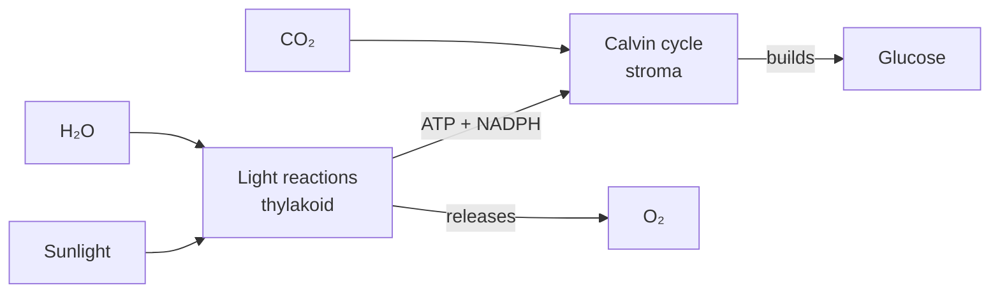

import Callout from '../../components/Callout.astro';
import KeyTerm from '../../components/KeyTerm.astro';
import Collapsible from '../../components/Collapsible.astro';
import Quiz from '../../components/Quiz.astro';
import Flashcards from '../../components/Flashcards.astro';

## Learning objectives

After this guide you'll be able to:

- Write the overall photosynthesis equation and explain what each term means
- Trace the path of an electron through the **light-dependent reactions**
- Explain the role of the **Calvin cycle** in fixing carbon
- Distinguish C₃, C₄, and CAM plants and why each evolved
- Predict what happens to a plant when light, CO₂, or temperature changes

## TL;DR

Plants use sunlight to split water in the **thylakoid membrane**, generating ATP and NADPH. Those energy carriers power the **Calvin cycle** in the stroma, which builds glucose from CO₂. Net equation:

$$
6\text{CO}_2 + 6\text{H}_2\text{O} \xrightarrow{\text{light}} \text{C}_6\text{H}_{12}\text{O}_6 + 6\text{O}_2
$$

## Glossary

- <KeyTerm term="Chloroplast">The organelle where photosynthesis occurs. Has an outer membrane, inner membrane, stroma, and stacked thylakoids called grana.</KeyTerm>
- <KeyTerm term="Thylakoid">A flattened membrane sac inside the chloroplast. Site of the light reactions.</KeyTerm>
- <KeyTerm term="Stroma">The fluid surrounding the thylakoids. Site of the Calvin cycle.</KeyTerm>
- <KeyTerm term="Photosystem">A protein complex containing chlorophyll. Absorbs photons and uses the energy to excite electrons.</KeyTerm>
- <KeyTerm term="NADPH">An electron carrier produced in the light reactions. Donates electrons to the Calvin cycle.</KeyTerm>
- <KeyTerm term="RuBisCO">The enzyme that fixes CO₂ in the Calvin cycle. The most abundant protein on Earth.</KeyTerm>

## Core concepts

### The big picture

Photosynthesis happens in two linked stages:

The light reactions **capture energy**. The Calvin cycle **uses that energy to build sugar**. Each stage feeds the other.

### Stage 1: The light-dependent reactions

These happen in the thylakoid membrane. The job: turn light into chemical energy (ATP and NADPH) and split water as a side effect (which releases O₂).

#### Path of an electron

1. **Photon hits Photosystem II (PSII).** A chlorophyll molecule absorbs the light and an electron jumps to a higher energy level.
2. **Electron is passed down the electron transport chain.** As it moves, the energy released is used to pump H⁺ into the thylakoid lumen.
3. **PSII replaces the lost electron by splitting water.** This releases O₂ as waste, the oxygen you're breathing right now.
4. **Electron arrives at Photosystem I (PSI).** Another photon re-energizes it.
5. **Final destination: NADP⁺ + H⁺ → NADPH.** The electron carrier is now loaded with energy.
6. **The H⁺ gradient powers ATP synthase**, which makes ATP via chemiosmosis.

<Callout type="insight" title="Key intuition">
The light reactions are basically a **photovoltaic + battery system**. Photons knock electrons loose; the cell uses their fall down the chain to (a) pump protons (storing energy as a gradient) and (b) load up NADPH (storing energy as electrons).
</Callout>

### Stage 2: The Calvin cycle

Now the Calvin cycle (in the stroma) takes the ATP and NADPH and uses them to convert CO₂ into glucose. Three phases:

1. **Carbon fixation.** RuBisCO attaches CO₂ to RuBP (a 5-carbon sugar), producing two molecules of 3-PGA.
2. **Reduction.** ATP and NADPH convert 3-PGA into G3P (a 3-carbon sugar). Some G3P leaves the cycle to build glucose.
3. **Regeneration.** Remaining G3P is rearranged (using more ATP) back into RuBP so the cycle can continue.

<Callout type="theorem" title="Stoichiometry to remember">
To make **one** glucose, the Calvin cycle must spin **six times** (fixing six CO₂), using **18 ATP** and **12 NADPH**.
</Callout>

### Plant types: C₃, C₄, and CAM

RuBisCO has a flaw: it sometimes grabs O₂ instead of CO₂, wasting energy (a process called **photorespiration**). Different plants evolved workarounds:

| Type | Strategy | Where it wins |
|------|----------|---------------|
| **C₃** | Standard Calvin cycle | Cool, wet climates (most plants like wheat, rice) |
| **C₄** | Pre-fixes CO₂ in mesophyll cells, concentrates it for RuBisCO | Hot, sunny climates (corn, sugarcane) |
| **CAM** | Opens stomata only at night to grab CO₂ | Arid climates (cacti, pineapple) |

## Worked example

**Question:** A plant is moved from bright sun into deep shade. The leaves still receive some light. What happens to its production of glucose, and why?

**Step-by-step:**

1. **Identify the limiting factor.** Light intensity drops dramatically.
2. **Trace the impact on Stage 1.** Fewer photons → fewer excited electrons → less ATP and NADPH produced.
3. **Trace the impact on Stage 2.** The Calvin cycle depends on ATP and NADPH from Stage 1. With less of both, it slows down.
4. **Predict the outcome.** Glucose production drops sharply. The plant may survive on stored sugars short-term but will eventually starve if shade persists.

**Answer:** Glucose production drops because the light reactions can't supply enough ATP/NADPH to keep the Calvin cycle running.

## Practice

<Collapsible question="Why does splitting water produce oxygen as a 'waste' product? Wouldn't evolution have found a use for it?">
For early photosynthetic organisms, O₂ was actually toxic, and the **Great Oxidation Event** (~2.4 billion years ago) caused mass extinctions of anaerobic life. Modern aerobic respiration evolved later as a way to *use* this "waste" by burning sugars with O₂. So in a sense, evolution did find a use, it just took a billion years and required a totally different metabolic pathway.
</Collapsible>

<Collapsible question="If RuBisCO is so inefficient, why is it still the dominant carbon-fixing enzyme?">
RuBisCO evolved before atmospheric O₂ was abundant. Once locked in, it's nearly impossible to replace, since it's central to every Calvin cycle in every plant. C₄ and CAM plants didn't replace it; they just built workarounds around it.
</Collapsible>

<Collapsible question="Why do C₄ plants outperform C₃ plants in hot weather but lose to them in cool weather?">
C₄'s carbon-concentrating mechanism costs extra ATP. In hot weather, RuBisCO would otherwise waste lots of energy on photorespiration, so the C₄ overhead pays off. In cool weather, photorespiration is minimal, so the extra ATP cost makes C₄ less efficient than plain C₃.
</Collapsible>

## Self-quiz

<Quiz
  questions={[
    {
      q: "Where do the light-dependent reactions take place?",
      choices: ["Stroma", "Thylakoid membrane", "Outer chloroplast membrane", "Cytoplasm"],
      answer: 1,
      explain: "The photosystems and electron transport chain are embedded in the thylakoid membrane."
    },
    {
      q: "What is the source of the O₂ released during photosynthesis?",
      choices: ["CO₂", "Glucose", "H₂O", "ATP"],
      answer: 2,
      explain: "Photosystem II splits water (H₂O) to replace lost electrons. O₂ is the byproduct of that splitting, and it does NOT come from CO₂."
    },
    {
      q: "How many CO₂ molecules must enter the Calvin cycle to make one glucose?",
      choices: ["1", "3", "6", "12"],
      answer: 2,
      explain: "Each turn fixes one CO₂. Glucose is C₆H₁₂O₆, six carbons, so six turns are needed."
    },
    {
      q: "Which adaptation helps C₄ plants thrive in hot, sunny climates?",
      choices: [
        "They use a different version of RuBisCO that prefers O₂",
        "They concentrate CO₂ near RuBisCO to suppress photorespiration",
        "They open stomata only at night",
        "They skip the Calvin cycle entirely"
      ],
      answer: 1,
      explain: "C₄ plants pre-fix CO₂ in mesophyll cells and shuttle it to bundle-sheath cells where RuBisCO works, keeping CO₂ high enough that O₂ rarely wins."
    },
    {
      q: "ATP synthase in the thylakoid is powered by what gradient?",
      choices: ["Sodium ions", "Calcium ions", "Hydrogen ions (H⁺)", "Electrons"],
      answer: 2,
      explain: "Pumping H⁺ into the thylakoid lumen creates a gradient. As H⁺ flows back through ATP synthase, it spins the enzyme and produces ATP, a process called chemiosmosis."
    }
  ]}
/>

## Flashcards

<Flashcards
  cards={[
    { front: "Net equation of photosynthesis", back: "6 CO₂ + 6 H₂O → C₆H₁₂O₆ + 6 O₂ (powered by light)" },
    { front: "Where do the light reactions occur?", back: "Thylakoid membrane of the chloroplast." },
    { front: "Where does the Calvin cycle occur?", back: "Stroma of the chloroplast." },
    { front: "Outputs of the light reactions", back: "ATP, NADPH, and O₂ (as a byproduct of splitting water)." },
    { front: "Three phases of the Calvin cycle", back: "Carbon fixation → Reduction → Regeneration of RuBP." },
    { front: "What does RuBisCO do?", back: "Catalyzes the attachment of CO₂ to RuBP, the carbon-fixation step." },
    { front: "Why is photorespiration a problem?", back: "RuBisCO sometimes binds O₂ instead of CO₂, wasting ATP and NADPH without producing sugar." },
    { front: "C₄ plants' adaptation", back: "Concentrate CO₂ in bundle-sheath cells to outcompete O₂ for RuBisCO." },
    { front: "CAM plants' adaptation", back: "Open stomata only at night to capture CO₂ when transpiration losses are lowest." },
    { front: "ATP per glucose in Calvin cycle", back: "18 ATP and 12 NADPH for one glucose (six full cycles)." }
  ]}
/>

## Mnemonics

- **"Light Loves Lumen"**, light reactions happen in the thylakoid; protons pile up in the lumen.
- **"Calvin Cooks Carbs"**, the Calvin cycle is where glucose is built.
- **"Fix, Reduce, Regenerate"**, the three Calvin phases in order.

## Common pitfalls

- **Saying CO₂ is the source of released O₂.** It's H₂O. This is a top-three exam trap.
- **Confusing the chloroplast compartments.** Thylakoid = light reactions. Stroma = Calvin cycle.
- **Forgetting that the Calvin cycle is light-*independent* but not light-*unrelated*.** It needs ATP and NADPH from the light reactions, so it stops in the dark.
- **Mixing up C₄ and CAM.** Both fight photorespiration but in different ways: C₄ separates by **space** (cell types), CAM separates by **time** (day vs night).

## Cheat sheet

| Concept | Key fact |
|---------|----------|
| Net equation | 6 CO₂ + 6 H₂O → C₆H₁₂O₆ + 6 O₂ |
| Light reactions location | Thylakoid membrane |
| Calvin cycle location | Stroma |
| Source of released O₂ | Water (H₂O), not CO₂ |
| Light reaction outputs | ATP, NADPH, O₂ |
| Calvin cycle inputs | CO₂, ATP, NADPH |
| Calvin cycle output | G3P → glucose |
| RuBisCO's job | Fix CO₂ to RuBP |
| Calvin turns per glucose | 6 |
| ATP per glucose | 18 |
| NADPH per glucose | 12 |
| C₃ vs C₄ vs CAM | Standard / space-separated / time-separated |
