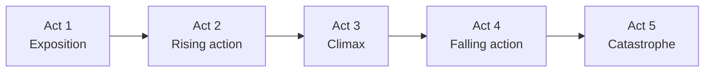

import Callout from '../../components/Callout.astro';
import KeyTerm from '../../components/KeyTerm.astro';
import Collapsible from '../../components/Collapsible.astro';
import Quiz from '../../components/Quiz.astro';
import Flashcards from '../../components/Flashcards.astro';
import VerticalTimeline from '../../components/VerticalTimeline.astro';
import NetworkGraph from '../../components/NetworkGraph.astro';
import MapView from '../../components/MapView.astro';
import VideoPlayer from '../../components/VideoPlayer.astro';
import NivoSankey from '../../components/NivoSankey.astro';
import NivoChord from '../../components/NivoChord.astro';
import RechartsBar from '../../components/RechartsBar.astro';
import RechartsLine from '../../components/RechartsLine.astro';
import DragMatch from '../../components/DragMatch.astro';
import Scrollytelling from '../../components/Scrollytelling.astro';
import Memorize from '../../components/Memorize.astro';

## Learning objectives

After this guide you will be able to:

- Reconstruct the **5-day plot** in order without notes
- Identify every major character, their **family alignment**, and their fate
- Explain the **four major themes** with supporting quotes
- Recognize and name the **eight literary devices** Shakespeare uses most
- Unpack ten of the play's most famous **quotes**, line by line
- **Recite** at least the first eight lines of Romeo's balcony soliloquy from memory
- Distinguish what is **Shakespeare's invention** from what he borrowed

## TL;DR

Two teenagers from feuding families in Renaissance Verona meet at a party, secretly marry the next day, and are dead within five days. The play is **less about love** than about how a generations-old grudge corrupts the institutions (family, church, state) supposed to protect young people. Net summary:

$$
\text{Feud} + \text{Impulsive love} + \text{One mistimed letter} = \text{Two suicides and reconciliation}
$$

<Callout type="theorem" title="The whole play in one sentence">
A teen romance that only ends in death because the adults around them won't stop fighting.
</Callout>

## Glossary

- <KeyTerm term="Verona">A real city in northern Italy. Shakespeare set the play there because Italy was, to his English audience, exotic and passionate.</KeyTerm>
- <KeyTerm term="Star-crossed">Doomed by fate. Romeo and Juliet are described in the Prologue as "star-crossed lovers", meaning the cosmos itself is against them.</KeyTerm>
- <KeyTerm term="Blank verse">Unrhymed iambic pentameter. The default speech of nobles in Shakespeare. Common folk often speak prose.</KeyTerm>
- <KeyTerm term="Iambic pentameter">A line of ten syllables alternating unstressed-STRESSED, repeated five times. "But SOFT, what LIGHT through YONder WINdow BREAKS."</KeyTerm>
- <KeyTerm term="Sonnet">A 14-line poem in iambic pentameter with a specific rhyme scheme. Shakespeare's prologue is a sonnet, and the lovers' first dialogue forms one too.</KeyTerm>
- <KeyTerm term="Foil">A character who exists primarily to highlight another by contrast. Mercutio's cynicism foils Romeo's idealism.</KeyTerm>
- <KeyTerm term="Oxymoron">Two contradictory words pushed together for effect. "Heavy lightness", "feather of lead", "loving hate". Shakespeare crams these into Romeo's love language.</KeyTerm>
- <KeyTerm term="Pun">A joke based on multiple meanings of a word. Mercutio's dying line: "ask for me tomorrow and you shall find me a grave man." Grave = serious, and grave = burial site.</KeyTerm>
- <KeyTerm term="Soliloquy">A character speaking their thoughts alone on stage. The audience hears their inner mind. Romeo's "But soft" is a soliloquy until Juliet appears.</KeyTerm>
- <KeyTerm term="Aside">A remark spoken to the audience that other characters on stage cannot hear. Different from a soliloquy because other people are present.</KeyTerm>
- <KeyTerm term="Dramatic irony">When the audience knows something the characters do not. We know Juliet isn't really dead. Romeo doesn't.</KeyTerm>
- <KeyTerm term="Foreshadowing">Hints early in the play about what will happen later. The Prologue literally tells you the ending in line 6.</KeyTerm>
- <KeyTerm term="Catastrophe">The final disaster of a tragedy. The deaths of the title characters and the reconciliation of the families.</KeyTerm>
- <KeyTerm term="Aubade">A poem about lovers parting at dawn. Act 3 Scene 5 ("Wilt thou be gone? It is not yet near day") is one of the most famous in English.</KeyTerm>
- <KeyTerm term="Friar">A member of a Catholic religious order, in this play Friar Lawrence. Functions as Romeo's confessor, mentor, and pharmacist.</KeyTerm>

## The 5-day timeline

Most students do not realize the entire play unfolds in **less than 100 hours**. From their first kiss to their joint suicide is barely 4 days.

<VerticalTimeline items={[
  { date: "Sunday morning", title: "Brawl in the marketplace", subtitle: "Act 1, Scene 1", body: "Capulet and Montague servants fight. Prince Escalus threatens death to the next person who disturbs the peace. Romeo is moping over Rosaline.", icon: "⚔" },
  { date: "Sunday evening", title: "The Capulet party", subtitle: "Act 1, Scene 5", body: "Romeo crashes the masquerade. He sees Juliet, forgets Rosaline instantly, and they kiss after speaking a perfect sonnet together. Tybalt spots him and is enraged.", icon: "🎭" },
  { date: "Sunday night", title: "The balcony scene", subtitle: "Act 2, Scene 2", body: "Romeo lingers in the orchard. Juliet appears at her window. They confess love and agree to marry the next day.", icon: "🌙" },
  { date: "Monday afternoon", title: "Secret marriage", subtitle: "Act 2, Scene 6", body: "Friar Lawrence marries them in his cell, hoping the union will reconcile the families.", icon: "💍" },
  { date: "Monday afternoon", title: "Mercutio dies, Romeo kills Tybalt", subtitle: "Act 3, Scene 1", body: "Tybalt picks a fight. Romeo refuses (he is now Tybalt's cousin). Mercutio fights instead and is killed. Romeo, enraged, kills Tybalt and is banished by the Prince.", icon: "⚔" },
  { date: "Monday night", title: "The wedding night and the dawn", subtitle: "Act 3, Scene 5", body: "Romeo and Juliet spend one night together. He flees to Mantua at dawn. Juliet's parents announce she will marry Paris on Thursday.", icon: "🌅" },
  { date: "Tuesday", title: "Friar Lawrence's plan", subtitle: "Act 4, Scene 1", body: "Juliet receives a sleeping potion that will fake her death for 42 hours. The Friar will write to Romeo so he can rescue her from the tomb when she wakes.", icon: "🧪" },
  { date: "Wednesday morning", title: "Juliet appears dead", subtitle: "Act 4, Scene 5", body: "Juliet drinks the potion. The Capulets find her, wail, and prepare the funeral.", icon: "💤" },
  { date: "Wednesday afternoon", title: "The letter is lost", subtitle: "Act 5, Scene 2", body: "Friar John (the messenger) is quarantined in a plague house and cannot deliver the Friar's letter to Romeo. Romeo's servant brings him the false news of Juliet's death instead.", icon: "✉" },
  { date: "Wednesday night", title: "Romeo buys poison", subtitle: "Act 5, Scene 1", body: "Romeo bribes a poor apothecary in Mantua for a fast-acting poison and rides to Verona.", icon: "☠" },
  { date: "Thursday before dawn", title: "The tomb", subtitle: "Act 5, Scene 3", body: "Romeo kills Paris at the tomb door, then drinks the poison beside Juliet's body. Juliet wakes minutes later, sees Romeo dead, and stabs herself. The families arrive, the truth comes out, and they reconcile.", icon: "🕯" }
]} />

<Callout type="warning" title="Common confusion">
The play does not span weeks. **Sunday → Thursday.** That compression is why every adult in the play is constantly behind events.
</Callout>

## The cast: who's who

<NetworkGraph
  layout="cose"
  nodes={[
    { id: 'Romeo', label: 'Romeo', color: '#b91c1c', size: 50 },
    { id: 'Juliet', label: 'Juliet', color: '#b91c1c', size: 50 },
    { id: 'Mercutio', label: 'Mercutio', color: '#7f1d1d', size: 36 },
    { id: 'Benvolio', label: 'Benvolio', color: '#7f1d1d', size: 32 },
    { id: 'Tybalt', label: 'Tybalt', color: '#dc2626', size: 36 },
    { id: 'Paris', label: 'Paris', color: '#dc2626', size: 32 },
    { id: 'Lord Montague', label: 'Lord Montague', color: '#7f1d1d', size: 30 },
    { id: 'Lady Montague', label: 'Lady Montague', color: '#7f1d1d', size: 26 },
    { id: 'Lord Capulet', label: 'Lord Capulet', color: '#dc2626', size: 32 },
    { id: 'Lady Capulet', label: 'Lady Capulet', color: '#dc2626', size: 28 },
    { id: 'Nurse', label: 'Nurse', color: '#52525b', size: 32 },
    { id: 'Friar Lawrence', label: 'Friar Lawrence', color: '#52525b', size: 36 },
    { id: 'Prince Escalus', label: 'Prince Escalus', color: '#27272a', size: 32 },
    { id: 'Apothecary', label: 'Apothecary', color: '#52525b', size: 22 },
    { id: 'Friar John', label: 'Friar John', color: '#52525b', size: 22 }
  ]}
  edges={[
    { source: 'Romeo', target: 'Juliet', label: 'married' },
    { source: 'Romeo', target: 'Mercutio', label: 'best friend' },
    { source: 'Romeo', target: 'Benvolio', label: 'cousin' },
    { source: 'Romeo', target: 'Lord Montague', label: 'son' },
    { source: 'Romeo', target: 'Lady Montague', label: 'son' },
    { source: 'Romeo', target: 'Friar Lawrence', label: 'confessor' },
    { source: 'Romeo', target: 'Tybalt', label: 'kills' },
    { source: 'Romeo', target: 'Paris', label: 'kills' },
    { source: 'Juliet', target: 'Lord Capulet', label: 'daughter' },
    { source: 'Juliet', target: 'Lady Capulet', label: 'daughter' },
    { source: 'Juliet', target: 'Tybalt', label: 'cousin' },
    { source: 'Juliet', target: 'Nurse', label: 'raised by' },
    { source: 'Juliet', target: 'Paris', label: 'engaged to' },
    { source: 'Juliet', target: 'Friar Lawrence', label: 'confessor' },
    { source: 'Tybalt', target: 'Mercutio', label: 'kills' },
    { source: 'Friar Lawrence', target: 'Friar John', label: 'sends letter' },
    { source: 'Romeo', target: 'Apothecary', label: 'buys poison' },
    { source: 'Prince Escalus', target: 'Mercutio', label: 'kinsman' },
    { source: 'Prince Escalus', target: 'Paris', label: 'kinsman' }
  ]}
/>

<Callout type="note" title="Color key">
**Red** = Capulets and their allies. **Dark red** = Montagues. **Gray** = neutrals (Friar, Nurse, Apothecary). **Black** = the Prince. Notice both houses lose people: the feud is symmetric in destruction.
</Callout>

## Verona, the real place

Verona was a real Italian city when Shakespeare wrote, and remains one of the most-visited literary destinations on Earth. The play's locations map to actual streets you can walk today.

<MapView
  title="Verona, Italy: the play's real locations"
  center={[45.4418, 10.998]}
  zoom={15}
  height="460px"
  markers={[
    { lat: 45.4429, lng: 10.9985, label: "Casa di Giulietta", popup: "Juliet's House: 14th century courtyard with the famous balcony", color: "#b91c1c" },
    { lat: 45.4438, lng: 11.0007, label: "Piazza delle Erbe", popup: "The marketplace where the Act 1 brawl breaks out", color: "#b91c1c" },
    { lat: 45.4396, lng: 10.9925, label: "Tomba di Giulietta", popup: "Juliet's tomb, inside a former Capuchin monastery", color: "#7f1d1d" },
    { lat: 45.4445, lng: 11.0036, label: "Casa di Romeo", popup: "A 13th century fortified house traditionally identified as Romeo's", color: "#7f1d1d" },
    { lat: 45.4391, lng: 10.9961, label: "San Fermo Maggiore", popup: "The medieval church associated with Romeo and Juliet's secret marriage", color: "#52525b" }
  ]}
/>

<Callout type="note" title="Did you know">
There was a real **Romeo Montecchi and Giulietta Cappelletti** in 14th-century Verona. Their story was first written down by Luigi da Porto in 1531, retold in English by Arthur Brooke in 1562, and Shakespeare used Brooke's poem as his direct source. The names are Italianized versions of historical Veronese family names.
</Callout>

## Plot structure: Freytag's pyramid

Every classical tragedy follows the same five-part shape. Romeo and Juliet maps cleanly to it, with one act per phase.

| Act | Phase | What happens |
|-----|-------|--------------|
| 1 | Exposition | Setting, feud, characters introduced. Romeo meets Juliet at the party. |
| 2 | Rising action | Balcony, secret marriage. Hope is at its peak. |
| 3 | **Climax** | Mercutio dies. Romeo kills Tybalt. **Banishment.** Everything turns. |
| 4 | Falling action | The Friar's plan. Juliet drinks the potion. The plan starts to slip. |
| 5 | Catastrophe | Failed letter. Tomb scene. Both lovers dead. Families reconcile. |

## The death cascade

Trace each death back to its trigger and you can see the whole tragedy as a chain reaction. This Sankey diagram shows how one event causes the next.

<NivoSankey
  height={560}
  data={{
    nodes: [
      { id: 'Feud' },
      { id: 'Tybalt rage' },
      { id: 'Mercutio dies' },
      { id: 'Tybalt dies' },
      { id: 'Banishment' },
      { id: 'Friar plan' },
      { id: 'Letter lost' },
      { id: 'Paris dies' },
      { id: 'Romeo dies' },
      { id: 'Juliet dies' },
      { id: 'Reconciled' }
    ],
    links: [
      { source: 'Feud', target: 'Tybalt rage', value: 30 },
      { source: 'Tybalt rage', target: 'Mercutio dies', value: 30 },
      { source: 'Mercutio dies', target: 'Tybalt dies', value: 30 },
      { source: 'Tybalt dies', target: 'Banishment', value: 30 },
      { source: 'Banishment', target: 'Friar plan', value: 30 },
      { source: 'Friar plan', target: 'Letter lost', value: 25 },
      { source: 'Friar plan', target: 'Paris dies', value: 5 },
      { source: 'Letter lost', target: 'Romeo dies', value: 25 },
      { source: 'Romeo dies', target: 'Juliet dies', value: 25 },
      { source: 'Juliet dies', target: 'Reconciled', value: 25 },
      { source: 'Paris dies', target: 'Reconciled', value: 5 }
    ]
  }}
/>

<Callout type="insight" title="Why this matters">
Every death in the play is a downstream consequence of the **feud**, not of love. If the houses had not been at war, the marriage would have reconciled them and the rest of the play would never have happened.
</Callout>

## Themes: the big four

### 1. Love (and its many forms)

The play presents at least **five kinds of love**, often in the same scene:

- **Courtly love:** Romeo's mooning over Rosaline. Performative, idealized, suffering-as-status.
- **Romantic love:** Romeo and Juliet after they meet. Sudden, mutual, transformative.
- **Sexual love:** the Nurse's bawdy humor; Mercutio's puns; the wedding night.
- **Parental love:** distorted by patriarchy. Lord Capulet calls Juliet "my child" then threatens to disown her two scenes later.
- **Friendly love:** Romeo and Mercutio; Juliet and the Nurse. These are the play's emotional ballast.

<Callout type="insight" title="Test trap">
"Romeo and Juliet are in love" is true but reductive. AP graders want you to say *which kind* and *why it matters in the scene you are analyzing.*
</Callout>

### 2. Fate vs. free will

The Prologue calls them "**star-crossed**". Romeo cries "**I am fortune's fool!**" Juliet asks her balcony, "**O Romeo, Romeo, wherefore art thou Romeo?**" The play insists fate is in charge.

But every disaster also has a clear human cause. The feud is human. Tybalt's pride is human. The Friar's risky plan is human. Romeo's impulsivity is human. Shakespeare gives you both readings simultaneously and refuses to resolve them.

### 3. Violence and honor (toxic masculinity, before the term existed)

Look at how often men in this play threaten to fight to **defend their masculinity**:

- The opening scene: servants brawl over thumb-biting
- Tybalt cannot let Romeo's party-crashing slide
- Mercutio cannot let Tybalt insult Romeo go unanswered
- Romeo cannot live with Mercutio's death unavenged

Each of these decisions kills someone. The play is brutally clear: **honor culture is what murders these characters.**

### 4. Youth vs. age

Almost every adult in the play (Friar, Nurse, parents, Prince) tries to manage the lovers and fails. Their advice is sensible but slow; the lovers are reckless but sincere. The play does not take a side: both ages are responsible for the catastrophe.

<Callout type="tip" title="Mnemonic for the four themes">
**LFVY** ("LIFE-V-Y") - **L**ove, **F**ate, **V**iolence, **Y**outh-vs-age.
</Callout>

## The shared sonnet (Act 1, Sc 5)

The very first words Romeo and Juliet say to each other are a **complete Shakespearean sonnet** built from their alternating lines. This is one of the most virtuosic moves in all of theater: the lovers literally finish each other's poetry.

> **ROMEO:** If I profane with my unworthiest hand
> This holy shrine, the gentle sin is this:
> My lips, two blushing pilgrims, ready stand
> To smooth that rough touch with a tender kiss.
>
> **JULIET:** Good pilgrim, you do wrong your hand too much,
> Which mannerly devotion shows in this;
> For saints have hands that pilgrims' hands do touch,
> And palm to palm is holy palmers' kiss.
>
> **ROMEO:** Have not saints lips, and holy palmers too?
>
> **JULIET:** Ay, pilgrim, lips that they must use in prayer.
>
> **ROMEO:** O, then, dear saint, let lips do what hands do;
> They pray, grant thou, lest faith turn to despair.
>
> **JULIET:** Saints do not move, though grant for prayers' sake.
>
> **ROMEO:** Then move not, while my prayer's effect I take. *[Kisses her]*

Rhyme scheme: **ABAB CDCD EFEF GG** (the Shakespearean sonnet form). The shared metaphor is **pilgrim → saint → prayer**: Romeo casts himself as a religious pilgrim seeking the sacred, and Juliet plays along until the kiss "answers" his prayer. The first kiss in literary history that arrives at the end of a perfect 14-line poem.

## Iambic pentameter, hands-on

Every Shakespearean line has a beat. Iambic pentameter is **five iambs** in a row: ten syllables alternating *unstressed-STRESSED*.

Try clapping the rhythm of Romeo's most famous line:

> But **SOFT,** what **LIGHT** through **YON**-der **WIN**-dow **BREAKS**?
>
> da-**DUM** da-**DUM** da-**DUM** da-**DUM** da-**DUM**

When Shakespeare **breaks** the meter, it almost always means something. A line with a missing or extra beat is often a moment of high emotion, interruption, or character revealing themselves.

<Callout type="tip" title="Reading trick">
When you hit a Shakespeare line that feels stiff, count syllables. If it's exactly 10 alternating, you can usually trust the natural stress to land where it should. If it's 9 or 11, the irregularity is a clue, look at the scene context.
</Callout>

## The balcony scene

This is the most famous scene in English drama. Watch a production once, then we'll memorize it.

### Watch the balcony scene

A full performance of the balcony scene. Watch it once before the close-reading and memorization sections below.

<VideoPlayer url="https://www.youtube.com/watch?v=1HbvBVhpChI" />

<Callout type="tip" title="Watch the balcony scene in three different productions">
Each link opens a fresh YouTube search so you always get a working clip (specific uploads come and go).

- **Franco Zeffirelli, 1968** (the classic, period-accurate, the version most schools show): [open on YouTube](https://www.youtube.com/results?search_query=zeffirelli+1968+romeo+juliet+balcony+scene)
- **Baz Luhrmann, 1996** (modern Verona Beach, swimming pool, same text): [open on YouTube](https://www.youtube.com/results?search_query=luhrmann+romeo+juliet+balcony+scene+1996)
- **George Cukor, 1936** (the first major sound film of the play): [open on YouTube](https://www.youtube.com/results?search_query=cukor+1936+romeo+juliet+balcony+scene)

Compare how each director handles the same lines: a stone balcony, a swimming pool, a black-and-white window. The text never changes; the staging always does.
</Callout>

### Scrolling the whole balcony scene

The graphic above stays pinned while you scroll through 13 annotated cards. Each card highlights a key line from the assigned passage and explains the device or image it uses. The stage automatically switches sections (Part 1 to Part 5) as you reach each new chunk.

<Scrollytelling
  graphicHeight="55vh"
  graphic={`

  
Part 1, Romeo

  

  <svg id='balcony-moon' style='position: absolute; top: 16px; right: 20px; width: 48px; height: 48px; transition: opacity 800ms, filter 800ms; filter: drop-shadow(0 0 14px rgba(255,255,200,0.4));' viewBox='0 0 64 64'>
    <defs><radialGradient id='moonGrad' cx='35%' cy='35%'><stop offset='0%' stop-color='#fef9c3'/><stop offset='100%' stop-color='#facc15'/></radialGradient></defs>
    <circle cx='32' cy='32' r='22' fill='url(#moonGrad)' opacity='0.85'/>
    <circle cx='40' cy='28' r='3' fill='#a16207' opacity='0.3'/>
    <circle cx='28' cy='38' r='2' fill='#a16207' opacity='0.3'/>
  </svg>

  

    

      
But soft, what light through yonder window breaks?

      
It is the East, and Juliet is the sun.

      
Arise, fair sun, and kill the envious moon,

      
Who is already sick and pale with grief

      
That thou, her maid, art far more fair than she.

      
Be not her maid since she is envious.

      
Her vestal livery is but sick and green

      
And none but fools do wear it. Cast it off.

    

  

  

    

      
It is my lady. O, it is my love!

      
O, that she knew she were!

      
She speaks, yet she says nothing. What of that?

      
Her eye discourses; I will answer it.

      
I am too bold. 'Tis not to me she speaks.

      
Two of the fairest stars in all the heaven,

      
Having some business, do entreat her eyes

      
To twinkle in their spheres till they return.

      
What if her eyes were there, they in her head?

      
The brightness of her cheek would shame those stars

      
As daylight doth a lamp; her eye in heaven

      
Would through the airy region stream so bright

      
That birds would sing and think it were not night.

      
See how she leans her cheek upon her hand.

      
O, that I were a glove upon that hand,

      
That I might touch that cheek!

    

  

  

    

      
O, speak again, bright angel, for thou art

      
As glorious to this night, being o'er my head,

      
As is a wingèd messenger of heaven

      
Unto the white-upturnèd wond'ring eyes

      
Of mortals that fall back to gaze on him

      
When he bestrides the lazy puffing clouds

      
And sails upon the bosom of the air.

    

  

  

    

      
O Romeo, Romeo, wherefore art thou Romeo?

      
Deny thy father and refuse thy name,

      
Or, if thou wilt not, be but sworn my love,

      
And I'll no longer be a Capulet.

    

  

  

    

      
'Tis but thy name that is my enemy.

      
Thou art thyself, though not a Montague.

      
What's Montague? It is nor hand, nor foot,

      
Nor arm, nor face. O, be some other name

      
Belonging to a man.

      
What's in a name? That which we call a rose

      
By any other word would smell as sweet.

      
So Romeo would, were he not Romeo called,

      
Retain that dear perfection which he owes

      
Without that title. Romeo, doff thy name,

      
And, for thy name, which is no part of thee,

      
Take all myself.

    

  

  

`}
  steps={[
    { id: 'soft',     body: '<h3>"But, soft!"</h3>
The line opens with a beat-break: <em>BUT</em>, <em>SOFT</em>, two stressed syllables back-to-back. Shakespeare uses this when a character is suddenly arrested by what they see. Romeo is mid-thought when Juliet appears at the window.
' },
    { id: 'sun',      body: '<h3>"Juliet is the sun."</h3>
Romeo crowns Juliet a heavenly body. This single metaphor sets up the entire light-vs-dark imagery system that runs through the rest of the play. Juliet is light; the night and the moon are her enemies.
' },
    { id: 'moon',     body: '<h3>The envious moon</h3>
The moon is the goddess Diana, who represents virginity. Romeo wants Juliet to "kill" it, meaning give up her chaste status. This is a young man\'s seduction speech dressed up as cosmology.
' },
    { id: 'vestal',   body: '<h3>"Vestal livery"</h3>
"Vestal" refers to the Vestal Virgins of Rome who tended a sacred fire. "Livery" is a uniform. Romeo is asking Juliet to take off her virginity like a costume. The Elizabethan audience would have caught the bawdy second meaning instantly.
' },
    { id: 'lady',     body: '<h3>"It is my lady."</h3>
Romeo finally lets himself say it. Up to now he\'s used metaphor (sun, moon, stars) to keep distance. The plain four words "It is my lady" mark the moment he commits emotionally.
' },
    { id: 'stars',    body: '<h3>Eyes as stars</h3>
Romeo invents an entire conceit: two stars have business elsewhere and ask Juliet\'s eyes to fill in for them. He then argues her eyes would shine SO bright that birds would sing thinking it was day. Hyperbole stacked on hyperbole.
' },
    { id: 'glove',    body: '<h3>"O, that I were a glove upon that hand"</h3>
The famous line. Romeo wishes to be the most intimate ordinary object: a glove she\'d wear, so he could touch her cheek. The wish is at once tender and surprisingly carnal.
' },
    { id: 'angel',    body: '<h3>"Bright angel"</h3>
After Juliet sighs ("Ay me"), Romeo answers her aloud. He shifts from cosmic imagery (sun, stars) to <em>religious</em> imagery (angel, messenger of heaven). Juliet is now both the heavens and the divine.
' },
    { id: 'winged',   body: '<h3>The winged messenger</h3>
The reference is to Gabriel or another angel. Romeo describes mortals tilting their heads back to gaze at the angel as he sails on clouds. He\'s comparing Juliet on her balcony to a divine apparition over a crowd of upturned faces.
' },
    { id: 'wherefore',body: '<h3>"Wherefore art thou Romeo?"</h3>
The most-misquoted line in English. <em>Wherefore</em> means <em>why</em>, not <em>where</em>. Juliet, still believing she is alone, is asking the universe why he has to be a Montague. The pain is in the name, not in his location.
' },
    { id: 'capulet',  body: '<h3>"I\'ll no longer be a Capulet."</h3>
Juliet offers, alone in her room, to give up her own family for him. This is a 13-year-old making the largest possible offer her culture allows. The play tracks how the adults around her fail to honor that offer.
' },
    { id: 'rose',     body: '<h3>"That which we call a rose..."</h3>
The defining line of the speech and one of the most quoted in all literature. Juliet argues that <em>names are arbitrary</em>. The flower would smell the same with any label; Romeo is the same person regardless of being a Montague.
' },
    { id: 'doff',     body: '<h3>"Doff thy name, take all myself"</h3>
"Doff" means take off, like a hat. Juliet asks Romeo to shed his last name and, in exchange, she will give him every part of herself. The moment her speech ends, Romeo steps out of the dark and accepts the bargain.
' }
  ]}
  onStep={`(stepId) => {
    const stage = document.getElementById('balcony-text');
    if (!stage) return;
    const map = {
      soft:      { section: 1, line: 1, label: "Part 1, Romeo" },
      sun:       { section: 1, line: 2, label: "Part 1, Romeo" },
      moon:      { section: 1, line: 3, label: "Part 1, Romeo" },
      vestal:    { section: 1, line: 7, label: "Part 1, Romeo" },
      lady:      { section: 2, line: 1, label: "Part 2, Romeo" },
      stars:     { section: 2, line: 6, label: "Part 2, Romeo" },
      glove:     { section: 2, line: 15, label: "Part 2, Romeo" },
      angel:     { section: 3, line: 1, label: "Part 3, Romeo" },
      winged:    { section: 3, line: 3, label: "Part 3, Romeo" },
      wherefore: { section: 4, line: 1, label: "Part 4, Juliet" },
      capulet:   { section: 4, line: 4, label: "Part 4, Juliet" },
      rose:      { section: 5, line: 6, label: "Part 5, Juliet" },
      doff:      { section: 5, line: 11, label: "Part 5, Juliet" }
    };
    const t = map[stepId];
    if (!t) return;
    // Cross-fade sections: active fades in & slides up, others fade out & slide down.
    stage.querySelectorAll('.bg-section').forEach((s) => {
      const isActive = Number(s.getAttribute('data-section')) === t.section;
      s.style.opacity = isActive ? '1' : '0';
      s.style.transform = isActive ? 'translateY(0)' : 'translateY(8px)';
      s.style.pointerEvents = isActive ? 'auto' : 'none';
    });
    // Highlight the active line within the active section.
    stage.querySelectorAll('[data-line]').forEach((l) => {
      if (Number(l.getAttribute('data-section')) !== t.section) return;
      l.style.opacity = Number(l.getAttribute('data-line')) <= t.line ? '1' : '0.25';
    });
    // Smooth label cross-fade.
    const label = stage.querySelector('[data-section="label"]');
    if (label && label.textContent !== t.label) {
      label.style.transition = 'opacity 200ms ease';
      label.style.opacity = '0';
      setTimeout(() => { label.textContent = t.label; label.style.opacity = '1'; }, 200);
    }
    // Moon fades / desaturates when Romeo invokes its death (Part 1, line 3+).
    const moon = document.getElementById('balcony-moon');
    if (moon) {
      if (t.section === 1 && t.line >= 3) {
        moon.style.opacity = '0.4';
        moon.style.filter = 'drop-shadow(0 0 8px rgba(120,113,108,0.3)) grayscale(0.7)';
      } else {
        moon.style.opacity = '1';
        moon.style.filter = 'drop-shadow(0 0 14px rgba(255,255,200,0.4))';
      }
    }
  }`}
/>

## Memorize the balcony scene

The teacher-assigned passage covers Act 2 Scene 2, lines 1–52. It's broken into five chunks below in dramatic order. Memorize them one at a time. Each card has its own progress saved on this device.

<Callout type="tip" title="How to use each card">
1. **Read** mode three times out loud, slowly, with feeling.
2. **Cloze** mode: fill in the blanks aloud. Click any blank to peek.
3. **First letter** mode: only initials remain. Speak the full line.
4. **Cold recall** mode: reveal one line at a time. If you said the next line right before clicking, you've got it.
</Callout>

### Part 1: Romeo, "But soft" (lines 2-9)

Romeo, hidden in the orchard, sees a light come on in Juliet's window.

<Memorize
  title="Romeo discovers Juliet"
  attribution="Act 2, Scene 2, lines 2-9"
  text={`But soft, what light through yonder window breaks?
It is the East, and Juliet is the sun.
Arise, fair sun, and kill the envious moon,
Who is already sick and pale with grief
That thou, her maid, art far more fair than she.
Be not her maid since she is envious.
Her vestal livery is but sick and green,
And none but fools do wear it. Cast it off.`}
/>

### Part 2: Romeo, "It is my lady" (lines 10-26)

Juliet steps onto the balcony but doesn't speak. Romeo unfolds an extended metaphor of her eyes outshining the stars and ends wishing he were the glove on her hand.

<Memorize
  title="Romeo wishes to be a glove"
  attribution="Act 2, Scene 2, lines 10-26"
  text={`It is my lady. O, it is my love!
O, that she knew she were!
She speaks, yet she says nothing. What of that?
Her eye discourses; I will answer it.
I am too bold. 'Tis not to me she speaks.
Two of the fairest stars in all the heaven,
Having some business, do entreat her eyes
To twinkle in their spheres till they return.
What if her eyes were there, they in her head?
The brightness of her cheek would shame those stars
As daylight doth a lamp; her eye in heaven
Would through the airy region stream so bright
That birds would sing and think it were not night.
See how she leans her cheek upon her hand.
O, that I were a glove upon that hand,
That I might touch that cheek!`}
/>

### Part 3: Romeo, "Bright angel" (lines 28-35)

Juliet sighs ("Ay me"). Romeo, still hidden, answers her aloud.

<Memorize
  title="Romeo answers the bright angel"
  attribution="Act 2, Scene 2, lines 28-35"
  text={`O, speak again, bright angel, for thou art
As glorious to this night, being o'er my head,
As is a wingèd messenger of heaven
Unto the white-upturnèd wond'ring eyes
Of mortals that fall back to gaze on him
When he bestrides the lazy puffing clouds
And sails upon the bosom of the air.`}
/>

### Part 4: Juliet, "Wherefore art thou Romeo?" (lines 36-39)

Juliet, still believing she is alone, speaks the most-misquoted line in English. "Wherefore" means **why**, not **where**.

<Memorize
  title="Juliet on Romeo's name"
  attribution="Act 2, Scene 2, lines 36-39"
  text={`O Romeo, Romeo, wherefore art thou Romeo?
Deny thy father and refuse thy name,
Or, if thou wilt not, be but sworn my love,
And I'll no longer be a Capulet.`}
/>

### Part 5: Juliet, "What's in a name" (lines 41-52)

Juliet keeps musing on the absurdity of names dictating love. The "rose" line is one of the most famous in all of Shakespeare.

<Memorize
  title="What's in a name?"
  attribution="Act 2, Scene 2, lines 41-52"
  text={`'Tis but thy name that is my enemy.
Thou art thyself, though not a Montague.
What's Montague? It is nor hand, nor foot,
Nor arm, nor face. O, be some other name
Belonging to a man.
What's in a name? That which we call a rose
By any other word would smell as sweet.
So Romeo would, were he not Romeo called,
Retain that dear perfection which he owes
Without that title. Romeo, doff thy name,
And, for thy name, which is no part of thee,
Take all myself.`}
/>

<Callout type="insight" title="Order of memorization, recommended">
Learn parts in this order: **1 → 4 → 5 → 2 → 3.** Parts 1, 4, and 5 are the most-quoted (and easiest to anchor in memory because you've heard them before). Save the longer middle passages for when the bookends are solid.
</Callout>

### Hear it spoken

<Callout type="tip" title="Listen to a full reading">
Free public-domain readings of the full balcony scene are available on LibriVox. Try [LibriVox's Romeo and Juliet collection](https://librivox.org/search?title=romeo+and+juliet&author=Shakespeare) for several full-cast versions, then read along with each Memorize card above.
</Callout>

## Famous quotes unpacked

Ten quotes every English student should be able to identify, attribute, and analyze.

<Collapsible question={`1. "From forth the fatal loins of these two foes / A pair of star-crossed lovers take their life." - The Chorus, Prologue`}>
**Where:** the opening Prologue, before the play begins.
**Meaning:** the Chorus tells the audience the ending in the first 14 lines. The lovers are doomed by **fate** ("star-crossed") and the **feud** ("fatal loins of these two foes"). The play is not a mystery, it is an inevitability.
**Device:** **dramatic irony** built into the structure. The audience knows; the characters do not.
**Why it matters:** Shakespeare is telling you that *how* this happens, not *what* happens, is the point.
</Collapsible>

<Collapsible question={`2. "O Romeo, Romeo, wherefore art thou Romeo?" - Juliet, Act 2, Scene 2`}>
**Where:** the balcony, alone, before she knows Romeo is below.
**Meaning:** "wherefore" means **why**, not **where**. She is asking *why* he has to be a Montague. She wishes he could **shed his name** so the feud would not stand between them.
**Device:** **soliloquy**, plus a meditation on **identity vs. label** ("a rose by any other name would smell as sweet").
**Why it matters:** the most-misquoted line in English. She is not searching for him, she is asking the universe why love and family have to be enemies.
</Collapsible>

<Collapsible question={`3. "These violent delights have violent ends." - Friar Lawrence, Act 2, Scene 6`}>
**Where:** moments before he marries them in his cell.
**Meaning:** sudden, intense pleasures burn themselves out fast. The Friar is begging Romeo to **slow down**.
**Device:** **antithesis** (delight/end), **alliteration** (violent... violent), and brutal **foreshadowing**.
**Why it matters:** the Friar **predicts the catastrophe** in the same scene he enables it. The play is full of these self-aware adults who do the wrong thing anyway.
</Collapsible>

<Collapsible question={`4. "A plague o' both your houses!" - Mercutio, Act 3, Scene 1`}>
**Where:** dying from Tybalt's stab wound.
**Meaning:** Mercutio is **neither a Capulet nor a Montague**. He is the Prince's kinsman. Both houses pulled him into a fight that was not his, and he curses them with his last breath.
**Device:** a literal **curse**, and dramatic irony, the curse comes true. The plague then delays Friar John's letter in Act 5, killing the lovers.
**Why it matters:** Shakespeare sets up the cause of every later death in this one line. The curse is the play's mechanism.
</Collapsible>

<Collapsible question={`5. "I am fortune's fool!" - Romeo, Act 3, Scene 1`}>
**Where:** standing over Tybalt's body, having just realized what he has done.
**Meaning:** he is the plaything of fate. The same fortune that gave him Juliet now ruins him.
**Device:** **personification** of fortune, plus a callback to the Prologue's "star-crossed" framing.
**Why it matters:** Romeo finally adopts the **fate reading** of his own life. After this line, he stops trying to choose and starts being chosen.
</Collapsible>

<Collapsible question={`6. "Wilt thou be gone? It is not yet near day." - Juliet, Act 3, Scene 5`}>
**Where:** dawn after their wedding night. Romeo must flee for Mantua.
**Meaning:** she is begging him to stay, insisting the **lark** they hear is actually the **nightingale** so it cannot be morning yet.
**Device:** an **aubade**, the dawn-parting poem. Shakespeare inverts the convention: usually the woman urges the man to leave before her husband wakes. Here she urges him to stay even though staying means death.
**Why it matters:** their **last conversation alive together**. Every word lands harder when you remember that.
</Collapsible>

<Collapsible question={`7. "Tempt not a desperate man." - Romeo, Act 5, Scene 3`}>
**Where:** at the tomb, to Paris, who is trying to arrest him.
**Meaning:** literal warning: I have nothing to lose, do not push me. Romeo wants Paris gone so he can die beside Juliet without committing another murder.
**Device:** **dramatic irony**, Paris does not know Juliet is "dead" because of Romeo. **Foreshadowing**, "desperate" comes from Latin *desperare*, "to lose hope." Romeo names his own state.
**Why it matters:** Romeo, the courtly lover of Act 1, has become a killer. The play tracks his moral decline in three sentences.
</Collapsible>

<Collapsible question={`8. "Eyes, look your last! / Arms, take your last embrace! and, lips, O you / The doors of breath, seal with a righteous kiss / A dateless bargain to engrossing death!" - Romeo, Act 5, Scene 3`}>
**Where:** kneeling beside Juliet's body, about to drink the poison.
**Meaning:** he addresses his own body parts in farewell. He is treating his suicide as a **legal contract** ("dateless bargain") with **death** itself.
**Device:** **apostrophe** (talking to absent things), **personification** of death, **financial metaphor** ("bargain", "engrossing").
**Why it matters:** Romeo has been speaking the language of religion (pilgrim, saint, shrine) since Act 1. Here he switches to the language of contracts. Love has become a deal he cannot escape.
</Collapsible>

<Collapsible question={`9. "Yea, noise? then I'll be brief. O happy dagger! / This is thy sheath; there rust, and let me die." - Juliet, Act 5, Scene 3`}>
**Where:** waking in the tomb, finding Romeo dead, hearing the Watchmen approach.
**Meaning:** she has seconds. She seizes Romeo's dagger and stabs herself, calling the dagger "happy" (lucky) because it lets her join him.
**Device:** **oxymoron** ("happy dagger"), **sexual undertone** ("sheath" was Elizabethan slang for the female body). Her death is framed as a kind of consummation.
**Why it matters:** Juliet's suicide is **active**, not passive. She makes a choice. Romeo dies passively poisoned; Juliet dies fighting to be with him.
</Collapsible>

<Collapsible question={`10. "For never was a story of more woe / Than this of Juliet and her Romeo." - Prince Escalus, Act 5, Scene 3`}>
**Where:** the closing couplet of the play.
**Meaning:** the Prince closes the play with a rhyming **heroic couplet** that frames the story as the saddest ever told. He puts **Juliet's name first**, an ordering reversal of the title that gives her the final emphasis.
**Device:** **heroic couplet** (closing the play in formal verse), **superlative** ("more woe"), **inversion** of the play's title.
**Why it matters:** the final word is **Romeo's** but the structure of the line gives Juliet the emotional weight. Shakespeare quietly tilts the play's title in her favor at the very end.
</Collapsible>

## Literary devices catalog

| Device | Where it appears | Why Shakespeare uses it |
|--------|-------------------|--------------------------|
| **Foreshadowing** | The Prologue announces the deaths in line 6 | Frees the audience from suspense so they focus on *how* fate unfolds |
| **Dramatic irony** | We know Juliet faked her death; Romeo doesn't | Maximum tragic tension in the tomb scene |
| **Oxymoron** | Romeo's "loving hate, heavy lightness" | Marks immature, performative love |
| **Pun** | Mercutio's "ask for me tomorrow and you shall find me a grave man" | Masks pain with wit, Mercutio's signature |
| **Soliloquy** | Romeo's "But soft" speech | Lets the audience inside a private mind |
| **Aside** | Lord Capulet's threats during the Paris negotiation | Shows what characters hide from each other |
| **Aubade** | The lark/nightingale debate, Act 3 Sc 5 | Compresses an entire genre into a parting scene |
| **Antithesis** | "These violent delights have violent ends" | Frames the play's central paradox: love and death together |

## Character speaking time

A few stats that surprise most students. Counting lines:

<RechartsBar
  data={[
    { character: 'Romeo', lines: 618 },
    { character: 'Juliet', lines: 541 },
    { character: 'Friar Lawrence', lines: 363 },
    { character: 'Nurse', lines: 336 },
    { character: 'Mercutio', lines: 296 },
    { character: 'Lord Capulet', lines: 263 },
    { character: 'Benvolio', lines: 154 },
    { character: 'Lady Capulet', lines: 116 },
    { character: 'Tybalt', lines: 36 }
  ]}
  xKey="character"
  bars={[{ dataKey: 'lines', name: 'Spoken lines' }]}
/>

<Callout type="insight" title="Surprises in the data">
- **Romeo speaks more than Juliet** (618 vs 541), partly because Juliet is hidden offstage during banishment.
- **The Friar is the third-largest role.** He shapes more events than any other character.
- **Tybalt has only 36 lines** despite being the play's central antagonist. Shakespeare achieves Tybalt's menace with very few words.
</Callout>

## Character relationships at a glance

This chord diagram shows who interacts with whom most. Larger arcs = more shared scene time.

<NivoChord
  keys={['Romeo', 'Juliet', 'Friar', 'Nurse', 'Mercutio', 'Tybalt', 'Capulet']}
  matrix={[
    [0, 18, 8, 1, 7, 2, 0],
    [18, 0, 6, 14, 0, 1, 8],
    [8, 6, 0, 1, 0, 0, 1],
    [1, 14, 1, 0, 1, 0, 5],
    [7, 0, 0, 1, 0, 3, 0],
    [2, 1, 0, 0, 3, 0, 4],
    [0, 8, 1, 5, 0, 4, 0]
  ]}
/>

## Tension over the 5 days

Plot tension is not flat. It builds, peaks at the climax (Mercutio's death), then surges again at the catastrophe.

<RechartsLine
  data={[
    { act: 'Act 1', tension: 30 },
    { act: 'Act 2', tension: 50 },
    { act: 'Act 3', tension: 95 },
    { act: 'Act 4', tension: 70 },
    { act: 'Act 5', tension: 100 }
  ]}
  xKey="act"
  lines={[{ dataKey: 'tension', name: 'Dramatic tension' }]}
/>

<Callout type="note" title="Why two peaks">
A **classical tragedy** has its true climax in Act 3, when the protagonist makes the irreversible choice. The Act 5 spike is the **catastrophe**, the working-out of the choice. Romeo's life pivots when he kills Tybalt, not when he drinks poison.
</Callout>

## Practice: drag-to-match

### Match the character to their defining action

<DragMatch
  pairs={[
    { left: 'Tybalt', right: 'Kills Mercutio in a duel' },
    { left: 'Friar Lawrence', right: 'Marries Romeo and Juliet, then plans the fake death' },
    { left: 'The Nurse', right: 'Carries messages between the lovers' },
    { left: 'Mercutio', right: 'Dies cursing both houses' },
    { left: 'Paris', right: 'The man Juliet is supposed to marry' },
    { left: 'Prince Escalus', right: 'Banishes Romeo and announces the moral at the end' }
  ]}
/>

### Match the theme to its quote

<DragMatch
  pairs={[
    { left: 'Fate', right: '"I am fortune\'s fool!"' },
    { left: 'Love (sudden)', right: '"Juliet is the sun"' },
    { left: 'Violence and curse', right: '"A plague o\' both your houses!"' },
    { left: 'Foreshadowing', right: '"These violent delights have violent ends"' }
  ]}
/>

### Match the device to its example

<DragMatch
  pairs={[
    { left: 'Oxymoron', right: '"Loving hate, heavy lightness"' },
    { left: 'Pun', right: '"Ask for me tomorrow, you shall find me a grave man"' },
    { left: 'Soliloquy', right: 'Romeo\'s "But soft" speech alone in the orchard' },
    { left: 'Dramatic irony', right: 'Romeo believing Juliet is dead in the tomb' }
  ]}
/>

## Practice: collapsible Q&A

<Collapsible question="Who is more responsible for the deaths: the lovers, the parents, or the Friar?">
The play deliberately spreads blame. **The lovers** are reckless; **the parents** maintain a feud and force Juliet's marriage to Paris; **the Friar** improvises a plan that depends on a single letter arriving on time. Shakespeare's answer is "all of them, plus chance." A good essay argues for primary responsibility while acknowledging the others.
</Collapsible>

<Collapsible question="Why did Shakespeare set the play in Italy?">
Three reasons. (1) His direct **source** (Brooke's poem) was set there. (2) For Elizabethan audiences, **Italy meant passion, vendetta, and Catholic mystery**, the perfect setting for an extreme love story. (3) Italy was politically far enough from England that Shakespeare could explore violent themes without seeming to comment on his own monarchy.
</Collapsible>

<Collapsible question="Is Romeo and Juliet a love story or a tragedy?">
Both. The play is a **tragedy** structurally (5 acts, classical pyramid, ends in death and reconciliation) and a **love story** emotionally. Reading it as one or the other alone misses the point: Shakespeare is asking what happens when sincere love meets a world of violence. The answer is that violence wins.
</Collapsible>

<Collapsible question="Why is Mercutio not a Capulet or a Montague?">
Mercutio is the **Prince's kinsman**, neutral by birth. His death, killed in a feud he had no stake in, is what radicalizes Romeo and triggers the second half of the tragedy. Shakespeare uses Mercutio to show that **the feud kills bystanders too**, not just the families involved. The play's most brilliant comic voice dies because of two families he never belonged to.
</Collapsible>

<Collapsible question="Did the real Romeo and Juliet exist?">
There is a thread of historical inspiration. The **Montecchi and Cappelletti** families are mentioned by Dante as feuding factions in 14th-century Verona, but probably not as star-crossed lovers. The romantic plot was invented by **Masuccio Salernitano** in 1476, refined by **Luigi da Porto** (who first set it in Verona, gave the families those names, and named the lovers Romeo and Giulietta), and translated into English by **Arthur Brooke** in 1562. Shakespeare adapted Brooke. So the lovers are literary fiction; the family names are historical.
</Collapsible>

## Self-quiz

<Quiz
  questions={[
    {
      q: "Over how many days does the play take place?",
      choices: ["About 2 weeks", "Less than 5 days", "Exactly 1 month", "A summer"],
      answer: 1,
      explain: "Sunday morning to Thursday before dawn. The compression is part of why everything goes wrong."
    },
    {
      q: "Who delivers the play's final lines?",
      choices: ["Friar Lawrence", "Romeo", "Prince Escalus", "Lord Capulet"],
      answer: 2,
      explain: "Prince Escalus closes with the heroic couplet \"For never was a story of more woe / Than this of Juliet and her Romeo.\""
    },
    {
      q: "What does \"wherefore\" mean in \"wherefore art thou Romeo\"?",
      choices: ["Where", "Why", "When", "How"],
      answer: 1,
      explain: "Juliet is asking *why* he has to be a Montague, not searching for him."
    },
    {
      q: "Which character dies first?",
      choices: ["Romeo", "Tybalt", "Mercutio", "Paris"],
      answer: 2,
      explain: "Mercutio is killed by Tybalt in Act 3 Scene 1. His death triggers the entire downward spiral."
    },
    {
      q: "What rhyme scheme do Romeo and Juliet's first 14 shared lines form?",
      choices: ["Free verse", "ABAB CDCD EFEF GG (Shakespearean sonnet)", "Couplets only", "Petrarchan sonnet (ABBA ABBA CDE CDE)"],
      answer: 1,
      explain: "Their first dialogue is a complete Shakespearean sonnet, ending with their first kiss as the closing couplet."
    },
    {
      q: "Why does Friar John fail to deliver Friar Lawrence's letter to Romeo?",
      choices: ["He forgets", "He is robbed", "He is quarantined in a plague house", "Romeo refuses to read it"],
      answer: 2,
      explain: "Friar John is locked inside a plague house and cannot leave Verona. The play's catastrophe hinges on a public-health quarantine."
    },
    {
      q: "What is iambic pentameter?",
      choices: [
        "Rhyming couplets in any meter",
        "Five iambs per line: 10 syllables alternating unstressed-stressed",
        "Always 14 lines",
        "Free verse with five beats"
      ],
      answer: 1,
      explain: "da-DUM da-DUM da-DUM da-DUM da-DUM. \"But SOFT what LIGHT through YON-der WIN-dow BREAKS.\""
    },
    {
      q: "Who marries Romeo and Juliet?",
      choices: ["Prince Escalus", "Lord Capulet", "Friar Lawrence", "The Nurse"],
      answer: 2,
      explain: "Friar Lawrence marries them in his cell, hoping the union will end the feud."
    },
    {
      q: "Mercutio is related to which character?",
      choices: ["Lord Capulet", "Lord Montague", "Prince Escalus", "Tybalt"],
      answer: 2,
      explain: "Mercutio is Prince Escalus's kinsman, which is why his death so enrages the Prince."
    },
    {
      q: "What does Romeo mean by \"I am fortune's fool!\"?",
      choices: [
        "He has won money",
        "He is laughing at his luck",
        "He is the plaything of fate",
        "He has tricked someone"
      ],
      answer: 2,
      explain: "Standing over Tybalt's body, Romeo realizes fate has used him. \"Fortune\" = the medieval personification of chance."
    },
    {
      q: "How does Juliet die?",
      choices: ["Poison", "She drinks the same vial as Romeo", "Stabs herself with Romeo's dagger", "Of grief"],
      answer: 2,
      explain: "She wakes too late, finds Romeo dead, and stabs herself with his dagger because the poison vial is empty."
    },
    {
      q: "What does the play's catastrophe accomplish?",
      choices: [
        "Nothing changes",
        "The Prince dies",
        "The two families finally reconcile",
        "The Friar is executed"
      ],
      answer: 2,
      explain: "The lovers' deaths end the feud. Lord Capulet and Lord Montague shake hands and agree to build statues of each other's child."
    }
  ]}
/>

## Flashcards

<Flashcards
  cards={[
    { front: "Wherefore art thou Romeo? (translate)", back: "Why are you Romeo (a Montague)? Wherefore = why, not where." },
    { front: "Setting and time span", back: "Verona, Italy. Less than 5 days (Sunday morning to Thursday before dawn)." },
    { front: "Who marries Romeo and Juliet?", back: "Friar Lawrence, in his cell. Monday afternoon." },
    { front: "Romeo's first love (before Juliet)", back: "Rosaline. He never speaks to her on stage. She is a stand-in for courtly-love performance." },
    { front: "What kills Mercutio?", back: "Tybalt's sword. Romeo tries to break up the fight; Tybalt stabs Mercutio under Romeo's arm." },
    { front: "Romeo's punishment for killing Tybalt", back: "Banishment to Mantua. Not death, because the Prince knows Tybalt provoked him." },
    { front: "How long does Juliet's potion last?", back: "42 hours. Friar Lawrence promises to write to Romeo so he can rescue her when she wakes." },
    { front: "Why doesn't Romeo get the letter?", back: "Friar John is quarantined in a plague house. The letter never reaches Mantua." },
    { front: "Who else dies in the tomb scene besides Romeo and Juliet?", back: "Paris. Romeo kills him at the tomb door before drinking the poison." },
    { front: "Star-crossed (define)", back: "Doomed by fate. From the Prologue: \"a pair of star-crossed lovers take their life.\" Astrology imagery, the stars are misaligned for them." },
    { front: "Iambic pentameter (define)", back: "Five iambs per line, 10 syllables alternating unstressed-STRESSED. da-DUM da-DUM da-DUM da-DUM da-DUM." },
    { front: "Blank verse (define)", back: "Unrhymed iambic pentameter. The default verse for nobles in Shakespeare." },
    { front: "Aubade (define)", back: "A poem about lovers parting at dawn. Act 3 Scene 5 is one of the most famous in English." },
    { front: "Oxymoron (define + Romeo example)", back: "Two contradictory words pushed together. Romeo's \"loving hate, heavy lightness, feather of lead.\" Marks performative love." },
    { front: "Foil (define + Romeo example)", back: "A character who highlights another by contrast. Mercutio's cynicism foils Romeo's idealism." },
    { front: "Soliloquy vs aside", back: "Soliloquy: alone on stage, thinking out loud. Aside: other characters present, but only the audience hears." },
    { front: "\"These violent delights have violent ends\" (speaker, scene)", back: "Friar Lawrence, Act 2 Scene 6, just before he marries them. The play's central piece of foreshadowing." },
    { front: "\"A plague o' both your houses!\" (speaker, scene)", back: "Mercutio, Act 3 Scene 1, dying. He curses both families; the curse comes true via the Friar John quarantine." },
    { front: "\"I am fortune's fool!\" (speaker, scene)", back: "Romeo, Act 3 Scene 1, standing over Tybalt's body. He accepts the fate reading of his own life." },
    { front: "What is the climax of the play?", back: "Act 3 Scene 1: Mercutio's death and Romeo killing Tybalt. The irreversible turning point." },
    { front: "What do the families do after the deaths?", back: "Reconcile. Lord Capulet and Lord Montague agree to build gold statues of each other's child." },
    { front: "Source of the play", back: "Arthur Brooke's English poem \"The Tragicall Historye of Romeus and Juliet\" (1562), which itself adapted Italian sources back to a 14th-century Verona feud between the Montecchi and Cappelletti." },
    { front: "First lines Romeo and Juliet share", back: "A complete Shakespearean sonnet (ABAB CDCD EFEF GG), ending with their first kiss as the closing couplet." },
    { front: "What language does the Nurse speak in?", back: "Mostly prose, not blank verse. Shakespeare reserves prose for low-status, comic, or earthy characters." },
    { front: "Mercutio's relationship to the warring families", back: "Neither Capulet nor Montague. He is Prince Escalus's kinsman. His neutrality makes his death uniquely tragic." },
    { front: "Friar Lawrence's two roles", back: "Spiritual confessor (the Catholic priest figure) and amateur botanist/pharmacist (he brews the sleeping potion)." },
    { front: "What does Juliet ask the Nurse to do after the balcony scene?", back: "Carry the message accepting Romeo's marriage proposal and meet Friar Lawrence." },
    { front: "Romeo's final speech at the tomb opens with what apostrophe?", back: "\"Eyes, look your last! Arms, take your last embrace!\" He addresses his own body parts in farewell." },
    { front: "Why does Juliet call the dagger \"happy\"?", back: "It is lucky, it lets her join Romeo. Plus an Elizabethan double meaning: \"sheath\" = the female body, framing her death as a kind of wedding-night consummation." },
    { front: "Last word of the play (and what it does)", back: "\"Romeo.\" But the line puts \"Juliet\" first: \"this of Juliet and her Romeo.\" Shakespeare quietly inverts the title to give Juliet the final emotional weight." }
  ]}
/>

## Mnemonics

- **The five days, in order:** **B**rawl, **K**iss, **M**arry, **K**ill, **D**ie. ("Brave Knights Marry, Kill, and Die.")
- **The four themes:** **L**ove, **F**ate, **V**iolence, **Y**outh. ("LFVY", say "lify".)
- **The death order:** **M**ercutio, **T**ybalt, **L**ady Montague (offstage of grief), **P**aris, **R**omeo, **J**uliet. ("My Tired Lady Pours Romeo's Juice.")
- **Iambic pentameter:** count five **da-DUM**s. If the line has more or fewer beats, look for the emotion behind it.

## Common pitfalls

- **"It's a love story."** No. It's a **tragedy** that uses love to expose a feud's cost.
- **Confusing Tybalt and Mercutio.** Tybalt is a Capulet (Juliet's cousin); Mercutio is the Prince's kinsman, a neutral. Tybalt kills Mercutio.
- **Calling Friar Lawrence the villain.** He is **trying to help**. He is reckless and improvises badly. The play makes him sympathetic and complicit at the same time.
- **Saying Romeo and Juliet are children.** Juliet is "not yet 14" (per Lady Capulet in Act 1 Scene 3); Romeo's age is unspecified but probably 16-18. Renaissance Verona considered them marriageable. Modern audiences should still feel the unease, but in the world of the play, they are young adults.
- **Ignoring the Prologue.** It is not optional throat-clearing, it is a 14-line sonnet that contains the **theme statement, the spoiler, and the play's interpretive instructions**.

## Cheat sheet

| Concept | Key fact |
|---------|----------|
| Setting | Verona, Italy, Renaissance era |
| Duration | Less than 5 days (Sun → Thu) |
| Climax | Act 3 Scene 1: Mercutio dies, Romeo kills Tybalt |
| Catastrophe | Act 5 Scene 3: tomb scene, joint suicide |
| Verse form | Iambic pentameter (mostly blank verse, some rhyming couplets) |
| First R&J dialogue | A perfect Shakespearean sonnet |
| Cause of catastrophe | Quarantined letter + 30 minutes of mistiming |
| Themes | Love, Fate, Violence, Youth-vs-age |
| Source | Arthur Brooke's "Romeus and Juliet" (1562) |
| Final couplet | "For never was a story of more woe / Than this of Juliet and her Romeo." |
| Who survives | Both lords, both ladies, the Friar, the Nurse, Benvolio, Prince Escalus |
| Who dies | Mercutio, Tybalt, Lady Montague (grief), Paris, Romeo, Juliet |

## Further reading

- **Arthur Brooke, *The Tragicall Historye of Romeus and Juliet* (1562):** Shakespeare's direct source. A 3,000-line English poem.
- **Luigi da Porto, *Historia novellamente ritrovata di due nobili amanti* (1531):** the first Italian version with the names "Romeo" and "Giulietta" and the Verona setting.
- **Bandello's *Novelle* (1554):** bridge between da Porto and Brooke.
- **The 1968 Zeffirelli film:** most-shown school version, faithful to text and period.
- **The 1996 Luhrmann film:** same text, Verona Beach setting, modern guns labeled "sword."
- **Visit Verona:** Casa di Giulietta has a courtyard balcony installed in the 20th century for tourism. The "real" balcony was added later, but the building is genuinely from the 14th century.

> Now go re-read the Prologue. Knowing what you know, every line is a little knife.
