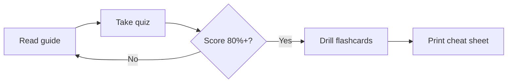

import Callout from '../../components/Callout.astro';
import KeyTerm from '../../components/KeyTerm.astro';
import Collapsible from '../../components/Collapsible.astro';
import Quiz from '../../components/Quiz.astro';
import Flashcards from '../../components/Flashcards.astro';

## Learning objectives

By the end of this guide you'll be able to:

- Navigate the IHHS Study Guide Hub fluently
- Use every interactive component to study smarter
- Know where to find each guide and how to share them with classmates

## TL;DR

This hub takes long-form notes and rebuilds them into an active-recall study system: deep explanations, then quizzes, then flashcards. Open any guide, read it, take the quiz, drill the cards, you're done.

## Glossary

<KeyTerm term="Active recall">The act of pulling information out of your brain (vs. re-reading it). Far more effective for memory.</KeyTerm> and <KeyTerm term="Spaced repetition">Reviewing material at increasing intervals so it sticks long-term.</KeyTerm> are the two pillars of how this hub is designed.

## Core concepts

### How a guide is structured

Every deep dive follows the same skeleton, so once you know one guide you know them all:

1. **Learning objectives**, what mastery looks like
2. **TL;DR**, the one-paragraph version
3. **Glossary**, every term you'll meet
4. **Core concepts**, sectioned explanations with examples
5. **Worked examples**, full step-by-step solutions
6. **Practice**, collapsible Q&A
7. **Self-quiz**, interactive multiple choice
8. **Flashcards**, drill the atoms
9. **Mnemonics and pitfalls**
10. **Cheat sheet**, print and pin to your wall

<Callout type="insight" title="Why this order">
The structure mirrors the **expansion to compression** loop your brain needs: first you broaden context, then you compress it into recallable chunks. Each section is a different angle on the same material.
</Callout>

### Reading the deep dive

The body of every guide is rich text with a few special elements:

<Callout type="definition" title="Inline definitions">
Hover any underlined term (like the ones in the Glossary above) to see its definition without leaving your spot.
</Callout>

<Callout type="theorem" title="Math support">
Equations render with KaTeX:
$$
e^{i\pi} + 1 = 0
$$
And inline like $f(x) = ax^2 + bx + c$.
</Callout>

<Callout type="warning" title="Watch out">
Code blocks are syntax-highlighted automatically:

```python
def study(guide):
    while not guide.understood:
        guide.read()
        guide.quiz()
        guide.flashcards.drill()
    return "ready for the test"
```
</Callout>

<Callout type="tip" title="Pro tip">
Press <kbd class="kbd">⌘K</kbd> (Mac) or <kbd class="kbd">Ctrl K</kbd> (Windows) anywhere to jump to any guide. Use it constantly.
</Callout>

### Diagrams

Mermaid diagrams render right inside guides:



## Worked example

**Goal:** memorize ten new vocab words by tomorrow.

1. **Open the guide** for that subject from the Library
2. **Read** the explanations (~10 min)
3. **Quiz yourself** at the bottom (~5 min)
4. **Flashcards** until you've marked everything "Got it" (~10 min)
5. **Sleep on it**, that's when it consolidates
6. **Re-quiz tomorrow morning** for one more pass

Total time investment: ~25 min for material that will stick for weeks.

## Practice

<Collapsible question="What's the fastest way to find a guide on photosynthesis?">
Press <kbd class="kbd">⌘K</kbd> or <kbd class="kbd">Ctrl K</kbd>, type "photo", and hit enter. The command palette searches across every guide's title, subject, and description.
</Collapsible>

<Collapsible question="Why are the quizzes only multiple choice instead of free response?">
Multiple choice gives instant feedback with zero ambiguity, which is what you need during a study session. The deep-dive text and worked examples are where free-form thinking happens.
</Collapsible>

<Collapsible question="My flashcard progress disappeared between sessions. Why?">
Right now flashcard progress is per-session only. Once you close the tab it resets. This is intentional for the first version: it keeps the hub completely free to host with no backend. Persistent progress could be added later if classmates want it.
</Collapsible>

## Self-quiz

<Quiz
  questions={[
    {
      q: "Which study technique does this hub primarily lean on?",
      choices: ["Re-reading until it sinks in", "Active recall + spaced repetition", "Highlighting and color-coding", "Cramming the night before"],
      answer: 1,
      explain: "Active recall (pulling info out via quizzes/flashcards) plus spaced repetition is the most evidence-backed combo for long-term retention."
    },
    {
      q: "What keyboard shortcut opens the search palette?",
      choices: ["Ctrl + F", "⌘K or Ctrl K", "Tab", "Ctrl + S"],
      answer: 1,
      explain: "⌘K / Ctrl K is the universal pattern for command palettes. Browser find (Ctrl+F) only searches the current page."
    },
    {
      q: "When should you take the quiz at the bottom of a guide?",
      choices: ["Before reading anything", "After reading the deep dive", "Only if you have spare time", "Never, it's optional"],
      answer: 1,
      explain: "Read first to build the model, then test yourself. Testing without context is just guessing; reading without testing leaves nothing in long-term memory."
    },
    {
      q: "What's the purpose of the cheat sheet at the bottom of each guide?",
      choices: ["A summary you read first", "A printable one-pager for last-minute review", "A list of references", "Bonus content"],
      answer: 1,
      explain: "The cheat sheet compresses the whole guide into a single page so you can scan it in 60 seconds before a test."
    }
  ]}
/>

## Flashcards

<Flashcards
  cards={[
    { front: "Active recall", back: "Pulling information out of memory rather than re-reading it. The single most effective study technique for long-term retention." },
    { front: "Spaced repetition", back: "Reviewing material at increasing intervals so it consolidates into long-term memory." },
    { front: "How to open search anywhere", back: "Press ⌘K (Mac) or Ctrl K (Windows). Type a few letters of any guide title or topic." },
    { front: "Order to study a guide in", back: "Read deep dive → take quiz → drill flashcards → re-quiz tomorrow." },
    { front: "What is the cheat sheet for?", back: "A printable one-page summary for last-minute review before a test." }
  ]}
/>

## Mnemonics

**RQF**, the loop: **R**ead, **Q**uiz, **F**lashcards. Repeat tomorrow.

## Common pitfalls

- **Skipping the quiz.** Reading without testing feels productive but doesn't move material into long-term memory.
- **Drilling flashcards once.** One pass marks them "seen," not "known." Repeat until you mark every card "Got it" without hesitation.
- **Studying in one giant block.** Break it across two days minimum. Sleep is when memory consolidates.

## Cheat sheet

| Step | What you do | Why |
|------|-------------|-----|
| 1 | Open guide from Library or ⌘K | Fast nav |
| 2 | Read deep dive | Build the model |
| 3 | Take the self-quiz | Surface gaps |
| 4 | Re-read sections you missed | Patch gaps |
| 5 | Drill flashcards | Compress to atoms |
| 6 | Print the cheat sheet | Quick reference |
| 7 | Re-quiz tomorrow | Lock in long-term |

That's the whole system. Now go pick a real guide from the [Library](/library) and try it.
