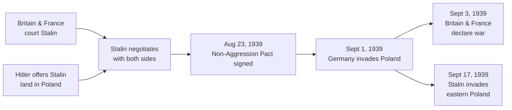
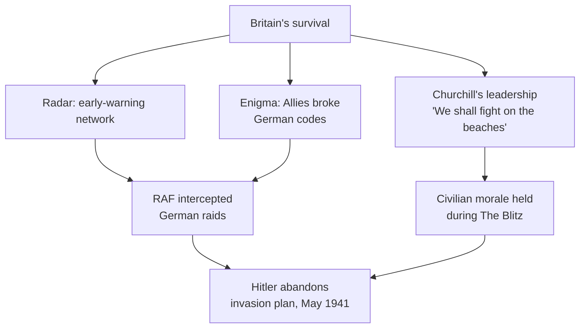
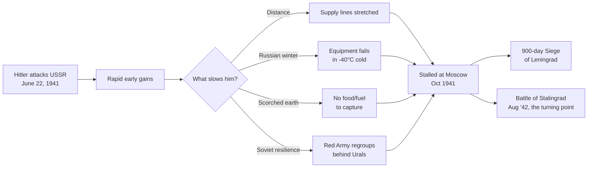
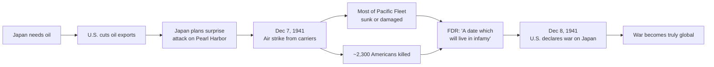
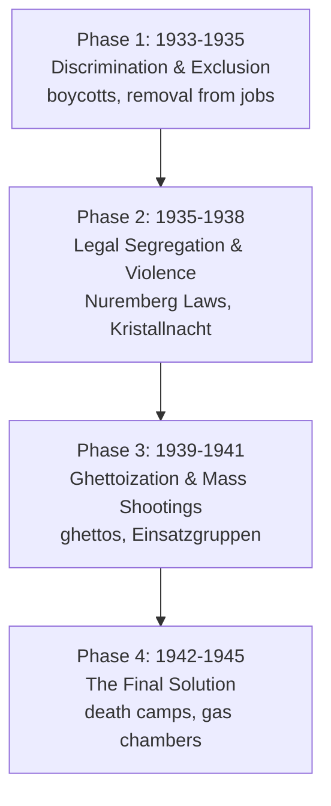
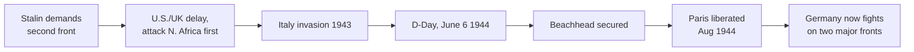
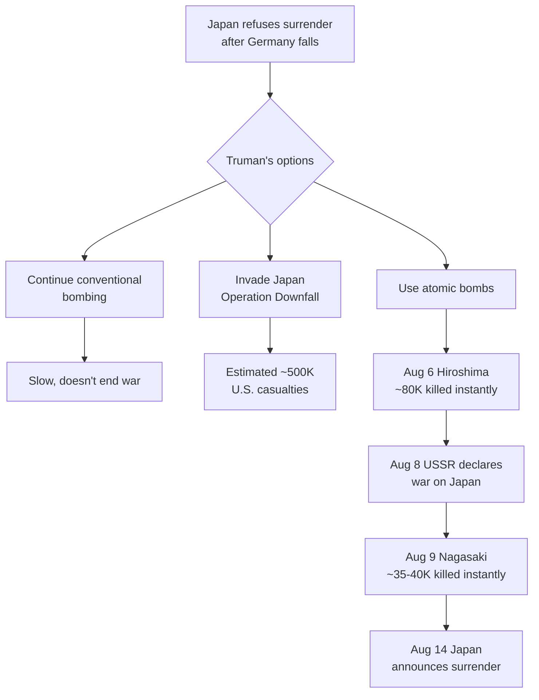
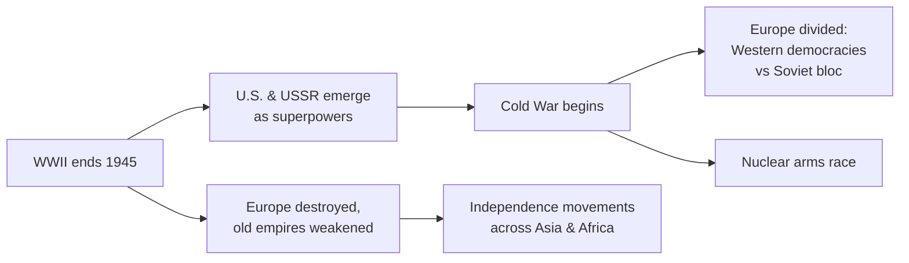

import Callout from '../../components/Callout.astro';
import KeyTerm from '../../components/KeyTerm.astro';
import Collapsible from '../../components/Collapsible.astro';
import Quiz from '../../components/Quiz.astro';
import Flashcards from '../../components/Flashcards.astro';
import MapView from '../../components/MapView.astro';
import Timeline from '../../components/Timeline.astro';
import Cesium from '../../components/Cesium.astro';

## Learning objectives

By the end of this guide you'll be able to:

- Explain how the collapse of collective security and the Non-Aggression Pact triggered the war
- Trace the full timeline of WWII across both the European and Pacific theaters
- Identify why blitzkrieg, radar, and code-breaking shaped early outcomes
- Distinguish concentration camps from death camps and explain the four phases of the Holocaust
- Pinpoint *why* Stalingrad, Midway, and D-Day were turning points (not just *that* they were)
- Analyze the decision to drop the atomic bomb on Japan
- Explain how WWII created a new world order and set the stage for the Cold War

## TL;DR

Hitler's Non-Aggression Pact with Stalin (Aug 1939) cleared the path to invade Poland on Sept 1, 1939. Germany conquered most of Europe with **blitzkrieg** but failed to break Britain (Battle of Britain, 1940) and bogged down in the USSR (Operation Barbarossa, 1941). Japan's attack on **Pearl Harbor** (Dec 7, 1941) made the war truly global. The tide turned in **1942-43** at Midway, Stalingrad, and El Alamein. **D-Day** (June 6, 1944) opened a second front. Germany surrendered May 7, 1945 (V-E Day). Atomic bombs on **Hiroshima and Nagasaki** forced Japan's surrender on August 14, 1945 (V-J Day). About **60 million people died**. The U.S. and Soviet Union emerged as superpowers, beginning the **Cold War**.

## The war on a globe

Drag to spin, scroll to zoom. Click any marker for context. The three glowing arcs show three of the most consequential operations: the Pearl Harbor strike that pulled the U.S. in, the D-Day invasion that opened the second front, and Operation Barbarossa, the German invasion that became Stalingrad.

<Cesium
  target={[30, 20, 18000000]}
  height={560}
  terrain="world"
  imagery="aerial-with-labels"
  markers={[
    { lat: 38.9072, lng: -77.0369, name: "Washington, DC", note: "Allied capital. The U.S. enters the war Dec 8, 1941." },
    { lat: 51.5074, lng: -0.1278, name: "London", note: "Allied capital. RAF headquarters during the Battle of Britain (1940)." },
    { lat: 55.7558, lng: 37.6173, name: "Moscow", note: "Allied capital. Soviet leadership coordinates the Eastern Front from here." },
    { lat: 52.5200, lng: 13.4050, name: "Berlin", note: "Axis capital. Nazi Germany's seat of power." },
    { lat: 41.9028, lng: 12.4964, name: "Rome", note: "Axis capital under Mussolini until 1943." },
    { lat: 35.6762, lng: 139.6503, name: "Tokyo", note: "Axis capital. Imperial Japan's command center." },
    { lat: 21.3650, lng: -157.9740, name: "Pearl Harbor", note: "Dec 7, 1941. The Japanese surprise attack brings the U.S. into the war." },
    { lat: 48.7080, lng: 44.5133, name: "Stalingrad", note: "Aug 1942 to Feb 1943. The Eastern Front turning point. ~2 million casualties." },
    { lat: 49.3700, lng: -0.8700, name: "Normandy", note: "D-Day, June 6, 1944. Largest amphibious invasion in history. Opens the second front." },
    { lat: 34.3853, lng: 132.4553, name: "Hiroshima", note: "Aug 6, 1945. First atomic bomb used in war. Nagasaki follows on Aug 9. Japan surrenders Aug 14." }
  ]}
  arcs={[
    { from: [35.6762, 139.6503], to: [21.3650, -157.9740], name: "Pearl Harbor strike, Dec 7, 1941" },
    { from: [50.8198, -1.0880], to: [49.3700, -0.8700], name: "D-Day, June 6, 1944" },
    { from: [52.5200, 13.4050], to: [48.7080, 44.5133], name: "Operation Barbarossa, June 1941" }
  ]}
/>

<Callout type="tip" title="Geography is the test answer">
  Many EOC questions are really geography questions in disguise. "Why did the Battle of Britain fail for Germany?" is partly because the English Channel separates the UK from continental Europe. "Why did Japan attack Pearl Harbor?" is partly because Hawaii is the closest U.S. naval base to Japan. Spin the globe and notice the distances.
</Callout>

## Master timeline

Use the arrows or the bottom rail to scrub through the war.

<Timeline
  title={{ headline: "World War II", text: "1939 to 1945" }}
  events={[
    { date: "1939-08-23", headline: "Non-Aggression Pact signed", text: "Hitler and Stalin agree not to attack each other and secretly divide Poland." },
    { date: "1939-09-01", headline: "Germany invades Poland", text: "Blitzkrieg crushes Poland in 3 weeks. World War II begins in Europe." },
    { date: "1939-09-03", headline: "Britain and France declare war on Germany" },
    { date: "1940-04-09", headline: "Germany invades Denmark and Norway", text: "The Phony War ends." },
    { date: "1940-05-26", headline: "Dunkirk evacuation", text: "Over 300,000 Allied troops are rescued across the English Channel." },
    { date: "1940-06-22", headline: "France surrenders", text: "Germany occupies the north; Vichy France set up in the south." },
    { date: "1940-08-13", headline: "Battle of Britain begins", text: "RAF defends British skies against the Luftwaffe." },
    { date: "1941-06-22", headline: "Operation Barbarossa", text: "Germany launches the largest land invasion in history into the USSR." },
    { date: "1941-09-08", headline: "Siege of Leningrad begins", text: "City surrounded for nearly 900 days. About 1 million civilians die." },
    { date: "1941-12-07", headline: "Pearl Harbor attacked", text: "Japan strikes Hawaii. The next day the U.S. declares war on Japan." },
    { date: "1942-04-18", headline: "Doolittle Raid on Tokyo", text: "Limited damage, huge morale boost." },
    { date: "1942-06-04", headline: "Battle of Midway", text: "U.S. destroys 4 Japanese carriers. The turning point of the Pacific War." },
    { date: "1942-08-07", headline: "Battle of Guadalcanal begins", text: "First major Allied land offensive against Japan." },
    { date: "1942-08-23", headline: "Battle of Stalingrad begins", text: "The most decisive battle of the European war." },
    { date: "1943-01-20", headline: "Wannsee Conference", text: "Nazi leaders coordinate the Final Solution." },
    { date: "1943-02-02", headline: "Germany surrenders at Stalingrad", text: "Permanent end of German offensive in the East." },
    { date: "1943-07-10", headline: "Allies invade Sicily", text: "Operation Husky begins the Italian campaign." },
    { date: "1944-06-06", headline: "D-Day", text: "Largest amphibious invasion in history. Second front opens in Western Europe." },
    { date: "1944-08-25", headline: "Paris liberated" },
    { date: "1944-12-16", headline: "Battle of the Bulge", text: "Hitler's last major offensive in the West." },
    { date: "1945-04-30", headline: "Hitler commits suicide" },
    { date: "1945-05-08", headline: "V-E Day", text: "Germany surrenders unconditionally." },
    { date: "1945-08-06", headline: "Hiroshima bombed", text: "About 80,000 killed instantly." },
    { date: "1945-08-09", headline: "Nagasaki bombed", text: "About 35,000-40,000 killed instantly." },
    { date: "1945-08-14", headline: "V-J Day", text: "Japan surrenders. World War II ends." },
  ]}
/>

### Map of the European theater

Click any marker to see what happened there.

<MapView
  title="Major sites in Europe and North Africa"
  center={[50, 10]}
  zoom={4}
  height="460px"
  markers={[
    { lat: 52.2297, lng: 21.0122, label: "Warsaw, Poland", year: "1939", popup: "Germany's invasion here started WWII." },
    { lat: 51.0500, lng: 2.3700, label: "Dunkirk", year: "1940", popup: "Over 300,000 Allied troops evacuated to Britain." },
    { lat: 48.8566, lng: 2.3522, label: "Paris", year: "1940 / 1944", popup: "Captured June 1940; liberated August 1944." },
    { lat: 51.5074, lng: -0.1278, label: "London", year: "1940-41", popup: "Heart of British resistance during The Blitz." },
    { lat: 49.4521, lng: 11.0767, label: "Nuremberg", year: "1935 / 1945-46", popup: "Site of the Nuremberg Laws (1935) and the postwar trials of Nazi leaders." },
    { lat: 59.9343, lng: 30.3351, label: "Leningrad (St Petersburg)", year: "1941-44", popup: "900-day Nazi siege; about 1 million civilians died." },
    { lat: 55.7558, lng: 37.6173, label: "Moscow", year: "1941", popup: "German advance stalled here in winter 1941." },
    { lat: 48.7080, lng: 44.5133, label: "Stalingrad (Volgograd)", year: "1942-43", popup: "Turning point of the Eastern Front. Germany surrendered Feb 2, 1943." },
    { lat: 50.0282, lng: 19.2026, label: "Auschwitz-Birkenau", year: "1940-45", popup: "Largest Nazi death camp. Over 1 million murdered here." },
    { lat: 49.2480, lng: -0.6989, label: "Normandy", year: "June 6, 1944", popup: "D-Day. Largest amphibious invasion in history." },
    { lat: 50.4501, lng: 5.8704, label: "Bastogne / Ardennes", year: "Dec 1944", popup: "Battle of the Bulge. Hitler's last major offensive in the West." },
    { lat: 52.5200, lng: 13.4050, label: "Berlin", year: "1945", popup: "Hitler died here April 30, 1945. City fell to Soviet forces." },
    { lat: 30.8025, lng: 28.9536, label: "El Alamein, Egypt", year: "1942", popup: "Allied victory turned the tide in North Africa." },
  ]}
/>

## Glossary

These are the terms you absolutely must know. Hover (or tap on mobile) any underlined term in the body for a quick definition.

- <KeyTerm term="Blitzkrieg">"Lightning war." Fast, coordinated attacks using tanks, planes, and infantry to overwhelm an enemy before they can mount a defense.</KeyTerm>
- <KeyTerm term="Non-Aggression Pact">Aug 23, 1939 agreement between Nazi Germany and the Soviet Union not to attack each other; secretly divided Poland between them.</KeyTerm>
- <KeyTerm term="Phony War">The seven-month lull (Sept 1939 to Apr 1940) after war was declared but before major fighting began. Also called "Sitzkrieg."</KeyTerm>
- <KeyTerm term="Luftwaffe">The German air force.</KeyTerm>
- <KeyTerm term="RAF">Royal Air Force, Britain's air force, defended British skies during the Battle of Britain.</KeyTerm>
- <KeyTerm term="The Blitz">German bombing campaign against British cities (esp. London) from 1940-41. An example of total war.</KeyTerm>
- <KeyTerm term="Axis Powers">Germany, Italy, Japan and their allies (Bulgaria, Romania, Hungary).</KeyTerm>
- <KeyTerm term="Operation Barbarossa">Germany's invasion of the Soviet Union, June 22, 1941. The largest land invasion in history.</KeyTerm>
- <KeyTerm term="Scorched-Earth Policy">Soviet strategy of destroying crops, supplies, and infrastructure as they retreated, denying resources to advancing Germans.</KeyTerm>
- <KeyTerm term="Lend-Lease Act">1941 U.S. law allowing the supply of weapons and material to Allied nations even before the U.S. entered the war.</KeyTerm>
- <KeyTerm term="Atlantic Charter">Aug 1941 declaration by Roosevelt and Churchill outlining shared war aims (self-determination, free trade).</KeyTerm>
- <KeyTerm term="Pearl Harbor">U.S. naval base in Hawaii attacked by Japan on Dec 7, 1941; pulled the U.S. into WWII.</KeyTerm>
- <KeyTerm term="Bataan Death March">Forced 55-mile march of 75,000 Allied POWs by Japan after the Philippines fell; ~16,000 died.</KeyTerm>
- <KeyTerm term="Doolittle Raid">April 1942 U.S. air raid on Tokyo. Limited damage but huge morale boost.</KeyTerm>
- <KeyTerm term="Battle of Midway">June 1942 naval battle that destroyed 4 Japanese carriers; the turning point in the Pacific.</KeyTerm>
- <KeyTerm term="Island-Hopping">U.S. strategy under MacArthur of capturing strategic islands while bypassing Japanese strongholds.</KeyTerm>
- <KeyTerm term="Kamikaze">Japanese suicide pilots who crashed planes into Allied ships.</KeyTerm>
- <KeyTerm term="Holocaust">The systematic, state-sponsored murder of six million Jews and millions of others by Nazi Germany.</KeyTerm>
- <KeyTerm term="Aryans">Nazi term for "Germanic" people they falsely promoted as a racially superior "master race."</KeyTerm>
- <KeyTerm term="Nuremberg Laws">1935 laws stripping Jews of German citizenship and banning intermarriage.</KeyTerm>
- <KeyTerm term="Kristallnacht">"Night of Broken Glass," Nov 9-10, 1938. Coordinated Nazi violence against Jewish homes, businesses, and synagogues.</KeyTerm>
- <KeyTerm term="Einsatzgruppen">Nazi mobile killing units that shot Jews, Roma, and Soviet officials in mass executions on the Eastern Front.</KeyTerm>
- <KeyTerm term="Final Solution">Coordinated Nazi plan (formalized at the Wannsee Conference, 1942) to exterminate all European Jews.</KeyTerm>
- <KeyTerm term="Death Camps">Camps built specifically for extermination (Auschwitz-Birkenau, Treblinka, etc.), distinct from labor-focused concentration camps.</KeyTerm>
- <KeyTerm term="Battle of Stalingrad">Aug 1942 to Feb 1943 battle that destroyed Germany's Eastern offensive. THE turning point in Europe.</KeyTerm>
- <KeyTerm term="D-Day">June 6, 1944 Allied invasion of Normandy, France. Largest amphibious invasion in history.</KeyTerm>
- <KeyTerm term="Battle of the Bulge">Dec 1944 to Jan 1945. Hitler's last major offensive in the West, which failed and exhausted Germany's reserves.</KeyTerm>
- <KeyTerm term="Total War">A war in which entire societies (economies, civilians, science) are mobilized for victory.</KeyTerm>
- <KeyTerm term="Manhattan Project">The secret U.S.-British program to develop the atomic bomb.</KeyTerm>
- <KeyTerm term="Nuremberg Trials">1945-46 international military tribunal that prosecuted Nazi leaders for crimes against humanity.</KeyTerm>
- <KeyTerm term="Article 9">Provision in postwar Japan's constitution renouncing war and prohibiting offensive military forces.</KeyTerm>

## 1. Collapse of collective security: how the war began (16.1)

<Callout type="insight" title="The setup">
After WWI, the League of Nations was supposed to keep the peace through collective security. By 1939 it had failed: Germany rearmed, Italy invaded Ethiopia, Japan invaded Manchuria, and Britain and France appeased Hitler at every step. The Non-Aggression Pact removed the last barrier.
</Callout>

### The Non-Aggression Pact (Aug 23, 1939)

Britain and France hoped to bring the USSR into an anti-Hitler alliance. Stalin played both sides, then shocked the world by signing a non-aggression pact with **Hitler** himself. The two ideological enemies (Fascist + Communist) agreed:

1. Not to attack each other
2. **Secretly**, to divide Poland between them

### Blitzkrieg ("lightning war")

Hitler invaded Poland with a new kind of warfare: fast-moving tanks (Panzers), divebombers (Stukas), and motorized infantry, all coordinated by radio. Poland fell in **three weeks**.

<Callout type="definition" title="Why blitzkrieg worked">
WWI had been about trenches, attrition, and slow advances. Blitzkrieg avoided that entirely. Concentrated force at one point, broke through, then encircled the enemy. Speed was the weapon.
</Callout>

### The Phony War and the fall of France

For seven months, Britain and France sat behind the **Maginot Line** waiting. This was the **Phony War** ("Sitzkrieg"). The lull ended in April 1940 when Germany invaded Denmark and Norway.

The French expected an attack through Belgium. Hitler instead sent his Panzers through the **Ardennes Forest**, terrain France considered impassable. The result:

| Date (1940) | Event |
|---|---|
| May 10 | Germany invades the Low Countries |
| May 26 - June 4 | **Dunkirk evacuation**: 300,000+ Allied troops rescued across the English Channel |
| June 14 | Germany captures Paris |
| June 22 | France surrenders |
| | Northern France occupied; southern France becomes the puppet state **Vichy France** |
| | General **Charles de Gaulle** sets up a French government-in-exile in London |

<Callout type="warning" title="Watch out">
Dunkirk was a *defeat* (Allied troops were forced to flee), but it preserved the army that would later return on D-Day. Don't confuse "evacuation" with "victory." The miracle was that anyone got out at all.
</Callout>

<Collapsible question="Why did the Non-Aggression Pact shock the world?">
Nazi Germany and Communist Soviet Union were ideological opposites and bitter enemies. Their cooperation suggested the existing alliances against fascism couldn't be trusted, and it gave Hitler a free hand to invade Poland without fear of a two-front war. Both sides bought time and territory at the expense of weaker neighbors.
</Collapsible>

## 2. Britain stands alone (16.1)

After the fall of France, **Britain** was the only major power still fighting Germany.

### The Battle of Britain (Operation Sea Lion)

Hitler needed to destroy the **RAF** before he could invade. The German **Luftwaffe** launched massive air attacks. Britain had three critical advantages:

### The Blitz

Failing to defeat the RAF, Germany shifted to bombing British cities: London, Coventry, and others. This was textbook **total war**: targeting civilians to break a society's will. It didn't work. By May 1941, Hitler called off the air campaign.

<Callout type="insight" title="Why this matters">
The Battle of Britain was the first major defeat for Hitler's Germany. It proved the German military was not invincible and kept Britain alive as a base of operations for everything that came later: the Lend-Lease arms flow, the bombing of Germany, and eventually D-Day.
</Callout>

### War in North Africa

Italy tried to seize the **Suez Canal** through Egypt. Britain pushed back. Hitler sent **Erwin Rommel** ("the Desert Fox") to help. The fighting was a back-and-forth desert campaign that the Allies eventually won in 1943.

## 3. Operation Barbarossa & the Eastern Front (16.1)

<Callout type="insight" title="The pattern the test rewards">
Hitler launched the largest land invasion in history, and made the same mistake **Napoleon** did in 1812. Recognizing this parallel is exactly the kind of analytical move your test wants.
</Callout>

### The setup: June 22, 1941

About 3 million Axis troops crossed the Soviet border on a 1,800-mile front. Hitler's goals:

- **Destroy the Red Army**
- Seize *Lebensraum* ("living space") for German settlers
- Exploit Soviet oil and grain
- Eliminate what Nazi ideology called "Judeo-Bolshevism"

### Three brutal episodes

| Episode | Dates | Outcome |
|---|---|---|
| **Siege of Leningrad** | Sep 1941 - Jan 1944 | City surrounded ~900 days. ~1 million civilians die of starvation. Never surrenders. |
| **Battle of Moscow** | Oct - Dec 1941 | Germans stalled in winter. Hitler refuses retreat. Momentum lost. |
| **Battle of Stalingrad** | Aug 1942 - Feb 1943 | German army surrounded and forced to surrender. Permanent end of German offensive in the East. |

<Callout type="warning" title="Don't confuse these">
The **Commissar Order** (1941) authorized executing captured Soviet political officers. It made the Eastern Front uniquely brutal but is a *separate* policy from the **Final Solution** (1942), which targeted European Jews. Both share Nazi ideology, but the test will trip you up if you mix them.
</Callout>

<Collapsible question="Why did Hitler's invasion of the USSR fail?">
He underestimated three things: **distance** (German supply lines stretched too far), **the Russian winter** (German equipment, uniforms, and lubricants failed in extreme cold), and **Soviet resilience** (the scorched-earth policy denied resources, and the Red Army was willing to absorb staggering losses to defend the homeland). Mnemonic: **D**istance, **W**inter, **R**esilience.
</Collapsible>

## 4. The U.S. path to war (16.1)

The U.S. tried to stay neutral. The pressure to engage rose steadily.

| Year | Action | Effect |
|---|---|---|
| 1935-37 | **Neutrality Acts** | Restricted U.S. arms sales and loans to combatants |
| 1941 | **Lend-Lease Act** | U.S. could supply Allied nations (a major shift away from neutrality) |
| Aug 1941 | **Atlantic Charter** | Roosevelt + Churchill agreed on shared war aims |
| Sept 1941 | German U-boat attacks U.S. destroyer | Undeclared naval war in the Atlantic |
| Dec 7, 1941 | **Pearl Harbor** | U.S. enters war the next day |

<Callout type="tip" title="Pattern to spot">
Each U.S. step away from neutrality wasn't dramatic on its own, but together they show a society moving from "stay out of it" to "we're already at war, just not officially." Pearl Harbor pushed the country across a line it was already approaching.
</Callout>

## 5. The Pacific War: expansion → turning point (16.2)

### Map of the Pacific theater

<MapView
  title="Major sites in the Pacific War"
  center={[15, 150]}
  zoom={3}
  height="460px"
  markers={[
    { lat: 21.3650, lng: -157.9500, label: "Pearl Harbor, Hawaii", year: "Dec 7, 1941", popup: "Japan's surprise air attack pulled the U.S. into WWII." },
    { lat: 35.6762, lng: 139.6503, label: "Tokyo, Japan", year: "April 1942", popup: "Doolittle Raid: 16 B-25s bombed Tokyo. Limited damage, huge morale boost." },
    { lat: 28.2074, lng: -177.3735, label: "Midway Atoll", year: "June 1942", popup: "U.S. destroyed 4 Japanese carriers. Turning point of the Pacific War." },
    { lat: -9.4438, lng: 159.9729, label: "Guadalcanal", year: "Aug 1942 - Feb 1943", popup: "First major Allied land offensive against Japan. Brutal jungle warfare." },
    { lat: -15.0000, lng: 155.0000, label: "Coral Sea", year: "May 1942", popup: "First naval battle fought entirely by aircraft carriers. Stopped Japanese expansion south." },
    { lat: 14.5995, lng: 120.9842, label: "Manila / Bataan", year: "1942", popup: "Bataan Death March: 75,000 Allied POWs forced to march 55 miles; ~16,000 died." },
    { lat: 24.7833, lng: 141.3167, label: "Iwo Jima", year: "Feb-Mar 1945", popup: "Iconic flag-raising battle. Cost: 26,000 U.S. casualties." },
    { lat: 26.5, lng: 128.0, label: "Okinawa", year: "Apr-Jun 1945", popup: "Last major battle. Kamikaze attacks. Convinced Truman to use the atomic bomb." },
    { lat: 34.3853, lng: 132.4553, label: "Hiroshima", year: "Aug 6, 1945", popup: "First atomic bomb dropped. About 80,000 killed instantly." },
    { lat: 32.7503, lng: 129.8779, label: "Nagasaki", year: "Aug 9, 1945", popup: "Second atomic bomb. About 35-40,000 killed instantly. Japan surrendered five days later." },
  ]}
/>

### Why Japan attacked

Japan was overcrowded and lacked **oil and rubber**. Imperial expansion was sold as the solution. After Japan invaded parts of China and Southeast Asia, the U.S. **cut off oil shipments**. This was an existential threat to Japan's military.

**Admiral Isoroku Yamamoto** proposed a daring plan: a surprise attack on Pearl Harbor to cripple the U.S. Pacific Fleet long enough for Japan to lock down an empire.

### Pearl Harbor: Dec 7, 1941

<Callout type="warning" title="Strategic flaw">
Pearl Harbor sank battleships but missed the **aircraft carriers** (which were out at sea). Within six months, those carriers would crush Japan at Midway. The "surprise" worked, but the blow wasn't fatal.
</Callout>

### Japan's empire and its brutality

Japan rapidly seized Hong Kong, Thailand, Guam, Wake Island, the Philippines, and the Dutch East Indies (oil). The **Bataan Death March** showed the brutal treatment of POWs: 75,000 Allied prisoners forced to march 55 miles, ~16,000 died.

### The Allies strike back: 3 key battles

| Battle | Date | Significance |
|---|---|---|
| **Doolittle Raid** | April 1942 | 16 B-25s bomb Tokyo. Limited damage, huge morale boost. Proved Japan was vulnerable. |
| **Battle of Coral Sea** | May 1942 | First naval battle fought entirely by aircraft carriers. Tactical draw, but stopped Japan's southward expansion. |
| **Battle of Midway** | June 1942 | U.S. codebreakers intercepted Japanese plans. **4 Japanese carriers and 332 planes destroyed**. THE turning point of the Pacific War. |

### Island-hopping

After Midway, **General Douglas MacArthur** led the Allied counter-offensive with **island-hopping**: capture strategic islands, skip heavily fortified ones, build bases closer and closer to Japan.

The first big test was **Guadalcanal** (Aug 1942 to Feb 1943), Japan's first major land defeat. Brutal jungle warfare. After Guadalcanal, the U.S. was on offense in the Pacific.

<Collapsible question="Why was Midway the turning point and not Pearl Harbor?">
Pearl Harbor was a strategic Japanese success that pulled the U.S. into the war. Midway was the moment Japan *lost the initiative*: their navy could never replace four aircraft carriers and 300+ trained pilots. From Midway forward, Japan was on defense and the U.S. on offense. Turning points in war are about *who controls momentum*, not who throws the first punch.
</Collapsible>

## 6. The Holocaust: a system of persecution (16.3)

<Callout type="insight" title="The pattern to recognize">
The Holocaust was not a single event. It was a four-phase escalation from legal discrimination to industrialized genocide. Spotting the *escalation pattern* is the analytical move the test rewards.
</Callout>

### The four phases

#### Phase 1: Discrimination & exclusion (1933-1935)

Hitler became Chancellor in 1933. Jewish businesses boycotted, Jews removed from civil service, law, medicine, education. **Goal:** isolate Jews from German society. Discrimination, not yet violence.

#### Phase 2: Legal segregation & violence (1935-1938)

- **Nuremberg Laws (1935):** stripped German citizenship from Jews, banned intermarriage
- **Forced emigration ("De-Jewification"):** Jews pressured to leave Germany. Strict immigration quotas in Britain, the U.S., and Latin America limited escape.
- **Kristallnacht (Nov 9-10, 1938):** "Night of Broken Glass." Coordinated Nazi attacks on synagogues, Jewish homes, and businesses. 30,000 Jewish men sent to concentration camps. Marks the shift from legal discrimination to organized state violence.

#### Phase 3: Ghettoization & mass shootings (1939-1941)

After invading Poland, Nazis forced Jews into sealed urban **ghettos**. Starvation and disease widespread. Concentration camps built for forced labor and imprisonment. The **Einsatzgruppen** (mobile killing units) followed the army into the USSR (1941) and shot Jews in mass executions: ~1 million Jews murdered in 1941 alone.

#### Phase 4: The Final Solution (1942-1945)

At the **Wannsee Conference (1942)**, Nazi leaders coordinated the systematic plan to exterminate all European Jews. **Death camps** (distinct from concentration camps) were built for industrial extermination using gas chambers and **Zyklon B**.

### Concentration camps vs death camps: critical distinction

| | Concentration camps | Death camps |
|---|---|---|
| **Primary purpose** | Forced labor, imprisonment | Mass extermination |
| **Examples** | Dachau, Buchenwald | Auschwitz-Birkenau, Treblinka, Sobibor, Belzec, Chelmno |
| **Phase** | All four phases | Phase 4 only (1942+) |
| **Survival** | Brutal but possible | Most arrivals killed within hours |

<Callout type="warning" title="A common test trap">
Concentration camp ≠ death camp. Auschwitz contained both (the camp had a labor section AND the Birkenau extermination facility). When the test asks about industrial genocide, the answer is **death camp** specifically.
</Callout>

### Scale of the loss

| Country | Pre-war Jewish pop. | Murdered | Survival rate |
|---|---|---|---|
| Poland | 3,300,000 | 2,800,000 | 15% |
| Soviet Union (occupied) | 2,100,000 | 1,500,000 | 29% |
| Hungary | 404,000 | 200,000 | 49% |
| Romania | 850,000 | 425,000 | 50% |
| Germany/Austria | 270,000 | 210,000 | 22% |

Total: ~6 million Jews murdered. Plus millions of Roma, disabled people, political prisoners, LGBTQ individuals, and Slavic civilians.

### Jewish resistance

Resistance was not only armed; it was cultural and spiritual. Secret schools, religious services, food-sharing networks. The **Warsaw Ghetto Uprising (1943)** saw Jewish fighters resist deportation for nearly a month. Camp revolts at **Sobibor** and **Treblinka**.

<Callout type="insight" title="Read this carefully">
"Resistance took many forms; survival itself was resistance." The point isn't just that some Jews fought back with weapons, it's that maintaining identity, faith, and community under conditions designed to destroy them was resistance.
</Callout>

### Righteous Among the Nations

Some non-Jews risked their lives to hide or rescue Jews. Their stories are remembered by the title "**Righteous Among the Nations**."

<Collapsible question="What was the significance of Kristallnacht?">
It marked the shift from *legal discrimination* (Phase 1-2) to *organized state violence* (Phase 2-3). After Kristallnacht, anti-Jewish persecution moved from the courts and offices into the streets. It was a preview of the systematic violence that would escalate into the Final Solution. The international response (mostly silence) showed the Nazis they could go further.
</Collapsible>

<Collapsible question="Why couldn't more Jews escape Nazi Europe?">
Strict immigration quotas in the U.S., Britain, and most of Latin America limited how many could enter. The 1939 voyage of the St. Louis, when the U.S. turned away a ship of Jewish refugees, is the most famous example. International indifference was a major factor in the death toll.
</Collapsible>

## 7. Turning points: 1942-1944 (16.4)

By late 1942, the war had three theaters in play. Three battles broke Axis momentum simultaneously.

### Stalingrad (Aug 1942 - Feb 1943): Europe

Industrial city on the Volga. Brutal street-to-street fighting. Germans controlled most of the city but were overstretched. In November 1942, the Soviets launched a massive counterattack and **encircled** the German army. Hitler refused to allow retreat. On Feb 2, 1943, Germany surrendered.

After Stalingrad, Germany was **permanently on the defensive in the East**.

### North Africa & Italy

Stalin demanded a **second front in France** to relieve pressure on the USSR. Instead the U.S. and Britain attacked **North Africa** first (1942-43), then invaded **Sicily** (Operation Husky, July 1943). Mussolini was overthrown. Italy surrendered Sept 3, 1943, but Germany occupied northern Italy and rescued Mussolini. Fighting in Italy was slow and costly. In April 1945, Italian resistance fighters captured and executed Mussolini.

### D-Day (June 6, 1944): the second front opens

Led by **General Dwight D. Eisenhower**, the Allies launched the largest amphibious invasion in history on the beaches of **Normandy, France**. A massive deception campaign convinced Germany the landing would be at Calais.

### Battle of the Bulge (Dec 1944 - Jan 1945)

Hitler's last major offensive in the West. Surprise attack through the **Ardennes** (the same forest as 1940). Initially successful against inexperienced U.S. troops, but Allied forces regrouped and pushed back. **Significance:** Germany exhausted its remaining reserves; the path to Berlin was now open.

### Germany surrenders

- April 30, 1945: Hitler commits suicide in his Berlin bunker
- May 7, 1945: Germany surrenders unconditionally
- May 8, 1945: **V-E Day** (Victory in Europe)

<Collapsible question="Why was Stalingrad the turning point in Europe and not D-Day?">
By the time of D-Day (June 1944), Germany was already on the defensive. Stalingrad (Feb 1943) is when the German offensive *first broke* and the initiative permanently shifted. D-Day was decisive but it accelerated a process that had already begun. Turning points mark moments of permanent momentum change, not the most dramatic single battles.
</Collapsible>

## 8. Total war and the home front (16.4)

<Callout type="definition" title="Total war">
A war in which entire societies (economies, civilians, science, propaganda) are mobilized for victory. Soldiers fight on the battlefield; everyone else fights at home.
</Callout>

### What total war required

- **Full economic mobilization:** Factories converted to war production
- **National unity:** Built through propaganda
- **Scientific innovation:** Radar, codebreaking, atomic research
- **Civilian sacrifice:** Rationing of food, gas, materials
- **New labor force:** Women and minorities entered industrial jobs in unprecedented numbers (Rosie the Riveter)

### Japanese American Internment

Fear after Pearl Harbor produced a serious civil-liberties failure. **Executive Order 9066 (1942)** authorized the forced relocation of about **120,000 Japanese Americans** to internment camps. Two-thirds were **U.S.-born citizens (Nisei)**. At the same time, Japanese Americans served with distinction in the U.S. military (the **442nd Regimental Combat Team**).

<Callout type="warning" title="Why this matters today">
Internment is the textbook example of the tension between national security and civil liberties. Decades later, the U.S. government formally apologized and paid reparations. The episode is a permanent reminder that fear can drive democracies to violate their own principles.
</Callout>

## 9. The atomic bomb decision (16.4)

### The Manhattan Project

A secret U.S.-British program (with Canadian support) to develop an atomic weapon, racing against rumored German efforts. Successful test in New Mexico, July 1945.

### Truman's decision

By summer 1945:
- Germany had surrendered (May 7)
- Japan was militarily exhausted but refusing to surrender
- U.S. leaders feared a costly invasion of Japan (Operation Downfall) could cost ~500,000 American lives
- Battles like **Iwo Jima** and **Okinawa** had shown how fanatically Japan would resist (kamikaze attacks were routine)

### Hiroshima & Nagasaki

| Date | City | Immediate deaths |
|---|---|---|
| Aug 6, 1945 | Hiroshima | ~80,000 (many more later from radiation) |
| Aug 9, 1945 | Nagasaki | ~35,000-40,000 |

Between the two bombings, the **Soviet Union declared war on Japan** (Aug 8), eliminating Japan's last hope of a negotiated peace.

### Surrender

Japanese military leaders were divided. **Emperor Hirohito** intervened, breaking a deadlocked cabinet. On Aug 14, 1945, Japan announced surrender. **V-J Day** marked the end of WWII.

<Collapsible question="Was the atomic bomb necessary?">
Historians still debate this. Arguments **for** use: it forced surrender quickly, avoided a costly invasion, and ended the war before more conventional bombing or famine killed even more people. Arguments **against** use: Japan was already near collapse, the Soviet entry alone might have forced surrender, and the bombs killed massive numbers of civilians (and started a nuclear arms race). Truman's official reasoning was the casualty estimate; later evidence suggests showing strength to the USSR may also have factored in.
</Collapsible>

## 10. Postwar consequences and the new world order (16.5)

### The scale of devastation

- ~60 million people died worldwide
- Millions displaced
- Major cities, factories, farmland, and infrastructure destroyed
- Economic collapse → food shortages, disease, unemployment

### Costs of WWII (selected)

| Country | Direct war costs (1994 $) | Military killed/missing | Civilians killed |
|---|---|---|---|
| United States | $288.0 B | 292,131 | (negligible) |
| Great Britain | $117.0 B | 272,311 | 60,595 |
| France | $111.3 B | 205,707 | 173,260 |
| USSR | $93.0 B | 13,600,000 | 7,720,000 |
| Germany | $212.3 B | 3,300,000 | 2,893,000 |
| Japan | $41.3 B | 1,140,429 | 953,000 |

The USSR suffered by far the greatest human cost.

### The Nuremberg Trials (1945-46)

International military tribunal that prosecuted **22 leading Nazi officials** for **crimes against humanity, war crimes, and crimes against peace**. 12 were sentenced to death.

<Callout type="theorem" title="Why this set a precedent">
Nuremberg established that **individuals**, not just nations, can be held responsible for war crimes. "Following orders" was rejected as a defense. This principle underlies modern international law and the International Criminal Court.
</Callout>

(Note: Hitler, Himmler, and Goebbels avoided trial by suicide.)

### The U.S. occupation of Japan

Led by **General Douglas MacArthur**. Four major reforms:

1. **Demilitarization:** Armed forces disbanded; military leaders removed
2. **Democratization:** New constitution created a constitutional monarchy. Emperor became symbolic. Bicameral parliament (the **Diet**) selects the Prime Minister. Women gained the vote.
3. **Economic reform:** Land redistributed; industry shifted from military to civilian production
4. **Article 9:** Japan renounced war and was prohibited from maintaining offensive military forces

The occupation officially ended in 1952.

### The new global order

WWII didn't just end a war: it created a new world. The U.S. and USSR became superpowers. Europe was divided between Western democracies and Soviet-controlled Eastern Europe. Colonial empires (British, French, Dutch) weakened, accelerating independence movements. The **Cold War** began.

## Worked example

**Question:** "Explain why the Battle of Stalingrad is considered a turning point in WWII, and compare it to one other turning point of your choice."

**Step-by-step:**

1. **Define turning point.** A moment when the strategic momentum of a war permanently shifts.
2. **Establish what changed at Stalingrad.** Before: Germany was on offense in the East, advancing into Soviet territory. After: Germany was on permanent defense, retreating until Berlin fell. The shift was permanent.
3. **Identify the *mechanism* of change.** Germany's army was *encircled and forced to surrender*, losing irreplaceable manpower (~91,000 prisoners taken; 100,000s killed). Combined with overstretched supply lines, the Wehrmacht couldn't recover.
4. **Compare to another turning point.** Midway (June 1942) is the best comparison: it ended Japan's naval dominance by destroying 4 carriers and 300+ pilots in a single battle. Like Stalingrad, the loss was *unrecoverable*. Unlike Stalingrad, it was a single-day battle, not a months-long siege.
5. **Synthesize.** Both turning points share the same logic: a defeat large enough that the losing side could *never recover the initiative*. They differ in scale (Midway: hours; Stalingrad: 6 months) and theater (Pacific naval vs Eastern European land), but they share the structural feature that defines a turning point.

**Answer template:** "Stalingrad was a turning point because [strategic momentum permanently shifted from Germany to the USSR]. The mechanism was [encirclement, forced surrender, and unrecoverable losses]. Midway is a parallel case in the Pacific because [Japan lost 4 carriers it could never replace]. Both share the structural pattern of a defeat that destroys the loser's ability to *take the initiative* again."

## Practice

<Collapsible question="How did the Non-Aggression Pact enable WWII to begin?">
By securing Stalin's neutrality, Hitler removed the threat of a two-front war. Without it, Germany would have hesitated to invade Poland for fear of Soviet intervention. The secret protocol also gave Stalin eastern Poland, motivating his cooperation. Within a week of signing, Germany invaded.
</Collapsible>

<Collapsible question="Why did the Phony War end the way it did?">
Britain and France hoped Germany would stop after Poland. Hitler used the lull to plan his next moves. When he attacked Denmark and Norway (April 1940) and then the Low Countries and France (May 1940), the Allies were caught flat-footed; their defensive Maginot Line was bypassed entirely.
</Collapsible>

<Collapsible question="What were Britain's three key advantages in the Battle of Britain?">
1. **Radar:** Early-warning networks let the RAF know where Luftwaffe attacks were coming. 2. **Enigma codebreaking:** Allied intelligence read German communications. 3. **Churchill's leadership:** His speeches sustained civilian morale through The Blitz. Together these meant Germany could never gain air superiority over Britain.
</Collapsible>

<Collapsible question="Why was Pearl Harbor a strategic miscalculation despite its tactical success?">
Tactically: Japan sank or damaged most of the Pacific battleship fleet. Strategically: it pulled the U.S. (the largest industrial power in the world) into the war, transformed American public opinion overnight, and missed the aircraft carriers (which would crush Japan at Midway six months later). Yamamoto reportedly worried they had "awakened a sleeping giant."
</Collapsible>

<Collapsible question="What distinguishes a death camp from a concentration camp?">
Concentration camps existed throughout Nazi rule (1933+) for forced labor and imprisonment. Death camps were built later (Phase 4, 1942+) specifically for systematic extermination, primarily through gas chambers using Zyklon B. Auschwitz contained both: a labor camp AND the Birkenau death camp.
</Collapsible>

<Collapsible question="Why did the Allies open a second front in North Africa instead of France in 1942?">
Stalin demanded a French front to relieve pressure on the USSR. The U.S. and Britain calculated they weren't ready: invading Western Europe in 1942 would likely fail. North Africa was a softer target that still drew Axis resources, secured Mediterranean shipping, and gave Allied forces invaluable amphibious-landing experience that paid off on D-Day in 1944.
</Collapsible>

<Collapsible question="What does Article 9 of postwar Japan's constitution prevent?">
Japan officially renounces war and is prohibited from maintaining offensive military forces. (It maintains a Self-Defense Force.) Article 9 was designed by U.S. occupation authorities to ensure Japan could never again threaten its neighbors. It remains controversial in Japan today.
</Collapsible>

## Self-quiz

<Quiz
  questions={[
    {
      q: "What event officially started World War II in Europe?",
      choices: [
        "Germany's invasion of Czechoslovakia",
        "Germany's invasion of Poland on Sept 1, 1939",
        "The Munich Conference",
        "Germany's invasion of France"
      ],
      answer: 1,
      explain: "Germany invaded Poland on Sept 1, 1939. Britain and France declared war two days later."
    },
    {
      q: "Why did Stalin sign a Non-Aggression Pact with Hitler in 1939?",
      choices: [
        "Because the USSR shared Nazi ideology",
        "To buy time, gain territory in Poland, and avoid a two-front war",
        "Because Britain refused to ally with the USSR",
        "To prevent Germany from invading the USSR"
      ],
      answer: 1,
      explain: "Stalin negotiated with both sides and got the best deal he could. The secret protocol gave him eastern Poland and bought time before the inevitable German attack (which came in 1941)."
    },
    {
      q: "What made blitzkrieg different from WWI-style warfare?",
      choices: [
        "It used trenches more effectively",
        "Speed and combined-arms attacks (tanks + planes + infantry) avoided trench stalemates",
        "It targeted only civilian populations",
        "It relied entirely on naval power"
      ],
      answer: 1,
      explain: "Blitzkrieg concentrated tanks, dive bombers, and motorized infantry to break through enemy lines fast, then encircle them. It was the opposite of WWI's slow attritional trench warfare."
    },
    {
      q: "Which of the following gave Britain a critical advantage in the Battle of Britain?",
      choices: [
        "Larger air force than Germany",
        "American military intervention",
        "Radar and Enigma code-breaking",
        "Naval blockade of Germany"
      ],
      answer: 2,
      explain: "Radar gave early warning of German raids. Enigma codebreaking let Britain read German communications. Combined with Churchill's leadership, these advantages let the smaller RAF outfight the Luftwaffe."
    },
    {
      q: "What was Hitler's stated goal for invading the Soviet Union (Operation Barbarossa)?",
      choices: [
        "Defensive: protect Germany from Soviet invasion",
        "Destroy the Red Army and seize 'Lebensraum' (living space)",
        "Create an alliance against Britain",
        "Force the USSR to surrender Poland"
      ],
      answer: 1,
      explain: "Hitler considered the USSR his 'ultimate prize.' He wanted to destroy the Red Army and seize land for German settlers (Lebensraum)."
    },
    {
      q: "Why is the Battle of Midway considered the turning point of the Pacific War?",
      choices: [
        "It was the first U.S. attack on Japan",
        "It destroyed 4 Japanese aircraft carriers and ended Japanese naval dominance",
        "It ended the war",
        "It captured Tokyo"
      ],
      answer: 1,
      explain: "U.S. codebreakers anticipated Japan's plan. The U.S. destroyed 4 Japanese carriers and 332 planes. Japan could not replace those losses. From Midway forward, the U.S. was on offense."
    },
    {
      q: "What was the strategic purpose of MacArthur's island-hopping strategy?",
      choices: [
        "To capture every Japanese-held island",
        "To capture key islands and bypass strongholds, building bases closer to Japan",
        "To negotiate a peace with Japan",
        "To rescue POWs"
      ],
      answer: 1,
      explain: "Island-hopping skipped heavily defended Japanese positions, capturing only those needed for airfields and supply bases. This let the U.S. advance toward Japan faster with fewer casualties."
    },
    {
      q: "Which event marked the shift from legal discrimination to organized violence in the Holocaust?",
      choices: [
        "The Nuremberg Laws (1935)",
        "Kristallnacht (1938)",
        "The Wannsee Conference (1942)",
        "The invasion of Poland"
      ],
      answer: 1,
      explain: "Kristallnacht ('Night of Broken Glass') saw coordinated state-supported violence against Jewish homes, businesses, and synagogues. It marked the transition from segregation laws to organized violence."
    },
    {
      q: "What is the key difference between concentration camps and death camps?",
      choices: [
        "Concentration camps were larger",
        "Concentration camps were for forced labor; death camps were built specifically for extermination",
        "Death camps held only political prisoners",
        "There is no difference"
      ],
      answer: 1,
      explain: "Concentration camps existed throughout Nazi rule for forced labor and imprisonment. Death camps were built later (Phase 4) for systematic extermination, primarily using gas chambers."
    },
    {
      q: "Where was the Final Solution coordinated?",
      choices: [
        "The Munich Conference",
        "The Wannsee Conference (1942)",
        "Berlin Olympics (1936)",
        "Yalta Conference (1945)"
      ],
      answer: 1,
      explain: "At the Wannsee Conference in Jan 1942, Nazi leaders coordinated the systematic plan to exterminate all European Jews."
    },
    {
      q: "Why is the Battle of Stalingrad considered the turning point in Europe?",
      choices: [
        "It captured Berlin",
        "After it, Germany was permanently on the defensive in the East",
        "It ended the war",
        "It liberated France"
      ],
      answer: 1,
      explain: "The German army was encircled and forced to surrender. Losses were unrecoverable. From Feb 1943 forward, Germany was always retreating in the East."
    },
    {
      q: "What was D-Day?",
      choices: [
        "The bombing of Germany",
        "The June 6, 1944 Allied invasion of Normandy, the largest amphibious invasion in history",
        "The Soviet invasion of Berlin",
        "Japan's surrender"
      ],
      answer: 1,
      explain: "Operation Overlord landed Allied forces on the beaches of Normandy, France. It opened the long-awaited second front and began the liberation of Western Europe."
    },
    {
      q: "What was the significance of the Battle of the Bulge?",
      choices: [
        "Germany's first victory of the war",
        "Hitler's last major offensive in the West, which exhausted Germany's reserves",
        "The first Allied invasion of Germany",
        "Japan's first major defeat"
      ],
      answer: 1,
      explain: "Germany's surprise attack through the Ardennes initially succeeded but Allied forces regrouped. The offensive used up Germany's last reserves and cleared the path to Berlin."
    },
    {
      q: "What civil-liberties failure occurred on the U.S. home front during WWII?",
      choices: [
        "The Sedition Act",
        "Internment of about 120,000 Japanese Americans (two-thirds U.S. citizens) under Executive Order 9066",
        "The draft",
        "Rationing of food"
      ],
      answer: 1,
      explain: "Executive Order 9066 (1942) authorized forced relocation of 120,000 Japanese Americans, two-thirds of them U.S.-born citizens, into internment camps. The U.S. government later apologized and paid reparations."
    },
    {
      q: "What principle did the Nuremberg Trials establish?",
      choices: [
        "Nations cannot be tried for war crimes",
        "Individuals (not just nations) can be held responsible for war crimes",
        "Only military leaders can be tried",
        "War crimes do not exist in international law"
      ],
      answer: 1,
      explain: "Nuremberg held that individuals are responsible for war crimes; 'following orders' was rejected as a defense. This precedent underlies modern international law."
    },
    {
      q: "Which two superpowers emerged from WWII?",
      choices: [
        "Britain and France",
        "United States and Soviet Union",
        "Germany and Japan",
        "China and India"
      ],
      answer: 1,
      explain: "The U.S. (industrially intact) and the USSR (massive land army, occupying Eastern Europe) emerged as the dominant powers. Their rivalry became the Cold War."
    }
  ]}
/>

## Flashcards

<Flashcards
  cards={[
    { front: "Non-Aggression Pact", back: "Aug 23, 1939 agreement between Hitler and Stalin not to attack each other; secretly divided Poland between Germany and the USSR." },
    { front: "Blitzkrieg", back: "'Lightning war.' Fast coordinated tank, plane, and infantry attacks that overwhelm an enemy before they can mount a defense." },
    { front: "Phony War (Sitzkrieg)", back: "The seven-month lull from Sept 1939 to Apr 1940 between the start of WWII and major fighting in the West." },
    { front: "Maginot Line", back: "Heavily fortified French defensive line built between WWI and WWII. Germany bypassed it through the Ardennes Forest in 1940." },
    { front: "Dunkirk", back: "May-June 1940 evacuation of 300,000+ Allied troops from France across the English Channel. A defeat that preserved the army that returned on D-Day." },
    { front: "Vichy France", back: "Puppet state in southern France set up by Germany after France's surrender (June 1940), led by Marshal Pétain." },
    { front: "Charles de Gaulle", back: "French general who formed the French government-in-exile in London after the fall of France." },
    { front: "Battle of Britain", back: "1940 air war between the German Luftwaffe and the British RAF. The first major German defeat of WWII." },
    { front: "Operation Sea Lion", back: "Hitler's planned invasion of Britain. Required destroying the RAF first, which failed." },
    { front: "Luftwaffe", back: "The German air force." },
    { front: "RAF (Royal Air Force)", back: "Britain's air force; defended the skies during the Battle of Britain." },
    { front: "Radar", back: "Early-warning system that let the RAF intercept incoming Luftwaffe raids during the Battle of Britain." },
    { front: "Enigma", back: "German military code that British codebreakers (at Bletchley Park) cracked, giving the Allies major intelligence advantages." },
    { front: "The Blitz", back: "German bombing campaign against British cities (1940-41). A textbook example of total war." },
    { front: "Winston Churchill", back: "British Prime Minister whose speeches sustained morale during the Battle of Britain and The Blitz." },
    { front: "Erwin Rommel", back: "German general nicknamed 'the Desert Fox' who led Axis forces in North Africa." },
    { front: "Operation Barbarossa", back: "Germany's invasion of the USSR, June 22, 1941. The largest land invasion in history." },
    { front: "Lebensraum", back: "Nazi term for 'living space.' Hitler's stated goal in invading Eastern Europe and the USSR." },
    { front: "Scorched-Earth Policy", back: "Soviet strategy of destroying crops, supplies, and infrastructure as they retreated, denying resources to advancing Germans." },
    { front: "Siege of Leningrad", back: "900-day Nazi siege (Sept 1941 to Jan 1944). About 1 million civilians died of starvation. The city never surrendered." },
    { front: "Battle of Moscow", back: "Oct-Dec 1941. German forces stalled in winter conditions outside Moscow, ending German momentum on the Eastern Front." },
    { front: "Commissar Order", back: "1941 Nazi directive authorizing the execution of captured Soviet political officers. Made the Eastern Front uniquely brutal." },
    { front: "Neutrality Acts (1935-37)", back: "U.S. laws restricting arms sales and loans to nations at war." },
    { front: "Lend-Lease Act (1941)", back: "U.S. law allowing the U.S. to supply Allied nations with weapons and material before formally entering WWII." },
    { front: "Atlantic Charter", back: "Aug 1941 declaration by Roosevelt and Churchill outlining shared war aims (self-determination, free trade)." },
    { front: "Pearl Harbor", back: "U.S. naval base in Hawaii. Japan launched a surprise air attack on Dec 7, 1941, killing ~2,300 Americans and pulling the U.S. into WWII." },
    { front: "Admiral Yamamoto", back: "Japanese admiral who proposed and planned the Pearl Harbor attack." },
    { front: "Bataan Death March", back: "After the Philippines fell, Japan forced 75,000 Allied POWs on a brutal 55-mile march; ~16,000 died." },
    { front: "Doolittle Raid", back: "April 1942 U.S. air raid on Tokyo led by Lt. Col. James Doolittle. Limited damage but huge morale boost." },
    { front: "Battle of Coral Sea", back: "May 1942. First naval battle fought entirely by aircraft carriers. A tactical draw that stopped Japan's southward expansion." },
    { front: "Battle of Midway", back: "June 1942 naval battle. The U.S. destroyed 4 Japanese carriers and 332 planes. THE turning point in the Pacific." },
    { front: "Island-Hopping", back: "U.S. strategy under General MacArthur of capturing strategic Pacific islands while bypassing heavily fortified Japanese positions." },
    { front: "General Douglas MacArthur", back: "U.S. general who led Pacific island-hopping strategy and later the U.S. occupation of Japan." },
    { front: "Battle of Guadalcanal", back: "Aug 1942 to Feb 1943. First major Allied land offensive against Japan. Marked Japan's first major land defeat." },
    { front: "Kamikaze", back: "Japanese suicide pilots who deliberately crashed their planes into Allied ships, especially at Iwo Jima and Okinawa." },
    { front: "Holocaust", back: "The systematic, state-sponsored murder of six million Jews and millions of others by Nazi Germany." },
    { front: "Aryans", back: "Nazi term for Germanic people they falsely promoted as a racially superior 'master race.'" },
    { front: "Nuremberg Laws (1935)", back: "Nazi laws stripping Jews of German citizenship and banning intermarriage between Jews and non-Jews." },
    { front: "Kristallnacht (Nov 9-10, 1938)", back: "'Night of Broken Glass.' Coordinated Nazi violence against Jewish synagogues, homes, and businesses. Marks the shift to organized violence." },
    { front: "Ghettoization", back: "Phase 3 of the Holocaust. Jews in Poland and Eastern Europe forced into sealed urban ghettos with mass starvation and disease." },
    { front: "Concentration Camps", back: "Camps for forced labor and imprisonment. Used throughout Nazi rule (1933+)." },
    { front: "Einsatzgruppen", back: "Nazi mobile killing units that followed the German army into the USSR (1941) and shot Jews in mass executions." },
    { front: "Wannsee Conference (1942)", back: "Meeting where Nazi leaders coordinated 'The Final Solution' (the systematic extermination of European Jews)." },
    { front: "Final Solution", back: "Nazi plan to exterminate all European Jews. Began Phase 4 of the Holocaust." },
    { front: "Death Camps", back: "Camps built specifically for industrial extermination (e.g., Auschwitz-Birkenau, Treblinka, Sobibor). Distinct from labor concentration camps." },
    { front: "Zyklon B", back: "Cyanide-based gas used by the Nazis in death-camp gas chambers." },
    { front: "Warsaw Ghetto Uprising (1943)", back: "Jewish armed resistance against Nazi deportation that lasted nearly a month before being crushed. Symbol of Jewish resistance and dignity." },
    { front: "Battle of Stalingrad", back: "Aug 1942 to Feb 1943. German army surrounded and forced to surrender. THE turning point in Europe." },
    { front: "Second Front", back: "Stalin's demand for an Allied invasion of Western Europe to relieve pressure on the USSR. Eventually opened on D-Day, June 6, 1944." },
    { front: "Operation Husky", back: "July 1943 Allied invasion of Sicily that led to Mussolini's overthrow." },
    { front: "D-Day (Operation Overlord)", back: "June 6, 1944. Allied invasion of Normandy, France. Largest amphibious invasion in history. Led by General Eisenhower." },
    { front: "General Dwight D. Eisenhower", back: "Supreme commander of Allied forces in Europe; led D-Day. Later U.S. president." },
    { front: "Battle of the Bulge", back: "Dec 1944 to Jan 1945. Hitler's last major offensive in the West, through the Ardennes. Failed and exhausted Germany's reserves." },
    { front: "V-E Day", back: "May 8, 1945. Victory in Europe. Germany surrendered after Hitler's suicide on April 30." },
    { front: "Total War", back: "A war in which entire societies (economies, civilians, science, propaganda) are mobilized for victory." },
    { front: "Executive Order 9066", back: "1942 U.S. order authorizing the forced relocation of about 120,000 Japanese Americans (two-thirds U.S.-born citizens) into internment camps." },
    { front: "Manhattan Project", back: "Secret U.S.-British program that developed the atomic bomb. Successful test July 1945 in New Mexico." },
    { front: "Hiroshima", back: "Japanese city bombed Aug 6, 1945; ~80,000 killed instantly. First wartime use of an atomic weapon." },
    { front: "Nagasaki", back: "Japanese city bombed Aug 9, 1945; ~35,000-40,000 killed instantly. Second and last wartime use of an atomic weapon." },
    { front: "Emperor Hirohito", back: "Japanese emperor who broke a deadlocked cabinet to announce surrender on Aug 14, 1945." },
    { front: "V-J Day", back: "Aug 14, 1945. Japan announced surrender, ending WWII." },
    { front: "Nuremberg Trials (1945-46)", back: "International tribunal that prosecuted 22 Nazi leaders for crimes against humanity, war crimes, and crimes against peace. 12 sentenced to death." },
    { front: "Article 9", back: "Provision in postwar Japan's constitution renouncing war and prohibiting offensive military forces." },
    { front: "Diet (Japan)", back: "Bicameral parliament established under Japan's postwar constitution. Selects the Prime Minister." },
    { front: "Cold War", back: "Postwar political and ideological rivalry between the United States and the Soviet Union." }
  ]}
/>

## Mnemonics

- **DWR** (why Hitler lost in the East): **D**istance, **W**inter, **R**esilience. The same three reasons Napoleon lost in 1812.
- **The 4 Holocaust phases**: **D**iscriminate → **L**egislate → **G**hettoize → **E**xterminate. ("Don't Let Genocide Escalate.")
- **Pacific turning point trio**: **C**oral Sea (stops Japan south) → **M**idway (destroys Japanese carriers) → **G**uadalcanal (first Japanese land defeat). **CMG**.
- **D-Day's commanders**: **E**isenhower commanded the **E**uropean theater. **MacArthur** commanded the **M**iddle/Pacific. (Both start with the same letter as their theater.)
- **End of war dates**: **V-E** Day = May 8 (5/8). **V-J** Day = Aug 14 (8/14). May before August, like the alphabetical M before A... wait, alphabetize them by event: Europe surrendered first, then Japan.

## Common pitfalls

- **Saying Pearl Harbor "started" WWII.** It started U.S. involvement. The war began Sept 1, 1939 with the German invasion of Poland.
- **Confusing concentration camps with death camps.** Concentration camps existed for labor and imprisonment from 1933. Death camps were built specifically for extermination starting in Phase 4 (1942+). Auschwitz contained both.
- **Calling Stalingrad "the turning point of WWII"** without qualification. It was the turning point in **Europe**. **Midway** was the turning point in the **Pacific**. Different theaters, different turning points.
- **Treating the Holocaust as a sudden event.** It was a four-phase escalation over 12 years. The pattern matters as much as the outcome.
- **Forgetting the USSR's role.** The U.S. tends to remember D-Day; about 80% of all German military casualties were on the Eastern Front. The USSR lost ~20+ million people. The Eastern Front did most of the bleeding to defeat Germany.
- **Treating Japanese internment as a footnote.** It's the standard test example of the tension between civil liberties and national security. Worth a paragraph, not a sentence.
- **Thinking the atomic bombs alone forced Japan's surrender.** The Soviet declaration of war (Aug 8, between Hiroshima and Nagasaki) eliminated Japan's last hope of a negotiated peace. Most historians now treat the bombs and the Soviet entry as joint causes.

## Cheat sheet

| Topic | Key fact |
|---|---|
| War begins | Sept 1, 1939: Germany invades Poland |
| Non-Aggression Pact | Aug 23, 1939: Hitler-Stalin agreement; secretly divided Poland |
| Blitzkrieg | Tanks + planes + infantry, fast |
| France falls | June 1940; Vichy France in south |
| Battle of Britain | 1940; RAF wins thanks to radar + Enigma |
| Operation Barbarossa | June 22, 1941; Germany invades USSR |
| Pearl Harbor | Dec 7, 1941; Japan attacks; U.S. enters war |
| Holocaust phases | 4: Discriminate → Legislate → Ghettoize → Exterminate |
| Death camps | Auschwitz-Birkenau, Treblinka, Sobibor, Belzec, Chelmno |
| Wannsee Conference | 1942: Final Solution coordinated |
| Pacific turning point | Battle of Midway, June 1942 |
| Europe turning point | Battle of Stalingrad, Aug '42 to Feb '43 |
| Operation Husky | July 1943: Allies invade Sicily |
| D-Day | June 6, 1944; Eisenhower; Normandy |
| Battle of the Bulge | Dec 1944; Hitler's last offensive; failed |
| Hitler's suicide | April 30, 1945 |
| V-E Day | May 8, 1945 (Germany surrenders) |
| Hiroshima | Aug 6, 1945 |
| Nagasaki | Aug 9, 1945 |
| Soviet entry | Aug 8, 1945 (between bombs) |
| V-J Day | Aug 14, 1945 (Japan surrenders) |
| Total deaths | ~60 million worldwide |
| Nuremberg Trials | 1945-46; 22 Nazi leaders tried; 12 executed |
| Japan reforms | Demilitarization, Democratization, Economic, Article 9 |
| New superpowers | U.S. and USSR → Cold War |

That's everything. Print this cheat sheet and pin it to your wall the night before the test.
